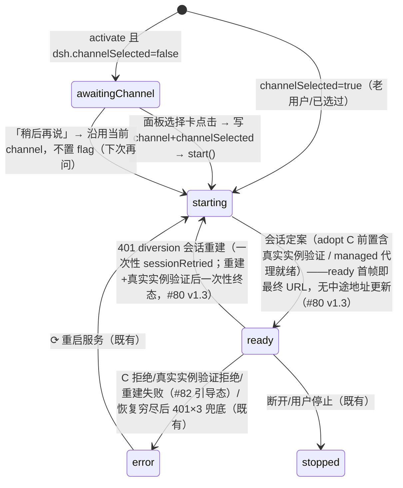
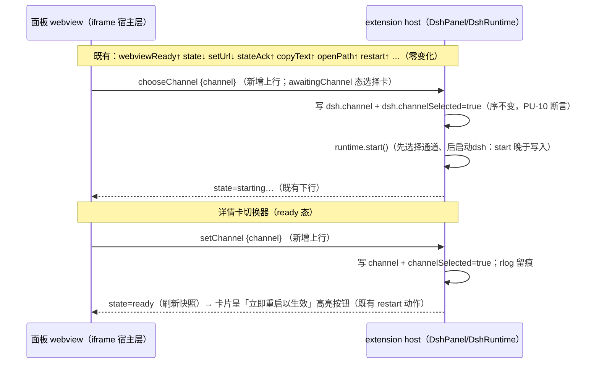

# 0.1.15 修复设计：0.1.14 真机验收失败根因分析与修复（P-ACCEPT-FIX）

> 版本 **v1.5**（架构师，用户评审 round 2 两张截图再改判，2026-09-02；v1.4 = QA 设计门控 r3 表述级勘正；v1.3 = 用户二次评审 r3 两条反馈修订；v1.2 = 测试失败回环 r1 + QA 设计门控 r1 回环收尾修订）。触发 = 0.1.14 真机验收**失败**（用户 7 条意见全数记录在案，第 7 条情绪表达记录不回应）；本设计含**真实实例实验定案**（对运行中 pid 2392 的只读 GET 取证，零写入零干扰）。
> **v1.1 增补**：并入用户追加的**问题 8**（会话面板 4 按钮「dsh 配置 / open in browser / restart runtime / stop runtime」全部失效）——速览表 5→8 项 P0-P2 重排、§2.4 面板壳历史取证、§3.5 根因、§5.6 按钮全链与禁用矩阵、ADR-35、清单 #90-#92、判据 PP-11/PU-11/RV-16-11..13；E-FIX 组扩至 **E-FX-0…11**。
> **v1.2 增补**：并入用户追加的**问题 9**（verbatim 留档：「还有 dsh 配置面板里的 "重启dsh" 按钮也不工作」）——与问题 8 **同根因族**（页脚本死链的第二 webview 实例：详情卡）；扩展侧处理器取证**完备**（webviewDetails.ts L128-130），「消息被会话面板 handler 独占/漏接」假说排除；§3.5-6、§5.6、#90 增量、PP-11/PU-11 扩展、RV-16-14、E-FX-0…12。**v1.2 收尾修订注（QA r1 回环，audit = `.dsh/tmp/audits/qa_design_0115_r1.json`）**：FAIL-1 已于前稿闭环（RV-16-14 详情卡端到端 + #90-④ 存活诊断 + PP-11-1/PU-11-2 详情卡断言，本轮复核在案）、FAIL-2 恢复为**待用户裁决**（#85 容器 title，§5.4.1 + 裁决表/ADR-34/PU-10-3/RV-16-8 全链联动）；MINOR-1（#81 补注 adopt 全 4 调用点 L339/L383/L397/L779）、MINOR-2（live-probe.mjs 提示文案勘误实测 171）、SUGG-1（RV-16-9 补「关窗=停」语义回归）、SUGG-2（RV-16-11 取证口径补 title「·booted」判别点）逐项闭环；§3.5-5 问题 9 升格「用户确认症状」——问题 9 深度定案合并入本版定稿。
> **v1.3 增补（用户二次评审 r3 两条反馈，verbatim 留档）**：① **「两个 DSH」截图定案**——用户提供二级侧栏截图（E-FX-13）：顶栏两个 "DSH" = 第一个**视图容器标题**（`viewsContainers.secondarySidebar[0].title`）+ 第二个**视图标题**（VSCode 在容器名旁渲染当前视图名）；后者**本应显示 manifest 的「DSH 配置」**（installed 0.1.14 manifest 实测在案），实际渲染 "DSH"（无省略号）——**用户否定「窄 tab 截断」解释，v1.2 §5.4/E-FX-7 截断定案作废**。重定根因（§5.4：候选 a 代码运行时赋值经全量复核排除 → VSCode 侧视图标题渲染回退）→ 修法改向 = **resolve 处理器显式 `view.title`**（details「DSH 配置」/ panel「DSH 会话」，与 manifest 对齐）→ 顶栏变「DSH + DSH 配置/DSH 会话」、重复观感消除，**容器保持「DSH」（0.1.13 裁决不动）→ 容器 A/B 裁决整组消解**（§5.4/§5.4.1/ADR-34/ADR-36/#85/PU-10-3/RV-16-8/速览表 Q4/§5.5 映射 = QA r1 审计 E1-E9 九处联动面全部改写为无条件定案）；② **401 修复简化**（用户 verbatim：「面板 401 的修复方案，状态机没啥问题，可以做简单实现，地址栏信息和面板信息不需要急于显示地址，可以保持 starting 状态，等 ready 或者 error 再渲染最终信息。不要搞复杂设计」）——**撤销 v1.2 #80 的 notifySurfaceChange/emit 机制**，改「`this.url` 只在会话定案时赋值 + starting 保持至定案 + ready/error **一次性终态渲染**（无中途地址更新）」；401 diversion 恢复升级为可见转换 ready→starting→ready/error（§3.4/#80/#81/PP-10-1/RV-16-1/2/10 联动；判定表 #6 行语义不变）；EVIDENCE 补 E-FX-13 + E-FX-7 勘误注。
> **v1.4 勘正注（QA 设计门控 r3 回环，audit = `.dsh/tmp/audits/qa_design_0115_r3.json`；18 findings = 13 PASS / 2 FAIL / 3 NOTE）**：机制零改动、纯表述勘正——① PP-10-3「url 保持裸值」→「url 保持 null（无地址渲染）」（v1.2 残留与 #80①「失败→保持 null」/#82「面板无地址渲染」/RV-16-6 相抵，判据是实施契约不得与定案矛盾）；② 清单 #82「恢复路径语义不变」→「恢复路径保留；语义按 #80③ 升级为可见转换」（与 §3.4-#82/#80③ 对齐）；③ 顺带落实 QA 两处澄清注（判定表 #6「直连」、RV-16-10 并存注记）。
> **v1.5 再改判注（用户评审 round 2，两张新截图定案 E-FX-15）**：**「顶栏两个 DSH」结构再改判**——两张新截图（页签一点开 = dsh 配置卡；页签二点开 = 会话面板 + 裸 URL 401 现场）证明：两个「DSH」= **并列的两个视图页签**（页签一 = `dsh.details`、页签二 = `dsh.panel`，页签序为用户拖动后布局），**并非 v1.3 所判「第一个 = 容器标题 + 第二个 = 视图标题」并排（该解读作废）**；**两个页签都发生标题回退**（均渲染容器同值 "DSH"），修法覆盖两个视图（#85 原本即两视图都设 title，**实施清单零变化**），容器保持「DSH」（0.1.13 裁决不动）。附带新发现：详情卡「启动时间」字段与进程真实启动时刻不符（E-FX-15，列 RV-16-14 附带核对）。用户已批准进入开发并确认顶栏修法（2026-09-02）。
> 历史定稿零改动：`docs/0.1.14设计方案-通道选择与token适配.md`（v1.1）保持原样——本文档引用其 §号时以「0.1.14§」标注；根因取证行级记录见 `.dsh/tmp/architect/r219-research/EVIDENCE.md` **E-FIX 组**。
> 状态：**修订后 r5（开发已获批）**（用户评审 round 2 截图再改判已并入 v1.5：开发批准 + 顶栏修法确认均已于 2026-09-02 拍板；待 QA r5 增量复审 → 开发 #80-#92）。

---

## 〇、一页速览（评审入口——只读本段即可做通过/不通过决定）

### 0.1 一句话总结

**0.1.14 的 C 路径（凭证本地生成会话）在真机上根本是好的**——本轮真实实例实验证明本地生成 cookie 对用户被接管的 dsh（pid 2392, alpha.3）**实测 200**；面板 401 的真凶是**插件自己的 UI 通知链断裂**：接管路径先把裸 URL 写死进面板 iframe，之后换上正确的代理 URL 时**静默不通知**（状态机 ready→ready 去重），面板永远停在裸 URL 上撞 401。

**问题 8（用户追加）另立 P0，与 401 相互独立**：面板 4 按钮从未工作过——**面板页脚本自 0.1.6 结构定稿起就是死的**（按钮绑定在 `acquireVsCodeApi` 提前 return 之后，真机 runtime.log 六会话零 `recv webviewReady` 实锤；历史缺陷，非 0.1.14 引入）。修法定案三层：CSP 补 `webview.cspSource`（两处）+ 绑定先于 API 检查 + 诊断必须可见（#90）——**#90 是 #83 选择卡 / #84 切换器的硬前置**（所有面板上行消息都骑在这条脚本上）。

**问题 9（用户追加）与问题 8 同根因族，第二 webview 实例**：DSH 配置（详情卡）面板的「重启 dsh」按钮不工作——扩展侧链路**完备**（webviewDetails.ts L128-130 `restart` 处理器 → `dsh.restart`，与会话面板 ⟳ 同一命令；两 webview 独立消息通道，「独占/漏接」假说排除），断点同在**页面脚本层**（详情卡 CSP L183 同样缺 `cspSource`），且**更静默**（null-safe + try/catch「never break the card」设计吞掉全部失败信号，零诊断、零日志）。#90 修复面已含两处 CSP，另补详情卡存活诊断。

### 0.2 九问题速览表（P0→P2 重排；用户验收意见 + 问题 8/9 → 结论 + 修法）

| 优先 | # | 问题（来源） | 结论（一句） | 修法（条目号） |
|---|---|---|---|---|
| **P0** | **Q8** | **面板 4 按钮全失效**（问题 8，用户追加：dsh 配置 / open in browser / restart runtime / stop runtime） | **历史死链，与 401 无关**：按钮绑定（webviewHtml.ts L105-108）在 `acquireVsCodeApi` typeof 提前 return（L74-80）**之后**，页脚本从未完成握手（runtime.log 六会话零 `recv webviewReady`）→ 绑定永不执行；死亡诊断写进初始隐藏层（L21/L60）零感知 | 三层修复：两处 CSP 补 `webview.cspSource` + 绑定先于检查 + 诊断可见（**#90**）；路由纯模块 + 禁用矩阵（#91）；**#83/#84 的硬前置** |
| **P0** | **Q9** | **配置面板「重启 dsh」按钮不工作**（问题 9，用户追加：「还有 dsh 配置面板里的 "重启dsh" 按钮也不工作」） | **与 Q8 同根因族（第二 webview 实例）**：扩展侧处理器完备（webviewDetails.ts L128-130 → dsh.restart，与会话面板 ⟳ 同命令；「独占/漏接」假说排除），断点 = 详情卡页脚本死亡（CSP L183 缺 cspSource），且更静默（零诊断、零日志） | 复用 #90（详情卡 CSP cspSource + 存活诊断「消息桥不可用」）；验收 RV-16-14 |
| **P0** | Q1 | **面板 401**「dsh web authentication required…」（第 5 条，核心） | C 路径密码学无罪（真实实例 200 实证 E-FX-4/5）；真因 = `runtime.ts` adopt 裸 URL 起手（L691/L699）+ URL 切换静默（L611 零 emit × L231 ready 去重 × webview L56 仅 state 驱动 refresh）→ iframe 永停裸 3080 | adopt 会话 C 路径**前置**（starting 保持至会话定案，ready **一次性**终态渲染、首帧即最终 URL——v1.3 简化：无 emit 机制）+ C 本地生成后**立即真实实例验证**，不过 = 诚实降级（#80/#81/#82；**不依赖 #90**——bake 路径无脚本也可换 URL） |
| P1 | Q2 | **通道选择一次性**（第 1、4 条：QuickPick 错过就没入口、「特别傻逼」） | v1.1 的「必须 QuickPick」时序论证有误——面板可先渲染选择页、点击后再 start（runtime 构造 ≠ 启动） | 推翻 QuickPick 主形态：state 机新增 `awaitingChannel`，面板内选择卡；`dsh.chooseChannel` 降为辅助入口（#83/#86；**前置 = #90**） |
| P1 | Q3 | **DSH 配置面板没有切换通道功能**（第 4 条） | 真实功能缺口——v1.1 只有 QuickPick + 命令，详情卡无切换器 | 详情卡新增常驻通道切换区：当前通道高亮、点选即写、一键重启生效（#84；上行消息依赖 #90） |
| P1 | Q6 | **接管既有 dsh 服务**（第 2 条「也算及格」） | 无缺陷——发现与防误杀语义正常，保留为专项回归面 | RV-16-1 接管专项回归（并入按钮链 RV-16-11） |
| P2 | Q4 | **两个面板标签都是「DSH」**（第 3 条） | **根因再改判（v1.5 两张新截图定案 E-FX-15）**：两个「DSH」= **并列的两个视图页签**（页签一点开 = dsh 配置卡；页签二点开 = 会话面板），**非「容器标题+视图标题」并排（v1.3 解读作废）**——两页签**都**标题回退（manifest 名「DSH 会话/DSH 配置」在案而均渲染 "DSH"；**非截断**，v1.2 作废维持） | **resolve 处理器显式 `view.title`×2**（「DSH 会话」/「DSH 配置」，与 manifest 对齐，#85 修法不变）→ 顶栏两页签 = 「DSH 会话」「DSH 配置」，重复观感消除；**容器保持「DSH」（0.1.13 裁决不动，§5.4）** |
| P2 | Q5 | **联调步骤③④⑤⑥全不符合预期**（第 6 条） | 逐项归因（§5.5）：主体是 Q1 的下游（同一条通知链断裂），独立缺陷 = Q3 功能缺口 + Q8 按钮死链，独立边界 = Q4 渲染；接管本身无缺陷 | 修复归属与复测预期见 §5.5 映射表 |
| P2 | Q1b | **「在浏览器打开」若触及必 401**（Q1 同族） | adopt 场景 externalUrl=null → 发裸 URL（必 401） | adopt+token 场景改引导提示、不打开裸页（#87；managed 场景行为不变） |

### 0.3 为什么这样修（不修的后果）

- **只修「假装能配」不动真格**：现状 = runtime 日志全「成功」（C 本地生成/listening/panel url switched）而面板 401——观测到的情况与真实情况脱节，比明确失败更糟。本设计把「本地生成成功」升级为「**本地生成后立即向上游验证一次**」，验证不过就不切 URL、不走代理、面板明确呈现引导（**禁止保留看起来能配但真实实例 401 的现状**）。
- **adopt 短路是设计盲区**：0.1.14§3.3 判定表 5 态只覆盖 managed 自启链；接管外部实例走的是判定表之外的第五条路（adopt 直连起手），其「401 分流事后升级」依赖 UI 能感知升级——而升级恰恰不产生任何状态事件。**判定表修订（§四）把 adopt 收编为一等行**。
- **「能显示」≠「能交互」（问题 8 的制度化教训）**：bake 路径让面板六个版本「看起来正常」，页脚本死亡零暴露——本轮把**页脚本存活**（runtime.log 首现 `recv webviewReady`）立为验收首信号（RV-16-11），并把「诊断必须可见」写入修复三层（ADR-35）。
- **通道选择体验**：首启选择页放面板内（用户始终可见、可回退、可稍后），比进程级 QuickPick（一闪而过、错过即失）强；「先选择通道、后启动dsh」硬约束不变——选择的**生效点**仍是 dsh 启动前。

### 0.4 兼容与安全承诺（继承 0.1.14）

- latest/next 旧契约**逐位零变化**（#81 的 adopt 前置以 probe 结果为闸门：裸 probe 200 = 旧契约直连，零新增面）。
- registry 零新增字段、token/cookie 仍不落盘（D3 不变）；凭证文件仍只读绝不写回；新增的真实实例验证 = **一次只读 GET**（与既有 probe 同权限范围）。
- 面板消息协议**只加不改**（新增 `chooseChannel`/`setChannel` 两条上行消息 + `awaitingChannel` 状态值；既有消息形状零变化）。

### 0.5 评审请求

请对「一页速览」做通过/不通过决定；根因细节见 §三、UX 见 §五、清单见 §七、判据见 §八。通过后进 QA 设计门控 → 用户评审 → 开发实施（0.1.15）。

---

## 一、裁决与状态记录

| 事项 | 状态 |
|---|---|
| 0.1.14 真机验收 | **失败**（用户 7 条，2026-09-02）；第 2 条「接管既有 dsh 服务」用户评「也算及格」——接管发现与防误杀语义保留 |
| 设计类文档载体 | 用户已裁决：**新开独立文档**（本文档）；0.1.14 设计方案 v1.1 历史定稿零改动 |
| v1.1 的 QuickPick 主形态裁决（0.1.14§2.2-④） | **本文档推翻**（用户裁决 > 时序论证；时序论证本身有误，见 §六决策记录 ADR-31） |
| C 路径真实实例有效性（v1.1 遗留「真机最终判定归 RV-15-4」） | **已定案：真实实例有效**（E-FX-4/5 真实实例实验，2026-09-02）——不再是待判项 |
| 问题 8（用户 2026-09-02 追加：面板 4 按钮全失效，要求全链修复） | **并入本轮**（v1.1）：P0 排位（一切面板交互的公共前置）；历史遗留定性（§2.4/§3.5）；修法 = ADR-35 三层 + #90/#91 |
| 问题 9（用户 2026-09-02 追加，verbatim：「还有 dsh 配置面板里的 "重启dsh" 按钮也不工作」） | **并入本轮**（v1.2）：与问题 8 同根因族（第二 webview 实例，§3.5-6）；扩展侧处理器取证完备、「独占/漏接」假说排除；修法 = #90 增量（详情卡 CSP + 存活诊断），验收 RV-16-14 |
| 「两个 DSH」根因与容器 title 裁决（QA r1 FAIL-2 曾恢复待裁决） | **已消解（v1.3，v1.5 再改判收尾）**：根因 = **两个视图页签标题均渲染回退**（v1.5 两张新截图定案：两页签并列、容器名不占页签位，E-FX-15；v1.3「第一个 = 容器标题」解读作废；非截断维持）；修法 = resolve 显式 `view.title`×2（#85 实施零变化），**容器保持「DSH」（0.1.13 裁决不动）**——§5.4/§5.4.1/ADR-34/ADR-36/#85/PU-10-3/RV-16-8/速览表 Q4/§5.5 映射九处联动改写 |
| 401 修复形态（用户二次评审 r3 verbatim 留档于版本行） | **简化定案（v1.3）**：撤销 URL 变更 emit 机制；starting 保持至会话定案，ready/error **一次性终态渲染**（无中途地址更新）——#80/#81/PP-10-1/RV-16-1/2/10 联动改写，判定表 #6 行语义不变 |

---

## 二、取证事实基线（全部只读；行级原文见 EVIDENCE E-FIX 组）

### 2.1 运行实例与时间线

| 事实 | 值 | 取证 |
|---|---|---|
| 被接管进程 | pid **2392**，node.exe，port 3080 | instance.json + Get-Process（只读） |
| **2392 实际启动时刻** | **2026-09-01 12:30:33.032（本地）** | `Get-Process -Id 2392` StartTime；旁证：`~/.dsh/profiles` mtime 2026-09-01 12:30:35（profile boot 写入 +2s） |
| instance.json startedAt | 2026-09-02T01:35:42Z（本地 09:35:42） | = **插件接管时刻**，非进程启动（接管写记录时刻） |
| `.credentials.yaml` | 270B，mtime 2026-08-31 10:32:49 | QA r3 + 本轮复测一致 |
| 2392 的 dsh 版本 | **0.1.2-alpha.3**（npx 缓存 package.json） | runtime.log processCommandLine 同源路径 |
| 2392 的 harness home | **`C:\Users\wangbaikang\.dsh`（默认 home）** | 本会话 shell 由 2392 的 dsh 注入 `$env:DSH_HOME` 同值（真实实例旁证） |
| **时间线判定** | credentials（08-31）**早于** 2392 启动（09-01）26 小时 | → 2392 激活时 record 已存在 → **幂等保留 → 文件 secret ≡ 进程 secret** |

### 2.2 dsh 上游契约定案（monorepo 源码 file:line）

| 项 | 定案 | 源 |
|---|---|---|
| secret 写入策略 | **幂等保留、不轮换**：已有 record → 校验后原样保留；缺失 → 首次创建。生成时机 = `BrowserAuth.create`（Connection 激活期，即 dsh web 启动链） | `browser-auth.ts` L161-178 + README.zh L37 |
| 运行中校验用哪份 secret | **激活时一次性加载进内存**，同步验签，**不重读文件**；「文件 secret ≠ 进程 secret」矛盾态**原理上存在**（激活后文件被替换 → 下次激活才生效），但**用户场景不成立**（2.1 时间线） | L182-184 注释 + L191/L210-216 + README.zh L37「删除或替换该记录在下一次激活时生效」 |
| cookie 名 authority 派生 | `dsh-auth-` + base64url(sha256(authority))；authority = **每请求从 Host 头**派生 `new URL('http://'+host).host`（WHATWG 归一化：hostname 小写、默认端口剥离；不含路径/协议）。本地生成用 `127.0.0.1:3080` 与 authProxy 的 Host 重写（R3）**同值一致** | L70-78（requestAuthority）+ L106-108（cookieName） |
| cookie 值与验签 | `v1.<b64url(JSON{version,authority,issuedAt,expiresAt})>.<b64url(HMAC-SHA256(secret,body))>`；验签 = HMAC 对发送 body 重算 → payload.authority 精确绑定 → 时间窗（issuedAt≤now<expiresAt，跨度≤30d）。**无时钟容忍度设计**（同机时钟零偏差，不受影响）；**无固定长度要求**（勘正 E-PR-4：实测 171 字符，「126/173」系探针模拟输入数字） | L129-132（encodeCookie）+ L134-159（decodeCookie）+ L289-302（isAuthenticated） |
| 拒绝路径 | 无/坏 cookie → **401**（body 即用户所见文案，L304-312）；trust 栅栏（Host/Origin）失败 → **403 先于 401**（E-TRUST-2 不变）；token 入口成功 → **303** | L240-282 + L304-312 |

### 2.3 决定性真实实例实验（本轮新增；对 2392 只读 GET，零写入零干扰）

1. **裸 GET / → 401**——复现用户症状（对照基线）。
2. **用 0.1.14 编译产物（out/authProxy.js，与 VSIX 同构）本地生成 cookie → GET / → 200 + `__DSH_BOOT__=true`**——**C 路径真实实例有效**；文件 secret ≡ 进程 secret 同源实锤。
3. **负面对照**（同 secret、authority 换 proxy 端口 46684）→ 401——authority 绑定真实实例成立。
4. **startAuthProxy 端到端**（127.0.0.1 随机端口 → 3080，注入本地生成 cookie）→ **经代理 GET / 200**、GET /api/ 404（栅栏已过、路径不存在）——**proxy 转发环节亦无罪**。

**推论**：密码学面（secret/authority/HMAC/时间窗）与 proxy 面全部健康；401 只能来自**面板没有用上这条链**（§三根因）。

### 2.4 面板壳历史取证（问题 8；全部只读）

| 事实 | 值 | 取证 |
|---|---|---|
| 真机面板握手 | runtime.log（109,861B）6 个窗口会话（08-31→09-02）仅 `emit state=…`/`re-bake html`，**零 `recv webviewReady`/`recv stateAck`** | `%LOCALAPPDATA%\DshVscode\logs\runtime.log` |
| 按钮绑定位置 | `src/webviewHtml.ts` 4 按钮（L54-58）的绑定 **L105-108** 位于 `typeof acquireVsCodeApi !== 'function'` 提前 return（**L74-80**）**之后**；握手 post（webviewReady）同在 return 之后 | src 行级 |
| 死亡诊断可见性 | 死亡分支文案写入 overlay（L77-78），而 overlay 初始 `class="hide"`（L21/L60）→ **用户零感知** | src 行级 |
| HEAD（64d06d9）结构 | 与工作区同构（同 CSP `script-src 'unsafe-inline'`、同提前 return、同绑定次序）；触及 webviewHtml.ts 的提交仅 e8fb8db（0.1.6）+ 64d06d9（0.1.12） | `git log -p`（只读，E-FX-10） |
| 0.1.13/0.1.14 工作区改动 | 仅文案级（「DSH 详情」→「DSH 配置」），结构零变化 | 工作区 diff（只读） |
| 装包产物逐位一致 | 0.1.14 VSIX 内 out/webviewHtml.js ≡ 工作区编译产物（SHA256 `50FB2B09…57706`）——排除「装包产物 ≠ 源码」 | tar 只读解包 + SHA256（E-FX-10） |
| 0.1.4 冻结案 | v3 复核 L86/L129：用户见纯 `initializing…`（非「webview API unavailable」）→ 当年判「页面 JS 未执行」；v4 把最终地址直接写入 src（f859313，0.1.5）**救显示未救脚本** | `docs/archive/面板卡Initializing根因分析-v3-0.1.4真机复核.md` |
| 详情卡（问题 9）按钮链 | 按钮 = webviewHtml.ts **L268**（ready-external 卡）/ **L317**（ready-managed 卡）/ L163（error 卡「重试（重启 dsh）」）/ L172（stopped 卡「重连」），均 `data-action="restart"`；事件委托 L223-234 → `post({type:'restart'})`（L232）；**扩展侧完备** = webviewDetails.ts L57-59 **独立** onDidReceiveMessage + L128-130 → `dsh.restart`；脚本 null-safe L221-222（vscode=null → post() 静默） | src 行级（E-FX-12） |

**判定**：问题 8 = **历史遗留（0.1.6 起同构），非 0.1.14 引入**；0.1.14 验收首次把按钮纳入目视面才暴露。

---

## 三、P0 根因分析（Q1：面板 401；file:line 级）

### 3.1 根因链（六步）

1. **接管短路**：`start()` step2 探到外部 3080 真实实例（401 = alive）→ `adopt()`（`src/runtime.ts` **L689-701**）——`this.url = 裸 http://127.0.0.1:3080`（**L691**）+ `setState('ready')`（**L699**），**零契约判定、零 proxy、零 C 路径**（`this.contract` 保持构造默认 `'unknown'`，**L206**——契约判定只在 managed 链 L474 发生）。
2. **面板写死裸 URL**：ready emit → `refresh()`（`src/webview.ts` L152-167）→ html re-bake + setUrl —— **iframe `src` 写死为裸 3080**。浏览器直连裸 URL 无 cookie → 上游 401 → **用户看到「dsh web authentication required…」**。
3. **401 分流事后升级**：probe tick（L829-842）→ `reestablishSession()`（**L655-670**）→ 无 banner log → C 路径 `mintCookieFromCredentials()`（**L620-635**，成功）→ `establishProxy({cookie})`（**L605-618**）。
4. **URL 切换静默**：`establishProxy` **L611 `this.url = proxy URL` 是纯属性赋值——零 emit**；日志「panel url switched to http://127.0.0.1:46684」只落 runtime.log。
5. **状态机去重吞掉唯一的通知机会**：`setState` **L231 `if (this.state === s) return`** —— adopt 已 ready，升级后仍 ready，**ready→ready 不 emit**；下个 probe tick cookie 探活 200 → **L824-827 静默 return**（只清零计数器，无任何 setState）。
6. **面板订阅事件收尾**：`webview.ts` **L56 `runtime.on('state', () => this.refresh())`** —— refresh **仅由 state emit 驱动**。结论：**面板永远收不到 proxy URL，iframe 停在裸 3080，401 永续**。runtime 侧日志全「成功」与 UI 永不更新并存——与全部真机取证吻合（E-FX-6）。

### 3.2 判定表 5 态的「接管短路」盲区（任务书判定）

**是盲区，定案**。0.1.14§3.3 判定表 #1-#5 全部以 managed 链为前提（判定输入 = `SpawnedInfo.resolved.version`，spawn 前定案）；adopt 会话**无版本可判**，落在表外：#3 行让 adopt「旧契约直连起手 + 401 分流升级」，但**「升级完成后 UI 如何感知」没有被任何一行设计**——升级只改 `this.url`，而 url 不是状态。修订见 §四（新增 #6 行 + #3 行收窄）。

### 3.3 A 路径（managed 自启 + banner 捕获）为何没走到

用户的 2392 先于插件存在 → `start()` step1/step2 探测即中 → **adopt 短路了 launchManaged**，banner 永远不存在（launchToken 在外部进程自己内存里，插件无捕获窗口）→ T 路径结构性不可得，只剩 C 路径。**这本身是正确设计**（不杀不干扰外部实例）；缺陷只在 adopt 之后没有把 C 路径一气呵成、以及升级不可见。

### 3.4 修复方案决策（决策记录表）

| 方案 | 内容 | 判定 |
|---|---|---|
| a) 继续修 C 路径取值 | 换 secret 读取途径（CLI 查询/强制重启捕获 banner） | **否**——真实实例实验证明取值与算法全对，问题是 UI 通知；且「接管时强制面板重启该实例」违背不杀外部实例红线 |
| b) 诚实降级（弃 C） | 接管无 banner 时不配会话，面板引导重启 | **不作为主案**——真实实例证明 C 可用，弃之 = 用户的 dsh（credentials 完好）也看不了面板，倒退 |
| **c) 混合（定案）** | **adopt 会话 C 路径前置 + starting 保持至会话定案（ready/error 一次性终态渲染，v1.3 简化）+ 本地生成后立即真实实例验证；真实实例验证不过 = 诚实降级引导（不启用代理假装可用）** | **采纳**——三层：首帧即最终 URL（消灭竞态）；验证后才 ready（消灭「看起来能配」）；验证不过 = 明确引导（诚实边界）。**v1.3 修订（用户裁决「不要搞复杂设计」）：URL 通知 = 状态转换本身（starting→ready），撤销 v1.2 的显式 emit 机制** |

**定案明细（实施条目 #80/#81/#82）**：

1. **#80 ready 时序定案（一次性终态渲染；v1.3 简化形态，撤销 v1.2 的 `notifySurfaceChange`/emit 机制）**：`this.url` **只在会话定案时赋值**——adopt 的裸 url 起手赋值（L691）后移至定案分支（C 前置成功 → 代理 URL / 旧契约直连 → 裸 URL / 失败 → 保持 null），managed 侧 L464 同规则（`applyContractOnLaunch` 代理就绪后赋最终值）；**starting 期间 url 恒 null** → webview resolve bake（`buildPanelHtml(this.runtime.url)`）与 refresh 的 per-url re-bake（L152-167）**天然无 URL 可渲染**，webview 零改动。**starting 态保持至会话定案**：adopt 场景 C 前置完成（或失败走 #82）后才**一次性** `setState('ready')`（带最终代理 URL）或 `setState('error')`（带引导）；managed 链同理——banner token 捕获 + `establishProxy` 完成后再 ready（**既有 L481→L483 次序即此形态，零改动**）。**401 diversion 恢复升级为可见转换**（替代 v1.2 的 emit 通知）：ready → `setState('starting')`（会话失效，面板回中立页）→ `reestablishSession()` 重建 + **单次真实实例验证**（与 #81 同判据，ADR-32 贯穿恢复路径）→ 成功 `setState('ready')`（新 URL 首帧）+ `startProbe()` 重新启动探针；验证拒绝/重建失败 → `setState('error')` + #82 引导。**最终信息一次渲染，无中途地址更新**；`sessionRetried` 一次性语义不变；**零新增 emit 方法、事件载荷形状不变**。
2. **#81 adopt 会话 C 路径前置（结构修；ready 时序后移与 #80 对齐，无 emit 机制）**：`adopt()` 增参 `probeKind`（step1 **L334**/step2 **L352**/step4 **L777** 已持有 probe 结果，零新增探测；**adopt 4 调用点 L339/L383/L397/L779 含 step4 等待场景全部传入，QA r1 MINOR-1 补注**）——`unauthorized` → 判定 token 契约（**live auth 事实直接判，不臆造版本**）→ `mintCookieFromCredentials()` → **C 本地生成后立即向上游验证一次**（单次只读 cookie GET）：200 → **`establishProxy` 置于 `setState('ready')` 之前** → **ready 首帧即最终代理 URL**，401 闪烁与 re-bake 竞态从结构上消灭 + rlog `C path: minted cookie live-verified`；401 → **不起代理、不切 URL** + rlog `C path: minted cookie rejected by live upstream` + `setState('error')` 走 #82；probe 200 → 旧契约直连（定案 url = 裸 URL）零回归。**adopt 不再提前 `setState('ready')`（撤销既有 L699 裸 URL ready）——starting 全程保持至定案**。
3. **#82 诚实降级引导（禁止假装可用）**：C 路径不可用（凭证不可读 / 本地生成失败 / **真实实例验证拒绝**）→ 不启用代理、不切 URL、面板无地址渲染；**`setState('error')` 一次性引导态**：详情卡与面板呈现「该 dsh 实例无法建立面板会话（无 banner token 且凭证不可用）——请重启该 dsh 后由面板接管首启（可自动获取 token）」，附 `dsh.dshHome` 配置核对提示（多 home 错位是残余边界，§七）。**既有 401 diversion 保留为会话失效恢复路径（轮换场景），语义升级为可见转换（#80：ready→starting→ready/error），`sessionRetried` 一次性语义不变**。

### 3.5 问题 8 根因（4 按钮全失效；同根；file:line 级）

**同根，四按钮（ⓘ 配置 / ↗ 浏览器 / ⟳ 重启 / ■ 停止）一并失效；与 Q1 的 401 链相互独立**（Q1 = 「消息下行断」，问题 8 = 「脚本整体死」）：

1. **绑定死区**：四按钮绑定 `src/webviewHtml.ts` **L105-108** 位于 `typeof acquireVsCodeApi !== 'function'` 提前 return（**L74-80**）之后 → 绑定代码**永不执行**；webviewReady/stateAck 上行（L109+）同在 return 之后 → 握手也从未发生（2.4 日志零信号实锤）。
2. **诊断不可见**：死亡分支把「Webview API 不可用…」写入 overlay（L77-78），overlay 初始 `class="hide"`（L21/L60）且死亡路径**不 remove('hide')** → 用户零感知、验收零线索。
3. **bake 路径遮蔽**：iframe src 由扩展侧 re-bake 直接写入（webview.ts L152-167；v4 先例 f859313）**不依赖页面脚本** → 面板「看起来正常」（401 页照显），脚本死亡被遮蔽 0.1.5→0.1.14 六个版本。
4. **死因两候选（同一修法覆盖，最终判定归 RV-16-11）**：
   - (a) **CSP 拦截 VSCode 注入 shim**：CSP `script-src 'unsafe-inline'`（L30）未含 webview 资源源 → VSCode 注入的 acquireVsCodeApi shim 被拦 → 内联脚本运行但 typeof 不成立 → 提前 return；
   - (b) **内联脚本整体未执行**（0.1.4 v3 冻结案倾向；但其判据「诊断文案未出现」本身失效——诊断文案本就写在隐藏层，出现与否不能区分两候选）。
   - 两候选在既有取证下**不可区分**；修复面一致（ADR-35 三箭齐发：cspSource + 绑定解耦 + 诊断可见）。
5. **旁证（详情卡同构风险，已在 §3.5-6 升格为「用户确认症状」= 问题 9）**：详情卡脚本（webviewHtml.ts **L221-222**）已是 null-safe 容错模式（`vscode=null` 时 `post()` 静默 no-op，「never break the card」），但其 CSP（**L183**）同样缺 cspSource——若候选 (a) 成立，详情卡按钮同样全死（更隐蔽）。#90 两处 CSP 一并修复 + 详情卡补诊断可见性。
6. **问题 9（配置面板「重启 dsh」按钮）同根定案**：扩展侧链路**完备**——按钮（L268 external 卡 / L317 managed 卡）→ 事件委托（L223-234）→ `post({type:'restart'})` → webviewDetails.ts **L57-59 详情卡 webview 自己的 onDidReceiveMessage**（与会话面板 webview.ts L59-68 **独立通道，无共享/独占**）+ **L128-130 处理器** → `dsh.restart`（与会话面板 ⟳ 按钮**同一命令**）；**「消息被会话面板 handler 独占/漏接」假说排除**（DetailsMessage 类型 L34 注册在案，handler 自 ADR-22/0.1.9 起存在）。断点同在**页面脚本层**（详情卡 CSP L183 缺 cspSource，两候选同适用），且**比会话面板更静默**：会话面板至少有诊断分支（虽写进隐藏层），详情卡 null-safe + try/catch **零诊断输出**，且 webviewDetails 的 render/onMessage **零日志**——扩展侧无任何痕迹可判定详情卡脚本死活；「never break the card」防御设计（L222 注释）是静默吞掉的制度性根因。

---

## 四、判定表修订（0.1.14§3.3 判定表 v1.2）

| # | 场景（运行中具体版本 vs V\* = 0.1.2-alpha.2） | 判定 | 处置（变更处加粗） |
|---|---|---|---|
| 1 | ≥ V\*，managed 链，banner token 在手 | token 契约 | 起 authProxy + token-303 probe + externalUrl（原 #1 行不变） |
| 2 | < V\*，managed 链 | 旧契约 | 直连零变化（原 #2 行不变） |
| 3 | 不可读（null；**仅 managed 链可达**——0.1.6 回退链/自定义命令） | 判定不可用 | 失败侧 = 旧契约直连起手 + 既有 401 分流兜底（**收窄：adopt 会话从本行移出**） |
| 4 | 矛盾态 A：banner 有 token 但版本 < V\* | 版本事实与运行时冲突 | 防御性对齐 token 契约 + WARN（原 #4 行不变） |
| 5 | 矛盾态 B：版本 ≥ V\* 但 banner 无 token | 同上冲突 | 维持版本侧判定 → C 路径兜底 + WARN（原 #5 行不变） |
| **6** | **adopt/external 会话（版本结构性不可知）**：probe 结果 = live auth 事实 | **401 → token 契约（live 事实直接判）；200 → 旧契约直连** | **401：adopt 内 C 路径前置（本地生成 → 真实实例验证 → 验证过才切代理 URL，setState('ready') 前完成全部面）；验证不过/C 失败 → 直连 + #82 诚实降级引导（不假装可用；注：「直连」= 契约条目不启用代理，**非面板直连渲染**——面板侧仍无地址渲染）；后续会话失效仍走既有 401 diversion 恢复（语义升级为可见转换，#80③）** |

---

## 五、UX 重设计（Q2/Q3/Q4 + 步骤③④⑤⑥映射）

### 5.1 状态机合并图（`awaitingChannel` 新态；既有 idle/starting/ready/stopped/error 不变）

- 与 v1.1 的差别：**「先选择通道、后启动dsh」的等待面从进程级 QuickPick 前移点改为 runtime 首态**。`DshRuntime` 先构造（不 start），`channelSelected=false` → `setState('awaitingChannel')`；**用户点击后才 `start()`**——选择仍严格先于 dsh 启动，硬约束语义不变；「必须 QuickPick」的时序前提（选择必须发生在 runtime 构造前）被证实不成立。
- `dsh.channelSelected` 语义不变（false = 未确认过）；面板「稍后再说」= v1.1 的 Esc 语义（沿用当前值、不置 flag、下次再问）。

### 5.2 面板消息流（既有 postMessage 协议形状先读自 src/webview.ts/webviewHtml.ts；只加不改）

- 上行消息 `chooseChannel`/`setChannel` 载荷仅含通道枚举字符串（无自由文本），extension 侧经 `channelSelect` 纯模块归一后写配置——`normalizeChannel`/`isDshChannel` 复用，非法值归 latest + rlog。

### 5.3 两处 UI 落点

| 落点 | 设计 |
|---|---|
| **面板内选择页**（`awaitingChannel` 态，`buildPanelHtml` 分支） | 覆盖层渲染三张通道卡片（latest/next/alpha，文案沿用 0.1.14§2.3-② 逐字——不含版本号字面量）+ 每卡风险提示（alpha 注明「首次冷缓存下载可能需数分钟」）+「稍后再说」次操作；卡片点选 → `chooseChannel` 上行。无 QuickPick |
| **DSH 配置卡常驻切换器**（ready 态，`buildDetailsHtml` ready 卡新「通道」区，复用 #67 详情面板组件与既有 `data-action` 消息桥） | 当前通道徽标高亮 + 三枚通道按钮（点选即写 `setChannel`）+ 写入后卡片内出现「立即重启以生效」高亮按钮（复用既有 `restart` 动作）；**不自动重启**（尊重运行中实例；与 v1.1§2.2-⑤ 一致）。**切换器写入后 `channelSelected=true`**——首启页从此不再弹（Q2 的「错过没入口」从结构上消失：入口常驻） |

### 5.4 视图页签「两个 DSH」（Q4）定案（v1.5 两图定案再改判）

**术语对照（用户截图元素 → 术语 → 来源；v1.5 按两张新截图再定案）**：

| 用户所见 | 术语 | 来源 | 现状渲染 |
|---|---|---|---|
| 顶栏页签一（点开 = dsh 配置卡，截图 A） | **视图页签**（= 配置视图 `dsh.details` 的标签） | manifest `views[1].name` = "DSH 配置"（L48；installed 实测同值——r3 双源亲验） | ✗ 渲染 "DSH"（无省略号）——**缺陷①（v1.5：两页签均回退）** |
| 顶栏页签二（点开 = 会话面板 + 401，截图 B） | **视图页签**（= 会话视图 `dsh.panel` 的标签） | manifest `views[0].name` = "DSH 会话"（L43；installed 实测同值） | ✗ 渲染 "DSH"（无省略号）——**缺陷②** |
| （页签序说明） | 截图页签序 = [配置, 会话] 与 manifest 声明序 [panel, details] 相反 = **用户拖动后的个人布局**，非缺陷、不影响修复 | — | — |
| （切换侧栏/悬停时的容器名，不占页签位） | **视图容器标题** | `viewsContainers.secondarySidebar[0].title` = "DSH"（L33；installed 同值） | "DSH" ✓ 正常——多视图容器下顶栏标题区被两页签占据，容器名不单独显示（v1.5 定案） |
| 卡片内「dsh 配置」标题 | **webview 内容标题** | `webviewHtml.ts` `buildDetailsHtml` 卡头 `.head`（L245/L254/L303） | "dsh 配置" ✓ 正常 |
| 面板状态行「dsh · \<url\>」/「initializing…」 | **webview 内容状态行** | `webviewHtml.ts` #state（L22/L53）+ 页脚本 L93 | 独立层，与容器/视图标题无关 |

- **排除项（v1.3 全量复核取证）**：① manifest 无缺陷——installed 0.1.14 manifest 实测容器 title="DSH"、views name="DSH 会话"/"DSH 配置"（E-FX-13）；② **候选 a（代码运行时赋值）排除**——src 全量排查（grep `title`/`Title|.title|title[:=]` 两轮 + 两个 resolve 处理器全文复读）：**零 `webviewView.title` 赋值**，resolve 处理器（webview.ts L59-67 / webviewDetails.ts L51-56）仅设 `webview.options` 与 `webview.html`；③ **document.title 回流假说排除**——两套 HTML 模板均无 `<title>` 元素（面板 head L25-32 / 详情卡 head L178-184），document.title ∈ {"", " ·booted"}（webviewHtml.ts L70），均非 "DSH"。
- **根因（v1.5 再定案）**：视图 pane 标题的默认解析在 **VSCode 侧**——真机事实（v1.5 两张新截图：**两个页签标题都 ≡ 容器 title "DSH"**，且无省略号 = 非截断）证明：**webview view 未显式设 `WebviewView.title` 时，本场景下 VSCode 的页签标题渲染未取 manifest `name`，而呈现了与容器 title 同值的 "DSH"（两个视图页签皆然）**（v1.3「第一个 = 容器标题」的并排解读作废——页签一点开是 dsh 配置卡，证明它是配置视图页签；v1.2「窄 tab 截断」作废维持，E-FX-13/15）。扩展侧唯一权威干预点 = `WebviewView.title` API 属性（显式覆盖，优先级高于任何默认回落）。
- **边界声明**：VSCode workbench 内部的标题合成/回退具体规则（ViewPaneContainer 层）无法外部核验——web_search 本轮重试仍 401（E-FX-11 同源边界，r3 在案）；**该边界不影响修复有效性**（显式 `view.title` 是 API 契约的覆盖路径，对任何默认回落规则均为确定性覆盖），内部规则定案归真机 RV-16-8 实证。
- **修复（#85，修法不变；v1.5 确认覆盖范围 = 两个视图都修）**：resolve 处理器显式设标题——webview.ts `resolveWebviewView` 设 `webviewView.title = 'DSH 会话'`、webviewDetails.ts resolve 设 `webviewView.title = 'DSH 配置'`（与 manifest views name 逐字对齐）。**顶栏两页签变为「DSH 会话」与「DSH 配置」，重复观感消除；容器 title 保持「DSH」（0.1.13 裁决不动；多视图下容器名不占页签位，v1.5 定案）→ 容器 A/B 裁决（§5.4.1）消解维持**。

### 5.4.1 容器 title A/B 裁决——已消解（v1.3，改修视图标题；历史留档）

v1.2 曾将「两个 DSH」归因于容器 title + 窄 tab 截断，A/B（A=保持「DSH」/ B=改「DSH 面板」）待用户裁决（QA r1 FAIL-2 曾恢复待裁决，原「推荐 B」与默认 A 的条件化联动在案）。**v1.3 消解**：用户截图 + installed manifest 定案根因为**视图标题渲染回退**（非截断、非容器名缺陷，§5.4）→ 修法改向 = resolve 显式 `view.title`，**容器名零改动（0.1.13「容器保持 DSH」裁决维持）**——A/B 失去裁决必要，QA r1 审计九处联动面（E1-E9：§5.4 / §5.4.1 / ADR-34 / ADR-36 / #85 / PU-10-3 / RV-16-8 / 速览表 Q4 / §5.5 映射）全部随之改写为**无条件定案**。原 A/B 两案表留档不再执行。**v1.5 附注**：用户 round 2 两张新截图进一步定案页签结构（两页签并列、容器名不占页签位，§5.4/E-FX-15）——本节消解结论（容器名零改动）不变。

### 5.5 步骤③④⑤⑥失败项因果映射（用户第 6 条；逐项归属 + 复测预期）

| 步骤观察（用户验收） | 归因 | 修复归属 | 0.1.15 复测预期 |
|---|---|---|---|
| 面板 401 / 会话建立不可用 | **Q1 下游**（通知链断裂；非 C 路径失败） | #80/#81/#82 | RV-16-1/2：ready 前无 URL 渲染、ready 首帧即最终代理 URL、200 可用 |
| 通道选择 QuickPick 一次性、无再入口 | **独立缺陷**（v1.1 形态裁决） | #83/#86 | RV-16-3/5：面板内选择页 + 常驻入口 |
| DSH 配置面板无切换通道 | **独立缺陷**（功能缺口） | #84 | RV-16-4：切换器点选→写入→重启生效 |
| 顶栏两个「DSH」页签 | **独立缺陷**（v1.5 再改判：两个视图页签**都**标题回退——非「容器标题+视图标题」并排、非截断） | #85（resolve 显式 `view.title`×2，修法不变） | RV-16-8：两页签 = 「DSH 会话」/「DSH 配置」、无同值重复 |
| 「在浏览器打开」401（若触及） | **Q1 同族**（adopt 场景 externalUrl=null → 发裸 URL） | #87 | RV-16-7：adopt+token 场景不打开 401 页，改引导提示 |
| 4 按钮（ⓘ 配置 / ↗ 浏览器 / ⟳ 重启 / ■ 停止）全失效（问题 8） | **独立历史缺陷**（页脚本死链，0.1.6 起同构；非 0.1.14 引入，§3.5） | #90/#91 | RV-16-11/12：按钮端到端 + `recv webviewReady` 存活首信号 + 禁用矩阵 |
| 接管既有实例（用户第 2 条「及格」） | **无缺陷**（发现/防误杀语义正常） | — | RV-16-1 覆盖（接管专项回归） |

### 5.6 问题 8 修复设计：按钮全链（四层）+ 状态禁用矩阵

**修复后全链**（现状链断在 ①：按钮点击从未产生 postMessage）：

| 层 | 落点 | 设计 |
|---|---|---|
| ① 按钮层 | `webviewHtml.ts`（面板） | **绑定先于 acquireVsCodeApi 检查**（bind-first；处理器内部空值保护——API 缺失时点击降级提示而非静默，对齐详情卡 L221 既有先例）；面板 + 详情卡两处 CSP `script-src` 补 `${cspSource}`；死亡诊断 `classList.remove('hide')` + #state 双写（#90） |
| ② 路由层 | `src/panelMessages.ts`（**新增纯模块**，会话面板） | `PANEL_MESSAGE_TYPES` 白名单 + `routePanelMessage(msg, sinks)` 分发 + `buttonDisableRules(state)` 矩阵；未知 type → no-op + 面板日志（#91）。**详情卡（问题 9）维持既有 onMessage 处理器**（webviewDetails.ts，零回归——扩展侧已完备），仅补脚本层存活诊断（#90） |
| ③ 扩展层 | `webview.ts`（收薄为 vscode 薄层） | 消费路由结果 → `executeCommand`（dsh.showDetails / dsh.openInBrowser / dsh.restart / dsh.stop **既有命令零改动**）；**state guard 在扩展侧复算**（正确性层——不信任脚本侧禁用） |
| ④ 运行时层 | `runtime.ts` | restart/stop 既有语义；starting 态 stop = **取消启动**（L515 `stopRequested` 守卫既有，零新增面）；不杀外部实例红线不变 |

**禁用矩阵**（script 侧 `disabled` 属性 = UX 层；extension 侧 guard = 正确性层；两层同源 `buttonDisableRules` 纯函数）：

| state | ⓘ 配置 | ↗ 浏览器 | ⟳ 重启 | ■ 停止 |
|---|---|---|---|---|
| awaitingChannel | ✓ | ✗ | ✗ | ✗ |
| starting | ✓ | ✗ | ✗ | ✓（= 取消启动） |
| ready | ✓ | ✓ | ✓ | ✓ |
| error | ✓ | ✗ | ✓ | ✓ |
| stopped | ✓ | ✗ | ✓ | ✗ |

- 语义：awaitingChannel 无进程可停/可重启；starting 的 ■ 是**取消启动**（非杀进程）；error 态保留 ■ 兜底清理；stopped 仅 ⟳ 可再生。
- **详情卡按钮无独立禁用矩阵**：卡体本身即状态门控（`derivePhase`：error→「重试（重启 dsh）」/ stopped→「重连」/ ready→「重启 dsh」），状态与按钮集一一对应，不存在「按钮可点但语义错误」的窗口；扩展侧 guard 复用 `dsh.restart` 命令的既有 runtime 状态处理。
- **依赖序**：Q1 修复（#80/#81/#82）**不依赖 #90**（bake 路径在扩展侧，无脚本也能换 URL）；Q2/Q3 的上行消息（chooseChannel/setChannel）与 stateAck **全部依赖 #90** → 实施序 **#90 → #83/#84**；问题 9 的修复面 ⊂ #90（两处 CSP 已在 #90 内）+ 详情卡存活诊断。

---

## 六、决策记录（ADR-31 起）

**ADR-31（推翻 v1.1 ADR-29-④）：首启通道选择主形态 = 面板内选择页，非 QuickPick。**
理由：① **用户裁决优先**——用户对 QuickPick 形态明确否定（第 1 条「特别傻逼的设计」+ 第 4 条）；v1.1 的形态论证属时序推演，裁决位阶高于推演；② **时序论证本身有误**——v1.1 称「选择必须先于 DshRuntime 构造，故必须同步 QuickPick」，实则**硬约束是「选择先于 dsh 启动」而非「先于 runtime 构造」**：runtime 先构造、`awaitingChannel` 首态、点击后 `start()`，同样满足「先选择通道、后启动dsh」且 headless 可断言（PU-10-4 调用序）；③ 面板内形态天然提供**常驻再入口**（错过不可能、可「稍后再说」），QuickPick 一次性窗口是结构性缺陷。**保留**：`dsh.chooseChannel` 命令（辅助入口，RV-16-5）；`channelSelect.ts` 纯模块与归一语义（零改动复用，`pick` dep 改由面板消息流承载）；QuickPick 形态**移除**（`activate` 不再 await 选择）。

**ADR-32：C 路径本地生成后必须立即向上游真实实例验证，验证不过不启用代理面板态。**
理由：0.1.14 真机教训的镜像——「计算成功」≠「上游接受」。验证成本 = 一次只读 GET（与既有 probe 同权限范围）；收益 = 从结构上杜绝「看起来能配但真实实例 401」（任务书红线）。落点 #81/#82。

**ADR-33：adopt 会话按 probe 结果判定契约（live auth 事实），不按版本。**
理由：adopt 版本结构性不可知（0.1.14§3.3 版本源 = resolver，仅 managed 链有值）；而 probe 401 是**比任何推断更强的直接证据**（v1.1 #3 行自己给出的原则——现在把它贯彻到 adopt 行）。落点判定表 #6。

**ADR-34：视图标题显式设置（v1.3 消解原「容器 title 分层去混淆」待裁决项；容器保持「DSH」）。**
理由（v1.3 改判）：用户二级侧栏截图 + installed manifest 实测（E-FX-13）定案「两个 DSH」根因 = **视图标题渲染回退**（manifest 名「DSH 配置」在案而实际渲染 "DSH"，无省略号——v1.2 截断归因作废）；容器 title 本身渲染正常，**代码侧存在可修点**（resolve 处理器显式 `WebviewView.title`，API 权威覆盖路径）→ 无需动容器名，**0.1.13「容器保持 DSH」裁决维持**，QA r1 FAIL-2 的裁决冲突随之消解。
**历史（v1.2 留档）**：原判「容器 title 与视图名分层去混淆（待用户裁决，默认 A）」+ 冲突声明 + 越权修正记录（ADR-36）——均随根因改判作废留档，不再执行。

**ADR-35：面板页脚本三层修复（CSP 放行 + 绑定先于 API 检查 + 诊断必须可见），死因最终判定不作修复前置；同一修法覆盖第二个 webview 实例（详情卡，问题 9）。**
理由：问题 8 六版本未觉的直接结构原因 = 诊断写进初始隐藏层 + bake 路径绕过脚本；两候选死因（CSP 拦 shim / 内联脚本未执行）在既有取证下不可区分，但修法覆盖范围一致——① `webview.cspSource` 是 VSCode 运行时权威属性（**不猜测 scheme**；web_search 不可用边界在案 E-FX-11）；② 绑定解耦使脚本在 API 缺失时仍可绑定、点击降级提示而非静默；③ 诊断可见性保证**下次任何一层死亡即刻暴露**（本次教训的制度化）。详情卡实例：CSP 一并修复；其「never break the card」静默吞掉模式（null-safe + try/catch 零诊断）由「存活诊断可见」（vscode=null → 卡面呈现「消息桥不可用」）制度化治本——防御设计保留，但**失败必须留下可见痕迹**。最终判定归 RV-16-11（runtime.log 首现 `recv webviewReady` = 会话面板存活信号）+ RV-16-14（详情卡「重启 dsh」端到端）。

**ADR-36（越权修正记录）：#85 容器 title 曾被写成既定实施项（v1.2 稿）→ QA r1 FAIL-2 恢复为「待用户裁决（默认 A 保持 DSH）」。**
理由：用户裁决优先（与 ADR-31 裁决位阶一致）；凡与用户既有裁决冲突的项必须呈报用户拍板，不得由架构师定案。**v1.3 附注**：随根因改判（视图标题渲染回退，§5.4/ADR-34）消解——容器名零改动，本记录留档为流程案例。

---

## 七、实施清单（0.1.15；编号续 0.1.14 的 #79 之后）

| # | 项 | 内容与验收 | 角色 |
|---|---|---|---|
| 80 | `src/runtime.ts` ready 时序定案（URL 一次性终态；**v1.3 简化，撤销 emit 机制**） | ① `this.url` 只在会话定案时赋值：adopt 裸 url 起手赋值（L691）后移至定案分支，managed L464 同规则——**starting 期间 url 恒 null**，resolve bake / refresh re-bake 天然无 URL 可渲染（webview 零改动）；② starting 保持至会话定案：adopt C 前置（或 #82 失败）后一次性 `setState('ready')`/`setState('error')`；managed 链 banner 捕获 + `establishProxy` 完成后再 ready（L481→L483 既有次序，零改动）；③ 401 diversion 恢复 = ready→`setState('starting')`→`reestablishSession`+单次真实实例验证→一次性 ready（+`startProbe()`）/error；④ 零新增 emit 方法、事件载荷形状不变 | 判据 PP-10-1；**最终信息一次渲染，无中途地址更新**（用户裁决）；`sessionRetried` 一次性语义不变 【开发专家】 |
| 81 | `src/runtime.ts` adopt 会话 C 路径前置 | `adopt()` 增参 probeKind（step1 L334/step2 L352/step4 L777 既有结果传入）；unauthorized → `mintCookieFromCredentials()` → **本地生成后立即单次 cookie GET 真实实例验证** → 200：`establishProxy` 置于 `setState('ready')` 前（**ready 首帧即最终代理 URL**；adopt 不再提前 ready——撤销既有 L699 裸 URL ready，starting 全程保持）+ rlog `live-verified`；401：rlog `rejected by live upstream` + `setState('error')` 走 #82；probe 200 → 直连（url=裸 URL 定案）零回归；**补注（QA r1 MINOR-1）：adopt 实有 4 调用点（runtime.ts L339/L383/L397/L779，含 step4 等待场景）——probeKind 传入全 4 处** | 判据 PP-10-2/3；判定表 #6 行落点 【开发专家】 |
| 82 | C 失败诚实降级引导 | C 不可用（凭证不可读/本地生成失败/真实实例验证拒绝）→ 不启用代理、不切 URL；面板与详情卡引导文案（重启 dsh 由面板接管首启 + dsh.dshHome 核对提示）；既有 401 diversion 恢复路径保留；语义按 #80③ 升级为可见转换（ready→starting→ready/error），`sessionRetried` 一次性语义不变 | 判据 PP-10-3 + RV-16-6；**禁止假装可配** 【开发专家】 |
| 83 | 面板内 `awaitingChannel` 选择页 | RuntimeState 增 `awaitingChannel`；`activate` 不再 await QuickPick：runtime 先构造，`channelSelected=false` → setState('awaitingChannel')（不 start）；`buildPanelHtml` 增选择卡分支（三通道卡 + 风险提示 + 稍后再说）；上行 `chooseChannel` 消息 → 写配置（序不变）→ `start()` | 判据 PU-10-1 + PP-10-4；「先选择通道、后启动dsh」硬约束保持（start 晚于写入） 【开发专家】 |
| 84 | 详情卡常驻通道切换器 | `buildDetailsHtml` ready 卡增「通道」区：当前高亮 + 三按钮（`setChannel` 上行）+ 写入后「立即重启以生效」高亮（复用 restart 动作）；写入含 `channelSelected=true`（首启页不再弹）；不自动重启 | 判据 PU-10-2 + PP-10-5 + RV-16-4 【开发专家】 |
| 85 | **视图标题显式设置（v1.3 改向，v1.5 再确认覆盖两视图——A/B 消解）** | webview.ts `resolveWebviewView` 设 `webviewView.title = 'DSH 会话'`；webviewDetails.ts resolve 设 `webviewView.title = 'DSH 配置'`（与 manifest views name 逐字对齐）；**package.json 容器 title 保持 "DSH" 零改动**（0.1.13 裁决不动，§5.4/§5.4.1） | 判据 PU-10-3 + RV-16-8（无条件判据）【开发专家】 |
| 86 | `dsh.chooseChannel` 辅助入口收敛 | 命令保留（forcePick 语义）；改选后提示「重启生效」不变；QuickPick 主形态移除后命令为辅助面（面板选择页为主） | 判据 RV-16-5 【开发专家】 |
| 87 | `openInBrowser` adopt+token 场景诚实引导 | `externalUrl=null` 且契约=token（adopt 无 banner）→ 不打开裸 URL（必 401）；提示「外部浏览器需 dsh banner token，面板已代持会话；如需浏览器直连请重启 dsh 由面板接管首启」；managed+token 场景 externalUrl 行为不变 | 判据 PP-10-6 + RV-16-7 【开发专家】 |
| 88 | 无头判据落地（PP-10/PU-10 全组 + sim 回归 8/8 保持） | sim.mjs 增 PP-10/PU-10 断言（mock deps 调用序 + 静态文本断言先例 E-SIM-1）；既有 8/8 PASS 零回退 | 判据 §七；【测试专家】 |
| 89 | 0.1.15 打包 + 离线安装验证 | `npm run package` → `dsh-vscode-agent-0.1.15.vsix`；完全退出 VSCode + 卸载旧版 + 安装（剧本前置-1 同款流程）；版本台账登记 | 【部署专家】 |
| 90 | **面板页脚本复活（问题 8/9；#83/#84 硬前置）** | webviewHtml.ts：① 两处 CSP（面板 L30 + 详情卡 L183）`script-src` 补 `${cspSource}`（`buildPanelHtml`/`buildDetailsHtml` 增 cspSource 参数，调用方传 `webview.cspSource` 运行时属性——不猜测 scheme）；② 面板脚本**绑定先于 API 检查**（bind-first，处理器内部空值降级提示，对齐详情卡 L221 先例）；③ 面板死亡诊断 `classList.remove('hide')` + #state 双写（不再写进隐藏层）；④ **详情卡（问题 9「重启 dsh」）存活诊断**：vscode=null → 卡顶小字「消息桥不可用」，null-safe/事件委托结构零改动 | 判据 PU-11 + RV-16-11/14；**实施序最早**（#83/#84 及一切面板交互前置）【开发专家】 |
| 91 | 面板消息路由纯模块 + 禁用矩阵 | 新增 `src/panelMessages.ts`：`PANEL_MESSAGE_TYPES` 白名单 + `routePanelMessage(msg, sinks)` + `buttonDisableRules(state)`；webview.ts 收薄（消费路由 → 既有 executeCommand 零改动）；扩展侧 state guard 复算（正确性层）+ 脚本侧 disabled（UX 层）；矩阵见 §5.6 | 判据 PP-11-1..3 + RV-16-12 【开发专家】 |
| 92 | 无头判据落地（PP-11/PU-11 全组 + sim 回归保持） | sim.mjs 增 PP-11/PU-11 断言（mock postMessage 序列 → sinks 断言 + 静态文本交叉一致性，E-SIM-1 先例）；既有 8/8 + PP-10/PU-10 全绿零回退 | 判据 §八；【测试专家】 |

- 零改动面：`authProxy.ts`（真实实例实验证明健康；`mintSessionCookie`/`readCredentialsSecret` 原样复用）、`instance.ts`、`paths.ts`、`dshResolver.ts`、`dshProcess.ts`（probe 既有形态）、registry schema。
- **红线**：不杀外部实例（#82 引导重启 = 用户自己动手）；`.credentials.yaml` 仍只读；registry 仍零凭证。

---

## 八、判据

### 8.1 PP-10（无头 sim 断言组，纯 Node/mock deps）

| 项 | 断言 |
|---|---|
| PP-10-1 | **starting 期间无 URL 渲染 + ready 一次性终态（v1.3 改写）**：adopt(unauthorized) 全程 state=starting（无中途 ready、无任何 url 渲染/消费点）；`establishProxy` + 真实实例验证成功后**恰好一次** `setState('ready')` 且首帧载荷 url = 最终代理 URL；失败路径**恰好一次** `setState('error')`；**零新增 emit 方法**（事件载荷形状不变，无 notifySurfaceChange 类机制） |
| PP-10-2 | adopt(unauthorized) 调用序：probe → mint → **live 验证 GET** → establishProxy → setState('ready')（ready 恰一次且晚于代理就绪——首帧即最终 URL；ready 前无任何 url 消费点） |
| PP-10-3 | C 不可用（mock 凭证读取失败 / 真实实例验证 401）→ establishProxy 不被调用、**url 保持 null（无地址渲染）**、引导态字段置位 |
| PP-10-4 | `awaitingChannel` 状态机：选择 → writeChannel → writeChannelSelected → start（调用序）；「稍后再说」→ start（当前值）且不置 flag |
| PP-10-5 | 切换器写入序：setChannel → writeChannel → writeChannelSelected（→ channelSelected=true，首启页不再触发） |
| PP-10-6 | openInBrowser：externalUrl=null 且 token 契约 → 不调 openExternal、提示分支命中；externalUrl 在手 → 照旧 |

### 8.1b PP-11（问题 8 专项；mock postMessage 序列驱动 sinks，纯 Node）

| 项 | 断言 |
|---|---|
| PP-11-1 | 按钮全链：mock postMessage 会话面板 4 型 `{type:'showDetails'/'openBrowser'/'restart'/'stop'}` → `routePanelMessage` → sinks 对应调用各命中一次（映射 dsh.showDetails/dsh.openInBrowser/dsh.restart/dsh.stop）；**详情卡（问题 9）**：mock onMessage `{type:'restart'}` → `executeCommand('dsh.restart')` 命中（webviewDetails.ts 既有 handler 回归断言） |
| PP-11-2 | 禁用矩阵拒绝：`buttonDisableRules(state)` × 4 消息类型全组合 = §5.6 矩阵逐格断言（starting 允许 stop = 取消启动；awaitingChannel/stopped 拒 stop；awaitingChannel 仅放行 showDetails） |
| PP-11-3 | 未知 type → no-op（零 sinks 调用）+ 日志 sink 命中一次（防御面） |
| PP-11-4 | 脚本/CSP 静态交叉一致性（E-SIM-1 静态文本先例）：webviewHtml.ts 文本序断言（按钮绑定与握手 post 位于 acquireVsCodeApi typeof 检查**之前**）；两处 CSP 模板含 cspSource 插值；`PANEL_MESSAGE_TYPES` 字面量集合 ≡ 会话面板脚本上行 type 集合；**详情卡脚本 `data-action` 映射的 type 集合 ≡ webviewDetails.ts onMessage case 集合**（两组各自交叉，问题 9 覆盖） |

### 8.2 PU-10（UI 静态断言，E-SIM-1 先例：vscode 层仅静态文本断言）

PU-10-1 `buildPanelHtml` 含 awaitingChannel 选择卡（三通道 + 风险提示 + 稍后再说）；PU-10-2 `buildDetailsHtml` 含通道切换区 + 当前高亮 + 重启引导；PU-10-3（**无条件断言，v1.3 定、v1.5 再确认**）：package.json 容器 title = "DSH"（0.1.13 裁决不动）；且 webview.ts / webviewDetails.ts resolve 处理器设置 `view.title`（"DSH 会话"/"DSH 配置"，与 manifest views name 同值——v1.5：两页签都曾回退，两视图都必须显式设置）。

**PU-11（问题 8/9 UI 静态断言）**：PU-11-1 `buildPanelHtml`：4 按钮 id/type 标记完备（btn-details/btn-open/btn-restart/btn-stop）；CSP `script-src` 含 cspSource 插值；死亡分支含 `classList.remove('hide')`（诊断可见）。PU-11-2 详情卡：CSP 同补 cspSource；post() 容错模式保留（L221 先例不回退）；**vscode=null 存活诊断分支存在**（卡面「消息桥不可用」，问题 9 静默吞掉治本）。

### 8.3 RV-16 真机复测族（0.1.15 专属；装包流程同剧本前置-1）

| 项 | 步骤 | PASS 判据 |
|---|---|---|
| **RV-16-1（接管外部实例专项 = 用户场景原样回归）** | 完全退出 VSCode → 手动起 alpha dsh（无插件 banner 机会）→ 开 VSCode 面板自动接管 | **ready 前面板无 URL 渲染**（starting 态中立页，无 iframe 地址）；**ready 首帧即最终代理 URL**（无 401 闪烁）；iframe URL = 代理端口（panelLog/页面 booted 取证）；runtime.log `adopt` + `C path … live-verified` + `panel url switched` 齐备 |
| RV-16-2 | managed alpha 全链（v1.1 RV-15-1 形态复跑） | contract judged 'token' + T 路径自举 + 面板可用（starting→ready 一次性，**ready 首帧即最终 URL**） |
| RV-16-3 | 清 `dsh.channelSelected` 冷启 | 面板渲染**选择卡**（非 QuickPick）→ 选 alpha → 启动 → RV-16-1/2 形态；「稍后再说」→ 按当前通道启动且下次再问 |
| RV-16-4 | ready 态详情卡切换通道 | 点选即写（settings 可见）→ 「立即重启以生效」→ 重启后详情卡 channel 更新 + 契约形态随之（RV-15-7 语义）+ 首启页不再弹 |
| RV-16-5 | 命令 `DSH: 选择 dsh 通道` | 辅助入口可用 + 重启生效提示（不自动重启） |
| RV-16-6 | C 失败诚实降级：`dsh.dshHome` 临时指向空目录 + 接管 alpha 实例 | 面板呈引导卡（无代理、无假装可用）；恢复配置后重连恢复 |
| RV-16-7 | adopt+token 场景点「在浏览器打开」 | 不打开 401 裸页，出现引导提示 |
| RV-16-8 | 二级侧栏容器与视图页签目视 | **顶栏两页签 = 「DSH 会话」+「DSH 配置」实测**（resolve 显式 `view.title` 生效；v1.5 再改判：两页签都曾回退）；容器 title = **「DSH」**（0.1.13 裁决不动；多视图下容器名不占页签位，切换/悬停核对）；顶栏无同值重复观感 |
| RV-16-9 | latest 全链零回归 | 直连、无 proxy/token 轨迹、面板行为与 0.1.13 逐位一致 |
| RV-16-15（0.1.13 折入：关窗=停） | managed 场景关闭常驻控制台窗口 | 服务停止（面板呈停止态、注册表 dsh 记录清除）；关窗=停语义与 0.1.13 一致 |
| RV-16-10 | token 轮换重连（RV-15-5 复跑） | 「重启服务」→ 新 token/新代理 → **面板无需手动刷新即跟随**（ready→starting→ready 转换驱动 re-bake——#80 v1.3 简化形态的直接验证；无 emit 机制；注：⟳ 重启路径 starting→ready 并存同型，断言本体不变） |
| **RV-16-11（4 按钮端到端 = 问题 8 专项）** | ready 态逐按钮点击：ⓘ → 配置卡弹出；↗ → 浏览器打开（externalUrl 在手场景）；⟳ → 重启链；■ → 停止链 | 四按钮全部生效；**runtime.log 首现 `recv webviewReady`（存活首信号）**——问题 8 修复的直接验证，同时是其余全部面板复测的前置门；**取证口径（QA r1 SUGG-2）：页面 title「·booted」观察点（脚本 L70）用于区分 §3.5-4 两候选死因（a：title 正常 + 握手缺失 = CSP 拦 shim / b：title 异常 = 脚本未执行）** |
| RV-16-12 | 禁用矩阵目视（§5.6） | 逐态核对：awaitingChannel 仅 ⓘ 可点；starting ■ 可点（= 取消启动）；stopped ■ 灰显；error ⟳/■ 可点；ready 全可点 |
| RV-16-13 | awaitingChannel 选择卡经修复脚本 | 卡片点选 → `chooseChannel` 上行生效 → 启动（#83 依赖 #90 的联体验证） |
| RV-16-14 | **详情卡「重启 dsh」按钮端到端（问题 9 专项）** | ready 态（managed / external 两卡形态）点「重启 dsh」→ `dsh.restart` 链生效；error 卡「重试（重启 dsh）」/ stopped 卡「重连」同链可点；卡面**无**「消息桥不可用」诊断（= 脚本存活）；**附带核对（v1.5，E-FX-15）：「启动时间」字段应 = 进程真实启动时刻**（真机曾见 2026-09-02T01:35:42Z ≠ Get-Process 定案 09-01 12:30:33 本地——疑似 registry 发现/记录时刻，数据来源待核对） |

**通过判据**：RV-16-1（接管专项）+ **RV-16-11（按钮专项 = 一切面板交互前置门）/ RV-16-14（详情卡按钮专项）** + RV-16-3/4 + RV-16-9 全 PASS，其余 PASS 或如实归档边界；PP-10/PU-10/**PP-11/PU-11** 全绿 + sim 既有 8/8 零回退。

---

## 九、诚实声明（C 路径真实实例边界）

1. **真实实例有效性已实证但条件在案**：C 路径本地生成 cookie 真实实例成立（E-FX-4/5，2026-09-02 对 pid 2392 实测 200）。**充要条件 = 文件 secret 与目标进程激活时加载的 secret 同源**——即：进程激活时 credentials record 已存在（幂等保留，browser-auth.ts L161-178）或由该进程首次创建。**失效态**：① 目标进程激活后 record 被删除/替换（上游语义：下次激活生效——运行中进程仍用旧 secret，而文件已是新值 → 本地生成静默无效）；② **多 DSH_HOME 并存**：目标进程用非默认 home（环境变量/显式配置），而插件 `dsh.dshHome` 留空读默认 `~/.dsh` → 读到另一份 secret。两态的表象都 = 「本地生成成功但真实实例 401」——正是 ADR-32 真实实例验证要拦的形态；拦下后走 #82 引导（含 dshHome 核对提示）。
2. **本轮真实实例实验的边界**：实验对象 = 用户被接管的实例（2392）；`Get-CimInstance` 仍不可用（沙箱权限），2392 启动时刻以 `Get-Process` StartTime + `~/.dsh/profiles` mtime 双源定案；对 2392 仅发只读 GET（上轮裸 GET 先例同权限范围），零写入零干扰。
3. **v1.1 遗留项结算**：0.1.14§0.7「C 路径真实实例上游是否接受本地生成 cookie = 真机 RV-15-4 最终判定」→ **已提前定案（真实实例有效）**；RV-15-4 在 0.1.15 由 RV-16-1 专项取代（原两分支预写作废，走单分支 = 面板直接可用）。
4. **上游契约可能再变**：判定锚 = live probe 事实 + 版本阈值双保险；上游若改变 cookie/secret 契约，表现 = 真实实例验证 401 → 诚实降级（不假装可用），与 0.1.14 的判定表矛盾态兜底同型。
5. **authProxy 无鉴权、token 脱敏范围、registry 零凭证**等安全声明全部继承 0.1.14§0.4/§3.8，零放宽。
6. **问题 8 死因两候选在案，最终判定后置**：(a) CSP 拦截 VSCode 注入 shim → 脚本运行但提前 return；(b) 内联脚本整体未执行（0.1.4 v3 冻结案倾向——但其判据「诊断文案未出现」本身失效：诊断文案写在初始隐藏层 L21/L60，出现与否不能区分两候选）。修法（ADR-35 三层）对两候选覆盖一致，最终判定归 RV-16-11。**0.1.4 冻结案结算**：v4 直接写入 src 只救显示未救脚本，按钮失效自 0.1.6 结构定稿起存在；0.1.13/0.1.14 仅文案级改动（E-FX-10）。
7. **web_search 不可用（边界在案）**：本会话 web_search 端点 401（E-FX-11），VSCode CSP 官方契约未能外部核验——`webview.cspSource` 以 VSCode 运行时属性为权威（非猜测 scheme），真机 RV-16-11 终验；若真机仍死，诊断可见性保证现场证据即刻可得（不再盲修）。
8. **VSIX ≡ 工作区产物（逐位）**：0.1.14 VSIX 内 out/webviewHtml.js 与工作区编译产物 SHA256 一致（E-FX-10）——排除「装包产物 ≠ 源码」；pwsh 控制台 GBK 乱码曾致「163 行 diff」假象，以 SHA256 定案（E-FX-8）。
9. **问题 9（详情卡）取证边界**：详情卡脚本死活**无法用真机日志判定**——webviewDetails 的 render/onMessage 零日志、null-safe + try/catch「never break the card」吞掉全部脚本层失败，runtime.log 中无详情卡握手信号可查（结构性取证结论，非真机实证）。修复后「消息桥不可用」诊断 = 详情卡存活的唯一真机信号。**问题 8/9 编号裁决**：用户两条原话分列两项留档（Q8/Q9），同根因族、不同修复面（会话面板三层结构修 / 详情卡 CSP + 存活诊断）、独立验收项（RV-16-11/14）。
10. **「两个 DSH」VSCode 侧内部规则边界（v1.3）**：视图标题渲染回退的具体内部规则（workbench ViewPaneContainer 层标题合成）无法外部核验——web_search 本轮（r3）重试仍 401（E-FX-11 同源边界在案），不臆造内部规则；修复以 `WebviewView.title` **API 显式覆盖**为权威（对任何默认回落规则均为确定性覆盖，不依赖内部规则知识），真机 RV-16-8 终验。**401 修复形态按用户裁决简化**：starting 保持至会话定案、ready/error 一次性终态渲染、无 emit 机制（verbatim 见版本行 v1.3 注）——v1.2 的 notifySurfaceChange 设计撤销。

> **迁移注（2026-09-02）**：0.1.15 真机复测后 2 个未收敛项（视图页签标题、详情卡「启动时间」）的根因分析与修复设计移交 **`docs/0.1.16修复设计-视图页签标题与启动时刻.md`**（本文档 v1.5 冻结，零其他改动）。
