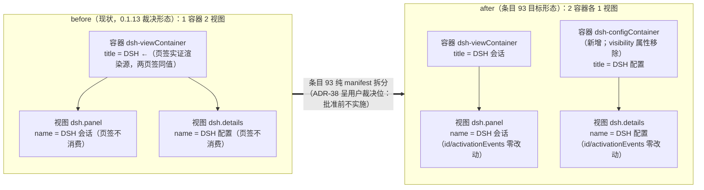
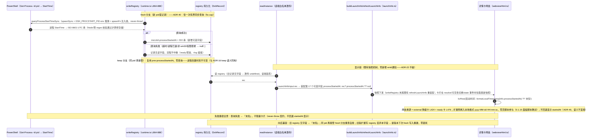
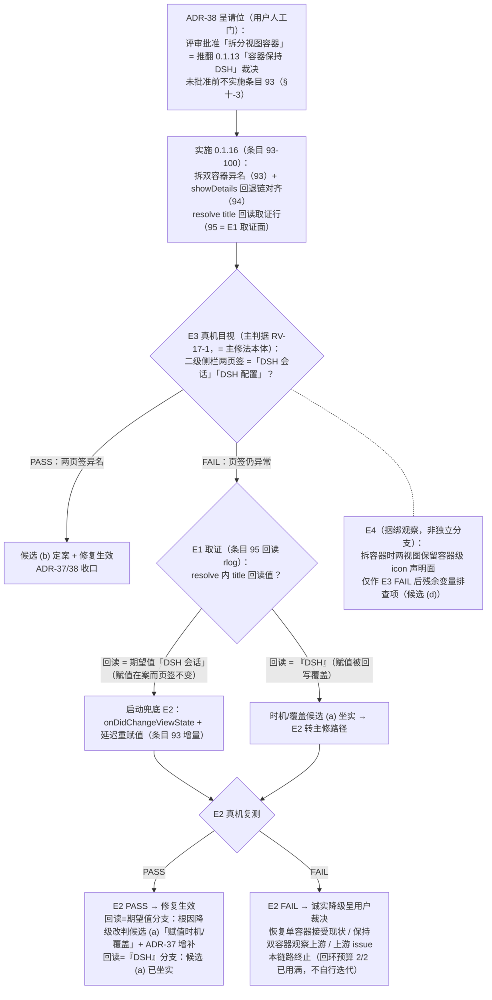

# 0.1.16 修复设计：视图页签标题与启动时刻（0.1.15 真机复测未收敛项根因分析与修复）

> 版本 **v1.1**（架构师，测试失败回环 r2，2026-09-02；v1.1 = QA 设计门控 r1 判 FAIL=Q1-D3 后的表述级定向补全）。触发 = 0.1.15 真机复测：**核心修复全部实锤生效**（401 修复 #80/#81/#82 + 面板脚本复活 #90/#91 + 通道区 #84，用户确认「整体还不错，收敛了大部分的问题」），暴露 **2 个未收敛项**：① 二级侧栏两页签仍渲染 "DSH"（0.1.15 #85 未生效于真机页签）；② 详情卡「启动时间」显示 registry 接管时刻（UTC ISO），非进程真实启动时刻（本地格式）。
> **用户反馈 verbatim 留档（2026-09-02，真机复测）**：「1. 截图2，视图标签都没改名，看红框 2. 截图3，日志取证，可见recv webviewReady 3. 截图1，是启动时间，启动时间不是本地时间」「这个版本整体还不错，收敛了大部分的问题，再收敛解决」。
> **回环预算**：测试失败→架构师本轮 = 2/2（0.1.14→0.1.15 为第 1 次）——0.1.16 复测若再失败将升级用户裁决；故本设计修法必须一次到位、判据必须真机可判定。
> **纪律沿袭**：中文大白话、简单实现优先（用户对 401 修复的简化裁决先例：「不要搞复杂设计」，0.1.15 v1.3）；web_search 不可用边界沿袭（E-FX-11），VSCode 内部机制以本地代码事实 + API 契约推理 + 真机实验矩阵推进，不臆造内部规则。
> 状态：**待评审**（→ QA 设计门控 → 用户评审 → 开发实施）。
> **修订记录**：v1.0（2026-09-02 初版，测试失败回环 r2 产出）→ v1.1（2026-09-02，QA 设计门控 r1 唯一 FAIL=Q1-D3 后定向补全：补 D3 可视化 mermaid 图 ×3 + NOTE-A/B 措辞统一；实质内容零变更，状态保持待评审）。

---

## 〇、一页速览（评审入口——只读本段即可做通过/不通过决定）

### 0.1 一句话总结

**未收敛项 ①（页签标题）的根因 = 渲染作用域错位**：真机二级侧栏的并列视图页签，其标签数据源是**容器级声明面**（`viewsContainers[].title`），而 manifest `views[].name` 与运行时 `WebviewView.title`（#85）两个**视图级**数据源在该渲染面**双失效**（三个候选源中唯一与全部观测吻合的是容器 title——两页签同渲染 "DSH" 恰 = 容器同值）。修法 = **拆分视图容器**（1 容器扩 2 容器、异名标题），使页签在「容器标题模型」与「单视图合并模型」两种 VSCode 行为下都必然显示「DSH 会话」「DSH 配置」——模型无关的确定性，且是**唯一实证会被渲染到页签的数据源**。

**未收敛项 ②（启动时间）= 语义分离 + 数据源换血**：registry `startedAt` 保持「接管/发现时刻」原语义零变更；详情卡「启动时间」行改源 = 新增 registry 可选字段 `processStartedAt`（**dsh 进程真实创建时刻**，OS 报告——`Get-Process -Id <pid>` 单次查询，managed 与 adopted 同一路径），显示换**本地格式** `yyyy-MM-dd HH:mm:ss`；查询失败 →「未知」，不阻塞卡片。

### 0.2 两未收敛项速览表

| 优先 | 项 | 现象（真机 0.1.15 复测） | 根因（一句） | 修法（条目号） |
|---|---|---|---|---|
| P1 | **页签标题**（复测项 1，用户红框） | 两页签仍渲染 "DSH"；#85 赋值已执行（面板/详情卡内容渲染正常）而页签不变 | 页签标签源 = **容器 title**；视图级两源（manifest name / `WebviewView.title`）在该渲染面不消费（§3.1 五问链） | **拆分视图容器**：`dsh-viewContainer`「DSH 会话」+ 新增 `dsh-configContainer`「DSH 配置」（**#93**，纯 manifest）；showDetails 回退链 1 行对齐（**#94**）；resolve 回读取证行（**#95**） |
| P2 | **启动时间**（复测项 3，用户红框；0.1.15 RV-16-14 附带核对项转正） | 显示 `2026-09-02T01:35:42.759Z` = registry 接管时刻（UTC ISO）≠ 进程真实启动 09-01 12:30:33（本地） | 字段语义混淆：`startedAt` 是接管/记录时刻，卡片却当「启动时间」渲染；且显示未本地化 | registry 增可选 `processStartedAt` + `writeRegistry` fresh 分支单次 OS 查询（**#96/#97**）；launchInfo 第 17 可选字段 + `formatLocalTimestamp` 纯函数 + 卡片两处换源（**#98**） |

### 0.3 为什么这样修（不修的后果）

- **页签再修一次视图级属性 = 第三次踩同一个坑**：0.1.15 已把「排除截断」（E-FX-7 勘误）与「API 显式覆盖」（#85）两个视图级修法用尽，真机页签不为所动。只有换到**实证有效的数据源**（容器 title）才是确定性收敛——否则 0.1.16 复测大概率第三次失败，触发用户裁决升级。
- **启动时间不改 = 取证面持续失真**：详情卡是排障入口，「启动时间」显示接管时刻会误导排障方向（本轮回环中它就制造了一次假线索）；且 UTC ISO 原样渲染对用户不友好。

### 0.4 兼容与安全承诺

- **零逻辑改动修法 ①**：#93 纯 manifest 声明面；视图 id / activationEvents（onView）零变化；`dsh-viewContainer` id 保持 → `openPanel` 链零改动。
- **registry 向后兼容 ②**：`processStartedAt` 为可选字段（#22 `launchMode` 先例同型）；旧 registry 无字段 → 读侧容忍 → 卡片「未知」；同 pid 再接管走 keep 分支自愈。`startedAt` 原语义、ADR-16 keep 语义零变更；registry 仍零凭证（D3 不变）。
- 红线继承：不杀外部实例；`.credentials.yaml` 只读；零 token/cookie 落盘面变化；本轮零 src/ 触碰（设计轮）。

### 0.5 评审请求

请对「一页速览」做通过/不通过决定；根因细节见 §三、判据见 §九、实验判定树见 §十。特别请用户裁决 **ADR-38**（拆分容器 = 推翻 0.1.13「容器保持 DSH」裁决的呈请——新证据表明容器 title 正是页签渲染源）。通过后进 QA 设计门控 → 用户评审 → 开发实施（0.1.16）。

---

## 一、目标与背景

### 1.1 真机 PASS 面确认（0.1.15 核心修复实锤，本轮零回归基线）

| 修复项 | 真机证据（日志取证逐行 + 截图） | 定性 |
|---|---|---|
| #80/#81/#82 401 修复全链 | `state: idle -> starting` → `emit state=starting url=null` → `recv webviewReady` → `step1 registry … alive=true probe=true (401…adopting, C path will follow)` → `adopt: external dsh … — url withheld until the session settles (#80…)` → `C path: session cookie self-minted …` → `C path: minted cookie live-verified` → `authProxy: listening 127.0.0.1:18165 -> upstream 127.0.0.1:3080` → `authProxy: panel url switched to http://127.0.0.1:18165` → `state: starting -> ready` → `emit state=ready url=http://127.0.0.1:18165` → `re-bake html url=…18165` | **PASS**：ready 前零 URL 渲染、首帧即最终代理 URL、信息头 = 代理 URL（非裸 3080）、无 401（截图 B） |
| #90/#91 面板脚本复活 | `recv webviewReady` 首现（0.1.14 六会话零现）+ re-push/ack 循环健康（`recv stateAck … ok=true` 终态） | **PASS** |
| #84 通道切换区 | 详情卡通道区正常渲染（当前 alpha 高亮 + latest/next/alpha 三按钮） | **PASS** |
| #85 resolve 显式 title | 赋值确实执行（resolve 完整运行：面板/详情卡内容正常渲染 + sim PU-10-3③④ 动态断言 PASS）——**但页签不变**（本设计 §3.1 根因） | 赋值面生效 / 页签面未收敛 |
| 用户总体评价 | 「这个版本整体还不错，收敛了大部分的问题，再收敛解决」 | 修复方向确认，剩 2 项收敛 |

### 1.2 目标（0.1.16 验收 = 真机可判定）

1. **G-A（页签标题）**：二级侧栏顶栏两页签显示「DSH 会话」「DSH 配置」（目视可判定；判据 RV-17-1）。
2. **G-B（启动时间）**：详情卡「启动时间」= dsh 进程**真实创建时刻**（OS 报告），**本地时区格式** `yyyy-MM-dd HH:mm:ss`（对照 `Get-Process` StartTime 定案值，判据 RV-17-2）；registry `startedAt` 原语义零变更。
3. **G-C（零回归）**：0.1.15 PASS 面逐位保持（RV-17-3）。

### 1.3 背景：两轮修复为何未收敛（问题简史）

- E-FX-7（0.1.15 轮）：排除了「升级缓存/代码覆盖」——0.1.13 VSIX manifest 视图名已是「DSH 会话/DSH 配置」，src 零运行时 title 赋值。
- E-FX-13（v1.3）：排除「窄 tab 截断」（用户截图实锤无省略号）；排除 document.title 回流（两套模板均无 `<title>`，`document.title` ∈ {"", " ·booted"}）。
- v1.5 再改判（用户两张截图）：两页签 = **两视图并列页签**（非「容器标题 + 视图标题」并排）；两页签**都**渲染 "DSH"。
- 0.1.15 #85：resolve 处理器显式 `WebviewView.title`（API 权威覆盖路径）→ **真机页签仍 "DSH"**（本轮复测）→ 视图级修法空间用尽，模型必须换。

---

## 二、范围

### 2.1 做什么

1. 任务 A：视图页签标题根因定案（5-Why + 候选实验矩阵）+ 拆容器修法 + resolve 回读取证面 + 判据组（PP-12/PU-12/RV-17）。
2. 任务 B：进程真实启动时刻数据链（registry 可选字段 → 查询函数 → launchInfo 字段 → 本地格式化 → 卡片换源）+ 判据组。
3. 无头判据落地（sim.mjs 增组 + PU-10-3①② 断言改写）+ 0.1.16 打包安装。

### 2.2 不做什么（观察项留档不修）

| 观察项 | 定性（留档） | 处置 |
|---|---|---|
| `ack timeout … defensive re-push #1/#2 → giving up`（runtime.log 中段） | 防御机制**正常兜底**：webview 隐藏/切换页签时 VSCode 销毁重载（`retainContextWhenHidden:false`）属正常生命周期；重载页 webviewReady → re-push 成功收敛，`stateAck ok=true` 终态，非缺陷 | **不修** |
| `recv webviewReady` 多次出现 | 同上——webview 重载的正常生命周期信号 | **不修** |
| ready 时 re-bake 致 iframe 整页重载、旧页无法 ack、3s×2 超时窗口 | 体验评估：**可接受**——re-bake 每次 url 变更至多一次（bakedUrl 守卫）；重载页随既握手 re-push（日志实证收敛）；超时窗口与重载窗口重叠、无可感知卡死面；消除它需要新增「重载静默期」机制，违背简单优先 | **留档不修**（若未来用户报告面板闪屏再立项） |
| 容器 icon / 页签图标样式 | 不在本轮判定面（E4 仅作兜底实验的捆绑变量） | **不动** |

### 2.3 边界

- 零 git 写操作；不碰 pid 2392 / 运行中 dsh（只读 `Get-Process` 核对可）；不碰 `*.vsix`；本轮 src/ 零改动（实施轮 #93-#100 才动）。
- 0.1.15 设计文档 **v1.5 冻结**：仅文末加一行迁移注指向本文档，零其他改动。
- web_search 不可用（E-FX-11 沿袭）：不依赖外部检索，机制层结论以实验定案（§十）。

---

## 三、系统设计

### 3.1 任务 A：视图页签标题——根因链（5-Why）与候选实验矩阵

#### 3.1.1 已核验代码事实（本轮亲读，全部只读）

| # | 事实 | 落点 |
|---|---|---|
| F1 | #85 赋值在 resolve 处理器内、**先于** `webview.options`（L74）与 `webview.html`（L80）赋值，两视图同构 | `src/webview.ts` L71-80；`src/webviewDetails.ts` L56-62 |
| F2 | resolve 处理器**完整执行**：面板/详情卡内容正常渲染（真机截图 A/B）+ sim PU-10-3③④ 动态断言 PASS（mock 驱动产物断言 title 赋值） | `scripts/sim.mjs` L3907-3919 |
| F3 | 全 src 无第二处 title 赋值、无 `onDidChangeViewState` 处理器、无内部流程回写 title 的路径 | src 全量 grep（`\.title|onDidChangeViewState`）——仅 2 处赋值 |
| F4 | manifest 视图名双源在案：workspace package.json L43/L48 与 installed manifest 均为「DSH 会话」「DSH 配置」 | package.json L38-52 + E-FX-7/13 |
| F5 | 容器声明：单容器 `dsh-viewContainer` title="DSH"，两视图共用 | package.json L29-37 |
| F6 | 两套 HTML 模板均无 `<title>` 元素；页脚本仅 `document.title += ' ·booted'`——document.title 回流排除 | `src/webviewHtml.ts` L125 + E-FX-13 |
| F7 | `retainContextWhenHidden:false` → webview 隐藏即销毁、显示即重新 resolve（title 每次显示都会重赋值） | `src/extension.ts` L155-160 |

#### 3.2 五问链（Why chain）

1. **为什么页签显示 "DSH" 而非「DSH 会话/DSH 配置」？**——页签标签的数据源不是 manifest `views[].name`（F4 双源在案而不渲染）。
2. **也不是运行时赋值吗？**——不是：`WebviewView.title` 赋值已确实执行（F1/F2/F3：赋值在 resolve 内、resolve 完整运行、全 src 无覆盖路径、重显示重赋值 F7），页签仍 "DSH"——**视图级第二数据源同样不被页签消费**。
3. **那页签渲染的是什么？**——两页签渲染**同值 "DSH"**（v1.5 截图定案），恰 = 容器 `viewsContainers.secondarySidebar[0].title`（F5）——两视图共用一个容器 → 共享同一容器 title 数据源 → 同值。三个候选源（views name / runtime title / container title）中唯一与全部观测吻合的是容器 title。
4. **为什么视图级两源不生效？**——该 VSCode 构建（1.134）二级侧栏「并列视图页签」的标签合成取**容器级**数据源；视图名与运行时标题只在其他面呈现（视图节头/快速打开等）。**内部合成规则不可外部核验**（web_search 401 边界，E-FX-11 沿袭）——本设计不臆造内部规则，以「唯一实证渲染源」为修法锚。
5. **根（定案）**——**作用域模型错位**：0.1.13 起我们把「页签标题」建模为视图级属性（先排除截断、再 API 显式覆盖），而真机渲染模型是**页签 = 容器级数据源**；两轮修法都作用在页签不消费的作用域上。

**根因定案（置信度：高）**：*视图页签标题渲染源 = `viewsContainers[].title`（容器级声明面）；manifest `views[].name` 与运行时 `WebviewView.title` 在该渲染面双失效（实证）。* 定案的机制层证明不可得（边界在案），但**修法的判定不依赖机制知识**——拆容器实验（RV-17-1）是真机决定性判定。

#### 3.3 候选列表与可判定实验（判定树见 §十）

| 候选 | 内容 | 可判定实验 | 判读 |
|---|---|---|---|
| (a) 赋值时机早于视图 attach，被后续初始化覆盖 | #85 在 resolve 内赋值，VSCode 建页签可能早于 resolve | **E1**（#95 捆绑）：赋值后回读 `webviewView.title` → rlog；**E2**（兜底）：`onDidChangeViewState` + 延迟重赋值 | 回读 = 期望值而页签 "DSH" → (a) 不预判：无坐实证据亦不先行排除，留待兜底 E2 判定（E2 PASS 方改判，判定树见 §十）；回读 = "DSH" → (a) 坐实 → E2 主修 |
| (b) **页签源 = 容器 title（本设计定案）** | 多视图容器页签标签取容器级数据源 | **E3**（主修法即实验）：拆双容器异名 → 真机目视 | 拆后页签 = 两异名 → (b) 定案 + 修复生效 |
| (c) restore 场景 resolve 未跑/跑晚 | 窗口重载 serialized view | F2 反证：内容渲染正常 = resolve 必然跑了；F7：重显示必重 resolve | 结构性排除（若 readback 行缺席可再暴露） |
| (d) 视图需声明 `icon` 才启用独立标题渲染 | 内置视图模式对照 | **E4**（捆绑观察）：拆容器时两视图保留 icon 声明面（容器级 icon 在场） | E3 后仍异常时的残余变量排查项 |
| (e) VSCode 该渲染面不消费视图级源（= (b) 的机制层表述） | 同 (b) | 同 E3 | 诚实降级分支的最后结论（先假定有解，不作为起点） |

#### 3.4 任务 A 修法定案

**主修法（#93，确定性覆盖路径）——拆分视图容器（纯 manifest，零 src 逻辑）**：

```json
"viewsContainers": {
  "secondarySidebar": [
    { "id": "dsh-viewContainer",   "title": "DSH 会话", "icon": "media/dsh.svg" },
    { "id": "dsh-configContainer", "title": "DSH 配置", "icon": "media/dsh.svg" }
  ]
},
"views": {
  "dsh-viewContainer":   [ { "type": "webview", "id": "dsh.panel",   "name": "DSH 会话" } ],
  "dsh-configContainer": [ { "type": "webview", "id": "dsh.details", "name": "DSH 配置" } ]
}
```

**拆容器 before/after 结构对比（D3 可视化）**——起点即 **ADR-38 呈用户裁决位**：本拆分以用户评审批准为生效条件，批准前不实施条目 93（§十-3）。



- **确定性论证（模型无关）**：容器 title 是唯一被实证渲染到页签的数据源（两页签同值 = 容器同值）→ 两容器异名 = 两页签必然异名。若 VSCode 对单视图容器走「容器与视图合并」行为（以视图名渲染页签），manifest `views[].name` 同值兜底——**两种行为模型下页签都正确**。
- **id 保持 `dsh-viewContainer` 不变**（挂 panel 视图）：`openPanel` 链（extension.ts L284）与 webviewDetails `openPanel` 回退链（L175）**零改动**；`showDetails` 回退链中间态 1 行对齐到 `workbench.view.extension.dsh-configContainer`（**#94**，extension.ts L298；主路径 `dsh.details.focus` 按视图 id 注册、跨容器有效零改动）。
- **id 字面合规性说明（QA NOTE-B）**：公开文档对视图容器/视图 id 的字面约束常表述为 `^[a-z0-9_-]+$`（仅小写字母、数字、下划线、连字符），与本 manifest 实际驼峰混合 id（`dsh-viewContainer` / `dsh-configContainer` 含大写 C）不匹配——现有容器 `dsh-viewContainer` 真机工作正常（0.1.15 复测页签渲染的正是其 title）实证 VSCode 1.134 接受驼峰 id，字面 regex 仅作保守参考、不构成本轮拆分的合规风险；新增容器 id 沿用同型驼峰（`dsh-configContainer`）。
- **`visibility: "collapsed"` 属性移除**：原属性服务于单容器多视图的「初始折叠节」形态（ADR-22 H5 lazy-render 语境）；单视图容器内无载体语义，且避免未知的「合并 + 折叠」交互。H5 lazy-render 语义不受影响——resolve 仍仅在视图首次 reveal 时执行（按视图 id，与容器归属无关）。
- **activationEvents 零改动**（`onView:dsh.panel` / `onView:dsh.details` 按视图 id）。
- 页签默认序 = manifest 容器序 [会话, 配置]；用户可拖拽重排（0.1.15 布局为用户拖后序，重装后重置为 manifest 序，RV-17-4 核对）。

**兜底修法（仅在 RV-17-1 失败后启动，判定树见 §十）**：E2 延迟重赋值（`onDidChangeViewState` + 延迟重赋值，#93 增量）→ 仍失败 → **诚实降级呈用户裁决**（恢复单容器接受现状 / 保持双容器观察上游 / 上游 issue）。「VSCode 不支持」只能是实验后的最后结论，不是起点。

### 3.5 任务 B——详情卡「启动时间」：语义分离与数据链

#### 3.5-1 语义分离定案（去混淆）

| 字段/展示 | 语义 | 数据源 | 变更 |
|---|---|---|---|
| registry `startedAt` | **接管/发现/记录时刻**（ADR-16 keep 语义不动） | 既有 `writeRegistry`（runtime.ts L876） | **零变更** |
| registry `processStartedAt`（新增，可选） | **dsh 进程真实创建时刻**（OS 报告，ISO-8601 UTC 存储） | `Get-Process -Id <pid>` 单次查询（managed 与 adopted 同一路径） | 新增 |
| 详情卡「启动时间」行 | 进程真实创建时刻，**本地格式** `yyyy-MM-dd HH:mm:ss` | `formatLocalTimestamp(info.processStartedAt) ?? '未知'` | 两处换源（ready 卡 L476 + external 降级卡 L424） |
| 接管时刻的可见性 | registry + runtime.log（`writeRegistry: dsh=…` 行）留档，卡片不重复渲染 | — | 不加行（简单优先；ADR-39 记录否决的替代案） |

#### 3.5-2 进程创建时刻获取（单一 OS 查询路径，managed/adopted 同源）

- **方案**：`src/instance.ts` 新增 `queryProcessStartTimeSync(pid, timeoutMs, spawnFn?)`——**G3 形态完全对齐** `queryIdentitySync` 先例（instance.ts L223-268）：脚本常量 `PROCESS_START_SCRIPT`（**零插值、零双引号**，pid 经 `DSH_PROCSTART_PID` env 载体）+ `spawnFn` 注入缝（默认真 `spawnSync`）+ never-throw（任何失败 → null）。
- **脚本**（Windows / PowerShell，与 `IDENTITY_QUERY_SCRIPT` 同权限面、比 CIM 轻——无 WMI 依赖）：
  `$ErrorActionPreference='Stop'; $p = Get-Process -Id $env:DSH_PROCSTART_PID -ErrorAction Stop; $p.StartTime.ToUniversalTime().ToString('yyyy-MM-ddTHH:mm:ss.fffZ')`
- **输出校验**（Node 侧）：`^\d{4}-\d{2}-\d{2}T\d{2}:\d{2}:\d{2}\.\d{3}Z$` 且 `Date.parse` 有限 → 原样存储；否则 null。非 win32 → 直接 null（防御）。
- **先例在案**：`Get-Process` 真机可用性由 E-FX-1 实证（0.1.15 轮即以 `Get-Process -Id 2392` StartTime 定案进程真实启动时刻）；系统命令调用先例 = `netstat`（resolvePortPid）+ PowerShell CIM（processCommandLine 15s / identity 10s）。
- **managed 与 adopted 同一查询路径**（ADR-39）：否决「managed 用插件 spawn 记录」——start 家族（常驻窗默认形态）外层是包装进程，servicePid（真实 dsh 进程）的创建时刻晚于 spawn 时刻（时差不可控），spawn 记录对该形态**不真实**；OS 查询单一语义（「OS 报告的进程创建时刻」）零歧义。

#### 3.5-3 查询时机与缓存（ADR-40：writeRegistry fresh 分支一次性 + registry 持久化）

- **落点**：`writeRegistry`（runtime.ts L864-888）构造 `inst.dsh` 前——**keep 分支**（`keepDshStartedAt=true`，同 pid 再接管）复用 `prev.processStartedAt`，**零查询**（进程创建时刻不可变，与 startedAt/launchMode keep 语义同构）；**fresh 分支**（新 pid/首记录）查询一次（有界 5s cap）。
- **覆盖面**：writeRegistry 全部 5 个 landing 点（step1 re-adopt / step2 残留迁移 / step2 外部接管 / step4 等待后接管 / launchManaged）自动覆盖，零新增调用点。
- **时延面**：adopt 系路径 setState('ready') 在 adopt() 内先行、writeRegistry 在其后 → 查询**零 ready 延迟**；managed 路径 writeRegistry 在 ready 前 → ready 时延 + 一次有界 powershell spawn（典型 0.2-0.6s、上限 5s，启动秒级链路内的噪声，§六）。
- **持久化选型**：registry 新字段（非内存缓存）——窗口重载 re-adopt 走 keep → 零查询；与 ADR-16 startedAt 保持语义同构；跨窗口共享。内存方案被否决（重载即失、需重查询）。
- **注入缝**：`RuntimeOptions` 增 `processStartQuery?: (pid: number) => string | null`（identityCheck L156 / resolvePortPidFn L176 同型先例）→ PP-12-4 无头可断言。
- **快照刷新语义**：writeRegistry 末尾既有 `refreshLaunchInfo` 重装配（零新通知机制，ADR-22「no new events」不破）；详情卡在 resolve/可见性切换/下次 state 事件拉取最新快照（既有行为）。adopt 场景查询在 ready 之后 → 用户开卡时快照已带值；唯一陈旧窗口 = 卡片恰好在上游查询窗口内已渲染（显示「未知」直至下次重渲染，可忽略，留档）。

#### 3.5-4 显示链路与格式化

- `launchInfo.ts`：`DshLaunchInfo` 增**第 17 个可选字段** `processStartedAt?: string | null`（#16 `externalUrl` 同型先例：additive、既有消费者零破坏）；`LaunchInfoInput.rec` 类型增字段；装配 `processStartedAt: rec?.processStartedAt ?? null`（降级快照随 rec 保留——进程事实与会话降级正交）。
- `launchInfo.ts` 新增纯函数 `formatLocalTimestamp(iso: string | null | undefined): string | null`：`Date` 解析 → 本地分量 `yyyy-MM-dd HH:mm:ss`（补零）；null/undefined/非法 → null。**扩展侧烤入本地格式，零页脚本参与**（#90 教训：显示面不依赖页脚本存活）。
- `webviewHtml.ts`：两处 `kvRow('启动时间', info.startedAt ?? '未知')`（L424 external 卡 / L476 ready 卡）→ `kvRow('启动时间', formatLocalTimestamp(info.processStartedAt) ?? '未知')`。**不回退显示 `startedAt`**（语义不混淆；ADR-40）。

#### 3.5-5 失败侧与兼容性

- 查询失败/超时/进程已退/非 win32/权限拒绝（他用户提升进程 StartTime 抛错）→ null → 字段缺省 → 卡片「未知」，**不阻塞卡片**（never-throw 契约，与 launchInfo 全链一致）。
- **旧 registry 容忍**：无字段 → `readInstance` 透传 undefined（现状无字段白名单）→ 快照 null →「未知」；同 pid 再接管走 fresh 分支重新查询，**自愈**。旧版本扩展写 registry 丢弃本字段 → 新版本下次 fresh 写入重建——零锁死。
- **时序/状态机**：零状态机变更、零新增 emit、零页脚本改动。

#### 3.5-6 任务 B 数据链全景（D3 可视化：OS 查询 → registry → launchInfo → 详情卡两处换源）



---

## 四、可行性（探针数据）

| 探针 | 结果 | 说明 |
|---|---|---|
| 编译探针 `node node_modules\typescript\bin\tsc -p tsconfig.json` | **COMPILE OK** | 本轮实测，基线健康 |
| 无头探针 `node scripts\sim.mjs` | **ALL PASS, 9 SKIP** | 本轮实测（8/8 聚合门 + 全族零失败）；SKIP 均为沙箱已知边界（netstat/CIM） |
| #85 赋值面亲读 | webview.ts L73 / webviewDetails.ts L58，先于 options/html；全 src 无回写路径、无 onDidChangeViewState | §3.1 F1/F3 |
| resolve 执行实证 | 面板/详情卡内容正常渲染（截图 A/B）+ PU-10-3③④ 动态断言 PASS | §3.1 F2 |
| manifest 引用面核查 | `dsh-viewContainer` 全工作区 6 处：package.json L32/L39（声明）+ extension.ts L151（注释）/L284（openPanel 链，**拆分后仍有效**）/L298（showDetails 中间态，**#94 对齐**）+ webviewDetails.ts L175（openPanel 回退，**拆分后仍有效**） | 拆分影响面收敛为 1 行代码 + 1 行注释 |
| `media/dsh.svg` | 存在（Test-Path True） | 两容器 icon 复用 |
| Get-Process 真机可用性 | E-FX-1 先例（0.1.15 轮 Get-Process -Id 2392 StartTime 定案） | CIM 沙箱拒绝边界在案（E-SANDBOX），Get-Process 为最轻路径 |
| PU-10-3①② 断言现状 | sim.mjs L3950-3956（单容器形态断言） | #99 同步改写为双容器断言（PU-12-1 取代声明） |
| 新增探针拒例 | 零 | 本轮全部只读：read/grep/Test-Path/tsc/sim |

---

## 五、可维护性

1. **修法 ① 纯声明面**：拆容器零逻辑分支；后续视图增删沿容器数组演进，页签标题与容器 title 单点对齐（manifest 一处声明 + resolve 显式 title 对齐双保险保留）。
2. **语义分离文档化**：`DshRecord` 字段注释双语义明示（`startedAt`=接管/发现时刻 / `processStartedAt`=进程创建时刻），杜绝 0.1.15 式「一个字段两个期望」的混淆复发。
3. **格式化单点**：`formatLocalTimestamp` 纯函数，未来任何「本地时刻展示」复用同一入口；存储恒 ISO-8601 UTC、渲染恒本地——存储/显示语义分离。
4. **G3 形态复用**：`PROCESS_START_SCRIPT` 常量 + env 载体 + 注入缝，与 identity 查询同型——审查与测试成本最低。
5. **取证行永久化**：title 回读 rlog（#95）——未来 VSCode 行为漂移时现场证据即刻可得（ADR-35「诊断必须可见」同型制度化）。

---

## 六、性能

| 面 | 成本 | 评估 |
|---|---|---|
| `Get-Process` 单次查询（fresh 记录时） | powershell.exe spawn 一次，典型 0.2-0.6s、上限 5s（timeout 硬顶）；每 dsh 进程生命周期恰一次（keep 分支零重复） | **可接受**：managed 路径 ready 时延 +0.2-0.6s（启动链路本为秒级，30-90s 就绪预算内噪声）；adopt 路径 ready 后执行，零用户可感时延。对比先例：processCommandLine CIM 上限 15s、identity 10s/条 |
| 扩展宿主线程阻塞 | spawnSync 同步阻塞（既有同型先例：identity/processCommandLine） | 有界（5s）+ 低频（每进程一次）+ 启动窗口期，可接受 |
| registry 写放大 | `processStartedAt` 一个 ISO 串（~24B/记录） | 可忽略 |
| 拆容器 | manifest 静态声明，零运行时成本 | 零影响 |
| formatLocalTimestamp | 纯函数（μs 级），每卡片渲染 2 次 | 可忽略 |
| title 回读 rlog | 每 resolve 一行日志 | 可忽略 |

---

## 七、决策记录（ADR-37 起）

**ADR-37：视图页签标题根因定案 = 容器级数据源（`viewsContainers[].title`）；manifest `views[].name` 与运行时 `WebviewView.title` 在页签渲染面双失效。**
理由：排除法完备——三个候选源中，视图级两源均有「已正确声明/已正确赋值而不生效」的直接实证（F1-F6 + #85 真机失效），唯一与全部观测吻合者为容器 title（两页签同值 = 容器同值）。机制层内部规则不可外部核验（E-FX-11 边界沿袭），故本定案是**实证 + 排除法**定案而非源码级证明；最终形态由拆容器实验 RV-17-1 判定（判定树见 §十）。

**ADR-38：修法 = 拆分视图容器（异名标题），呈请用户评审改判 0.1.13「容器保持 DSH」裁决。**
理由：① **裁决的事实前提已变**——0.1.13 裁决（保持单容器 "DSH"）建立在「容器 title 渲染正常、修法应作用于视图标题」的模型上；v1.5 截图 + #85 真机失效证明页签渲染的恰恰是容器 title——保持 "DSH" 即保持两页签同值重复，与用户「视图标签都没改名，看红框」的诉求直接冲突。② 确定性——容器 title 是唯一实证渲染源，双容器异名在该模型下必然生效；即使 VSCode 走单视图合并行为（页签取视图名），manifest name 同值兜底，**两模型下都正确**。③ 影响面最小——视图 id/激活事件/面板 reveal 链零改动，代码改动仅 showDetails 回退链 1 行。用户批准本 ADR = 批准改判。

**ADR-39：「启动时间」语义分离——registry `startedAt` 保持「接管/发现时刻」原语义；新增 `processStartedAt` = 进程真实创建时刻（OS 报告）；managed 与 adopted 走同一 OS 查询路径。**
理由：① 0.1.15 复测缺陷的本质是「一个字段两个期望」（registry 记录时刻 vs 进程启动时刻）——治本 = 字段分立而非改语义；② spawn 记录方案否决：start 家族（常驻窗，生产默认形态）的 servicePid 创建时刻晚于插件 spawn 时刻（包装进程时差），记录值对该形态不真实；`Get-Process` 单一语义（OS 报告）对两路径零歧义，且真机可用性已实证（E-FX-1）。

**ADR-40：查询时机 = `writeRegistry` fresh 分支一次性同步有界查询（5s cap）+ registry 持久化；详情卡不回退显示 `startedAt`。**
理由：① keep 分支复用（进程创建时刻不可变）→ 每进程生命周期恰一次查询，窗口重载零查询；② registry 持久化使跨窗口/重载免查，与 ADR-16 startedAt 保持语义同构；③ async fire-and-forget 方案否决——需注册表手术式回写 + 快照刷新通知机制（违背 ADR-22 no-new-events 与简单优先），且 managed 路径时延差异（+0.2-0.6s 有界）不构成用户可感问题；④ 「启动时间」行不回退显示 `startedAt`——回退会把两种语义重新搅进一个格子，正是本轮要消除的混淆。

---

## 八、实施清单（0.1.16；编号续 0.1.15 的 #92 之后）

| # | 项 | 内容与验收 | 角色 |
|---|---|---|---|
| 93 | **package.json 拆分视图容器（主修法，纯声明面）** | manifest 按 §3.4 目标形态：`secondarySidebar` = [`dsh-viewContainer`「DSH 会话」+ icon, `dsh-configContainer`「DSH 配置」+ icon（均 `media/dsh.svg`）]；views 键拆分（panel→旧容器、details→新容器）；`visibility:"collapsed"` 移除（理由 §3.4）；视图 id/name/activationEvents 零改动 | 判据 PU-12-1 + RV-17-1（主判据）【开发专家】 |
| 94 | `showDetails` 回退链对齐 | extension.ts L298 中间态 `workbench.view.extension.dsh-viewContainer` → `workbench.view.extension.dsh-configContainer`（主路径 `dsh.details.focus` 零改动）；webviewDetails.ts openPanel 回退链核对零改动；extension.ts L151 注释同步 | 判据 PU-12-4 + RV-17-1【开发专家】 |
| 95 | resolve title 回读取证行（E1 取证面，永久） | webview.ts resolve 赋值后 `panelLog` 一行（set 值 + readback 值）；webviewDetails.ts 同型 `appendDecisionLog` 一行；零行为变更 | 判据 PU-12-2 + RV-17-1 取证面【开发专家】 |
| 96 | `instance.ts` 增 `queryProcessStartTimeSync` | G3 形态（`PROCESS_START_SCRIPT` 常量零插值零双引号 + `DSH_PROCSTART_PID` env 载体 + `spawnFn` 注入缝 + never-throw→null + 非 win32 →null）；输出 regex 校验（§3.5-2） | 判据 PP-12-3【开发专家】 |
| 97 | registry schema + `writeRegistry` 分支 | `DshRecord` 增可选 `processStartedAt?: string`（注释双语义明示）；`writeRegistry` keep 复用 / fresh 查询恰一次（5s cap）；`RuntimeOptions.processStartQuery` 注入缝（identityCheck 同型） | 判据 PP-12-4 + 旧 registry 容忍自愈【开发专家】 |
| 98 | launchInfo 第 17 字段 + 本地格式化 + 卡片换源 | `DshLaunchInfo.processStartedAt?` + `LaunchInfoInput.rec` 增字段 + 装配透传（降级快照随 rec 保留）；`formatLocalTimestamp` 纯函数；webviewHtml.ts L424/L476 两处换源（`formatLocalTimestamp(info.processStartedAt) ?? '未知'`） | 判据 PP-12-1/2 + PU-12-3 + RV-17-2【开发专家】 |
| 99 | 无头判据落地 | sim.mjs 增 PP-12/PU-12 全组；**PU-10-3①② 改写为双容器断言**（PU-12-1 取代，单容器断言作废）；既有全族零回退（ALL PASS 基线保持） | 判据 §九【测试专家】 |
| 100 | 打包 + 离线安装验证 | `npm run package` → `dsh-vscode-agent-0.1.16.vsix`；完全退出 VSCode + 卸载旧版 + 安装（剧本前置-1 同款）；版本台账登记 | 【部署专家】 |

- 零改动面：`authProxy.ts`、`dshProcess.ts`、`dshResolver.ts`、`paths.ts`、`channelSelect.ts`、`panelMessages.ts`、状态机、页脚本（两套 HTML 模板仅烤值变化）。
- 红线：不杀外部实例；`.credentials.yaml` 只读；registry 零凭证（新字段为时间戳，非敏感面）。

---

## 九、判据

### 9.1 PP-12（无头 sim 断言组，纯 Node/mock deps）

| 项 | 断言 |
|---|---|
| PP-12-1 | `formatLocalTimestamp` 纯函数：合法 ISO（含 `.759Z` 毫秒形态）→ 本地分量 `yyyy-MM-dd HH:mm:ss`（补零）；null/undefined/非法串 → null；输出与 `new Date(iso)` 本地分量逐位一致（自洽判定，不锚死测试机时区） |
| PP-12-2 | `buildLaunchInfo` 透传：rec.processStartedAt → 字段同值；rec 无字段 → null；user-stop/disconnect 降级快照随 rec 保留（不清除）；既有 16 字段零回归 |
| PP-12-3 | `queryProcessStartTimeSync` 注入面：mock spawnFn 合法输出 → ISO 返回；非零 exit/空输出/垃圾输出/抛异常 → null；pid=null → 零 spawn 返回 null；`PROCESS_START_SCRIPT` 常量断言（无双引号、无 pid 字面量，G3 形态）；env.DSH_PROCSTART_PID 载体 + windowsHide + timeout 透传（PI-3 同型） |
| PP-12-4 | `writeRegistry` keep/fresh 分支（`processStartQuery` 注入 + paths env 隔离注册表）：同 pid 再写 → query 恰 **0** 次且 prev 值保留；新 pid → query 恰 **1** 次且记录携带返回值；query 返回 null → 记录无字段且流程不中断（ready 照常、rlog 留痕） |

### 9.2 PU-12（UI/静态断言，E-SIM-1 先例）

| 项 | 断言 |
|---|---|
| PU-12-1 | **manifest 双容器（取代 PU-10-3①②，#99 同步改写）**：`secondarySidebar` 恰 2 项（id/title/icon 三元断言）；`views['dsh-viewContainer']` 恰含 dsh.panel（name 不变）；`views['dsh-configContainer']` 恰含 dsh.details（name 不变、无 visibility 属性） |
| PU-12-2 | resolve 显式 title 保持（webview.ts「DSH 会话」/ webviewDetails.ts「DSH 配置」——#85 不回退）+ 两 resolve 均含回读取证行（set + readback） |
| PU-12-3 | webviewHtml.ts 两处「启动时间」行 = `formatLocalTimestamp(info.processStartedAt)` 形态（静态文本断言）；`info.startedAt` 不再入「启动时间」行 |
| PU-12-4 | showDetails 回退链中间态 = `workbench.view.extension.dsh-configContainer`；openPanel 链 `dsh-viewContainer` 保持零改动（静态文本断言） |

### 9.3 RV-17 真机复测族（0.1.16 专属；装包流程同剧本前置-1）

| 项 | 步骤 | PASS 判据 |
|---|---|---|
| **RV-17-1（页签标题真机终验 = 拆容器决定性实验）** | 安装 0.1.16 → 打开二级侧栏 | **顶栏两页签 = 「DSH 会话」「DSH 配置」实测**（目视 + 截图）；runtime.log 两行 title readback 取证在案（E1）；openPanel（⟳ 后自动展开）/showDetails（ⓘ）链路正常 |
| **RV-17-2（启动时间本地时刻）** | 详情卡目视（外部接管 + managed 两场景各验一次） | 「启动时间」= `Get-Process` StartTime 定案值（本地 `yyyy-MM-dd HH:mm:ss`，秒级对照，非 UTC ISO、非接管时刻）；registry `processStartedAt` 在案；接管时刻仍可在 runtime.log 核对（语义分离实证） |
| RV-17-3（0.1.15 PASS 面回归） | 沿用 0.1.15 复测口径 | RV-16-1（接管 401 全链：ready 首帧即最终代理 URL、无 401）、RV-16-11（`recv webviewReady` + 4 按钮）、RV-16-14（详情卡「重启 dsh」；其「启动时间」附带核对项由本轮 RV-17-2 转正收敛）、RV-16-9（latest 直连零回归） |
| RV-17-4（双容器布局回归） | 两页签拖拽/切换 | 页签可拖拽重排；awaitingChannel 选择卡、通道切换区（#83/#84 面）渲染正常；details 容器首开渲染正常（visibility 移除回归）；重装后布局重置为 manifest 序（如实告知用户） |

**通过判据**：RV-17-1 + RV-17-2 + RV-17-3 全 PASS；PP-12/PU-12 全绿 + sim 既有全族零回退。**RV-17-1 失败 → 走 §十判定树**（预算 2/2 已用满，不得自行迭代，升级用户裁决）。

---

## 十、诚实声明

1. **VSCode 内部机制不可核验的边界处置（E-FX-11 沿袭）**：页签标签合成的 workbench 内部规则无法外部核验（web_search 本会话历史 401，边界在案）。本设计的根因定案是**排除法 + 实证**定案（三个候选源中唯一与全部观测吻合者），不是内部源码级证明；修复不依赖内部规则知识——以「唯一实证渲染源（容器 title）」为确定性别名源，最终判定交真机实验。
2. **实验判定树（RV-17-1 的三种结局）**：
   - **PASS** → ADR-37/38 收口，修复生效。
   - **FAIL + readback = 期望值**（「DSH 会话」）→ 启动兜底 E2（`onDidChangeViewState` + 延迟重赋值，#93 增量）：E2 PASS → 根因降级改判为「赋值时机/覆盖」（候选 a），ADR-37 增补；E2 FAIL → **诚实降级呈用户裁决**（恢复单容器接受现状 / 保持双容器观察上游 / 上游 issue），本链路终止。
   - **FAIL + readback = "DSH"**（赋值被回写覆盖）→ 时机/覆盖候选坐实 → E2 为主修路径。
   - 预算纪律：回环 2/2 已用满——0.1.16 复测再失败即升级用户裁决，不自行无限迭代。

**判定树可视化（实验矩阵 E1-E4 × RV-17-1 三种结局；D3）**——起点即 **ADR-38 呈用户裁决位**：



3. **0.1.15 文档冻结与取代关系**：本文档独立承载 0.1.16；`PU-10-3①②` 断言由 #99 在 sim.mjs（代码层）改写取代，0.1.15 设计文档零改动（仅文末一行迁移注）；ADR-38 对 0.1.13「容器保持 DSH」裁决的推翻**以用户评审批准为生效条件**，未批准前不实施 #93。
4. **沙箱与活体边界**：`Get-Process` 的真机可用性由 E-FX-1 先例实证（0.1.15 轮定案 2392 启动时刻），沙箱内 CIM 不可用边界在案（E-SANDBOX）；#96 实现的全部无头验证走 mock 注入面（PP-12-3），真机行为归 RV-17-2 终验。本轮零新增探针拒例。
5. **registry schema 向后兼容声明**：可选字段 + 读端透传容忍 + keep 分支自愈（§3.5-5）；`startedAt` 原语义与 ADR-16 keep 语义零变更；新字段为非敏感时间戳。
6. **纪律**：本轮纯设计轮——零 src/ 改动、零 git 写、不碰 pid 2392 / 运行中 dsh、不碰 `*.vsix`；正式产出 = 本文档 + 0.1.15 文档一行迁移注 + EVIDENCE E-FX-16 追加。
