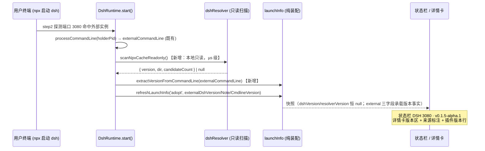

# 0.1.18 设计方案 — 外部接管状态显示 dsh 版本与插件版本

> v1.1 | 2026-09-09 | 状态：**评审通过**（QA 设计审计 r1 回环 + r2 通过，17/17；用户评审通过 2026-09-09），实施推进中｜修订记录见 §十一
> 作者：架构师（A1 链设计阶段）｜本轮零生产代码改动，设计产出 + 调研取证。

## 零、前置参考

| 引用 | 说明 |
|---|---|
| `docs/架构设计报告.md`、`docs/0.1.6真机缺陷根因分析与解决方案.md` | launchInfo 三层可见性基线（ADR-22，0.1.9 §4.7） |
| 0.1.9 设计 §4.7.2（H1 诚实降级） | `degraded / managedBy==='external'` → 版本/bin 字段强制 null、绝不放占位文案——本方案受控放宽的对象 |
| `docs/0.1.14设计方案-通道选择与token适配.md` | token 契约（ADR-30）：判定看版本、取值看 banner；C 路径自铸 cookie |
| ADR-39/40（0.1.16） | processStartedAt 语义分离先例；「两种事实不得搅进一个格子」是本方案字段裁定的同型依据 |
| 临时证据 `.dsh/tmp/architect/extver-r1/`（本轮轮级目录） | `probe-live-3080.txt`（实机探针）/ `upstream-evidence.md`（上游取证）/ `npx-cache-facts.txt`（安装产物；v1.1 追加 §4 整根扫描范围重取证 = 4 候选）/ `registry-facts.txt`（本机实况） |
| 上游 `D:\working\projects\deepseek-harness`（0.1.5-alpha.1 发布树，HEAD 5dda764ed3，严格只读） | 版本可观测性调研对象 |
| **命名说明** | 本文件名 `0.1.18设计方案-…` 与既有 `0.1.18调研报告-dsh-alpha集成点复验-v4.md` 同为 0.1.18 版本前缀：类型词（设计方案 ≠ 调研报告）与主题不同，属目录治理 ADR-41 命名公式的两条独立文档，`docs/README.md` 索引各占一行，不构成同题多版本（不用 `-vN` 后缀） |

## 一、目标/背景分析

**用户请求原文**：「调研实现显示外部接管的 dsh 版本，以及插件版本」。

**背景与现状缺陷**：用户从 Windows Terminal 手动 `npx` 启动 dsh（0.1.5-alpha.1，pid 21928，端口 3080），VSCode 扩展（0.1.17）按外部接管（`managedBy: 'external'`）路径收编该实例。此路径下：
- 状态栏 ready 态没有版本段（`extension.ts:126-139`：version = `dshVersion ?? resolverVersion ?? null`，两者在 external 态都为 null）；
- dsh 配置详情卡显示「外部接管的 dsh——扩展未解析其 bin 目录与版本」（`webviewHtml.ts:415-436` external 分支），无版本、无插件版本。

**根因（代码层面）**：0.1.9 H1 诚实降级把 external 态与 user-stop/disconnect 同等处理——版本/bin 字段强制 null（`launchInfo.ts:185-190`：`degrade = degraded || managedBy === 'external'`）。当时的假设是「external 接管无任何可信版本源，宁缺勿错」。**本轮调研推翻了这一假设的一半**：运行进程自报版本确实不可得（上游无版本端点，实机探针证实），但 npx 缓存目录版本是可只读获取的间接事实——带来源标注展示可以做到「不误导」。

**目标**：
1. external 接管状态下，扩展尽力显示 dsh 版本（每个版本值必须带来源标注，不可得保持「版本未知」）；
2. 任何状态下显示插件（扩展自身）版本；
3. managed-own / extension 路径行为零变化（防误伤）。

## 二、范围分析（做什么、不做什么）

**做**：
1. `dshResolver.ts` 新增**只读** npx 缓存扫描入口（无网络调用、无安装动作、无 meta 写入）；
2. `launchInfo.ts` 新增 external 版本三个可选字段 + 命令行版本提取纯函数 + 来源标注组装纯函数；
3. `runtime.ts` external 接管路径（step2 为主）装配新字段；
4. 状态栏（ready+external 版本段 + tooltip 标注行）与详情卡（external 版本区带标注 + 插件版本行全相位）UI 落点；
5. 版本递增提案 0.1.17 → 0.1.18（package.json，部署环执行）；
6. sim 无头用例族 PU-13 + GUI 真机验收场景设计。

**不做**：
1. 抓取运行进程服务的前端 bundle 并解析内联版本（多跳脆弱；见 §八 ADR-48 否决记录）；
2. `VersionCrossCheck` 五级枚举扩展（external 版本对账走展示层文案，不动数据模型枚举）；
3. user-stop / disconnect 降级快照的放宽（维持 H1 全 null；进程已死时目录版本反而误导）；
4. 注册表（instance.json）新增持久化字段（externalCommandLine/external 版本保持内存快照语义，与 externalUrl 同类）；
5. managed-own / extension 态任何行为变化（回归红线）；
6. 上游 dsh 代码改动（上游仓库严格只读）。

## 三、系统技术选型及设计

### 3.1 版本源阶梯（external 态可信度排序，证据见 §四）

| 序 | 源 | external 态可得性 | 可信度 | 获取成本 | 裁定 |
|---|---|---|---|---|---|
| S1 | **启动命令行字面版本**（externalCommandLine 中 semver token） | 条件可得（用户启动 spec 含 `@0.1.5-alpha.1` 类精确版本时命中；npx 无版本形态提不出） | 较高（用户显式写入命令行的版本意图，npx 尊重精确 spec） | 极低（命令行已在手，纯字符串扫描） | **实现**（有则显示，带「据启动命令行」标注） |
| S2 | **npx 缓存目录版本**（只读扫描 newest 候选；扫描范围 = npxRoot() 整根） | 可得（本机整根实测 4 个候选：0.1.5-alpha.1 / 0.1.1-rc.2×2 / 0.1.0-rc.7；newest 恰为运行版本——多候选是常态，单候选是特例） | 中（目录版本 ≠ 运行进程——0.1.17 挂 0.1.5-alpha.1 目录的先例正是 H1 的由来；本机即多候选并存，newest 启发式未必等于运行版本） | µs 级本地文件读 | **实现为主源**（标注由 §7.1 buildExternalVersionNote 单点输出；本机将显示多候选文案「npx 缓存存在 4 个版本（显示最新，未核实运行进程）」） |
| S3 | 运行进程自报（HTTP 途径：boot graph / 版本端点） | **不可得**（0.1.5-alpha.1 无版本自报入口，实机探针 + 上游 grep 双证） | —（如可得则最高） | — | 本轮不实现；登记为上游演进观察项（§八） |
| S4 | 服务端 client bundle 内联版本（`dsh-client-ui-sidebar/lib/client.js` 内联 `0.1.5-alpha.1-f0b1dec`） | 理论可得（需 C 路径会话 + 多跳抓取 + minified JS 解析） | 中低（本质仍是安装目录事实经 HTTP 转发，非运行时自报） | 高且脆弱（依赖上游 bundle 布局与字符串格式） | **不实现**（ADR-48 否决记录） |
| S5 | 外部 dsh 日志（自报版本行 E-VER-1 同源） | **不可得**（banner/stdout 落在用户终端；$DSH_HOME 下无 per-launch 日志文件） | — | — | 否 |
| S6 | 额外进程枚举（koffi 等） | 可得性同 S1（CIM 已覆盖命令行） | — | 新增一次进程枚举 | 否（过度工程；processCommandLine 已够用） |
| S7 | 插件版本（扩展自身 package.json version） | **恒可得**（不依赖 dsh 状态） | 最高（运行中的就是扩展本体） | 极低（VSCode API 直读） | **实现**（全状态展示） |

### 3.2 数据模型设计（语义分离裁定：新增字段，不复用 resolverVersion）

**字段裁定——方案 B（新增可选字段组），否决方案 A（复用 resolverVersion）**：

- `resolverVersion` 的字段语义是「resolver 命中」（`SpawnedInfo.resolved` 透明度 = 本次托管启动消费的 bin 目录事实；0.1.14 起兼任契约判定主源）。external 态**从未运行 resolver**，把只读扫描结果塞进该字段 = 「本次启动消费的目录」与「此刻缓存里有什么」两种事实混进一个格子，并让 crossCheck 的 `resolver-only` 标签在无 resolver 会话时出现——正是 ADR-40 禁止的「两种语义搅进一个格子」。
- 新字段遵循 #16 externalUrl / #17 processStartedAt 两次 additive 先例：可选字段、既有消费者零破坏、降级语义显式文档化。

**`DshLaunchInfo` 新增第 18–20 个可选字段**：

```ts
/** external 态只读扫描所得 npx 缓存目录版本（newest 候选；扫描范围 = npxRoot() 整根，多候选为常态）；非 external 或扫描失败 → null。 */
externalDshVersion?: string | null
/** externalDshVersion 的来源标注（展示语义；空 = 无版本可标注）。 */
externalDshVersionNote?: string | null
/** externalCommandLine 原文中直接出现的 semver 版本号；未命中/非 external → null。 */
externalCmdlineVersion?: string | null
```

**新增纯函数**（launchInfo.ts，纯 Node 层零 vscode import）：

```ts
/** externalCommandLine 原文 semver 扫描：命中返回不带 v 前缀的版本号，否则 null。
 *  只报命令行原文里出现的内容，不推断 npx 的解析结果。 */
export function extractVersionFromCommandLine(cmdline: string | null): string | null
/** external 版本来源标注组装（单测可断言的文案单点）。 */
export function buildExternalVersionNote(version: string | null, candidateCount: number): string | null
```

**degrade 语义细化（buildLaunchInfo）**：
- `degrade`（external / user-stop / disconnect）对 managed 语义字段的强制 null **维持不变**：`dshVersion` / `resolverVersion` / `binDir` / `dshBin` / `resolverMode` / `externalUrl` 在 external 态仍为 null（字段名承载 managed 会话语义，不复活）；
- external 态**新增例外**：`externalDshVersion` / `externalDshVersionNote` / `externalCmdlineVersion` 三个 external 专属字段透传（它们只在 external 态由调用方输入，天然不与 managed 字段混用）；
- **放宽范围仅限 external**：user-stop / disconnect 快照三个新字段恒 null（`degrade === true` 但 `managedBy !== 'external'` → 不透传）；
- `versionCrossCheck` 恒 'unknown'（现状保持——external 态没有可对账的自报源，PU-3 既有断言不破坏）。

### 3.3 装配流程（external 接管路径）



- **step1 re-adopt**（注册表已有 external 记录）：`externalCommandLine` 在 start() 开头被 per-attach 重置为 null 且注册表不落盘 → 命令行版本恒 null，**目录版本仍可得**（扫描不依赖命令行）。此差异写入字段注释与 PU-13 断言。
- **step4 等待后接管**：同 step2 形态（adopt 时 externalCommandLine 已由 step2 等价路径捕获者有命令行版本；经 waitForExternalStartup 的 adopt 无命令行 → 仅目录版本）。
- 失败时：扫描失败（目录不可读/无候选）→ externalDshVersion = null + Note = null → 详情卡维持「版本未知」（诚实降级行为不变）。

### 3.4 UI 落点与精确文案

**落点 1 — 状态栏（extension.ts updateStatus ready 分支）**：
- 文本：external 态 version 候选链尾部追加 `info?.externalDshVersion ?? info?.externalCmdlineVersion ?? null`（managed 态候选链不变）→ `$(circle-filled) DSH 3080 · v0.1.5-alpha.1`；双缺维持 `$(circle-filled) DSH 3080`（无占位）。
- tooltip（external 态追加行，managed 态不变）：版本标注一律引用 §7.1 文案单点（buildExternalVersionNote 输出 + 标注常量表），tooltip 层不得就地书写标注文案（QA r1 A5）；行模板统一为 `版本：<version> · <标注>`：
  - 有目录版本（本机实况 4 候选）：`版本：v0.1.5-alpha.1 · npx 缓存存在 4 个版本（显示最新，未核实运行进程）`
  - 单候选特例：`版本：v0.1.5-alpha.1 · 据 npx 缓存目录（未核实运行进程）`
  - 无目录版本、有命令行版本：`版本：v0.1.5-alpha.1 · 据启动命令行`
  - 命令行与目录版本不一致时追加警示行：`注意：命令行与 npx 缓存目录版本不一致——以实际运行的 dsh 为准`
  - 双缺：无版本行（无占位）
  - 恒有一行：`插件：v0.1.18`
- `statusLine()` 纯函数签名与文本规则不变（版本值由调用方决定——纯函数无感知）。

**落点 2 — 详情卡 external 分支（webviewHtml.ts readyBody external 分支）**：

amber 提示行下方新增版本区（替代原「无版本」现状）：

- 目录版本可得（muted 标注行 = §7.1 buildExternalVersionNote 输出，UI 不就地书写文案）：
  ```html
  <div class="sect">版本</div>
  <div class="ver" id="version-big">v0.1.5-alpha.1</div>
  <div class="muted">{note}</div>
  ```
  本机实况 candidateCount=4 → `{note}` = `npx 缓存存在 4 个版本（显示最新，未核实运行进程）`；单候选特例 → `据 npx 缓存目录（未核实运行进程）`。
- 命令行版本命中（与目录版本并存时）：追加 `<div class="muted">启动命令行含版本 v0.1.5-alpha.1</div>`；两者不一致时追加警示行（复用 .xcheck.warn 样式）：`命令行与 npx 缓存目录版本不一致——以实际运行的 dsh 为准`。
- 目录 + 命令行双缺：`<div class="muted">版本未知（本次会话未能确定）</div>`（原「如需版本与 bin 目录信息」引导文案保留）。
- amber 提示行文案微调：`外部接管的 dsh——由外部命令自行启动，扩展未解析其 bin 目录；版本为间接来源（见标注）。`

**落点 3 — 插件版本行（全相位可见）**：
- ready 卡（managed-own/extension 分支）：版本区之后 `kvRow('插件版本', 'v0.1.18')`；
- external 卡：版本区之后同型行；
- empty / error / stopped 卡：头部区之后各加一行 `插件版本 v0.1.18`（kvRow）；
- 数据通道：**插件版本不是 dsh 启动事实，不进 `DshLaunchInfo`**——走 `DetailsRenderOptions.extVersion?: string | null` 渲染选项（与 cspSource/configChannel 同型先例：调用方传入的运行时值，纯层保持零 vscode import）。null → 该行显示「未知」（诚实降级）。

**落点 4（补充核实）— 面板顶栏不加**：面板 chrome 已有 details 按钮，加版本会挤占 `#state` 地址显示；状态栏 + 详情卡已完整覆盖用户诉求。

### 3.5 crossCheck 语义裁定

- 五级枚举（match/mismatch/self-only/resolver-only/unknown）**不做改动**；external 态恒 'unknown'（现状断言保持）。
- external 版本对账（目录 vs 命令行，两者都可得且不一致）→ **展示层警示行**（§3.4 落点 2），不进数据模型——理由：两个弱源的对账结论价值有限，而枚举扩展会牵动 managed 态全部 crossCheck 断言，收益/成本比不成立。

## 四、可行性分析（含探针数据）

**技术可行性——版本源逐一实测**：
1. **S3 不可得（双证）**：实机探针（`.dsh/tmp/architect/extver-r1/probe-live-3080.txt`）：裸 `GET /` → 401（文案与上游 browser-auth.ts L305-311 逐字一致）；`GET /api/settings/describe` → 401；`?token=probe-invalid` → 401；响应头无版本痕迹。上游 grep（`upstream-evidence.md`）：`harnessVersion|appVersion|serverVersion|dshVersion|runtimeVersion` 全包树 0 命中；`WebBootGraph`（manifest.ts L81-92）字段仅 rev（内容哈希）/entries/batches，无版本字段。
2. **S2 可得（实机，v1.1 按实现真实扫描范围重写，QA r1 A3）**：实现扫描范围 = `npxRoot()` **整根**（dshResolver.ts L68-74：默认 `%LOCALAPPDATA%\npm-cache\_npx`，`DSH_NPX_ROOT` seam 优先），`scanCandidates()`（L182-215）`readdirSync` 枚举全部一级子目录，按 `<dir>\node_modules\@deepseek-ai\dsh\package.json` 的 name+version 内容匹配。实测（与 QA r1 复核一致，npx-cache-facts.txt §4）：整根 9 个 hash 目录、**4 个 dsh 候选**（0.1.5-alpha.1 / 0.1.1-rc.2×2 / 0.1.0-rc.7），newest-mtime = 0.1.5-alpha.1 恰为运行版本；**多候选是常态，单候选是特例**。v1.0 取证自限于运行实例单 hash 目录（该范围内单候选字面为真、留档自洽），据以声称「单候选」属取证范围与实现扫描范围错位的失真表述，本轮修正。
3. **S1 条件可得**：CIM `processCommandLine` 为既有实机功能（runtime.ts step2 L408-412 已捕获 externalCommandLine；本沙箱 CIM 被拒属沙箱权限边界，扩展宿主不受限）。命令行含版本与否取决于用户 spec（本机为 npx 无版本形态，预期提不出——如实实现为「有则显示」）。
4. **S7 可得**：扩展 package.json version=0.1.17；`context.extension.packageJSON.version`（engines ^1.134 满足可用性）。
5. **token 途径核实**：T 路径在 external 态永不可用（banner 落用户终端，registry-facts.txt §1）；C 路径可铸会话（`%USERPROFILE%\.dsh\.credentials.yaml` 实测存在，authProxy.ts L154 默认 home 对齐）——但 C 路径只解决会话，与版本获取无关（无版本端点可调）。

**资源可行性**：改动集中在 4 个纯 Node 层文件 + 2 个 vscode 耦合层文件的既有函数/模板内，无新依赖、无新进程、无网络调用。

**时间可行性**：实施清单 8 项（§九），单开发轮 + 单测试轮可完成；GUI 真机验收复用用户当前 external 实况作免搭建 fixture。

## 五、可维护性分析

1. **只读扫描单点**：`scanNpxCacheReadonly()` 复用 `scanCandidates()` 私有实现并加契约注释（只读：不 npm view / 不 install / 不写 meta），后续 resolver 演进只改一处；
2. **标注文案集中（QA r1 A5 强化）**：全部来源标注（目录源单/多候选变体、命令行源、不一致警示）由 §7.1 文案单点（buildExternalVersionNote + 标注常量表）统一定义，状态栏 tooltip、详情卡、警示行一律引用，UI 层禁止就地书写标注文案字面，文案调整不动 UI 层；
3. **语义分离持久**：external 版本走独立字段，未来上游若暴露结构化版本端点（观察项 §八），把「运行进程自报」填进 `dshVersion` 即可自然升级，无需迁移展示层；
4. **回滚范围小**：三个可选字段 + 一条 fallback 链尾部追加 + 一段卡片模板，revert 不留残留语义。

## 六、性能分析（定量指标）

| 项 | 指标 | 依据 |
|---|---|---|
| 只读扫描耗时 | µs 级（单层目录枚举 + 每 dir 一个 package.json 解析；本机整根 4 个候选） | scanCandidates 同实现（§4.7.10 既有同型判定） |
| 新增网络请求 | **0** | 扫描纯本地；S3/S4 均不实现 |
| 新增进程 | **0** | 不做 S6 进程枚举 |
| 启动时延影响 | 0（扫描仅在 adopt 落点同步执行一次，µs 级可忽略） | adopt 已是异步落点 |
| 状态栏/卡片渲染 | 无额外成本（字段透传 + 模板分支） | buildLaunchInfo/statusLine/buildDetailsHtml 均纯字符串装配 |

## 七、附加（接口契约）

### 7.1 新增/变更函数契约
- `scanNpxCacheReadonly(): { version: string; dir: string; candidateCount: number } | null` — 只读扫描 npx 缓存（DSH_NPX_ROOT seam 优先）；按 mtime newest 选候选；候选以 package.json name+version 匹配为准（bin.js 缺失不影响版本报告——只读扫描不引入 resolver 的 binJs 完整性语义）；无候选/目录不可读 → null。**契约红线：不得调用 npm view/install、不得写 meta 文件。**
- `extractVersionFromCommandLine(cmdline: string | null): string | null` — 对命令行做 semver token 扫描（复用 SELF_VERSION_RE 同族正则；`@deepseek-ai/dsh@0.1.5-alpha.1` → `0.1.5-alpha.1`；`v1.2.3` → `1.2.3`；无版本形态 → null）。
- `buildExternalVersionNote(version: string | null, candidateCount: number): string | null` — version=null → null；candidateCount>1 → `npx 缓存存在 N 个版本（显示最新，未核实运行进程）`；否则 `据 npx 缓存目录（未核实运行进程）`。
- **文案单点地位（QA r1 A5）**：本函数与以下两个常量是全部来源标注的唯一出口，tooltip / 详情卡 / 警示行一律引用，UI 层禁止就地书写标注文案字面：命令行源标注常量 = `据启动命令行`；版本不一致警示常量 = `命令行与 npx 缓存目录版本不一致——以实际运行的 dsh 为准`。

### 7.2 字段契约（DshLaunchInfo 第 18–20 字段）
见 §3.2。降级矩阵：

| 场景 | externalDshVersion | externalDshVersionNote | externalCmdlineVersion | dshVersion | resolverVersion |
|---|---|---|---|---|---|
| external（step2，扫描命中） | newest 候选版本（本机实测 0.1.5-alpha.1） | buildExternalVersionNote 输出（本机 4 候选 → 多候选文案） | 视命令行 | null | null |
| external（step1 re-adopt，扫描命中） | 0.1.5-alpha.1 | 同上 | **恒 null**（命令行不落盘） | null | null |
| external（无候选/扫描失败） | null | null | 视命令行 | null | null |
| user-stop / disconnect（无论 managedBy 历史） | null | null | null | null | null |
| managed-own / extension | 不输入（null） | null | 不输入（null） | 现状 | 现状 |

## 八、决策记录

| ADR | 裁定 | 理由与证据 | 状态 |
|---|---|---|---|
| **ADR-48** | **external 态版本显示语义 = H1 受控放宽**：①无自报源时展示只读目录版本与命令行字面版本，每个版本值强制来源标注；不可得保持「版本未知」；②managed 语义字段（dshVersion/resolverVersion）在 external 态维持 null，external 版本走新增可选字段组（语义分离）；③放宽范围仅 external，user-stop/disconnect 不放宽；④新增插件版本全状态展示（DetailsRenderOptions 通道，不进 DshLaunchInfo）；⑤VersionCrossCheck 枚举不做改动，external 对账走展示层警示行 | 用户明确诉求 + 调研证明 S2/S1/S7 可得且带标注可保「不误导」；复用 resolverVersion 会把「本次启动消费的目录」与「此刻缓存内容」两种事实混入一格并让 resolver-only 标签在无 resolver 会话时出现（ADR-40 同型禁忌）；bundle 抓取（S4）否决：多跳脆弱 + 本质仍是目录事实；user-stop 放宽否决：进程已死时目录版本误导 | 待评审 |
| 演进观察项（非本轮 ADR） | 上游未来任一形态可把 external 版本升级为「运行进程事实」：(a) WebBootGraph 增版本字段；(b) /api 版本端点；(c) 发布包内带 `.dsh-build/client-build-environment.json`。出现后：自报值填 `dshVersion` + crossCheck 五级语义自然启用 | 0.1.5-alpha.1 实测三形态均不存在（upstream-evidence.md §5） | 观察 |

**已否决备选（ADR-48 附）**：复用 resolverVersion（语义混淆）；抓取服务端 bundle 解析内联版本（脆弱 + 目录事实伪装进程事实）；扩展 crossCheck 枚举（牵动 managed 断言，收益低）；把 externalCommandLine 持久化进注册表（扩大 D3 内存语义边界，另案评估）。

## 九、实施清单

> 每项标【目标角色】；QA 设计检查 + 用户评审通过后，本清单由开发轮执行。

- [ ] **#1【开发专家】** `src/dshResolver.ts`：新增导出 `scanNpxCacheReadonly()`（§7.1 契约：复用 `scanCandidates()`、newest 选取、只读红线注释）。既有 `resolveDshBin` 行为零变化。
- [ ] **#2【开发专家】** `src/launchInfo.ts`：① `DshLaunchInfo` 增 3 个可选字段（§3.2）；② `LaunchInfoInput` 增对应输入；③ `buildLaunchInfo` degrade 细化——external 透传新字段、user-stop/disconnect 恒 null、dshVersion/resolverVersion 维持 null；④ 新增 `extractVersionFromCommandLine()` + `buildExternalVersionNote()` 纯函数。
- [ ] **#3【开发专家】** `src/runtime.ts`：external 接管路径（adopt 落点）装配——`managedBy==='external'` 时调用 `scanNpxCacheReadonly()` + `extractVersionFromCommandLine(this.externalCommandLine)` 并透传 `refreshLaunchInfo`；失败时透传 null + rlog 留痕。
- [ ] **#4【开发专家】** `src/extension.ts` + `src/webviewDetails.ts` + `src/webviewHtml.ts`：① activate 读插件版本（`context.extension.packageJSON.version`，容错 null）；② updateStatus ready 分支 external 版本候选链追加 + tooltip 标注行/插件行（§3.4 落点 1）；③ `DetailsRenderOptions.extVersion` 通道 + external 卡版本区（带标注/多候选/不一致警示文案）+ 插件版本行全相位（落点 2/3）。
- [ ] **#5【测试专家】** `scripts/sim.mjs` 新增 **PU-13 族**（§十 测试方案）：五象限装配 + degrade 边界 + 命令行提取 + 只读扫描 mock 布局 + statusLine fallback + 详情卡渲染断言（含 escapeAttr 注入安全）+ managed 回归；**随 PU-13 同步更新 PU-3④ 断言至新语义**（QA r1 A6-2 处置，新预期见 §10.1 PU-13-7）；全量 sim 回归（tsc exit 0 + 既有 PU/PP 全绿）。
- [ ] **#6【部署专家】** `package.json` version **0.1.17 → 0.1.18** + `npm run package` 产出 `dsh-vscode-agent-0.1.18.vsix`（构建基线 = 普通终端）。
- [ ] **#7【QA】** 设计检查（本文档）→ 代码检查（#1–#4 实施后，PU-13 对账 + 语义分离审计：external 新字段不得出现在 managed 快照）。
- [ ] **#8【用户评审】** 人工卡点：① 本设计方案（ADR-48 放宽语义 + 文案）评审；② GUI 真机验收（§十 场景 A/B/C，场景 A = 用户当前 external 实况免搭建）；③ 版本递增 0.1.18 确认。
- [ ] **#9【架构师】**（评审通过后）设计文档 git 补交 + `docs/README.md` 索引状态行更新（本轮按派发约定不提交 git）。

> 评审人：用户 | 状态：通过（批准 ADR-48 受控放宽语义 + 三处 UI 文案 + PU-13 测试方案 + 版本递增 0.1.18，无修改意见） | 日期：2026-09-09

## 十、测试方案

### 10.1 sim 无头用例（PU-13 族，沿用既有 `check()`/`px()` 风格与 DSH_NPX_ROOT/DSH_VSCODE_DATA_DIR seam）

| 用例 | 断言要点 |
|---|---|
| PU-13-1 external 装配五象限 | ①目录+命令行同版：两字段就位、标注单行；②目录+命令行异版：双值 + 警示输入就位；③仅目录：externalCmdlineVersion=null；④双缺：版本双 null + Note=null（诚实降级）；⑤仅命令行（QA r1 A6-1 补，对应 §7.2 矩阵第 3 行）：externalDshVersion=null、Note=null、externalCmdlineVersion=命中，状态栏/详情卡显示「据启动命令行」标注 |
| PU-13-2 degrade 边界 | external：新字段透传但 dshVersion/resolverVersion/binDir/externalUrl 恒 null、crossCheck='unknown'（PU-3 基线不破）；user-stop/disconnect：三新字段恒 null（放宽不外溢）；managed-own：三新字段恒 null |
| PU-13-3 extractVersionFromCommandLine | `npx @deepseek-ai/dsh web`→null；`npx @deepseek-ai/dsh@0.1.5-alpha.1 web`→0.1.5-alpha.1；`node ...bin.js web`→null；`v1.2.3-rc.1`/非法 token/截断边界分支 |
| PU-13-4 scanNpxCacheReadonly（DSH_NPX_ROOT mock 布局） | 单候选 newest；多候选 candidateCount+newest；无候选 null；坏 package.json 跳过；bin.js 缺失仍报版本；**契约红线断言：不写 meta 文件** |
| PU-13-5 statusLine/tooltip 装配 | external 仅目录版本 → 状态栏文本含 `· v0.1.5-alpha.1`；双缺 → 无版本段；managed 快照候选链回归不变 |
| PU-13-6 详情卡渲染 | external 卡含标注文案（多候选文案变体）；版本值注入安全（`<script>` 经 escapeAttr 转义，PU-4 同法）；插件版本行 empty/error/ready(external)/ready(managed)/stopped 五相位断言；managed 卡既有断言（PU-4）不破 |
| PU-13-7 PU-3④ 基线迁移（QA r1 A6-2 处置） | PU-3④ 原断言 `!includes id="version-big"`（sim.mjs L1790-1792）保护的是「external 卡永不显示版本大字」的 H1 基线语义，已被 ADR-48 受控放宽推翻，不得留隐性冲突：测试专家随 PU-13 同步更新——①保留外部接管 bar / mono 命令行 / 无复制路径 / 无打开目录断言；②删去 version-big 字面否定断言；③新语义断言：PU-3 输入（无新字段）→ external 卡版本区渲染 muted「版本未知（本次会话未能确定）」且卡片不含任何具体版本号字面（诚实性红线）；含目录版本输入 → `id="version-big"` 渲染版本值 + note 标注 |

### 10.2 GUI 真机验收（联调测试剧本新增场景，用户执行判定）

- **场景 A（external 主场景 = 用户当前实况，免搭建）**：external pid 21928 @3080（dsh 0.1.5-alpha.1；npx 缓存整根实测 4 候选：0.1.5-alpha.1 / 0.1.1-rc.2×2 / 0.1.0-rc.7，newest 恰为运行版本）——状态栏 `DSH 3080 · v0.1.5-alpha.1`；详情卡 external 卡显示版本大字 + 多候选标注「npx 缓存存在 4 个版本（显示最新，未核实运行进程）」（§7.1 单点输出）+ `插件版本 v0.1.18`；tooltip 版本行同源标注 + 插件行。（QA r1 A3：v1.0 此处预期为单候选标注，与实现扫描范围不符，v1.1 修正。）
- **场景 B（managed-own 回归防误伤）**：扩展托管启动 dsh——状态栏版本行为与 0.1.17 逐字一致（自报优先）；详情卡 managed 卡新增插件版本行、crossCheck/通道切换/bin 区行为零变化。
- **场景 C（可选，命令行版本）**：以 `npx @deepseek-ai/dsh@<精确版本> web` 外部启动 → 状态栏/详情卡出现「据启动命令行」标注。真机构造成本较高，列为可选项。

### 10.3 风险与开放问题

| 编号 | 风险/开放问题 | 兜底 |
|---|---|---|
| R1 | 目录版本 ≠ 运行进程（H1 先例风险本体） | 强制来源标注文案；上游演进观察项出现后可升级为进程事实（§八） |
| R2 | npx 缓存多版本时 newest 启发式选非运行版本——本机现实即多候选（整根 4 个），newest 恰为运行版本属本机巧合而非机制保证 | 多候选标注「npx 缓存存在 N 个版本（显示最新，未核实运行进程）」，不谎称唯一；PU-13-1② / PU-13-4 多候选断言 |
| R3 | 只读契约被未来改动破坏 | PU-13-4 红线断言（不写 meta）+ 函数注释契约 |
| R4 | step1 re-adopt 无命令行 → 命令行版本缺席 | 字段注释 + PU-13 断言显式文档化；注册表持久化列开放问题（另案） |
| O1 | （开放）stopped 态是否也放宽显示目录版本 | 本轮不做（进程已死时目录版本误导）；如需另行设计 |
| O2 | （开放）上游发布物若带 `.dsh-build` 构建记录，可加「据安装目录构建记录」源 | 登记演进观察项，不实现 |

## 十一、修订记录

| 版本 | 日期 | 修订内容 | 对应 QA findings |
|---|---|---|---|
| v1.0 | 2026-09-09 | 首版（A1 链设计阶段产出） | — |
| v1.1 | 2026-09-09 | QA 设计审计 r1 回环修正（逐项，未软化未改判）：**A3** 版本源 S2 行 / §四-2 / §7.2 矩阵 / §10.2 场景 A / R2 按 `npxRoot()` 整根真实扫描范围（dshResolver.ts L68-74 + L182-215 逐字对齐）重写，「单候选」失真表述改为「整根 4 候选、newest 恰为运行版本，多候选是常态」；证据文件 npx-cache-facts.txt 追加 §4 整根重取证（原文保留）。**A5** 标注文案统一 §7.1 单点组装（§五-2 / 落点 1 / 落点 2），tooltip 逗号版废弃、行模板统一为 `版本：<version> · <标注>`，补 tooltip 多候选与不一致警示行。**A6-1** PU-13-1 补「仅命令行」象限（升为五象限）。**A6-2** 显式声明 PU-3④ 处置：随 PU-13 同步迁移至新语义（新增 §10.1 PU-13-7，§九 #5 同步写入测试专家任务） | A3 / A5 / A6-1 / A6-2 |
