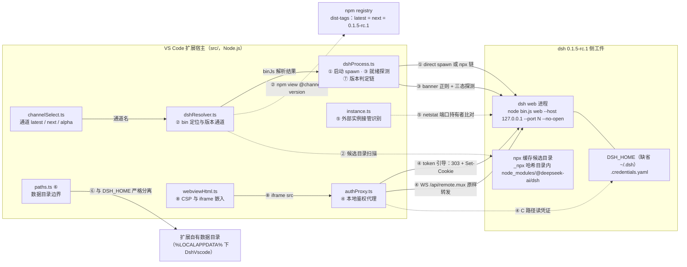
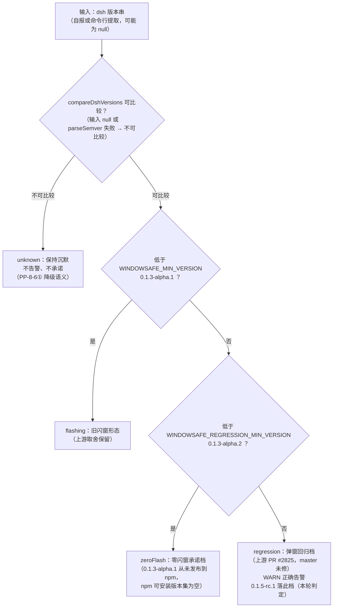

# 0.1.20 设计方案 — dsh 0.1.5-rc.1 适配判定与回归验收

> 版本：v2 ｜ 日期：2026-09-10 ｜ 状态：评审通过（用户 2026-09-10）
> 链路性质：A1 链架构师环节。上游仓库（D:\working\projects\deepseek-harness）全程只读 git 命令 + 只读 npm view 查询；扩展仓库零代码改动（本轮只产出设计）。
> 名词说明：「集成面」指本扩展与 dsh 之间所有相互依赖的接口点（启动命令行、输出解析、端口、鉴权、数据目录等）。

## 修订记录

- v1（2026-09-10）：首轮取证与设计。核心结论：**0.1.5-rc.1 相对扩展当前已复验基线（0.1.5-alpha.1）在全部集成面锚点上源码零改动或兼容增量，适配项 0 项（no-adaptation 结论延续，第 6 份同题判定）**；最重要的环境事实是 **npm dist-tags 已变为 latest = next = 0.1.5-rc.1**——默认通道用户将直接跳到 rc.1，因此本轮重点是把「默认通道大跳变」的回归验收方案设计完整。隐藏形态弹窗回归在 rc.1 未修（windows-job.ts 实读），既有 WARN 阈值继续正确。
- v2（2026-09-10，QA 设计检查 FAIL 回环修订，retry=1）：逐项处置 QA findings 三项。**D3（MAJOR，已修复）**：补两张 Mermaid 图——§3.1 开头「集成面架构图」（8 个集成点拓扑可视化）+ §3.2 末尾「隐藏形态版本判定四态图」（judgeWindowSafeByVersion 判定决策图）；图是对既有结论的可视化，不改任何判定。**MINOR-1（采纳，已修复）**：§零 中 0.1.19 报告文件名更正一字（「集成点」→「集成面」，与 docs/ 下实际文件名一致）。**MINOR-2（采纳，已修复）**：R1 的「505 断言」补三口径取数方法并落盘实测证据（`.dsh/tmp/architect/0.1.5-rc1-inv/assertion-count-rev2.txt`）——QA 粗查 `check\(` = 511 = 静态口径 510（`^\s*check\(` 行首锚定，排除 sim.mjs:159 函数定义行）+ 定义行 1；静态 510 − 互斥分支双写 5 = 每次运行实际执行的断言 505；验收执行以 sim 实际输出的 PASS/FAIL 行总数为准。**核心结论零变化**：适配项仍为 0 项，no-adaptation 判定延续，`WINDOWSAFE_REGRESSION_MIN_VERSION` 维持，未缩小任何验收范围。
- v2 补记（2026-09-10，不新开版本号）：用户评审通过本设计（2026-09-10）；可选项 O-1（WARN 文案与注释时代锚点刷新）、O-2（通道文案失真修正）、O-3（sim 版本字面钉住 rc.1 归段）三项全部批准立项，由开发专家随首轮实施落地。判定结论零变化。

## 零、前置参考（provenance）

**上游取证基线**（`D:\working\projects\deepseek-harness`，master 分支，全程只读）：

| 项 | 值 | 证据 |
|---|---|---|
| HEAD | `2377c272a8`（Merge PR #3908，README 双语校对），`git describe` = `dsh-v0.1.5-rc.1-7-g2377c272a8` | `git log -1` / `git describe --tags` |
| tag 锚点 | `dsh-v0.1.5-alpha.1` = `5dda764ed3`（2026-09-08）；`dsh-v0.1.5-alpha.2` = `b2e3b2a012`（2026-09-09，0.1.19 报告时点尚未存在）；`dsh-v0.1.5-rc.1` = `183f08e9c6`（2026-09-10，Merge PR #3912） | `git tag -l` + `git log -1 <tag>` |
| **tag 树 = 发布树** | `git diff 1ef9c1fa9a..183f08e9c6` 为空（release 提交 `1ef9c1fa9a` "release(dsh): 0.1.5-rc.1"），与 alpha.1 同模式 | 空 diff 实测 |
| 版本号 | 根 `@deepseek-ai/dsh-root 0.1.5-rc.1`；`apps/cli` `@deepseek-ai/dsh 0.1.5-rc.1` | `git show <tag>:package.json` |
| 提交量 | alpha.1→rc.1 = 279 提交（diff 1506 文件，+31725/−11458）；alpha.2→rc.1 = 17 提交 | `git rev-list --count` / `git diff --stat` |

**npm registry 实测基线**（2026-09-10，`npm view`，缓存副本 `.dsh/tmp/architect/0.1.5-rc1-inv/npm-cache`）：

| 项 | 值 |
|---|---|
| dist-tags | **`latest = 0.1.5-rc.1`、`next = 0.1.5-rc.1`、`alpha = 0.1.5-alpha.2`**（0.1.19 报告时点：latest = next = 0.1.2-rc.1、alpha = 0.1.5-alpha.1） |
| 点查 `@0.1.5-rc.1` | 返回 0.1.5-rc.1（存在） |
| 版本序列尾部 | …0.1.3-alpha.2, 0.1.5-alpha.1, 0.1.5-alpha.2, 0.1.5-rc.1（无 0.1.4、无 0.1.5 stable） |

**扩展侧基线**：分支 `feature/dsh-alpha-compat`（领先 origin 23 提交，工作区干净），package.json version = 0.1.18。版本判定锚点常量现状：`TOKEN_AUTH_MIN_VERSION = '0.1.2-alpha.2'`、`WINDOWSAFE_MIN_VERSION = '0.1.3-alpha.1'`、`WINDOWSAFE_REGRESSION_MIN_VERSION = '0.1.3-alpha.2'`（src/dshProcess.ts:471/480/489）。

**历史基线（必读沿袭）**：`docs/0.1.17调研报告-dsh-0.1.3-alpha集成点复验与免常驻窗.md`（v3，回归机制与区间判定的证据源）、`docs/0.1.18调研报告-dsh-alpha集成点复验-v4.md`（tag→tag 增量方法学）、`docs/0.1.19调研报告-dsh-0.1.5-alpha集成面复验与回归判定.md`（alpha.1 发布物取证与三类清单；v2 勘正：v1 误写「集成点」，按 docs/ 实际文件名更正——QA MINOR-1）。本轮 = 该序列的直接续篇。
**过程记录**：本轮全部原始证据自含 `.dsh/tmp/architect/0.1.5-rc1-inv/`（证据笔记 `README-evidence.md` + npm 缓存副本；v2 增补断言计数实测 `assertion-count-rev2.txt` 与 QA findings 处置记录 §7）。轮级清理核对（v2）：上一轮产物 `0.1.5-rc1-inv/` 全部仍被本文档引用、保留；`.dsh/tmp/architect/rc0118/` 属 0.1.18 问题分析链证据且被 `docs/0.1.18问题分析-sim无头回归脚本非确定性崩溃根因与修复方案.md` 引用，非本轮遗留、不在清理范围。本轮无删除项。

---

## 一、目标/背景分析

1. **直接动因**：dsh 上游发布 `0.1.5-rc.1`（release 提交 `1ef9c1fa9a`，tag `dsh-v0.1.5-rc.1`），本地 deepseek-harness 检出已同步到该版本。需要判定：扩展要不要改（适配项）、哪些变更与扩展相关（影响评估）、如何验收（回归方案）。
2. **最高优先级的环境事实（本轮实测）**：npm dist-tags 的 `latest` 已从 `0.1.2-rc.1` 前移到 `0.1.5-rc.1`。扩展的默认配置 `dsh.channel = 'latest'`（package.json:99）意味着**默认通道用户在下次原地刷新或重拉时，将直接从 0.1.2-rc.1 跳到 0.1.5-rc.1**。这是自 0.1.14 通道机制上线以来默认通道的第一次跨线前移（0.1.2 → 0.1.5），影响面比此前历次复验（alpha 通道前移）大。
3. **次优先级子问题（沿 0.1.17/0.1.19 口径）**：dsh 0.1.3-alpha.2 引入的隐藏形态弹窗回归（上游 PR #2825，native runner 的 spawn 无 windowsHide）在 0.1.5-rc.1 是否已修——此判定直接决定 `WINDOWSAFE_REGRESSION_MIN_VERSION` 回归阈值的存废：修了则阈值可放宽（须用户评审），没修则阈值继续有效、WARN 继续为真值。
4. **版本号方案面**：`0.1.5-rc.1` 是标准 semver 预发布写法（连字符），需核对扩展比较器、自报版本解析、npm view 输出校验对该字符串的全部行为。

## 二、范围分析（做什么、不做什么）

**做**：
- 扩展与 dsh 集成面的逐点清单与证据（双方 file:line）；
- 版本基线判定（扩展当前适配到哪一版、rc.1 相对基线的差异切片）；
- alpha.1→rc.1 全区间（含 alpha.2，共 279 提交）按集成面路径切片 diff，逐项标注对扩展的影响（无需改 / 兼容增量 / 待验证）；
- 适配方案（判定结论 + 可选优化项）与回归验收方案（无头 + 真机双线，含验收标准）；
- 风险与未决问题登记。

**不做**：
- 不改任何生产代码（本轮为设计轮；适配项判定为 0，无可实施代码变更）；
- 不做真机 GUI 验收（剧本已备，由用户按 §九 执行）；
- 不修改上游仓库、不代用户裁决可选项（O 项一律列为待用户决策）；
- 不触碰运行中的 dsh 实例。

---

## 三、系统设计与判定（集成面清单、变更切片、适配方案）

### 3.1 集成面清单与证据（扩展侧逐点核实）

**集成面架构图**（v2 补图，QA D3）：8 个集成点与下表编号一一对应；实线 = 运行时强耦合路径，虚线 = 解析 / 探测 / 取证类交互。要点：面板 iframe 不直连 dsh，一律经扩展侧 authProxy 本地代理接入（token 契约下 iframe 直连被 SameSite=Strict 阻断，0.1.14 ADR-30 既定拓扑）；扩展自有数据目录与 dsh 的 `DSH_HOME` 严格分离。

（图中 file:line 级证据见下表；各集成点在 alpha.1→rc.1 区间的变更判定见 §3.3。）

| # | 集成点 | 扩展侧实现（file:line） | 依赖的 dsh 侧契约 |
|---|---|---|---|
| ① | 启动命令行 | src/dshProcess.ts:1051（direct：`node <binJs> web --host 127.0.0.1 --port N --no-open`）；:377-384（npx 链：`npx --yes --prefer-offline @deepseek-ai/dsh@<channel> web --host 127.0.0.1 --port N --no-open`）；:1074-1078（`DSH_HOME` 环境变量透传） | `web` 子命令 + `--host/--port/--no-open` 参数（apps/cli/src 零改动 → 契约不变） |
| ② | bin 定位与版本通道 | src/dshResolver.ts:27（包名 `@deepseek-ai/dsh`）、:197-198（npx 缓存候选 `…\_npx\<hash>\node_modules\@deepseek-ai\dsh\{package.json, lib\bin.js}`）、:399-410（`npm view …@<channel> version`）、:487（候选版本字符串相等匹配）；src/channelSelect.ts:26 + src/extension.ts:48-53（通道 latest/next/alpha 与归一） | 包名、`lib/bin.js` 入口（主包 `bin.dsh = lib/bin.js` 不变）、npm dist-tag 三值存在 |
| ③ | 端口/就绪判定 | src/dshProcess.ts:424（banner 正则 URL_RE）/ :615-623（日志解析）/ :1113-1140（三态探测：裸 `GET /` 200+`__DSH_BOOT__`、token-303、cookie 200）；src/runtime.ts:127-133（端口可绑定预检） | banner 行 `dsh web: http://127.0.0.1:<port>/?token=…`（packages/bundle/web-app/src/index.ts:271 原文逐字核验）；`__DSH_BOOT__` 注入（packages/client/modules/src/index.ts:507 global 行原样；webserver 注入机制 src 零改动） |
| ④ | token 鉴权与 authProxy | src/authProxy.ts 全文——token 引导 `GET /?token=<t>` 期望 303+Set-Cookie（:351-368）；cookie 名 `dsh-auth-`+base64url(sha256(authority))（:110）；C 路径自铸：`<DSH_HOME>/.credentials.yaml` → `records['client-connection/browser-session'].payload.secret`（:152-184）；Host/Origin 改写（:220-225）；WS `/api/remote.mux` 原样 TCP 转发（:277-299） | packages/client/connection/src（browser-auth.ts、api-request-trust.ts）与 packages/credentials 在区间内 src 零改动 → 契约不变 |
| ⑤ | 外部实例接管 | src/instance.ts:514-517（looksLikeDsh：命令行含 `@deepseek-ai/dsh` / `--profile web` / dsh bin 路径正则）；:474-492（netstat 端口持有者） | 命令行形态（packages/boot/cmdline src 零改动）与 bin 路径约定不变 |
| ⑥ | 数据目录边界 | src/paths.ts:18-24（扩展自有数据目录 `%LOCALAPPDATA%\DshVscode`，与 dsh 的 `DSH_HOME` 严格分离）；src/authProxy.ts:154（dshHome 缺省 `~/.dsh`） | packages/home-paths src 零改动 → dsh 侧目录布局不变 |
| ⑦ | 版本判定链 | src/dshProcess.ts:503-595（parseSemver / compareDshVersions / judgeContractByVersion / judgeWindowSafeByVersion）；src/launchInfo.ts:29/41（自报版本与命令行版本正则） | 版本字符串 `0.1.5-rc.1`（标准 semver；registry 与 git 双证实） |
| ⑧ | 面板嵌入 | src/webviewHtml.ts:66（CSP `frame-src http://127.0.0.1:*`）、:107（iframe src = runtime.url）；消息协议自有（src/panelMessages.ts / src/webviewHtml.ts postMessage） | 与上游页面内部零耦合（扩展仅锚 `__DSH_BOOT__` + URL + token 三点） |

### 3.2 版本基线判定

1. **扩展当前适配基线**：扩展按「版本阈值 + 运行时实判」适配任意 dsh 版本，不存在硬编码的单版本依赖；最近一次完成的集成面复验 = 0.1.19 调研报告（对 dsh 0.1.5-alpha.1）。本轮在 0.1.19 基础上把基线推进到 0.1.5-rc.1，差异切片取 tag→tag（`5dda764ed3..183f08e9c6`），中间包含未单独复验过的 0.1.5-alpha.2（其变更已并入全区间切片，无遗漏面）。
2. **`0.1.5-rc.1` 字符串的全链行为**（源码级推演，锚点见 §3.1-⑦）：解析为 `{0,1,5,['rc','1']}`；`judgeContractByVersion` → `token`（core 0.1.5 > 0.1.2）；`judgeWindowSafeByVersion` → `regression`（core 0.1.5 > 0.1.3，且回归真实存在，见 §3.3-⑥）；`SELF_VERSION_RE` / `CMDLINE_VERSION_RE` / npm view 输出校验 `/^[\w.+-]+$/`（dshResolver.ts:408）全部匹配。**判定链零改动即可正确处理新版本号。**

**隐藏形态版本判定四态图**（v2 补图，QA D3）：`judgeWindowSafeByVersion`（src/dshProcess.ts:587-595）为纯函数判定，四档互斥且穷尽；下图为判定决策的可视化（输入一个版本串，落一个档位，不是运行时状态转移）。`0.1.5-rc.1` 落 regression 档 → WARN 为正确告警（§3.3-⑥）；unknown 档「保持沉默」语义来自 judgeContractByVersion 的 PP-8-6① 降级纪律（不虚构版本事实）。

### 3.3 alpha.1 → rc.1 变更清单（逐项标注对扩展的影响）

| # | 变更项 | 实测内容 | 对扩展的影响判定 |
|---|---|---|---|
| ① | 启动 CLI | apps/cli/src **零文件变更**（11 文件变更全为 package.json / README 双语文案 / 测试夹具；新增依赖 `@deepseek-ai/dsh-tool-present`） | **无需改**——`web --host/--port/--no-open`、`--profile` 形态、退出码语义（README 关停段未触碰）全部原样 |
| ② | banner 输出 | packages/bundle/web-app/src 零文件变更；banner 原文（src/index.ts:271）逐字核验一致 | **无需改**——URL_RE（端口）+ TOKEN_RE（`?token=` 值后接空格再接 ` (LAN:`，边界成立）匹配面不变 |
| ③ | `__DSH_BOOT__` 注入 | packages/client/modules/src 零变更（global 注入行 src/index.ts:507 原样）；packages/host/webserver/src 零变更 | **无需改**——就绪探针与页脚注入契约不变 |
| ④ | token/cookie/信任契约 | packages/client/connection/src（browser-auth.ts、api-request-trust.ts）与 packages/credentials **零 src 变更**（仅版本号） | **无需改**——authProxy R1-R10 全部前提不变 |
| ⑤ | 端口/数据目录/接管特征 | webserver / home-paths / connection / boot/cmdline 仅版本号变更 | **无需改** |
| ⑥ | **隐藏形态弹窗回归** | packages/subprocess 仅版本号变更；windows-job.ts runner spawn（:134-141）实读仍为 `{cwd, env, stdio}` 三键、**无 windowsHide** | **无需改阈值**——回归在 rc.1 未修，`judgeWindowSafeByVersion('0.1.5-rc.1')` → `regression` 是**正确告警**（非误报）；WARN 文案「上游 master 未修」在当前 master HEAD（2377c272a8）仍为真值 |
| ⑦ | web profile 插件组合 | web-app bundle 的 cordis.patch.yml：UI 插件替换（`ui-sidebar-textpreview` → `ui-sidebar-documentpreview`）；base：默认模型名 `deepseek-v4-flash` → `deepseek-flash`、新增 tool-present 插件 | **无需改**——模型/工具/UI 插件面均在上游页面内部，扩展零耦合；嵌入页内用户可感知的改进另见 ⑨ |
| ⑧ | UI / 前端大改 | packages/client/ui-*（25.2% 变更量）、apps/web（+1890/−673）等 | **无需改**——扩展与页面仅三个锚点（§3.1-⑧），页面内部重构不触碰锚点；嵌入后的实际体验列入 GUI 验收 |
| ⑨ | 原生目录选择对话框修复 | packages/host/directory-picker-native/src：合成 Alt 键按下-抬起（keybd_event），使后台宿主拉起的原生选择框能正常到前台 | **无需改（登记观察）**——嵌入面板内点「选择目录」时原生对话框可预期到前台，属用户可见改进，非扩展契约 |
| ⑩ | npm dist-tags | latest = next = 0.1.5-rc.1；alpha = 0.1.5-alpha.2 | **无需改配置枚举**（三 dist-tag 均存在，归一逻辑不受影响）；**需回归验收覆盖默认通道跳变**（§3.4 / §九 R1） |

### 3.4 适配方案（结论：代码适配项 0 项；可选优化项 3 项，待用户裁决）

**判定：全部 8 个集成点在 alpha.1→rc.1 区间内源码零改动或兼容增量，扩展不需要任何代码变更即可正确启动、监督、探测、鉴权 0.1.5-rc.1。** 依据：§3.3 逐项「无需改」判定 + §3.2 判定链对新版本号的全链正确性。

**可选优化项（不改不坏，改了更好；一律待用户评审裁决，本轮不实施）**：

| # | 项 | 内容 | 位置 | 不改的后果 |
|---|---|---|---|---|
| O-1 | WARN 文案与注释的时代锚点刷新 | 在既有 0.1.19 O-1 基础上补记：回归截至 0.1.5-rc.1（2026-09-10 发布）仍未修复，已横跨 0.1.3-alpha.2、0.1.5-alpha.1、0.1.5-alpha.2、0.1.5-rc.1 四个已发布版本；同步刷新 dshProcess.ts:483-489 注释与 extension.ts:66-71 注释 | src/dshProcess.ts:906 等 | WARN 继续正确触发，仅时代锚点渐旧 |
| O-2 | 通道文案失真修正 | `dsh.channel` 枚举描述与通道选择卡把 latest 写为「经典启动契约，面板直连可用」；实际 latest 自 0.1.2-rc.1 起即为 token 契约，面板经本地代理（authProxy）接入，并非直连（失真起点早于本轮，非 rc.1 引入；latest 前移到 rc.1 后失真更显著——首次拉取量更大，「首次冷拉取可能需数分钟」的提示也应收编进 latest 文案） | package.json `dsh.channel` enumDescriptions[0]；src/channelSelect.ts:60 | 首启通道选择卡的描述与实际会话形态不符，误导用户预期 |
| O-3 | sim 版本字面钉住 rc.1 归段（测试侧） | PP-13-1 增补两例：`judgeWindowSafeByVersion('0.1.5-rc.1') === 'regression'`、`judgeContractByVersion('0.1.5-rc.1') === 'token'`（期望值引用导出常量，版本字面仅作测试输入，与既有手法一致） | scripts/sim.mjs（0.1.17 additions 节） | 归段正确性目前由单调性推论覆盖（PP-13-1⑥ 0.1.4 同理）；钉住后成为显式回归基线 |

**架构观察（无行动项）**：上游 UI 包与桌面形态持续演化（0.1.19 报告 A-2 的「无端口传输」观察沿袭）；扩展的 authProxy 拓扑与注册表仲裁不受本轮任何上游变更影响。

### 3.5 默认通道跳变的运行时行为推演（latest：0.1.2-rc.1 → 0.1.5-rc.1）

- 契约档：0.1.2-rc.1 与 0.1.5-rc.1 均 ≥ `TOKEN_AUTH_MIN_VERSION`（0.1.2-alpha.2）→ **token 契约档不变**，面板继续走 authProxy 本地代理，无档位翻转、无降级路径触发。
- 升级路径：resolver 新鲜度窗口（24h）过期后 `npm view` 命中 0.1.5-rc.1 → 无版本匹配候选 → ⑤ 原地刷新（90s 预算）或 ⑥ npx 链重建；显式「重新检查更新」（forceRelaunch）则强制刷新。首次启动变慢属既有预算内行为（§六）。
- start 常驻窗形态（npx 载荷）同理：`npx --prefer-offline @deepseek-ai/dsh@latest` 解析到 rc.1；冷缓存超 60s 预算的既有取舍（W-02）覆盖。

---

## 四、可行性分析（含探针数据）

1. **判定方法学可行**：tag 树与 release 树零 diff（分析对象无错位）+ 集成面路径切片 diff（1506 文件中扩展相关路径全部命中「零 src 或仅版本号」）+ 三个锚点原文实读（banner :271、`__DSH_BOOT__` 注入行 :507、runner spawn :134-141）。原始输出存 `.dsh/tmp/architect/0.1.5-rc1-inv/`。
2. **registry 探针**：dist-tags 实测证明 rc.1 已发布且 latest/next 已前移（本轮最重环境事实）；alpha 停在 alpha.2。
3. **判定链可行性**：扩展版本判定为「阈值 + 预发布感知比较器」设计（0.1.14 ADR-30 预留的「future 0.1.2-rc.x / 0.1.3+ 自动覆盖」路线），本轮实测推演证实对 `0.1.5-rc.1` 全部正确——设计意图兑现。
4. **结论**：适配可行且无需代码变更；回归验收可先全链无头执行（编译 + sim 全绿，断言计数取数方法见 §九 R1 三口径），真机侧仅剩「默认通道升级跳变 + 嵌入页体验」一个聚焦场景。

## 五、可维护性分析

- 版本锚点继续集中单点（`TOKEN_AUTH_MIN_VERSION` / `WINDOWSAFE_*` 双常量 + 纯函数判定），新版本号无需改码即被正确归类——本设计的目标态就是「零代码适配」，维护成本最低。
- 复验报告序列（0.1.17 v1-v3 / 0.1.18 v4 / 0.1.19 / 本轮 0.1.20）已形成 dsh 版本升级的标准动作：tag 锚定 → 集成面切片 diff → 八点判定 → 无头回归。后续 rc/stable 发布沿用同一方法学即可。
- 通道文案（O-2）若修正，应随下一代码轮落入 package.json 与 channelSelect 文案单点两处，避免再次分叉。

## 六、性能分析（定量指标）

| 指标 | 现状（扩展侧常量，本轮未动） | rc.1 影响评估 |
|---|---|---|
| direct 启动就绪预算 | 90s（STARTUP_TIMEOUT_MS，dshProcess.ts:445） | 不变（apps/cli src 零改动，启动序列一致） |
| start 常驻窗就绪预算 | conhost/start 30s；npx 载荷 60s（:170/226） | 不变；rc.1 冷缓存首次安装可能逼近 60s 预算，既有 W-02 取舍（超预算 ×2 失败 → direct 降级）覆盖 |
| resolver 刷新时延 | npm view 8s / 原地刷新 90s（dshResolver.ts:29/33） | 不变；latest 前移后首次刷新多一轮 install（秒级到分钟级，有 npm 缓存） |
| 包体积/依赖增量 | — | base bundle 新增 1 个工具包（tool-present），安装体积增量微小，不触碰任何预算常量 |

## 七、附加（接口契约、注册表结构）

- **dsh 启动契约现状表（rc.1 实读）**：启动 = `web --host 127.0.0.1 --port N [--no-open]`；banner = `dsh web: <authenticatedUrl>[ (LAN: …)]`；token 会话 = `GET /?token=<t>` → 303 + Set-Cookie（cookie 名 `dsh-auth-<sha256url(authority)>`）；页脚注入 = `window.__DSH_BOOT__`（client/modules global 行）+ `__DSH_BOOT_READY__`（webserver READY_MARKUP）；数据目录 = `DSH_HOME`（缺省 `~/.dsh`，`.credentials.yaml` 结构不变）。
- **扩展注册表结构**（instance.json）本轮零变化：`dsh{pid,port,managedBy,startedAt,launchMode?,processStartedAt?}` + `windows[]`；authProxy / banner token 仍为内存态不落盘（D3 纪律延续）。
- **vscode 贡献点**：本轮无新增。

## 八、决策记录与风险

| 项 | 内容 |
|---|---|
| no-adaptation 裁定 | 8 集成点在 alpha.1→rc.1 区间全部「源码零改动」或「兼容增量」，**适配项 0 项**（第 6 份同题判定，与 0.1.17 v1-v3、0.1.18 v4、0.1.19 同向延续） |
| 回归阈值裁定 | `WINDOWSAFE_REGRESSION_MIN_VERSION = '0.1.3-alpha.2'` 维持——rc.1 的 runner spawn 实读无 windowsHide，回归未修，WARN 为正确告警 |
| 待用户决策 | O-1（时代锚点刷新）、O-2（通道文案修正）、O-3（sim 版本字面钉住）是否立项；GUI 验收窗口安排 |
| 新增 ADR | 无（无代码变更轮，不触发新 ADR） |

**风险与未决问题**：

1. **R1（本轮主风险，已被验收方案覆盖）**：默认通道 latest 从 0.1.2-rc.1 跳到 0.1.5-rc.1。契约面已逐点核实一致，但上游页面（apps/web + ui-*）大改后的**嵌入体验**（面板 iframe 内的页面行为、字号布局、目录选择对话框到前台等）只能真机 GUI 验收覆盖——已列入 §九 R3。
2. **R2（既有风险延续）**：隐藏形态弹窗回归已横跨四个发布版本未修；常驻形态（默认 `consoleVisible=true`）零弹窗、不受影响；`WINDOWSAFE_REGRESSION_MIN_VERSION` 改置继续等上游修复版 + 用户评审（0.1.17 既定路径）。
3. **R3（未决，沿 0.1.19 如实记录）**：0.1.4 跳号原因在上游 git 与 registry 均无记载；0.1.5-alpha.2 无独立复验报告（其变更已并入本轮 alpha.1→rc.1 全区间切片，判定不受影响，但「每发布一验」的粒度断档如实披露）。
4. **R4（低风险，登记）**：alpha 通道停在 0.1.5-alpha.2，选 alpha 的用户暂时不会拿到 rc.1——属上游发布策略事实，非缺陷；next 与 latest 同指 rc.1，枚举描述「当前与 latest 相同」仍为真值。

---

## 九、实施清单

> 适配项 0 项 → 本清单只有「回归验收」与「可选优化项」两类；可选项未经用户评审批准不得实施。

- [ ] **R1 无头回归验收**【目标角色：测试专家】：`npm run compile`（或契约基线 `node node_modules\typescript\bin\tsc -p tsconfig.json`）零错误 + `node scripts/sim.mjs` 全绿（`DSH_VSCODE_DATA_DIR` 指向工作区内临时目录）。**验收标准：0 FAIL**；任何 FAIL 即回环架构师。
  - **断言计数取数方法**（v2 补记，QA MINOR-2；三口径均可重放，实测存 `.dsh/tmp/architect/0.1.5-rc1-inv/assertion-count-rev2.txt`）：① **QA 粗查口径** `Select-String -Path scripts/sim.mjs -Pattern 'check\('` = 511 = 静态口径 + sim.mjs:159 函数定义行 `function check(name, cond)` 1 条；② **静态口径** `Select-String -Path scripts/sim.mjs -Pattern '^\s*check\('` = **510 行**（行首缩进的 check( 调用行，锚定后天然排除函数定义行）；③ **运行时口径** = 每次实际执行的 check 断言 **505 条**（静态 510 − 互斥分支双写 5 条：PP-3-1② 变体二选一 sim.mjs:2196/:2202、PP-3-1①②③ flip-back 构建失败兜底 3 条 :2210-2212、PP-3-3③ 变体二选一 :2309/:2312——这 5 条在常规运行中不执行）。v1 所写「505 断言」即此运行时口径，当时未附取数方法，v2 补记。**验收执行以 sim 实际输出的 PASS/FAIL 行总数为准**（SKIP 行用 skip() 输出、不计入断言数）。
- [ ] **R2 版本判定探针（可与 R1 合并执行）**【目标角色：测试专家】：一次性 Node 探针断言 `judgeContractByVersion('0.1.5-rc.1') === 'token'`、`judgeWindowSafeByVersion('0.1.5-rc.1') === 'regression'`、`compareDshVersions('0.1.5-rc.1','0.1.2-rc.1') > 0`、`parseSelfVersion('0.1.5-rc.1') === '0.1.5-rc.1'`。如用户批准 O-3，则本项固化进 sim PP-13【目标角色：开发专家】。
- [ ] **R3 真机 GUI 验收**【目标角色：用户】：按 `docs/联调测试剧本.md` 执行默认通道升级场景——①触发「重新检查更新」→ runtime.log 出现 forced refresh 命中 0.1.5-rc.1；②受控重拉后面板嵌入正常、无 401 闪现（authProxy 会话）；③openInBrowser 带 token 直达；④探活/停止/重启生命周期正常；⑤隐藏形态（consoleVisible=false）下 WARN 行如实触发（回归告警为预期现象）；⑥面板内触发目录选择时原生对话框能到前台（⑨ 项上游改进的实测点）。验收通过后在本文件头部状态行与 docs/README.md 索引行回填结果。
- [ ] **O-1 WARN 文案与注释时代锚点刷新**【目标角色：开发专家】（可选，待用户批准；批准后随代码轮实施并同步 sim PP-13-2① 文案断言）。
- [ ] **O-2 通道文案修正**【目标角色：开发专家；文案须经用户评审】（可选）：package.json `dsh.channel` enumDescriptions 与 src/channelSelect.ts 通道卡描述改为与实际会话形态一致（latest 亦为 token 契约、面板经本地代理接入、首次冷拉取可能较慢）。
- [ ] **docs/README.md 索引行补录**【目标角色：开发专家】（ADR-44：随本链开发轮尾随提交更新，索引行集与目录实物双向对账零差异）。
- [ ] **本文件头部状态行回填**【目标角色：QA / 开发专家】：评审通过后「待评审」→「评审通过」；R3 完成后补记验收结论。

> 评审人：用户 ｜ 状态：评审通过（2026-09-10）｜ 日期：2026-09-10
