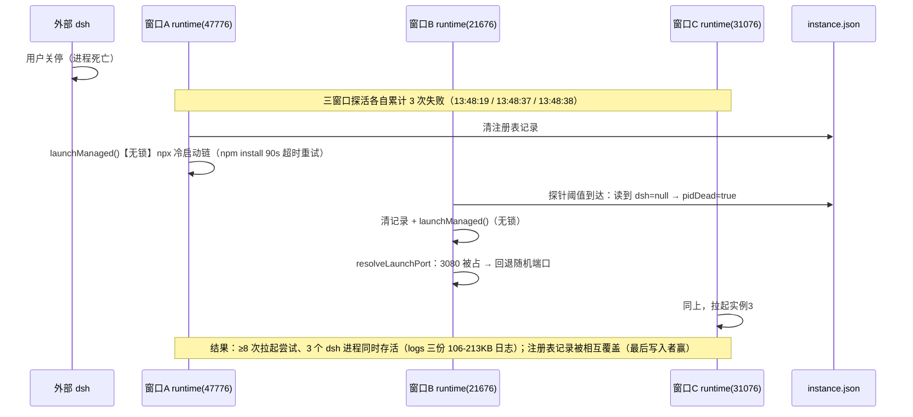
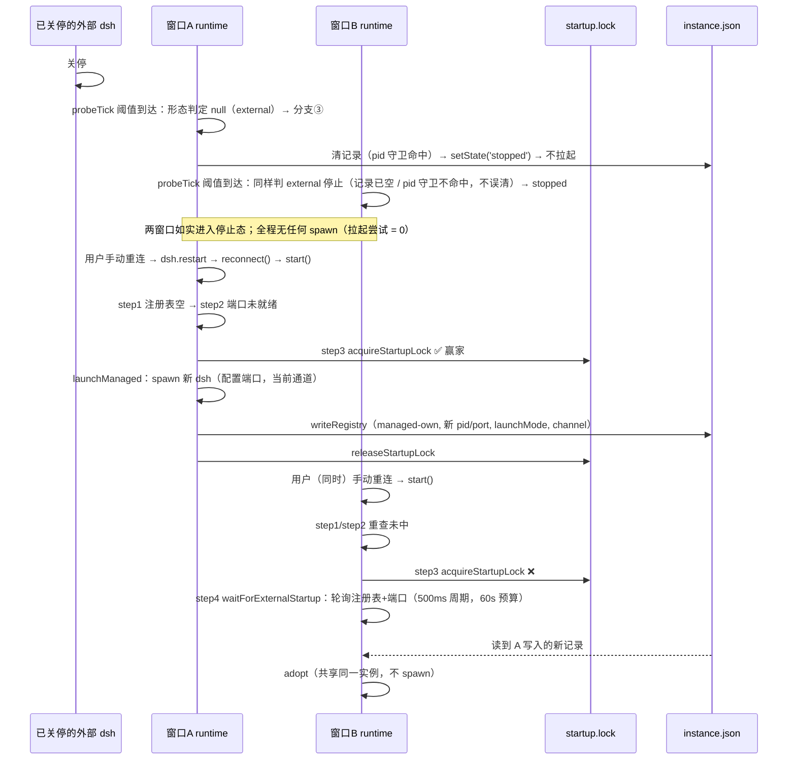

# 0.1.21 问题分析 — 多窗口重复拉起 dsh 与通道切换按钮失效根因与修复方案

> 版本 6（QA 复审遗留小范围返工版：K-1～K-6 全部为文档修正，不改变任何已裁决设计） | 日期 2026-09-10 | 状态：已通过用户评审（2026-09-10），进入开发
>
> **修订记录**
>
> | 版本 | 日期 | 变更 |
> |---|---|---|
> | 1 | 2026-09-10 | 初版（本链架构师产出）：两缺陷根因分析 + 探针 12 PASS/0 FAIL + 修复设计 + PU-21-1~6 用例设计。 |
> | 2 | 2026-09-10 | **三方收敛**：workspace 内出现三份同主题未入库文档（本 v2 基准 = 初版 A；外来 B《0.1.21修复设计-多窗口实例收敛与通道切换重启生效》、C《0.1.21根因分析与修复设计-多窗口重复启动与通道切换重启无响应》）。本轮逐条核实 B/C 独有发现（现场只读取证 + 源码实读 + git 实证 + 契约原文检索），**吸收 B 7 条、C 6 条**（来源逐条标注），**驳回 5 处**（附核实依据，见 §八收敛裁决记录）；现场证据（三窗口 13 秒三份日志、instance.json 外部实例记录）并入 §3.0 证据节；根因、修复方案、验收标准、sim 用例整合为单一方案（用例并集去重后 12 条，统一 PU-21-* 编号）。B/C 原文未做任何修改。 |
> | 3 | 2026-09-10 | **QA 设计检查返工轮 1**（findings F-1～F-5 逐项处置）：**F-1（MAJOR，已修复）** §3.0「13 秒内三份日志」批次归属改正——13 秒跨度属 13:52 重试批次（文件名内嵌 13:52:27/39/40，本轮 Get-ChildItem 复测证实），三份存活日志创建时刻 13:55:19/13:56:46/13:56:58、首尾相隔 99 秒；CR-6 同步改正；§一「现场证据」引述核对无矛盾（该处只引「8 次拉起、3 实例存活」，不涉批次归属）。**F-2（MINOR，采纳）** §3.3 D-2 拦截点版本归属精确化：start() 入口守卫本体随扩展 MVP（`3b8bb40`，2026-08-22，git log -S 实证）引入；`e8fb8db`（0.1.6）新增 `reconnect()` 组合既有守卫，「ready 态静默拦截」的可感知面自 0.1.6 起。**F-3（MINOR，采纳）** §3.2 0.1.20 链改动文件枚举补全（补 `.gitignore` 3 行、`.vscodeignore` 1 行、根 `README.md` 4 行；git diff --stat 复测共 10 文件，src/ 零改动核心断言成立）。**F-4（MINOR，采纳）** runtime.log 引用全部改「时刻 + 锚文本」检索式口径并注明行号工具口径差异（混合行尾致不同工具行号相差数行；所引锚文本本轮实测全部检索命中，内容与时刻未变）。**F-5（SUGGESTION，采纳并提前落实）** 新增 §4.1 集中风险登记表（内容承自 §3.2/§3.4/§六/§8.3，不新增风险、不改结论），原建议为评审通过后补，现随返工轮直接补入便于评审对照。本轮取证方式：只读命令（Get-ChildItem / Select-String / git log -S / git diff --stat），未新增探针，未改生产代码。 |
> | 4 | 2026-09-10 | **QA 设计检查返工轮 2**（findings G-1～G-7 逐项处置）：**G-1（MAJOR，已修复）** 验收面与风险登记 R-1 对齐——§3.5 断言 B、§六性能表、§7.3 场景 3 补「锁赢家 ≤60 秒预算内就绪」前提与双结局通过标准（赢家超预算时输家等待超时进入 error、用户手动重连后 adopt，亦算通过结局，对齐出处 C 稿场景 A 原有双结局表述，兑现改动点 1 收敛说明「在验收标准中如实说明」的承诺）；§8.3 O-21-1 默认立场补写上述实际含义，避免用户评审基于「全部窗口自动收敛」的错误预期做裁决。**G-2（MAJOR，已修复）** 改动点 5 external 缺省闭环：adopt 认领 `attachedChannel = rec.channel ?? null`（不回退配置值），快照 channel 可为 null、渲染「未知」、待生效判定恒真（吸收出处 C 稿 §4.4 闭环解法，收敛裁决新增 CR-8 补记——v3 曾静默丢弃该深化）；PU-21-10 缺省场景断言随实现同步修订；§4.1 新增 R-7 登记「当前」行显示变化。**G-3（MINOR，已修复）** 改动点 1 收敛说明如实披露「别家已写注册表并释放锁后本窗口才到 step3」的残余双实例竞态窗口（§3.5 前置与断言 A 同步披露、探针 T3 行注明未覆盖、§4.1 新增 R-8）；裁决不变（工程权衡接受，C 的显式仲裁方案可闭合该窗口、由用户评审定夺）。**G-4（MINOR，已修复）** D-1 原话按出处 B 稿 §0.1 记录补全尾部问句「，你上面的修复包含这个吗？」（v3 引用曾静默截断，与「原样保留」声明不符）。**G-5（SUGGESTION，采纳）** PU-21-11 断言列显式化（state 保持 ready / 探针定时器为 null / 无 start 主体日志，形态参照探针 T4-a/b）。**G-6（SUGGESTION，采纳）** PU-21-12 扩展 package.json commands 静态断言与 HTML includes 断言（命令注册与按钮接线不再只靠 GUI 场景 1 兜底）；「setChannel 幂等」落到写设置侧具体函数（onDidChangeConfiguration 处理器与调用方；runtime.setChannel 现状只更新内存，不动）。**G-7（SUGGESTION，采纳）** PU-21-1 补防重入断言（吸收 C 稿 TEST-10 意图）。本轮只改本文档，未改 src/、scripts/ 与另两份被吸收稿。 |
> | 5 | 2026-09-10 | **用户评审裁决落档 + QA 设计检查第 2 轮遗留项处置**。**用户评审裁决（2026-09-10，逐项落档于 §8.2 用户评审裁决记录）**：① 设计整体通过，进入开发；② O-21-1 裁决为**不自动拉起**——外部管理的 dsh 关停后插件不代拉内置实例，各窗口如实进入停止态，由用户手动重连（推翻本文档原默认「保留自动拉起」），全文行为面随之改写：§3.4 D-1 改动点 1 重写为死亡分支按形态三分流（start 用户停止 / external 不自动拉起停止态 / direct 保持现状并划出裁决边界）、改动点 3 attachedLaunchMode 按新语义调整并消歧清理时机、PU-21-1/5 用例按新语义改写、PU-21-4 补 H-5 断言面（编号不变；v6 QA K-5 归因精确化：PU-21-4 主体语义 start 不复活不受本裁决影响，其 v5 实际改动是 H-5 断言面扩展）、§3.5 验收断言重写（外部死亡后拉起尝试 = 0，多窗口手动重连收敛 = 1）、§六性能表（外部死亡后拉起尝试 = 0）、§7.3 场景 3 重写、R-1 语境改手动重连；手动重连路径必须走 `start()` 既有锁仲裁（多窗口同时手动重连收敛到单实例）与 pid 匹配守卫两项改动保留；受管直启形态（`launchMode='direct'`）死亡后的既有自动重拉行为与窗口冷启动激活路径不在本次裁决范围、保持现状，边界写入 §二不做清单；③ H-2 裁决为维持既有 60 秒等锁预算、不新增 `dsh.startupWaitSec` 配置项，C 稿配置化方案注明备而不用；④ 文档处置：两份被吸收稿（《0.1.21修复设计-多窗口实例收敛与通道切换重启生效》《0.1.21根因分析与修复设计-多窗口重复启动与通道切换重启无响应》）移入 `docs/archive/` 归档，本文档成为唯一有效设计文档（§零/§8.2 关系声明同步更新）；⑤ 版本号 0.1.21 确认。**QA 第 2 轮遗留 findings 逐条处置（H-1～H-6 对照见 §8.4）**：H-1 三分流表状态枚举修正（`RuntimeState` 实为 idle/awaitingChannel/starting/ready/error/stopped，无 dead）并如实披露 starting 过渡期 pending 按钮可点导致的同窗口重入形态及其兜底依据 + PU-21-9 补断言；H-2 按用户裁决落 §8.2；H-3 DshProcess 注入 seam 改列 [开发专家] 独立实施清单条目；H-4 applyChannelRestart 判定源写明为 `this.options.channel`（依赖改动点 6 接线同步）+ noop 分支加 rlog；H-5 attachedLaunchMode 清理时机（释放/断开/清记录时置 null）进实施清单 + PU-21-4 补断言面；H-6 §3.5 断言 D 补残余竞态例外限定 + 出处 B 稿「不做注册表读-改-写竞争的全面治理」范围声明并入 §二。本轮只改本文档与两份被吸收稿的归档移动，未改 src/、scripts/、package.json。 |
> | 6 | 2026-09-10 | **QA 复审遗留小范围返工**（v5 复审轮 1 findings K-1～K-6，全部为文档修正，不改变任何已裁决设计；逐条处置对照见 §8.5）。**K-1（MINOR，已修复）**：PU-21-1 防重入断言拆成两支并修正归因——直接重复调 start() 时第二次才被入口 `attached` 守卫拦截（src/runtime.ts:368-369）；经 reconnect 的快速重复点击重连会先无条件重置 attached=false（src/runtime.ts:1198），第二次 start() 不被该守卫拦截，实际兜底是启动锁互斥 + step1/step2 重查（与 §3.4 starting 重入披露口径对齐），launchManaged 调用数断言两支均保留。**K-2（MINOR，已修复）**：GUI 场景 5 补停止态前提（先停止 dsh 再在设置界面直改通道、点面板 ⟳ 重连），原「ready 态直接改设置后点 ⟳」被 runtime 层入口守卫静默拦截（DR-2/DR-4 保留语义），预期「以新通道拉起」不会发生；运行中通道切换生效路径为详情卡 pending 按钮（场景 1）。**K-3（MINOR，已修复）**：§四资源可行性按 v5 三分流口径重述 D-1 改动面（原「单行改动」为 v4 方案量化口径，作废）；§五第 1 条改写为「external 与手动路径单一带锁入口」，direct 既有无锁 bounded relaunch（R-9）与 forceRelaunchManaged/applyChannelRestart 骨架直接调用面如实保留，原「launchManaged 仅被持锁者调用」表述作废。**K-4（SUGGESTION，已采纳）**：PU-21-2 前置改「死亡分支清记录时注册表已被别窗写入 pid 不同的新记录」、动作列「relaunch 分支」改「死亡分支清记录点」。**K-5（SUGGESTION，已采纳）**：修订记录 v5 行与 UR-2 归因精确化——PU-21-4 主体语义（start 不复活）不受 O-21-1 裁决影响，其实际改动是 H-5 断言面扩展，改列「PU-21-1/5 按新语义改写、PU-21-4 补 H-5 断言面」。**K-6（SUGGESTION，已采纳）**：收敛工作笔记 `.dsh/tmp/architect/consolidate-0121/notes.md` 本轮 glob+read 实测在场（QA 报告的 glob 口径未列出，如实记录实测结果），但其属临时产物、随链级闭环清理删除——§零 与 §8.2 改为「关键核实结论已固化于 §8.2 依据列，闭环后溯源以本文档为准」，消除对临时产物的溯源依赖。本轮只改本文档，未改 src/、scripts/、package.json、docs/联调测试剧本.md。 |
>
> 缺陷来源：用户真机反馈两条（原样保留，未软化）：
> - **D-1**：「当外部管理的 dsh 关停时，插件会自动启动内置 dsh 实例，但是每个 windows 窗口的插件都会发起启动，结果启动了好几个 dsh 实例，而不是共享一个，你上面的修复包含这个吗？」
> - **D-2**：「dsh 配置里的通道，当从 alpha 改成 latest 会出现重启 dsh 服务的按钮，但是点击按钮后没有任何反应，导致切换通道功能失效。」

## 零、前置参考

| 文档/代码 | 用途 |
|---|---|
| `docs/架构设计报告.md` | detached 生命周期模型与注册表仲裁总纲 |
| `docs/0.1.14设计方案-通道选择与token适配.md` | 通道模型与 ADR-29（①通道模型迁移 latest/next/alpha + ④先选择通道、后启动 dsh + ⑤改选提示重启生效、不自动重启） |
| `docs/0.1.6真机缺陷根因分析与解决方案.md` | 启动锁仲裁（step3/step4）与 ADR-21 用户停止判定原始设计出处 |
| `docs/archive/面板启动与生命周期根因分析.md` | ADR-2（detached 基线、stop/restart 不杀）与 P0-D client 语义出处 |
| `src/instance.ts` / `src/runtime.ts` / `src/extension.ts` / `src/webviewDetails.ts` / `src/webviewHtml.ts` | 本轮实读的根因证据面（A 初版面 + 收敛轮补充核实） |
| `.dsh/tmp/architect/probe-multiwindow.mjs` | 本轮无头探针（12 项断言全部通过，数据目录隔离） |
| `%LOCALAPPDATA%\DshVscode\instance.json` 与 `logs\` | 现场取证（§3.0，2026-09-10 只读采集） |
| 收敛轮工作笔记 `.dsh/tmp/architect/consolidate-0121/notes.md` | 三清单（一致/互补/矛盾）与逐条核实记录（**临时产物，随链级闭环清理删除**——本轮实读其在场；其关键核实结论已固化于 §8.2 各条「依据」列，闭环后溯源以本文档为准，v6 QA K-6） |
| `docs/archive/0.1.21修复设计-多窗口实例收敛与通道切换重启生效.md` | 被吸收稿 B（**已于 2026-09-10 用户评审裁决后移入 docs/archive/ 归档**；本文中的「出处 B」均指该归档稿） |
| `docs/archive/0.1.21根因分析与修复设计-多窗口重复启动与通道切换重启无响应.md` | 被吸收稿 C（**已于 2026-09-10 用户评审裁决后移入 docs/archive/ 归档**；本文中的「出处 C」均指该归档稿） |

> **文档关系声明（v5，用户评审裁决）**：本文档是 0.1.21 多窗口重复拉起与通道切换按钮失效问题的**唯一有效设计文档**。收敛过程中吸收的两份稿（原《0.1.21修复设计-多窗口实例收敛与通道切换重启生效》《0.1.21根因分析与修复设计-多窗口重复启动与通道切换重启无响应》）已于 2026-09-10 移入 `docs/archive/` 归档，仅供溯源，不再单独维护；正文中所有「出处 B」「出处 C」标注均指向归档稿。

## 一、目标/背景分析

两个真机缺陷都发生在多窗口共享仲裁模型（`%LOCALAPPDATA%\DshVscode` 注册表 + 启动锁）上：

- **D-1** 属于「自动重启路径绕过多窗口仲裁」：插件检测到 dsh 死亡后自行拉起新实例的代码路径，没有经过启动锁（startup lock，跨进程文件锁）仲裁，导致每个窗口都各自拉起一个实例。
- **D-2** 是「按钮意图与命令语义错位」：详情卡的「立即重启以生效」按钮最终触发的 `dsh.restart` 命令，其实现（reconnect）在运行就绪状态下被入口守卫直接拦截，什么也不做；即使放行，reconnect 的「只重连、永不杀 dsh」语义也无法完成「以新通道重启 dsh 进程」的切换意图。

两个缺陷的共同背景：启动锁仲裁只在「激活/重连」路径（`start()` 的 step1–step4）实现，而自动重启路径没有复用这套仲裁。

> 修复方向（v5 按用户裁决定案）：D-1 不再把「自动重启路径接入锁仲裁」作为主修复——2026-09-10 用户评审裁决（O-21-1 = 不自动拉起）确定外部形态死亡后插件不代拉内置实例，各窗口如实进入停止态、由用户手动重连（手动重连走既有锁仲裁）；「自动重启路径无锁」仅对受管直启形态按现状保留（§二不做 6）。D-2 修复方向不变（专用命令 + 快照真实性 + 设置面接线）。

现场证据（§3.0）显示：一次外部 dsh 关停触发了至少 8 次拉起尝试、3 个 dsh 进程同时存活；通道切换按钮的两次点击在日志里各只留下一行 `reconnect: requested` 后再无任何动静。

## 二、范围分析（做什么、不做什么）

**做**：

1. D-1/D-2 根因分析（file:line 证据 + 探针实测 + 真机日志）与 git 回归定位。
2. D-1 修复设计（按 2026-09-10 用户评审裁决，O-21-1 = **不自动拉起**）：死亡分支按形态三分流——外部形态（external）死亡后插件不再代拉内置实例，各窗口如实进入停止态、由用户手动重连；手动重连路径必须走 `start()` 既有锁仲裁（多窗口同时手动重连收敛到单实例）；清除注册表记录加 pid 匹配守卫；ADR-21「用户停止」判定补跨窗口防复活（attachedLaunchMode，出处 B）。
3. D-2 修复设计：新增「应用通道并重启」专用命令与专用动作，通道切换按钮改接线；快照通道真实性（注册表可选 channel 字段 + attachedChannel 记忆，出处 B）；设置面直改通道的同步接线（onDidChangeConfiguration，出处 C）。
4. sim 无头回归用例设计（12 条并集）+ GUI 人工验证步骤（供联调剧本收录）。

**不做**：

1. 不修改启动锁实现（探针证明锁本身互斥与陈旧锁回收正常，问题不在锁）。
2. 不修改 ADR-21 用户停止判定的单窗口语义（`launchMode === 'start'` 驻留控制台形态不自动拉起，是既有裁决；本轮只把该判定补齐跨窗口防复活，见 §3.4 改动点 3）。
3. 不修改 `dsh.restart` 命令既有语义（面板 ⟳ 在错误/停止态的重连行为保持不变）。
4. 不动外部 dsh 的「永不代杀」红线：外部实例（external）的通道切换只提示、不代杀。
5. 不把 C 提出的「reconnect 在 ready 态无待生效时探针被拆除」的修复纳入本轮（这是真实的次生缺陷，见 §3.2 附带发现 c；但修复会改动 reconnect 自身语义面，与本轮两缺陷主修复解耦，登记为另立事项，见开放项 O-21-5）。
6. **受管直启形态（`launchMode='direct'`）死亡后的既有自动重拉行为与窗口冷启动激活路径保持现状，不在本次 O-21-1 裁决范围**（2026-09-10 用户裁决边界）：direct 形态死亡后的 bounded relaunch（无锁，e8fb8db 引入）逐字保留现状；扩展激活时的 `start()` 冷启动路径同样不动。其多窗口并发重拉竞态属既有行为，如需治理另立事项（风险 R-9 登记，§4.1）。
7. **不做注册表读-改-写竞争的全面治理**（出处 B §2.2 范围声明并入，v5 H-6②）：本轮 D-1 改动点 2 的 pid 匹配守卫只覆盖死亡分支清记录一处；注册表其余读-改-写竞争面（多窗口并发写注册表呈「最后写入者赢」语义）属既有结构性限制与既有债务，另立事项。
8. 本轮只做分析与设计，不改生产代码（实施随开发阶段执行，见 §九实施清单）。

## 三、系统技术选型及设计（证据 / 根因 / 修复方案）

### 3.0 现场证据（2026-09-10 真机，只读采集；出处 B §0.2 + C §零/§三，本轮全部实测复核）

**注册表快照**（`%LOCALAPPDATA%\DshVscode\instance.json`，实测读取）：

```jsonc
{
  "dsh": {
    "pid": 24540,
    "port": 3080,
    "managedBy": "external",
    "startedAt": "2026-09-10T07:10:37.985Z",
    "processStartedAt": "2026-09-10T06:01:14.002Z"
  },
  "windows": []
}
```

要点：外部实例记录**没有 `launchMode` 字段**（§3.1 根因 3 的直接实证），也**没有 channel 字段**（现行注册表结构基线）；既有可选字段 `processStartedAt` 在场（注册表可选字段先例的现场佐证）。

**logs 目录批次**（`%LOCALAPPDATA%\DshVscode\logs\`，实测 `Get-ChildItem` 按创建时间排序；文件名内嵌时刻 = 拉起发起/判死时刻，文件创建时刻 = 包装启动时刻）：

| 日志文件（名内时刻） | 创建时刻 | 大小 | 含义 |
|---|---|---|---|
| dsh-20260910-134819.log.resolver | 13:48:25 | 14 B | win 47776 于 13:48:19 判死后拉起的解析器标记 |
| dsh-20260910-134837 / -134838（.cmd-start/.node-start/.log） | 13:51:38–40 | 2 B | win 21676/31076 拉起尝试，2 字节日志（进程秒死） |
| dsh-20260910-135227 / -135239 / -135240（.cmd-start/.node-start/.log） | 13:52:29–47 | 0 B | 重试批次三连（0 字节，未走完启动即退出）；文件名内嵌时刻 13:52:27 → 13:52:40，恰 13 秒跨度——「13 秒内三份日志」指的就是这个批次（v2 曾误归于存活批次，QA 返工轮 F-1 改正） |
| dsh-20260910-135519 / -135646 / -135658 | 13:55:19 / 13:56:46 / 13:56:58 | 106,640 / 106,640 / 213,280 B | **三个真实存活的 dsh 实例**（首份创建到末份创建相隔 99 秒；三份均为持续写入的大体积日志，与 0 字节重试批次明显区分） |

一次外部死亡 → 至少 8 次拉起尝试 → 3 个 dsh 进程同时存活；幸存孤儿之一（pid 24540）于 15:10 被新窗口 adopt，持续占用 3080 端口（instance.json 快照即其记录）。

**runtime.log 关键段**（时刻 + 锚文本检索式引用；该日志存在混合行尾，不同读取工具的行号相差约 5–6 行——本节行号均为 Select-String 口径，Get-Content 口径会更小，复现时请以锚文本检索为准）：

- 三窗口判死段（锚文本 `probe: dsh dead after 3 consecutive failures`，Select-String 口径 L2165/2174/2183）：`[win 47776] 13:48:19.520`、`[win 21676] 13:48:37.668`、`[win 31076] 13:48:38.854`（本地时间）各打出一行 `probe: dsh dead after 3 consecutive failures (pid dead=true); clearing record + bounded relaunch`，随后各自 `launchManaged: detached launch (port=3080, source=configured, attempts=0)`；全程无任何 step3 锁日志。三窗口判死时刻间隔 19 秒（出处 C，实测吻合）。
- 07:10:47（UTC，本地 15:10）段（出处 C，实测吻合）：`[win 47396]` 选择 latest 写入成功（`setChannel: wrote channel='latest' … not auto-restarted`）→ 07:10:52.388 与 07:10:54.139 两行 `reconnect: requested (never kills dsh)` → **之后零日志**（没有 `start: window …` 主体行、没有状态迁移日志）→ 07:10:58 用户重选通道、关窗放弃。这是 D-2「点击没有任何反应」的现场实锤，与本轮探针 T4-a/b 的复现互相印证。

**通道可观察验证**（出处 B，发布链核实）：npm dist-tag 现状 `latest = next = 0.1.5-rc.1`、`alpha = 0.1.5-alpha.2`；通道从 alpha 切到 latest 意味着二进制从 0.1.5-alpha.2 换成 0.1.5-rc.1，重启后版本号可观察、可判定。

### 3.1 D-1 根因：自动重启路径绕过启动锁

**证据链（file:line，全部实读自 0.1.20 代码）**：

1. **每个窗口一个独立的运行时实例与独立探活定时器**：`src/extension.ts:117-126` 每次 activate 都 `new DshRuntime(...)`；`src/runtime.ts:1050-1056` `startProbe()` 为每个实例独立 `setInterval`（默认 30 秒一次，`DEFAULT_PROBE_INTERVAL_SEC`，src/runtime.ts:80）。
2. **探活失败累计与死亡判定**：`src/runtime.ts:1120-1123`——探测结果为 down 时 `probeFailures += 1`；连续 3 次（`LIVENESS_FAIL_THRESHOLD`，src/runtime.ts:81）且注册表记录的 pid 已死（`pidDead`，**记录为 null 也判死**：`rec === null || rec.pid === null || !isAlive(rec.pid)`）且本窗口处于 ready 态时，进入死亡处理分支。
3. **形态判定走哪条分支**：`src/runtime.ts:1133` 只对 `rec !== null && rec.launchMode === 'start'`（驻留控制台形态）执行 ADR-21 用户停止分支（清记录、不自动拉起）。**外部实例的记录没有 launchMode 字段**——`src/runtime.ts:977` 写注册表时，接管（adopt）路径的 `this.lastLaunchMode` 为 null（start() 每次附着开头重置，src/runtime.ts:380；adopt 本体 src/runtime.ts:802-816 从不设置它），字段被 JSON 丢弃。现场 instance.json 证实。因此外部 dsh 关停后，每个窗口都直通第 4 点的自动重启分支。
4. **自动重启分支直接拉起、无锁**：`src/runtime.ts:1150-1161`——先清注册表记录（L1151-1155），再 `setState('starting')`（L1160），然后 **`void this.launchManaged()`（L1161）**。`launchManaged`（src/runtime.ts:505-608）内部没有任何 `acquireStartupLock` 调用，也没有注册表复检。对照：只有 `start()` 的 step3（src/runtime.ts:481-487）才做锁仲裁。

**TOCTOU 窗口的成因**（出处 C，真机日志佐证）：先到窗口（win 47776）的 `launchManaged` 走 npx 冷启动链，从判死清记录到 dsh 真正就绪、把新记录写回注册表，间隔数十秒（本例 npm install 刷新在 13:49:55 超时 90 秒——runtime.log 锚文本 `npm install (in-place refresh): timed out after 90000ms`，三窗口各一行，Select-String 口径 L2192/2194/2196）；而注册表的 dsh 记录在判死瞬间（13:48:19）已被清空。后到窗口（win 21676/31076）的探针在 13:48:37/38 读到的注册表是 `dsh=null` → `pidDead` 判真 → 各自进入重拉分支。

**为什么全都「成功」**：`resolveLaunchPort`（src/runtime.ts:70-77）在配置端口（3080）已被第一个实例占用时回退随机端口（ADR-1，`not bindable; falling back to random` 日志锚）。后续每个实例都「成功」落在不同端口上——没有失败、没有回退、没有收敛，多个实例长期共存。端口回退本是可用性兜底，在这里把并发拉起的错误吞掉了。

**附加漏洞：start 模式的跨窗口僵尸复活**（出处 B 发现，本轮源码核实成立）：窗口 A（start 模式）按 ADR-21 判定用户停止后清掉记录（L1136-1141）；窗口 B 的探针晚几秒触发时读到 `rec === null`，`pidDead` 判真（L1122），且 `rec !== null && rec.launchMode === 'start'` 不成立（记录已经没了，L1133 判假）——于是 B 落入重拉分支，**用户明确关掉的 start 实例被别的窗口复活**。ADR-21 在单窗口内成立的判定在多窗口下被击穿。这属于 D-1 的同族缺陷（同一条死亡处理分支、同一种「只看共享注册表、不看本窗口记忆」的判定方式），随 D-1 一并修复（§3.4 改动点 3）。

**竞态时序（Mermaid，真机还原）**：



**受影响形态**：外部实例（launchMode 字段缺省）与受管直启形态（`launchMode='direct'`，如 `consoleVisible=false` 或启动降级）都会触发；驻留控制台形态（`launchMode='start'`）在单窗口内走用户停止分支不受影响，但在多窗口下会被其他窗口复活（附加漏洞）。

### 3.2 D-2 根因：ready 态 reconnect 被入口守卫静默拦截 + 语义错位 + 快照失真（三层，出处 A 两层 + B 快照层）

**消息链完整还原（file:line）**：

```
详情卡「立即重启以生效」按钮（src/webviewHtml.ts:557-559，data-action="restart"）
  → 页面脚本 post({type:'restart'})（src/webviewHtml.ts:407）
  → webviewDetails.onMessage case 'restart'（src/webviewDetails.ts:156-158，无状态守卫）
  → vscode.commands.executeCommand('dsh.restart')
  → extension.ts:235-239 → runtime.reconnect()
  → src/runtime.ts:1196-1202：attached=false、stopRequested=false、stopProbe()
  → src/runtime.ts:1201：await this.start()
  → src/runtime.ts:368：if (this.attached || this.state === 'ready') return  ← 【拦截点】
```

**第一层（直接原因，出处 A，探针 + 真机日志双实证）**：按钮只在「配置通道 ≠ 运行快照通道」时渲染（`src/webviewHtml.ts:547-559`），此时 dsh 正常运行、runtime.state 为 **ready**。`reconnect()` 把 `attached` 置为 false 后调用 `start()`，但 `start()` 第一行守卫（src/runtime.ts:368）看到 `this.state === 'ready'` 就直接 return——**一行主体日志都不留，零状态迁移**。用户看到的「点击没有任何反应」就是这次静默丢弃。真机日志（§3.0）07:10:52/54 两行 `reconnect: requested` 后零日志与此完全吻合；探针 T4-a/b 复现同样结果。

> 收敛说明（出处 B 的修正）：B 把「reconnect 会走 start() step1 注册表复用、adopt 回旧实例」当作第一层成因。源码实读证实 `start()` 守卫（L368）在 step1（L400）之前，ready 态根本到不了 step1——A 的拦截点判断正确。B 的观察降级为本根因的第二层（见下），其修复设计不受该表述偏差影响。

**第二层（即使放行也失效的语义错位）**：`reconnect()` 的设计语义是「永不杀 dsh 的重连」（P0-D / ADR-2，`src/runtime.ts:1192-1202` 注释明示）。`start()` 的 step1（src/runtime.ts:410-418）会重新接管（re-adopt）注册表里还活着的旧通道实例——通道根本不会变。而「重启以生效」的意图是「以新通道重启 dsh 进程」。两者错位。这是「断连后重连」（reconnect 的设计场景）与「换配置重启」（按钮承诺，0.1.15 #84 引入）两个语义被共用一个入口造成的结构性冲突（出处 B 的「规则冲突」论点成立，准确出处见收敛裁决 CR-2）。

**第三层（快照失真，出处 B 发现，源码核实成立）**：快照的 `channel` 字段是配置直通（`src/runtime.ts:311` `channel: this.options.channel`），不是运行中进程的真实通道。任何一次 `refreshLaunchInfo` 刷新（包括 adopt 落点）都会让「待生效」判定条件 `configChannel !== info.channel`（webviewHtml.ts:549）悄悄变假——卡片显示「当前通道 = 新值」而进程实际还在跑旧通道。按钮改走专用命令后，这一层仍会经面板 ⟳ 重连路径触发（重连 adopt 回旧实例 → 快照刷新 → 待生效提示被假快照抹掉），不修则 D-2 只修了一半。

**附带缺口（出处 A 缺口 + C 层 A，grep 实证）**：在 VSCode 设置编辑器或 settings.json 里直接把 `dsh.channel` 从 alpha 改成 latest，不会经过任何 `setChannel` 同步点（`grep -r onDidChangeConfiguration src/` 零匹配）。此时 `runtime.options.channel` 仍停留在构造时的快照值——即使 dsh 已死、重拉成功，拉起的仍是旧通道。既有三条同步入口（`src/extension.ts:279` chooseChannel 命令、`src/webview.ts:236` 面板选择卡、`src/webviewDetails.ts:178` 详情卡切换器）全部是面板入口；`src/extension.ts:274-276` 的 0.1.15 #86 注释自证该缺口（「sel.selected 时同步 runtime.setChannel——否则 options.channel 停在构造快照，⟳ 重启仍用旧通道」）。

**附带发现：探针拆除态（出处 C 发现，源码核实成立，本轮不修）**：`reconnect()` 在调用 `start()` 之前先 `stopProbe()`（src/runtime.ts:1200）；ready 态下 `start()` 在守卫处直接 return，探针在短路路径上无人恢复——若用户在 ready 态点面板 ⟳（同样走 reconnect），探针会被留成拆除态，后续 dsh 真正死亡时无人报警。本轮按钮改接线后，「ready 态 + 待生效」场景不再经过 reconnect，该形态仅剩「ready 态 + 无待生效」的手动 ⟳ 场景；修复涉及 reconnect 自身语义，登记为另立事项（开放项 O-21-5），本轮用 PU-21-11 回归断言钉住现状边界。

**与 0.1.20 的关系（git 证据）**：0.1.20 实施链 `c7295c0…2a60a82`（`git diff --stat` 实证，共 10 个文件）只改了 `docs/`（设计方案、README、开发报告、联调测试剧本）、`package.json`（版本号）、`package-lock.json`、`scripts/sim.mjs` 断言（4 行）、`.gitignore`（3 行）、`.vscodeignore`（1 行）、根 `README.md`（4 行）；`src/` 全部未触碰（核心断言，本轮返工轮 `git diff --stat` 复测再次证实）。两缺陷均非其引入（B/C 引用的链中部提交 212d27e 亦在链内，与链尾 2a60a82 无矛盾）。

### 3.3 git 回归定位

| 缺陷 | 引入提交 | 版本归属 | 是否 0.1.20 引入 | 影响范围 |
|---|---|---|---|---|
| D-1 | `e8fb8db`（2026-08-27，git blame src/runtime.ts:1150-1161） | **0.1.6** detached 生命周期 v2 基线发布 | 否 | 多窗口 + 外部实例/受管直启形态；0.1.9 ADR-21 之后驻留控制台形态单窗口豁免（多窗口下被附加漏洞击穿） |
| D-2 按钮 | `53a3b8b`（2026-09-02，git log -S「立即重启以生效」） | **0.1.15** #84 详情卡通道切换器 | 否 | 已选过通道、运行中改通道的全部用户 |
| D-2 拦截点 | start() 入口守卫本体随扩展 MVP（`3b8bb40`，2026-08-22）引入，早于 0.1.6；`e8fb8db`（0.1.6）新增 `reconnect()` 并组合该既有守卫 | 守卫本体 = MVP（3b8bb40）；「reconnect 在 ready 态被静默拦截」的可感知面 = 0.1.6 | 否 | 所有 ready 态的 ⟳/重启入口（含面板 ⟳） |
| 0.1.20 | `c7295c0…2a60a82` | 仅 docs/package.json/package-lock.json/sim.mjs 断言/.gitignore/.vscodeignore/README.md（10 文件） | — | 与两缺陷零关联（已排除，src/ 零改动） |

### 3.4 修复设计

#### D-1 修复：外部形态死亡不自动拉起（用户裁决）+ 手动重连锁仲裁收敛 + ADR-21 跨窗口防复活

> **语义变更声明（v5，2026-09-10 用户评审裁决，O-21-1 = 不自动拉起）**：外部管理的 dsh 关停后，插件不再代拉内置实例；各窗口如实进入停止态，由用户手动重连。多窗口同时手动重连必须经 `start()` 既有锁仲裁收敛到单实例。原 v4 方案「死亡分支改走 reconnect 自动重拉」被本裁决推翻并全文替换；受管直启形态（`launchMode='direct'`）死亡后的既有自动重拉行为与窗口冷启动激活路径不在本次裁决范围、保持现状（§二不做 6）。

**改动点 1（主修复，v5 按用户裁决重写；文件锚点 `src/runtime.ts` probeTick 死亡处理分支，L1133-1161）**：

死亡分支从「start 豁免 / 其余一律 bounded relaunch」的两分结构改为**按形态三分流**：

```
现状：  if (rec !== null && rec.launchMode === 'start') → ADR-21 用户停止（清记录 + stopped + 不拉起）
        其余（external / direct / 记录已清）→ 清记录 + setState('starting') + void this.launchManaged()
                                             ← 无锁，多窗口各自拉起（D-1 根因）

修复为三分流：
        ① rec?.launchMode === 'start' || this.attachedLaunchMode === 'start'
           → ADR-21 用户停止分支：现状逐字保留（清记录 + setState('stopped') + 不拉起）
        ② rec?.launchMode === 'direct' || (rec === null && this.attachedLaunchMode === 'direct')
           → 受管直启形态：现状逐字保留 bounded relaunch（清记录 + setState('starting') + launchManaged）
             （本次裁决范围外，§二不做 6；多窗口并发重拉竞态属既有行为，R-9 登记）
        ③ 其余（external 记录 / 记录已清且本窗口记忆非 direct）
           → 用户裁决新分支：清记录（pid 守卫）+ setState('stopped') + 不自动拉起
             + rlog('probe: external dsh died; not auto-relaunching (user ruling O-21-1, 2026-09-10); reconnect manually')
```

- 分支③的「如实停止」行为与 ADR-21 用户停止分支同构（清记录 + stopped + 不拉起），复用其清理链（`refreshLaunchInfo` 降级快照、`dshPid`/`port`/`url` 清空、`stopProxy()`、`stopProbe()`），日志行与判定依据（用户裁决 O-21-1）独立注明，与 ADR-21 的「用户停止」语义区分。
- **手动重连路径（用户恢复入口，必须走锁仲裁）**：停止态下用户点「重连/重试」（`dsh.restart` → `reconnect()` → `start()`），走既有 step1–step4 完整仲裁：step1 读注册表 → step2 探测配置端口（存活实例直接接管收敛）→ step3 `acquireStartupLock`（多窗口同时手动重连时只有唯一赢家执行 spawn）→ step4 `waitForExternalStartup`（src/runtime.ts:1014-1031，60 秒预算、500ms 轮询注册表与端口；输家在赢家 `writeRegistry` 后收敛 adopt）。该收敛行为由 PU-21-1 钉住（多窗口同时手动重连 → 恰 1 次 spawn）。
- 判死条件与探针阈值不动（src/runtime.ts:1120-1123：连续 3 次失败 + 注册表记录 pid 已死 + ready 态）。

> 收敛说明（对出处 C「锁内重查」提案的裁决；v5 语境更新）：`start()` 的 step1（读注册表）与 step2（端口探测）本身就是拿锁前的重查；「step1 读取之后、拿锁之前别家落地」的极窄窗口内，别家必持锁，本窗口 step3 拿锁失败后自然落入 step4 等待收敛——C 提案的收益被既有 step3/step4 覆盖，而其「调用点显式仲裁」需要新写一套拉起编排方法，与「拉起 dsh 只有一个带锁入口」的维护目标相悖，故不采纳其机制（详见决策记录 CR-3）。该裁决原针对 v4 的「死亡分支自动重拉」语境提出；v5 行为面变更后其结论**原样适用于「多窗口手动重连」触发形态**——触发主体从探针自动触发改为用户手动触发，`start()` 仲裁链本身不变。C 的「等待超时诚实报错」即 step4 既有行为（60 秒预算耗尽返回 false → 既有错误面），已在验收标准中如实说明（§3.5 断言 B 双结局、§7.3 场景 3）。
>
> **残余竞态窗口披露（v4 QA G-3，v5 语境更新）**：上述「别家必持锁」在一个子场景不成立——若别家已 writeRegistry 并释放锁之后本窗口才走到 step3，本窗口拿锁成功且锁内无重查（`start()` 拿锁成功直接 `launchManaged`，src/runtime.ts:483-487），`launchManaged` 撞上赢家已占的配置端口后按 ADR-1 回退随机端口（src/runtime.ts:70-77），仍会拉起第二个实例。该窗口概率极低（需本窗口 step1→step3 的间隔恰好跨越赢家「写注册表 + 释放锁」的毫秒级时刻），本轮权衡后接受该残余窗口（复用已验证结构、控制爆炸半径）。v5 适用形态：**多窗口同时手动重连**（external 死亡后用户恢复）与 direct 形态既有自动重拉；external 死亡的自动路径已随裁决消失（不再自动拉起，无此窗口）。C 的显式仲裁方案可闭合该窗口，属其被驳回理由中未对冲的部分——如需闭合，由用户提出（登记为风险 R-8；探针 T3 未覆盖该窗口）。

**改动点 2（防御修复，出处 A；死亡分支清记录点，三分流各分支共用）**：清除注册表记录前校验 `inst.dsh?.pid === rec.pid`（与 `forceRelaunchManaged` 在 src/runtime.ts:1230-1234 的既有守卫同型，`shutdownBookkeepingOnce` 同有先例），防止极端时序下把其他窗口刚写入的新记录误清。v5 语境更新：外部形态死亡后「用户手动重连」是主恢复路径，该守卫直接保护「别窗已手动重连写入新记录、本窗探针晚到判死」的清记录竞态，随三分流一并实施。

**改动点 3（ADR-21 跨窗口防复活补丁，出处 B；v5 语义调整）**：新增实例字段 `private attachedLaunchMode: 'start' | 'direct' | 'legacy' | null = null`：

- `launchManaged()` 成功拉起后赋值为本次启动方式；
- `adopt()` 认领时 `attachedLaunchMode = rec.launchMode ?? null`——记录缺失时**显式置 null**（v5 H-5 消歧：不是「保持原值不变」，是明确赋 null）；
- **清理时机（v5 H-5 进实施清单）**：释放/断开/清记录时随清理**置 null**——覆盖 `disconnect()`、shutdown 记账、死亡分支清记录点等记录生命周期终点（取实现最简者，逐点列入 §九实施清单第 2 项）。

`attachedLaunchMode` 在 v5 新语义下的作用面（如实说明，共三项）：

1. **死亡分支三分流的形态判定记忆兜底**（配合改动点 1）：注册表记录可能在死亡分支执行前被其他窗口清掉（`rec === null`），此时形态只能凭本窗口 `attachedLaunchMode` 记忆判定——`'start'` 记忆走用户停止分支（防复活）、`'direct'` 记忆走现状自动重拉（与现状 `rec === null` 落 bounded relaunch 的行为一致）、null 记忆走「external 不拉起」新分支。
2. **start 模式跨窗口防复活**（原有目的保留）：窗口 A（start 形态）判用户停止清掉记录后，窗口 B 自己的 `attachedLaunchMode` 仍是 'start'，同样判用户停止、同样只清理不复活——ADR-21 的防僵尸窗裁定在多窗口下继续成立（出处 B 的判定来源与 runtime.ts L1124-1132 原裁定的关系须写入注释）。
3. **记录缺失时防误拉**（新语义顺带闭合的伴生路径）：窗口 B 曾认领 external 实例（记忆 null），A 清记录后 B 的探针读到 `rec === null` → `pidDead` 判真（src/runtime.ts:1122）→ 记忆 null → 落入分支③不拉起——现状代码该场景落入 bounded relaunch 分支（`rec === null` 判死 + L1133 判假），是 D-1 根因的伴生重拉路径，随分支③一并堵住。若实现遗漏清理时机、遗留 'start' 记忆，会使认领无 launchMode 记录的 external 实例死亡后被误判用户停止、不自动重拉——退化方向与用户裁决同向（更保守），用户手动重连可恢复；遗留 'direct' 记忆同理不会误拉 external（PU-21-4 断言面覆盖，v5 H-5）。

**语义边界**：ADR-21 单窗口语义（`launchMode==='start'` 驻留控制台死亡 = 用户停止，不自动拉起）逐字保留；本补丁把「判定依据」从「仅共享注册表」扩为「共享注册表 ∨ 本窗口附着记忆」，并作为死亡分支三分流的形态判定兜底。

**修复后多窗口时序（Mermaid，v5 按用户裁决 O-21-1 重画）**：



#### D-2 修复：「应用通道」专用命令与专用动作（主修复，出处 A + B 三分流细节）+ 快照真实性（出处 B）+ 设置面接线（出处 C）

**设计原则**：不动 `dsh.restart` 的重连语义（面板 ⟳ 在错误/停止态的行为保持不变），把「以新通道重启进程」做成独立命令，语义分离。

**改动点 1 — 新增纯函数决策点**（放 `src/channelSelect.ts`，与通道模型同源）：

```ts
export type ChannelRestartAction = 'noop' | 'kill-relaunch' | 'external-hint'
export function resolveChannelRestartAction(
  configChannel: string, runningChannel: string | null, managedBy: string | null,
): ChannelRestartAction {
  // 通道一致 → noop（按钮本就不该渲染，双保险）
  // 不一致 + managed-own/extension → kill-relaunch
  // 不一致 + external（或无运行快照）→ external-hint（外部实例不代杀）
}
```

**改动点 2 — runtime 新增方法 `applyChannelRestart()`**（文件锚点 `src/runtime.ts`，复用 `forceRelaunchManaged`（L1216-1255）的「受控杀 + 清记录 + 重新拉起」骨架；分流判定吸收出处 B 的三分流）：

| 运行形态 | 行为 | 理由 |
|---|---|---|
| 非 ready（`RuntimeState` = idle / awaitingChannel / starting / error / stopped，src/runtime.ts:135-141；**该类型无 'dead' 成员，v5 QA H-1 枚举修正**） | 转走 `dsh.restart`（reconnect）：实例已死或未就绪，四步仲裁会以新配置拉起 | 出处 B 补充场景：现有路径此时本来就是正确的 |
| managed-own（ready） | `setChannel(configChannel)` → `treeKill(旧 pid)` → 清注册表记录（带 pid 匹配守卫）→ `launchManaged()`（新通道生效）→ ready；即内部复用 forceRelaunchManaged 骨架 | 按钮文案「立即重启以生效」本身已是用户意图，不再二次弹窗（出处 B D-21-3）；不新造杀进程路径（P0-D 明文例外面） |
| external（或无运行快照） | 不杀进程，返回 `external-hint`，由 vscode 层弹提示「外部 dsh 请手动停止后由面板重连接管，届时以新通道拉起」 | 外部实例不代杀红线（P0-D/ADR-2）；`dsh.updateRuntime` 已有同型先例（extension.ts L287-308） |

**判定源声明（v5，QA H-4）**：`configChannel` 的判定源是 `this.options.channel`（runtime 为纯 Node 层，不可读 vscode 配置；其与 vscode 配置 `dsh.channel` 的同步由改动点 6 的设置面接线保证——面板/命令写设置、设置编辑器直改两条路径都会经监听器回写 `options.channel`）。改动点 2 表内「`setChannel(configChannel)`」自 v5 起按此口径理解，不实现「从配置读取」。注意两个判定源不同源：按钮**渲染**判定源是 vscode 配置直读（src/webviewDetails.ts:105-107），applyChannelRestart 的**执行**判定源是 `this.options.channel`——稳态下由设置面接线保证两者一致；接线失同步时的表现是「按钮渲染 pending 但执行 noop」，为此 `applyChannelRestart()` 的 **noop 分支必须留 rlog**（含 configChannel 与 runningChannel 值），供追查判定源失同步（PU-21-6 补 noop 日志断言面）。

**starting 过渡期的同窗口重入披露（v5，QA H-1）**：`RuntimeState` 含 `starting` 过渡态，且 `derivePhase` 在「starting + 快照存在」时返回 'ready'（src/webviewDetails.ts:205-209）——因此 pending 按钮在数十秒的 starting 过渡期（如 npx 冷启动链）**仍渲染且可点**。该形态下点击 `applyChannelRestart()`：state 为 'starting'（非 ready）→ 按上表第一行分流转走 `dsh.restart` → `reconnect()` → `start()`——第二个 start 与在途的 launchManaged（或 applyChannelRestart 自己的杀拉链）**同窗口并发重入**。该重入形态的兜底与残余风险：启动锁互斥（step3 保证并发 spawn 只有一个赢家）+ step1 注册表重查（在途链已写注册表则重入方 adopt 收敛）——大概率单实例收敛；残余窗口与 R-8 同构（重入方 step1→step3 间隔恰好跨越在途链「写注册表 + 释放锁」的毫秒级时刻时，可能短暂出现第二实例，回退随机端口）。该形态为现状可达路径（D-2 修复后按钮改接线，starting 态渲染 pending 的前提仍在），设计如实披露、不新增专门防护（与 R-8 同一工程权衡），PU-21-9 补断言钉住「starting 态点击 → 转走 dsh.restart 且不叠加 spawn 主体」。

**改动点 3 — vscode 层新增命令 `dsh.applyChannel`**（文件锚点 `src/extension.ts` 命令注册区，L225-309）：调用 `runtime.applyChannelRestart()`，按返回的动作类型给用户提示（受管形态提示重启中、外部形态给出手动路径指引）。

**改动点 4 — 详情卡按钮改接线**（文件锚点 `src/webviewHtml.ts` L557-559 与 `src/webviewDetails.ts` L32-38、L120-194）：

- pending 场景的「立即重启以生效」按钮改 `data-action="apply-channel-restart"`，页面脚本分发块（L398-410）新增分支 post `{type:'applyChannelRestart'}`；
- `DetailsMessage` 类型（src/webviewDetails.ts L32-38）扩展 `{ type: 'applyChannelRestart' }`，onMessage 新增分支转 `executeCommand('dsh.applyChannel')`；
- 错误卡/停止卡的「重试（重启 dsh）」「重连」按钮维持 `restart` 不变；
- sim 消息白名单断言（PP-11-4③，scripts/sim.mjs L4302-4308 的详情卡 type 集合 ≡ onMessage case 集合双向覆盖）同步扩展。

**改动点 5 — 快照通道真实性**（出处 B；与改动点 2 配套）：

- 注册表 `dsh` 记录新增可选字段 `channel?: string`（instance.ts `DshRecord`）：managed 拉起成功时写入实际启动通道（`writeRegistry` 内与 `launchMode` 同点，src/runtime.ts:977 一带）；同 pid 重新认领保留原值；external 认领不写（插件无法确知外部进程真实通道，诚实缺省）；旧记录无此字段 → 写侧零回归、读侧按缺省 null 走「未知」闭环（见下两条；「当前」行的显示变化属有意语义修正，见 R-7；可选字段先例：launchMode 0.1.9、processStartedAt 0.1.16）。
- 新增实例字段 `private attachedChannel: string | null = null`：`launchManaged()` 成功后 = `this.options.channel`（拉起时配置值即实际启动通道）；`adopt()` 认领时 = `rec.channel ?? null`——**不回退配置值**（v4 QA G-2：external 认领、旧记录缺省、或注册表真值不可知时，如实记忆为 null；回退配置值会在「用户改配置后面板重连 adopt 活着的外部旧通道实例」场景把快照刷新为新值，待生效提示被抹掉而外部进程仍跑旧通道——正是 §3.2 第三层点名的失效形态）。
- `refreshLaunchInfo()` 快照 `channel`（src/runtime.ts:311）从配置直通改为 `this.attachedChannel`（类型 `string | null`）——快照从此只陈述运行实例的事实，不回显配置（吸收出处 C §4.4 闭环解法，收敛裁决 CR-8）。真实重启生效后 pending 自然消失；forceRelaunch 以新通道拉起后 `attachedChannel` 更新，待生效自然消失。
- **渲染层适配（external/旧记录缺省的闭环，v4 QA G-2）**：快照 `channel` 为 null 时，详情卡「当前」行显示「未知」（不显示配置回显值）；「待生效」判定（`configChannel !== info.channel`，webviewHtml.ts:549）在 current=null 时恒真——「已选 X，待重启生效」提示与「立即重启以生效」按钮保持渲染，不会被假快照抹掉，外部进程仍跑旧通道的事实如实呈现。external 场景「当前」行从显示配置值变为「未知」，定性为「更诚实、非回归」（出处 C 风险表同款定性，R-7 登记）；通道选择按钮在「未知」态下无 disabled 项（三个通道都可选写）。

**改动点 6 — 设置面接线**（出处 C R3；文件锚点 `src/extension.ts`）：

- 注册 `vscode.workspace.onDidChangeConfiguration` 监听：`event.affectsConfiguration('dsh.channel')` 为真时读取新值；
- 新值 ≠ 当前 `runtime.options.channel` 才调 `runtime.setChannel(新值)`——面板/命令路径写设置会再次触发本事件，此时「新值 == 当前值」直接跳过（echo 防护）；
- 实现要求**写设置侧幂等**（落到具体函数，v4 QA G-6）：本事件处理器与各写设置调用方（`extension.ts:94` writeChannel、`webviewDetails.ts:171` config.update）遵循「同值不重复写设置」；`runtime.setChannel`（src/runtime.ts:356-359）现状只更新内存 `options.channel`、不写设置，保持不动。以此避免监听器自激。
- 该改动打通「设置直改通道 → 重启后以新通道拉起」的完整链路（真机验收场景 D 判定；vscode 事件层 sim 无法无头覆盖，归 GUI 验收）。

**渲染面说明（收敛裁决 CR-5）**：pending 按钮在 external/未知形态下仍渲染（与出处 A/B 一致），点击后给诚实提示（不代杀 + 手动路径指引）；出处 C 提出的「external/未知场景 pending 时干脆不渲染按钮、替换为诚实说明」列为可选增强（开放项 O-21-4），交用户评审裁决，默认不随本轮实施。

### 3.5 多窗口仲裁正确时序与验收标准

修复后，外部形态（external）死亡**不触发任何自动拉起**（2026-09-10 用户裁决 O-21-1）；`start()` 是唯一的带锁拉起入口，任意时刻全系统最多存在一个「正在 spawn 的窗口」（锁持有者），其余窗口经注册表/端口探测收敛到同一实例（收敛以锁赢家在 step4 等待预算 60 秒内就绪为前提，另有极低概率残余竞态窗口例外——均见改动点 1 收敛说明与 R-8）：

1. N 个窗口（N≥2）同时处于 ready、共享同一外部 dsh；
2. 外部 dsh 关停 → 所有窗口的 probeTick 先后到达 3 次失败阈值；
3. **每个窗口**的死亡分支经形态判定进入「external 不拉起」分支（改动点 1 分支③）：清记录（pid 守卫）+ `setState('stopped')` + 不拉起——各窗口如实进入停止态，等待用户手动重连；
4. **验收断言 A（v5 按用户裁决重写）**：外部 dsh 关停后、用户手动重连前，**拉起尝试总数 = 0**——任何窗口不得 spawn、不得进入 starting（如实停止）；原 v4 断言「自动重拉恰 1 个新进程」随裁决作废；
5. **验收断言 B（多窗口同时手动重连收敛；双结局口径保留、触发主体改为手动重连，v4 QA G-1）**：N 个窗口在停止态同时手动重连——若锁赢家在 step4 等待预算（60 秒）内就绪：其余窗口最终 ready 于同一 port/pid（注册表单条 dsh 记录，windows[] 含全部存活窗口；新记录带 launchMode 与 channel 字段）；若赢家未在预算内就绪（如 npx 冷启动链：真机实测判死到首实例约 7 分钟、npm install 单步 90 秒超时）——输家窗口 step4 超时进入 error（既有诚实报错面），用户再次手动重连后 adopt 收敛。**两种结局均算通过**；任何情况下不得出现并发拉起（锁互斥保证）。已知例外（v4 如实披露，QA G-3，v5 口径保留）：「别家已写注册表并释放锁之后本窗口才到 step3」的残余竞态窗口下，本窗口拿锁成功且锁内无重查，可能拉起第二个实例——概率极低，工程权衡接受（见 R-8）；
6. **验收断言 C**：`launchMode='start'` 记录仍不自动拉起（ADR-21 零回退），且**其他窗口不得复活**用户刚关掉的 start 实例（attachedLaunchMode 补丁生效）；
7. **验收断言 D**（出处 C 场景 A，v5 口径更新）：无「秒死 / 0 字节日志堆」；外部死亡场景（断言 A 范围）拉起尝试总数 = 0；手动重连场景（断言 B 范围）拉起尝试总数 = 1（残余竞态窗口例外同断言 B，v5 H-6① 补限定）。

## 四、可行性分析（含探针数据）

**探针**：`.dsh/tmp/architect/probe-multiwindow.mjs`（纯 Node，import `out/` 编译产物，数据目录经 `DSH_VSCODE_DATA_DIR` 隔离到 `.dsh/tmp/architect/probe-data/`，与并行 sim 回归零共享）。运行命令：`node .dsh/tmp/architect/probe-multiwindow.mjs`。结果 **12 PASS / 0 FAIL**：

| 断言 | 证明内容 |
|---|---|
| T1-a/b/c | 启动锁互斥成立：A 持锁期间 B 拿不到；释放后 B 可拿 |
| T2 | 陈旧锁回收正常：持有者死后残留锁被下一窗口回收 |
| T3-a/b | **锁仲裁收敛时序可行**（v5 语境更新：O-21-1 裁决后死亡分支不再自动触发该链，本行结论适用于「多窗口同时手动重连」触发形态）：输家窗口经 start() step1 读注册表收敛到共享实例（state=ready、端口/实例正确），全程未 spawn（注，v4 QA G-3：未覆盖「赢家已释放锁后输家才到 step3」的残余竞态窗口，见 R-8。**v5 注**：行为面变更后「external 死亡 → stopped 不拉起」的新分支与「多窗口同时手动重连收敛」尚无专设无头探针，随 PU-21-1/4/5 用例实施时补验，见 §7.2） |
| T3-c | 注册表写入先于锁释放（收敛点在锁临界区内对其他窗口可见） |
| T4-a/b | **D-2 现状复现**：ready 态 reconnect 后状态原样、无 start 主体日志（静默 no-op）——与真机日志 07:10:52/54 段互相印证 |
| T5-a/b | **D-1 现状实证**：probeTick 自动重启分支直接 `void this.launchManaged()`，上下文无 `acquireStartupLock` |
| T5-c | D-2 拦截点存在：`start()` 入口守卫在编译产物 L306-307 |

**真机日志互证**（§3.0）：D-1 三窗口 19 秒内各自判死拉起且无锁日志（runtime.log 锚文本 `probe: dsh dead after 3 consecutive failures`，2026-09-10 三条命中）、dsh 日志批次（≥8 次尝试、3 实例存活）、D-2 两次点击零反应——与本轮根因链逐环吻合。

**资源可行性**（v6 QA K-3 按 v5 三分流口径重述；原「D-1 修复是单行改动」为 v4 方案「死亡分支改走 reconnect」的量化口径，随 v5 三分流重构作废）：D-1 修复 = 死亡分支改写为按形态三分流（三分支判定 + 各分支共用 pid 匹配守卫 + not auto-relaunching 日志）+ `attachedLaunchMode` 记忆字段（launchManaged/adopt 赋值 + 逐清理点置 null）+ 手动重连走既有 `start()` 仲裁（不新写锁代码）；D-2 新增一个纯函数、一个 runtime 方法、一条命令、两处前端接线、一个可选注册表字段、一条设置监听。均为既有模式复用（ADR-21 用户停止分支同构、forceRelaunchManaged 骨架、`launchMode`/`processStartedAt` 可选字段先例、panelMessages 消息白名单先例、`dsh.updateRuntime` 提示先例），无新依赖。

**通道切换可观察验证**（出处 B）：alpha→latest 重启后详情卡版本从 0.1.5-alpha.2 变为 0.1.5-rc.1，真机验收可判定。

### 4.1 风险登记表（QA 建议 F-5 采纳，集中整理）

> 内容承自 §3.2/§3.4/§六/§8.3 已有分析，本轮只做集中整理，不新增风险也不改结论；供开发专家与测试专家实施时对照。

| # | 风险 | 影响 | 缓解 | 责任人 | 原出处 |
|---|---|---|---|---|---|
| R-1 | step4 等锁预算 60 秒，短于 npx 冷启动链实际耗时（真机实测 npm install 单次 90 秒超时、多轮重试） | 多窗口同时手动重连时，输家窗口等待超时，该窗口本次恢复失败 | 超时返回 false 走既有诚实报错路径，用户可再次手动重连；锁赢家照常落地、注册表收敛不受影响；**维持既有 60 秒预算、不新增超时参数（2026-09-10 用户裁决，§8.2；出处 C 的 `dsh.startupWaitSec` 配置化方案备而不用）**；该超时结局在 §3.5 断言 B 与 §7.3 场景 3 的双结局口径中计为通过结局之一（v4 QA G-1 对齐） | [开发专家] 保持既有预算与报错面；[测试专家] PU-21-1 覆盖 | §3.4（D-1 改动点 1）、§六 |
| R-2 | 清注册表记录与别家写入竞态：极端时序下把他窗刚写入的新记录误清 | 收敛失败，多拉起一个实例 | D-1 改动点 2 的 pid 匹配守卫（清前校验 inst.dsh?.pid === rec.pid） | [开发专家] | §3.4（D-1 改动点 2） |
| R-3 | 换实例后其他窗口最长约 90 秒才收敛（各窗探针 3 次 × 30 秒，跨进程无推送通道） | 短暂时间内他窗仍指向旧实例/旧端口 | 既有节奏，属已知体验延迟；GUI 场景 3 观察最终收敛结果 | [测试专家] | §六 |
| R-4 | ready 态且无待生效时手动 ⟳ 走 reconnect，stopProbe 后探针无人恢复（拆除态） | dsh 真正死亡时该窗口无人报警 | PU-21-11 回归断言钉住现状边界；修复另立开放项 O-21-5 | [架构师]（另立事项设计） | §3.2 附带发现、§8.3 |
| R-5 | 设置面接线自激：onDidChangeConfiguration 与写设置调用方相互触发形成 echo 循环 | 反复写设置、重复触发事件 | 新值 ≠ 当前值才调 runtime.setChannel（echo 防护）+ 写设置侧幂等（onDidChangeConfiguration 处理器与写设置调用方 extension.ts:94 / webviewDetails.ts:171 同值不重复写设置；runtime.setChannel 现状只更新内存 options.channel、不写设置，不动）；GUI 场景 5 验证无 echo 循环 | [开发专家] 实现；[测试专家] 验证 | §3.4（D-2 改动点 6） |
| R-6 | 通道切换 kill-relaunch 的杀旧拉新期间服务不可用 | 面板短暂处于 starting 过渡态，服务暂不可达 | 复用 forceRelaunchManaged 既有受控杀与状态迁移链；直连启动 90 秒上限 | [开发专家] | §3.4（D-2 改动点 2）、§六 |
| R-7 | 快照 channel 语义变更的用户可感知面：external/旧记录缺省认领后「当前」行从显示配置回显值变为「未知」（v4 QA G-2 修复引入，随 CR-8 登记） | external 场景用户看到的「当前通道」从配置回显值变为「未知」 | 如实呈现运行事实（插件无法确知外部进程真实通道）；待生效提示保持真、按钮可点；「更诚实、非回归」定性见出处 C 风险表 | [开发专家] 渲染层适配；[QA] GUI 场景 2 验收对照 | §3.4（D-2 改动点 5）、CR-8 |
| R-8 | 残余双实例竞态窗口：别家已写注册表并释放锁之后本窗口才到 step3，本窗口拿锁成功且锁内无重查，仍可能拉起第二个实例（v4 如实披露，QA G-3；v5 适用形态更新：**多窗口同时手动重连、direct 形态既有自动重拉、starting 过渡期按钮点击重入**——external 死亡的自动拉起路径已随 O-21-1 裁决消失，不再产生该窗口） | 极低概率下短暂出现第二个实例（回退随机端口，ADR-1），直到用户手动收敛 | 概率极低（需本窗口 step1→step3 的间隔恰好跨越赢家「写注册表 + 释放锁」的毫秒级时刻）；工程权衡接受（复用已验证结构、控制爆炸半径）；C 的显式仲裁方案可闭合该窗口，如需闭合由用户提出 | [架构师]（裁决记录 CR-3）；[QA] 代码审计关注 | §3.4（改动点 1 收敛说明、D-2 starting 重入披露）、§3.5 断言 B |
| R-9 | 受管直启形态（`launchMode='direct'`）死亡后的既有自动重拉行为保持现状（无锁 bounded relaunch，e8fb8db 引入；不在本次 O-21-1 裁决范围，§二不做 6） | 多窗口共享 direct 实例死亡时，各窗口仍会并发自动重拉（与 D-1 根因同族的既有竞态），极低概率产生第二实例（回退随机端口） | 逐字保留现状（用户裁决边界）；多窗口共享 direct 实例的场景面较外部实例窄；如需治理（接入锁仲裁或改为不自动拉起）另立事项 | [架构师]（边界登记）；[QA] 代码审计关注 | §二不做 6、§3.4 改动点 1 分支② |

## 五、可维护性分析

1. **external 与手动路径的单一带锁入口**（v6 QA K-3 按 v5 行为面改写）：修复后外部形态死亡不再自动拉起，其恢复路径（手动重连）只有 `start()` 一个带锁入口，「同一语义两条路径、一条带仲裁一条不带」的维护陷阱在 external/手动重连路径上消除。`launchManaged` 的其余既有调用面如实保留现状：direct 形态死亡分支的既有无锁 bounded relaunch（§二不做 6，风险 R-9 登记，治理另立事项），以及 forceRelaunchManaged / applyChannelRestart 受管分流经骨架的直接调用（受控杀后重拉，不经 `start()` 锁）——出处 B 的「未来启动仲裁的任何改进自动惠及死亡重拉路径」在 v5 口径下仅适用于经 `start()` 仲裁的路径。
2. **决策点纯函数化**：通道重启的三分支决策（noop/kill-relaunch/external-hint）进入 `channelSelect.ts` 纯模块，与既有 `normalizeChannel` 同处，sim 可直测真值表，vscode 层只消费决策结果——延续 0.1.15 #91「纯模块拥有规则、耦合层做执行」的分层（出处 C 同向）。
3. **语义分离**：`dsh.restart`（重连恢复）与 `dsh.applyChannel`（应用新通道重启进程）是两个不同用户意图，分开后命令面板与详情卡按钮各自语义明确，避免「一个命令两种行为」；按钮名、消息类型、执行路径一一对应（出处 B「语义归位」）。
4. **单一写入口**：真实通道只在「拉起」时写入（内存记忆 + 注册表），认领只读不猜，快照不再用「直通配置」这种会失真的捷径（出处 B）。
5. **ADR-21 跨窗口判定依据与窗口生命周期绑定**：`attachedLaunchMode` 让「用户停止」判定从「仅读共享记录」改为「共享记录 ∨ 本窗口附着记忆」，注释须写明与 runtime.ts L1124-1132 原裁定的关系（出处 B）。

## 六、性能分析（定量指标）

| 指标 | 现状 | 修复后目标 |
|---|---|---|
| 多窗口 + 外部 dsh 关停后的实例数 | N 个窗口最多 N 个 dsh 进程（实测 3 个） | 外部死亡后、手动重连前 = **0 个新实例**（不自动拉起，2026-09-10 用户裁决 O-21-1）；用户手动重连后收敛为 1 个 |
| 一次死亡触发的拉起尝试 | ≥8 次（3 窗口并发 + 重试风暴，实测） | **外部死亡场景 = 0 次**（任何窗口不自动拉起，O-21-1 裁决）；多窗口同时手动重连场景 = 恰 1 次 launchManaged + (N-1) 次有界等待（出处 C 口径并入） |
| 并发重试风暴时长 | 实测约 8 分钟（attempt × 90s 超时 + 16s 退避循环） | 0（自动重拉路径已随裁决消失；手动重连并发由锁互斥收敛，不产生风暴） |
| 单窗口死亡处置时延 | 阈值到达后立即 spawn（约 90s 探测 + spawn 数秒） | 阈值到达后即进入 stopped（如实停止，无启动链）；用户手动重连时延 = 用户操作时刻 + 启动链（赢家同现状；输家 = 赢家就绪时刻 + ≤500ms 轮询周期——前提：赢家在 60s 预算内就绪；赢家超预算时输家在预算耗尽处进入 error，见下一行） |
| 锁等待上限 | — | `waitForExternalStartup` 既有 60s 预算，**维持不变、不新增超时参数（2026-09-10 用户裁决，§8.2）**；超时返回 false 走既有诚实报错路径——冷启动场景（真机实测约 7 分钟）下该结局属预期结局，计为验收通过结局之一（双结局口径，§3.5 断言 B、§7.3 场景 3；v4 QA G-1） |
| 通道切换点击 → 新实例 ready | 无效（永不生效） | 受管形态 = 杀旧 + 冷/热启动预算（与 forceRelaunch 同量级，直连启动 90s 上限）；外部形态 = 即时提示 |
| 换实例后其他窗口收敛 | — | external 场景（v5 主语义）：其余 stopped 窗口由用户逐窗手动重连，start() step1 直接 adopt 已就绪实例（即时收敛）；direct 形态（现状保留）：各窗探针 ×3（最长约 90 秒）后收敛（跨进程无推送通道，既有节奏，出处 B R6 记录为已知体验延迟） |

无新增周期任务、无新增网络调用；D-1 修复不增加任何窗口的探活负载；D-2 新增两个内存字段读写，无 IO。

## 七、附加（接口契约、sim 回归用例设计、GUI 人工验证步骤）

### 7.1 接口契约（新增）

- 命令：`dsh.applyChannel`（package.json commands 声明 + extension.ts 注册）。
- Uplink 消息：`{type:'applyChannelRestart'}`（详情卡专用，进入 `DetailsMessage` 联合类型，webviewDetails.ts L32-38）。
- 纯函数：`resolveChannelRestartAction(configChannel, runningChannel, managedBy): 'noop' | 'kill-relaunch' | 'external-hint'`。
- Runtime 方法：`applyChannelRestart(): Promise<'relaunched' | 'external-hint' | 'noop'>`（**执行判定源 = `this.options.channel`**，纯 Node 层不读 vscode 配置，与 vscode 配置的同步由改动点 6 保证；noop 分支留 rlog 供追查判定源失同步，v5 H-4）。
- 注册表：`DshRecord` 增可选 `channel?: string`（managed 拉起写入实际值；同 pid 重新认领保留；external 认领不写；旧记录缺省——写侧行为零回归）。
- Runtime 记忆字段：`attachedLaunchMode`（死亡分支三分流的形态判定兜底 + ADR-21 跨窗口防复活判定；launchManaged/adopt 赋值，adopt 记录缺失**显式置 null**，释放/断开/清记录时**置 null**——清理时机进实施清单，v5 H-5）、`attachedChannel`（快照通道真值；adopt 认领 = `rec.channel ?? null`，缺省为 null、不回退配置）。
- 快照语义：`refreshLaunchInfo` 的 `channel` = `attachedChannel`（`string | null`）；null 时渲染「未知」、待生效判定恒真（external/旧记录缺省闭环，CR-8）。
- 设置接线：`onDidChangeConfiguration` 监听 `dsh.channel`，同值跳过 + 写设置侧幂等（处理器与写设置调用方同值不重复写设置；runtime.setChannel 只更新内存、不动）。

### 7.2 sim 无头回归用例设计（三份文档用例并集去重，统一 PU-21-* 编号，测试专家执行）

| 用例 | 层 | 前置 | 动作 | 断言 | 来源 |
|---|---|---|---|---|---|
| PU-21-1 多窗口同时手动重连收敛（v5 按 O-21-1 裁决改写触发形态，编号不变） | 纯 Node（DshRuntime ×2，注入 spawn 工厂 seam 或以注册表为证） | external 死亡处置完成后的终态：注册表 dsh 记录已清、两实例均 state='stopped'（衔接 PU-21-5 终态） | 两实例各自调 start()（模拟多窗口同时手动重连：dsh.restart → reconnect → start()） | 实际 spawn 触发次数 = 1（锁赢家）；注册表最终单条 dsh 记录；两实例 ready 于同一 port/pid；新记录带 launchMode 与 channel；`windows[]` 含两条；**防重入**（v4 QA G-7，吸收 C-TEST-10 意图；v6 QA K-1 拆两支并对齐 §3.4 starting 重入披露口径）：① **直接重复调 start()**（不经 reconnect）：在途 start() 未返回时再次直接调 start()，第二次被入口守卫拦截（src/runtime.ts:368 `this.attached || this.state === 'ready'`，第一次调用在 L369 同步置位 `attached`）、launchManaged 调用数不变；② **经 reconnect 的快速重复点击重连**（dsh.restart → reconnect → start() 连续两次，第二次在首次调用在途期间发起）：reconnect 在调 start() 前无条件重置 `attached = false`（src/runtime.ts:1198），第二次 start() **不**被 `attached` 守卫拦截（attached 已为 false、state 为 starting 非 ready），与在途链同窗口并发重入（§3.4 starting 重入披露同形态），由启动锁互斥（step3）+ step1/step2 重查收敛、launchManaged 调用数不变（残余竞态窗口例外同 §3.5 断言 B 与 R-8）；跨窗口并发由锁互斥 + step1/step2 重查收敛 | A-1 ≈ B-PP-21-1 ≈ C-TEST-4/6/10 |
| PU-21-2 清除守卫 | 纯 Node | external 记录死亡、实例 A 探针判死进入死亡分支清记录点；清记录前注册表已被别窗手动重连写入 pid 不同的新记录（v6 QA K-4 前置改写：原「同上」指向 PU-21-1 终态——注册表已清、两实例 stopped，该终态下无清记录动作） | 实例 A 死亡分支执行清记录（v6 QA K-4 措辞修正：原「relaunch 分支」在 v5 三分流中仅 direct 分支存在，本用例测 external 分支清记录点） | pid 不匹配时不清除、不覆盖新记录（守卫覆盖三分流各清记录点，§3.4 改动点 2） | A-2 |
| PU-21-3 用户停止豁免回归 | 纯 Node | 注册表记录 `launchMode='start'` 且 pid 死 | probeTick 阈值到达 | 记录清空、state='stopped'、不触发任何 spawn（ADR-21 零回退） | A-3 ≈ C-TEST-7 |
| PU-21-4 start 模式跨窗口不复活 | 纯 Node | 窗口 A（start）判用户停止清记录；窗口 B 曾认领 start 实例（attachedLaunchMode='start'） | 窗口 B probeTick 阈值到达（此时注册表已无记录） | B 同样判用户停止：state='stopped'、spawn 计数为 0（僵尸窗不复活）；**记忆赋值与清理断言面（v5 H-5）**：① adopt 认领无 launchMode 字段的记录（external）后 `attachedLaunchMode` 置 null（显式赋 null，非保持原值）；② 释放/断开/清记录各清理点后 `attachedLaunchMode` 置 null（清理时机逐点断言，防遗留 'start'/'direct' 记忆） | B-PP-21-2（v5 H-5 扩展） |
| PU-21-5 外部死亡不自动拉起（v5 按 O-21-1 用户裁决语义反转，编号不变） | 纯 Node | external 记录（无 launchMode）死亡 | probeTick 阈值到达 | **不触发任何拉起**：spawn 计数 = 0、state='stopped'（如实停止）、注册表记录清空（pid 守卫）、日志含「not auto-relaunching」锚文本（手动重连提示）；原 v4 断言「恰一次 managed 拉起；新记录带 launchMode 与 channel」随裁决作废（手动重连后的写入断言归 PU-21-1） | B-PP-21-3（v5 语义反转） |
| PU-21-6 通道重启决策真值表 | 纯 Node（channelSelect 纯函数 + runtime noop 路径） | — | 遍历 (config, running, managedBy) 组合 | 一致→noop（**runtime 层 noop 分支留 rlog、含 configChannel 与 runningChannel 值，v5 H-4 断言面**）；不一致+managed-own/extension→kill-relaunch；不一致+external/无快照→external-hint | A-4 |
| PU-21-7 applyChannelRestart 受管链 | 纯 Node（mock treeKill/清记录 seam） | managed-own 记录（channel=alpha），config=latest | 调 applyChannelRestart | 旧 pid 被杀、注册表清后重写且 channel=latest、launchManaged 被调、快照 channel=新值、待生效消失 | A-5 ≈ B-PP-21-4 ≈ C-TEST-1 |
| PU-21-8 applyChannelRestart 外部形态 | 纯 Node | external 记录 | 调 applyChannelRestart | 返回 external-hint；进程未被杀、记录保留、提示产生 | A-6 ≈ B-PP-21-5 ≈ C-TEST-2 |
| PU-21-9 applyChannelRestart 非存活态 | 纯 Node | stopped/error 态；**扩展 starting 过渡态（v5 H-1）** | 调 applyChannelRestart | stopped/error：转走 dsh.restart（reconnect）→ 以新通道拉起；**starting + 快照存在**（pending 按钮在 starting 过渡期可点的重入形态，§3.4 starting 重入披露）：同样转走 dsh.restart（非 ready 分流）、spawn 主体调用数不叠加（与在途 launchManaged 并发由启动锁互斥 + step1 重查兜底，残余窗口与 R-8 同构） | B-PP-21-6（v5 H-1 扩展） |
| PU-21-10 快照通道真实性 | 纯 Node | 存活实例认领，分两场景：① 记录 channel=旧值；② 记录缺省（external / 旧记录无 channel 字段） | reconnect 重连认领后检查快照与待生效判定 | 场景①：快照 channel = 旧值（真实运行通道）；场景②：快照 channel = null（渲染「未知」）且待生效判定恒真——提示与按钮不被假快照抹掉。缺省场景断言与实现（`rec.channel ?? null`）闭环一致（v4 QA G-2 修订：原断言「缺省 → 快照保持真实运行通道」与实现矛盾，已按 C §4.4 闭环口径改写） | B-PP-21-7 ≈ C-TEST-8（快照部分） |
| PU-21-11 无 pending 诚实边界（回归钉） | 纯 Node | ready + 无待生效变更 | 调 reconnect | 具体断言面（v4 QA G-5 显式化，断言形态参照探针 T4-a/b）：① state 保持 ready（无状态迁移）；② 探针定时器为 null（stopProbe 后无人恢复的拆除态现状）；③ 无 `start: window …` 主体日志（仅 reconnect: requested 行）。现状行为钉住（探针拆除态为已知附带发现，修复另立 O-21-5；本用例防无意回归） | C-TEST-3（转化） |
| PU-21-12 消息白名单与接线静态断言 | 纯 Node（静态断言） | — | PP-11-4③ 详情卡 type 集合 ≡ onMessage case 集合断言复跑 + package.json commands 静态断言 + buildDetailsHtml pending 产物 HTML includes 断言（PU-8 类先例，sim.mjs L2010-2029） | 集合加入 `applyChannelRestart`，`restart` 仍在集合内；package.json commands 声明含 `dsh.applyChannel`；pending 产物按钮含 `data-action="apply-channel-restart"`（v4 QA G-6：命令注册与按钮接线不再只靠 GUI 场景 1 兜底） | B-PP-21-8 |

> PU-21-1/5 需要 D-1 修复随附一个 DshProcess 工厂注入点（RuntimeOptions 增加可注入的进程工厂或 spawn 计数 seam），供 sim 统计 spawn 次数——该注入 seam 属修复实现的一部分，为 src/runtime.ts RuntimeOptions 的纯 Node 层生产代码扩展，按分层纪律列 [开发专家] 独立实施清单条目（§九第 8 项，v5 H-3），不在 [测试专家] 用例任务名下。既有断言（PP-2-6、P0-I-2/3/4b、PP-10-4/10-5、PP-11-4③、锁原语）必须保持绿。

### 7.3 GUI 人工验证步骤（无法无头覆盖的部分，供联调剧本收录；合并出处 A §7.3 + C 场景 A-D）

前提：真实 VSCode，插件为修复后 VSIX，`dsh.channel` 初始为 alpha，dsh 已启动且面板 ready。

- **场景 1（D-2 受管链）**：设置里把 `dsh.channel` 从 `alpha` 改为 `latest`（顺带覆盖设置面接线）→ 打开「DSH 配置」详情视图 → 确认「已选 latest，待重启生效」与「立即重启以生效」按钮 → 点击。**预期**：状态栏经 starting 短暂过渡后回到 ready；详情卡通道「当前」变为 latest、pending 提示消失；`logs/runtime.log` 出现旧 pid 受控结束 + 新 launch 记录，新实例版本为 0.1.5-rc.1（dist-tag 可观察验证）。
- **场景 2（外部形态反例）**：外部 dsh 下重复场景 1 的点击。**预期**：不杀进程、出现「外部实例请手动停止后重连」提示、待生效提示保留。
- **场景 3（D-1 外部死亡不自动拉起 + 多窗口手动重连收敛；v5 按用户裁决 O-21-1 重写）**：开 3 个 VSCode 窗口共享外部 dsh → 关停外部 dsh。**预期（阶段一：死亡处置）**：各窗口面板在探针阈值到达后如实进入停止态（不自动拉起）；runtime.log 无任何 launchManaged / spawn 记录（拉起尝试 = 0）；无秒死 / 0 字节日志堆。**预期（阶段二：在 ≥2 个窗口几乎同时手动重连；双结局口径，v4 QA G-1 保留、触发主体改为手动重连）**：结局一（锁赢家 60 秒预算内就绪）：任务管理器中最终恰 1 个 dsh 进程；各窗口面板指向同一端口；runtime.log 恰 1 次 launchManaged + (N-1) 次等待后 adopt。结局二（冷启动等场景赢家超预算）：等待方窗口进入 error（诚实报错），用户再次手动重连后 adopt 收敛——**两种结局均算通过**。任何情况下：手动重连阶段恰 1 次 launchManaged（并发拉起不得出现）；残余竞态窗口例外见 §3.5 断言 B 与 R-8。
- **场景 4（start 模式跨窗口不复活）**：驻留控制台形态（start）运行中关闭其控制台窗口 → 观察其他窗口探针周期后行为。**预期**：无任何窗口复活该实例（ADR-21 跨窗口补丁生效），各窗口呈可重连状态。（v5 注：start 形态本就不自动拉起，本场景行为不在 O-21-1 裁决变更范围，保持既有 ADR-21 语义。）
- **场景 5（设置面通路，出处 C 场景 D；v6 按 QA K-2 补停止态前提）**：先停止 dsh（面板进入停止态；运行中可点面板 ■ 停止，或令实例死亡）→ 在设置界面直接改 `dsh.channel` → 面板 ⟳ 重连。**预期**：重连后按新通道拉起（日志佐证：新实例以新通道启动），无 echo 循环。**v6 注（QA K-2）**：原写法在「dsh 已启动且面板 ready」前提下不成立——ready 态点面板 ⟳ 会被 runtime 层入口守卫静默拦截（src/runtime.ts:368 `state === 'ready'` 直接 return，DR-2/DR-4 保留语义、§3.2 第一层根因；面板层 `buttonDisableRules` 在 ready 态并不禁用 ⟳，src/panelMessages.ts:59-60，面板层拦截仅发生于 awaitingChannel/starting 态）。「以新通道拉起」只在停止/死亡态经 reconnect → start() 发生；运行中的通道切换生效走详情卡 pending 按钮（场景 1 已覆盖）。

## 八、决策记录

### 8.1 方案决策

| # | 决策 | 理由 |
|---|---|---|
| DR-1 | D-1 修复复用 `start()` 既有锁仲裁（reconnect 路径），不新建独立 relaunch 锁，也不在 launchManaged 内部加锁（避免与 step3 重入） | 探针证明仲裁时序可行；一套仲裁一个入口，避免两套锁语义；start() step1/step2 即拿锁前重查，step3/step4 已覆盖极窄竞态窗口 |
| DR-2 | 不修改 `dsh.restart` 既有语义，通道切换走新命令 `dsh.applyChannel` + 专属动作 | 面板 ⟳ 在错误/停止态的重连行为是既有验收形态（PP-11 系）；混入杀进程语义会改变其行为面 |
| DR-3 | 外部实例（external）通道切换不代杀，仅提示 | 沿用「外部 dsh 永不代杀」红线（P0-D/ADR-2）；`dsh.updateRuntime` 已有同型先例 |
| DR-4 | ready 态 reconnect 的静默拦截点保留（本设计不动它） | 它对「重连恢复」语义是正确的防重复激活守卫；D-2 的失效由专用命令解决，无需放宽守卫 |
| DR-5 | D-2 三层（守卫拦截、语义错位、快照失真）都修，缺一不可 | 只放宽守卫则点击后重连回旧实例（通道不变）；只做专用命令不修快照则待生效提示仍会被假快照抹掉——各归其位 |
| DR-6 | ADR-21 跨窗口防复活补丁（attachedLaunchMode）随 D-1 一并实施 | 附加漏洞源码实锤（L1122/L1133 组合）；不补则用户关掉的 start 实例仍会被其他窗口复活，与 ADR-21 裁决冲突 |
| DR-7 | 快照通道真实性（注册表可选 channel 字段 + attachedChannel，adopt 缺省 null → 渲染「未知」→ 待生效判定恒真）随本轮一并实施 | 失真实锤（L311）；不修则「待生效」提示仍会经面板 ⟳ 路径被假快照抹掉，D-2 只修一半；external/旧记录缺省必须落到 null（不回退配置值）才闭环——回退配置值会重现「重连 adopt 旧实例后提示被抹掉」的失效形态（v4 QA G-2，吸收出处 C §4.4，见 CR-8）；可选字段先例零回归 |
| DR-8 | 设置面接线（onDidChangeConfiguration → dsh.channel → setChannel，echo 防护）随本轮一并实施 | 缺口 grep 实证 + 源码注释自证（extension.ts L274-276）；不修则设置直改通道依旧到不了 runtime |

### 8.2 收敛裁决记录（三方收敛轮；逐条核实依据原见收敛工作笔记 `.dsh/tmp/architect/consolidate-0121/notes.md`——该笔记为临时产物、随链级闭环清理删除，关键核实结论已固化于下表「依据」列，闭环后溯源以本文档为准，v6 QA K-6）

| # | 裁决 | 依据 |
|---|---|---|
| CR-1 | **吸收 B 的快照失真发现并修复**（DR-7/改动点 5） | runtime.ts L311 实读证实配置直通 |
| CR-2 | **修正 B 的两处表述**：① D-2 第一层成因维持 A 的「ready 守卫拦截」（L368 在 step1 之前，探针 T4 + 真机日志双实证），B 的「reconnect 走 step1 adopt 旧实例」降级为第二层；② 「ADR-29（重启即生效）」为引申概括，改用 ADR-29-①（通道模型）/ADR-29-⑤（改选提示重启生效、不自动重启）+ 0.1.15 #84（按钮）准确引用 | 源码位置实证 + docs/0.1.14 ADR-29 全条检索 |
| CR-3 | **吸收 B 的 ADR-21 跨窗口防复活补丁**（DR-6/改动点 3）；**驳回 C 的「锁内重查」显式仲裁机制**（step1/step2 既有重查 + step3/step4 既有收敛已覆盖，显式仲裁引入第二套拉起编排）；保留 C 的「等锁超时诚实报错」表述。**v4 补充披露（QA G-3）**：驳回论证中「别家必持锁」在「别家已 writeRegistry 并释放锁之后本窗口才到 step3」子场景不成立——残余双实例竞态窗口已如实披露（改动点 1 收敛说明、§3.5 断言 A、R-8、探针 T3 注）；裁决不变（工程权衡接受；C 的显式仲裁方案可闭合该窗口，由用户评审定夺） | L1122/L1133 实读；探针 T3；start() 结构实读（step1/step2 在拿锁前、锁内无重查，src/runtime.ts:400-497） |
| CR-4 | **吸收 C 的设置面接线 R3**（DR-8/改动点 6）与真机日志证据（三窗口判死段锚文本 `probe: dsh dead after 3 consecutive failures`、07:10 段两次 `reconnect: requested`；行号口径说明见 §3.0） | grep 零匹配 + 日志实测吻合 |
| CR-5 | **驳回 C 的 reconnect 本体意图感知升级**（与 DR-4 冲突、违背语义分离）；其「无 pending 诚实 no-op」洞察转为附带发现「探针拆除态」记录，修复另立（O-21-5）；其「external 不渲染死按钮」渲染增强列为开放项 O-21-4，默认不随本轮 | 语义分离原则 + L1200 实读 |
| CR-6 | **吸收 B 的「非存活态走 dsh.restart」三分流补充**（改动点 2）与 dist-tag 验证点；**修正 B 的现场证据时间口径**（「14:00 前后两份 2 字节」实为 13:48 批次日志创建于 13:51:39/40；「13 秒内三份」实测归属 13:52 重试批次——文件名内嵌 13:52:27/39/40 恰 13 秒跨度；v2 曾把它误写作存活批次「间隔 13 秒级」，QA 返工轮 F-1 改正为：存活三份创建时刻 13:55:19/13:56:46/13:56:58、首尾相隔 99 秒，详见 §3.0） | logs 目录 Get-ChildItem 实测（返工轮同口径复测证实） |
| CR-7 | **吸收 B/C 的 sim 用例独有项并入 PU-21-4/5/9/10/11/12**（并集去重后 12 条，§7.2） | 三方用例对照去重 |
| CR-8 | **吸收 C 稿 §4.4 的 external 缺省闭环深化（v4，QA G-2）**：adopt 认领 `attachedChannel = rec.channel ?? null`（不回退配置值）→ 快照 channel 可为 null → 渲染「未知」→ 待生效判定恒真；external 场景「当前」行从显示配置回显值变为「未知」，定性「更诚实、非回归」（C 风险表同款定性）。v3 曾静默丢弃该深化（既未吸收也未驳回、来源标注无对应条目），本轮补记吸收；PU-21-10 缺省场景断言随实现同步修订 | C 稿 L277（§4.4）/L357（风险表）；现场 instance.json（managedBy=external、无 channel 字段）证实用户环境正是 external 形态 |

> **v5 语境注记（CR-1～CR-8）**：上表为三方收敛轮的历史裁决记录，原样保留。其中 CR-3（驳回 C 的「锁内重查」、采纳「等锁超时诚实报错」）在 v5 行为面变更（O-21-1 = 不自动拉起，见下）后结论原样适用于「多窗口手动重连」触发形态——触发主体从死亡分支自动触发改为用户手动触发，`start()` 仲裁链不变。

#### 用户评审裁决记录（2026-09-10，v5 落档）

| # | 裁决项 | 裁决 | 影响 |
|---|---|---|---|
| UR-1 | 设计整体 | **通过，进入开发** | 本文档按裁决修订后成为唯一有效设计文档（v5）；实施按 §九清单推进 |
| UR-2 | O-21-1：外部管理的 dsh 关停后插件行为 | **不自动拉起**——外部 dsh 停止后插件不代拉内置实例，各窗口如实进入停止态，由用户手动重连（用户选择备选方案，推翻本文档原默认「保留自动拉起、经仲裁收敛」） | 全文行为面按裁决改写：§3.4 改动点 1 重写为死亡分支三分流（start 用户停止 / direct 现状保留 / external 不拉起）；改动点 3 attachedLaunchMode 按新语义调整（形态判定记忆兜底 + 防复活保留）；PU-21-1/5 用例按新语义改写、PU-21-4 补 H-5 断言面（编号不变；v6 QA K-5 归因精确化）；§3.5 断言 A/B/D 重写（外部死亡后拉起尝试 = 0）；§六性能表（外部死亡后拉起尝试 = 0）；§7.3 场景 3 重写；R-1 语境改手动重连。**手动重连路径必须走 `start()` 既有锁仲裁**（多窗口同时手动重连也必须收敛到单实例）与**清记录 pid 匹配守卫**两项改动保留。受管实例（`launchMode='direct'`）死亡后的既有自动重拉行为与窗口冷启动激活路径不在本次裁决范围、保持现状，边界写入 §二不做 6（风险 R-9 登记） |
| UR-3 | H-2：等锁上限方案分歧（出处 C 稿 MAJOR F1 主张 `dsh.startupWaitSec` 配置化、默认 900 秒） | **维持既有 60 秒等锁预算**，不新增 `dsh.startupWaitSec` 配置项 | 本条即为该方案分歧的显式裁决记录（QA H-2 闭环）；R-1 缓解栏同步标注；出处 C 的配置化方案**备而不用**——其问题意识（60 秒预算 vs 冷启动耗时）已由双结局通过口径如实覆盖，若未来冷启动等待体验需要调整，可作为备选方案重新提交评审 |
| UR-4 | 文档处置 | 两份被吸收稿**移入 `docs/archive/` 归档** | `docs/0.1.21修复设计-多窗口实例收敛与通道切换重启生效.md` 与 `docs/0.1.21根因分析与修复设计-多窗口重复启动与通道切换重启无响应.md` 已于 2026-09-10 移入 `docs/archive/`（两稿均未入库，直接 mv 移动）；本文档 §零 前置参考与文档关系声明同步更新；收敛稿（本文档）成为唯一有效设计文档 |
| UR-5 | 版本号 | **0.1.21 确认** | 实施与发布按 0.1.21 版本推进 |

### 8.3 开放项（已全部随 2026-09-10 用户评审裁决关闭）

| 编号 | 问题 | 本设计默认 | 备选 | 裁决结果（2026-09-10，v5 关闭） |
|---|---|---|---|---|
| O-21-1（出处 B） | 外部实例死亡后，插件是否继续「自动拉起内置实例」？ | 保留自动拉起、经仲裁收敛（符合用户「而不是共享一个」原话意图，改动最小）。**如实说明（v4 QA G-1）**：「经仲裁收敛」的实际含义是——锁赢家正常恢复；输家窗口在赢家 60 秒等待预算内就绪时 adopt 收敛；赢家超预算（如 npx 冷启动链，真机实测约 7 分钟）时输家本次自动恢复失败（error + 手动重连后 adopt）（v5 注：该默认立场已被裁决推翻，仅存档） | 所有窗口诚实进入 stopped、由用户手动重连（更保守） | **已裁决：不自动拉起**（用户选择备选列）——外部 dsh 停止后插件不代拉内置实例，各窗口如实进入停止态，由用户手动重连；全文行为面已按裁决改写（§8.2 UR-2）。**关闭** |
| O-21-2（出处 B） | 快照真实性是否随本轮一并实施？ | 一并实施（失真实锤，不修则提示仍被假快照抹掉） | 只修按钮生效，快照失真另立事项 | **已裁决：随设计整体通过按默认实施**（改动点 5 随开发落地，§8.2 UR-1）。**关闭** |
| O-21-3（出处 B） | 待生效按钮语义变更（不再借用 restart）是否接受？ | 接受（仅此按钮变化，普通 ⟳/「重启 dsh」不动） | 维持按钮走 reconnect（等于放弃修复 D-2，不推荐） | **已裁决：随设计整体通过按默认接受**（§8.2 UR-1）。**关闭** |
| O-21-4（出处 C） | external/未知形态 pending 时是否改为不渲染按钮、替换诚实文案？ | 不随本轮（点击后已有诚实提示）；列为可选增强 | 随本轮实施（渲染参数链打通，改动面略增） | **已裁决：按默认**——不随本轮实施，列为可选增强留待后续（点击后已有诚实提示）。**关闭** |
| O-21-5（出处 C 转化） | reconnect 探针拆除态（ready 态手动 ⟳ 后探针无人恢复）的修复 | 另立事项，本轮用 PU-21-11 钉住现状边界 | 随本轮修（需改 reconnect 语义，范围膨胀） | **已裁决：按默认另立事项**——本轮用 PU-21-11 钉住现状边界。**关闭** |

### 8.4 QA 设计检查第 2 轮遗留 findings 处置对照（v5）

QA 设计检查第 2 轮（`.dsh/tmp/audits/qa_design_0121_converged_r2.md`，裁决 PASS 含遗留项）提出 2 MINOR + 4 SUGGESTION。findings 原样转交至本轮返工，未软化、未代 QA 改判；逐条处置如下：

| id | 级别 | 处置（v5） |
|---|---|---|
| H-1 | MINOR | **已修复**：① 三分流表状态枚举修正——「非 ready（stopped/error/dead）」改为「非 ready（`RuntimeState` = idle / awaitingChannel / starting / error / stopped，src/runtime.ts:135-141）」，删除不存在的 'dead' 成员并注明；② §3.4 D-2 改动点 2 新增「starting 过渡期的同窗口重入披露」：starting + 快照存在时 `derivePhase` 返回 'ready'（src/webviewDetails.ts:205-209），pending 按钮在 starting 过渡期仍渲染可点，点击按非 ready 分流转走 `dsh.restart → reconnect → start()` 同窗口重入（与在途 launchManaged 并发），兜底 = 启动锁互斥 + step1 重查，残余窗口与 R-8 同构——设计如实披露、不新增专门防护，R-8 适用形态同步登记；③ PU-21-9 补 starting 过渡态断言面 |
| H-2 | MINOR | **已按用户裁决落档**：§8.2 用户评审裁决记录 UR-3——维持既有 60 秒等锁预算、不新增 `dsh.startupWaitSec` 配置项；出处 C 配置化方案注明备而不用；R-1 缓解栏同步标注 |
| H-3 | SUGGESTION | **已采纳**：DshProcess 注入 seam 从实施清单第 8 项（[测试专家]）拆出，改列 [开发专家] 独立条目（§九第 8 项），§7.2 表注同步注明归属理由（RuntimeOptions 纯 Node 层生产代码扩展，src/runtime.ts:143-185 既有注入 seam 先例） |
| H-4 | SUGGESTION | **已采纳**：§3.4 D-2 改动点 2 新增「判定源声明」——执行判定源 = `this.options.channel`（runtime 纯 Node 层不可读 vscode 配置，与配置的同步由改动点 6 接线保证；按钮渲染判定源为 vscode 配置直读、两源不同源如实写明），接口契约表「从配置读取并归一化」表述删除；noop 分支加 rlog（含 configChannel 与 runningChannel 值），PU-21-6 补断言面 |
| H-5 | SUGGESTION | **已采纳**：attachedLaunchMode 清理时机（释放/断开/清记录时置 null）进实施清单第 2 项；「记录缺失则保持 null」消歧为显式置 null（`attachedLaunchMode = rec.launchMode ?? null`，§3.4 改动点 3、§7.1）；PU-21-4 补记忆赋值与清理逐点断言面 |
| H-6 | SUGGESTION | **已采纳**：① §3.5 断言 D 补残余竞态窗口例外限定（同断言 B）；② 出处 B 稿 §2.2「不做注册表读-改-写竞争的全面治理（既有债务，另立事项）」范围声明并入 §二不做清单第 7 条 |

### 8.5 QA 复审遗留 findings 处置对照（v6）

QA 复审轮 1（`.dsh/tmp/audits/qa_design_0121_v5_r1.md`，裁决 PASS 含遗留项）提出 3 MINOR + 3 SUGGESTION。findings 原样转交至本轮返工，未软化、未代 QA 改判；逐条处置如下（全部为文档修正，不改变任何已裁决设计——O-21-1 = 不自动拉起、等锁 60 秒、两稿归档 docs/archive/、版本 0.1.21 均维持）：

| id | 级别 | 处置（v6） |
|---|---|---|
| K-1 | MINOR | **已修复**：PU-21-1 防重入断言拆两支并修正归因——① 直接重复调 start()（不经 reconnect）：第二次被入口守卫拦截（src/runtime.ts:368，第一次调用在 L369 同步置位 `attached`）；② 经 reconnect 的快速重复点击重连：reconnect 调 start() 前无条件重置 `attached = false`（src/runtime.ts:1198），第二次 start() 不被该守卫拦截、与在途链同窗口并发重入（§3.4 starting 重入披露同形态），实际兜底 = 启动锁互斥（step3）+ step1/step2 重查——两支的 launchManaged 调用数断言均保留，②支补残余竞态例外限定（同 §3.5 断言 B 与 R-8） |
| K-2 | MINOR | **已修复**：GUI 场景 5 补停止态前提——先停止 dsh（面板 ■ 停止或令其死亡）→ 设置界面直改 `dsh.channel` → 面板 ⟳ 重连，预期「重连后按新通道拉起 + 无 echo 循环」；v6 注写明 ready 态点面板 ⟳ 被 runtime 层入口守卫（src/runtime.ts:368）静默拦截、不会按新通道拉起（DR-2/DR-4 保留语义），并按实读校准拦截层口径——面板层 `buttonDisableRules` 在 ready 态不禁用 ⟳（src/panelMessages.ts:59-60），面板层拦截仅发生于 awaitingChannel/starting 态；运行中通道切换生效路径为详情卡 pending 按钮（场景 1） |
| K-3 | MINOR | **已修复**：§四资源可行性按 v5 三分流口径重述 D-1 改动面（三分支判定 + pid 守卫 + attachedLaunchMode 记忆与清理 + not auto-relaunching 日志），原「单行改动」标注为 v4 方案量化口径、作废；§五第 1 条改写为「external 与手动路径的单一带锁入口」——direct 既有无锁 bounded relaunch（R-9）与 forceRelaunchManaged/applyChannelRestart 骨架直接调用面如实保留，原「launchManaged 恢复为仅被持锁者调用」表述作废 |
| K-4 | SUGGESTION | **已采纳**：PU-21-2 前置改「external 记录死亡、实例 A 探针判死进入死亡分支清记录点；清记录前注册表已被别窗手动重连写入 pid 不同的新记录」（原「同上」指向 PU-21-1 终态，该终态下无清记录动作）；动作列「relaunch 分支」改「死亡分支清记录」（v5 三分流中 relaunch 仅 direct 分支存在，本用例测 external 分支清记录点）；断言本身不变（pid 守卫覆盖三分流各清记录点，§3.4 改动点 2） |
| K-5 | SUGGESTION | **已采纳**：修订记录 v5 行与 §8.2 UR-2 影响列同步归因精确化——PU-21-4 主体语义（start 不复活）不受 O-21-1 裁决影响，其 v5 实际改动是 H-5 断言面扩展；「PU-21-1/4/5 用例按新语义改写」改列「PU-21-1/5 用例按新语义改写、PU-21-4 补 H-5 断言面」 |
| K-6 | SUGGESTION | **已采纳（按本轮实读修正取证口径）**：收敛工作笔记 `.dsh/tmp/architect/consolidate-0121/notes.md` 本轮 glob+read 实测**在场**（承载三清单与逐条核实记录；QA 报告的 glob 口径未列出该文件，两处证据口径差异如实记录、不影响 finding 的风险判断）；该笔记属 `.dsh/tmp/` 临时产物、随链级闭环清理删除——§零 引用行与 §8.2 标题已注明「临时产物，随链级闭环清理删除；关键核实结论已固化于 §8.2 各条『依据』列，闭环后溯源以本文档为准」，消除对临时产物的溯源依赖 |

> 处置纪律说明：QA findings 原样转交、未软化、未代 QA 改判。K-6 中 QA 报告「notes.md 已不存在」与本轮实读结果（文件在场）不符，本表按实测结果记录并在处置上仍采纳 QA 的建议方向（消除对临时产物的溯源依赖）；K-2 中 QA 报告将面板层 guard.restart 列为 ready 态拦截层之一，本轮实读 `buttonDisableRules`（src/panelMessages.ts:53-69）证实面板层在 ready 态不禁用 ⟳、拦截发生在 runtime 层 L368——finding 的核心断言（场景 5 预期与保留行为矛盾）成立、照改，仅拦截层归因按实读校准并在 v6 注中写明。

## 九、实施清单

| # | 任务 | 文件锚点 | 目标角色 |
|---|---|---|---|
| 1 | probeTick 死亡分支改为**按形态三分流**（start = ADR-21 用户停止分支现状保留 / direct = 既有 bounded relaunch 现状保留 / external 及「记录已清且记忆非 direct」= 清记录 + setState('stopped') + 不自动拉起 + not auto-relaunching 日志，2026-09-10 用户裁决 O-21-1）；各分支清除记录共用 pid 匹配守卫 | `src/runtime.ts` L1133-1161 | [开发专家] |
| 2 | 新增 `attachedLaunchMode` 记忆并在 launchManaged/adopt 赋值（adopt 记录缺失**显式置 null**）；**清理时机**：释放/断开/清记录时置 null（v5 H-5，逐清理点落实）；接入死亡分支三分流的形态判定；注释写明与 L1124-1132 原裁定的关系 | `src/runtime.ts` | [开发专家] |
| 3 | 新增 `resolveChannelRestartAction` 纯函数 | `src/channelSelect.ts` | [开发专家] |
| 4 | runtime 新增 `applyChannelRestart()`（三分流：非存活转 dsh.restart / managed-own 复用 forceRelaunchManaged 骨架 / external 返回 external-hint；**执行判定源 = `this.options.channel`，noop 分支留 rlog**——v5 H-4）+ `attachedChannel` 记忆 | `src/runtime.ts` | [开发专家] |
| 5 | 注册 `dsh.applyChannel` 命令 + package.json 声明；`onDidChangeConfiguration` 监听 `dsh.channel`（echo 防护 + 写设置侧幂等）；命令声明断言随 PU-21-12（package.json commands 静态断言，v4 QA G-6） | `src/extension.ts`、`package.json` | [开发专家] |
| 6 | `DshRecord` 增可选 `channel` 字段（managed 写入 / 同 pid 保留 / external 不写）；快照 channel 改真值来源 | `src/instance.ts`、`src/runtime.ts` | [开发专家] |
| 7 | 详情卡 pending 按钮改发 `applyChannelRestart` 消息 + DetailsMessage 扩展；按钮接线断言随 PU-21-12（HTML includes 断言，v4 QA G-6） | `src/webviewHtml.ts`、`src/webviewDetails.ts` | [开发专家] |
| 8 | **DshProcess 注入 seam**：RuntimeOptions 增可注入的进程工厂或 spawn 计数 seam，供 sim 统计 spawn 次数（纯 Node 层生产代码扩展，随既有注入 seam 先例同型实施——src/runtime.ts:143-185；v5 H-3 自测试任务拆出，独立条目） | `src/runtime.ts` | [开发专家] |
| 9 | PU-21-1～PU-21-12 sim 用例实施（白名单断言更新；spawn 计数消费第 8 项 seam）；回归核对 PP-2-6、P0-I-2/3/4b、PP-10-4/10-5、PP-11-4③ 不变绿 | `scripts/sim.mjs` | [测试专家] |
| 10 | GUI 人工验证步骤（§7.3 场景 1-5）收录联调剧本 | `docs/联调测试剧本.md` | [测试专家] |
| 11 | 修复后代码审计（设计已通过用户评审 2026-09-10，§8.2 UR-1；审计关注死亡分支三分流、锁复用面与 attachedLaunchMode 清理时机） | — | [QA] |
| 12 | 修复实施后重打包 VSIX | — | [部署专家] |

> 评审人：用户（2026-09-10 评审通过，§8.2 UR-1） | 状态：设计已终审通过，进入开发 | 日期 2026-09-10

## 附：探针运行方式（评审复现用）

```
node .dsh/tmp/architect/probe-multiwindow.mjs
```

- 只读 `out/` 编译产物，不修改生产代码；数据目录 `DSH_VSCODE_DATA_DIR=.dsh/tmp/architect/probe-data/`（会先清空重建），与 %LOCALAPPDATA%\DshVscode 及并行 sim 回归完全隔离。
- 预期输出：12 PASS / 0 FAIL，退出码 0。
- **v5 注**：该探针为 v4 版本，实证的是根因链与锁仲裁机制（T1/T2/T4/T5）与「start() 仲裁收敛时序」（T3，v5 起适用「多窗口手动重连」形态）；行为面变更（O-21-1 = 不自动拉起）后的新分支断言（死亡不拉起、手动重连收敛、starting 重入）随 §7.2 PU-21 用例实施补验。
- 现场证据复核方式（只读）：读取 `%LOCALAPPDATA%\DshVscode\instance.json`（当前快照见 §3.0）；`Get-ChildItem "$env:LOCALAPPDATA\DshVscode\logs" -File | Sort-Object CreationTime`（批次表见 §3.0）；`Select-String -Path "$env:LOCALAPPDATA\DshVscode\logs\runtime.log" -Pattern 'bounded relaunch|reconnect: requested'`（三窗口判死与两次点击段）。
