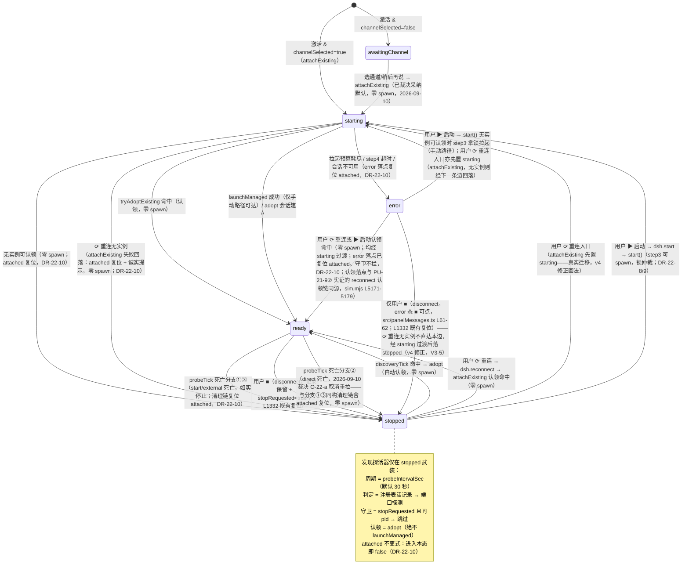

# 0.1.22 设计方案 — 禁用自动启动与定期自动重连

> 版本 4 | 日期 2026-09-10 | 状态：v4 定稿（QA 复审待跑）
>
> **修订记录**
>
> | 版本 | 日期 | 变更 |
> |---|---|---|
> | 1 | 2026-09-10 | 初版（本链架构师产出）：用户新策略落档 + 全部关键代码锚点实读核实 + 行为矩阵 + 六项改动点设计 + 四项开放项（a-d，各附默认建议与备选）+ PU-22-* sim 用例设计 + GUI 人工验证步骤 + 红线核对 + 风险登记表 + 实施清单。设计阶段零代码改动（src/、scripts/、package.json 未触碰）。v1 原稿归档于 `docs/archive/`。 |
> | 2 | 2026-09-10 | v2 返工（本链架构师）：QA 设计检查 r1 遗留 findings（`.dsh/tmp/audits/qa_design_0122_r1.md`）逐条处置 + 开放项 O-22-a 用户终审落档。逐条处置对照：**J-1**（MINOR）——`onChooseChannel` 的 `start()` 出口由两处扩为三处（`src/webview.ts` L218-221 稍后再说 / L231-234 写设置失败 / L236-238 成功写设置，三处全部改 `attachExisting()`），§4.4 默认建议、开放项 b 默认建议、实施清单第 6 项同步扩三出口，消除与 PU-22-9 静态断言（onChooseChannel 体内不含裸 `this.runtime.start()`）的矛盾。**J-2**（MINOR）——废弃编号 PU-9-2（当前 `scripts/sim.mjs` 中不存在，0.1.14 时代编号）改引 PP-10-4①④⑤（sim.mjs L4061/L4074/L4083，实际钉住三个 start 出口的断言面）；§七回归核对清单把 PP-10-4①④⑤ 从「保持绿」移入「行为变更改写（sanctioned）」，PP-10-5（详情卡切换器，start/reconnect 零调用断言，sim L4100-4103）保持绿不动。**J-3**（MINOR）——PU-22-1 扩为双分支断言：分支 A 保留失败分支；分支 B 新增 attachExisting 成功认领断言面（注入活记录/端口命中 → 返回 true + state='ready' + spawn 计数 = 0 + 存活探活器武装 + 发现探活器未武装），补齐行为矩阵 M-1 的用例覆盖。**J-4**（SUGGESTION）——§1.2 表 #2 行号引用修正：startProbe 的 ready 态武装判定由「L158」（注释区）修正为 `src/runtime.ts` L1158。**J-5**（SUGGESTION）——§4.2 新增第 8 条披露：discoveryTick 认领在途与用户手动 ⟳ 的同窗口并发形态（reconnect 重置 attached=false 后 start() 入口守卫不拦 starting 态，两链对同一实例重复 adopt；后果上限为幂等收敛，兜底 = step1 重查 + 启动锁互斥；按 0.1.21 H-1 披露纪律如实披露、不新增专门防护）。**J-6**（SUGGESTION）——§4.7 状态机补 error → ready / error → starting 出边（用户 ⟳ → reconnect → start() 既有迁移，PU-21-9② 实证 sim.mjs L5171-5179），error → stopped 注释改准确（用户 ■ disconnect，error 态 ■ 可点，`src/panelMessages.ts` L61-62）。**O-22-a**（用户终审 2026-09-10，原话：「受管直启实例崩溃后自动重拉不再生效，崩溃不自动拉起，改为手动拉起；自动的只有重连」）——采纳默认建议，取消 direct bounded relaunch；8 处联动定稿：① §六开放项 a 行标注已裁决（保留作历史记录）；② §三 M-5 去 ▲ 改定稿表述；③ §4.3 改定稿（备选标注不采纳）；④ §七 PU-22-6 按取消分支定稿；⑤ §七回归核对清单 PP-2-6 行定稿；⑥ §八 GUI 场景 E 定稿执行；⑦ §十 R-1 更新为已裁决后果；⑧ §十二实施清单第 5 项去条件表述。O-22-b/c/d/e 仍待用户裁决（默认建议与备选不变）；0.1.21 已裁决行为零回退；设计阶段零代码改动（src/、scripts/、package.json 未触碰）。 |
> | 3 | 2026-09-10 | v3 修订（本链架构师）：用户评审四项裁决（2026-09-10，全部终审）落稿 + O-22-e 拆分设计（QA v2 复审 PASS 后用户评审产出，见前置参考表）。逐项处置对照：**A（O-22-b 落稿，采纳默认）**——§六 b 行标已裁决；行为矩阵 M-3/M-10/M-11 定稿去 ▲（表头注同步改写）；§4.4 改「已裁决」定稿；PU-22-9 去条件；§七 PP-10-4①④⑤ 行、实施清单第 6/9/10 项、§八场景 F 与回填表判据、R-4 同步去条件式。附带手动启动语义确认（用户原话见前置参考表）落档为 **DR-22-8**：手动启动 = `start()` 四步仲裁既有语义（step1 注册表认领 → step2 配置端口认领（含外部实例）→ 无实例才 step3 拿锁 spawn），不新写绕过认领的强制造 spawn 路径。**B（O-22-e 拆分设计，本 v3 核心新增）**——推翻 v2 默认建议，改为拆分（用户原话见前置参考表）：新增 §4.5b 完整设计——「重连」命令 `dsh.reconnect`（runtime 落点 `attachExisting()` 只认领不拉起，无实例诚实提示进停止态）与「启动」命令 `dsh.start`（runtime 落点 `start()` 四步仲裁，有实例先认领含外部、无实例拿锁拉起）；⟳ 旧组合语义去留落档 **DR-22-9**（⟳ UI 语义收敛为重连、`dsh.restart` 保留为命令面板兼容入口、ready 相位详情卡「重启 dsh」沿用、ready 态 ⟳ 禁用）；按钮矩阵扩 5 键（`restart`→`reconnect` 改名 + `start` 新增，stopped 态 ⟳+▶ 并存）；消息白名单 7→8（restart→reconnect + start）；`dsh.reconnect` 无实例诚实提示（showInformationMessage）；状态机 stopped/error 出边按双入口更新；**PU-22-11**（重连命令零 spawn）与 **PU-22-12**（启动命令 adopt-or-spawn）新增用例 + PU-22-10 扩拆分接线静态断言；PP-11-2①②/PP-11-4②③/PP-11-1① 列入 sanctioned 改写（§4.5b 第 7 条）；§八场景 A-4/C-4/C-5/F-2/F-3 双按钮验证步骤；§十二实施清单第 13 项新增（拆分实施）+ 第 7/8/9/10/11 项扩写；§十 R-8 新增（⟳ 习惯用户入口变化）。**C（O-22-c/d 落稿）**——§六两行标「默认采纳（2026-09-10 用户评审未表异议）」；§4.2 第 2 条 30 秒表述、§4.6 停止态文案去开放项条件定稿；DR-22-5 理由列同步。**D（N-1 清理，QA v2 复审 SUGGESTION）**——M-2 行 ▲ 残留去除，表头注 ▲ 说明整体移除（四行全部落稿后无待裁决行）。**E（全文一致性）**——所有「开放项 ▲/按裁决/默认建议」条件式表述随四项裁决清理（§六四行全落稿后开放项表全部已决）；⟳ 恢复表述随拆分联动改写（M-5、§4.3 行为影响声明、R-1：手动恢复入口由 ⟳ 改 ▶ 启动）；DR-22-4 标注被终审推翻。**F**——0.1.21 已落档行为零回退（reconnect() 方法本体、dsh.restart 命令、applyChannel 三分流、死亡分支①③ 逐字不动）；设计阶段零代码改动（src/、scripts/、package.json 未触碰）。 |
> | 4 | 2026-09-10 | v4 返工（本链架构师）：QA 设计检查 v3-r1 裁决 FAIL（1 MAJOR + 2 MINOR + 2 SUGGESTION，V3-1～V3-5，`.dsh/tmp/audits/qa_design_0122_v3_r1.md`）逐条修复。逐条处置对照：**V3-1（MAJOR，attached 守卫残留三类失效场景）**——落档 **DR-22-10**（附着状态生命周期收敛不变式）：`attached === true` 仅在「附着在途（starting：认领/拉起进行中）或已附着（ready）」时成立，任何进入 stopped/error 的清理/失败路径补一行 `this.attached = false`（与既有先例 disconnect L1332、step4 失败 L554、reconnect L1359、forceRelaunchManaged L1387 同型）——补复位共七处：attachExisting() 失败路径（§4.1 草案修订）、死亡分支①③清理链（L1272/L1317 前）、§4.3 改写后分支②清理链（同构含此行）、launchManaged 预算耗尽落点（L665）、enterSessionUnavailable（L965）、probeTick 401 判死落点（L1221）；`start()` 四步仲裁本体（L416 守卫、step1-4）零改动，§二不做 1 保持，DR-22-8「start() 原样调用」保持（修复全部落在「进入 stopped/error 的路径」上，start() 本体不动）；死亡分支①「逐字保留」表述修订为「判定与行为逐字保留、清理链补一行复位（V3-1 联动）」；§4.5b 第 1 条落点说明守卫语义改准确（拦 attached=true 的任何态 + ready 态，非仅 ready 态）；三类失效场景修复后 ▶/⟳ 行为推演表落档（DR-22-10 内，与矩阵 M-2/M-4/M-5/M-9、DR-22-9「点击效果」、诚实提示全部自洽）；§4.2 第 8 条并发披露按新守卫语义重写（同窗口自动认领与手动链由 attached 单标志互斥、并发不会发生；残余窗口如实披露、不虚构防护）；M-5/M-9 行、状态机 §4.7、PU-22-1/5/6/7/11/12 断言、场景 A-3/C-5/E-2 联动复查标注（V3-1 联动）。**V3-2（MINOR，sanctioned 清单遗漏两断言）**——§4.5b 第 7 条清单补 PP-11-1②（sim.mjs L4151-4163，restart 消息移除白名单后必然 FAIL，改写定稿：ready 态段 3 消息 + stopped 态段 reconnect/start 双命令映射动态断言，sinks 全链覆盖恢复）与 PU-11-1①（sim.mjs L4293-4294，按钮 id 列表 4→5 键）；§七回归核对清单与实施清单第 9 项同步。**V3-3（MINOR，error 相位断言缺口）**——PU-22-10 扩 buildDetailsHtml error 相位断言（data-action="start"「启动 dsh（重试）」+ "reconnect"「重连」双按钮、不含 "restart"）；§八场景 A 补可选步骤 A-5（error 相位双按钮目视验证，标注制造方式与耗时）。**V3-4（SUGGESTION）**——PU-22-10 的 dsh.autoStart 描述断言去「（若实施描述更新）」条件括注，改无条件断言（与实施清单第 4 项定稿一致）。**V3-5（SUGGESTION）**——§4.7 状态机 error → stopped 直达边触发收窄为「仅 ■ disconnect」（⟳ 重连无实例的真实路径是 error → starting（attachExisting 入口先置 starting）→ stopped（失败回落））；stopped → stopped 自环同步修正（v3 自环画法失实——attachExisting 失败路径中 setState('stopped') 前已真实经历 starting 迁移，非幂等 no-op；改画 stopped → starting → stopped 往返两条既有边 + 边注）；J-6 处置说明与 v3 拆分联动说明口径统一为「经 starting 过渡」。**配套**——PP-8-3⑩ sanctioned 扩写（补 `r2.attached === false` 断言，401 判死 error 落点复位回归钉）；PU-22-1 分支 A / PU-22-6 / PU-22-7 / PU-22-11 断言补 attached=false 复位断言；PU-22-5/12 前置注明衔接 DR-22-10 复位语义；§十 R-9 新增（复位落点漏挂风险）；§十一 DR-22-10 新增；§十二实施清单第 14 项新增（DR-22-10 实施）+ 第 2/5/9/11 项扩写。0.1.21 已落档行为零回退（reconnect() 方法本体、dsh.restart 命令、applyChannel 三分流不动；死亡分支①判定与行为零变化，仅清理链补一行复位）；设计阶段零代码改动（src/、scripts/、package.json 未触碰）。 |

## 零、前置参考

| 文档/代码 | 用途 |
|---|---|
| 用户策略原话（2026-09-10，编排者转述） | 「不用自动拉，可以自动定期尝试重连，也支持手动重连、启动、重启，不用自动启动dsh」 |
| 用户 O-22-a 终审原话（2026-09-10） | 「受管直启实例崩溃后自动重拉不再生效，崩溃不自动拉起，改为手动拉起；自动的只有重连」——开放项 a 已裁决：取消 direct bounded relaunch |
| 用户评审终审（2026-09-10，O-22-b/c/d/e 四项全部终审） | ① O-22-b **采纳默认建议**，附带手动启动语义确认（原话：「要支持手动点击按钮启动，启动时有外部dsh实例就用外部实例，没有再启动新dsh实例」——落档 DR-22-8：手动启动 = start() 四步仲裁既有语义）；② O-22-e **推翻默认建议、改为拆分**（原话：「O-22-e重连和启动是两个独立命令，易于理解，易用性更强」——落档 DR-22-9 与 §4.5b）；③ O-22-c/d 未单独表态，按默认建议落稿（标注「默认采纳，2026-09-10 用户评审未表异议」） |
| `.dsh/tmp/audits/qa_design_0122_r1.md` | QA 设计检查 r1 报告（裁决 PASS，遗留 3 MINOR + 3 SUGGESTION，J-1～J-6）——v2 修订的逐条处置依据（见修订记录） |
| `.dsh/tmp/audits/qa_design_0122_v2_r1.md` | QA 设计复审 r1 报告（裁决 PASS；新登记 1 条 SUGGESTION N-1：M-2 行 ▲ 残留，随本 v3 顺带清理）——v2 基线与 N-1 处置依据 |
| `.dsh/tmp/audits/qa_design_0122_v3_r1.md` | QA 设计检查 r1 报告（裁决 FAIL：1 MAJOR + 2 MINOR + 2 SUGGESTION，V3-1～V3-5）——v4 返工的逐条处置依据（见修订记录）；其源码取证（runtime.ts attached 全部赋值点、sim.mjs 断言行号）已由本链架构师逐点实读复核属实 |
| `docs/0.1.21问题分析-多窗口重复拉起dsh与通道切换按钮失效根因与修复方案.md`（v6，已实施入库 commit 6b8f61d/5d23afc） | 本次变更叠加其上；其已落档行为（external 死亡不自动拉起、等锁 60 秒、applyChannel 三分流、快照通道真值、设置面接线）不得回退 |
| `src/extension.ts` | 激活链（L107-390）与 onDidChangeConfiguration（L348-361）实读 |
| `src/runtime.ts` | start() 四步仲裁（L415-558）、三分流死亡分支（L1254-1318）、探活器（L1156-1169）、adopt（L891-955）、disconnect（L1329-1346）、reconnect（L1357-1363）实读 |
| `src/webview.ts` / `src/webviewDetails.ts` / `src/webviewHtml.ts` / `src/panelMessages.ts` | 面板选通道流程（L217-239）、按钮禁用矩阵、停止态文案实读 |
| `src/instance.ts` / `package.json` | 注册表结构（DshRecord）、启动锁、`dsh.autoStart` 配置声明实读 |
| `scripts/sim.mjs` | PU-21 族用例结构（L4807-5300）与既有断言面盘点 |
| `docs/联调测试剧本.md`（v1.9 §0.13） | GUI 剧本收录格式参照 |

## 一、目标/背景分析

### 1.1 用户策略与编排者理解

用户策略（2026-09-10 原话）：**「不用自动拉，可以自动定期尝试重连，也支持手动重连、启动、重启，不用自动启动dsh」**。分解为三条行为规则：

1. **禁止（自动 spawn）**：插件任何代码路径都不得在用户未显式操作时自动产生 dsh 进程。
2. **允许（自动、不 spawn）**：停止态下继续定期探活，发现运行中的 dsh（外部拉起的、或别的窗口手动启动的——经注册表/端口探测）就自动重连认领，不产生新进程。
3. **支持（显式用户操作）**：手动重连（认领运行实例）、手动启动（spawn，多窗口并发时走 `start()` 既有锁仲裁）、手动重启（既有 ⟳ 重连与 `dsh.applyChannel` 通道应用重启，语义不变）。

### 1.2 编排者理解核实结果（与代码对照）

编排者提供的理解已逐条对照本轮实读源码核实，结论如下：

| # | 编排者理解 | 核实结果 |
|---|---|---|
| 1a | 窗口冷启动激活时 `start()` 找不到运行实例会直接拉起 | **成立**。`src/extension.ts` L380-389：`dsh.autoStart`（默认 true）且 `dsh.channelSelected=true` 时激活链调 `void runtime.start()`；`start()` 的 step1（注册表复用，`src/runtime.ts` L453-476）与 step2（配置端口探测，L478-539）都落空时，step3 拿锁即 `launchManaged()` spawn 新实例（L541-548）。有运行实例时现状本就走 adopt 零 spawn——被禁的是「找不到实例才 spawn」的那半段 |
| 1b | 受管直启形态（`launchMode='direct'`）实例死亡后的 bounded relaunch（0.1.21 保留） | **成立**。`src/runtime.ts` L1275-1295 死亡分支②：`recLaunchMode === 'direct' || (rec === null && this.attachedLaunchMode === 'direct')` → 清记录 + `setState('starting')` + `void this.launchManaged()`（无锁自动重拉，0.1.21 用户裁决 O-21-1 的范围边界外、现状保留）。0.1.22 已裁决取消（2026-09-10 用户终审 O-22-a，§4.3 定稿） |
| 2 | 停止态下继续定期探活（周期沿用既有 30 秒节奏）、发现运行实例自动认领不 spawn | **需新增机制**。现状探活器 `startProbe()`（`src/runtime.ts` L1156-1162）仅在 `state === 'ready'` 时武装（`src/runtime.ts` L1158 判定：`if (this.probeIntervalMs() <= 0 || this.state !== 'ready') return`），停止态探针已拆除（`stopProbe()`）——停止态下插件对「外部 dsh 后来出现」「其他窗口手动启动完成」完全无感知，只能等用户手动 ⟳。本设计新增停止态发现探活器（§4.2） |
| 3 | 手动重连/启动/重启既有语义不变 | **成立**。⟳（`dsh.restart` → `reconnect()`，`src/runtime.ts` L1357-1363）= 重连优先、无实例才经 `start()` 四步仲裁 spawn（多窗口并发由 step3 启动锁互斥 + step4 等待收敛，PU-21-1 已钉住）；通道应用重启（`dsh.applyChannel` → `applyChannelRestart()`，`src/runtime.ts` L1439-1470）0.1.21 已实施。停止态的可点入口现状已在（⟳ 在 stopped 态不禁用，`src/panelMessages.ts` L63-64；详情卡「重连」按钮，`src/webviewHtml.ts` L321）。0.1.22 v3：⟳/重连入口语义随 O-22-e 拆分收敛（§4.5b），`reconnect()` 方法本体与 `dsh.restart` 命令保留不动 |

### 1.3 编排者理解未覆盖、设计必须补充的代码事实

| # | 事实 | 出处 | 设计影响 |
|---|---|---|---|
| F-1 | 用户点面板 ■（`dsh.stop` → `disconnect()`）后：注册表 dsh 记录**保留**、dsh 进程**不被杀**、`stopRequested = true`、`this.dshPid` 保留（仅附着记忆 `attachedLaunchMode`/`attachedChannel` 置 null） | `src/runtime.ts` L1329-1346 | 停止态发现探活器**必须带守卫**：否则用户手动停止后，下一个探活周期就会把刚断开的实例自动认领回来，用户停止意图失效（§4.2 守卫设计） |
| F-2 | 状态栏在 stopped 态隐藏（`extension.ts` L191-193 default 分支）；面板 overlay 在 stopped 态只显示英文状态字面量 `stopped`（`src/webviewHtml.ts` L186-189：`st === 'starting' ? '正在启动 dsh…' : st`）；详情卡 stopped 相位按快照 `launchMode` 二分文案（L312-321） | 三处渲染面实读 | 「不自动启动」后 stopped 态成为用户常态画面，状态文案需要重新设计（§4.6）；状态栏保持隐藏不扩大改动面 |
| F-3 | 面板首启选通道（`onChooseChannel`）写设置后立即 `void this.runtime.start()`——「稍后再说」出口与「写设置失败」出口同样直接 `start()`（三个 `start()` 出口：L218-221 / L231-234 / L236-238） | `src/webview.ts` L217-239 | `awaitingChannel` 态的选完即启动是自动 spawn 的一处隐蔽路径（已裁决处置：采纳默认建议，§4.4 三出口） |
| F-4 | `dsh.chooseChannel` 命令（QuickPick 辅助入口）现状只写设置不启动 | `src/extension.ts` L276-292 | 不受本次变更影响 |
| F-5 | `dsh.autoStart` 配置项现状描述为「VSCode 启动时自动启动（第一窗口）或复用（后续窗口）dsh」，默认 true | `package.json` L130-134 | 配置项保留，语义收敛为「启动时自动重连运行中的 dsh（不产生新进程）」，描述随行为更新（§4.1 改动点 1） |
| F-6 | 最后窗口退出时 external 记录「pid 存活则保留 known-external 记录供 re-adopt（F2）」 | `src/runtime.ts` L1532-1543 | 激活链 attachExisting 的 step1 依赖该记录做 re-adopt，链路自洽，无改动 |

## 二、范围分析（做什么、不做什么）

**做**：

1. 激活链去自动拉起：找不到运行实例时进入停止态并武装停止态发现探活，不 spawn（§4.1）。
2. 停止态发现探活机制：低频探测注册表与配置端口，发现运行实例自动认领（复用 adopt，零 spawn），带用户停止守卫（§4.2）。
3. direct 形态死亡自动重拉的取消（已裁决：取消，2026-09-10 用户终审 O-22-a，§4.3）。
4. 面板首启选通道流程的「不自动拉起」形态（已裁决：采纳默认建议——选完只落设置并立即尝试认领活实例、不 spawn；2026-09-10 用户评审，§4.4）。
5. 手动入口盘点与重连/启动两命令拆分（已裁决：拆分，2026-09-10 用户终审 O-22-e；§4.5、§4.5b）与停止态状态文案（§4.6）。
6. PU-22-* sim 无头用例设计 + GUI 人工验证步骤（§七、§八）。

**不做**：

1. 不改 `start()` 的四步仲裁结构（step3 启动锁、step4 等待收敛 60 秒预算、入口守卫 `src/runtime.ts` L416）——手动启动/重连路径全部复用既有仲裁。
2. 不改 `reconnect()` 方法本体与 `dsh.restart` 命令（组合语义 = 重连优先、无实例经锁仲裁启动，逐字不动；P0-D/ADR-2 永不杀 dsh 零变化）。UI 入口拆分（⟳ 改挂重连命令）随 O-22-e 裁决执行（§4.5b），是本轮唯一获准的入口层行为变化。
3. 不改 `dsh.applyChannel` 通道应用重启（0.1.21 已落档，语义分离边界不动）。
4. 不改外部 dsh「永不代杀」红线（P0-D/ADR-2）：停止态发现探活只认领、不杀；direct 死亡分支改动不触碰任何杀路径（实例已死，只清记录）。
5. 不改 ADR-21 用户停止判定（start 形态死亡 = 用户停止、不自动拉起、跨窗口防复活）——0.1.21 分支①的判定与行为逐字保留；唯一例外是清理链补一行 `this.attached = false` 复位（DR-22-10，V3-1 联动：死亡判定、清记录 pid 守卫、不自动拉起、跨窗口防复活全部零变化，复位属附着状态清理完整性修复，与 step4 失败 L554 先例同型，不属判定行为改动）。
6. 不改 0.1.21 已落档行为：external 死亡不自动拉起（分支③）、等锁 60 秒、applyChannel 三分流、快照通道真值、设置面接线。
7. 不回退 `dsh.restart` 兼容入口：拆分（O-22-e 已裁决）后 `dsh.restart` 命令（DSH: Restart Runtime）保留——title 不改、命令面板可达、组合语义 = `reconnect()` 逐字不变；ready 相位详情卡「重启 dsh」按钮沿用。已裁决的拆分只改变 stopped/error 态的 UI 按钮落点（§4.5b、DR-22-9）。
8. awaitingChannel 态不武装发现探活（面板选择卡是该态的主交互面；选完通道的认领走 attachExisting 即时路径，见 §4.4）。
9. 本轮只做分析与设计，不改生产代码（实施随开发阶段执行，见 §十二实施清单）。

## 三、行为矩阵（触发场景 × 现状行为 × 0.1.22 目标行为）

> 「自动认领」指停止态发现探活器发现运行实例后经 adopt 转入 ready，全程不调用 `launchManaged()`（spawn 次数为 0）。全部 13 行已随 2026-09-10 用户终审定稿（O-22-a 取消自动重拉、O-22-b 采纳默认、O-22-c/d 默认采纳、O-22-e 拆分），无待裁决行、无 ▲ 标注（M-2 的 ▲ 残留已随 QA v2 复审 N-1 清理）；各行的裁决出处见行内标注。

| # | 触发场景 | 现状行为（0.1.21） | 0.1.22 目标行为 |
|---|---|---|---|
| M-1 | 冷启动激活，已有运行实例（注册表活记录或配置端口活探测） | `start()` step1/step2 认领（adopt，零 spawn） | **不变**。激活链改调 `attachExisting()`，认领路径与现状同源（§4.1）；成功后按 `dsh.autoOpenPanel` 展开面板（与现状一致）。PU-22-1 分支 B 断言钉住 |
| M-2 | 冷启动激活，无任何运行实例 | `start()` step3 拿锁后 `launchManaged()` **自动拉起**新实例 | **停止拉起**：`attachExisting()` 返回失败 → 进入 stopped 态、武装发现探活器；**spawn 次数为 0**；失败路径 attached 复位（DR-22-10，V3-1 联动——后续 ▶/⟳ 恢复入口可达的前提）。面板/详情卡呈停止态文案「可手动启动/等待外部 dsh」（§4.6）。发现探活器后续发现外部实例时自动认领（M-6） |
| M-3 | 冷启动激活，`dsh.channelSelected=false`（首启未选通道） | `enterAwaitingChannel()`：面板选择卡等待，不启动 | **不变**。选择卡出口行为见 M-10/M-11（已裁决采纳默认，§4.4） |
| M-4 | 外部形态（external 记录）实例死亡 | 死亡分支③：清记录（pid 守卫）+ stopped + 不自动拉起（0.1.21 裁决 O-21-1） | **不变**（判定与行为零变化；死亡分支③清理链补 attached 复位，DR-22-10/V3-1 联动）；新增：进入 stopped 后武装发现探活器——外部 dsh 重新出现（用户在终端重新手跑）→ 自动认领，spawn 次数为 0（M-6） |
| M-5 | 受管直启形态（direct）实例死亡 | 死亡分支②：清记录 + starting + bounded relaunch（无锁自动重拉） | **取消自动重拉**（2026-09-10 用户终审裁决，O-22-a 已决）：清记录（pid 守卫）+ stopped + 不拉起（与分支③同构清理链，含 `stopProbe()` 与 attached 复位——DR-22-10，V3-1 联动），spawn 次数为 0；进入停止态后由发现探活接力（自动认领新实例）或手动 ▶ 启动恢复（⟳ 重连只认领，实例已死时无可认领对象；O-22-e 拆分联动，§4.5b；▶ 启动在死亡后 stopped 态真实可达的前提 = 清理链 attached 复位，DR-22-10） |
| M-5b | start 形态（常驻控制台）实例死亡 | 死亡分支①：ADR-21 用户停止（清记录 + stopped，不自动拉起） | **不变**（ADR-21 判定与行为零变化；死亡分支①清理链补 attached 复位，DR-22-10/V3-1 联动——§二不做 5）；同样进入停止态并武装发现探活器（发现的只能是新实例，无复活问题） |
| M-6 | 停止态下，外部 dsh 后来出现（用户终端手跑） | **无感知**：探针已拆除，用户手动 ⟳ 后才恢复 | **新增自动认领**：发现探活器经配置端口探测命中（probeState ≠ down + dsh 身份判定）→ adopt external → ready；全程 `launchManaged()` 调用次数为 0 |
| M-7 | 停止态下，其他窗口手动启动成功 | **无感知**（跨进程无推送通道），用户须在本窗口手动 ⟳ | **新增自动认领**：发现探活器读到注册表新记录（pid 存活）→ adopt（managed-own/extension 记录同样认领）→ ready；spawn 次数为 0 |
| M-8 | 停止态 = 用户手动 ■ 断开（stopRequested=true，注册表记录与进程都还在） | 断开即停，无后续动作 | **新增守卫**：发现探活器读到「同一条记录（pid === this.dshPid）」时跳过认领（不自动连回刚断开的实例，rlog 留痕）；记录换成其他 pid（实例换了）或端口上出现新实例时正常认领。用户手动 ⟳（重连，`dsh.reconnect` → `attachExisting()`，beginAttachment 重置 stopRequested）或 ▶（启动，`start()` 入口重置 stopRequested）随时恢复 |
| M-9 | 手动重连 / 手动启动（stopped/error 态） | ⟳ `dsh.restart` → `reconnect()` → `start()` 四步仲裁：有实例认领、无实例拿锁拉起 | **拆分（O-22-e 已裁决，2026-09-10）**：⟳/详情卡「重连」→ `dsh.reconnect` → `attachExisting()` **只认领不拉起**（无实例 → 停止态 + 「无运行实例」诚实提示，spawn = 0）；▶/详情卡「启动」→ `dsh.start` → `start()` 四步仲裁（有实例先认领含外部，无实例 step3 拿锁拉起；多窗口并发由锁仲裁收敛单实例，PU-21-1 已钉；DR-22-8）。`dsh.restart` 命令面板兼容入口保留（`reconnect()` 逐字不动，DR-22-9）。双入口在 stopped/error 态可点且真实有效的前提 = 该两态 attached 已复位、守卫不拦（DR-22-10，V3-1 联动：复位前 attached=true 残留使 ▶ 被静默拦截、⟳ 谎报成功且诚实提示永不触发） |
| M-10 | 面板首启选通道：选了通道 X | 写设置（channel + channelSelected）→ `setChannel` → **自动 `start()`**（无实例时 spawn） | 改为：写设置 → `setChannel` → `attachExisting()`（**只认领不拉起**）；认领失败 → 进入停止态（发现探活器武装）+ 停止态文案给启动指引（点 ▶ 启动，§4.6；已裁决采纳默认，2026-09-10）。写设置失败的诚实降级出口（沿用当前通道、不置 channelSelected）同改 `attachExisting()`（§4.4 三出口） |
| M-11 | 面板首启「稍后再说」（chooseChannel=null） | 沿用当前通道**自动 `start()`** | 改为：`attachExisting()`（只认领不拉起）；失败进停止态（已裁决采纳默认，2026-09-10；`channelSelected` 标志仍不写，下次激活仍会询问——既有语义保留） |
| M-12 | 手动重启（通道应用）：详情卡「立即重启以生效」 | `dsh.applyChannel` → 三分流（非 ready 转 reconnect / managed-own 受控杀重拉 / external 不代杀提示） | **不变**（0.1.21 落档语义） |
| M-13 | 停止态下用户修改通道后手动启动/重连 | reconnect → `start()` 以新配置拉起/认领（0.1.21 剧本场景⑤） | 拆分落点：▶ 启动 = `start()` 以新配置拉起/认领（锁仲裁不变）；⟳ 重连 = 只认领既有实例（快照通道按注册表真值，待生效判定照常工作），无实例时停止态 + 指引点 ▶（O-22-e 拆分联动，§4.5b） |

## 四、系统设计（改动点清单）

> 模块分层纪律不变：全部新增逻辑落在纯 Node 层（`src/runtime.ts`），vscode 耦合层（`src/extension.ts`、`src/webview.ts`）只做调用与文案；渲染模板改动落在纯模块（`src/webviewHtml.ts`）。

### 4.1 改动点 1：激活链去自动拉起（attachExisting）

**文件锚点**：`src/runtime.ts`（新增公共方法 + 抽取共享私有方法）、`src/extension.ts`（激活链 L377-389）、`package.json`（`dsh.autoStart` 描述）。

**机制设计**：

1. 把 `start()` 现状的 step1（注册表复用认领，L453-476）与 step2（配置端口探测认领，L478-539）原样抽为私有方法 `private async tryAdoptExisting(): Promise<boolean>`——逻辑逐字保留（含 401-aware 判活、residual migration、CIM 身份判定、rlog 行），返回是否完成认领。`start()` 改为调用它：返回 true 即 return（行为不变），返回 false 继续 step3/step4（现状不变）。**`start()` 的行为面逐字节不变**（纯结构抽取，四步仲裁与全部 rlog 锚保留）。
2. 把 `start()` 开头的 per-attach 重置段（L417-449：attached/stopRequested/shutdownDone/lastLaunchMode/attachedLaunchMode/attachedChannel/proxy 会话事实等）抽为 `private beginAttachment(): void`，`start()` 与新公共方法共用——附着记忆防泄漏纪律（0.1.21 改动点 3/5 的 per-attach 规则）对新路径同等生效。
3. 新增公共方法：

```ts
/** 0.1.22：只附着、不拉起（激活链与选通道流程用）。返回是否已处于附着/就绪。 */
async attachExisting(): Promise<boolean> {
  if (this.attached || this.state === 'ready') return true
  this.beginAttachment()
  this.setState('starting')
  rlog(`attachExisting: window ${this.options.windowPid} (port=${this.options.port} channel=${this.options.channel}) — attach-only, no launch`)
  const adopted = await this.tryAdoptExisting()
  if (adopted) return true
  // 无实例可认领：如实进入停止态（不 spawn），由停止态发现探活接力（§4.2）。
  // V3-1/DR-22-10：失败路径必须复位 attached（beginAttachment 已置 true）——
  // 与 start() step4 失败先例（L554 先复位后 setState('error')）同型；不复位
  // 则本方法残留 attached=true，▶ dsh.start 被 start() L416 守卫拦截、⟳ 重连
  // 被本方法守卫谎报成功，双向失效（QA v3-r1 V3-1）。
  this.stopProxy()
  this.attached = false
  this.setState('stopped')
  rlog('attachExisting: no running dsh found; entering stopped (no auto-launch per user policy 2026-09-10)')
  return false
}
```

> **V3-1 联动说明（attached 失败路径复位）**：v3 草案的失败路径（`tryAdoptExisting()` 失败 → `setState('stopped')` → return false）不复位 attached，与 `start()` step4 失败先例（L554 显式复位后才 `setState('error')`）不对称，构成 QA v3-r1 V3-1（MAJOR）的三类失效场景之一。v4 修订：`setState('stopped')` 前补 `this.attached = false`（上方草案已含）。幂等守卫（第 123 行 `if (this.attached || this.state === 'ready') return true`）在复位后语义变诚实：`attached === true` 只出现在附着在途（starting）或已附着（ready）两种情形，stopped/error 态恒为 false，守卫返回 true 不再可能谎报（DR-22-10 不变式，见 §十一）。

4. `src/extension.ts` 激活链（L380-389）改造：`channelSelected` 为 true 时 `void runtime.start()` 改为 `void runtime.attachExisting().then(...)`——then 回调既有判断（`cfg.autoOpenPanel && runtime?.state === 'ready'` 时 `openPanel()`）不变：激活时立即认领成功仍会自动展开面板（与现状一致）；认领失败（停止态）不展开面板，等待发现探活自动认领（此时**不**自动展开面板，状态栏与面板可见即用——自动认领到达 ready 的时刻在激活链之外，若随后自动弹面板反而打断用户，行为面保持最小）。
5. `dsh.autoStart` 配置项保留、默认值 true 不变、语义收敛：「VSCode 启动时自动重连（复用）运行中的 dsh，不自动启动新实例」。`autoStart=false` 语义不变（激活链完全不动作，连自动认领也不做）。
6. **发现探活器的武装点统一挂在 `setState('stopped')`**（§4.2 第 1 条），因此 M-2 的「激活链附着失败进停止态」无需在 extension 层额外接线。

### 4.2 改动点 2：停止态发现探活机制（自动重连，零 spawn）

**文件锚点**：`src/runtime.ts`（新定时器 + tick 方法 + setState 挂钩）。

**机制设计**：

1. **生命周期**：新增独立定时器字段 `discoveryTimer` 与防重入标志 `discoveryInFlight`。武装/拆除**统一挂在 `setState()` 内**（不逐落点手工调用，防遗漏）：

```ts
private setState(s: RuntimeState): void {
  if (this.state === s) return
  const prev = this.state
  this.state = s
  // 0.1.22：发现探活器生命周期严格绑定 stopped 态——进入即武装、离开即拆除。
  if (s === 'stopped') this.startDiscoveryProbe()
  else this.stopDiscoveryProbe()
  rlog(`state: ${prev} -> ${s}${this.errorMessage ? ` (error: ${this.errorMessage})` : ''}`)
  this.emit('state', s)
}
```

   `dispose()` 同步拆除（L1568-1572 补一行）。`startDiscoveryProbe()`/`stopDiscoveryProbe()` 形态与既有 `startProbe()`/`stopProbe()`（L1156-1169）同构。

2. **周期**：沿用 `this.options.probeIntervalSec`（默认 30 秒；已裁决沿用、不新增配置项——O-22-c 默认采纳，2026-09-10 用户评审未表异议）。`probeIntervalSec=0`（既有「关闭探活」语义）时发现探活一并关闭，配置语义保持单一。
3. **tick 判定与认领路径**（`private async discoveryTick(): Promise<void>`）：

```
discoveryTick():
  若 state !== 'stopped' 或 discoveryInFlight → return（防重入；adopt 是异步链，认领在途时不重复发起）
  discoveryInFlight = true
  try:
    候选发现（与 start() step1/step2 同源判定，顺序：注册表优先、端口探测兜底）：
      a) inst = readInstance()；dshAlive(inst) 为真 → 候选 = 注册表记录（port/pid/managedBy 取记录值）
      b) 否则配置端口 > 0 且 probeState(端口) ≠ 'down' → 复用 step2 的身份判定
         （resolvePortPid + processCommandLine + looksLikeDsh；CIM 不可用时按页签特征记录 holder pid，
         L522-528 既有兜底同型）→ 候选 = external 认领
      c) 都未命中 → return（保持停止态，等下一周期）
    用户停止守卫（F-1）：stopRequested === true 且候选 pid === this.dshPid
      → rlog('discovery: skip re-adopting the manually detached instance (same pid); reconnect manually')
      → return（不认领，等用户手动 ⟳ 或实例更换）
    认领：beginAttachment()（per-attach 重置）→ setState('starting')（可见过渡）
      → await this.adopt(候选 port, 候选 pid, 候选 managedBy, probeKind, 记录)
        —— adopt 落点内部完成会话建立（token/C 路径）、快照装配、setState('ready')，
           与 start() step1/step4 的认领完全同一条落点链（L891-955）
      → await this.writeRegistry() → this.startProbe()（存活探活武装；
        setState('ready') 已由挂钩自动拆除发现探活器）
      认领失败（会话不可用）→ enterSessionUnavailable() 落 error 态（error 落点
        attached 复位，DR-22-10 落点 #6；发现探活器已随离开 stopped 拆除、不再
        自动重试——恢复由用户手动 ▶/⟳ 接管，见 §4.3b 推演表第三行与 §4.7）
  finally:
    discoveryInFlight = false
```

4. **零 spawn 红线**：`discoveryTick` 的认领路径**只允许到达 `adopt()`**，结构性不触达 `launchManaged()`（认领失败不重试拉起，下一周期重新判定）。这是「自动、不 spawn」规则在代码结构上的落点，PU-22-4 用断言钉住。
5. **守卫语义澄清（M-8 场景）**：守卫条件是「本窗口主动断开（stopRequested=true）且候选就是刚断开的那个 pid」。窗口 A 手动停止后其他窗口用同一实例 → A 跳过（尊重本窗口的停止操作）；实例死亡后换了新实例（pid 不同）或外部重新手跑 → 正常认领。ADR-21 用户停止（M-5b）进入停止态时实例已死、注册表记录已清，探活器无可认领对象，不存在复活问题。
6. **与既有存活探活器的语义分离**：不改造 `probeTick()` 复用（否决方案）。理由：`probeTick` 的失败计数（`probeFailures`）、401 分流、判死阈值都是「存活探测」语义；发现探测是「发现即认领」语义，无失败累计、无阈值。两套语义混进一个 tick 会让计数器与状态守卫互相纠缠（语义分离纪律，工程基线第 3 条）。代价是新增一个定时器字段与一个 tick 方法（增量约 60 行），换来两条探测链各自独立可测。
7. **性能面**：每周期（默认 30 秒）至多一次注册表文件读 + 一次 TCP 探测（配置端口）+ 探测命中时一次 netstat 与一次 CIM 查询（15 秒上限，`processCommandLine` 既有预算）。常态（无实例）只有文件读 + 一次立即失败的本机 TCP connect，开销可忽略；「配置端口被非 dsh 程序长期占用」的环境下每周期一次 CIM 查询属可接受上限（该场景本身是 ADR-1 端口回落的既有边界，风险 R-2 登记）。认领成功后恢复 ready 态既有探活节奏，无新增常驻开销。
8. **认领在途与手动 ⟳/▶ 的同窗口互斥披露（QA J-5 登记；v4 按 DR-22-10 后守卫语义重写——V3-1 联动，v3 旧披露作废）**：`discoveryTick` 认领在途期间（`beginAttachment()` 置 `attached=true` → `setState('starting')` → `adopt()` 会话建立），用户手动 ⟳（`dsh.reconnect` → `attachExisting()`）被幂等守卫 `attached || ready` 拦住（`attached=true` → 返回 true，语义 =「已在附着流程中」，诚实）；手动 ▶（`dsh.start` → `start()`）被 L416 守卫 `attached || ready` 拦住（静默 return）。**两条手动链都不会并发进入，重复 adopt 不发生**。v2/v3 旧披露「守卫不拦 starting 态、第二条认领链并发进入、重复 adopt 幂等收敛」的成立前提是 ⟳ 走 `reconnect()`（L1359 显式复位 attached，使守卫在 starting 态放行）——拆分后 ⟳ 改挂 `attachExisting()`（无复位），该前提消失；v3 第 8 条照搬 v2 文字未按新落点重算，QA v3-r1 V3-1 判其失实，本条按修复后真实形态改写。反向同样互斥：手动链在途（`start()`/`attachExisting()` 已置 `attached=true`、state='starting'）时，`discoveryTick` 被 `state !== 'stopped'` 守卫拦住，不会发起重复认领。结论：同窗口内自动认领与手动链由 attached 单标志 + state 守卫共同保证互斥，无重复 adopt；跨窗口并发仍由 step3 启动锁仲裁收敛单实例（PU-21-1，不变）。**残余窗口如实披露（H-1 披露纪律）**：认领在途（秒级会话建立）期间，命令面板 ▶ 触发被静默拦截、⟳ 返回 true 无可见反馈——面板此时显示 starting 态（「正在启动 dsh…」，R-5 已登记该渲染形态），认领收敛（ready 或 error）后手动入口恢复可用；这是幂等守卫的既定行为，不是新防护缺口，按纪律如实披露、不新增专门防护。

### 4.3 改动点 3：direct 形态死亡取消自动重拉（已裁决：取消，2026-09-10）

**文件锚点**：`src/runtime.ts` 死亡分支②（L1275-1295）。

**已裁决（取消，2026-09-10 用户终审，原话见修订记录）**：分支②从「清记录 + starting + `void this.launchManaged()`」改为「清记录（pid 守卫共用）+ 清理链 + `setState('stopped')` + 不拉起」，清理链与分支③同构（`refreshLaunchInfo({kind:'disconnect'})`、`dshPid`/`port`/`url` 清空、`stopProxy()`、`stopProbe()`（补上，现状分支②无此行）、`attached = false` 复位（DR-22-10，V3-1 联动）、附着记忆置 null），rlog 独立注明（`probe: direct-mode dsh died; not auto-relaunching (user policy 2026-09-10); reconnect manually`）。进入 stopped 后发现探活器自动武装——其他窗口手动拉起的新实例会被本窗口自动认领；本窗口手动 ▶ 启动 / ⟳ 重连的恢复路径依赖清理链的 attached 复位（§4.3b）。**ADR-21 分支①（start 形态用户停止）判定与行为零变化，清理链同补一行 attached 复位（§二不做 5、§4.3b——V3-1 联动）**。

三分流结构变化：分支②与分支③在「不拉起」后行为同构（差异只剩 rlog 锚与快照降级档），实现上可合并为「非 start 形态一律如实停止」，但保留两条 rlog 以便日志判读 direct 与 external 的死亡来源——是否合并由开发专家按实现最简取舍，行为面以本节为准。

**备选（不采纳，2026-09-10 终审未采纳，留作历史记录）**：分支②现状保留（bounded relaunch）。该备选与用户策略「不用自动拉」直接冲突，终审已否决。

**行为影响如实声明**：取消后 dsh 进程崩溃不再自愈（0.1.6 时代以来的「崩溃自动恢复」体验回退为「如实停止 + 手动 ▶ 启动」——⟳ 重连仅认领活实例，实例已死时无可认领对象；O-22-e 拆分后语义，§4.5b），联调剧本场景 C（崩溃自动恢复）的预期需同步改写。这是 2026-09-10 用户裁决的既定后果（崩溃不自动拉起 = 既定行为，体验回退如实告知用户），不是缺陷。

### 4.3b 改动点 3b：附着状态生命周期收敛（DR-22-10，QA v3-r1 V3-1 修复）

**文件锚点**：`src/runtime.ts`（死亡分支①②③清理链、`launchManaged()` 预算耗尽落点、`enterSessionUnavailable()`、probeTick 401 判死落点）+ §4.1 的 `attachExisting()` 失败路径（草案已含）。

**问题机理（QA v3-r1 V3-1，本链架构师逐点实读复核属实）**：`attached` 的语义是「本窗口附着中」，但现状它只在部分路径上复位——`start()` 入口守卫（L416）为 `if (this.attached || this.state === 'ready') return`，拦的是「`attached === true` 的任何态 + ready 态」，不只是 ready 态。`attached` 的全部赋值点（实读）：L207 声明初始 false；L417 `start()` 置 true（`beginAttachment` 抽取段首行，`attachExisting()` 共用）；L554 step4 失败复位；L1332 `disconnect()` 复位；L1359 `reconnect()` 复位；L1387 `forceRelaunchManaged()` 复位。**死亡分支①③（L1254-1274/L1296-1318）与三处失败落点（launchManaged 预算耗尽 L665、adopt 会话失败 `enterSessionUnavailable` L965、probeTick 401 判死 L1221）都无 attached 复位**。0.1.21 现状自洽的原因：唯一手动入口 ⟳ 走 `reconnect()`（L1359 先复位再 start()），残留被兜住。0.1.22 拆分后 ⟳ 改挂 `attachExisting()`（守卫在 attached=true 时返回 true 谎报成功）、▶ 直接调 `start()`（被 L416 拦截静默无效）——残留从「被兜住的既有形态」变为「堵死两类手动恢复路径的缺陷」。

**不变式（DR-22-10）**：`attached === true` 仅在「附着在途（starting：认领/拉起进行中）或已附着（ready）」时成立；**任何进入 stopped/error 态的清理/失败路径必须把 `this.attached` 复位为 false**（一行 `this.attached = false`，插在各 `setState('stopped'/'error')` 之前，与 L554 先例同型）。

**补复位落点（七处）**：

| # | 落点 | 现状 | 修复 | 先例 |
|---|---|---|---|---|
| 1 | `attachExisting()` 失败路径（§4.1 草案 L131 前） | 置位不复位（草案缺陷） | `setState('stopped')` 前补 `this.attached = false` | L554 |
| 2 | 死亡分支①清理链（L1272 `setState('stopped')` 前） | 无复位，stopped 态 attached=true 残留 | 清理链补一行 | L1332 |
| 3 | 死亡分支②改写后清理链（§4.3） | 改写后进 stopped（同分支③） | 同构清理链含此行 | L554 |
| 4 | 死亡分支③清理链（L1317 `setState('stopped')` 前） | 同上残留 | 清理链补一行 | L554 |
| 5 | `launchManaged()` 预算耗尽（L665 `setState('error')` 前） | error 态 attached=true 残留 | 落点补一行 | L554 |
| 6 | `enterSessionUnavailable()`（L965，adopt 会话失败共用落点） | error 态残留 | 落点补一行 | L554 |
| 7 | probeTick 401 判死（L1221 `setState('error')` 前） | error 态残留——0.1.21 已验收「401 会话失效 → error 态面板 ⟳ 恢复」路径（sim.mjs L3621 文案断言在案）在拆分后被残留堵死，构成实际回退 | 落点补一行 | L554 |

**无需修复的落点（写明依据，QA 审计关注核对）**：`launchManaged()` 中用户断开落 stopped（L681）——前置 `stopRequested === true`，而 stopRequested=true 只可能经 `disconnect()`（L1332 已复位 attached）或 `forceRelaunchManaged()`（L1387 已复位）设置，attached 已为 false；step4 失败（L555）——L554 既有复位；`disconnect()`（L1345）——L1332 既有复位；`reconnect()`/`forceRelaunchManaged()` 既有复位行不动（§二不做 2：reconnect() 方法本体逐字不动）。

**修复后三类失效场景行为推演（与矩阵、DR-22-9、诚实提示自洽性证明）**：

| 场景 | attached（修复后） | ▶ `dsh.start`（落点 `start()` 原样） | ⟳ `dsh.reconnect`（落点 `attachExisting()`） |
|---|---|---|---|
| 死亡分支①②③处置后 stopped（M-4/M-5/M-5b） | false（清理链复位） | L416 不拦（attached=false 且 state≠ready）→ 四步仲裁正常：有实例认领、无实例 step3 拿锁 spawn——M-5「手动 ▶ 启动恢复」、场景 C-5/E-2 成立 | 守卫不拦 → `beginAttachment()`（重置 stopRequested）→ starting → `tryAdoptExisting()`：实例已死且无新实例 → 失败 → attached 复位 + stopped + 诚实提示（不再谎报）；其他窗口已拉起新实例 → 认领命中 → ready |
| `attachExisting()` 失败后 stopped（M-2/M-10/M-11） | false（失败路径复位） | 同上畅通——场景 A-3「经锁仲裁正常启动，面板回 ready」可达；PU-22-5 前置成立（两实例 stopped 态各自 `start()` 不再被拦，恰 1 次 spawn 收敛） | 无实例 → 返回 false → `if (!ok)` 触发诚实提示（不再谎报） |
| `launchManaged()`/adopt/401 失败后 error | false（error 落点复位） | L416 不拦 → 401 场景 step1 认领（401 = alive，记录可认领）→ adopt → C path → ready；其他 error 场景认领或 spawn | 401 场景：守卫不拦 → `tryAdoptExisting()` 命中（unauthorized ≠ down）→ 认领 → ready——0.1.21 已验收恢复路径恢复；无实例 → stopped + 诚实提示。与矩阵 error 态 ⟳/▶ 均可点（§4.5b 第 3 条）及 DR-22-9「stopped/error 态点击效果与原 ⟳ 一致」一致 |

**边界协调（与 §二不做清单、DR-22-8 的关系）**：
- **§二不做 1（不改 start() 四步仲裁结构）**：L416 守卫本体、step1-4、启动锁、step4 预算全部不动；本改动点全部落在「进入 stopped/error 的清理/失败路径」，与 L554 先例同型——失败路径复位 attached 不属仲裁结构改动。
- **DR-22-8 / §4.5b「`dsh.start` = `start()` 原样调用、零新启动逻辑」**：保持——不新增包装方法，不前置复位调用（那是 `reconnect()` 的形态，且会把复位逻辑放进命令层）；修复全部在落点清理链上，`start()` 本体零改动。
- **§二不做 2（reconnect() 本体与 dsh.restart 命令逐字不动）**：保持——`reconnect()` 的 L1359 既有复位本来就是本不变式的先例之一，无需改动。
- **§二不做 5（ADR-21 分支①判定保留）**：死亡分支①的判定与行为（用户停止判定、清记录 pid 守卫、不自动拉起、跨窗口防复活）零变化，清理链补一行复位属附着状态清理完整性修复（措辞已随 V3-1 修订）。

**验证钉**：PU-22-1 分支 A（attachExisting 失败 → attached===false）、PU-22-6（direct 死亡 → attached===false）、PU-22-7（start 死亡 → attached===false）、PP-8-3⑩ sanctioned 扩写（401 判死 error → `r2.attached === false`）；QA 代码审计关注七处落点完整性（实施清单第 11 项）。复位遗漏风险登记 R-9。


### 4.4 改动点 4：面板首启选通道不自动拉起（已裁决：采纳默认建议，2026-09-10）

**文件锚点**：`src/webview.ts` `onChooseChannel`（L217-239）。

**已裁决（采纳默认建议，2026-09-10 用户评审，终审原话见前置参考表；附带的手动启动语义确认落档 DR-22-8）**：`onChooseChannel` 体内的三个 `start()` 出口全部改为 `void this.runtime.attachExisting()`（QA J-1 扩三出口，与 PU-22-9 静态断言对齐）：

- 选了通道 X（L236-238 成功写设置 + setChannel 出口）：写设置顺序不变（`dsh.channel` → `dsh.channelSelected`，PP-10-4 顺序断言保留）→ `setChannel(X)` → `attachExisting()`——已有运行实例（外部手跑的、别的窗口启动的）就立即认领（零 spawn，用户不用等一个探活周期）；没有实例就进停止态，面板呈「已选择 X 通道」的停止态文案 + 启动指引（点 ▶ 启动，或 ⟳ 重连运行实例——指引文案随 O-22-e 拆分同步，§4.5b、§4.6）。
- 「稍后再说」（L218-221，chooseChannel=null）：同样 `attachExisting()`（认领活实例则 ready；否则停止态）；`channelSelected` 不置位的既有语义保留（下次激活仍会询问）。
- 写设置失败（L231-234，`config.update` 抛错的诚实降级出口）：诚实降级语义保留（沿用当前通道、不置 `channelSelected`、零 `setChannel`），出口同样改为 `attachExisting()`（只认领不拉起）——该出口若漏改，写失败路径仍会自动 spawn，与 PU-22-9 静态断言（onChooseChannel 体内不含裸 `this.runtime.start()`）冲突（QA J-1）。
- 语义澄清：「先选择通道、后启动dsh」（ADR-29-④）在「不自动启动」语义下重述为「**先选择通道、后连接**；启动一律显式」——选择结果的写入时序不变，被移除的只是「选择完成即产生新进程」这半段。

**备选（不采纳，2026-09-10 终审未采纳，留作历史记录）**：① 选完只落设置、完全不做认领（连活实例也不认领，等发现探活器一个周期后自动连）——更保守，但多一次 30 秒量级等待，不推荐；② 维持现状（选完自动 `start()` 可能 spawn）——与策略冲突。另：「稍后再说」与「写设置失败」若维持旧语义（直接 `start()`）会绕过「不自动启动」，必须随默认建议一并改，不接受单独保留（三出口一致，QA J-1）。

**受影响既有断言（QA J-2 引用修正）**：PP-10-4①④⑤（选择流程调用序与三个 start 出口断言，`scripts/sim.mjs` L4061 调用序含 start / L4074 稍后再说 start / L4083 写失败 start）需按新语义核对改写（`start()` → `attachExisting()` 后调用序断言同步），随 PU-22 用例批次由测试专家处置（§七）。PP-10-5（详情卡切换器，断言 start/reconnect 零调用，sim.mjs L4100-4103）与选择流程无关，保持绿不动。

### 4.5 改动点 5：手动入口盘点（现状基线）与拆分裁决落档

**现状入口盘点**（停止态可操作的全部「重连/启动」面）：

| 入口 | 位置 | 停止态可用性 | 语义 |
|---|---|---|---|
| 面板工具栏 ⟳ | `src/webviewHtml.ts` L101/L194；`src/panelMessages.ts` L63-64（stopped 态 `restart: false` = 可点） | **可点** | `dsh.restart` → `reconnect()` → `start()`：有实例认领、无实例经锁仲裁启动（多窗口并发收敛，PU-21-1） |
| 详情卡「重连」按钮 | `src/webviewHtml.ts` L321（stopped 相位） | 可点 | 同上 |
| 详情卡「重试（重启 dsh）」 | `src/webviewHtml.ts` L311（error 相位） | —（error 态） | 同上 |
| 命令面板 DSH: Restart Runtime | `package.json` L70-72 | 可用 | 同上 |
| 命令 DSH: 选择 dsh 通道 | `package.json` L86-88 | 可用 | 仅选通道，不启动（不变） |

**结论（v3 修订：已裁决拆分，2026-09-10 用户终审 O-22-e，原话见前置参考表）**：v2 的「不拆分」结论被终审推翻——用户要求重连与启动是两个独立命令（易于理解、易用性更强）。上表为现状入口盘点，保留作为拆分接线的事实基线；拆分后的两个独立命令（`dsh.reconnect` 重连 / `dsh.start` 启动）与 ⟳ 组合语义的去留决策见 §4.5b 与 DR-22-9。可发现性补强（文案指引）结论仍有效，文案随双按钮布局同步更新（§4.6）；命令面板 `dsh.restart` title 不改（兼容既有文档/剧本引用，DR-22-9）。

### 4.5b 改动点 5b：重连/启动两命令拆分设计（O-22-e 已裁决：拆分，2026-09-10）

**文件锚点（全部实读核实）**：`src/panelMessages.ts`（按钮禁用矩阵 L53-69、消息白名单 L21-39、路由 sinks L75-131）、`src/webviewHtml.ts`（面板工具栏 L99-102、按钮绑定 L192-195、overlay L186-189；详情卡 stopped 相位 L312-321、error 相位 L305-311、data-action 分派 L398-411）、`src/webview.ts`（sinks 接线 L88-155，restart 落点 L134-140）、`src/webviewDetails.ts`（DetailsMessage L32-39、onMessage L121-207）、`src/extension.ts`（命令注册 L231-335，`dsh.restart` 落点 L241-245 调 `reconnect()`）、`package.json`（commands L60-93、activationEvents L15-27）、`src/runtime.ts`（`start()` 四步仲裁 L415-558、`reconnect()` L1357-1363、`disconnect()` L1329-1346）。

**1. 两个独立命令的语义定义（用户终审，2026-09-10）**：

| 命令 | 命令 id | 命令面板 title | runtime 落点 | 语义 |
|---|---|---|---|---|
| 重连 | `dsh.reconnect` | `DSH: 重连 dsh（只认领运行实例）` | `attachExisting()`（§4.1 新增方法） | **只认领不拉起**：注册表/配置端口有运行实例就认领（零 spawn）；无实例 → 进入停止态 + 用户提示「无运行实例，可点 ▶ 启动，或等待自动发现（默认 30 秒周期）」（extension 层 `showInformationMessage`），spawn 次数恒为 0 |
| 启动 | `dsh.start` | `DSH: 启动 dsh` | `start()`（既有方法原样调用，零新启动逻辑） | **用户确认的 adopt-or-spawn 四步仲裁**（DR-22-8，用户终审原话「启动时有外部dsh实例就用外部实例，没有再启动新dsh实例」与 `start()` 既有语义逐字对应）：step1 注册表认领 → step2 配置端口认领（含外部实例）→ 无实例才 step3 拿锁 `launchManaged()` spawn（多窗口并发经 step3 启动锁互斥 + step4 等待收敛，PU-21-1 已钉） |

runtime 落点说明（v4 修订——V3-1 联动，守卫语义按源码 L416 实读表述完整）：`dsh.start` 直接调 `start()`——`start()` 入口守卫（L416）为 `if (this.attached || this.state === 'ready') return`，拦的是「`attached === true` 的任何态 + ready 态」，不只是 ready 态；DR-22-10（§4.3b）落实后 stopped/error 态 `attached` 恒为 false，守卫不拦 stopped/error 态的 ▶ 启动与认领，M-9 双命令点击效果成立。stopped/error 态下存活探活器本已拆除（武装点 = 认领成功落点，离开 ready 即被死亡分支/`disconnect()` 拆除），无需 `reconnect()` 式的前置 `stopProbe()`；如开发审计发现 error 态残留探活器形态，按 `reconnect()` 同构补 `stopProbe()`，行为面不变。

**2. ⟳ 旧组合语义的去留（DR-22-9）**：

- **决策**：⟳ 图标的 UI 语义在 stopped/error 态收敛为「重连（只认领，不拉起）」——面板工具栏 ⟳ 改发上行消息 `reconnect` → `dsh.reconnect`；详情卡 stopped 相位「重连」按钮同理。组合语义（重连优先 + 无实例经锁仲裁启动）由「启动」命令承接：`dsh.start` 在 stopped/error 态的点击效果与原 ⟳ 一致（先认领后 spawn），用户原 ⟳ 的「一步启动」诉求由 ▶ 承接，无能力损失。
- **`dsh.restart` 命令保留**（0.1.21 零回退）：`reconnect()` 方法本体与 `dsh.restart` 命令注册逐字不动（title「DSH: Restart Runtime」不改，兼容既有文档/剧本/用户习惯）；ready 相位详情卡「重启 dsh」按钮（`data-action="restart"`，`src/webviewHtml.ts` L475/L525）继续走 `dsh.restart`——ready 态的「重启 dsh」语义（断开重认领 = 会话刷新）零变化。
- **理由**：① 用户终审要求两命令独立、易于理解——⟳ 图标直觉（循环箭头 = 重新连接）与纯重连语义一致，组合语义让「点了 ⟳ 却拉起了新进程」难以预期；② 保留 `dsh.restart` 避免 0.1.21 已验收面（ready 相位按钮、命令面板、既有剧本引用）回退；③ ready 态 ⟳ 在新语义下是幂等 no-op（`attachExisting` 守卫 `attached || ready` 直接返回 true，§4.1），「可点但无效果」是说谎按钮，故 ready 态 ⟳ 置为禁用（矩阵定稿见第 3 条）——ready 态会话刷新需求由详情卡「重启 dsh」（`dsh.restart` 组合）覆盖。
- **与两命令的关系总结**：⟳（重连图标）= `dsh.reconnect` 的 UI 承载；▶（启动）= `dsh.start` 的 UI 承载；`dsh.restart` = 命令面板兼容入口（组合语义），UI 按钮不再挂载。

**3. 按钮矩阵与渲染面设计**：

`PanelButtonId` 扩展（`src/panelMessages.ts` L42）：`'details' | 'openBrowser' | 'reconnect' | 'start' | 'stop'`——原 `restart` 键改名 `reconnect`（⟳ 按钮位语义 = 重连），新增 `start`（▶ 按钮位）。`buttonDisableRules` 五态矩阵定稿（true = disabled）：

| 态 | ⓘ details | ↗ openBrowser | ⟳ reconnect | ▶ start | ■ stop | 依据 |
|---|---|---|---|---|---|---|
| awaitingChannel | 可点 | 禁用 | 禁用 | 禁用 | 禁用 | 选择卡是主交互面（既有，不变） |
| starting | 可点 | 禁用 | 禁用 | 禁用 | 可点 | ■ 可点 = 取消启动（既有）；启动/重连在途禁用防重入 |
| ready | 可点 | 可点 | **禁用（原可点）** | 禁用 | 可点 | ⟳ 禁用：`attachExisting` 幂等守卫下重连为 no-op（说谎按钮不如禁用，DR-22-9）；会话刷新由详情卡「重启 dsh」承接 |
| error | 可点 | 禁用 | 可点 | **可点（新增）** | 可点 | ⟳ 重连（可能有实例可认领）+ ▶ 启动（重试，step3 可 spawn）并存；可点且真实有效——error 落点复位 attached 后守卫不拦（DR-22-10，V3-1 联动：复位前 attached=true 残留会拦死两入口） |
| stopped | 可点 | 禁用 | **可点** | **可点（新增）** | 禁用 | 拆分核心场景：⟳ 重连 + ▶ 启动并存；可点且真实有效（死亡/附着失败清理链复位 attached 后守卫不拦，DR-22-10——V3-1 联动） |
| idle/未知 | 禁用 | 禁用 | 禁用 | 禁用 | 禁用 | 保守全禁（既有防御默认） |

面板工具栏渲染（`src/webviewHtml.ts` L99-102）：⟳ 按钮（`btn-restart` 改名 `btn-reconnect`，title 改「重连（只认领运行实例，不拉起）」）与 ■ 之间新增 `<button id="btn-start" title="启动 dsh（有实例先认领，无实例拉起）"${btnAttr(dis.start)}>▶</button>`；脚本侧 `applyDisabled` 加 `btnStart` 绑定（L162-169 同型），click 绑定 `post({ type: 'start' })`；⟳ 的 click 绑定由 `post({ type: 'restart' })` 改为 `post({ type: 'reconnect' })`（L194）。

详情卡渲染（`src/webviewHtml.ts`）：stopped 相位 actions 改为「重连」（`data-action="reconnect"`）+「启动」（`data-action="start"`）双按钮（L321）；error 相位「重试（重启 dsh）」（L311）改为「启动 dsh（重试）」（`data-action="start"`）+「重连」（`data-action="reconnect"`）双按钮；ready 相位「重启 dsh」按钮（L475/L525）不动。data-action 分派（L398-411）新增 `reconnect` → `post({ type: 'reconnect' })`、`start` → `post({ type: 'start' })` 两分支；ready 相位 `restart` 分支保留。

**4. 消息接线设计（panelMessages 协议扩展）**：

- `PanelMessageType`（`src/panelMessages.ts` L22-29）：移除 `'restart'`、新增 `'reconnect' | 'start'`——白名单不变式（PP-11-4：`PANEL_MESSAGE_TYPES` ≡ 面板页面脚本实际上行 type 集合）要求面板脚本不再发 `restart` 后白名单同步收敛；`PANEL_MESSAGE_TYPES` 数组同步（8 条）。详情卡消息集（`DetailsMessage`，`src/webviewDetails.ts` L32-39）独立演进：新增 `{ type: 'reconnect' }`、`{ type: 'start' }`，`'restart'` 保留（ready 相位「重启 dsh」沿用）——详情卡脚本 post 集合 ≡ onMessage case 集合（PP-11-4③）随实现同步。
- `PanelMessageSinks`（L75-91）：`restart?()` 改名 `reconnect?()`，新增 `start?(): void`。
- `routePanelMessage`（L98-131）：case 'restart' 改 case 'reconnect'，新增 case 'start'。
- `src/webview.ts` sinks 接线（L134-147）：`reconnect: () => { guard.reconnect 判定 → executeCommand('dsh.reconnect') }`；新增 `start: () => { guard.start 判定 → executeCommand('dsh.start') }`（guard 正确性层逐消息重算不变）。
- `src/webviewDetails.ts` onMessage（L121-207）：case 'reconnect' → `executeCommand('dsh.reconnect')`；case 'start' → `executeCommand('dsh.start')`；case 'restart' 保留 → `executeCommand('dsh.restart')`。

**5. 命令注册设计**：

`package.json` `contributes.commands`（L60-93）追加两条：`{ "command": "dsh.reconnect", "title": "DSH: 重连 dsh（只认领运行实例）" }`、`{ "command": "dsh.start", "title": "DSH: 启动 dsh" }`；`activationEvents`（L15-27）追加 `"onCommand:dsh.reconnect"`、`"onCommand:dsh.start"`。`src/extension.ts` 命令注册（L231-335 区域）追加：

```ts
vscode.commands.registerCommand('dsh.reconnect', async () => {
  // 重连 = attachExisting 只认领不拉起（O-22-e 拆分，DR-22-9）；无实例诚实提示。
  const ok = runtime ? await runtime.attachExisting() : false
  if (!ok) {
    void vscode.window.showInformationMessage(
      '当前没有运行中的 dsh 实例；可点 ▶ 启动，或等待自动发现（默认 30 秒周期）。',
    )
  }
  await openPanel()
}),
vscode.commands.registerCommand('dsh.start', async () => {
  // 启动 = start() 四步仲裁既有语义（DR-22-8：有实例先认领含外部，无实例拿锁拉起）。
  await runtime?.start()
  await openPanel()
}),
```

`dsh.restart` 既有注册（L241-245）逐字不动。

**6. 红线核对（拆分专项）**：

- **重连零杀（P0-D/ADR-2）**：`dsh.reconnect` 落点 `attachExisting()` = 认领链（tryAdoptExisting → adopt），结构性无杀路径；PU-22-4 的零 spawn 静态断言面扩入 `attachExisting` 方法体（PU-22-11）。
- **启动走 `start()` 既有 step3 锁仲裁**：`dsh.start` = `start()` 原样调用，多窗口并发收敛（PU-21-1）与 step4 等待预算零变化；不新写启动逻辑 = 无新仲裁面。
- **ADR-1 端口回落不动**：启动的端口决策仍走 `start()` 既有 `resolveLaunchPort` 单点；重连只认领不产生端口决策。

**7. 波及的既有断言面（sanctioned 改写，随实现同步）**：

| 断言 | 位置 | 波及 | 处置 |
|---|---|---|---|
| PP-11-4② 白名单 ≡ 面板脚本上行集合 | sim.mjs L4324-4325 | 白名单 `restart`→`reconnect` + 新增 `start`（7→8 条） | 断言改写（8 条 + 集合交叉一致） |
| PP-11-4③ 详情卡 type 集合 ≡ case 集合 | sim.mjs L4326-4330 | 详情卡新增 reconnect/start 两型 | 集合断言随实现同步（restart 保留在两组） |
| PP-11-2①② 禁用矩阵逐格 | sim.mjs L4338-4346 | 矩阵 4 键 → 5 键（reconnect 改名 + start 新增；ready 态 ⟳ 改禁用） | 逐格断言改写（五态 × 5 键，§4.5b 第 3 条矩阵表） |
| PP-11-1① 面板路由 → sinks | sim.mjs L4359-4364 | restart sink 改名 reconnect、新增 start sink | 路由断言改写 |
| PP-11-1② 按钮消息 → executeCommand 全链动态断言（v4 补登，QA V3-2） | sim.mjs L4151-4163 | 现断言 ready 态发 4 消息（L4159 `{type:'restart'}`）断言 executeCommand 序列含 `'dsh.restart'`（L4163）——白名单移除 `restart` 后该消息走 unknownType 分支（panelMessages.ts L127-129），断言必然 FAIL；且它是 sinks 全链（面板消息 → webview.ts guard 复算 → executeCommand 落点）唯一动态断言，PU-22-10 静态面不含此链 | 断言改写定稿：①ready 态段发 showDetails/openBrowser/stop 三消息 → 序列 `['dsh.showDetails','dsh.openInBrowser','dsh.stop']`（restart 消息移除），并补负断言（ready 态发 reconnect/start 后 cmdCalls 不变——guard 复算按矩阵拦截，钉住 ready 态 ⟳/▶ 禁用语义）；②新增 stopped 态段发 reconnect/start 两消息 → 序列 `['dsh.reconnect','dsh.start']`（两个新落点的动态断言，sinks 全链覆盖恢复） |
| PU-11-1① 面板按钮 id 完备静态断言（v4 补登，QA V3-2） | sim.mjs L4293-4294 | 断言体钉 `id="btn-restart"`（4 键列表 every includes）——`btn-restart` 改名 `btn-reconnect` + 新增 `btn-start`（§4.5b 第 3 条）后必然 FAIL | 断言改写：按钮列表 4→5 键 `['btn-details','btn-open','btn-reconnect','btn-start','btn-stop']`，断言名同步「面板 5 按钮 id 完备」 |

**8. PU-22 用例增量（§七同步）**：PU-22-11（重连命令零 spawn + 命令注册静态锚）、PU-22-12（启动命令 adopt-or-spawn）新增；PU-22-10 扩拆分接线静态断言（package.json 两命令注册 + activationEvents + 按钮接线）并扩详情卡 error 相位双按钮断言（V3-3，`buildDetailsHtml` error 相位 data-action="start"/"reconnect"）。

### 4.6 改动点 6：停止态状态文案

**文件锚点**：`src/webviewHtml.ts`（面板 overlay `applyState` L186-189、详情卡 stopped 相位 L312-321）。文案风格对齐既有单点（「正在启动 dsh…」「请选择 dsh 通道」）。

1. **面板 overlay（stopped 态）**：现状显示英文状态字面量 `stopped`，改为中文两行：

```
dsh 已停止
点 ▶ 启动新实例，或 ⟳ 重连运行中的实例；检测到运行中的 dsh 会自动连接
```

（一行说手动双入口（O-22-e 拆分后 ▶ 启动 + ⟳ 重连并存，§4.5b）、一行说自动重连；不加子态判定逻辑——已裁决不区分（O-22-d 默认采纳，2026-09-10 用户评审未表异议）。）

2. **详情卡 stopped 相位**：既有二分文案保留（「已按您的操作停止（常驻控制台窗已关闭即停止 dsh）」/「已断开（dsh 进程未停止或异常退出）」），muted 提示行改双行：行动指引行「重连 = 只认领运行中的实例（不拉起新进程）；启动 = 无运行实例时拉起新实例（有实例则认领）」+「检测到运行中的 dsh 实例时会自动连接」；按钮组改「重连」「启动」双按钮（§4.5b 第 3 条）。
3. **状态栏**：stopped 态维持隐藏（现状 L191-193），不扩大渲染面。
4. **starting 态文案「正在启动 dsh…」不动**：starting 态现在承载两种子语义（spawn 启动与 adopt 认领），「正在启动 dsh…」对认领场景可读（认领属启动流程的一部分），不区分子态、不动文案、不新增断言面。

### 4.7 状态机与发现探活生命周期（Mermaid）



> QA J-6 处置说明（v2，历史记录）：error 态的出边补全为三条（ready / starting / stopped）。原 v1 图仅画 `error --> stopped` 且注释「既有可经重连迁移」含糊——重连成功落 ready（PU-21-9② 实证：error 态经 reconnect → start() step1 adopt 收敛，sim.mjs L5171-5179）或经 starting 过渡（无实例时 step3 拿锁拉起），不会停在 stopped；stopped 出边的真实触发是用户 ■（disconnect，error 态按钮矩阵 ⟳/■ 均可点，`src/panelMessages.ts` L61-62，disconnect 落点 `src/runtime.ts` L1345）。
>
> 0.1.22 v3 拆分联动说明（O-22-e / DR-22-9）：stopped/error 态的用户手动出边由单入口 ⟳（reconnect → start() 组合）拆为双入口——⟳ 重连（`dsh.reconnect` → `attachExisting()`，只认领，零 spawn；无实例时给诚实提示）与 ▶ 启动（`dsh.start` → `start()` 四步仲裁，step3 可 spawn）。上段 QA J-6 处置说明（v2）中的「用户 ⟳ → reconnect → start()」触发描述按拆分后的入口落点更新；error → ready 的认领迁移本身不变（落点同源 tryAdoptExisting/adopt，PU-21-9② 实证的迁移形态保持）。
>
> **0.1.22 v4 修正（QA v3-r1 V3-5 + V3-1 守卫语义复查，V3-1 联动）**：① v3 图的 `stopped --> stopped` 自环与「⟳ 重连无实例 → error --> stopped 直达边」画法失实——`attachExisting()` 入口先 `setState('starting')`（真实迁移：stopped/error → starting，发现探活器拆除、面板短暂显示 starting 文案，R-5），失败后才 `setState('stopped')`（真实迁移：starting → stopped），全程不经过 setState 幂等守卫的 no-op 分支；v4 修正为经 starting 过渡的既有两条边表达（stopped/error --> starting「⟳ 重连入口」+ starting --> stopped「失败回落」），与 J-6 处置说明「或经 starting 过渡」口径统一。② 全图标注 attached 不变式（DR-22-10）：进入 stopped/error 的每条边所在清理/失败路径复位 `attached = false`（ready --> stopped 三条边、starting --> stopped 失败回落、starting --> error 失败落点）；error/stopped 态的手动出边（⟳/▶）在该不变式下守卫不拦、真实可达（v3 未标注时这些出边在 attached=true 残留下是死边——QA V3-1 的核心缺陷，v4 修复后图中每条出边的触发描述与守卫语义一致）。

## 五、可行性 / 可维护性 / 性能分析

**技术可行性**：全部改动为既有模式复用——`tryAdoptExisting` 是 `start()` step1/step2 的逐字抽取（不改逻辑）；发现探活器复用 `startProbe()/stopProbe()` 同型定时器模式与 `adopt()` 既有落点（认领链零新代码，只有调用编排）；`attachExisting` 复用 `beginAttachment` 的 per-attach 重置。无新依赖、无新配置项（探活周期复用 `dsh.probeIntervalSec`）、无注册表结构变更。激活链、选通道流程的改动各为单点替换调用。技术可行性无未知项。

**可维护性**：① 「拉起只发生在显式路径」——改动后 `launchManaged()` 的调用面收敛为：`start()` step3（手动 ▶ 启动 / `dsh.restart` 兼容入口的锁赢家）、`forceRelaunchManaged` 骨架（`dsh.applyChannel` 受管链）；死亡分支②改写后（2026-09-10 裁决定稿）彻底不再调用 `launchManaged()`——「自动路径零 spawn」从纪律变成结构事实，`grep launchManaged` 可审计。② 发现探活与存活探活语义分离（§4.2 第 6 条），两条探测链独立演化互不牵连。③ 行为矩阵（§三）作为验收单一事实源，实施/测试/验收三方对照同一张表。

**性能分析（定量指标）**：

| 指标 | 现状 | 0.1.22 目标 |
|---|---|---|
| 冷启动无实例时的 spawn | 1 次（自动拉起） | **0 次**（停止态 + 发现探活） |
| 停止态发现运行实例的时延 | 无能力（需手动 ⟳） | ≤ 1 个探活周期（默认 ≤ 30 秒）+ 认领会话建立耗时（与 start() step1 同量级） |
| 停止态空闲开销 | 0（探针拆除） | 每周期 1 次注册表文件读 + 1 次本机 TCP connect（失败即返回）；端口被非 dsh 占用时加 1 次 netstat + 1 次 CIM（15 秒上限，R-2） |
| direct 死亡恢复时延 | 自动重拉链（判死后立即启动，含 npx 冷启动可达数分钟） | 用户操作时刻 + 启动链（手动 ▶ 启动；⟳ 重连仅认领活实例，§4.5b；或等待其他窗口/外部拉起后 ≤ 30 秒自动认领） |
| 多窗口同时手动启动 | step3 锁仲裁 + step4 收敛（PU-21-1 验收） | 不变 |

## 六、开放项（全部已裁决，2026-09-10 用户终审；各行保留作历史记录）

> O-22-a 于 2026-09-10 由用户终审裁决（取消，原话见修订记录）；O-22-b/c/d/e 于 2026-09-10 用户评审终审落稿（b 采纳默认建议并附手动启动语义确认；c/d 未表异议按默认采纳；e 推翻默认建议改拆分，原话见前置参考表）。下表各行保留作历史记录，裁决落点见各行标注。

| 编号 | 问题 | 裁决（2026-09-10 终审） | 备选（未采纳，留作历史记录） |
|---|---|---|---|
| O-22-a（**已裁决：取消**，2026-09-10） | direct 形态死亡自动重拉（bounded relaunch）是否一并取消？ | **取消**（§4.3）：与新策略「不用自动拉」一致；实例死亡后如实停止、由用户手动 ▶ 启动或等待其他实例出现后自动认领。影响：崩溃自愈体验回退为手动恢复（如实告知）。**已按 2026-09-10 用户终审落档定稿（§三 M-5、§4.3、PU-22-6、GUI 场景 E、R-1、实施清单第 5 项联动）** | 保留现状（bounded relaunch）——与「不用自动启动dsh」直接冲突，仅作否决项备选；若保留，建议后续至少接入启动锁仲裁以消除多窗口并发重拉竞态（0.1.21 R-9 遗留）。**该备选 2026-09-10 终审未采纳** |
| O-22-b（**已裁决：采纳默认建议**，2026-09-10） | 面板首启选通道流程在「不自动启动」下的形态：选完通道是否自动启动？ | **选完只落设置 + 立即 `attachExisting()`（认领活实例，零 spawn），失败进停止态并给启动指引（点 ▶ 启动）**（§4.4）——认领不产生新进程，符合「自动、不 spawn」规则，体验损失最小；`onChooseChannel` 三个 `start()` 出口（成功写设置、写设置失败、稍后再说）全部同改 attachExisting（QA J-1 扩三出口）。**已按 2026-09-10 用户终审落档定稿（§三 M-3/M-10/M-11、§4.4、PU-22-9、GUI 场景 F、R-4、实施清单第 6 项联动）；附带的手动启动语义确认落档 DR-22-8** | ① 选完只落设置、完全不动作（等发现探活器下周期自动连，多等一个周期）；② 维持现状选完即 `start()`（可 spawn，与策略冲突）。**该备选 2026-09-10 终审未采纳** |
| O-22-c（**默认采纳**，2026-09-10 用户评审未表异议） | 停止态探活周期是否沿用 30 秒（`dsh.probeIntervalSec`）？ | **沿用**，不新增配置参数（去硬编码纪律：一个配置项承载同族节奏；`probeIntervalSec=0` 时发现探活一并关闭，语义单一）——已按默认建议落稿（§4.2 第 2 条） | 新增独立配置项 `dsh.discoveryIntervalSec`（仅当用户需要「存活探活慢、自动重连快」之类的不对称节奏时才有价值；默认不建议，避免配置面膨胀）——未采纳，如需另行立项 |
| O-22-d（**默认采纳**，2026-09-10 用户评审未表异议） | 「等待外部 dsh」与「实例已停止」两种停止子态是否区分展示？ | **不新增子态**（不加 RuntimeState 成员）：停止态文案统一为「已停止 + ▶ 启动 / ⟳ 重连指引 + 自动连接说明」一句话覆盖（§4.6）——已按默认建议落稿（§4.6、DR-22-5） | 区分展示：渲染层读注册表记录（有 external 活记录 → 「已连接到外部 dsh 的窗口已断开，将自动重连」；无记录 → 「dsh 未运行，可手动启动」）——边际价值低（发现探活器会让「有实例却停着」的窗口期 ≤ 30 秒），且增加渲染层对注册表的直接读取——未采纳 |
| O-22-e（**已裁决：拆分**，2026-09-10；推翻 v2 默认建议） | 是否把「手动重连」与「手动启动」拆成两个独立命令/按钮？ | **拆分**（用户终审原话：「O-22-e重连和启动是两个独立命令，易于理解，易用性更强」）：新增 `dsh.reconnect`（重连 = attachExisting 只认领不拉起）与 `dsh.start`（启动 = start() 四步仲裁，DR-22-8）两个独立命令；⟳ UI 语义收敛为重连、`dsh.restart` 保留为命令面板兼容入口（DR-22-9）；完整设计见 §4.5b | 不拆（v2 默认建议：⟳ 合一入口，两按钮会同路径重复）——2026-09-10 终审以易用性理由否决，留作历史记录 |

## 七、sim 无头用例设计（PU-22-*，测试专家执行）

> 编号沿用 PU-21 同款结构（前置 / 动作 / 断言 / 来源）。spawn 计数消费 0.1.21 已落地的 `RuntimeOptions.dshProcessFactory` 注入 seam（实施清单第 8 项已实施，sim L4842-4860 同型）；死亡判死用真实死 pid（PU-21-2..5 同型）；发现探活直驱 `discoveryTick()`（PP-8-3 probeTick 直驱同型）；数据目录 `DSH_VSCODE_DATA_DIR` 隔离。

| 用例 | 层 | 前置 | 动作 | 断言 | 来源 |
|---|---|---|---|---|---|
| PU-22-1 激活附着零 spawn（M-1/M-2 双分支） | 纯 Node（DshRuntime，mock 端口探测/注册表） | 分支 A：全新数据目录、注册表无记录、配置端口无监听（mock probeState 恒 down）。分支 B（QA J-3 新增）：注入注册表活记录，或端口探测 mock 命中 + looksLikeDsh 真 | 两分支各调一次 `attachExisting()` | 分支 A（无实例，M-2 主断言）：返回 false；spawn 计数 = 0（工厂 seam）；state='stopped'；**`attached === false`（失败路径复位，DR-22-10/V3-1——后续 ▶/⟳ 恢复入口可达的前提）**；注册表 dsh 记录为 null（不写入）；日志含 `attachExisting` 锚与「no running dsh found」锚；无任何 `launchManaged: detached launch` 行；发现探活器已武装（discoveryTimer 非 null）。分支 B（成功认领，M-1 主断言）：返回 true；state='ready'；spawn 计数 = 0；存活探活器已武装（probeTimer 非 null）；发现探活器未武装（discoveryTimer 为 null）；port/pid 与注入证据一致 | §4.1、§4.3b、§三 M-1/M-2 |
| PU-22-2 停止态发现自动认领（M-6/M-7 主断言） | 纯 Node | PU-22-1 分支 A 终态；随后注入运行实例证据（场景 A：注册表活记录 managed-own；场景 B：注册表空 + 端口探测 mock 命中 + looksLikeDsh 真） | 直驱 `discoveryTick()` | 两场景均：state='ready'；port/pid 与证据一致；spawn 计数 = 0（全程零 `launchManaged`）；快照装配（external 场景 attachedChannel=null 诚实缺省，沿用 PU-21-10 口径）；发现探活器已拆除且存活探活器已武装（两 timer 互斥）；注册表写入本窗口 | §4.2、§三 M-6/M-7 |
| PU-22-3 用户停止守卫（M-8 主断言） | 纯 Node | 活实例认领（ready）→ `disconnect()`（stopRequested=true、dshPid=X、注册表记录 pid=X 保留） | 直驱 `discoveryTick()`（候选 = 同 pid 记录）→ 换注册表记录为 pid=Y 活记录再 `discoveryTick()` | 第一次：state 保持 stopped、不认领、日志含 skip 锚（discovery: skip re-adopting the manually detached instance）；第二次：认领成功转 ready、spawn 计数 = 0 | §4.2 守卫、§三 M-8 |
| PU-22-4 零 spawn 红线汇总断言 | 纯 Node | 汇总 PU-22-1/2/3 的 spawn 计数 | — | 全部停止态自动路径（附着失败、发现认领、守卫跳过）`launchManaged` 调用总数 = 0（结构性红线：发现探活路径代码不含 launchManaged 调用，静态 + 动态双断言） | §4.2 第 4 条 |
| PU-22-5 多窗口手动启动收敛（衔接断言） | 纯 Node（DshRuntime ×2，PU-21-1 骨架复用） | 两实例 attachExisting 失败（双双 stopped，衔接 PU-22-1 分支 A；前置可达性依赖失败路径 attached 复位——DR-22-10/V3-1：复位前两实例 attached=true 残留，`start()` 被 L416 拦截，本用例断言不可能达成） | 两实例各自调 `start()`（模拟多窗口同时手动启动） | 恰 1 次 spawn（锁赢家）、两实例 ready 于同一 port/pid、windows[] 两条——与 PU-21-1 断言同型，验证「停止态 → 手动启动」的衔接链路无回归 | §三 M-9、§4.3b、PU-21-1 同型 |
| PU-22-6 direct 死亡如实停止（已裁决：取消重拉，2026-09-10） | 纯 Node | direct 记录（launchMode='direct'）+ 真实死 pid | probeTick 阈值到达 ×3 | spawn 计数 = 0（不重拉）；state='stopped'；**`attached === false`（死亡分支②改写清理链复位，DR-22-10/V3-1——死亡后 ▶ 启动恢复可达的前提）**；注册表记录清空（pid 守卫）；rlog 含 not auto-relaunching direct 锚（`probe: direct-mode dsh died; not auto-relaunching`）；发现探活器武装（discoveryTimer 非 null） | §4.3、§4.3b、§三 M-5 |
| PU-22-7 start 死亡后停止态不复活（ADR-21 回归） | 纯 Node | start 记录死亡（分支①）处置完成（stopped、记录清空；ADR-21 判定与行为零变化，清理链补 attached 复位——DR-22-10/V3-1 联动，§二不做 5） | 直驱 `discoveryTick()`（注册表空、端口无探测命中） | state 保持 stopped；**`attached === false`（死亡分支①清理链复位，DR-22-10/V3-1）**；spawn 计数 = 0（无实例可认领时发现探活器静默等待）；随后写入新活记录再 tick → 认领（区分「无对象」与「有对象认领」两分支） | §三 M-5b、M-7、§4.3b |
| PU-22-8 发现探活器生命周期 | 纯 Node | 任意运行态实例 | 依次触发：setState('stopped')（武装）→ 认领成功 setState('ready')（拆除）→ dispose()（拆除）→ probeIntervalSec=0 构造（永不武装） | 武装/拆除与状态机严格同步：stopped 态 discoveryTimer 非 null、离开 stopped 即 null；dispose 后 null；probeIntervalSec=0 时 stopped 态 discoveryTimer 为 null（如实关闭）；防重入：discoveryTick 在途时再次调用为 no-op（discoveryInFlight 守卫） | §4.2 第 1/2 条 |
| PU-22-9 选通道不自动拉起（已裁决采纳默认，2026-09-10） | 纯 Node + 静态断言 | 模拟 onChooseChannel 落点（vscode 层无法无头直测，静态锚兜底） | 源码静态断言（E-SIM-1 同型）：`src/webview.ts` onChooseChannel 体内含 `attachExisting`、不含裸 `this.runtime.start()` 调用（三个出口全部覆盖，QA J-1 对齐）；runtime 层 attachExisting 失败落点 setState('stopped') 断言（并入 PU-22-1） | 静态锚命中；「先选择通道、后附着」顺序注释与 rlog 锚在案 | §4.4、§三 M-10/M-11 |
| PU-22-10 停止态文案与接线静态断言（含拆分接线与 error 相位，v4） | 纯 Node（静态断言） | — | buildPanelHtml stopped 态产物 HTML includes 断言 + buildDetailsHtml stopped 相位与 **error 相位**断言 + package.json/extension.ts 静态核对 | overlay 含「dsh 已停止」与「▶ 启动」「⟳ 重连」指引文案；详情卡停止相位含「自动连接」提示行与 data-action="reconnect"/"start" 双按钮；**详情卡 error 相位（`buildDetailsHtml`，webviewHtml.ts L305-311 现状锚）改挂「启动 dsh（重试）」（data-action="start"）+「重连」（data-action="reconnect"）双按钮、不再含 data-action="restart"（旧「重试（重启 dsh）」移除）——V3-3 新增断言面，§4.5b 第 3 条**；`buttonDisableRules('stopped')` 的 ⟳ 与 ▶ 均可点、`buttonDisableRules('ready')` 的 ⟳ 禁用（拆分回归钉）；package.json `contributes.commands` 含 `dsh.reconnect`/`dsh.start` 且 `activationEvents` 含对应 `onCommand` 两项；extension.ts 注册两命令且落点分别为 `attachExisting()`/`start()`；`dsh.autoStart` 描述含「不自动启动」语义（无条件断言——实施清单第 4 项定稿，V3-4 去条件括注） | §4.5b、§4.6、§4.5b 第 3 条（error 相位） |
| PU-22-11 重连命令零 spawn（O-22-e 拆分，v3） | 纯 Node + 静态断言 | 无实例（PU-22-1 分支 A 同型前置）；静态锚读源码 | runtime 层：重连落点 `attachExisting()` 无实例调用 → 返回 false + state='stopped' + **`attached === false`（失败路径复位，DR-22-10/V3-1，与 PU-22-1 分支 A 同型钉）** + spawn 计数 = 0 + 「no running dsh found」提示锚 + discoveryTimer 武装（与 PU-22-1 分支 A 同型复跑，命令视角回归钉）；静态断言（E-SIM-1 同型）：`attachExisting` 方法体内不含 `launchManaged` 调用（零 spawn 结构红线，与 PU-22-4 静态面合并）；extension.ts `dsh.reconnect` 注册体含 `attachExisting` 与无实例提示锚 | 返回 false；spawn 计数 = 0；静态锚命中 | §4.5b 第 1/6 条、§4.1、§4.3b |
| PU-22-12 启动命令 adopt-or-spawn（O-22-e 拆分 + DR-22-8，v3） | 纯 Node（DshRuntime，工厂 seam） | 场景 A：注入外部实例（注册表活记录或端口探测命中 + looksLikeDsh 真）。场景 B：无实例、启动锁可用（全新 DshRuntime 实例 `attached` 初始 false，L207——QA v3-r1 检查 3 备注；真实「停止态 ▶ 启动」语义由场景 C 衔接 DR-22-10 复位后验证）。场景 C（并发，PU-21-1 骨架复用）：两实例 attachExisting 失败后 stopped（attached 已复位——DR-22-10/V3-1，衔接 PU-22-5 前置语义） | 各调一次 `start()`（= `dsh.start` 命令 runtime 落点） | 场景 A（有外部实例，DR-22-8 主断言）：认领成功 state='ready'、spawn 计数 = 0（「有外部实例就用外部实例」用例钉）；场景 B（无实例）：恰 1 次 spawn（工厂 seam 计数）经 step3 锁仲裁、state='ready'（「没有再启动新dsh实例」用例钉）；场景 C：两实例并发 start() 恰 1 次 spawn 收敛单实例（PU-21-1 同型，与 PU-22-5 互证） | §4.5b 第 1 条、DR-22-8、§4.3b、§三 M-9 |

**既有回归核对清单（必须保持绿 / 需同步改写项）**：

| 类别 | 用例 | 处置 |
|---|---|---|
| 零回退（保持绿） | PU-21-1～12 全族（多窗口收敛、三分流、pid 守卫、applyChannel 三分流、快照真值、消息白名单） | 保持绿；其中 PU-21-5（external 死亡不拉起）、PU-21-1（手动重连收敛）语义不变 |
| 行为变更改写（sanctioned，随实现同步） | PP-2-6（start-mode death = user stop vs **direct relaunch**）：direct 分支断言按 2026-09-10 裁决定稿改写——direct 死亡断言 stopped + 零 spawn（bounded relaunch 断言删除） | 测试专家随实现同步执行 |
| 行为变更改写（sanctioned，随实现同步） | PP-10-4①④⑤（选择流程调用序与三个 start 出口断言，sim.mjs L4061/L4074/L4083；QA J-2 引用修正——PU-9-2 编号在当前 sim.mjs 不存在）：`start()` → `attachExisting()` 后调用序断言同步改写（已裁决：采纳默认建议，2026-09-10） | 测试专家随实现同步执行 |
| 行为变更改写（sanctioned，随实现同步） | PP-11-4②③（消息白名单 ≡ 上行集合，7→8 条：restart→reconnect + start；详情卡 type 集合 ≡ case 集合，sim.mjs L4324-4330）、PP-11-2①②（禁用矩阵逐格，4→5 键：⟳ 改名 reconnect 语义、新增 ▶ start、ready 态 ⟳ 改禁用，sim.mjs L4338-4346）、PP-11-1①（面板路由 sinks，restart→reconnect + start，sim.mjs L4359-4364）——O-22-e 拆分波及（§4.5b 第 7 条） | 测试专家随实现同步执行 |
| 行为变更改写（sanctioned，随实现同步，v4 补登 QA V3-2） | PP-11-1②（按钮消息 → executeCommand 全链动态断言，sim.mjs L4151-4163——`{type:'restart'}` 移出白名单后必然 FAIL，sinks 全链唯一动态断言）：按 §4.5b 第 7 条改写定稿执行（ready 态段 3 消息 + guard 负断言 + stopped 态段 reconnect/start 双命令映射）；PU-11-1①（面板按钮 id 完备，sim.mjs L4293-4294——`btn-restart` 改名后必然 FAIL）：按钮列表改 5 键 | 测试专家随实现同步执行 |
| 行为增强改写（sanctioned 扩写，v4 新增——DR-22-10/V3-1 回归钉） | PP-8-3⑩（连续 401 ×3 → error 终态，sim.mjs L3620-3622）：断言体补 `r2.attached === false`（401 判死 error 落点复位断言，DR-22-10 落点 #7）——既有用例加严一断言点，其余断言不变 | 测试专家随实现同步执行 |
| 核对不回退 | PP-8-3（probeTick 直驱）、PP-10-5（详情卡切换器，start/reconnect 零调用断言，sim.mjs L4100-4103——切换器不发 reconnect/start 消息，拆分后断言语义不变）、PU-10-2②（pending 按钮）、P0-I 族（激活面）、锁原语族 | 保持绿；激活链改动后复跑核对 |

## 八、GUI 人工验证步骤（联调剧本收录，建议作为 §0.14）

> 覆盖行为矩阵中无法无头验证的部分（真实 VSCode 多窗口、真实外部 dsh 生命周期、真实首启流程）。格式沿用剧本 §0.13（步骤 → 判定点表 → 取证命令 → 回填表）。预计 ≈ 30-45 分钟。

**前置（一次性）**：安装含 0.1.22 产物的 VSIX；清残留（完全退出 VSCode、清 `instance.json`/`startup.lock`、结束残留 dsh/node 进程）；`dsh.probeIntervalSec` 确认（默认 30，自动认领等待按此估算）；探针间隔 × 周期 = 判死/认领等待量级记录在案。

**场景 A：冷启动无实例 = 停止态 + 零 spawn（M-2）**

| # | 操作 | 预期 |
|---|---|---|
| A-1 | 无外部 dsh、注册表已清，打开 VSCode | 面板呈停止态（overlay 显示「dsh 已停止」与 ▶/⟳ 双入口指引文案，不再是英文 `stopped`）；状态栏无 DSH 项（stopped 隐藏，既有行为） |
| A-2 | 等待 ≥ 2 个探活周期（≥ 60 秒），核对任务管理器与端口 | 全程 **0 个 dsh 进程**、`netstat` 3080 无 LISTENING；`runtime.log` 无 `launchManaged: detached launch` 行；有 `attachExisting` 与「no running dsh found」锚行 |
| A-3 | 点面板工具栏 ▶（启动） | 经锁仲裁正常启动（`dsh.start` = `start()` 四步仲裁，DR-22-8），面板回 ready——A-1/A-2 的 attachExisting 失败后该入口真实可达的前提 = 失败路径 attached 复位（DR-22-10/V3-1 联动） |
| A-4 | 复位无实例停止态（杀 dsh + 清注册表 + 重载窗口，衔接 A-1 终态）→ 点面板工具栏 ⟳（重连） | 面板保持停止态 + 提示「当前没有运行中的 dsh 实例；可点 ▶ 启动，或等待自动发现」（诚实提示，`dsh.reconnect` 落点 `attachExisting`——触发前提同 A-3，DR-22-10）；**0 个新 dsh 进程**（重连只认领不拉起，DR-22-9）；`runtime.log` 有「no running dsh found」锚行 |
| A-5（可选，V3-3 补 error 相位按钮验证） | 制造 error 态：设置 `dsh.command` 为无效值（无法启动的命令）→ 点 ▶ 启动 → 等待启动预算耗尽（3 次重试 backoff，约 3-5 分钟）→ 观察详情卡 error 相位后恢复 `dsh.command` | 详情卡 error 相位呈「启动 dsh（重试）」（data-action="start"）+「重连」（data-action="reconnect"）双按钮（§4.5b 第 3 条，PU-22-10 error 相位静态断言对应的目视核对）；两按钮点击均有真实效果（重连有实例可认领 / 启动重试——DR-22-10 error 落点复位后守卫不拦）；无头回归以 PU-22-10 静态断言为准，本步目视补充 |

**场景 B：停止态发现外部 dsh 自动认领（M-6）**

| # | 操作 | 预期 |
|---|---|---|
| B-1 | 场景 A 结束后（停止态，无实例）→ 终端手跑 `npx @deepseek-ai/dsh web`（3080） | 终端打印就绪地址 |
| B-2 | 等待 ≤ 1-2 个探活周期（≤ 60 秒），不操作面板 | 面板**自动**恢复 ready 并显示 dsh UI；`runtime.log` 有 adopt 行、**无** launchManaged 行（零 spawn）；注册表 `managedBy:"external"`、windows 含本窗 |

**场景 C：手动 ■ 停止后不自动连回 + 换实例后自动认领（M-8）**

| # | 操作 | 预期 |
|---|---|---|
| C-1 | ready 态点面板 ■（disconnect） | 面板停止态；dsh 进程仍存活（client 语义，既有）；注册表记录保留 |
| C-2 | 等 ≥ 2 个探活周期 | 面板保持停止态（守卫生效，不自动连回刚断开的实例）；`runtime.log` 含 skip 锚行（discovery: skip re-adopting…） |
| C-3 | 终端杀掉该 dsh → 再手跑一个新 dsh（新 pid）→ 等 ≤ 2 个探活周期 | 面板自动认领新实例回 ready（pid 与新实例一致）；零 spawn |
| C-4 | 复位停止态（■ 断开，衔接 C-1 终态；实例仍存活）→ 点 ⟳（重连） | 仅认领不拉起：立即重连认领回刚断开的实例（stopRequested 已被 beginAttachment 重置）、**0 个新进程**（`dsh.reconnect` 语义，DR-22-9） |
| C-5 | 再 ■ 断开 → 终端杀掉 dsh → 点 ▶（启动） | 经锁仲裁拉起新实例（`dsh.start` = `start()` 四步仲裁，DR-22-8），面板回 ready；注册表记录更新为新实例——■（disconnect）后该入口真实可达（L1332 既有复位；C-3 的死亡分支若触发亦经清理链复位，DR-22-10/V3-1 联动） |

**场景 D：多窗口——其他窗口手动启动，本窗口自动认领（M-7）**

| # | 操作 | 预期 |
|---|---|---|
| D-1 | 两窗口均停止态、无实例（衔接场景 A 终态 + 第二窗口） | 两窗口均停止态、零进程 |
| D-2 | 窗口 B 点 ▶ 启动（等待 ready） | 窗口 B 正常启动（锁赢家） |
| D-3 | 窗口 A 不操作，等 ≤ 2 个探活周期 | 窗口 A 面板自动回 ready、指向同一端口；`tasklist` 恰 1 个 dsh 进程；窗口 A 的 `runtime.log` 认领段零 launchManaged |

**场景 E：direct 死亡如实停止（已裁决：取消重拉，2026-09-10，执行）**

| # | 操作 | 预期 |
|---|---|---|
| E-1 | 设置 `dsh.consoleVisible=false` → ⟳ 以 direct 形态启动 → ready → 终端 `taskkill /F` 杀 dsh | — |
| E-2 | 等待判死（间隔 × 3 ≈ 1.5-3 分钟） | 面板如实停止态；**无自动重拉**（无新进程、无新 dsh 日志文件）；`runtime.log` 含「not auto-relaunching」direct 锚；随后手动 ▶ 启动可恢复（⟳ 重连此时无实例可认领，§4.5b）——死亡后 ▶/⟳ 恢复入口真实可达的前提 = 死亡分支②清理链 attached 复位（DR-22-10/V3-1 联动） |

**场景 F：首启选通道不自动启动（已裁决：采纳默认建议，2026-09-10，执行）**

| # | 操作 | 预期 |
|---|---|---|
| F-1 | 清 `dsh.channelSelected`（设置里改回 false）+ 清注册表 + 无实例 → 重载窗口 | 面板呈通道选择卡（awaitingChannel，既有） |
| F-2 | 选一个通道 | 设置写入成功（`dsh.channel`=所选、`channelSelected`=true）；**不自动拉起**（无新进程）；面板进停止态 + 启动指引文案（▶ 启动 + ⟳ 重连双入口，§4.6；含「已选择 X 通道」语义或通道名可从设置核） |
| F-3 | 点 ▶（启动） | 以所选通道启动（注册表 channel 字段 = 所选通道，版本与 dist-tag 对照） |
| F-4 | 回归：0.1.21 剧本 §0.13 场景①②③④⑤ 复跑 | 全部保持通过（0.1.21 落档行为零回退） |

**回填表与通过判据**：按 §0.13 同款格式（用例 × 判定点 × PASS/FAIL × 证据）；通过判据 = 场景 A/B/C/D/E/F 全 PASS + 场景 F-4 的 0.1.21 回归全绿（场景 A-F 已全部定稿执行，无取舍项）；场景 C-2 的「不自动连回」若失败 = 用户停止语义失效，最高优先级回环。失败归档（取证原文 + 截图）交编排者/用户裁决，不判用户操作失败。

## 九、红线核对

| 红线 | 核对结论 |
|---|---|
| 外部 dsh 永不代杀（P0-D/ADR-2） | **不触碰**。发现探活器只读探测与 adopt 认领，无任何杀路径；direct 死亡分支改动（§4.3）只清记录不杀进程（实例已死）；`forceRelaunchManaged`/`applyChannelRestart` 的既有杀面（managed-own 例外面）不动 |
| ADR-21（start 形态死亡 = 用户停止，不自动拉起） | **判定与行为逐字保留**（死亡分支①清理链补一行 `attached = false` 复位除外——DR-22-10/V3-1 联动：死亡判定、清记录 pid 守卫、不自动拉起、跨窗口防复活记忆判定全部零变化，复位属附着状态清理完整性修复，§二不做 5 措辞已同步修订）；新增强化：停止态发现探活器对「无对象」场景静默等待（PU-22-7），start 形态用户停止后不会被任何自动路径复活 |
| ADR-1（端口回落） | **不动**。手动启动走 `start()` 既有 `resolveLaunchPort` 单点决策；发现探活不产生端口决策（只探测不绑定） |
| 语义分离（重连/启动/重启命令语义不混；O-22-e 拆分后为四命令面） | `dsh.reconnect`（⟳/重连按钮）= attachExisting 只认领不拉起（零 spawn，PU-22-11 钉住）；`dsh.start`（▶/启动按钮）= start() 四步仲裁（有实例先认领含外部、无实例拿锁 spawn，DR-22-8，PU-22-12 钉住）；`dsh.restart` = 兼容入口（reconnect() 组合语义逐字不动，ready 相位详情卡「重启 dsh」与命令面板可达，DR-22-9）；`dsh.applyChannel` = 通道应用重启（0.1.21 语义）。发现探活器是「自动重连」，与手动命令共享 `adopt()` 落点但独立触发路径，不借用任何命令语义 |
| 语义分离（自动路径与显式路径） | 自动路径（激活附着、发现认领、死亡处置）结构性不含 `launchManaged()` 调用（PU-22-4 静态 + 动态双断言）；`launchManaged()` 只能被 `start()` step3（用户显式 ▶ 启动 / `dsh.restart` 兼容入口的锁赢家，O-22-e 拆分后 ⟳ 重连不触达 step3）与受控重拉骨架触达 |

## 十、风险登记表

| # | 风险 | 影响 | 缓解 | 责任人 |
|---|---|---|---|---|
| R-1 | direct 死亡取消自动重拉后，dsh 崩溃不再自愈（2026-09-10 用户裁决的既定后果） | 体验回退：dsh 意外退出后需手动 ▶ 启动（或等其他窗口/外部拉起后 ≤ 30 秒自动认领；⟳ 重连仅认领活实例）——崩溃不再自愈 = 既定行为，体验回退如实告知用户 | 用户 2026-09-10 终审裁决（O-22-a 取消，原话见修订记录），非缺陷；GUI 场景 E 验收 + 文案如实呈现停止态 | [架构师]（裁决记录）；[测试专家] 场景 E |
| R-2 | 停止态发现探活的开销：配置端口被非 dsh 程序长期占用时，每周期一次 netstat + 一次 CIM 查询（15 秒上限） | 低配环境下周期性 CPU/IO 尖峰（每 30 秒一次，量级毫秒-秒） | 判定顺序注册表优先（常态零 CIM）；端口探测先于身份判定（down 即止）；CIM 仅在探测命中后进行；如实测有感，备选方案为发现探活周期加倍或降级为「仅注册表判定」（O-22-c 已裁决沿用单配置项；不对称节奏备选未采纳，如需另行立项） | [开发专家] 实现；[测试专家] PU-22-8 断言 |
| R-3 | 用户停止守卫漏场景：stopRequested + 同 pid 判定之外的新形态（如 dshPid 为 null 的断开残留） | 理论上可能把用户刚停止的实例自动连回 | `disconnect()` 保留 dshPid（实读 L1329-1346 确认不清空），守卫条件成立；dshPid=null 时无「刚停止的 pid」可比对，按认领处理（此时无从判定用户意图，自动认领符合「发现即共享」模型）；PU-22-3 断言钉住主形态 | [开发专家]；[QA] 代码审计关注 |
| R-4 | 首启体验变化：选完通道不自动启动（已裁决采纳，2026-09-10） | 新用户选完通道面对停止态，可能困惑「为什么没启动」 | 停止态文案给明确 ▶/⟳ 双入口指引（§4.6）；发现探活器兜底认领活实例；GUI 场景 F 验收引导链完整 | [开发专家] 文案；[测试专家] 场景 F |
| R-5 | 停止态自动认领的窗口期渲染：认领经 starting 过渡（session 建立），面板短暂显示「正在启动 dsh…」 | 用户在停止态看到「正在启动」文案但并没有人拉起进程，可能误读 | 文案不改（starting 态承载启动/认领双语义已如实评估，§4.6 第 4 条）；认领链与 start() step1 同量级（秒级），窗口期短；如反馈困惑，后续可细分 starting 文案（另行立项，不随本轮） | [架构师]（登记）；[QA] GUI 验证观察 |
| R-6 | 既有断言迁移面：PP-2-6（direct 分支，已按 2026-09-10 裁决定稿改写）、PP-10-4①④⑤（选通道调用序，已裁决采纳默认 2026-09-10；PU-9-2 编号已废弃，QA J-2）、PP-11-4②③/PP-11-2①②/PP-11-1①（O-22-e 拆分波及，§4.5b 第 7 条）、PP-11-1②/PU-11-1①（v4 补登，QA V3-2：restart 消息与 btn-restart id 拆分后必然 FAIL）、PP-8-3⑩（v4 sanctioned 扩写：补 `r2.attached === false`，DR-22-10 回归钉）等改写 | 改写遗漏导致 sim FAIL 或断言与新行为不符 | §七回归核对清单逐项列出；测试专家随实现同步执行并复跑全量 | [测试专家] |
| R-7 | 激活链改动波及面：`start()` 结构抽取（tryAdoptExisting/beginAttachment）若引入行为漂移 | 激活/重连路径回归 | 抽取纪律 = 逐字搬移 + rlog 锚逐字保留；PU-21 族 + P0-I 族 + 锁原语族全量复跑；PU-22-5 衔接断言 | [开发专家] 实现；[测试专家] 回归；[QA] 代码审计重点 |
| R-8 | ⟳ 入口语义变化（O-22-e 拆分联动）：stopped/error 态 ⟳ 从「重连或启动」变为「只重连（零 spawn）」，ready 态 ⟳ 改禁用——旧习惯用户（0.1.20/0.1.21 验收期形成）点 ⟳ 无实例时不再拉起，可能困惑 | 点 ⟳ 后停在停止态（无实例），需再点 ▶ 启动；ready 态会话刷新入口从 ⟳ 移到详情卡「重启 dsh」 | 停止态 overlay 文案明示双入口（▶ 启动 / ⟳ 重连，§4.6）；`dsh.reconnect` 无实例时 showInformationMessage 诚实提示（§4.5b 第 5 条）；`dsh.restart` 命令面板兼容入口保留（组合语义，DR-22-9）；GUI 场景 A-4/C-4/C-5 验证双按钮 | [开发专家] 文案与提示；[测试专家] 场景 A-4 |
| R-9 | 附着状态复位落点遗漏（DR-22-10/V3-1 联动，v4 新增）：进入 stopped/error 的清理/失败路径共七处复位（attachExisting 失败路径 + 死亡分支①②③清理链 + launchManaged 预算耗尽 L665 + enterSessionUnavailable L965 + probeTick 401 判死 L1221）——任一落点漏挂，该路径落定后 attached=true 残留复现（v3 缺陷同型）：▶ 被守卫静默拦截、⟳ 谎报成功且诚实提示永不触发 | 个别失败路径的手动恢复入口失效（0.1.21 现状同型问题，拆分后从「被 reconnect() 兜底」变为「无兜底」） | 不变式写入 DR-22-10（§4.3b 七处清单 + 无需修复落点的依据清单）；QA 代码审计逐落点核对（实施清单第 11 项）；PU-22-1 分支 A / PU-22-6 / PU-22-7 / PP-8-3⑩ 四个断言钉覆盖主要路径（stopped ×3 形态 + error 401 形态） | [开发专家] 实现七处复位；[QA] 代码审计关注落点完整性；[测试专家] 四断言钉 |

## 十一、决策记录

| # | 决策 | 理由 |
|---|---|---|
| DR-22-1 | 自动路径（激活附着、停止态发现认领）与显式路径（⟳ 手动启动）共用 `adopt()` 单一落点，发现探活不新写认领代码 | 认领会话建立（token/C 路径/快照/注册表）只此一处，双实现必然漂移；`tryAdoptExisting` 抽取后三条路径（自动附着、手动 start、发现认领）共享同一发现判定 |
| DR-22-2 | 发现探活器独立于既有存活探活器（不改造 probeTick） | 存活探测（失败计数/401 分流/判死阈值）与发现探测（发现即认领）是两种语义；混用会让计数器与守卫纠缠（§4.2 第 6 条） |
| DR-22-3 | 发现探活器生命周期统一挂在 `setState('stopped')`，不逐落点武装 | 停止态进入点多（死亡分支①③、disconnect、attachExisting 失败、选通道失败）；逐落点武装必然漏挂；状态机单点挂钩零遗漏（§4.2 第 1 条） |
| DR-22-4 | 手动启动不新增入口，复用 ⟳（reconnect）既有语义（**已被 2026-09-10 终审推翻**：O-22-e 裁决拆分，见 DR-22-8/DR-22-9 与 §4.5b；本行保留作历史记录） | 原理由（停止态 ⟳ 可达且路径完备，新增入口会同路径重复）被用户以易用性理由否决——两命令独立更易于理解 |
| DR-22-5 | 停止态文案不引入子态状态机，一句话覆盖「手动启动/等待外部 dsh」两个行动指引 | 发现探活器使「有实例却停着」的窗口期 ≤ 30 秒，子态区分对用户行动指引无增量价值（O-22-d 默认采纳，2026-09-10 用户评审未表异议；备选未采纳） |
| DR-22-6 | `dsh.autoStart` 保留、改语义描述，不新增「自动重连」开关 | 该配置项的既有语义（激活时自动动作开关）与新行为同构；拆成「自动启动/自动重连」两个开关是配置面膨胀，等用户真实需要再立项 |
| DR-22-7 | direct 形态死亡取消自动重拉（O-22-a），分支②与分支③行为同构（如实停止 + 发现探活接力） | 用户 2026-09-10 终审裁决（原话见修订记录）：崩溃不自动拉起，改为手动拉起，自动的只有重连；与新策略「不用自动拉」一致（§4.3 定稿） |
| DR-22-8 | 手动启动 = `start()` 四步仲裁既有语义，不新写绕过认领的强制造 spawn 路径；`dsh.start` 命令 runtime 落点 = `start()` 原样 | 用户 2026-09-10 终审原话「要支持手动点击按钮启动，启动时有外部dsh实例就用外部实例，没有再启动新dsh实例」与四步仲裁语义逐字对应（step1 注册表认领 → step2 配置端口认领（含外部实例）→ 无实例才 step3 拿锁 spawn）；绕过认领的强制造 spawn 会在有实例时产生双实例，与原话冲突；多窗口并发由 step3 启动锁互斥收敛（PU-21-1），PU-22-12 钉住两分支 |
| DR-22-9 | 拆分后 ⟳ 的 UI 语义收敛为「重连（只认领，不拉起）」（`dsh.reconnect`）；`dsh.restart` 命令保留为兼容入口（`reconnect()` 组合语义逐字不动，title 不改）；ready 相位详情卡「重启 dsh」沿用 `dsh.restart`；ready 态 ⟳ 禁用 | 用户终审要求两命令独立、易于理解（O-22-e 原话见前置参考表）；⟳ 图标直觉（循环箭头 = 重新连接）与纯重连语义一致，「点 ⟳ 却拉起新进程」不可预期；组合语义的「一步启动」诉求由 ▶（`dsh.start`）承接（stopped/error 态点击效果与原 ⟳ 一致），无能力损失；保留 `dsh.restart` 避免 0.1.21 已验收面（ready 相位按钮、剧本引用）回退；ready 态 ⟳ 在 attachExisting 幂等守卫下是 no-op，说谎按钮不如禁用（§4.5b 第 2/3 条） |
| DR-22-10 | 附着状态生命周期收敛不变式（v4 新增，QA v3-r1 V3-1 修复）：`attached === true` 仅在「附着在途（starting：认领/拉起进行中）或已附着（ready）」时成立；任何进入 stopped/error 的清理/失败路径补一行 `this.attached = false`（七处落点，§4.3b）——不在 `dsh.start` 命令层或 `start()` 本体做前置复位 | QA v3-r1 实读证实 attached 在死亡分支①③与三处失败落点无复位（0.1.21 现状由唯一手动入口 ⟳ → reconnect() L1359 复位兜住），拆分后 ⟳ 改挂 attachExisting（无复位）、▶ 直接调 start()（被 L416 `attached \|\| ready` 拦截），三类 stopped/error 常态场景双入口静默失效。选「落点清理链复位」而非「命令层前置复位」：① 与既有先例同型（L554 step4 失败、L1332 disconnect、L1359 reconnect、L1387 forceRelaunchManaged 都是落点显式复位），工程一致；② 从源头使不变式成立——attachExisting 幂等守卫 `attached \|\| ready` 返回 true 不再可能谎报（语义诚实），start() L416 守卫在 stopped/error 态恒不拦，M-9 双入口与 DR-22-9「点击效果」声明自洽；③ `start()` 四步仲裁本体与 §二不做 1 边界零触碰（失败/清理路径复位属清理完整性修复，L554 先例在案）；④ 命令层前置复位会把「附着状态管理」泄漏进命令编排层（语义分离纪律），且救不了 attachExisting 自身的失败残留与 401 判死 error 残留（⟳ 自身被守卫拦住，前置复位无从触发）——只有落点复位能一次覆盖全部三类失效场景 |

## 十二、实施清单

| # | 任务 | 文件锚点 | 目标角色 |
|---|---|---|---|
| 1 | `start()` 结构抽取：`tryAdoptExisting()`（step1/step2 逐字搬移，rlog 锚保留）+ `beginAttachment()`（per-attach 重置共用）；`start()` 行为零变化 | `src/runtime.ts` L415-558 | [开发专家] |
| 2 | 新增 `attachExisting()`（守卫 + beginAttachment + starting + tryAdoptExisting + 失败落 stopped，失败路径 `setState('stopped')` 前补 `this.attached = false`——DR-22-10/V3-1） | `src/runtime.ts` | [开发专家] |
| 3 | 发现探活器：`discoveryTimer`/`discoveryInFlight` 字段、`startDiscoveryProbe()`/`stopDiscoveryProbe()`/`discoveryTick()`、`setState('stopped')` 挂钩、`dispose()` 拆除、用户停止守卫（stopRequested + 同 pid）、零 spawn 结构保证 | `src/runtime.ts` | [开发专家] |
| 4 | 激活链改造：`channelSelected` 为 true 分支 `start()` → `attachExisting()`；`dsh.autoStart` 描述更新（「不自动启动」语义）；确认 `autoStart=false` 分支不动 | `src/extension.ts` L377-389、`package.json` L130-134 | [开发专家] |
| 5 | direct 死亡分支改写（已裁决取消，2026-09-10）：bounded relaunch 取消，改如实停止（清记录 pid 守卫 + 与分支③同构清理链，补 `stopProbe()` + `attached = false`（DR-22-10/V3-1）+ `setState('stopped')`）+ 发现探活接力，rlog 锚独立（not auto-relaunching direct） | `src/runtime.ts` L1275-1295 | [开发专家] |
| 6 | 面板选通道改造（已裁决采纳默认，2026-09-10：`onChooseChannel` 三个 `start()` 出口全部改 `attachExisting()`——L218-221 稍后再说、L231-234 写设置失败、L236-238 成功写设置（QA J-1 扩三出口），写设置顺序与 channelSelected 语义不变） | `src/webview.ts` L217-239 | [开发专家] |
| 7 | 停止态文案：面板 overlay stopped 中文文案（「dsh 已停止」+ ▶/⟳ 双入口指引 + 自动连接说明）；详情卡停止相位行动指引行（重连/启动语义区分）+「自动连接」提示行 | `src/webviewHtml.ts` L186-189、L312-321 | [开发专家] |
| 8 | PU-22-1～12 sim 用例实施（spawn 计数消费既有 dshProcessFactory seam；发现探活直驱；静态锚断言；PU-22-1 双分支含 `attached === false` 复位断言（DR-22-10）；PU-22-11 重连命令零 spawn；PU-22-12 启动命令 adopt-or-spawn；PU-22-6/7 死亡后 `attached === false` 断言） | `scripts/sim.mjs` | [测试专家] |
| 9 | 受影响既有断言改写与回归：PP-2-6（direct 分支按 2026-09-10 裁决定稿改写：stopped + 零 spawn）、PP-10-4①④⑤（已裁决采纳默认 2026-09-10；PU-9-2 编号已废弃，QA J-2 引用修正）、PP-11-4②③/PP-11-2①②/PP-11-1①（O-22-e 拆分波及，§4.5b 第 7 条）、PP-11-1②（ready 态段 3 消息 + guard 负断言 + stopped 态段 reconnect/start 双命令映射，§4.5b 第 7 条——QA V3-2 补登）、PU-11-1①（按钮列表改 5 键——QA V3-2 补登）、PP-8-3⑩（补 `r2.attached === false`——DR-22-10/V3-1 sanctioned 扩写）、PP-8-3/PP-10-5/PU-10-2②/P0-I 族/锁原语族复跑核对、PU-21-1～12 全族保持绿 | `scripts/sim.mjs` | [测试专家] |
| 10 | GUI 人工验证步骤（§八场景 A-F）收录联调测试剧本（§0.14，含回填表与通过判据；场景 A-F 全部定稿执行，含拆分双按钮验证 A-4/C-4/C-5 与 error 相位可选步骤 A-5） | `docs/联调测试剧本.md` | [测试专家] |
| 11 | 修复后代码审计（审计关注：发现探活零 spawn 结构、setState 挂钩完整性、start() 抽取零漂移、用户停止守卫、死亡分支清理链同构性、两命令落点接线（reconnect 零 spawn / start 走四步仲裁）、白名单不变式 PP-11-4 同步、**attached 复位落点完整性（DR-22-10 七处逐一核对：attachExisting 失败路径 + 死亡分支①②③清理链 + L665/L965/L1221 三处 error 落点，并核对无需修复落点 L681 的依据成立——V3-1 联动）**） | — | [QA] |
| 12 | 实施后重打包 VSIX（版本号 0.1.22，PU-9③d 版本基线随动） | `package.json`、打包产物 | [部署专家] |
| 13 | 重连/启动两命令拆分实施（O-22-e 已裁决，DR-22-8/9）：package.json `contributes.commands` + `activationEvents` 新增 `dsh.reconnect`/`dsh.start`；extension.ts 注册两命令（reconnect → `attachExisting()` + 无实例 showInformationMessage 诚实提示；start → `start()`）；panelMessages.ts 按钮矩阵扩 5 键（restart→reconnect 改名 + start 新增，ready 态 ⟳ 改禁用）与白名单 8 条；webviewHtml.ts 面板 ▶ 按钮 + ⟳ 改绑 reconnect + 详情卡 stopped/error 相位双按钮改挂；webview.ts/webviewDetails.ts 消息接线（sinks + DetailsMessage 扩展；ready 相位 restart 保留） | `package.json`、`src/extension.ts`、`src/panelMessages.ts`、`src/webviewHtml.ts`、`src/webview.ts`、`src/webviewDetails.ts` | [开发专家] |
| 14 | 附着状态生命周期收敛实施（DR-22-10，QA v3-r1 V3-1 修复）：死亡分支①清理链（L1272 前）与死亡分支③清理链（L1317 前）各补一行 `this.attached = false`（分支②清理链已含于第 5 项）；`launchManaged()` 预算耗尽落点（L665 前）、`enterSessionUnavailable()`（L965，adopt 会话失败共用落点）、probeTick 401 判死落点（L1221 前）各补一行 `this.attached = false`——全部与 L554 step4 失败先例同型（先复位后 setState）；`start()` 四步仲裁本体与 L416 守卫零改动（§二不做 1）；`reconnect()` 本体不动（§二不做 2）；无需修复落点 L681 的依据（stopRequested=true 前置 ⇒ disconnect/forceRelaunchManaged 已复位）留 QA 审计核对 | `src/runtime.ts` L1254-1318、L665、L965、L1221 | [开发专家] |

> 评审人：用户已终审（2026-09-10，四项裁决落稿）| 状态：v4 定稿（QA 复审待跑）| 日期 2026-09-10
