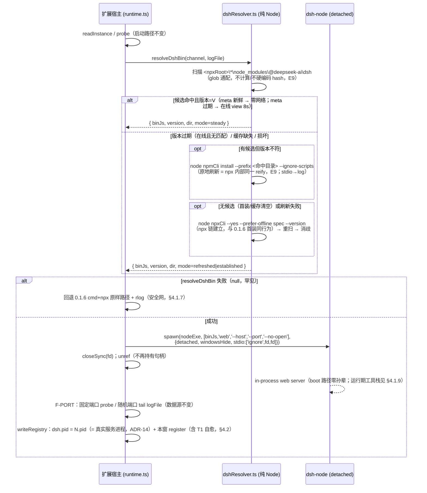

# 0.1.6 真机缺陷根因分析与解决方案

> 版本 v2.2（QA 设计门控 FAIL 修订 + 用户评审意见修订 + **QA 代码门控口径裁决（INFO-2/INFO-3，仅文档同步）**）| 日期 2026-08-28 | 状态：用户评审（ADR-12 否决）已修订 → 待用户复审 + QA 设计门控复审（retry=1/≤3，本轮为**用户评审意见修订，不占 QA 回环配额**）（A1 链：测试失败 → 架构师根因+方案）
> v2 修订记录（闭合 QA 设计门控 FAIL，已通过的其余 13 项不动）：
> - **F-01（BLOCKER）「E5 过度外推」**：E5 限定 boot 路径（§3.1.4）+ §4.1.1/§4.1.3 声明边界修正 + 新增 §4.1.9「运行期孙辈控制台风险」（dsh 本体行为边界）+ 新增真机判据 **RV-1b**（§11.2，发布前置）+ **ADR-17** 发布前显式处置决定；
> - **F-02（MAJOR）「升级迁移边界缺失」**：§4.3 新增 **§4.3.1 升级迁移边界**（遗留 managed 残局的判定 + 处置决策）+ 实施清单 #9「手动结束残留 dsh-node」标注**强制前置步骤（升级场景）**；
> - **minor**：F-03（`npm view` 改 async spawn，§4.1.2/§7/§10）、F-04（npm-cli 备选链纠正为标准 node 树，§4.1.2/§10 + probe R2 同步）、F-05（`startedAt` 保留条件加 `dshPid!==null` 守卫，§4.2.4/§10）、F-06（§4.1.2 mermaid 字面量 `\n` 改 `<br/>`）。
> **v2.1 用户评审意见修订记录（2026-08-28，不占 QA 回环配额；仅重构 §4.1 bin 解析方案，其余已过 QA / 无异议小节不动）**：
> - **用户强烈否决 v2 的 ADR-12「扩展自管 `dataDir()/dsh-runtime/<channel>/` 第二份安装」**：「明明我已经通过 npx 安装了一份 dsh，你还要再装一遍？浪费本地空间，尤其是第一次启动花的时间非常长。为什么不能复用 npx 已安装的 dsh？」
> - **ADR-12 重写 = npx 缓存复用优先（单一真源 = npx 缓存，零重复安装 / 零额外磁盘 / 首装 = 0.1.6 同行为）**：定位 = 内容扫描 `%LOCALAPPDATA%\npm-cache\_npx\*\node_modules\@deepseek-ai\dsh\package.json`（glob 通配 hash，**不计算 / 不硬编码 hash**）→ 取 `lib/bin.js`；多候选消歧（在线 `npm view` 版本比对 / 离线 mtime + rlog 声明）；新鲜度 = best-effort `npm view` + 24h meta 窗口（**meta.json 移到数据目录 `dsh-runtime-meta/<channel>.json`，仅记 lastCheckAt/knownVersion，不装包**）；版本过期 → **原地刷新** `node <npmCli> install --prefix <_npx 命中目录> --ignore-scripts --no-audit --no-fund`（**= npx 内部对 _npx 目录的同一 reify 操作**，新增证据 E9 源码级核实）；刷新失败 → 回退跑一次完整 npx 链（0.1.6 行为）后继续直连；首装 / 缓存清空 → 跑一次 npx 链建立（**与 0.1.6 首装完全同行为同时长，非新增成本**）；扫描失败 / 目录损坏 / 无 node → 0.1.6 `cmd+npx` 原样路径（安全网）。
> - **联动修订**：ADR-11 对照表**方案 E 翻转**（原「双真源 / 布局耦合 / 首装退化」否决 → 采纳，随自管目录取消而失效的理由逐条标注）；`ensureDshRuntime` → **`resolveDshBin(channel)`**（扫描 → 消歧 → 新鲜度 → 原地刷新 → 回退）；§11.1 **PV-1** binJs 断言改「位于 `_npx\*`（mock 布局）」、**PV-4** 去硬编码扫描保留且更严（无 hash 字面量 / 无 hash 计算 / 无绝对路径）、**新增 PV-5 多候选消歧断言 + PV-6 原地刷新命令参数断言**；§7 性能表（首装 = 0.1.6 相同 / 稳态 = 扫描+直连更快 / **新增磁盘零重复安装行**）；§5 **新增 R6 探针**（原地刷新：`npm install --prefix <_npx 命中目录>` 后 npx 仍正常、版本更新、**无第二目录产生**）+ 「`_npx` 布局依赖」风险节（回退链保底，最坏 = 0.1.6 现状）；ADR-13 适配新 meta 位置与原地刷新语义。
> - **新增证据 E9**（§3.1.4 证据链 / §5.1）：npx `_npx\<hash>` = npm prefix 安装布局（本机文件实证：根 `package.json` + `package-lock.json` + `node_modules`；npm 10.1.0 `libnpmexec` 源码 `reify` 实证；hash 派生 = `sha512(sorted specs)[:16]`，本机 3 个 dsh 目录逐一吻合）——「`npm install --prefix <_npx 命中目录>` 正是 npx 内部对 _npx 目录做的同一操作」的源码 / 本机双重证据。
> **v2.2 QA 代码门控口径裁决记录（2026-08-28，0.1.7 QA 代码门控 PASS 后两项非阻塞 INFO 确认；裁决 = 均接受实现口径，仅本文档同步、零代码改动、不占回环配额）**：
> - **INFO-2（§4.3.1 条件 2）**：实现为 `(pid === null || !isAlive(pid))`，比字面「注册 pid 死」宽（null 视同已死）——**裁决：接受（safe-side）**：null pid 的 managed-own 记录本就是不指向任何进程的残缺簿记、无「存活」可言（`isAlive` 参数为非空 `number`，null 须显式短路）；收窄反而使该类残局落入 external adopt、重演 P-STALEWIN；风险面无新增（条件 1/3/4 + 三重门控 + CIM 不可用不入迁移 + F-09 窄边均照常覆盖）。
> - **INFO-3（ADR-13）**：`updateRuntime` force 在「版本一致且候选健康」时返回 steady 跳过 no-op reify，与「强制原地刷新」字面微差——**裁决：接受（幂等语义）**：force = 确保 latest 的幂等刷新（强制 view 绕过 24h meta 窗口；已最新且健康则 no-op + rlog，不重复安装、符合零重复安装目标）；「强制」语义保留在绕过新鲜度缓存 + 过期/损坏即刷新 + 失败回退 npx 链。
> 分支：`fix-webview-boot-race` · 基线：0.1.6（detached v2，`e8fb8db`）· 目标版本：0.1.7
> 类型：排障 / 根因分析 + 解决方案（A1 完整链入口）

---

## 零、前置参考

- 0.1.6 真机验证结论（detached v2 基线）：✅ Phase 2 宿主强杀 dsh 存活（detached 非所有权成立）、Phase 3 重开 VSCode re-adopt 同一 dsh（pid 不变、不新 spawn）、面板直显 dsh UI + 顶部标签静态烘焙、managed-own 注册正确；❌ 两个新缺陷 **P-VIS**（可见 cmd 窗口）、**P-STALEWIN**（被杀窗口 pid 永久残留 `windows[]`，dsh 无法随最后窗口关停）。
- 前序文档：`docs/面板启动与生命周期根因分析.md`（ADR-1…ADR-10，detached 基线全设计）、`docs/开发报告.md`（0.1.6 实施）、`docs/联调测试剧本.md`（GUI 联调）。
- 项目 skill：`dsh-vscode-agent-engineering`（模块分层 / 构建测试命令 / 生命周期仲裁约定）。
- 本轮一次性探针（轮级，`.dsh/tmp/architect/`，闭环清理）：`probe_pvconsole.ps1`（P-VIS 真机控制台归属判定）、`probe_dshresolver.ps1`（修复方案前置条件验证）。**两者均需普通终端执行**（DSH 沙箱内 spawn/网络/ConstrainedLanguage 受限）。
- 源码取证（已读原文，行号按当前工作树）：`src/dshProcess.ts` L107-112/L148-165、`src/runtime.ts` L246-256/L413-461、`src/instance.ts` L69-76/L84-91/L152-195、`src/extension.ts` L40/L127-138；dsh 包（本机 npx 缓存 `@deepseek-ai/dsh@0.1.1-rc.2`）`lib/bin.js`、`node_modules/.bin/dsh.cmd`、`%AppData%\npm\npx.cmd`；dsh 本体运行期工具栈（v2 修订轮新增取证）`@deepseek-ai/dsh-subprocess-local/lib/index.js` L797-806（`spawnSubprocess`）、`@deepseek-ai/dsh-sandbox-windows-acl/README.md`（zh/en）+ `lib/types/spawn.d.ts`（§4.1.9）；**npm 包（v2.1 新增取证，E9，本机 `%AppData%\npm\node_modules\npm`，npm 10.1.0）** `lib/commands/exec.js` L74（`npx` = `npm exec` 别名 → 委托 `libnpmexec`）、`node_modules/libnpmexec/lib/index.js` L42-76/L92/L210-222/L274-279（hash = `sha512(spec 排序 join '\n').hex[:16]`；`installDir = resolve(npxCache, hash)`；`new Arborist({ path: installDir }).reify({ add })` —— **`_npx\<hash>` 目录就是 Arborist 以该目录为 prefix 的 npm 安装**；tag spec 每次执行比对 `resolved` 并在**同目录原地 reify**）、`node_modules/libnpmexec/lib/run-script.js` L20/L64（bin 经 `scriptShell`（Windows = ComSpec，index.js L92）执行；`@npmcli/run-script` 无 `windowsHide`/`NO_WINDOW`——grep 实证）；**本机 `_npx` 布局实证（v2.1）**：`%LOCALAPPDATA%\npm-cache\_npx\` 共 8 个 hash 目录，其中 3 个含 `@deepseek-ai/dsh`——`b86ed90107c62dab`（spec `@deepseek-ai/dsh@latest`，0.1.1-rc.2，mtime 08-27）、`1e7f6d9597241db0`（spec `@deepseek-ai/dsh` 裸名，0.1.1-rc.2，08-24）、`2ede61d9d1d3d32e`（spec `@deepseek-ai/dsh@0.1.0-rc.7`，0.1.0-rc.7，08-18）；每目录含根 `package.json`（如 `{"dependencies":{"@deepseek-ai/dsh":"^0.1.1-rc.2"}}`）+ `package-lock.json`（lockfileVersion 3，512 entries）+ `node_modules\@deepseek-ai\dsh\lib\bin.js`；hash 派生经 node crypto 本机计算逐一精确匹配（`sha512('@deepseek-ai/dsh@latest')[:16]` = `b86ed90107c62dab` 等）——**多候选并存为事实，消歧设计（版本比对 + mtime tiebreak）的依据**。

---

## 一、目标 / 背景分析

0.1.6 的 detached v2 基线在真机验证中证明了核心生命周期语义（宿主强杀存活 / re-adopt / 面板直显），但暴露两个用户可感知的 P0 缺陷：

1. **P-VIS**：detached managed dsh 以**可见的 Windows cmd 窗口**运行（Phase 1 起，用户实测）。代码里 `windowsHide:true` 已传（`src/dshProcess.ts` L109），但真机可见窗口——说明窗口**不是由我们受控的那次 `spawn` 直接产生的**，需要锁定真正创建控制台的进程层，并给出确定性消除方案。
2. **P-STALEWIN**：强杀扩展宿主后，被杀窗口的 pid **永久残留** `instance.json` 的 `windows[]`（取证：32916 强杀后残留、19360 新增；关所有窗口后残留仍在）→「最后窗口」判定永不成立 → **dsh 无法随最后窗口关停（用户实测 dsh 一直未停）**。

另有小项 **M1**（`code --install-extension` 后 `--list-extensions` 不回显版本号）已由编排者核实为 VSCode CLI 行为/显示假象、非缺陷，本文仅记录结论（§3.3 / §8.3）。

**目标**：
1. 对 P-VIS 给出**确定性判定**：可见窗口由哪一层创建（直接 cmd？npx 派生孙辈？）、为什么 `windowsHide` 未生效，并给出**不破坏已验证行为**（detached 独立性 / F-PORT 日志数据源 / `LOOPBACK_HOST` 单一来源 / 无硬编码）的消除方案；
2. 对 P-STALEWIN 给出「陈旧窗口自愈清理 + startedAt 语义修复」方案（liveness + 进程身份校验 + 双触发点 + safe-side 语义不回退）；
3. 深挖中**新发现一个 0.1.6 潜藏缺陷 P-PIDREC**（注册表 `dsh.pid` 记录的是 spawn 包装进程而非 dsh 服务进程，导致最后窗口关停的防误杀门控结构性恒不成立）——与 P-STALEWIN 同属「dsh 一直未停」缺陷族，一并修复（§3.2.2 / §4.1 / ADR-14）。

---

## 二、范围分析

**做什么**：
- P-VIS 根因锁定（含证据链与真机探针设计）+ 消除可见窗口的确定性方案（直连 `node` 启动 + **npx 缓存单一真源**，ADR-12 v2.1 重写：npx 缓存复用优先，零重复安装）；
- P-STALEWIN 方案（陈旧窗口自愈：liveness + VSCode extension-host 身份校验 + registerWindow 自愈 / shutdownBookkeeping 裁决前双触发 + safe-side）+ `startedAt` 保留修复；
- P-PIDREC 修复（注册表 `dsh.pid` = 真实服务进程）——P-VIS 方案的结构性收益，显式立项；
- M1 记录性结论（无代码改动）；
- 实施清单（逐项【角色】）+ 验证判据（无头自动化为主，真机项显式标注）。

**不做什么**：
- 不实施代码（本阶段仅设计，代码交开发专家）；
- 不改 dsh（`@deepseek-ai/dsh`）本身、不改 dsh GUI 前端、不改 webview 面板渲染链路（0.1.5/0.1.6 已验证通过，非本次缺陷面）；
- 不回退已验证行为：detached 独立性（Phase 2）、re-adopt 不重 spawn（Phase 3）、面板直显 + 顶部标签静态烘焙、managed-own 注册语义、三重防误杀 safe-side 语义、F-PORT 日志数据源；
- 自定义 `dsh.command`（非空）路径保留 0.1.6 行为（遗留边界，§4.1.7）；
- 不改 VSIX 打包结构（`out/` 已在包内，新模块随 `out/` 自然入包，`.vscodeignore` 无需改动——已核实现状：`out/**` 未被排除）。

---

## 三、根因锁定（证据链）

### 3.1 P-VIS：可见 cmd 窗口

#### 3.1.1 代码现状（0.1.6）

`src/dshProcess.ts` L107-112（`start()` 内）：

```ts
child = spawn(args.exec, args.argv, {
  detached: true,
  windowsHide: true,                       // ← 已传，但真机仍见窗口
  stdio: ['ignore', fd, fd] as const,      // ← F-PORT 日志数据源（fd = logs/dsh-<ts>.log）
  env: this.buildEnv(),
})
...
child.unref()
```

`src/dshProcess.ts` L148-165（`buildArgs()`，npx 路径）：`exec = 'cmd.exe'`，`argv = ['/d','/s','/c', 'npx --yes --prefer-offline @deepseek-ai/dsh@<channel> web --host <LOOPBACK_HOST> --port <p> --no-open']`。

即：**注册表记录的 `dsh.pid` = 直接子进程 = 最外层 `cmd.exe`（取证 pid 38108）**，dsh 服务进程是其多层孙辈。

#### 3.1.2 0.1.6 真机的完整进程链（取证重建）

`npx` 与 bin 在 Windows 上均为 `.cmd` shim；`cmd.exe` 执行 `.bat/.cmd` **在自身进程内**（不派生子 cmd）；而 **Node/libuv 的 `spawn` 遇到 `.bat/.cmd` 目标会自动包一层内部 `cmd /d /s /c "…"`**（libuv `src/win/process.c` 的批处理包装）。由此 0.1.6 每次 managed launch 的真实链为：

```
扩展宿主（Electron/Node；stdio=pipe，可能有/可能没有控制台——取决于 VSCode 从终端还是资源管理器启动）
 └─ spawn(cmd.exe, /d /s /c "npx --yes … web …", detached+windowsHide)   [我们受控的唯一一次 CreateProcess]
     = cmd#1（= 注册表 dsh.pid，取证 38108）
        ├─ CREATE_NO_WINDOW 生效（现代 libuv，见 §3.1.3）→ cmd#1 【无控制台】
        └─ 进程内执行 npx.cmd（cmd 跑批文件不派生进程）
             └─ CreateProcess(node npx-cli.js …)   ← npx.cmd 的 `"%_prog%" …` 行；cmd 无法传 NO_WINDOW
                 = npx-node（控制台应用；父 cmd#1 无控制台）
                    ⇒ Windows 默认规则：给「无控制台父的控制台子进程」【分配新控制台 = 可见窗口 #W】
                    （npx-node 的 stdio 经 cmd#1 继承的 fd 落日志文件，但控制台归属与 stdio 重定向无关）
                    └─ npm exec 解析 @deepseek-ai/dsh@latest（本机命中 _npx 缓存 b86ed90107c62dab）
                         └─ spawn(…/node_modules/.bin/dsh.cmd)   ← .cmd 目标，libuv 批处理包装
                             = cmd#2（父 npx-node 有控制台 #W → 继承，不再新建）
                                └─ 进程内执行 dsh.cmd；其中一行（本机实证，见 §3.1.4-E4）：
                                   `… || title %COMSPEC% & "%_prog%" "%dp0%\..\@deepseek-ai\dsh\lib\bin.js" %*`
                                   ⇒ 把控制台 #W 的标题设为 "C:\Windows\system32\cmd.exe"（= 取证标题）
                                   └─ CreateProcess(node lib/bin.js web --host … --port …)
                                       = dsh-node（取证 30596；bin.js 为 in-process web server，
                                         已核 dsh 包 `lib/` 全量 grep：web **启动**路径零 spawn，仅 `dsh plugin` 有 spawnSync pnpm；
                                          运行期工具执行栈的孙辈见 §4.1.9）
                                       ⇒ 继承控制台 #W → 窗口随 dsh-node 存活而存活
```

要点：
- **链上每一跳的「谁建控制台」都确定了**：唯一受控的 cmd#1 被 `CREATE_NO_WINDOW` 压住（现代 libuv）；真正分配可见窗口的是 **npx.cmd 发起的 `node npx-cli.js` 这次 CreateProcess**——它是链上第一个「父无控制台、自身未带 `CREATE_NO_WINDOW`」的控制台应用子进程，Windows 按默认规则给它新分配了一个控制台。
- 之后所有进程（cmd#2、dsh-node）**继承**该控制台，不再新建（有控制台父的控制台子默认共享）。
- **控制台的生命周期 = 最后一个附着进程**，与注册表 pid、与端口监听状态都无关——这解释了取证中「38108（cmd#1）已死、30596（dsh-node）仍持有可见控制台、3080 已无监听」：窗口附着在 dsh-node（及其中间层）上，dsh 停止监听/服务异常后进程若仍存活（dsh web 应用持有多类长寿命句柄），窗口即永久残留。
- 注册表记的是 cmd#1（最外层包装），**它不是控制台属主，也不是服务进程**——这一「记录身份错位」直接衍生 P-PIDREC（§3.2.2）。

> 取证快照（38108 死 / 30596 活）与单次 launch 的线性等待链不完全同帧（中间层进程无法先于叶子死亡），说明该快照跨越了多轮 launch/重拉/用户处置的历史状态；但「窗口创建于 npx 层、标题由 dsh.cmd 的 `title %COMSPEC%` 设定、随 dsh-node 存活」这一机制对每一轮 launch 同构成立。S1/S2 子情形（§3.1.3）由 `probe_pvconsole.ps1` 在真机一次性定案，不影响修复方案。

#### 3.1.3 平台语义与 libuv/Node 行为（S1/S2 判定框架）

- **Windows 控制台分配默认规则**（CreateProcessW 文档语义）：控制台应用子进程的父**有**控制台 → 共享父控制台；父**无**控制台 → **系统为新子分配新控制台（可见窗口）**；`CREATE_NO_WINDOW`/`DETACHED_PROCESS` 可抑制。控制台与 stdio 重定向无关（fd 重定向不改变控制台归属）。
- **Node `windowsHide`**：Node（PR #15380，cjihrig）将 `windowsHide:true` 映射为 libuv `UV_PROCESS_WINDOWS_HIDE` → libuv 置 `CREATE_NO_WINDOW`（`src/win/process.c`）。
- **Node `detached`**：libuv 置 `CREATE_NEW_PROCESS_GROUP`；历史上若宿主进程自身有控制台（`uv_has_tty()`），libuv 还会附加 `CREATE_NEW_CONSOLE`（让子独占新控制台）——**libuv 提交 b21c1f9「win: let UV_PROCESS_WINDOWS_HIDE hide consoles」已修复该冲突：`UV_PROCESS_WINDOWS_HIDE` 在场时不再建控制台**。VSCode 1.134 捆绑 Node 20/22（libuv ≥1.44，远晚于该修复）→ 走 **S1**：cmd#1 干净无控制台，窗口产生于 §3.1.2 的 npx 层。
- **S2（兜底子情形，旧 libuv + 宿主有控制台）**：若 libuv 未含该修复且扩展宿主附着了控制台（VSCode 从终端启动时宿主经继承链持有控制台），则 `detached+windowsHide` 组合下 `CREATE_NEW_CONSOLE` 抢先 → **cmd#1 自己**拿到可见控制台（标题初值为其命令行，随后同样被 dsh.cmd 的 `title %COMSPEC%` 改写为 "C:\Windows\system32\cmd.exe"）。S2 下控制台属主 = cmd#1（注册表 pid）。
- **S1/S2 的判别**（真机一次性）：`probe_pvconsole.ps1` 枚举 `ConsoleWindowClass` 窗口属主 pid——属主 = 最外层 cmd（注册表 pid）→ S2；属主 = npx-node（注册表 pid 的子、非注册表 pid）→ S1。**无论 S1 或 S2，修复方案相同**（§4.1）：因为只要保留 `cmd → npx.cmd → dsh.cmd` 这条 .cmd shim 链，链中必存在至少一次「不可控的控制台应用子进程 CreateProcess」（npx.cmd/dsh.cmd 由 cmd 进程发起，cmd 无法传 `NO_WINDOW`），可见窗口必现。**问题不在我们那一次 spawn 的 flag 组合，而在链结构。**

#### 3.1.4 证据链（P-VIS）

| # | 证据 | 内容 | 结论支撑 |
|---|---|---|---|
| E1 | 代码 | `src/dshProcess.ts` L107-112：`detached:true, windowsHide:true, stdio:['ignore',fd,fd]` + L148-165：`cmd.exe /d /s /c "npx … web …"` | 受控 spawn 只到最外层 cmd；`dsh.pid` = cmd 包装进程 |
| E2 | 真机取证（编排者采集） | 注册表 pid 38108（cmd.exe）已死；node 30596 持可见主窗口，`MainWindowTitle="C:\Windows\system32\cmd.exe"`；3080 无监听 | 窗口属主是链中 node 而非 cmd 根；标题 = cmd 镜像名；窗口生命周期独立于端口/注册表 pid |
| E3 | 本机文件实证（已读原文） | `%AppData%\npm\npx.cmd`：`… "%_prog%" "%dp0%\node_modules\npm\bin\npx-cli.js" %*`（`_prog` 优先 `%dp0%\node.exe`，否则 PATH 的 `node`） | npx 链第一跳 = cmd 进程内发起的 `node npx-cli.js` CreateProcess（无 `NO_WINDOW` 可传） |
| E4 | 本机文件实证（已读原文） | npx 缓存 `node_modules\.bin\dsh.cmd` L17：`endLocal & goto #_undefined_# 2>NUL \|\| title %COMSPEC% & "%_prog%" "%dp0%\..\@deepseek-ai\dsh\lib\bin.js" %*` | **取证标题 "C:\Windows\system32\cmd.exe" 的唯一来源 = 该行 `title %COMSPEC%`**（COMSPEC=C:\Windows\system32\cmd.exe），执行者是继承控制台的 cmd#2——窗口存在且归属链内进程的直接物证 |
| E5 | dsh 包源码（已读+全量 grep，**范围 = `@deepseek-ai/dsh/lib/`，即 boot 链**） | `lib/bin.js` `web` = `--profile web` → `runProfile` in-process；`lib/` 全量 grep `spawn\|child_process\|detached` 仅 `plugin-*.js` 的 `spawnSync("pnpm")`（`dsh plugin` 路径，web **启动**路径零 spawn） | **（限定 boot 路径）**dsh 服务进程 = npx 启动的那个 node（30596 类），**boot 链**内其本身不派生孙辈、不调 AllocConsole；**boot 时点**窗口不可能由 dsh 层创建。⚠️ 本证据**不覆盖运行期工具执行栈**（agent 执行 pwsh/bash 等工具时经 `dsh-subprocess-local` 派生孙辈，见 §4.1.9）——「boot 链成立」≠「全生命周期成立」 |
| E6 | 平台语义（CreateProcessW） | 无控制台父 + 控制台子 + 无 `NO_WINDOW`/`DETACHED` ⇒ 系统新分配控制台；`CREATE_NO_WINDOW` 抑制该分配与继承；控制台存活至最后附着进程退出 | S1 机制成立的依据；解释「窗口为何比注册表 pid 长寿」 |
| E7 | libuv/Node 源码事实（检索佐证，行级原文待网络恢复后归档至 §5 引用） | ① Node `windowsHide` → `UV_PROCESS_WINDOWS_HIDE` → `CREATE_NO_WINDOW`（nodejs/node PR #15380）；② libuv `UV_PROCESS_DETACHED` → `CREATE_NEW_PROCESS_GROUP`（+旧版 has-tty 时 `CREATE_NEW_CONSOLE`；libuv 提交 b21c1f9 起 `WINDOWS_HIDE` 抑制建控制台）；③ libuv win spawn 对 `.bat/.cmd` 目标自动包 `cmd /d /s /c` | 各层 flag 行为判定；S1/S2 框架；cmd#2 的产生方式 |
| E8 | 本机环境（已探针） | node v24.19.0（`D:\apps\nodejs\node.exe`，PATH 可解析）；npm 10.1.0；`%AppData%\npm\node_modules\npm\bin\npm-cli.js` 存在；`%AppData%\npm\node.exe` 不存在（npx.cmd 走 PATH `node` 分支） | 修复方案（直连 node + npm-cli）在本机可行（§5）；也说明 0.1.6 链中 npx-node = PATH 的 node |

**确定性判定（回答编排者问题 3）**：
1. 可见窗口**不是**由直接 spawn 的 cmd#1 创建的（现代 libuv 下 `CREATE_NO_WINDOW` 对其生效；S2 兜底子情形除外——真机探针定案），也**不是**由 dsh 层 node 的 AllocConsole 创建的（E5：dsh web 路径零 spawn、无 console 操作）；
2. 窗口 = **Windows 默认控制台分配**的产物：链上第一个「无控制台父 + 未带 `CREATE_NO_WINDOW` 的控制台子」——**npx.cmd 发起的 `node npx-cli.js`**（S1；或其前的 cmd#1，S2）；其**标题**由 npm bin shim（`dsh.cmd`）的 `title %COMSPEC%` 行设为 `C:\Windows\system32\cmd.exe`（E4，与取证标题逐字一致）；
3. 窗口随后被 dsh-node 继承持有 → **只要 .cmd shim 链存在，`windowsHide` 对我们受控的那次 spawn 生效与否都不影响结果**——这就是「windowsHide 已传仍见窗口」的根因。

#### 3.1.5 为什么不是其他假设（排除项）

| 假设 | 裁决 | 依据 |
|---|---|---|
| `detached+windowsHide` flag 组合错误（我们那一次 spawn） | ✗（S1 下）/ 仅 S2 子情形相关 | E6/E7：现代 libuv 下 `NO_WINDOW` 对 cmd#1 生效；即使 S2 成立，修 flag 也救不了 npx 层（§4.1.6 备选 B 否决理由） |
| dsh 自己 AllocConsole/派生可见子进程 | ✗（**boot 时点**；运行期工具执行栈派生孙辈是另一边界，见 §4.1.9） | E5 源码全量 grep（boot 链范围） |
| 用户自己开的终端窗口 | ✗（作为主因） | E4 标题物证 + 窗口随 managed launch 出现（Phase 1 起）；取证节点 30596 属 managed 链 |
| npx 缓存 hash 相关的偶发问题 | ✗ | 与 hash 无关，链结构必然产物 |

### 3.2 P-STALEWIN：陈旧窗口残留 + dsh 无法随最后窗口关停

#### 3.2.1 根因 1（编排者已锁定，本架构师复核确认）：无任何陈旧窗口清理

- `registerWindow`（`src/instance.ts` L84-91）只在每次 adopt/connect 登记本窗；`unregisterWindow` **仅**出现在 `disconnect()`（`src/runtime.ts` L341）与 `shutdownBookkeeping()`（L413-461，经 `src/extension.ts` L127 `process.on('exit')` / L133-138 dispose 触发）。**全代码无任何对 `windows[]` 中他人条目的清理逻辑**（grep 复核：`unregisterWindow` 仅上述两处调用）。
- Windows 上 `taskkill /F` 强杀扩展宿主（或 OOM）→ `process.on('exit')` **不触发**（exit 钩子只在正常终止路径运行）→ 该窗 pid 永久残留。
- `shutdownBookkeeping` L419：`if (next.windows.length > 0) return false`——**一条死窗残留即永久阻塞「最后窗口」裁决** → dsh 永不停。取证：32916（强杀）残留 + 19360 新增，关所有窗口后仍在。
- 附带的 pid 复用风险（编排者指出，确认）：只按 `isAlive(pid)` 清理不安全——死窗 pid 被无关进程复用后 `isAlive=true` 会误留（或更危险地：误清一个恰好复用 pid 的活进程条目）→ 需**进程身份校验**（§4.2）。

#### 3.2.2 根因 2（本轮深挖**新发现**，P-PIDREC）：注册表 `dsh.pid` 记录包装进程，最后窗口关停门控结构性恒不成立

`DshProcess.start()` 返回 `pid = child.pid` = **最外层 cmd 包装**（§3.1.2 的 cmd#1），`writeRegistry`（`src/runtime.ts` L248-253）原样入库。而 `shutdownBookkeeping` 的 managed-own/extension 关停门控（L442-451）要求：

```
isAlive(rec.pid) 且 resolvePortPid(rec.port).pid === rec.pid   // 三重防误杀的 pid/端口一致性校验
```

- `resolvePortPid`（netstat）返回的是**真正监听端口的 dsh-node pid**（§3.1.2 的 dsh-node，如 30596），**永远 ≠** cmd#1 的 pid；
- 因此即便 `windows[]` 完全干净，managed-own 最后窗口路径也必落入 L448-450 `pid/port mismatch; NOT killing (safe side)` → **0.1.6 的 managed-own 最后窗口关停是结构性空操作**——「dsh 一直未停」由**两个独立根因叠加**：(a) 陈旧窗口挡住裁决（§3.2.1），(b) 裁决真到达时 pid 门控也不放行（本节）。
- 该缺陷被 `sim.mjs` **掩盖**：sim 的 mock server 直接以「记录 pid = 监听 pid」的形态注册（`makeRecord(mockPid, …)`），恰好满足 holder 校验 → 单测通过、真机必败。教训：凡「记录身份 ≠ 服务身份」的断言必须在验证判据中显式覆盖（§11.1 PV-3 / RW-2）。

#### 3.2.3 次要问题（确认）：`startedAt` 语义失真

`writeRegistry` L252 每次 adopt/re-adopt **无条件** `startedAt = new Date()`（真机观测：同一 pid 38108 的 `dsh.startedAt` 08:25:16 → 08:28:48 被重写）；`registerWindow`（L87-88）对同 pid 重登记同样重置 `startedAt`。→ `startedAt` 不再反映真实进程启动/首次附着时刻，失去排障价值。修复见 §4.2.4 / ADR-16。

### 3.3 M1：记录性结论（非缺陷，无代码改动）

编排者已核实，本架构师采信并记录（§8.3 存档）：
1. `code --install-extension` 后 `code --list-extensions` 不回显版本号 = **VSCode CLI 输出格式行为**（本地 vsix 安装不附版本后缀）；安装目录 `%USERPROFILE%\.vscode\extensions\dsh-vscode-agent.dsh-vscode-agent-0.1.6\` 存在且其 `package.json` `version=0.1.6` → **安装正确**。
2. 安装时 DEP0169 `url.parse` DeprecationWarning = **VSCode 自带 CLI 的 Node 运行时告警**（Node ≥21 对 `url.parse` 的弃用警告，由 VSCode CLI 自身代码触发），与本扩展无关。
3. 用户控制台里 `package.json` 中文乱码 = **PowerShell 5.1 以 ANSI(936) 读取 UTF-8 文件的显示假象**；文件本身 UTF-8 正常、扩展运行正常。

---

## 四、系统技术选型及设计（解决方案）

### 4.1 P-VIS 修复：绕过 cmd/npx/.cmd shim 链——直连 `node` 启动「npx 缓存（单一真源，ADR-12 重写）」中的 dsh bin（ADR-11/12/13/14）

#### 4.1.1 设计原则

**消除可见窗口的充要条件 = 从扩展宿主到 dsh-node 的整条进程链中，每一次 CreateProcess 都受我们控制且不带可见控制台。** 0.1.6 链中 `npx.cmd`/`dsh.cmd` 由 **cmd 进程**发起子进程，cmd 无法传递 `CREATE_NO_WINDOW` → 链内必现不可控的控制台分配（§3.1.3）。因此唯一确定性方案是**移除 .cmd shim 层**：不经过 `cmd`/`npx`，直接 `spawn(node, [dsh bin.js, …])`——全链只剩**一次**受控 CreateProcess（`detached:true, windowsHide:true, stdio:fd`），该进程：
- `CREATE_NO_WINDOW`（`windowsHide`）→ 无控制台、不继承宿主控制台（宿主有无控制台都成立，**S1/S2 一并根除**，且不再依赖任何 libuv 版本行为）；
- `CREATE_NEW_PROCESS_GROUP`（`detached`）→ 进程组独立，宿主强杀不波及（Phase 2 语义保持，见 §4.1.5）；
- **boot 路径**无孙辈（E5：dsh web 启动路径零 spawn）→ **boot 链**深度 = 1，**boot 时点**不存在任何不可控控制台分配点。（**声明边界**：本节论证仅覆盖「扩展宿主 → dsh-node 启动」的 boot 路径；运行期 agent 工具执行栈的孙辈控制台风险属 dsh 本体行为、独立边界，见 §4.1.9，由 RV-1b 真机门控）

#### 4.1.2 模块设计

新增纯 Node 模块 `src/dshResolver.ts`（不 import 'vscode'，可无头测试）+ `src/paths.ts` 一处 meta 文件函数。**单一真源 = npx 缓存中已安装的 dsh（ADR-12 v2.1 重写：npx 缓存复用优先，扩展不再创建第二份安装副本）**：

```
paths.ts      + runtimeMetaFile(channel): string   // = dataDir()/dsh-runtime-meta/<channel>.json（仅记 { lastCheckAt, knownVersion } 两字段，
                  // **不装包**；dataDir 已支持 DSH_VSCODE_DATA_DIR 覆盖 → 无硬编码）
dshResolver.ts
  resolveNodeAndNpm(): { nodeExe, npmCliJs, npxCliJs } | null
    nodeExe   ← ① <npmPrefixDir>/node.exe（镜像 npx.cmd 首分支）② PATH 逐段探测 node.exe
    npmPrefixDir ← PATH 中首个含 npx.cmd 的目录（本机 = %AppData%\npm）
    npmCliJs  ← ① <npmPrefixDir>/node_modules/npm/bin/npm-cli.js（主）；备选 ② <nodeDir>/node_modules/npm/bin/npm-cli.js
                  （标准 node 安装树，npm 内置于此；原「<nodeDir>/../」备选与标准布局不符，予以纠正，probe R2 同步——F-04）
    npxCliJs  ← dirname(npmCliJs)/npx-cli.js（同 bin 目录兄弟文件，npm 布局内稳定；probe R6 覆盖）
    测试缝：env 覆盖 DSH_NODE_EXE / DSH_NPM_CLI / **DSH_NPX_ROOT**（_npx 根目录；默认 = `LOCALAPPDATA` env 的
                  `npm-cache\_npx`——与 npx 默认 npxCache 位置一致；无头测试注入 `.sim-tmp` mock 布局，与 DSH_VSCODE_DATA_DIR 同一模式）
  resolveDshBin(channel, { force, logFile }): Promise<{ binJs, version, dir, mode } | null>
    ① 解析 node/npm/npx（失败 → null → DshProcess 走 0.1.6 回退，§4.1.7）
    ② 扫描 <npxRoot>\*\node_modules\@deepseek-ai\dsh\package.json —— **glob 通配 hash 目录：不计算、不硬编码 hash**
       （hash = npm 内部 sha512(spec)[:16] 派生值，E9；代码只枚举 + 按包名/版本内容匹配，只读不构造）
       → 候选集 C = { dir, version（读 package.json）, mtime, binJs }；bin.js 缺失 = 损坏候选（可经 ⑤ 原地刷新修复）
    ③ 新鲜度参照版本 V（best-effort）：force → 必查；否则 meta（runtimeMetaFile，{lastCheckAt, knownVersion}）新鲜
       （< FRESHNESS_TTL_H=24h）→ V=knownVersion（**离线稳态零网络**）；
       否则 `node <npmCli> view @deepseek-ai/dsh@<channel> version`（**async spawn**（F-03，不阻塞事件循环），8s 上限（超时 kill + rlog），
       windowsHide，stdout→logFile）→ V=registry 并写 meta；view 失败（离线/超时）→ V=null + rlog
    ④ 多候选消歧（本机 3 目录并存实证，E9；选择与 tiebreak 全轨迹 rlog）：
       V≠null → 版本匹配集 M = { c∈C : c.version===V 且 bin.js 存在 }；M 非空 → 选 (mtime↓, dir 名↑) 首者 → 返回（mode=steady）；
       V=null（离线且无新鲜 meta，罕见边）→ 选 (mtime↓, dir 名↑) 首者 + **rlog 显式声明所选目录**（离线边声明）
    ⑤ 原地刷新（V≠null 且 M 空，或选中候选 bin.js 损坏）：目标 T = 版本===meta.knownVersion 的候选（上次所选，粘性）
       否则 (mtime↓, dir 名↑) 首者；执行
       `node <npmCli> install --prefix <T> --ignore-scripts --no-audit --no-fund @deepseek-ai/dsh@<channel>`
       （spawn，windowsHide，stdio→logFile，INSTALL_TIMEOUT_MS=90s；**这正是 npx 内部对 _npx 目录做的同一操作**——
       `new Arborist({ path: installDir }).reify({ add })`（E9），刷新的是 npx 自己的目录，不是扩展的第二个副本；
       --ignore-scripts = 确定性无子进程/无控制台，dsh 及其依赖均无构建脚本，E5/§5.1）
       → 校验（bin.js 存在 + version===V，文件读）→ 写 meta（lastCheckAt/knownVersion）→ 返回（mode=refreshed）；失败 → ⑥
    ⑥ npx 链建立（C 空/全损坏，或 ⑤ 失败）：`node <npxCliJs> --yes --prefer-offline @deepseek-ai/dsh@<channel> --version`
       （spawn，windowsHide，stdio→logFile，INSTALL_TIMEOUT_MS）——与 0.1.6 首装**同一条 reify 链、同一下载缓存、
       同时长量级**（npx 把 spec 装进自己的 _npx hash 目录，E9；`--version` = 廉价的链完整性验证；其末跳经 ComSpec 的
       秒级控制台闪烁 = 0.1.6 水平，非 0.1.6 的持久窗口，§4.1.7）→ 重扫 → ④ 选择 → 返回（mode=established）；失败 → ⑦
    ⑦ 返回 null → DshProcess 走 0.1.6 `cmd+npx` 原样路径（安全网，§4.1.7：行为/窗口/pid 形态 = 0.1.6 水平）
```

`DshProcess.start()` 改动（`src/dshProcess.ts`，**spawn 契约不变——直连 node bin.js、flag 逐位不变**）：
- `options.command` 非空 → 保持 0.1.6 `cmd.exe /d /s /c <command>` 路径**不变**（遗留边界，§4.1.7）；
- 否则（npx 路径）：先 `await resolveDshBin(channel, {logFile})`：
  - 成功（{binJs, version, dir, mode}）→ `spawn(nodeExe, [binJs, 'web', '--host', LOOPBACK_HOST, '--port', String(port), '--no-open'], { detached:true, windowsHide:true, stdio:['ignore',fd,fd], env })` + `unref()`（**flag 组合与 0.1.6 逐位一致**，仅 exec/argv 改变；binJs = `_npx` 命中目录内的 `lib/bin.js`——即用户 npx 运行的同一份安装）；
  - 失败（null）→ 回退 0.1.6 `cmd.exe /d /s /c "npx …"` 路径 + rlog（**安全网**：行为=0.1.6，窗口/pid 形态=0.1.6 水平，属「npx 缓存不可用」降级态，文档明示）。
- 包名 `@deepseek-ai/dsh` 提为模块级常量 `DSH_PKG`（单一来源，去散字面量）。

**时序（managed launch，0.1.7 主路径）**：



#### 4.1.3 无窗口论证（确定性）

| 链上 CreateProcess | 发起者 | flag | 控制台结果 |
|---|---|---|---|
| `node <binJs> web …`（**boot 路径**唯一一跳） | 扩展宿主 | `CREATE_NO_WINDOW`（windowsHide）+ `CREATE_NEW_PROCESS_GROUP`（detached） | 无控制台、不继承宿主控制台（Windows 规则：`NO_WINDOW` 同时抑制「继承」与「新分配」）；**boot 路径**无第二跳（E5：启动路径零 spawn）→ **boot 时点无任何可见控制台**。**声明边界**：本表仅论证 boot 路径（启动单跳）；运行期 agent 工具执行栈的孙辈控制台行为（§4.1.9，dsh 本体）不入本表，由 RV-1b 门控 |

对 S1/S2 两个子情形都成立：S1（宿主无控制台）与 S2（宿主有控制台）下，`NO_WINDOW` 子进程都不带控制台；不再存在 cmd/npx 层，§3.1.2 的「不可控 CreateProcess」被整体移除。**结论不依赖 libuv 版本、不依赖 VSCode 启动方式（终端/资源管理器）。⚠️ 结论范围 = boot 路径**（扩展宿主 → dsh-node 的启动单跳；「boot 链成立」≠「全生命周期成立」）——运行期（agent 工具执行）孙辈控制台风险由 §4.1.9 单独定性、RV-1b 真机门控，不并入本节声明。

#### 4.1.4 不破坏 F-PORT 论证

F-PORT 的数据源 = `logs/dsh-<ts>.log`（`resolvePortFromLog` tail 横幅 / 固定端口直 probe，ADR-9）。新方案中该 fd 仍以 `stdio:['ignore',fd,fd]` 交给 dsh-node（与 0.1.6 同一机制，仅接收方从 cmd 包装换成 dsh-node 本体）；dsh 的 stdout 横幅 `dsh web: http://127.0.0.1:<port>` 原样落盘；`npm view`/原地刷新 `npm install --prefix`/npx 链建立的受控输出也追加进同一 logFile（排障增益）。**`resolvePortFromLog`/`URL_RE`/probe 逻辑零改动。**

#### 4.1.5 不破坏 detached 独立性论证

- 关键 hop 的 flag 组合与 0.1.6 **逐位相同**（`detached:true` + `windowsHide:true` + `unref()`，宿主不持句柄、无 exit 监听）→ Phase 2「宿主强杀 dsh 存活」的成立条件未变（Windows 下 `taskkill /F` 无 `/T` 不级联；进程组独立由 `CREATE_NEW_PROCESS_GROUP` 提供）；
- 注册表 `dsh.pid` 变为 dsh-node 本体（ADR-14）后，`forceRelaunchManaged` 的 `treeKill(rec.pid)` 直接作用于服务进程（0.1.6 杀的是 cmd 根，`/T` 理论上覆盖全链，但记录身份错位是隐患）；最后窗口关停的 `treeKill` 同理（§4.1.8）。
- 回归保障：联调 Phase 2/3 重跑（§11.2 RW-4/RW-5）。

#### 4.1.6 备选方案与否决理由（ADR-11 对照）

| 备选 | 内容 | 裁决与理由（B/C/D/F 否决；E 于 v2.1 用户评审轮翻转采纳 → ADR-12） |
|---|---|---|
| B. 仅修正 flag 组合 | 调 `detached`/`windowsHide` 交互（或去 detached） | 窗口创建于 npx 层（§3.1 判定），我们受控的那次 spawn 的 flag 改不出链外；去 `detached` 回退 Phase 2 已验证行为（红线） |
| C. `powershell -WindowStyle Hidden` 包装 | 用 PowerShell 隐藏包装 | 控制台仍被链内层创建后「隐藏」，仍有闪烁且启动更慢；不触及 npx/dsh.cmd 层，不解决问题 |
| D. 直连 `node npx-cli.js`（绕过外层 cmd） | 让宿主直接 spawn npx-cli（NO_WINDOW） | npx-cli 随后仍 spawn `.bin/dsh.cmd`（libuv 批处理包装 → cmd#2）→ cmd#2 的父（npx-cli node）无控制台 → **新控制台照样分配**（§3.1.2 机制下一层复现）。必须连 .cmd shim 层一起移除 |
| E. 枚举 npx 缓存目录（`_npx\*`）找 bin.js 直跑 | **采纳（v2.1 用户评审轮翻转，落实为 ADR-12 重写；v2 曾否决）** | v2 否决理由逐条失效：① 「双真源（npx 缓存 + 扩展托管）版本漂移」——**随扩展自管安装目录取消而消失**（扩展不再建第二份副本，单一真源 = npx 缓存）；② 「缓存目录布局是 npm 内部约定（版本敏感，哈希派生自 spec）」——**以回退链保底**（扫描失败/刷新失败/无 node → 0.1.6 `cmd+npx` 原样路径，最坏情形 = 0.1.6 现状，无回退风险，§4.1.7）；且定位 = **glob 枚举而非 hash 计算**（不耦合 npm 内部 sha512(spec) 算法，E9）；③ 「首装/清缓存语义退化」——npx 链建立一次（**与 0.1.6 首装完全同行为同时长，非新增成本**；缓存热用户 0.1.7 首启反而更快：扫描+直连，跳过 npx 解析链） |
| F. 无控制台 launcher 中转双层 spawn | 宿主→launcher（仅 windowsHide，无控制台）→launcher 再 detached spawn | 对「直连 node」方案是冗余加固（NO_WINDOW 已版本无关地成立）；引入 pidfile/launcher 文件等 pid 间接契约，复杂度不成比例。**保留为观察项**：若未来宿主 Node 行为回归（探针发现窗口复现）再启用 |

#### 4.1.7 回退与遗留边界

- **回退链（分层、全 best-effort，最坏 = 0.1.6 现状）**：`resolveDshBin` 内部分层——扫描+消歧（零网络）→ 原地刷新（命中目录，= npx 内部同一 reify，E9）→ npx 链建立（`node <npxCli> --yes --prefer-offline spec --version`，与 0.1.6 首装同行为）→ 仍失败返回 null → **0.1.6 `cmd+npx` 原样路径**（安全网；该路径**不依赖扩展对 `_npx` 布局的任何认知**——npx 自己知道自己的布局）。触发面：无 node/npm-cli、`_npx` 缺失/损坏且刷新与建立均失败、首次离线等；行为 = 0.1.6（窗口/pid 形态 = 0.1.6 水平）+ rlog 记录失败层；保证「环境损坏时扩展仍尽力启动」，且**不存在任何比 0.1.6 更差的路径**。
- **首装/缓存清空（诚实声明）**：`_npx` 无该包 → npx 链建立（⑥）= **与 0.1.6 首装完全同行为同时长**（同一条 reify 链、同一 `%LOCALAPPDATA%\npm-cache` 下载缓存、同一依赖集）——非新增成本；其末跳（`dsh --version` 经 ComSpec；`@npmcli/run-script` 无 `windowsHide`，E9）产生**秒级控制台闪烁**（`dsh --version` 执行期，自动消失）——严格短于 0.1.6 首装的**持久**窗口，任何场景不劣于 0.1.6。**缓存热用户（全部 0.1.6 升级用户——0.1.6 至少 npx 装过一次）的 0.1.7 首启 = 扫描 + 直连，跳过 npx 链，反而更快且零窗口。**极端环境下首装实例若经安全网（⑦）启动，其形态 = 0.1.6（wrapper pid/可见窗口）；该实例终结后（用户 `forceRelaunchManaged` 或手动结束，§4.3.1 的 wrapper 存活形态处置机制适用）的下一实例即直连形态（无窗口、真实服务 pid）。
- **自定义 `dsh.command`**（非空）：保留 0.1.6 `cmd /c` 路径不变。该路径是用户自填命令的遗留边界，若用户命令本身含 .cmd/控制台应用，仍可能产生窗口——非本扩展可控面，文档/配置描述中明示（`dsh.command` description 补一句）。
- **`dsh channel` 语义**：`latest`/`preview` 原样传入 `@deepseek-ai/dsh@<channel>` spec（npm 解析 dist-tag，与 npx 同语义）；npx 缓存 hash 目录**按 spec 天然分渠道**（不同 spec → 不同 hash 目录，E9）——latest/preview 缓存互不干扰，与 0.1.6 的 npx 行为一致。
- **`_npx` 布局依赖（诚实声明）**：`_npx\<hash>` 目录布局（根 `package.json` + `package-lock.json` + `node_modules`；hash = sha512(spec 排序)[:16]）是 **npm 内部实现、非公共 API、版本敏感**（npm 7 起引入该布局约定；本机 npm 10.1.0 实证与 E9 逐点一致）——但**最坏情形 = 0.1.6 现状**（回退链保底，首条），**无回退风险**；「dsh 现在跑的是哪个版本」= 读 `_npx` 命中目录的 `package.json`（**可观测性不降**——跑的就是用户 npx 跑的那一份，与手动 npx 天然同版本）。

#### 4.1.8 P-PIDREC 的结构性闭合（ADR-14）

新方案下 `dsh.pid` = dsh-node 本体 = 端口 holder：
- `dshAlive()`/step1 re-adopt 的 `isAlive(rec.pid)` 反映**真实服务进程**生死（0.1.6 中 cmd 包装与 dsh-node 生死可能错位，re-adopt 判定失真）；
- 最后窗口关停门控 `holder.pid === rec.pid` **首次真实可达** → managed-own「最后窗口关停」从结构性空操作变为可成立（与 §4.2 的陈旧窗口清理共同恢复「关所有窗口 → dsh 停」的端到端行为，§11.2 RW-2）。

#### 4.1.9 运行期孙辈控制台风险（dsh 本体行为边界；RV-1b 门控 + ADR-17 处置）

**定性（dsh 本体源码已读核实，本机 npx checkout `@deepseek-ai/*@0.1.1-rc.2`）**：E5 的证据范围是 `@deepseek-ai/dsh/lib/`（**boot 链**：启动路径零 spawn）。dsh web profile 的**运行期 agent 工具执行栈**另成体系——agent 执行 pwsh/bash 等工具时，由 dsh 本体的工具依赖包派生孙辈：

| dsh 本体组件 | 行为（源码/文档实证） | 控制台含义 |
|---|---|---|
| `@deepseek-ai/dsh-subprocess-local` `lib/index.js` L797-806（`spawnSubprocess`） | `spawn(program, args, { cwd, env, stdio:[…], detached: platform !== "win32" })`——**无 `windowsHide`**，win32 上 `detached=false`（非 detached） | 工具孙辈 = 「无 `CREATE_NO_WINDOW` 的控制台子进程」；其控制台归属完全由父进程（dsh-node）是否有控制台决定（E6 规则） |
| `@deepseek-ai/dsh-sandbox-windows-acl` README（zh L80 / en L78）+ `lib/types/spawn.d.ts` | 受限令牌下以 `CREATE_NO_WINDOW`/`CREATE_NEW_CONSOLE` 创建的子进程在 DLL 初始化期以 `STATUS_DLL_INIT_FAILED`（`0xC0000142`）死亡（POC 实测）→ 沙箱方案**刻意不做控制台隔离**：「子进程因此共享宿主控制台」（stdio 走管道不受影响） | dsh 沙箱路径的设计假设 = **宿主（dsh-node）有控制台**；0.1.7 无控制台启动后该假设不成立 |
| 工具包依赖面（各 `package.json` dependencies 实证） | `dsh-tool-pwsh` / `dsh-tool-bash` / `dsh-pwsh-local` / `dsh-bash-local` / `dsh-pwsh-sandbox` / `dsh-bash-sandbox` 等均依赖 `dsh-subprocess-local` | 面板 agent 的 pwsh/bash 工具调用即走此栈（主工作负载） |

**E6 规则推演（复发路径）**：
- **0.1.6**：工具孙辈共享 npx 层已分配的可见控制台 #W（「共享宿主控制台」恰好成立）→ 孙辈不新建窗口；窗口存在本身归 boot 链（= P-VIS，已由本方案在 boot 路径消除）；
- **0.1.7**：dsh-node 以 `windowsHide` 启动 → **无控制台**。按 E6（无控制台父 + 未带 `NO_WINDOW` 的控制台子 → OS 新分配控制台）：面板 agent **每执行一次工具调用（pwsh/bash），可能新弹一个可见控制台窗口**——**P-VIS 缺陷族在主工作负载（面板跑 agent）的复发形态**。RV-1 只测 boot 时点，**抓不到它**。
- 诚实标注：当前是**推演而非观测**（E6 为平台规则；dsh 运行期各工具包分支是否恒走该 spawn 路径、是否存在其他控制台抑制，需真机定案）——这正是 RV-1b 的存在意义。

**边界归属**：这是 **dsh 本体行为、本扩展不可控**——spawn 参数在 dsh 依赖包内部，扩展无法向其注入 `windowsHide`；沙箱共享控制台是受限令牌方案的硬约束（0xC0000142）而非疏漏。0.1.7 的修复目标 = **boot 时点窗口**（§4.1.3，确定性、边界内）；运行期孙辈窗口不并入 boot 路径声明，按 **ADR-17**（发布前显式处置）管理，真机门控 = **RV-1b**（§11.2）。

### 4.2 P-STALEWIN 修复：陈旧窗口自愈清理 + startedAt 语义修复（ADR-15/16）

#### 4.2.1 判定语义（liveness + 身份校验 + safe-side）

对 `windows[]` 中每条记录（pid），清理判定按两级：

1. **Liveness（主信号，即时、零开销）**：`!isAlive(pid)`（`process.kill(pid,0)`）→ **清除**。覆盖真实场景：被强杀的宿主（pid 已死）。
2. **身份校验（pid 复用兜底，仅对「存活」pid）**：Windows pid 会复用——死窗 pid 被无关进程复用后 `isAlive=true`，若不清则残留复辟；若误清则伤害真实窗口。用 **CIM 进程身份查询**裁决：
   - 查询：`Get-CimInstance Win32_Process -Filter "ProcessId = <pid>"` → `Name` + `CommandLine`（复用 `src/instance.ts` 既有 `processCommandLine` 的 powershell spawnSync 模式，扩展为一次查询取两字段；**有界超时**）；
   - 判定：`CommandLine` 含 **`--type=extensionHost`** → `exthost`（VSCode 扩展宿主的确定性签名，跨 stable/insiders/OSS 渠道、跨版本稳定——扩展宿主进程恒以该 flag 启动）→ **保留**（它是真实附着窗口，由其自身生命周期负责注销）；
   - 查询成功且 `CommandLine` 非空但不匹配 → `foreign` → **清除**（该 pid 已不是 VSCode 扩展宿主 = 复用/陈旧）；
   - 查询失败/超时/`CommandLine` 为空 → `unknown` → **保留（safe-side，宁留勿误清）**——与现有 `shutdownBookkeeping` 的 safe-side 语义（CIM 不可用→记录保留）同源同向，不回退三重防误杀。
   - **缓存**：模块级 `Map<pid, {at, verdict}>`，TTL = `IDENTITY_CACHE_TTL_MS = 60_000`（常量集中，不分散）——同一活窗口在「连接自愈 + 退出裁决」双触发间不重复付费（WMI 冷启动 0.5–3s）。
3. **永不**清理判定为 `exthost` 的存活条目；**永不**因 `unknown` 清理。

#### 4.2.2 双触发点（编排者建议 + 细化）

```mermaid
flowchart TD
  A[connect 路径任一成功: re-adopt / adopt / launch ready] --> B[writeRegistry（改 async）]
  B --> C[T1 同步: scrubDeadWindowsSync<br>仅 liveness（process.kill，微秒级）<br>清掉死窗 → 覆盖强杀场景，即时生效]
  C --> D[registerWindow 本窗（同 pid 重登记保留 startedAt）→ writeInstance]
  D --> E[T1b 异步: scrubIdentityAsync<br>对每个存活 pid（含本窗）做身份校验（10s 上限/条，60s 缓存）<br>发现 foreign → 重读 + 移除 + 再写（带守卫）<br>fire-and-forget，不阻塞启动]
  F[窗口正常关闭: process exit / dispose] --> G[shutdownBookkeeping]
  G --> H[unregisterWindow 本窗]
  H --> I[T2 同步: scrubDeadWindowsSync + scrubIdentitySync<br>身份校验超时上限 2s/条（退出路径延迟敏感）<br>unknown → 保留（safe-side）]
  I --> J{windows 空?}
  J -- 否 --> K[非最后窗口 → 保留 dsh（行为不变）]
  J -- 是 --> L[dsh 裁决: external→保留 known-external；managed-own/extension→三重门控<br>（isAlive(rec.pid) + holder===rec.pid + 探活）→ treeKill + 清记录<br>※ rec.pid 现为真实服务进程（ADR-14）→ 门控首次真实可达]
```

- **T1（registerWindow 时自愈）**：`writeRegistry` 改为 `async`（全部 4 个调用点均在 async 上下文：`start()` step1/step2、`launchManaged`、`waitForExternalStartup`，改为 `await`）；同步 liveness 清理由 `process.kill` 完成、无 I/O 阻塞；身份校验异步化避免激活路径被 WMI 冷启动拖住（最坏 3s/条 × N 条）。
- **T2（shutdownBookkeeping 裁决前）**：退出路径本身可同步阻塞但延迟敏感（窗口关闭体感），故身份校验设 **2s/条上限** + 缓存（同窗通常 60s 内已被 T1b 缓存过 → 实际命中缓存）；超时 → `unknown` → 保留（safe-side）。**双触发互为保险**：T2 漏掉的（超时 unknown 复用 pid）会在下一窗 connect 的 T1b 清掉。
- **注入缝（可测性）**：`DshRuntime` 增加可选 `identityCheck?: (pid: number) => 'exthost' | 'foreign' | 'unknown'`（默认 = 真实 CIM 实现）——sim 注入 mock 即可无头断言三个分支（§11.1 PW-3）。

#### 4.2.3 端到端场景重放（修复后）

```
0.  窗口 A（exthost 50000）connect → windows=[50000]，dsh 起（managed-own，pid=dsh-node 90000）
1.  用户 taskkill /F 50000 → exit 钩子不触发 → windows=[50000(死)] 残留（0.1.6 起点的病态）
2.  窗口 B（exthost 60000）connect：
      step1 re-adopt（dsh 90000 存活 + 探活通过）→ writeRegistry：
        T1：50000 已死 → 清除 → windows=[60000] ✅（P-STALEWIN 主场景闭合）
3.  用户关窗口 B（正常关闭）：
      shutdownBookkeeping：unregister 60000 → T2：无残留 → windows=[]
      裁决：managed-own 门控 isAlive(90000) ✓ + holder(3080).pid===90000 ✓（ADR-14）
      → treeKill(90000) → dsh 停止、端口释放、记录清除 ✅（「dsh 随最后窗口关停」恢复）
4.  变体：步骤 1 中 50000 的 pid 恰被无关进程复用（isAlive=true）：
      窗口 B connect 时 T1b：身份校验 → foreign → 清除 ✅；T2 同步路径 2s 上限兜底。
      若 CIM 失败（unknown）→ 保留（safe-side）→ 下一窗 T1b 再清；最坏 dsh 延迟一个窗口周期停止——
      方向恒为「宁留勿误清」，与 0.1.6 safe-side 语义一致。
```

#### 4.2.4 startedAt 保留（W2 / ADR-16）

- `runtime.writeRegistry`：`startedAt = (inst.dsh && this.dshPid !== null && inst.dsh.pid === this.dshPid) ? inst.dsh.startedAt : new Date().toISOString()`——**同 dsh 进程 re-adopt 保留原值**（真机 08:25:16 不再被重写为 08:28:48）；新 dsh 进程（pid 变化）→ 新值。（**F-05 守卫**：external 场景 `this.dshPid === null` 时 `null === null` 恒真会**误保留**旧值，故保留条件前置 `this.dshPid !== null`）
- `instance.registerWindow`：同 pid 重登记保留该窗已有 `startedAt`（首次附着时刻语义），新 pid → 新值。
- 语义定义（写入 `src/instance.ts` 接口注释）：`dsh.startedAt` = 该 dsh 进程**首次**被本注册表记录（≈真实启动）时刻；`windows[].startedAt` = 该窗**首次**附着时刻。

### 4.3 状态机与注册表影响（面）

- `RuntimeState` 状态机、启动路径（registry re-adopt → port probe → lock → launch）、探活/退避、`disconnect/reconnect/forceRelaunchManaged` 语义**全部不变**；变更点收敛为：`writeRegistry` async + T1/T1b、`shutdownBookkeeping` T2、spawn exec/argv（npx 路径）、`dsh.pid` 记录语义（ADR-14）、`startedAt` 语义（ADR-16）。
- 注册表结构**字段零增减**（`dsh{pid,port,managedBy,startedAt}` / `windows[]{app,pid,startedAt}` 不变），纯语义修正 + 自愈行为 → 旧 0.1.6 注册表文件可被 0.1.7 直接读取并自愈（迁移无需清文件；旧残留死窗在首次 connect 即被 T1 清除；dsh 进程残局的迁移边界见 §4.3.1）。

#### 4.3.1 升级迁移边界（0.1.6 → 0.1.7：遗留 managed 残局场景）

**场景（QA F-02，「死 wrapper + 活 holder」形态，即取证观测到的残局）**：0.1.6 的 managed dsh 存活（注册表 `managedBy='managed-own'`、`dsh.pid` = cmd 包装进程且已死、dsh-node 仍活并监听端口）→ 用户直接安装 0.1.7 → step1 re-adopt 失败（注册 pid 已死）→ step2 端口探测发现**活的 dsh-node** → 若按「pid 失联即外部」一律 **external adopt**（`managedBy` 从 `managed-own` 降级为 `external`）→ external 语义 = 最后窗口**永不杀** → 本缺陷轮要恢复的「关所有窗口 → dsh 停」在升级路径**静默失效**——而升级用户（0.1.6 → 0.1.7）恰是最可能带着活残局来装 0.1.7 的人群。

**wrapper 存活形态（F-08 补全：0.1.6 全链活、wrapper cmd 仍活）**：该形态下 step1 re-adopt 通过（注册 wrapper pid 存活）并**保留 wrapper pid**（不进入 step2 残局识别）→ 最后窗口门控 `holder.pid === rec.pid` 仍结构性不可达（holder = dsh-node ≠ wrapper pid，与 0.1.6 的 P-PIDREC 行为同构、**无回退**）→ 需用户手动介入方可恢复：实施清单 **#9 强制前置步骤（手动结束残留 dsh-node）**，或 `forceRelaunchManaged`（经直连 node 路径重新 spawn 并把 `dsh.pid` 刷新为真实服务 pid，门控即可达）。

**判定方式**（四条件全满足 → 识别为「0.1.6 遗留 managed 残局」，适用于「死 wrapper + 活 holder」形态）：
1. 注册表 `managedBy === 'managed-own'`（扩展自身簿记断言，非用户可写）；
2. 注册表 `dsh.pid` 已死（`isAlive(rec.pid) === false`；**实现口径（v2.2 INFO-2 裁决：接受，safe-side）**：`rec.pid === null` 亦视同已死——`(pid === null || !isAlive(pid))`：null pid 的 managed-own 记录本就是不指向任何进程的残缺簿记、无「存活」可言（`isAlive` 参数为非空 `number`），且不新增风险面（条件 1/3/4 + 三重门控 + CIM 不可用不入迁移 + F-09 窄边照常覆盖；收窄反而令该类残局降级 external、重演 P-STALEWIN））；
3. 注册端口 holder 存活（`resolvePortPid(port)` 有效）；
4. holder 命令行含 dsh 特征（`looksLikeDsh`：`@deepseek-ai/dsh`）——**防误杀护栏**：端口被非 dsh 进程占用时不入此分支。

**处置决定：adopt 且 `managedBy` 沿用 `managed-own`**（不降级 external），同时将 `dsh.pid` 刷新为 holder 真实 pid（ADR-14 记录语义：记录身份 = 服务身份），`dsh.startedAt` 按 ADR-16 公式（新 pid → 新值），rlog 显式记录「adopted 0.1.6 residual as managed-own（residual migration）」。

**理由**：
1. **所有权连续**：`managedBy='managed-own'` 是 0.1.6 扩展实例的 spawn 簿记，0.1.7 实例是同一属主的继承者——补完原所有权意图（最后窗口关停）不是误杀；
2. **不误杀（safe-side）**：最后窗口关停仍须过**全套三重 safe-side 门控**（`isAlive(rec.pid)` + `holder.pid === rec.pid` + 探活），且 `rec.pid` 已刷新为准确的 dsh-node holder（比 0.1.6 更精确——0.1.6 该门控结构性恒不成立，P-PIDREC）；条件 4 的 dsh 特征校验是第二道护栏；
3. **反事实对照（若降级 external）**：零误杀风险，但 P-STALEWIN/P-PIDREC 修复对**全部升级用户**静默失效——用户主诉「dsh 一直未停」升级后原样持续，且注册表语义被静默篡改（managed-own → external）、事后难以追溯。取舍明显不利。

**safe-side 兜底**：任一判定条件不满足（`managedBy` 为 external/缺失、holder 无 dsh 特征、端口无 holder 等）→ 走**既有** external adopt / 不 adopt 路径，永不杀（既有语义零改动）。

**窄误识别边（F-09）**：残局识别以「注册表簿记为唯一所有权信号」为前提——若注册表为陈旧 `managedBy='managed-own'` 记录（原 wrapper 已死）且用户**手动在同端口新起了一个 external dsh**，四条件可能同时满足（holder 即用户手动 dsh，dsh 特征通过）→ 最后窗口可能**杀掉用户手动起的 dsh**（簿记为唯一所有权信号的固有约束；条件 4 的 dsh 特征已挡住**非 dsh 进程误杀方向**——非 dsh 占端口者不入此分支，按上述 safe-side 走既有路径）。缓解：① rlog 留痕——处置决定中显式的 residual-migration adopt 记录（含注册旧 pid、holder 新 pid、端口、特征匹配）事后可追溯；② 文档提示（README/使用说明）：用户手动运行 dsh 时若与 managed 同端口，可换端口（不同端口）以避免被当作 managed 残局处置。

**双保险（belt-and-suspenders）**：实施清单 **#9 将「手动结束残留 dsh-node」标注为强制前置步骤（升级场景）**——0.1.7 首启前引导用户手动结束 0.1.6 残留 dsh-node（最干净的起点状态、零识别歧义）；用户跳过该步时，由上述自动识别兜底（**仅对「死 wrapper + 活 holder」形态生效**——四条件要求注册 pid 已死；wrapper 存活形态不进入该识别，见上文 wrapper 存活形态段）。

---

## 五、可行性分析（含探针数据）

### 5.1 本机环境事实（已探针，2026-08-28）

| 项 | 实测值 | 对方案的意义 |
|---|---|---|
| node | v24.19.0 @ `D:\apps\nodejs\node.exe`（**PATH 可解析**；非 Program Files 默认位） | resolver 必须走 PATH 探测（不能假设默认安装位）；✅ 可行 |
| npm | 10.1.0；`%AppData%\npm\node_modules\npm\bin\npm-cli.js` **存在**；`%AppData%\npm\node.exe` 不存在 | npm-cli 解析走「PATH 中 npx.cmd 同前缀」路径 ✅；与 0.1.6 npx 链使用同一套 node/npm（npx.cmd 的 `_prog=node` PATH 分支）→ 无新环境前提 |
| npx 缓存 | `%LOCALAPPDATA%\npm-cache\_npx\` 共 8 个 hash 目录，其中 **3 个含 `@deepseek-ai/dsh`**：`b86ed90107c62dab`（spec `@deepseek-ai/dsh@latest`，0.1.1-rc.2，mtime 08-27）、`1e7f6d9597241db0`（spec 裸名 `@deepseek-ai/dsh`，0.1.1-rc.2，08-24）、`2ede61d9d1d3d32e`（spec `@deepseek-ai/dsh@0.1.0-rc.7`，0.1.0-rc.7，08-18）；各目录 = npm prefix 布局（根 `package.json` + `package-lock.json`（lockfileVersion 3，512 entries）+ `node_modules\@deepseek-ai\dsh\lib\bin.js`） | **0.1.7 运行时单一真源 = 此缓存（零重复安装，ADR-12 v2.1 重写）**——0.1.6 至少 npx 装过一次 → 升级用户缓存必热，0.1.7 首启 = 扫描+直连；**多候选并存是事实**（消歧设计依据：版本比对 + mtime tiebreak）；hash 派生验证：`sha512('@deepseek-ai/dsh@latest')[:16]` = `b86ed90107c62dab` 等逐目录精确匹配（E9）；`npm install --prefix <命中目录>` 与 npx 共享同一下载缓存（`%LOCALAPPDATA%\npm-cache`），原地刷新仅 diff 下载 |
| dsh 包 | `lib/bin.js` in-process web（E5）；无 install/postinstall 脚本（package.json 无 `scripts`） | `--ignore-scripts` 安全；直跑 bin.js 可行 |
| VSIX | `.vscodeignore` 不排除 `out/**`（已读原文） | 新模块 `out/dshResolver.js` 自然入包，打包零改动 |

### 5.2 探针（一次性，`.dsh/tmp/architect/`，**均须普通终端执行**）

| 探针 | 验证对象 | 通过判据 | 状态 |
|---|---|---|---|
| `probe_pvconsole.ps1` | P-VIS 现状复现 + 修复后无窗口验收 | 0.1.6：链上见 cmd、存在属主在链上的 `ConsoleWindowClass` 窗口、标题 "C:\Windows\system32\cmd.exe"（顺带定案 S1/S2：属主=最外层 cmd→S2，=npx node→S1）；0.1.7：链上**无** cmd、**无**属主在链上的控制台窗口 | 待执行（用户/编排者） |
| `probe_dshresolver.ps1` | ADR-11/12（npx 缓存复用）/13 前置条件：R1 PATH 解析 node；R2 npm-cli 解析；R3 `npm view`（8s 级、无 .cmd、无窗口）；R4 `npm install --prefix <tmp> --ignore-scripts`（**全程无可见窗口**，人工观察）；R5 `node <tmp>/.../bin.js --version` 直跑成功；**R6 原地刷新（v2.1 新增，ADR-12 核心前置）**：`_npx` 命中目录识别（glob 枚举，无 hash 计算）→（无命中先 npx 链建立一次：`node <npxCli> --yes --prefer-offline spec --version`）→ `node <npmCli> install --prefix <命中目录> --ignore-scripts --no-audit --no-fund spec`（人工观察**无控制台窗口**）→ ① 命中目录 bin.js 版本更新/一致 ② 根 `package.json`/`package-lock.json`/`node_modules` 布局完好 ③ `node <npxCli> --yes spec --version` **npx 仍正常工作**（布局未被破坏）④ `_npx` 目录数不变（**无第二目录产生**） | R1–R6 全 OK | 待执行（用户/编排者） |

技术风险与对策：
- **`npm install` 触发子进程**（依赖 postinstall）→ `--ignore-scripts` 确定性排除（dsh 依赖全预编译，无构建脚本，E5 佐证）；若未来 dsh 引入需构建的依赖 → 原地刷新后版本校验失配 → 回退 npx 链一次 + 人工介入（rlog 明示），风险低。
- **首次安装耗时**（网络）→ **与 0.1.6 首装完全同行为同时长**（npx 链建立 = 同一条 reify 链 + 同一下载缓存，非新增成本）；建立预算 `INSTALL_TIMEOUT_MS`=90s（超时 → 0.1.6 链回退——**npm 下载缓存共享，已下载部分可直接续用**）；缓存热用户（全部 0.1.6 升级用户）首启 = 扫描+直连，**比 0.1.6 更快**（§7）。
- **`_npx` 布局依赖（npm 内部行为，版本敏感）——v2.1 新增**：`_npx\<hash>` 目录布局与 hash 派生算法是 npm 内部实现（E9），非公共 API，跨 npm 版本无兼容承诺（npm 7 起该布局约定稳定；本机 npm 10.1.0 实测与 E9 逐点一致）。**对策 = 回退链保底**：扩展对布局的依赖面只有「glob 枚举 + 包名/版本内容匹配 + 公开接口 `npm install --prefix` 原地刷新」——任何布局漂移/扫描失败/刷新失败 → 0.1.6 `cmd+npx` 原样路径（npx 自己知道布局，不依赖扩展认知）→ **最坏情形 = 0.1.6 现状，零回退风险**；真机前置 = R6 探针（普通终端，§5.2）。
- **`npm view` 离线延迟** → 8s 硬超时 + 24h meta 新鲜度窗口（§7），离线稳态零网络（meta 新鲜时连 view 都跳过）。
- **libuv 行级原文**（E7）→ 沙箱网络受限未能落盘归档；已用「本机 shim 实证（E3/E4）+ 平台默认规则（E6）+ 社区/上游检索（Node PR #15380、libuv b21c1f9、多起 detached 可见窗口 issue）」交叉锁定，且**修复方案不依赖 S1/S2 之争**（§3.1.3）；QA 设计门控可要求网络恢复后补归档原文（不阻塞）。

### 5.3 时间/资源可行性

开发面：1 个新模块（~200-350 行：扫描/消歧/新鲜度/原地刷新/npx 链建立/回退分层）+ 4 个现有文件小改（`paths/dshProcess/instance/runtime` 各 20-60 行）+ sim 扩展（~200 行断言，含 PV-5/PV-6）；无新依赖、无打包结构变化。按 0.1.5/0.1.6 单迭代节奏，一个开发+测试迭代内可完成（含真机联调）。

---

## 六、可维护性分析

1. **单一运行时真源 = npx 缓存（零重复安装，ADR-12 v2.1 重写）**：扩展**不再创建第二份安装副本**——dsh 运行时就是 npx 已安装的那一份（`%LOCALAPPDATA%\npm-cache\_npx\<命中>\node_modules\@deepseek-ai\dsh`）；「现在跑的是哪个版本」= 读命中目录的 `package.json`（**可观测性不降**，且与用户手动 npx 运行天然同版本、零漂移）；扩展数据目录只增 `dsh-runtime-meta/<channel>.json`（`DSH_VSCODE_DATA_DIR` 可覆盖、无散路径；仅 `lastCheckAt`/`knownVersion` 两字段元数据，**不装包**）。npx 缓存的「npm 下载缓存」身份保留（原地刷新共享同一 store）——双身份零冲突，因为不再有第二份副本与之竞争。
2. **可测性**：`dshResolver` 纯 Node + env 注入缝（`DSH_NODE_EXE/DSH_NPM_CLI/DSH_NPX_ROOT`——mock `_npx` 布局指向 `.sim-tmp`）；身份校验注入缝（`identityCheck`）——所有新逻辑可无头断言（§11.1），延续「纯 Node 层禁 import vscode」分层红线。
3. **降级路径保留**：resolver 失败 → 0.1.6 npx 路径原样可用（安全网；最坏情形 = 0.1.6 现状，§4.1.7）。
4. **文档/配置语义同步**：`dsh.channel` description 的「每次启动自动检查并更新，离线时回退」由 ADR-13 精确落地（view best-effort + 24h 新鲜度 + 离线用已装 + 版本过期时**原地刷新命中目录**（= npx 内部同一 reify，E9））；`dsh.command` description 补「自定义命令不保证无控制台窗口（遗留边界）」。
5. **扩展点**：未来 dsh 多 profile/多运行时 → meta 按 channel 分文件（`dsh-runtime-meta/<channel>.json`）；npx 缓存 hash 目录**按 spec 天然分渠道**（不同 channel → 不同 hash 目录，E9）——多渠道并存零冲突；`DSH_PKG` 常量单点。

---

## 七、性能分析（定量）

| 场景 | 0.1.6 现状 | 0.1.7 方案 | Δ |
|---|---|---|---|
| 稳态启动（缓存命中 + meta 新鲜） | npx 解析链（cmd→npx→reify 检查→.bin shim，3 层）+ **每次 launch 的 registry manifest 检查**（npx 对 tag spec 走 `preferOnline` manifest fetch，E9）（~2-8s） | `_npx` glob 扫描（毫秒级，零网络）+ 直接 spawn node bin.js（~1-3s） | **更快**（少 3 层进程 + npx 解析 + 每 launch registry 检查；meta 窗口内零网络） |
| 稳态启动（meta 过期，在线） | 同上（npx 每次 registry 检查） | + `npm view` 1-3s（8s 上限，**async spawn**：await 占启动时间但不冻结扩展宿主事件循环，F-03） | ≈ 持平（事件循环不冻结） |
| 稳态启动（离线） | npx `--prefer-offline` 命中缓存 | meta 新鲜 → 零网络直接扫描+直连；meta 过期 → `npm view` 失败（≤8s 超时，async，事件循环不冻结）→ 按 mtime 选缓存版本 + rlog 声明 | +≤8s（24h meta 窗口内为 0） |
| 版本更新（registry 前进） | npx 每次 launch 重解析 + diff reify（同 hash 目录原地，E9） | 原地刷新 `npm install --prefix <命中目录> --ignore-scripts`（仅 diff 下载，**= npx 内部同一 reify 操作**，E9）→ 直连；且仅每 24h meta 窗口过期时触发，非每 launch | 略优（少外层 cmd/shim 跳 + 检查频率更低） |
| 首次安装（无缓存/缓存清空） | npx 冷下载（~10-60s，预算 90s 内）+ **持久可见窗口**（P-VIS） | **npx 链建立一次（与 0.1.6 首装完全同行为同时长，非新增成本**：同 reify 链 + 同一下载缓存）+ 直连启动；建立期**秒级闪烁**（0.1.6 持久窗口的严格子集）；建立超时（`INSTALL_TIMEOUT_MS`=90s）→ 0.1.6 链回退（**共享下载缓存可续传**） | **首装 = 0.1.6 同行为**（用户评审点：零新增首装成本）；缓存热用户（全部 0.1.6 升级用户）= 扫描+直连，**比 0.1.6 更快且零窗口** |
| **磁盘占用（v2.1 新增行）** | npx 缓存 1 份 dsh 全依赖 | **同一份（零重复安装）**——扩展不创建第二份安装副本；数据目录仅增 meta 文件（~100B/channel，仅两字段） | **0**（v2 自管目录方案的重复磁盘开销被整体取消——用户评审点） |
| connect 时 T1 liveness 清理 | 无 | `process.kill(pid,0)` ×N（微秒级，无 I/O） | 可忽略 |
| connect 时 T1b 身份清理 | 无 | 异步、非阻塞；冷 WMI 0.5-3s/条（60s 缓存） | 不占启动关键路径 |
| 窗口关闭（T2） | 无 | liveness 即时 + 身份 ≤2s/条（通常命中缓存=0） | 最坏 +2s（safe-side 保留） |
| 探活/退避/端口回落 | 30s 周期、6 次退避上限 | 不变 | 0 |

> **F-03 决策记录**：`resolveDshBin` 的 `npm view` 由 `spawnSync` 改为 **async spawn**（8s 上限、超时 kill + rlog；`windowsHide`、stdout→logFile 不变）。触发频率 ≈ 每 24h 一次（meta 新鲜度窗口过期）；最坏情形 = registry 不可达（恰是网络降级、用户对启动延迟最敏感的时点）——await 仍占启动路径 ≤8s，但**不再同步冻结扩展宿主事件循环**（面板渲染、其他扩展活动不受阻）。与 0.1.7「消除启动 race/缩短启动」目标直接冲突的同步阻塞不采纳「可接受」选项，改 async。

---

## 八、附加（接口契约 / 注册表结构 / 去硬编码复核 / M1 记录）

### 8.1 接口契约（新增/变更签名）

```ts
// paths.ts
export function runtimeMetaFile(channel: string): string   // dataDir()/dsh-runtime-meta/<channel>.json（仅 {lastCheckAt, knownVersion}，不装包）

// dshResolver.ts（新模块，纯 Node）
export interface DshBinInfo { binJs: string; version: string; dir: string; mode: 'steady' | 'refreshed' | 'established' }
export function resolveNodeAndNpm(): { nodeExe: string; npmCliJs: string; npxCliJs: string } | null
export async function resolveDshBin(channel: string, opts: {
  force?: boolean; logFile?: string
}): Promise<DshBinInfo | null>
// 常量（集中）：DSH_PKG='@deepseek-ai/dsh'、VIEW_TIMEOUT_MS=8_000、FRESHNESS_TTL_H=24、
//              INSTALL_TIMEOUT_MS=90_000（npx 链建立 / 原地刷新预算；超时 → 0.1.6 链回退）
// 测试缝（env）：DSH_NODE_EXE / DSH_NPM_CLI / DSH_NPX_ROOT（_npx 根；默认 = LOCALAPPDATA env 的 npm-cache\_npx）

// instance.ts（新增）
export type IdentityVerdict = 'exthost' | 'foreign' | 'unknown'
export function processIdentitySync(pid: number, timeoutMs: number): IdentityVerdict  // CIM + 60s 缓存；失败→unknown
export function scrubDeadWindowsSync(inst: InstanceState): { inst: InstanceState; removed: number }  // 仅 liveness
export function scrubWindowsWithIdentitySync(inst: InstanceState, timeoutMs: number, identityCheck?): { inst: InstanceState; removed: number }
export const IDENTITY_CACHE_TTL_MS = 60_000

// runtime.ts
// DshRuntime options + identityCheck?: (pid: number) => IdentityVerdict（默认真实实现，sim 注入 mock）
// writeRegistry(): Promise<void>（async；T1 同步 liveness + T1b 异步身份）
// shutdownBookkeeping(): boolean（T2 全量清理后再裁决，逻辑不变）

// dshProcess.ts
// SpawnOptions + 无新增字段（resolveDshBin 在 start() 内部调用；0.1.6 cmd+npx 回退路径保留；spawn flag 契约逐位不变）
```

### 8.2 注册表结构（字段不变，语义修正）

| 字段 | 0.1.6 语义 | 0.1.7 语义 |
|---|---|---|
| `dsh.pid` | spawn 直接子（cmd 包装；死/活与服务进程错位） | **真实 dsh 服务进程**（= 端口 holder，ADR-14） |
| `dsh.startedAt` | 每次 re-adopt 重打（失真） | 该 dsh 进程**首次**记录时刻（ADR-16，同 pid 重放保留） |
| `windows[].startedAt` | 每次重登记重置 | 该窗**首次**附着时刻（同 pid 重登记保留） |
| `windows[]` 其余 | 无清理机制 | 双触发自愈（liveness + 身份校验，safe-side，ADR-15） |

### 8.3 M1 记录性结论（存档，无代码改动）

见 §3.3 三点：① `--list-extensions` 不回显版本 = VSCode CLI 行为，安装正确（目录 + package.json 0.1.6 实证）；② DEP0169 `url.parse` DeprecationWarning = VSCode 自带 CLI 的 Node 运行时告警，与本扩展无关；③ 控制台中文乱码 = PowerShell 5.1 ANSI(936) 读 UTF-8 的显示假象。**均非缺陷，不立项。**

### 8.4 去硬编码复核（对照红线：参数/配置集中，不写死路径/端口/版本号）

| 项 | 处置 |
|---|---|
| node/npm 位置 | 全部 env/PATH 驱动（`%APPDATA%`/`%LOCALAPPDATA%`/PATH 动态解析；`DSH_NODE_EXE/DSH_NPM_CLI` 测试覆盖缝）；**不写死** `Program Files`、`D:\apps\nodejs` 等任何具体路径 |
| npx 缓存 hash（`b86ed90107c62dab` 类） | **不进入代码、不计算**（环境相关 + npm 内部算法 sha512(spec)[:16]，双红线，E9）；定位 = **路径 glob（`_npx\*\node_modules\@deepseek-ai\dsh\package.json`）+ 包名/版本内容匹配**（方案 E 采纳为 ADR-12 v2.1：只枚举、只读，不构造 hash 目录名） |
| 安装/数据目录 | 运行时真源 = npx 缓存（根经 `LOCALAPPDATA` env 解析，测试缝 `DSH_NPX_ROOT`，无头测试指向 `.sim-tmp` mock 布局）；meta 文件 `runtimeMetaFile(channel)` 基于 `dataDir()`（`DSH_VSCODE_DATA_DIR` 可覆盖，无头测试沿用 `.sim-tmp` 约定） |
| host/端口 | `--host` 仍引用 `LOOPBACK_HOST` 单一来源（F3）；端口来自配置/参数；`URL_RE` 豁免维持（F4） |
| 包名/版本 | `DSH_PKG` 常量单点；版本号由 npm 解析（`@channel` spec），代码不写死 dsh 版本 |
| 身份签名 | `--type=extensionHost` 为平台稳定签名（非项目路径/版本字面量）；`--ignore-scripts`/`--no-audit` 等 npm flag 为常量集中 |
| sim 断言 | §11.1 PV-4 扩展字面量扫描（**无 hash 字面量、无 hash 计算**（`src/` 无 sha512/hex-digest 构造目录名调用）、无绝对路径字面量、无 `Program Files` 字面量；`_npx` 定位 = 路径 glob + 包名匹配） |

---

## 九、决策记录（ADR）

| # | 决策 | 理由 | 否决备选 | 影响 |
|---|---|---|---|---|
| **ADR-11** | P-VIS 修复 = **移除 cmd/npx/.cmd shim 链**：直接 `spawn(nodeExe, [binJs,'web','--host','--port','--no-open'], {detached, windowsHide, stdio fd})`；保留 0.1.6 `cmd+npx` 路径仅作 resolver 失败回退 | 可见窗口产生于链内不可控的 CreateProcess（npx 层，§3.1 确定性判定），任何只改我们那次 spawn flag 的方案（B/C/D）均不触及根因；直连 node 使全链唯一 CreateProcess 受控 → 版本无关地无窗口 | B 仅修 flag（链外问题）；C powershell 隐藏（不触及 shim 层、闪烁）；D 直连 npx-cli（dsh.cmd 层复现）；E npx 缓存枚举——**v2.1 用户评审轮翻转采纳**（v2「双真源/布局耦合」否决理由随扩展自管目录取消而全部失效：单真源 = npx 缓存、布局耦合由回退链保底（最坏 = 0.1.6）、首装 = 0.1.6 同行为；落实为 ADR-12 重写，§4.1.6）；F launcher 中转（冗余加固，列观察项） | 修 P-VIS；结构性闭合 P-PIDREC（ADR-14） |
| **ADR-12**（**v2.1 用户评审轮重写：npx 缓存复用优先**） | 运行时真源 = **npx 缓存中已安装的 dsh**（`<npxRoot>\*\node_modules\@deepseek-ai\dsh`，`npxRoot` = `LOCALAPPDATA` env 的 `npm-cache\_npx`，**glob 定位、不计算/不硬编码 hash**——hash 是 npm 内部 sha512(spec)[:16] 派生值，E9），取 `lib/bin.js`；扩展**不创建第二份安装副本**；版本过期/损坏 → **原地刷新** `node <npm-cli> install --prefix <_npx 命中目录> --ignore-scripts --no-audit --no-fund @deepseek-ai/dsh@<channel>`（**= npx 内部对 _npx 目录的同一 Arborist reify 操作**，E9 源码+本机双证）；无候选/刷新失败 → **npx 链建立**（`node <npx-cli> --yes --prefer-offline spec --version`，与 0.1.6 首装完全同行为同时长）→ 仍失败 → **0.1.6 `cmd+npx` 原样路径**（安全网，最坏 = 0.1.6 现状）；meta = 数据目录 `dsh-runtime-meta/<channel>.json`（仅 `lastCheckAt`/`knownVersion`，**不装包**）；node/npm-cli/npx-cli 由 env/PATH 解析 | ① **用户评审（2026-08-28）强烈否决重复安装**：「明明我已经通过 npx 安装了一份 dsh，你还要再装一遍？浪费本地空间，尤其是第一次启动花的时间非常长。为什么不能复用 npx 已安装的 dsh？」——v2 自管目录 = 第二份安装副本（重复磁盘 + 首装时长），否决成立；② **单一真源 = npx 缓存，零版本漂移**：扩展跑的就是用户 npx 跑的那一份，「跑的是哪个版本」= 读命中目录 `package.json`（可观测性不降）；③ **零额外磁盘**（无第二份副本；原地刷新共享同一 npm 下载缓存，仅 diff）；④ **首装 = 0.1.6 同行为同时长**（npx 链建立，非新增成本）；缓存热用户（全部 0.1.6 升级用户）首启反而更快（扫描+直连，跳过 npx 解析链）；⑤ **布局耦合（npm 内部、版本敏感）以回退链保底**：依赖面收窄到 glob 枚举 + 公开接口 `npm install --prefix`，最坏 = 0.1.6 现状，零回退风险 | **扩展自管 `dataDir()/dsh-runtime/<channel>/` 目录（v2 原 ADR-12，用户评审否决**：重复安装 / 浪费空间 / 首装慢）；全局安装（权限/污染用户环境）；hash 计算定位（耦合 npm 内部 sha512(spec)[:16] 算法——代码只 glob 枚举+内容匹配，不构造，E9）；下载自托管 tarball（绕过 npm 生态、更新语义分叉） | 新模块 dshResolver.ts（`resolveDshBin`：扫描→消歧→新鲜度→原地刷新→npx 链建立→回退）；首装/缓存清空走 npx 链建立（与 0.1.6 首装同行为）；数据目录仅增 meta 文件（~100B/channel）；npx 缓存成为运行时真源（其「npm 下载缓存」身份保留，双身份零冲突） |
| **ADR-13**（v2.1 适配 ADR-12 重写） | 版本新鲜度 = best-effort `npm view`（8s 上限）+ **`dsh-runtime-meta/<channel>.json`**（数据目录；仅 `lastCheckAt`/`knownVersion`，不装包）24h 新鲜度窗口 + 离线用缓存版本（按 mtime 选 + **rlog 声明所选**）；版本过期 → **原地刷新命中目录**（`npm install --prefix <命中目录>`，= npx 内部同一 reify，E9）；`updateRuntime`（显式触发）= **强制 view + 按需原地刷新**（**实现口径（v2.2 INFO-3 裁决：接受）**：force = 确保 latest 的幂等刷新——强制 view 绕过 24h meta 窗口；版本一致且候选健康（`bin.js` 在位）→ `mode=steady` no-op + rlog（不重复安装）；版本落后或候选损坏 → 原地刷新命中目录。best-effort；刷新失败 → 回退 npx 链一次（0.1.6 行为）→ 仍失败用缓存版本并 rlog） | 精确落地 `dsh.channel` 配置描述的「每次启动自动检查并更新，离线回退」；离线稳态零网络（meta 窗口）；显式升级与「检查」解耦、均 best-effort 不阻塞启动；刷新对象 = npx 自己的目录（非第二份副本，ADR-12） | 每 launch 硬依赖 registry（离线体验劣化）；不做检查（违背既有配置语义）；semver 库比较（引新依赖，字符串比较足够——dist-tag 语义下「不同即刷新」） | 新增 ≤1-3s 在线开销（8s 上限）；`dsh-runtime-meta/<channel>.json` 新文件（数据目录内，纯元数据，无 node_modules） |
| **ADR-14** | 注册表 `dsh.pid` = **真实 dsh 服务进程**（ADR-11 的结构性结果：直接子 = 服务进程） | 0.1.6 记录 cmd 包装 → 最后窗口关停门控 `holder.pid === rec.pid` 恒不成立（P-PIDREC，§3.2.2）→ managed-own「最后窗口关停」结构性空操作；re-adopt 的 `isAlive` 亦失真。直连 node 后记录身份=服务身份，门控首次真实可达 | 继续记包装 pid + 关停时另查 holder（记录与裁决双真源，易再错位）；记录 null + 关停纯靠 holder（丢失 isAlive 前置、safe-side 语义变弱） | 修 P-PIDREC；`treeKill` 目标精确化；sim 需补「记录 pid=监听 pid」类断言（PV-3/RW-2） |
| **ADR-15** | 陈旧窗口自愈 = **liveness 主清理 + extension-host 身份校验兜底**（`--type=extensionHost` 签名；CIM 有界查询；60s 缓存；失败→`unknown`→**保留**）；双触发：connect 时 T1 同步 liveness + T1b 异步身份、shutdownBookkeeping 裁决前 T2 同步（身份 2s 上限） | 强杀宿主 exit 钩子不触发（根因 1，§3.2.1）→ 必须主动自愈；仅 liveness 不安全（pid 复用，编排者指出）→ 身份校验；身份签名取 `--type=extensionHost`（渠道/版本稳定、单 CIM 查询可判）；safe-side（unknown 保留）与既有三重防误杀语义同向不回退；双触发 = 即时性（T1）× 裁决正确性（T2）互为保险 | 仅 liveness（pid 复用误留/误清风险）；startedAt TTL 启发式（脆弱、时钟/长会话失效）；Job Object 全托管（跨进程序列、改变进程模型，over-engineering）；只清自己（残留永远不清） | 修 P-STALEWIN；退出路径最坏 +2s（缓存命中则 0） |
| **ADR-16** | `startedAt` 语义 = 真实首次时刻：同 dsh pid re-adopt 保留 `dsh.startedAt`；同窗 pid 重登记保留 `windows[].startedAt`；新进程/新窗 → 新值 | 真机观测 re-adopt 重打 startedAt（08:25:16→08:28:48）使字段失去排障价值（§3.2.3）；语义写入接口注释防再腐化 | 保留现状（字段语义失真）；增加 `firstSeenAt` 双字段（字段增减破坏注册表兼容性，无需） | `writeRegistry`/`registerWindow` 各 1-2 行 |
| **ADR-17** | 运行期孙辈控制台风险（§4.1.9，**dsh 本体行为、本扩展不可控**）发布前处置 = **「已知限制 + 向 dsh 本体立项反馈」**（建议：`dsh-subprocess-local` 的 `spawnSubprocess` 增 `windowsHide`/`NO_WINDOW` 或控制台隔离；对照：dsh 本体系内 `dsh-native-command`/`dsh-host-directory-picker-native` 已有 `windowsHide: true` 先例）；**门控 = RV-1b 真机复测**；用户告知 = README「已知限制」段（仅 RV-1b 确认复现时写入）+ 发布报告一行 | ① dsh 本体不在本仓库控制面：备选「要求 dsh 修复后复测才放行」使 0.1.7 发布取决于外部项目排期（无 SLA），拖住已设计验证的 P-VIS(boot)/P-STALEWIN/P-PIDREC 修复；② 风险当前是 E6 **推演**（非观测）——RV-1b 在发布前定案：clean → 限制撤销、无需告知；确认 → 写 README 已知限制 + 向 dsh 本体立项反馈 + **升级用户裁决**（带限制发布 vs 等 dsh 修复后复测放行），由用户在部署门控裁决 | 备选 B「要求 dsh 修复后复测才放行」：发布节奏被外部项目绑架；且推演可能真机不成立（RV-1b clean），则等待无谓 | 「无可见控制台」声明限定为 **boot 路径**（E5 限定 + §4.1.1/§4.1.3 边界修正）；§11.2 增 RV-1b（**发布前置判据**）；README 增「已知限制」段（条件写入） |

> ADR 与既有 ADR-1…10 的关系：本表 ADR-11 起为 0.1.7 增量；不推翻任何既有 ADR（ADR-2/5 detached 基线保持——仅更换 spawn 目标，flag 组合与独立性语义不变；ADR-9 F-PORT 数据源不变；ADR-4/7 managed-own/known-external 语义不变且由 ADR-14/15 增强可达性）。

---

## 十、实施清单（逐项标注目标角色）

| # | 任务 | 关键要求 | 【角色】 |
|---|---|---|---|
| 1 | `src/paths.ts`：新增 `runtimeMetaFile(channel)`（= `dataDir()/dsh-runtime-meta/<channel>.json`；仅 `lastCheckAt`/`knownVersion` 两字段，**不装包**） | 经 `dataDir()`（`DSH_VSCODE_DATA_DIR` 可覆盖）；无绝对路径字面量 | 【开发专家】 |
| 2 | 新模块 `src/dshResolver.ts`：`resolveNodeAndNpm`（node/npm-cli/npx-cli（npx-cli = npm-cli 同 bin 目录兄弟文件）；env 测试缝 `DSH_NODE_EXE/DSH_NPM_CLI`）+ `resolveDshBin`（① `_npx\*\node_modules\@deepseek-ai\dsh\package.json` **glob 扫描（不计算/不硬编码 hash**；npxRoot 经 `LOCALAPPDATA` env 解析，测试缝 `DSH_NPX_ROOT`）→ ② 多候选消歧（版本匹配 V，tiebreak mtime↓/目录名↑；V=null 离线边按 mtime 选 + **rlog 声明所选**）→ ③ 新鲜度（meta 24h 窗口 → 否则 `npm view` best-effort 8s **async spawn**（F-03）→ 写 meta）→ ④ **原地刷新**（版本过期/损坏：`npm install --prefix <命中目录> --ignore-scripts --no-audit --no-fund spec`，`INSTALL_TIMEOUT_MS`=90s，post-verify 版本一致 → 写 meta）→ ⑤ npx 链建立（无候选/刷新失败：`node <npxCli> --yes --prefer-offline spec --version` → 重扫 → 消歧）→ ⑥ null） | 纯 Node（禁 import vscode）；所有 spawn `windowsHide:true`、stdio→logFile、有界超时；失败返回 null（不抛穿）；常量集中（`DSH_PKG`/`VIEW_TIMEOUT_MS`/`FRESHNESS_TTL_H`/`INSTALL_TIMEOUT_MS`）；rlog 全决策轨迹（候选集/所选目录/刷新/建立/回退各层） | 【开发专家】 |
| 3 | `src/dshProcess.ts`：npx 路径改为 `resolveDshBin` 成功 → 直连 `node [binJs,'web','--host',LOOPBACK_HOST,'--port',…,'--no-open']`（**spawn 契约不变**：flag 组合逐位不变 `detached/windowsHide/stdio fd/unref`；binJs = `_npx` 命中目录的 `lib/bin.js`）；resolveDshBin null → 0.1.6 `cmd+npx` 回退 + rlog（记录失败层）；`DSH_PKG` 常量 | 自定义 `command` 路径不动；`resolvePortFromLog`/probe/`LaunchFailure` 语义不动 | 【开发专家】 |
| 4 | `src/instance.ts`：`processIdentitySync`（CIM Name+CommandLine 单查询、有界超时、60s 缓存、失败→unknown）+ `scrubDeadWindowsSync`（仅 liveness）+ `scrubWindowsWithIdentitySync`（liveness+身份，safe-side）+ `registerWindow` 同 pid 保留 startedAt | `IdentityVerdict` 三态语义写入注释；绝不因 unknown 清理；不引入新依赖 | 【开发专家】 |
| 5 | `src/runtime.ts`：`writeRegistry` 改 async（T1 同步 liveness 清理 + register + T1b 异步身份清理，4 调用点 `await`）；`shutdownBookkeeping` T2（unregister 后全量清理再裁决，身份 2s 上限）；`dsh.startedAt` 同 pid 保留（含 F-05 `this.dshPid !== null` 守卫）；`forceRelaunchManaged` 前 `resolveDshBin(channel,{force:true})` best-effort（强制 view + 原地刷新，失败回退 npx 链一次，ADR-13）；`identityCheck` 注入缝；`start()` step2 残局迁移 adopt（0.1.6 遗留残局，四条件识别 §4.3.1 → `managedBy` 沿用 `managed-own` + `dsh.pid` 刷新为 holder + rlog 留痕） | 三重防误杀与 external 保留语义零回退；rlog 每个清理动作（含 removed 明细） | 【开发专家】 |
| 6 | `scripts/sim.mjs`：§11.1 判据 PV-1…PV-6 / PW-1…PW-5 全量落地（mock/注入缝；`DSH_NPX_ROOT` mock `_npx` 布局与 `DSH_VSCODE_DATA_DIR` 指向 `.sim-tmp` 内 stub） | 无头全过（沙箱约定：netstat 不可用项按既有 SKIP 惯例）；既有断言零回退 | 【测试专家】 |
| 7 | 真机探针 + 联调：执行 `probe_dshresolver.ps1`（**R1-R6**，R6 = 原地刷新：`npm install --prefix <_npx 命中目录>` 后 npx 仍正常、版本更新、无第二目录）与 `probe_pvconsole.ps1`（0.1.6 复现 + 0.1.7 验收）；`docs/联调测试剧本.md` 增补 0.1.7 阶段（§11.2 RV/RW 项） | 探针【普通终端】执行；真机项由用户判定并回传证据 | 【测试专家】（执行判定：用户/编排者） |
| 8 | QA 设计门控（本文档）→ 开发后 QA 代码门控 → 部署后 QA 部署门控（按 A1 链） | 门控 findings 内联回环 | 【QA】 |
| 9 | 0.1.7 打包发布 + 真机重装验证（含 0.1.6 残留清理：**「手动结束残留 dsh-node」= 强制前置步骤（升级场景，§4.3.1 迁移边界；用户跳过时由 §4.3.1 自动识别兜底（限「死 wrapper + 活 holder」形态））** + 可保留 instance.json——0.1.7 首连 T1 自愈） | 打包零结构变化（§二）；联调 Phase 2/3 回归 + 新阶段全过 | 【部署专家】 |

---

## 十一、验证判据（无头自动化为主；真机项显式标注）

### 11.1 无头自动化（`node scripts/sim.mjs`，先 `npm run compile`；mock/参数断言可判）

**P-VIS（PV-）：**
- **PV-1 spawn 契约**（mock `cp.spawn` + env 注入 `DSH_NODE_EXE=process.execPath`、`DSH_NPX_ROOT=<.sim-tmp>/_npx-mock`——**mock 布局同构于 `%LOCALAPPDATA%\npm-cache\_npx\*`**：`<任意目录名>\node_modules\@deepseek-ai\dsh\{package.json(含 version), lib\bin.js stub}`，目录名任意字符串、**代码不构造 hash**）：断言 ① `exec` 的 basename = `node`（**非 cmd.exe**）；② `argv = [binJs,'web','--host',LOOPBACK_HOST,'--port','<p>','--no-open']` 且 `binJs` 匹配 `<DSH_NPX_ROOT>\*\node_modules\@deepseek-ai\dsh\lib\bin.js`（**位于 `_npx` 布局（mock）之内**——即 npx 缓存命中路径，非扩展自管目录）；③ `opts.detached===true && opts.windowsHide===true`；④ `stdio` 数组 `['ignore',fd,fd]` 形态 + `unref()` 被调（F-PORT 数据源 + detached 独立性参数级保持）；⑤ 固定端口路径仍走直 probe（无 log 解析）、随机端口路径 `resolvePortFromLog` 行为不变（既有断言回归）。
- **PV-2 回退路径**：`DSH_NODE_EXE` 指向不存在路径（模拟 node 解析失败；`resolveNodeAndNpm` → null，**即便 mock `_npx` 布局已有 bin.js stub 也不可直跑**——node 解析失败优先于一切）→ 断言 spawn `exec` = `cmd.exe` 且 argv 含 `npx`（0.1.6 路径原样保留）+ 无异常抛出。
- **PV-3 记录 pid = 服务 pid**（netstat 可用时；沙箱不可用按既有惯例 SKIP 并注明真机 RW-2 兜底）：managed launch（mock 真监听 + 记录 pid = 监听 pid 形态下）→ 断言 `readInstance().dsh.pid` = spawn child pid = 端口 holder pid（ADR-14 参数级断言；0.1.6 形态「记录 pid ≠ holder」在本判据下**必须**被 spawn 契约保证为不可能）。
- **PV-4 去硬编码扩展扫描（v2.1 保留且更严）**：在既有 P0-I-10 字面量扫描基础上增加——`src/` 无 hash 字面量（16 位 hex 形态的目录名）、**无 hash 计算**（无 `sha512`/`createHash`/hex-digest 构造目录名的调用——`_npx` 定位 = 路径 glob + `@deepseek-ai/dsh` 包名匹配，非 hash 计算）、无 `Program Files`/盘符绝对路径字面量、无 `D:\` 等具体机器路径；`dshResolver.ts` 仅经 env/PATH 解析 node/npm、仅经 `LOCALAPPDATA` env 解析 npxRoot（读源码断言存在 `process.env`/PATH 遍历引用；测试缝 `DSH_NODE_EXE/DSH_NPM_CLI/DSH_NPX_ROOT` 可覆盖）。
- **PV-5 多候选消歧（v2.1 新增）**：mock 多候选目录（`v-low` 低 mtime 旧版本、`v-high` 高 mtime 新版本、及同版本不同 mtime 的候选对）：① mock view → V=`v-high` 版本 → 断言所选 `binJs` ∈ 高版本目录（**版本比对优先于 mtime**）；② 两候选同版本、mtime 不同 → 选 mtime 新者（tiebreak 确定性，再按目录名）；③ view 失败 + meta 缺失（V=null 离线边）→ 选 mtime 新者 **且 rlog 含所选目录的显式声明**（mock log 断言）；④ 无候选 → 进入 npx 链建立分支（断言建立 spawn：`exec` basename=node、argv 含 npxCli + `--yes` + `--prefer-offline` + `@deepseek-ai/dsh@<channel>` + `--version`）；建立 mock 失败 → 返回 null（→ PV-2 的 0.1.6 回退）。
- **PV-6 原地刷新命令契约（v2.1 新增）**：mock 场景（V 已知、候选存在但版本均 ≠ V）→ 断言刷新 spawn：`exec` basename=node、argv 含 `npm-cli`（= `DSH_NPM_CLI` 注入值）+ `install` + `--prefix <命中目录>`（**指向扫描命中的候选目录**）+ `--ignore-scripts` + `--no-audit` + `--no-fund` + `@deepseek-ai/dsh@<channel>`；刷新 mock 成功后 post-verify 读**同一目录**（断言 `_npx` mock 布局目录数不变——**无第二目录产生**）；meta 写入 `DSH_VSCODE_DATA_DIR/dsh-runtime-meta/<channel>.json`（仅 `lastCheckAt`/`knownVersion`，**无 node_modules**、非运行时目录）。

**P-STALEWIN（PW-）：**
- **PW-1 connect 自愈 + startedAt 保留**：seed `{dsh:{pid:mockPid, port:MOCK_PORT, managedBy:'managed-own', startedAt:'2026-01-01T00:00:00.000Z'}, windows:[{pid:deadA},{pid:deadB},{pid:selfPid}]}`（deadA/B = 真实 spawn 后 kill 等待回收的 pid；selfPid 用存活 mock 窗口 pid）→ `runtime.start()`（step1 re-adopt 通过：mock 探活 OK）→ 断言 `windows` 恰为 `[selfPid]`（两个死窗被 T1 清除）且 `dsh.startedAt === '2026-01-01T00:00:00.000Z'`（未被重打）。
- **PW-2 最后窗口关停恢复（shutdown 触发 T2）**：seed `{dsh:{pid:mockPid,…,'managed-own'}, windows:[{pid:deadA},{pid:selfPid}]}` → `runtime.shutdownBookkeeping()` → 断言：死窗在裁决前被清（rlog 可查）→ 进入最后窗口分支 →（netstat 可用时）`treeKill(mockPid)` 被调（mock 捕获）+ 记录清除 + 返回 `true`；（netstat 不可用）按既有 SKIP 惯例 + 真机 RW-2 兜底。
- **PW-3 身份校验三态（注入 `identityCheck` mock）**：① 存活 + `'foreign'` 的窗口 pid → connect T1b 后被清；② 存活 + `'unknown'`（模拟 CIM 失败）→ **保留**（safe-side 断言）；③ 存活 + `'exthost'` → 保留；④ `identityCheck` 缺省时走真实 `processIdentitySync` 且其失败路径返回 `'unknown'`（不抛异常）。
- **PW-4 startedAt 语义**：同 dsh pid 两次 re-adopt → `dsh.startedAt` 不变；同窗 pid 重登记 → `windows[].startedAt` 不变；换 dsh pid（新 mock）→ `dsh.startedAt` 更新为新值。
- **PW-5 回归保护**：既有 8/8 基线 + P0-I 全族断言零回退（含 F2 external 保留、F-UPDATE、CSP、去硬编码原扫描）。

### 11.2 真机 / 普通终端项（**显式标注：需真实 VSCode + 普通终端，由用户/编排者执行判定**）

**P-VIS：**
- **RV-1 无可见窗口（核心验收）**：普通终端执行 `probe_dshresolver.ps1`（**R1-R6 全 OK**，R4 安装过程人工确认无控制台窗口弹出，R6 原地刷新人工确认无控制台窗口 + **无第二目录产生**）→ 装 0.1.7 → 全新启动 → 判据分两态：**缓存热（0.1.6 升级场景，主场景）**：**人工确认全程无任何可见 cmd/控制台窗口**；**缓存清空的首装场景**：允许 npx 链建立末跳（`dsh --version`）的**秒级闪烁**（自动消失，0.1.6 水平），**不允许 0.1.6 式持久窗口** + 普通终端执行 `probe_pvconsole.ps1` → 判据：进程链**无** `cmd.exe`、**无**属主在链上的 `ConsoleWindowClass` 窗口（建立期闪烁窗口在 dsh 就绪后应已随 `--version` 进程退出消失）。
- **RV-1b 运行期孙辈控制台（§4.1.9/ADR-17 门控；发布前置判据）**：RV-1 通过后，**面板内执行一次真实工具调用**（面板 agent 会话中让 agent 执行一条命令，如 `echo pv1b`，覆盖 pwsh/bash 工具栈）→ 等执行完成 → 普通终端**复测** `probe_pvconsole.ps1`（既有探针，复用）。
  - **预期（通过）**：无**新增**属主在 dsh 链上（含工具孙辈）的 `ConsoleWindowClass` 窗口；进程链仍无 `cmd.exe` → 推演未成立，§4.1.9 风险关闭，ADR-17 限制撤销、不写 README。
  - **不通过（出现新增可见控制台窗口，属主 = 工具孙辈 pid）**：按 ADR-17 处置：① 证据归档（属主 pid + 窗口标题 + 工具调用时刻）入本文档复核记录；② README「已知限制」段写入（触发条件 = 无控制台启动 + 面板 agent 工具执行；影响面 = 每次工具调用可能弹一个控制台窗口；无扩展侧规避手段，待 dsh 本体修复）；③ 向 dsh 本体立项反馈（`dsh-subprocess-local` 增 `windowsHide`/`NO_WINDOW` 或控制台隔离）；④ 编排者**升级用户裁决**（带限制发布 vs 等 dsh 修复后复测放行）。
  - **未执行 RV-1b 不得宣布发布**（发布前置条件，非可选项）。
- **RV-2 记录身份**：`instance.json` `dsh.pid` == `netstat -ano` 端口 holder pid == 进程链根；该 pid 的 CommandLine 通过 `looksLikeDsh` 特征（`@deepseek-ai/dsh`）。
- **RV-3（记录性，可选）S1/S2 定案**：临时装回 0.1.6 → `probe_pvconsole.ps1` → 记录控制台窗口属主 pid（=最外层 cmd → S2；=npx node → S1），归档至本文档复核记录（不阻塞发布）。

**P-STALEWIN：**
- **RW-1 强杀后自愈**：0.1.7 启动（窗口 A）→ 记录 `windows[]` → `taskkill /F <窗口A exthost pid>`（普通终端）→ 重开窗口 B → 断言 `instance.json` `windows[]` 仅含 B 的 pid（A 被 T1 清除，rlog 有 removed 轨迹）。
- **RW-2 最后窗口关停（端到端，P-PIDREC 闭合）**：RW-1 后关闭 B（正常关窗）→ 断言 managed dsh **真实停止**（`netstat` 端口释放 + dsh 进程不存在 + 注册表 `dsh` 清除，rlog 有 last-window stop 轨迹）。**本判据在 0.1.6 下结构性不可能通过**（§3.2.2），通过即证明 P-PIDREC 与 P-STALEWIN 双双闭合。
- **RW-3 startedAt 真机**：窗口重开 re-adopt 同一 dsh → `dsh.startedAt` 与首次启动值逐字一致（对照真机 0.1.6 的 08:25:16→08:28:48 回归反例）。
- **RW-4/RW-5 回归（Phase 2/3 重跑）**：强杀扩展宿主 → dsh 存活（detached 独立性不回退）；重开 VSCode → re-adopt 同一 dsh（pid 不变、不新 spawn、无窗口）。

**M1**：无判据（记录性结论，§3.3/§8.3）。

### 11.3 沙箱执行说明

`sim.mjs` 全部新增项在 DSH 沙箱内可跑（mock/注入/env 覆盖，`.sim-tmp` 工作区内）；涉及 `netstat` holder 校验的项沿用既有「沙箱不可用 → SKIP + 真机兜底」惯例。两个 `.ps1` 探针**必须普通终端**（Add-Type / 网络 / 真实 spawn，沙箱 ConstrainedLanguage 与网络策略不可用）——派发时随附本说明。

---

> 评审人：待定（QA 设计门控 → 用户评审 → **ADR-12 否决修订（v2.1）→ 用户复审**） | 状态：待终审 | 日期：2026-08-28
> 调度信号：`architect:revised`（QA 设计门控 FAIL 修订轮 retry=1/≤3 **+ 用户评审意见修订 v2.1（不占 QA 回环配额）：ADR-12 重写 npx 缓存复用优先 / 方案 E 翻转 / 新增 R6 探针 / PV-5/PV-6 判据**）· 产出：`docs/0.1.6真机缺陷根因分析与解决方案.md`（正式，v2.1）+ `.dsh/tmp/architect/{probe_pvconsole.ps1, probe_dshresolver.ps1}`（轮级探针，**需普通终端执行**；probe_dshresolver.ps1 R2 备选链已同步 F-04、**新增 R6 原地刷新段（ADR-12 核心前置）**）· 不实施代码
