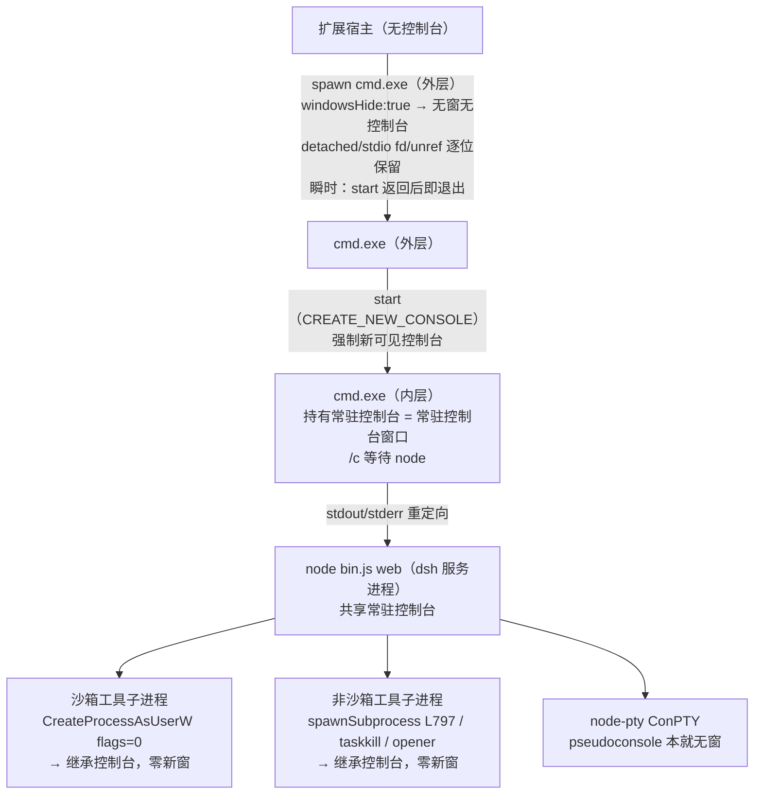

# 0.1.6 真机缺陷根因分析与解决方案

> 版本 v2.21（**评审载体迁移注（架构师 r3 设计评审回环，2026-09-01；仅本文档头新增本注一行，正文零改动）**：0.1.14 双需求设计已迁移至 docs/0.1.14设计方案-通道选择与token适配.md，本文档回归缺陷修复流水定位）
> 版本 v2.20（**QA 设计检查 r1 回环修订轮（架构师；审计 `.dsh/tmp/audits/qa_design_0114_r1.json` = 8 深查 5 PASS / 2 FAIL / 4 WARN / 7 NOTE，blocked=true；本轮仅改设计文档与证据汇编，零 src/、零探针执行、零 git 写，编译/回归基线 0.1.13 不触碰；v2.18 及以前内容零改动，v2.19 增量段定点点位修订）**：**FAIL-1 闭环 = authProxy 契约补 Origin 重写**（源码复核定案 trust 栅栏精确语义——`api-request-trust.ts` L99-103 Host 栅栏每请求恒适用、L106 `sec-fetch-site:cross-site` 拒、L107-117 Origin 栅栏（**缺失放行** L112 / 存在须与 Host authority 经 WHATWG 归一化**精确相等** L114 / `null` opaque origin 拒 L116-117）+ `rpc-host.ts` L95-98 `requestRejection` 先 fence（→403）后 cookie（→401）+ `gateway/index.ts` L211-228 WS upgrade `/api/remote.mux`（`stream-protocol.ts` L6）同栅栏——面板 SPA 的 POST/WS 恒带 `Origin: http://127.0.0.1:<proxyPort>` 而仅重写 Host → 必 403 → 壳活数据范围死；契约补「**请求带 Origin 头时重写为上游 authority（与 Host 同值）；无 Origin 不补**」（承接文档 §3.3 L126 原案，v2.19 承接时遗漏）；WS upgrade 同一规则覆盖（handshake 恒带 Origin）；PP-8-2 增 Origin-fence 断言组；E-AU-6 扩充 + E-TRUST 组入 EVIDENCE.md）；**FAIL-2 闭环 = 方案 A 抽纯模块 `src/channelSelect.ts`**（`normalizeChannel()` + `runFirstLaunchChannelSelect(deps 注入 pick/config/log)`——v2.8 F-01 纯模块落点 / ADR-27 纯 builder 同型先例；PU-9-2 断言对象改 channelSelect.ts 导入直测 → §11.3「PU-9 全组无头可判」恢复成立；extension.ts 仅消费；**方案 B（静态降级）否决**——决策记录 ADR-29 补充行；只写设计不建 src）；**WARN×4 处置**：W-1 ADR-29①「mtime 择选一并消除」降低结论口吻 = preview 伪 dist-tag 路径消除 + pickNewest 结构性歧义合法 channel 离线边仍可达、本轮显式接受残留（rlog 留痕缓解，存量修复单列）；W-2 Set-Cookie 回归**剥离**口径（承接文档 §3.3 L129——30d 凭据不落 webview 存储分区，原「双保险」论证撤）；W-3 probeTick 401 重取补边界 = **单次重取 + 独立 401 计数 ×3 → error 态指引**（不入崩溃回退/ADR-21 用户停止、无循环重取）；W-4 §二 补录双需求条目（做什么/不做什么两侧）；**NOTE×7 triage 全部采纳**（N-1 preview.json 孤儿留存忽略声明 / N-2 proxy 无鉴权诚实边界 / N-3 承接文档 §3.6 时序图引用 + 四点差异 / N-4 E-PLUGIN pid↔port 配对修正 / N-5 脱敏范围枚举补全 rlog+panelLog+消息载荷 / N-6 families.ts stable 经 npm 默认半句 / N-7 RV-15-4 两分支判据预写）；**必报项修正 = P-TOKEN-PROBE-1 探针授权升格用户待决项②**（通俗：探针要读 dsh 的凭证文件 .credentials.yaml 验证 cookie 计算路径，需用户点头；零写入零网络；与待决①同轮 vs 拆分并列）| 日期 2026-09-01 | 状态：待评审(修订后)
> 版本 v2.19（**用户直接新增需求双项设计轮（架构师；非缺陷、非回环、不占回环配额，纯追加，v2.18 及以前内容零改动，不改 src/）**：需求 verbatim ①「dsh 发布了 3 种标签 alpha/latest/next，latest 与 next 相同都是 rc 版本，alpha 比他俩都新；插件第一次启动时最好做一个界面让用户选择启动哪个标签的 dsh，用户选择后再启动 dsh」②「dsh 发布了 0.1.2-alpha.3 版本，该版本启动后会产生 token，浏览器访问时要带着 token；深度调研分析同级 deepseek-harness 源码，调研新特性与插件改造适配范围，给出设计方案」——**关键疑点定案（任务书前提证伪）**：**token 恒随启动 banner 打印、与 --no-open 无关**（alpha.3 banner 恒为 `dsh web: http://127.0.0.1:<port>/?token=<token>`，`--no-open` 仅抑制「opening the default browser」浏览器交接行）；真机所见 32B 无 token banner 经 runtime.log 证实均为 channel=latest → 0.1.1-rc.2 旧契约产物（非 alpha）；证据双源 = monorepo web-app/src/index.ts L261/L280/L283 + 已安装 dsh-web-app/lib/index.js L35/L211/L213 + 上游 e2e web-auth.e2e.ts L94（官方以 --no-open 捕获带 token banner = 编程契约）+ 用户 alpha 真机样本；**§3.13/§4.14 P-CHANNEL-SELECT**：通道模型核实（dist-tags 实测 latest=next=0.1.1-rc.2、alpha=0.1.2-alpha.3；**preview 非 dist-tag**（npm view E404）→ 既有 enum ["latest","preview"] 损坏 + 离线边 mtime 择选潜伏缺陷）→ **ADR-29** 迁移 ['latest','next','alpha'] + legacy 'preview'→'latest' 运行时归一 + `dsh.channelSelected` 首启标志；**首启 UI 推荐 = QuickPick（方案乙）**（甲 panel-webview 选择页/丙独立 webview 视图否决——「先选择通道、后启动dsh」时序要求选择发生在 DshRuntime 构造之前，唯 QuickPick 可同步完成）；**§3.14/§4.15 P-TOKEN**：browser-auth 新契约源码级调研（launchToken 32B→base64url 不持久、secret `<DSH_HOME>/.credentials.yaml` 0600、cookie `dsh-auth-<hash>` HttpOnly SameSite=Strict 30d、GET /?token= → 303 种 cookie、无 cookie → 401、/api 全拒、Host fence、重启换 token 旧 cookie 有效、无 auth-disable flag）→ **ADR-30 承接 authProxy 方案 A（修正四点）**：T 路径 banner token 捕获实证可行 + probe 改 token-303 探活（401 分流消除 probeTick false user-stop 误停）+ openInBrowser 外发带 token URL + **iframe 直连 token URL 否决**（SameSite=Strict 跨站 iframe 不带 cookie → /api 401 面板结构性不可用 → 必经 authProxy）；契约模式按 banner 特征检测（非 channel 名判）；registry 不存 token、rlog 脱敏、managed log 明文声明；**耦合判定 = 两项同轮 0.1.14 交付、P-TOKEN 先行**（channel-select 的 alpha 选项依赖 token 适配；拆分备选 0.1.14=P-TOKEN / 0.1.15=P-CHANNEL-SELECT 待用户裁决）；实施清单 #68-#79（#67 编号保留——编排者指定号段起点 #68）；判据 PP-8/PU-9 新组 + RV-15 族；证据资产 `.dsh/tmp/architect/r219-research/`（只读取证，临时产物）| 日期 2026-09-01 | 状态：待 QA 设计检查 → 通过后用户评审
> 版本 v2.18（**用户评审环节质询回应轮（架构师；用户对 ADR-27/0.1.13 方案裁决「方案我同意」并附带双质询：①「为什么一定要有这个窗口」②常驻控制台窗口内 msys 报错刷屏 `fatal error - couldn't create signal pipe, Win32 error 5`（sh.exe/bash.exe 交替 16 行、各异 pid）「必须要有这个窗口吗？还有没有更优雅的方案？评估可行性，如果当前的常驻的窗口已经是最优的方案就开工吧」；review-gate 定点增量，不占回环配额（先例 v2.4/v2.13），纯追加，v2.17 及以前内容零改动，不改 src/）**：**① §3.12 P-PIPE 按用户裁决降级**（评审环节实时回传：用户定性 = 沙箱拒绝未授权指令时的伴生噪声、非新故障、非 0.1.12 引入的功能性回归，授权升级后指令正常执行「能跑」；用户证「以前也见过」= 既有现象；**不深挖根因、不再派探针**）——仅记用户观察 + 定性 + 用户证词 + 只读探针佐证（控制台形态无关 E1/E2a/E3 + 会话历史 8/18=51、8/24=7 早于常驻控制台窗口约两周 = 首次可见非新引起）；**该报错出现在常驻控制台窗口 = 子进程（含沙箱化 sh/bash）附着常驻控制台的真机正向实证**（沙箱「共享宿主控制台」前提真机成立，补入 §4.12 第 6/7 环）；不阻塞 0.1.13；**② §4.12 窗口必要性七环节因果链**——常驻控制台窗口必须保留（三重角色：dsh 沙箱「子进程共享宿主控制台」前提的物理载体（0xC0000142 约束下控制台隔离不可用，§3.6 E-CON-2）+ ADR-21「关窗 = 用户停止」语义载体 + 沙箱内 msys 子进程活动/被拒信号唯一实时可见通道；窗口非命令显示面板——工具 I/O 走管道，窗内仅 CONOUT$ 直写（msys fatal）与（0.1.13 后）ADR-27 信息头）；**③ §4.13 四方案对比**——甲 直隐（detached+windowsHide:true 直接拉起）否决（双实证：0.1.7 P-POPUP 闪现窗口灾难 + 0.1.8 E-CON-3 windowsHide 空操作）/ 乙 先建后隐（conhost + windowsHide:true）本轮不推荐（两未知机制点：隐藏 conhost 宿主能力 + 沙箱子进程新控制台零闪窗零死亡（零闪窗＝不出现任何闪现的控制台窗口，下同），需 RV-14 真机实验；且破坏 ADR-21 关窗语义与 RV-12-5 判读）/ 丙 上游 #18（windowsHide 家族统一 + signal pipe 佐证材料增补）并行轨道、非 0.1.13 前置 / **丁 维持常驻控制台窗口 + ADR-27 信息头 = 唯一推荐**（0.1.12 真机 RV-12-1 通过、机制层面全绿，信息头落地后 msys 报错语义自解释）/ 戊 ConPTY 存档（node-pty 原生依赖，不取）；**ADR-28** = 丁案决策记录（含乙案条件重启路线）；**#66** = #18 材料增补（P-PIPE 佐证材料，无论用户何选均执行；送出 #18 仍需用户授权）；**RV-14** = 乙案条件判据（仅用户选 B 路线触发真机实验）；评审问题 2 用户已裁决：信息头文字中文；探针资产 `.dsh/tmp/architect/pipe-probe/{scan-sessions.mjs, scan-results.json}`（只读全量会话扫描，临时产物）| 日期 2026-09-01 | 状态：待用户三选一裁决（A 丁案：维持常驻控制台窗口 + 0.1.13 开工【推荐】/ B 乙案立项：RV-14 先行、新设计轮 / C 丙案：#18 送出 + 扩展侧维持丁案；C 与 A/B 可并行）
> 版本 v2.17（**用户直接新增需求 P-CONSOLE-INFO 设计轮（架构师；非缺陷、非回环、不占回环配额，纯追加，v2.16 及以前内容零改动，不改 src/）**：用户诉求 2026-09-01——常驻 dsh 控制台窗「没有任何信息，跟病毒窗口似的」易被误关（dsh 全部 stdout/stderr 按 ADR-9 F-PORT 重定向至 per-launch log，窗体仅 title 一行 + 黑屏，窗口身份/用途/关闭后果/恢复方式四要素全部不可见；误关 = 触发 ADR-21「关窗 = 用户停止」语义 → 服务静默中断）；**ADR-27 = 常驻控制台窗口静态信息头**：conhost 启动分支标记包裹内、生产载荷前叠加 9 行裸 `echo` 信息头 + `echo.` 空行（上屏不落 log——F-PORT/parseSelfVersion/取证链数据源纯净）+ `echoSafe` 中和 `[&|<>^"%!]`→`?`（括号豁免，探针 ⑤-a 顶层存活实证）+ 零新增双引号（cmd /c 引号配对形状不变）；**零机制侵入**：marker 家族（MARKER_WRAP_RE/peelLaunchMarkers/conhostInnerCmd）/fast-fail（ADR-23）/预算/关窗语义/direct/custom 边界全部零改动，纯 builder（`consoleInfoHeader`/`withConsoleInfoHeader`）单点叠加于唯一载荷消费点（src/dshProcess.ts L451）；候选对比：**B PowerShell tee 否决**（PS 5.1 Tee-Object 默认 UTF-16LE 破坏 utf8 log 解析 + exit code 链断裂破坏 arm-4/4b marker 分类 + 引号转义地狱）、**C 取消重定向否决**（毁 ADR-9 F-PORT 数据源）、**D 标题增强本轮否决**（破坏 conhostInnerCmd `title <TITLE> && ` 前缀匹配 + 一行标题承载不了四要素）、**E 链尾 pause 否决**（破坏 ADR-23 外层共存亡快信号物理载体——失败信号退化为 60s 预算超时）；预验实证 = 编译产物补丁 dry-run 12 FAIL（6 直接载荷形状断言 + 6 聚合检查，全部预期内、零机制层面 FAIL；restore 后基线复核 270 PASS/0 FAIL/9 SKIP）+ 行为探针 11/11 PASS（链 exit 0/marker 三件套语义不变/主 log 纯净/文本完整/括号存活/长度 1298<8191）· 实施清单 #61-65（含剧本 §0.10 registry 路径笔误勘正项【架构师】、本轮不执行）· 判据 PP-7 组 + RV-13 族 | 日期 2026-09-01 | 状态：待评审
> 版本 v2.16（**R3 定案修订轮（架构师；用户裁决授权实验确定启动分支后，本切换 = RV-9-5 预案内动作非新回环；纯追加 + §3.10/§4.10 定点点位更新，v2.15 及以前内容除定点点位外零改动，不改 src/）**：R3 实验链补全（§3.10.5）——用户实验①集成终端裸 npx 链**存活**（npx 链 + VSCode 环境本身健康）、实验②B2 conhost 直启形态 **ALIVE**（用户目视窗存活 30s 与假载荷退出一致，marker 三件齐 node-exit-0 主 log 0B）、编排者补充排除 ELECTRON_RUN_AS_NODE 注入复现链照常存活 + npx 参数/双 shim/dsh bin 处理逐项排除；**marker 语义注记：node-exit-0 = 链正常走完的记录而非死亡信号——B2 的 marker 形态与 R3 失败时完全相同，R3 死亡本质 = start 形态下 npx 段 ~0.4s 静默 exit 0 使链提前走完 → 窗关闭**；定性修正 = 「因子 B 未解」→「**杀手以 start-launch 形态链自身为键**（start 创建控制台经 DefTerm 委托中转层 / start 解析层 × exthost 上下文交互），C2 升位首选解释、C1 被实验②否定；死因不定案声明保留——**我们绕开了它，没有解开它**」）· **ADR-26 = conhost 策略切换定案**：`START_LAUNCH_STRATEGY` 构建期常量 'start' → 'conhost'（src/dshProcess.ts 单点，§4.8.5 既有设计、代码路径已实现——切换动作 = 一个常量 + 配套断言基线）；fast-fail 挂接核对结论 = 挂接点在 launchMode 层（L524 `mode === 'start'`），conhost 启动分支天然同构挂接（E5/B2 共存亡实证）、**无实施缺口**；预算同档（startBudgetMsFor 按 mode 取值）；marker wrap 照旧（唯一载荷消费点 L428）；PP-3-1 断言基线随切（start-wait 形态断言转回切轨、conhost 形态升生产基线）；ADR-25 观测增强（#54-56）与本轮切换同包交付 0.1.12 · 实施清单 #58-60 · 判据 RV-12-5（conhost 窗形态目视 = C2 判定器）+ 剧本 §0.10 v1.5 | 日期 2026-09-01 | 状态：待评审
> 版本 v2.15（**0.1.11 真机 R3 失败回环（用户裁决 2026-09-01 授权新一轮 A1 周期，原末次配额 retry=2/≤2 已由 R2 轮用尽、本轮额度为用户裁决重置）：P-RESIDENT-R3 双因子定性 + ADR-25 端口纪律显式化（纯追加，v2.14 及以前内容零改动）**：R3 = 0.1.11 npx 常驻控制台窗口（=给 dsh 开的那个独立可见控制台窗口，关掉它 dsh 就停）真机第三次闪退；编排者 triage 双因子假设（因子 A「start 载荷固定传 --port 3080 与用户 Harness GUI 端口冲突 → EADDRINUSE 必死」+ 因子 B「窗口上下文 npx 层异常早死」）→ 架构师本轮以真机 runtime.log 行级引文 + per-launch log/marker 实物 + src/ 逐行复核裁定：**因子 A 的机制表述被 R3 自身日志证伪**——ADR-1 预检已正确触发（`launchManaged: port 3080 not bindable; falling back to random (ADR-1)` → 有效端口 = 0，三次尝试载荷全为 `--port 0`，direct 落地 13039 即 `--port 0` 的内核分配值），triage 误读源 = rlog `start: window …(port=3080…)` 行记录的是**配置端口**（src/runtime.ts L249）而非载荷有效端口（L345-361 usePort 单一事实来源透传；v2.10 F-01 既有定案「start/direct 同用 launchManaged 的 usePort、无不对称」同向）；**R3 唯一观测杀手 = 因子 B（未解：389/694ms 零输出早死、marker=node-exit-0、等价命令 agent 上下文存活）**；端口维度经复核仍存在两个真实相邻缺陷 + 一个残余风险：①观测缺陷（配置端口与有效端口在 trace 上不可分——R3 triage 踩坑实证，修复 = ADR-25 载荷端口留痕）；②附带缺陷（dshResolver.runBounded 把 resolver 子进程输出 appendToLog 进 per-launch log——R3 的 11B 假线索 `0.1.1-rc.2` 实物复核确认；且 parseSelfVersion 首行裸版本 token 会把 npm view 输出误读为 dsh 自报版本——版本 UI 正确性缺陷源）；③残余风险（verify→use TOCTOU，R3 实测预检→spawn 间隔 ~6.0s，声明 + Route B 条件升级预案）；**ADR-25 = 行为保持型显式化**：resolveLaunchPort 具名单点（来源枚举 configured/fallback-random/retry-degraded + rlog 留痕，行为逐位不变）+ 载荷端口 trace 双锚点 + resolver 输出独立同批伴生文件 `<log>.resolver`（rotate 联动）+ Route B（start 恒 `--port 0`）取舍记录并否决（保 dsh.port 默认路径契约）+ PP-6 判据固化（单一事实来源不变量/真实占用回落/重试不复用被占端口/direct 逐位回归）；direct 直启（=不开独立窗口、在后台直接把 dsh 跑起来的老方式）兜底顺序语义与 custom-command 边界零触碰；实施清单 #54-57 + 判据 PP-6 + RV-12 + 剧本 §0.10（0.1.12 复测：通过 = 常驻控制台窗口存活 ≥5min 且注册表端口 = 内核分配随机端口（3080 被占 = 天然回落构造）；若仍闪退 → marker 三件套 + 端口留痕 = 下一轮根因输入——诚实声明：端口范围增量改善取证与判读，**不是**窗口存活的必要/充分条件，窗口存活判定 = 因子 B 复测）| 日期 2026-09-01 | 状态：待评审
> 版本 v2.14（**QA 设计审计表述级定点勘正（F-01 WARN「双命中」→「正则单命中」三处 + N-01/N-03 注记；架构师修订轮，不占回环配额、零机制变更、零 ADR 翻转、不改 src/，v2.13 内容仅下列定点点位改动、更早版本零改动）**：F-01 三处「双命中」勘正为「正则单命中」——looksLikeDsh 对 npx 树 holder：`@deepseek-ai/dsh` 为正斜杠字面子串、对反斜杠路径（文档自引 npx 树命令行形态与 E4 dsh.cmd shim 原文同形）不命中，`--profile web` 亦不命中，OR 组合下正则单命中即充分、仍 true——npx 启动分支身份前提成立、结论不变（direct 启动分支真机 adopt 链路 0.1.7+ 已实证同形态）；落点 = 文档头版本行 + §4.9.8-2-③ + 调度信号 v2.13 行。N-01 = RV-11-1 分支 N2 判读补「主 log 无 npx 自身错误输出」核对步（registry 不可达/缓存 miss 判别物证；npx stderr 已入 log）。N-03 = 「0.1.10 可用态」用语加注（以工作树实际基线（package.json 0.1.9）为准，#53 bump 时定版）。评审状态 v2.14 行；N-02 非阻塞留待下轮）叠于 v2.13（**用户评审质询定点增量（npx 方案实证回答 §4.9.8；架构师修订轮，不占回环配额、零机制翻转、零 ADR 翻转、不改 src/，v2.12 及以前内容零改动）**：用户质询「定位半天解决了什么/改回 0.1.6 用 npx 启动不就完了/npx 启动有什么技术阻塞点、影响什么功能」——事实校准 = 0.1.6 真机的常驻控制台窗口是 .cmd shim 链的**意外副产物**（P-VIS 缺陷本体，恰是用户 0.1.6 时代的主投诉；git e8fb8db 原文 + §3.1.2 取证重建）且与 P-STALEWIN/P-PIDREC 两 P0 捆绑，「原样退回 0.1.6」不可取；但「**受控常驻控制台窗口（start-wait）+ npx 载荷**」组合**从未试过**且衔接点已在现码（`src/dshProcess.ts` L549-556 回退链 npx 载荷同形、L313 单点消费）→ **P-PIDREC 历史阻塞在现架构下结构性消除**（dsh.pid=端口 holder：dshProcess.ts L407-416/L472-485 + runtime.ts L374/L780-791；身份校验 looksLikeDsh 对 npx 树 holder 正则单命中（正斜杠包名字面子串不命中反斜杠路径——OR 组合下仍 true；direct 启动分支真机 adopt 链路已实证同形态）instance.ts L440-442——§4.9.8-2 五项行号表）；0.1.11 分支重排 = **marker 取证（§4.9.1 原文不动）+ start-wait 窗内 npx 载荷分支先行**（构建期常量 START_PAYLOAD_VARIANT 单点切档 + npx 启动分支预算 60s + direct 回退恒 node-bin；WMI 启动分支条件推迟 0.1.12、A/B 实验改条件触发=仅 npx 启动分支失败时执行）——一次安装+一次观察定案载荷维度（R1/R2 六次失败从未变过的盲区；C3 命令行特征匹配变体/C4 载荷敏感变体的裁决点）；诚实代价四项（①时延未实测、量级暖 12-22s/冷 10-60s+、预算 60s；②离线可用性降为 npx 缓存决定；③**dsh 版本跟随 registry latest，可能拉到 0.1.1-rc.2 之外的新版**——用户明示取舍，钉版为声明选项；④shim `title %COMSPEC%` 改写窗标题 cosmetic——RV-7 标题判据在该分支不适用）；§4.9.8 + §5.8 + ADR-24 补充行 + 实施清单 #51-53 + 判据 PP-5 + RV-11 + §11.3 v2.13 注）叠于 v2.12（**QA 设计检查 PASS-WITH-WARN 定点修订（W-01/W-02/W-03 + N-03/N-04/N-05；零机制变更、零 ADR 翻转、不改 src/，v2.10 及以前零改动，不占回环配额）**：W-01 §4.9.1 arm 判读矩阵补 arm-4b 行（node-exit-0 = node/dsh 主动正常退出 → C4 变体——矩阵恢复「每组合唯一路径」，与 RV-10-3「node 自退」mtime 判定口径对齐）；W-02 §11.3 v2.11 注②勘正——预验探针 probe-wmi-form.cjs 实为 `powershell -Command` 形态（identity-check 先例同为 -Command），**-EncodedCommand 真机首验只能在 RV-10-4** + WMI 规格②补 PS 单引号 `''` 双写转义声明（#46 实施检查项）；W-03 全零 GUID 语义如实标注——两种解读（委托禁用 vs "Let Windows decide"）+ Win11 22H2+ 解析为 WT 系**推断/外部检索非本机查证**（本机仅证实全零值本身），E-RES2-3/C2/§3.9.5 三处口径一致、判定器 = 窗形态目视不依赖该断言；N-03 B2 触发精确为「仅当 A 存活且 B 死亡」；N-04 RV-10-4 笔误 `Win_Process`→`Win32_Process`（同族 grep 仅此一处）+ 关窗/外杀同型签名的用户知情判读注（RV-10-3）；N-05 §3.9.3 补 env×新控制台交互承接方点名（诊断=C2/实验 D、修复=WMI 启动分支））叠于 v2.11 增量（**A1 测试失败回环末次（retry=2/≤2）：0.1.9.1 包复验再失败（R2）的根因重新收敛 + 决定性实验设计 + 假设分支修复设计（ADR-24）**：R2 复核 = P-2 修复成立（快信号两次秒级 fast-fail code=0、elapsed 1576ms/1962ms，总耗时 ~21s）+ P-1 未解（start-wait 内层链 ~1.5-2.0s 静默早死，R1 同签名，0B 日志——0B@1.5s 读法勘正：banner 本要 ~11-14s 才出，死亡唯一证据 = 外层 exit 时刻）；E-RES-7 读法勘正——DefTerm 注册表全零 GUID 语义两解读（委托禁用 vs "Let Windows decide"——后者系 web 检索推断非本机查证，v2.12 W-03 口径），委托候选修正存活；分叉收窄定案为「**父进程上下文 × 新控制台创建**」交互（direct 同 env 成功排除 env 面、E2+本轮预验排除链形状面）；候选根因排序 C1-C5（job object / DefTerm 委托×exthost / EDR 按父映像为键 / node 自退 / start 层残余）+ 用户 ≤10min 决定性实验 A/B/C（marker 分型 arm-1..4 + 窗形态目视）+ 0.1.11 推荐形态 = marker instrumentation 永久化 + A/B 实验先行确定启动分支（A 存活 → **WMI Win32_Process.Create escape arm** 主案，对 C1/C2/C3 同族鲁棒；conhost 启动分支 C1 假设下无效、B2 廉价判定）+ 重试耗尽 user_escalation 三选项决策树）叠于 v2.10 增量（**QA 设计检查 FAIL 定点修订（F-01 RV-9-3 判据重设计 + W-01/W-02/W-03；零机制变更、零 ADR 翻转，v2.8 及以前零改动）**）叠于 v2.9 增量（**0.1.9 真机验证回环：新缺陷 P-RESIDENT——ADR-21 start-launch 真机 4/4 失败（常驻控制台窗口未成功建立 + 启动退化 ~190s）的根因分析与修复设计（ADR-23）**：P-1 常驻控制台窗口闪逝 + P-2 启动退化 190s 两症状同链——架构师两轮 7 项受控复现实验（E0-E6，见 §3.8/§4.8.4）证明 argv 引号结构/redirect/父进程控制台状态/真 dsh 本体全部无恙，破坏点定性为「内层链静默早退且全链零观测信号」的**失败信号模型设计缺陷**（外层 cmd exit 0 ≠ 内层存活，`start` 瞬时返回使 exit≠0 检测只覆盖 start 层）；修复 = ①`start /wait` 持有语义 + 就绪前 exit-即败快信号 + start 模式独立就绪预算 30s（最坏 ~190s → ≤~80s，正常早死场景 ~20-30s）②常驻控制台窗口双轨（start 修正版主案 + `conhost.exe --` 直启备选，E5 实验支撑）③direct 回退保持 0.1.8 安全网）| 日期 2026-08-31 | 状态：待用户评审（**QA 设计检查 PASS-WITH-WARN：25 检查 17 PASS / 0 FAIL / 3 WARN / 5 NOTE，审计 `.dsh/tmp/audits/qa_design_resident_v211.json`**；3 WARN（W-01/W-02/W-03）+ NOTE N-03/N-04/N-05 已随本轮架构师定点修订（v2.12）全部落地，N-01/N-02 无需修订；通过 → 进开发实施清单 #44-50；目标版本 0.1.11；**末次回环（retry=2/≤2 已用尽）——0.1.11 真机再失败 → §4.9.5 user_escalation，不再自动回环**）
> 版本 v2.8（**QA 设计审计 WARN 定点修订（P-VERSIONUI / ADR-22 v2.7 增量；零机制变更、零 ADR 翻转，v2.7 其余内容不动）**：**F-01** `buildDetailsHtml` 落点移至纯模块 `webviewHtml.ts`（与 `buildPanelHtml` 同文件导出；`webviewDetails.ts` 仅承载 vscode 耦合的 `DshDetailsProvider`——sim 无头可导入性修复，PU-4/PU-6/PU-8 直测可执行）+ **F-02** stopped 态详情卡文案按停止来源二分（ADR-21 start 模式关窗 = 用户停止 →「已按您的操作停止（常驻控制台窗已关闭即停止 dsh）」；disconnect 断开（含 dsh.stop 主动断开，P0-D 断开不杀进程语义零改动）→「已断开（dsh 进程未停止或异常退出）」；判别 = 降级快照 `launchMode`，phase 枚举不变、`DshLaunchInfo` 仍 15 字段；新增 PU-8）+ N-01 §4.7.6 补 onDidDispose 注记 + N-02 #31 配置项计数更正 6→8）| 日期 2026-08-31 | 状态：待用户评审（QA 设计检查 = PASS-WITH-WARN：33 检查 28 PASS / 0 FAIL / 2 WARN / 3 NOTE，审计 `.dsh/tmp/audits/qa_design_versionui_v27.json`；2 WARN + NOTE N-01/N-02 随本轮定点修订落地，N-03 无需修订）
> 版本 v2.7（**0.1.9 范围增量：新增需求 P-VERSIONUI——dsh 版本/启动 bin 目录可见性与详情视图（ADR-22）**：用户 2026-08-31 直接新增需求（状态栏/面板展示 dsh 版本 + 查看 bin 目录 + 详情面板形态）→ §3.7 立项 + §4.7 三层 UI 设计（状态栏版本段 / 面板工具栏 ⓘ / 同侧边栏第二 webview 视图 `dsh.details`，`visibility: collapsed` 懒渲染；`DshLaunchInfo` 数据模型经既有 emit state 通道下发，零新 IPC；版本双源「自报为主 + resolver 辅注」交叉核对；external 接管降级卡；不做 modal 弹窗——取舍声明）| 日期 2026-08-31 | 状态：待 QA 设计检查（本轮增量 = §二 范围补录 / §3.7 / §4.7 / §8.1 v2.7 契约块 / ADR-22 / 实施清单 #28-37 / 判据 PU-1…7 + RV-8a…e；**其余 v2.6 已通过内容不动——纯追加**；与 ADR-21 同属 0.1.9、相互独立可先行合入）
> 版本 v2.6（**真机验证回环：新缺陷 P-CONSOLE——0.1.8 `consoleVisible=true` 机制失效**（`windowsHide:false` 为空操作：Node spawn 无法表达 CREATE_NEW_CONSOLE，dsh 继承扩展宿主的无窗口控制台，编排者实测 `[Console]::WindowHandle=0x0`），subagent 执行指令时沙箱内黑色闪现窗口的问题照旧；**用户裁决（2026-08-31）**：根因修复属 dsh 上游（#18 待授权），执行扩展侧常驻窗口方案 → **ADR-21 start-launch**：经 `cmd.exe /c start` 给 dsh 一个自持的常驻可见控制台，注册表 `dsh.pid` = 端口 holder pid，**关窗 = 用户停止语义**）| 日期 2026-08-31 | 状态：待 QA 设计检查（用户裁决回环追加；本轮增量 = §3.6 / §4.6 / §5.5 / ADR-21 / 实施清单 #20-27 / 判据 PP-2 组 + RV-7/RW-7；**其余 v2.5 已通过内容不动——纯追加**；目标版本 0.1.9）
> 版本 v2.5（**实施阶段文档同步微修订**：ADR-20 默认值落用户评审裁决——`dsh.consoleVisible` 默认 **true**（2026-08-29：开箱即消除运行期工具调用弹窗，代价为常驻一个 dsh 控制台窗，dsh 上游统一 windowsHide 修复落地后可切回 false 达成终态）+ §二 范围分析补 P-POPUP 条目（QA 设计审计 WARN-1）+ 0.1.8 开发状态标注（tsc 0 错误、sim 126 PASS / 0 FAIL / 7 SKIP，详见 `docs/开发报告.md` §15）；**设计内容/探针/代码/契约零改动，仅文档-实现一致性同步**）| 日期 2026-08-30 | 状态：**0.1.8 开发侧实施完成**（实施清单 #10-12/#16-17；#13 探针定稿、#15/#19 打包发布与真机验收、#18 上游材料包待后续环节）；待真机 RW/RI/RV-4/RV-5 验证 + dsh 上游立项反馈送出（#18，需用户授权）
> 版本 v2.4（**用户评审环节附加新问题 P-POPUP**：子代理执行期间频繁弹出 node/pwsh 终端窗口——§4.1.9 预判的运行期孙进程控制台风险 **RV-1b 真机复现**，ADR-17 已知限制升级必修；根因 + 方案对比（A 上游根治 / B 参数化兜底 / C 热改否决）交用户评审裁决）| 日期 2026-08-29 | 状态：用户评审环节回环追加（**设计评审回环 retry=1/≤2**；本轮增量 = §3.5 / §4.5 / ADR-20 / 实施清单 #16-19 / 判据 PP-1 / RV-4/5/6；**其余 v2.3 已通过内容不动——§3.4/§4.4/§5.4/PI/RI 判据零改动**）
> 版本 v2.3（**0.1.7 真机验证回环**：P-VIS 修复真机确认（RV-1 目视通过）+ 新缺陷 **P-IDENT** 根因分析与解决方案——T1b 身份核验误清活窗 → `windows[]` 恒空，多重误杀风险）| 日期 2026-08-29 | 状态：待 QA 设计检查（**A1 测试失败回环 retry=1/≤2**：0.1.7 真机验证暴露 ADR-15 修复自身缺陷 → 架构师根因+方案；本轮增量 = §3.4 / §4.4 / §5.4 / ADR-18/19 / 实施清单 #10-15 / 判据 PI-/RI-/R-P1/P2；其余 v2.2 已通过内容不动）
> 版本 v2.2（QA 设计检查 FAIL 修订 + 用户评审意见修订 + **QA 代码检查口径裁决（INFO-2/INFO-3，仅文档同步）**）| 日期 2026-08-28 | 状态：用户评审（ADR-12 否决）已修订 → 待用户复审 + QA 设计检查复审（retry=1/≤3，本轮为**用户评审意见修订，不占 QA 回环配额**）（A1 链：测试失败 → 架构师根因+方案）
> v2 修订记录（闭合 QA 设计检查 FAIL，已通过的其余 13 项不动）：
> - **F-01（BLOCKER）「E5 过度外推」**：E5 限定 boot 路径（§3.1.4）+ §4.1.1/§4.1.3 声明边界修正 + 新增 §4.1.9「运行期孙进程控制台风险」（dsh 本体行为边界）+ 新增真机判据 **RV-1b**（§11.2，发布前置）+ **ADR-17** 发布前显式处置决定；
> - **F-02（MAJOR）「升级迁移边界缺失」**：§4.3 新增 **§4.3.1 升级迁移边界**（遗留 managed 残局的判定 + 处置决策）+ 实施清单 #9「手动结束残留 dsh-node」标注**强制前置步骤（升级场景）**；
> - **minor**：F-03（`npm view` 改 async spawn，§4.1.2/§7/§10）、F-04（npm-cli 备选链纠正为标准 node 树，§4.1.2/§10 + probe R2 同步）、F-05（`startedAt` 保留条件加 `dshPid!==null` 守卫，§4.2.4/§10）、F-06（§4.1.2 mermaid 字面量 `\n` 改 `<br/>`）。
> **v2.1 用户评审意见修订记录（2026-08-28，不占 QA 回环配额；仅重构 §4.1 bin 解析方案，其余已过 QA / 无异议小节不动）**：
> - **用户强烈否决 v2 的 ADR-12「扩展自管 `dataDir()/dsh-runtime/<channel>/` 第二份安装」**：「明明我已经通过 npx 安装了一份 dsh，你还要再装一遍？浪费本地空间，尤其是第一次启动花的时间非常长。为什么不能复用 npx 已安装的 dsh？」
> - **ADR-12 重写 = npx 缓存复用优先（单一事实来源 = npx 缓存，零重复安装 / 零额外磁盘 / 首装 = 0.1.6 同行为）**：定位 = 内容扫描 `%LOCALAPPDATA%\npm-cache\_npx\*\node_modules\@deepseek-ai\dsh\package.json`（glob 通配 hash，**不计算 / 不硬编码 hash**）→ 取 `lib/bin.js`；多候选消歧（在线 `npm view` 版本比对 / 离线 mtime + rlog 声明）；新鲜度 = best-effort `npm view` + 24h meta 窗口（**meta.json 移到数据目录 `dsh-runtime-meta/<channel>.json`，仅记 lastCheckAt/knownVersion，不装包**）；版本过期 → **原地刷新** `node <npmCli> install --prefix <_npx 命中目录> --ignore-scripts --no-audit --no-fund`（**= npx 内部对 _npx 目录的同一 reify 操作**，新增证据 E9 源码级核实）；刷新失败 → 回退跑一次完整 npx 链（0.1.6 行为）后继续直连；首装 / 缓存清空 → 跑一次 npx 链建立（**与 0.1.6 首装完全同行为同时长，非新增成本**）；扫描失败 / 目录损坏 / 无 node → 0.1.6 `cmd+npx` 原样路径（安全网）。
> - **联动修订**：ADR-11 对照表**方案 E 翻转**（原「双真源 / 布局耦合 / 首装退化」否决 → 采纳，随自管目录取消而失效的理由逐条标注）；`ensureDshRuntime` → **`resolveDshBin(channel)`**（扫描 → 消歧 → 新鲜度 → 原地刷新 → 回退）；§11.1 **PV-1** binJs 断言改「位于 `_npx\*`（mock 布局）」、**PV-4** 去硬编码扫描保留且更严（无 hash 字面量 / 无 hash 计算 / 无绝对路径）、**新增 PV-5 多候选消歧断言 + PV-6 原地刷新命令参数断言**；§7 性能表（首装 = 0.1.6 相同 / 稳态 = 扫描+直连更快 / **新增磁盘零重复安装行**）；§5 **新增 R6 探针**（原地刷新：`npm install --prefix <_npx 命中目录>` 后 npx 仍正常、版本更新、**无第二目录产生**）+ 「`_npx` 布局依赖」风险节（回退链保底，最坏 = 0.1.6 现状）；ADR-13 适配新 meta 位置与原地刷新语义。
> - **新增证据 E9**（§3.1.4 证据链 / §5.1）：npx `_npx\<hash>` = npm prefix 安装布局（本机文件实证：根 `package.json` + `package-lock.json` + `node_modules`；npm 10.1.0 `libnpmexec` 源码 `reify` 实证；hash 派生 = `sha512(sorted specs)[:16]`，本机 3 个 dsh 目录逐一吻合）——「`npm install --prefix <_npx 命中目录>` 正是 npx 内部对 _npx 目录做的同一操作」的源码 / 本机双重证据。
> **v2.2 QA 代码检查口径裁决记录（2026-08-28，0.1.7 QA 代码检查 PASS 后两项非阻塞 INFO 确认；裁决 = 均接受实现口径，仅本文档同步、零代码改动、不占回环配额）**：
> - **INFO-2（§4.3.1 条件 2）**：实现为 `(pid === null || !isAlive(pid))`，比字面「注册 pid 死」宽（null 视同已死）——**裁决：接受（safe-side）**：null pid 的 managed-own 记录本就是不指向任何进程的残缺簿记、无「存活」可言（`isAlive` 参数为非空 `number`，null 须显式短路）；收窄反而使该类残局落入 external adopt、重演 P-STALEWIN；风险点无新增（条件 1/3/4 + 三重检查 + CIM 不可用不入迁移 + F-09 窄边均照常覆盖）。
> - **INFO-3（ADR-13）**：`updateRuntime` force 在「版本一致且候选健康」时返回 steady 跳过 no-op reify，与「强制原地刷新」字面微差——**裁决：接受（幂等语义）**：force = 确保 latest 的幂等刷新（强制 view 绕过 24h meta 窗口；已最新且健康则 no-op + rlog，不重复安装、符合零重复安装目标）；「强制」语义保留在绕过新鲜度缓存 + 过期/损坏即刷新 + 失败回退 npx 链。
> **v2.7 修订记录（2026-08-31，用户新增需求 P-VERSIONUI；架构师设计轮；纯追加，v2.6 已通过内容零改动）**：
> - **需求**：「vscode 的插件在面板或者右下角的状态区展示启动的 dsh 版本，我要明确知道 dsh 的版本信息，同时能够查看 dsh 的启动 bin 目录是哪个，设计一下 UI，我希望 dsh 的信息最好是有 dsh 详情面板或者弹出框来展示」——非缺陷，可观测性功能增强；与 ADR-21 start-launch 同属 0.1.9 范围、相互独立（本需求不触碰 spawn/生命周期/仲裁环节）。
> - **机制定案**（§3.7 / §4.7 / ADR-22）：三层 UI = 状态栏版本段（`$(circle-filled) DSH <port> · v<version>`，点击 → `dsh.showDetails`）+ 面板工具栏 ⓘ 按钮（webviewHtml `#chrome` 增量）+ **同侧边栏第二 webview 视图 `dsh.details`（`visibility: "collapsed"`——首次展开前不 resolve、不 build HTML，workbench InitialVisibility 机制）**；数据模型 `DshLaunchInfo`（15 字段，新模块 `launchInfo.ts` 纯 Node）组装点 = runtime 既有 state 落点，经既有 `emit('state')` + webview postMessage 下发，**零新 IPC / 零新进程 / 零新探针**；版本双源（dsh 自报日志首行 = 主，best-effort——E-VER-1 实证间歇出现；resolver bin 目录 package.json = 辅）+ 五档交叉核对 + external 降级卡 + 日志路径复制/在文件管理器中显示；操作区复用 `dsh.updateRuntime`/`dsh.restart`；**modal 真弹窗不做**（稳定 API 无 modal webview——取舍声明 §4.7.3c）。
> - **判据**：PU-1…PU-7（无头，全部纯函数直测、无 netstat/CIM/spawn 依赖）+ RV-8a…e（真机，人工观察 + 既有探针复用，无新探针）；实施清单 #28-37。
> - **诚实边界**：re-adopt/接管场景**不回溯匹配历史日志**推断版本（无法证明 log 与存活 dsh 的对应关系，臆造风险）——显示 null 降级 + 引导「重启后可见」；版本/bin 信息不写注册表新字段（schema 收敛，bin 信息按「本会话解析过才显示」边界）。
> **v2.9 修订记录（2026-08-31，0.1.9 真机验证回环 P-RESIDENT；架构师根因+方案轮，A1 测试失败回环 retry=0/≤2；纯追加，v2.8 及以前内容零改动）**：
> - **用户真机报告（0.1.9 verbatim）**：「0.1.9版本dsh的可见terminal窗体没有常驻，只有vscode启动时闪现了一个windows cmd窗体，之后就没有常驻的命令窗体了；再一个，这个版本启动dsh耗时比0.1.8还长，明显偏离设计目标」——两症状（P-1 常驻控制台窗口闪逝 / P-2 启动退化）合并立项 **P-RESIDENT**（§3.8），同根因链：ADR-21 start-launch 在真机环境失败且失败零信号。
> - **根因取证（§3.8 事实链 + §4.8.4 实验矩阵）**：两轮共 7 项受控复现实验（E0/E0b/E2b 零窗 + E1/E2/E4/E5/E6 可见窗 5 次窗闪，全部脚本与原始输出归档 `.dsh/tmp/architect/p19-repro/`）——argv 引号结构逐层推演 + 上机双重验证**无恙**（E2 生产形状全通：node 启动、banner/redirect 正确）；真 dsh bin.js 在链路内可启动（E3，沙箱 EPERM 为环境限制非链路缺陷）；无控制台父进程（E4 模拟扩展宿主）照常工作；事件日志/WER 无 node 崩溃记录；dsh 源码 grep 零 console API（AllocConsole 类排除）。**定性**：真机破坏点 = 内层链（内层 cmd → node → dsh）静默早退且**无任何可观测信号**（0 字节日志 + 外层 exit 0 + 无崩溃记录），本机沙箱 7 项实验均无法复现——幸存假设为扩展宿主启动时点环境特异性（候选子假设 = Windows Terminal 默认终端委托竞态，无法本机沙箱验证，诚实记录）。**P-2 判定 = 设计缺陷**（非实现缺陷）：§4.6.3-2 的失败信号模型不完备——「外层 cmd exit 0」只证明 `start` 指令成功、不蕴含内层存活；实现忠实于设计。
> - **机制定案（§4.8 / ADR-23）**：①**快信号**：start 模式 argv 增 `/wait`——外层 cmd 从瞬时 wrapper 变为内层链存活期持有者（E6c 实验证明持有语义成立；E6a 证明 exit code **不**经 /wait 传导）→ 快信号语义由「exit≠0」修正为「**就绪前外层 exit（任意 code）即失败**」（复用既有 exit 监听，零新机制）；②**就绪预算分档**：start 模式独立 `STARTUP_TIMEOUT_MS_START=30s`（新具名常量），direct 保持 90s（ADR-9 不动）——挂死场景兜底；③**常驻控制台窗口双轨**：主案 = start 修正版（真机 RV-9 复验）；备选 = `conhost.exe -- cmd /d /c <payload>` 直启（E5 实验支撑：conhost 与内层共存亡 → 快信号天然免费、链更短、无 start 解析层），strategy 为构建期常量单点切换；④direct 回退语义/`launchMode`/关窗=用户停止/`DshLaunchInfo`/详情卡**零改动**（§4.8.5 爆炸半径表）。**最坏总时长 2×90+3+14≈197s → 30+1+30+2+14≈77s；早死场景 ≈ 20-30s**。
> - **勘误（§4.6.10 勘误注，不改原文）**：五维对比「性能」格「增量 ≈ +0.1-0.3s」「故障路径反而更快」两句在真机故障路径被实测证伪（+180s）；推荐排序 ③>② 的前提「start-launch 可靠工作」在 0.1.9 真机被局部证伪，修复后 RV-9 复验。
> - **修订自检**：① 判据可执行——PP-3 组全部 mock 注入扩展点无头直测（exit-即败时序/30s 预算/argv 断言），RV-9 族含用户/测试专家可判定的注入式失败场景（DSH_NODE_EXE seam 指向坏路径）；② 纯追加——v2.8 及以前内容零改动，勘误以「追加注记」形态落 §4.6.10 末尾；③ 编号连续——§3.8（§3.7 后）/§4.8（§4.7 后）/§5.6（§5.5 后）/ADR-23（ADR-22 后）/#38-43（#37 后）/PP-3（PP-2 后）/RV-9（RV-8 后）；④ 本轮**只出设计不改 src/**，复现证据全部落 `.dsh/tmp/architect/`。
> **v2.12 修订记录（2026-08-31，QA 设计检查 WARN 定点修订 W-01/W-02/W-03 + N-03/N-04/N-05；架构师修订轮，QA PASS-WITH-WARN 后定点修订——**不占回环配额**；零机制变更、零 ADR 翻转、不改 src/，v2.10 及以前内容零改动，v2.11 内容仅下列定点点位改动）**：
> - **审计依据**：`.dsh/tmp/audits/qa_design_resident_v211.json`（25 检查 = 17 PASS / **0 FAIL** / 3 WARN / 5 NOTE，PASS-WITH-WARN，blocked=false）——marker instrumentation 设计/实验 A/B/C 判定矩阵/WMI 启动分支规格①-⑥/ADR-24/末次回环决策树/纯追加纪律全部通过；3 WARN 为文档精度问题（arm 矩阵组合覆盖缺口 / 预验形态声明失真 / 全零 GUID 断言未标注推断性质），非机制缺陷；N-01（git 基线局限）、N-02（预验定量值无落盘 JSON）无需修订。
> - **W-01（WARN，必修）：§4.9.1 判读矩阵补 node-exit-0 组合行（arm-4b）**——原矩阵四行仅收 `.node-exit-nonzero`（arm-4），「node-start 在场 + node-exit 落盘且值 = node-exit-0」（node/dsh 主动正常退出：真实控制台下端口/环境自判失败但走正常 exit 0 路径）无 arm 归属，与 PP-4-1「errorlevel 两值均写」断言及 RV-10-3「node 自退」分支（按 mtime 间隔判定、不限定 exit 值）覆盖范围不一致。补 **arm-4b** 行（④b + `.node-exit-0` → C4 变体，与 ④ 同属 C4 家族、nonzero/0 分类由 marker 内容区分、下轮补采）；补行后矩阵 arm-1/arm-2/arm-3/arm-4/arm-4b 五行互斥完备（每组合唯一路径），与 RV-10-3 判定点逐条对账无矛盾（见修订自检①）；机制本体（payload 构造/三 marker 文件族）零改动。
> - **W-02（WARN，必修）：§11.3 预验形态勘正 + WMI 规格②单引号转义声明**——① §11.3 v2.11 注②原文声明 probe-wmi-form.cjs 为 `-EncodedCommand` 形态，脚本 L13 实为 `powershell -Command`（identity-check 真机先例 `src/instance.ts` L226-232 同为 -Command）——勘正如实：**预验覆盖 -Command 形态**；**规格① 的 -EncodedCommand 无沙箱预验、真机首验只能在 RV-10-4**（EPERM 发生在 spawn 层、两参数形态该层不可区分，原「spawn 层即败、未及 CIM 层」限制声明不受影响）；PP-4-3 mock 断言对象 = 规格① 形态、不受影响。② §4.9.3 WMI 规格②补 **RAW 单引号转义声明**：`<RAW>` 以 PS 单引号字符串嵌入，RAW 内单引号须 `''` 双写转义（base64 仅解决 Node→PS argv 传递层、不免除 PS 字符串内部转义；EncodedCommand 构造内实施，#46 实施检查项；当前生产 RAW 经核实无单引号——通用性声明，非当前触发项）。机制零改动（规格①-⑥ 骨架逐字未动，仅追加声明）。
> - **W-03（WARN，必修）：全零 GUID 语义如实标注（推断性质）**——E-RES2-3 原文「全零 GUID 的权威语义 = Let Windows decide」为断言式表述、来源列无查证出处，违反「不得伪装成查证事实」标注纪律。勘正为：全零 GUID 存在**两种解读**（①委托禁用 = 原 E-RES-7 读法；②"Let Windows decide" = 本设计工作假设）；**Win11 22H2+ 通常解析为 Windows Terminal 的断言基于 web 检索/公开机制推断，非本机查证、未落出处链接**（本机 HKCU 实测仅证实全零值本身）；来源列同步标注「推断性质」。**三处口径同步**：§3.9.4 C2 行机制列（两解读 + 工作假设标注）+ 判定列（窗形态目视判定器独立于语义断言）；§3.9.5 ④（目视判定器与 E-RES2-3/C2 同口径）。C2 的决定性检验 = 窗形态目视，不依赖该断言定案——精度勘正、机制与排序零改动。
> - **N-03（NOTE）：B2 触发条件精确化**——「仅当 B 死」→「**仅当 A 存活且 B 死亡（判定矩阵分支一）时执行**」：A 死 B 死（分支二）下修复分支全部暂缓、B2 无决策价值且多耗 1 次窗闪预算；判定矩阵四行后续路径唯一性不受影响（分支二不依赖 B2），本轮仅精确触发条件。
> - **N-04（NOTE）：RV-10-4 类名笔误 + 关窗判读用户知情注**——① `Win_Process` → **`Win32_Process`**（全文 grep 同族笔误仅此一处）；② RV-10-3 末尾补**用户知情判读注**：「用户关窗后链路正常终止」与「外力同杀（arm-3）」marker 签名同型（cmd-start+node-start 在场、node-exit 缺席）——纯签名不可分辨，判读须前置用户知情确认（关窗与否 + 时刻与 errorlevel=0 吻合）：确认关窗 → 链路正常终止（非缺陷复现，衔接 RW-7 关窗=用户停止语义）；否认 → arm-3 异常早死定案（C1/C2/C3 家族）。
> - **N-05（NOTE）：env×新控制台交互承接方点名**——§3.9.3 四步排除链后补承接点名注：排除链仅排除 env 作**独立变量**；「env 内容 × 新控制台创建」**交互环节**不在排除范围——诊断承接 = C2 + 实验 D（VSCODE_* 剥离，§4.9.2 可选钩子）；修复承接 = 分支一 WMI 启动分支（若 C2 成立且 env 参与：escape 后创建方 = WmiPrvSE、exthost env 不再进入新控制台链，交互环节失效；WMI 子进程 env 语义由 §4.9.3 规格①-⑥ 承载、#46 落地）。
> - **修订自检（v2.12）**：① **arm 矩阵补行后与 RV-10-3 逐条对账无矛盾**——arm-4b（node-exit-0，间隔 ≥1s）落 RV-10-3「node 自退」分支（该分支按 mtime 间隔判定、不限定 exit 值，C4 指向一致）；arm-4（nonzero）同上；arm-3（node-exit 缺席）↔ RV-10-3「外层/中转被杀」+ 关窗分支（签名同型的判读边界由 N-04 用户知情注补足）；arm-1/arm-2（cmd-start 缺/仅 cmd-start）在 RV-10-3 并入「node-start 缺席 = 链早期死亡」粗判读（指向 C1/C3），与矩阵精分型（arm-1 → C5 复活复核、arm-2 → cmd 异常记录）为粗/细两层判读、包含关系非冲突（v2.11 审计 P-17 已按此通过，本轮未触碰该层）——矩阵五行互斥完备、每组合唯一路径；② **WMI 规格①-⑥ 与 §11.3 预验声明一致（预验 = -Command 形态）**——规格① = -EncodedCommand（机制形态，PP-4-3/#46 断言对象不变）；§11.3 注②如实声明预验 = -Command、-EncodedCommand 真机首验 = RV-10-4，两层不混述（EPERM 在 spawn 层、两形态不可区分，预验限制结论共用）；规格②单引号转义声明与 EncodedCommand 构造（#46）衔接、零机制改动；③ **全零 GUID 三处口径一致**——E-RES2-3（两种解读 + 推断标注 + 目视判定器）、§3.9.4 C2 行（两解读 + 工作假设 + 判定器独立声明）、§3.9.5 ④（目视判定器 + 同口径引用）三处均为「两种解读 + 推断标注 + 目视判定器」表述；④ 机制本体零改动——marker payload 构造/三 marker 文件族/WMI 规格①-⑥ 骨架/实验矩阵骨架/user_escalation 决策树逐字未动，v2.10 及以前内容零触碰，本轮不改 src/。
> **v2.11 修订记录（2026-08-31，0.1.9.1 真机复验再失败回环 P-RESIDENT-R2；架构师根因+方案轮，A1 测试失败回环 retry=2/≤2——**末次**；纯追加，v2.10 及以前内容零改动）**：
> - **用户真机报告（0.1.9.1 verbatim）**：「只解决了启动慢的问题，常驻窗口没解决，还是闪现一下就没了」——P-2 修复验收成立（快信号按 ADR-23 设计工作：两次秒级 fast-fail + 秒级回退，21s 就绪），P-1 未解决（同签名再失败）；立项 P-RESIDENT-R2（§3.9）；末次回环约束 = 设计自带「失败也出根因」诊断力（§4.9.1 marker 分型 + §4.9.2 实验 A/B/C）+ 重试耗尽预案（§4.9.5）。
> - **取证复核（§3.9，编排者移交证据逐项复核 + 本轮新增预验）**：R2 时间轴逐项核实（18:35:17.967 start-wait → 19.647 fast-fail code=0 elapsed 1576ms → 20.677 重试 → 22.731 fast-fail elapsed 1962ms → 22.736 回退 direct → 24.858 direct → 36.346 ready pid 7984/port 55584/launchMode=direct，总 ~20.7s）；per-launch 183517/183520 = **0B**、direct 183524 = 32B banner 实测；DefTerm `HKCU:\Console\%%Startup` 全零 GUID 实测 + **语义勘正（全零 = "Let Windows decide"，显式禁用 = conhost GUID）**；本地预验 = 实验 A 形态命令串 1 次窗闪全通（外层 exit 0 @3664ms / marker 三阶段含 nonzero 分支正确分类 exit 7 / redirect 正常，资产 `.dsh/tmp/architect/r211-preval/`）。
> - **机制定案（§4.9 / ADR-24）**：① **marker 三阶段 instrumentation 永久化**（start-launch payload 前后缀；arm-1..4 判读矩阵——无 cmd-start=start 层失败 / 仅 cmd-start=cmd 异常 / 有 node-start 无 node-exit=整链外力同杀 / node-exit-nonzero=node 自退——失败也出根因）；② **修复分支实验先行**：A/B/C 用户实验判定矩阵（§4.9.2）→ 分支一（A 存活）= **WMI Win32_Process.Create escape arm**（WmiPrvSE 父链逃逸 VSCode job/上下文家族——对 C1 job/C2 委托/C3 EDR 同族鲁棒；middleman 形态有 identity-check 真机先例；schtasks = 文档化备选变体；conhost 启动分支在 C1 假设下无效——由条件实验 B2 廉价判定是否重新入列）→ 分支二（A/B 都死）= 不实施修复分支、OS 层排查 + user_escalation；③ **重试耗尽三选项决策树**（direct 降级态接受 / OS 层排查 / 上游 dsh 自持控制台，§4.9.5）。
> - **修订自检（v2.11）**：① 判据可执行——PP-4 组 mock 无头直测（marker payload 断言/marker 文件族联动/WMI spawn 契约与信号分叉/全族回归），RV-10 族含用户可执行实验（命令逐字给出 + 判定矩阵四行 + 窗闪预算）与验收判据（常驻控制台窗口 ≥5min/启动 ≤30s/关窗停止不变）；② 纯追加——v2.10 及以前零改动（文档头新增 v2.11 行为版本号惯例位，沿用 v2.10 重写 v2.9 行的既有先例）；③ 编号连续——§3.9（§3.8 后）/§4.9（§4.8 后）/§5.7（§5.6 后）/ADR-24（ADR-23 后）/#44-50（#43 后）/PP-4（PP-3 后）/RV-10（RV-9 后）；④ 本轮**只出设计不改 src/**，预验/实验资产全部落 `.dsh/tmp/architect/r211-preval/`（临时产物）。
> **v2.10 修订记录（2026-08-31，QA 设计检查 FAIL 定点修订 F-01 + W-01/W-02/W-03；架构师修订轮，A1 QA FAIL 回环 retry=1/≤3；零机制变更、零 ADR 翻转，v2.8 及以前内容零改动，v2.9 已通过内容仅下列定点点位改动）**：
> - **审计依据**：`.dsh/tmp/audits/qa_design_resident_v29.json`（19 检查 = 18 PASS / **1 FAIL** / 3 WARN / 3 NOTE，blocked=false）——根因定案/ADR-23 机制本体（/wait 持有/快信号/30s 分档/双轨/direct 保底）/爆炸半径/纯追加纪律全部通过，唯一 FAIL 为 RV-9-3 判据可执行性；3 NOTE 无需修订。
> - **F-01（FAIL，RV-9-3 判据不可执行——重设计注入构造）**：原判据 `DSH_NODE_EXE=<坏路径>` 被 QA 证伪——坏路径 → `resolveNodeAndNpm` 硬失败 return null（`src/dshResolver.ts` L113-116）→ `resolveDshBin` → null → `buildLaunch` 走 0.1.6 cmd+npx 回退（`src/dshProcess.ts` L420-442）：不进 start 链、不产生外层 exit 快信号、不计回退计数；且 direct exec 同取 `tools.nodeExe`（`src/dshProcess.ts` L418），node/bin 两级 start/direct 共用同一解析结果，**「仅破坏 start 内层」在现有 node/bin 缝上不可构造**。落选构造一并记录：①无状态探针 bin（恒即退）——direct 回退同样即退，无不对称、面板以 error 告终（弃）；②坏端口占用（方案 b）——start/direct 同用 launchManaged 的 usePort（固定口被占先行回落随机 0，`src/runtime.ts` L341-352 同源透传），无不对称（弃）。**采纳构造 = 有状态探针 bin 注入（方案 a 变体，经 resolver 既有 env 缝，src/ 零改动）**：`DSH_NPX_ROOT`（测试缝，`src/dshResolver.ts` L67-73）指向 mock `_npx` 布局（1 个候选目录：`node_modules\@deepseek-ai\dsh\package.json` version=`0.0.0-rv93` + `lib\bin.js` = 有状态探针脚本——前 2 次调用（= `START_LAUNCH_FAIL_LIMIT`，`src/runtime.ts` L52）立即 `exit(0)` 模拟 start 内层早死、第 3 次起按 sim-dsh 形状正常服务）+ `DSH_VSCODE_DATA_DIR`（`src/paths.ts` L20）指向预植 meta 的隔离数据目录（`dsh-runtime-meta/latest.json` = `{lastCheckAt:<当次>, knownVersion:"0.0.0-rv93"}`——meta 新鲜命中走版本匹配主路径（`src/dshResolver.ts` L410-432），确定性选中探针 bin、零网络/零刷新写入）；「start 失败但 direct 成功」不对称性由**探针调用计数**供给（start ×2 早死 → 快信号计数 → 第 3 次 direct 调用转服务 → ready）。RV-9-3 已改写为可执行步骤（前置/构造/步骤/判定点/清理，§11.2）并经**沙箱无头实证**（`resolveDshBin` 确定性选中探针 bin、npm view 跳过，资产 `.dsh/tmp/architect/p19-repro/{rv93-probe-bin.js, probe-rv93-construction.cjs, rv93-construction-result.json}`，脚本全文内联 §11.3 v2.10 注防 tmp 清理失传）；**「与 PP-3-2 同构」口径修正**：同构面 = 「就绪前外层 exit（任意 code）即失败」快信号判定语义 + `startLaunchFailures` 计数联动，注入层不同（PP-3-2 = mock exit 事件注入无头版；RV-9-3 = 真实探针 bin 早死 + 真实 /wait 外层 exit 事件），direct ready 由探针服务承载（信号路径验证；dsh 本体归 RV-9-2 常规场景覆盖，判据明示解耦）；PP-3-2 本体无需改动。§4.8.7 RV-8d ③ 行与 §5.6 探针行的缝引用（DSH_NODE_EXE）同步改指新构造。
> - **W-01（WARN，conhost spawn 选项对齐 E5 实证）**：#38 conhost 分支 spawn 选项由「与 start 模式一致」改为**以 E5 实证为准**（`windowsHide:false` + `detached:true` + `windowsVerbatimArguments:true` + `stdio ['ignore','ignore','ignore']`，probe-round2.cjs L88-93；recap E5-conhost-recap 复证共存亡 @6543ms 自然退出）——「与 start-wait 主案 spawn 选项的语义性差异仅限 windowsHide（true→false），理由 = E5：conhost 的窗就是目标常驻控制台窗口，隐藏即违背备选目标」；stdio 形态差异（E5 = 'ignore'×3 vs 主案 fd——redirect 由内层 payload `>> "<LOG>" 2>&1` 完成）一并如实列明（无语义影响）；§4.8.5 机制行原文 stdio fd 表述同步勘正；PP-3-1 conhost 断言固定 `windowsHide === false`（防实施回归）。
> - **W-02（WARN，30s 冷启动边界声明）**：§4.8.3 时序账目处补边界声明——30s 依据缓存热基线（E-RES-1 direct 就绪 12-14s ×2 余量）；**冷启动（首装/npx 缓存冷/AV 扫描）direct 本身可能 >30s → start 误判超时 ×2 → 回退 direct（90s 预算）仍可用**：可用性保住（77s 总账目不破）、常驻控制台窗口丢失（一次性降级）、runtime.log 两类失败轨迹文案可区分（快信号 fast-fail vs 30s 预算超时）可归因；声明为**已接受风险**（不做自适应超时）+ 未来改进方向一句注记（首次成功后记录实测就绪时长、自适应放宽 start 预算——本轮不设计）；README 侧落地载体 = #41 既有 README 更新项。
> - **W-03（WARN，第二轮实验记录补录）**：`probe-results.json` 补录第二轮 6 项（E3/E4/E5/E6a/E6b/E6c）+ recap 4 项，现覆盖 E0/E0b/E1/E2/E2b/E3/E4/E5/E6a/E6b/E6c **全 11 项**——E3/E4 以既有落盘产物为据（E3 payload log 980B EPERM 栈 + outer log 0B；E4 result.txt `wrapperPid=20660 outerExit=0 payloadSize=261`）；E5/E6a/E6b/E6c 原始 console 输出未留存 → **最小重跑补齐**（新增 `probe-round2-recap.cjs`：E6a/E6b 零窗 + E5/E6c 各 1 次窗闪，合计 +2 ≤ 预算 2；recap 原始输出 `probe-results-round2.json`）——量化复证：E6a 外层 exit 0 @321ms（code 不传导 + 秒级快信号时延）、E5 conhost 自然共存亡 @6543ms、E6c 4s ALIVE + 随退 exit 0 @6759ms。EXPERIMENTS.md E0 行索引失真勘正（E0 = cmd 直跑对照、外层持有至 payload 结束 exit 0 **@6783ms**——恰证 cmd 直跑持有语义；「~0.1s 瞬时返回」属 **E2b-start-b（@103ms）**，E2b 行同步补时间证据）；窗闪会计勘正（v2.9 记 5 次系**漏计 E3**——probe-real-dsh.cjs 为可见窗形态，原始两轮真值 6 次；补录重跑 +2 = 累计 8 次，逐次记账）。
> - **修订自检（v2.10）**：① RV-9-3 新构造在**现有 env 缝/现有代码语义**下可构造且经沙箱无头实证（源码行号：DSH_NPX_ROOT 缝 `src/dshResolver.ts` L67-73、meta 新鲜版本匹配主路径 L410-432、start/direct 同取 resolver binJs `src/dshProcess.ts` L405/L412-418、恰 2 次 start 失败后转 direct `src/runtime.ts` L52/L349/L383-387/L422-430、data dir 缝 `src/paths.ts` L20；实证 `rv93-construction-result.json` PASS + 探针行为自证 run1/run2 即退、run3 服务存活）；② conhost 规格与 E5 记录逐字一致（probe-round2.cjs L88-93：detached:true / windowsHide:false / windowsVerbatimArguments:true / stdio 'ignore'×3，recap 复证）；③ 30s 边界声明与 §4.8.3/§4.8.7 时序账目不矛盾（77s 上界、direct 90s 兜底、逐场景账目均保持）；④ `probe-results.json` 覆盖 E0/E0b/E1/E2/E2b/E3/E4/E5/E6a/E6b/E6c 全 11 项 + recap 4 项；⑤ 机制本体零改动（/wait 持有/快信号语义/30s 分档/双轨/direct 保底逐字未动），v2.8 及以前零触碰，本轮不改 src/。
> **v2.8 修订记录（2026-08-31，QA 设计审计 WARN 定点修订 F-01/F-02 + N-01/N-02；架构师修订轮；零机制变更、零 ADR 翻转，v2.7 已通过内容除下列定点点位外零改动）**：
> - **审计依据**：`.dsh/tmp/audits/qa_design_versionui_v27.json`（33 检查 = 28 PASS / **0 FAIL** / 2 WARN / 3 NOTE，PASS-WITH-WARN，blocked=false，无需重开审计轮）——2 WARN 为文档精度问题（非机制缺陷），随本轮修订落地后进用户评审环节。
> - **F-01（WARN，PU-4/PU-6 可执行性）**：`buildDetailsHtml` 落点由 `webviewDetails.ts` 改为**纯模块 `webviewHtml.ts`**（与 `buildPanelHtml` 同文件导出、复用同文件 `escapeAttr`）——`webviewDetails.ts` 承载 vscode 耦合的 `DshDetailsProvider`（编译产物 require('vscode')），sim.mjs 无法 require；移出后 PU-4/PU-6/PU-8 经 sim 既有 `require('../out/webviewHtml.js')` 路径（L42 先例）直测可执行。落点同步：§4.7.6 模块分层声明 + #32 落点描述 + PU 组前导/PU-4/PU-6 措辞（「从纯模块导入直测」）；§4.7.10「与 buildPanelHtml 同层」表述在修订后字面成立，不改。
> - **F-02（WARN，stopped 态文案二义）**：§4.7.4 停止/断开态拆为**二分两行**（判据 = 降级快照 `launchMode`，复用既有字段、`DshLaunchInfo` 仍 15 字段、phase 枚举不变）：① ADR-21 start 模式关窗（probeTick 用户停止分支，dsh 记录已清）→ 快照 launchMode 保留 'start' → 「已按您的操作停止（常驻控制台窗已关闭即停止 dsh）」；② disconnect 断开（含扩展 dsh.stop 主动断开——P0-D 断开不杀进程语义零改动，dsh 进程未停止、常驻控制台窗口仍在）/ stopRequested 退避中止 / 其余记录清除 → 快照 launchMode 置 null → 「已断开（dsh 进程未停止或异常退出）」。**扩展 dsh.stop 归类明示**：按停止来源其亦为用户操作，但其机制为 disconnect（dsh 进程未停止），文案判据取「dsh 进程是否因用户动作实际停止」而非「操作由谁发起」→ 归入已断开类（若归用户停止类将呈与事实相反的文案，恰为 F-02 要消除的缺陷形态）。同步：§4.7.2 组装落点表拆行 + §4.7.8 第三条改写 + 新增 **PU-8**（stopped 文案按 launchMode 二分断言）。
> - **N-01（NOTE）**：§4.7.6 补 onDidDispose 注记（用户取消勾选视图 → dispose → 重勾选需重走 resolveWebviewView——标准 provider 模式天然支持，零额外机制）。**N-02（NOTE）**：#31「既有 5 命令/6 配置项」计数更正为 **8 配置项**（package.json contributes.configuration.properties 实测 8 键，含 v2.5 新增 consoleVisible）；「零新用户配置项」主张不变。**N-03（NOTE，无需修订）**：`<viewId>.focus` 维持双级回退 + #30 实施时验证要求。
> - **修订自检**：① 三落点职责互洽——`launchInfo.ts` = 纯 Node 数据模型/组装/文案函数（sim 直测）、`webviewHtml.ts` = 纯 Node HTML 模板（buildPanelHtml + buildDetailsHtml + escapeAttr，sim 直测）、`webviewDetails.ts` = 仅 vscode 耦合 provider（注册/visibility/消息桥，不被 sim 导入）；② PU-1…8 编号连续；③ stopped 文案二分与 ADR-21 语义一致（start 关窗 = 用户停止 → 用户停止文案；direct 异常退出经既有重拉路径不经 stopped，已断开文案覆盖 disconnect 断开不杀与 external 失联；扩展 dsh.stop = 断开不杀 → 已断开类，已明示）；④ v2.6 及以前内容零改动，v2.7 内容仅上列定点点位改动，不改任何 src/ 代码。
> **v2.6 修订记录（2026-08-31，用户裁决回环追加 P-CONSOLE；架构师设计轮；纯追加，v2.5 已通过内容零改动）**：
> - **用户裁决（2026-08-31）**：「弹窗来自 subagent 执行的指令，你能解决吗？解决不了就给 dsh 一个常驻窗口」——根因修复（dsh 内部 spawn 加 `windowsHide` / 宿主带控制台）属 dsh 上游（#18 立项反馈待授权，本仓库无权改）；**裁决执行扩展侧常驻窗口方案**，立项 **P-CONSOLE**（0.1.8 `consoleVisible=true` 机制失效的修正）。
> - **机制定案**（§3.6 / §4.6 / ADR-21）：`windowsHide:false` 只能"不抑制"窗口、不能"创建"窗口——0.1.8 的 dsh 沿父链继承了扩展宿主的无窗口控制台（`WindowHandle=0x0` 实测），既无常驻窗口、也未构成沙箱 "child shares the host console" 前提要求的「宿主自持可共享控制台」→ 闪现窗口照旧。修复 = start-launch（`cmd.exe /c start`，CREATE_NEW_CONSOLE 语义）+ `dsh.pid`=端口 holder + **关窗=用户停止**（不自动重拉；理由 = 崩溃语义在 start 模式下构成"重拉必然成功 → 无限僵尸循环"，§4.6.5）+ 失败回退 direct（0.1.8 行为）。
> - **判据**：PP-2-1…PP-2-8（无头）+ RV-7（常驻控制台窗口出现且标题可辨识、subagent 密集指令零闪窗）+ RW-7（关窗语义、pid=holder、RW-2/RW-3 回归不回退）；实施清单 #20-27；上游反馈材料 #18 草稿增补（§4.6.9）；本轮不实施代码。
> - **QA 设计检查修订轮（2026-08-31，retry=1/≤3；非阻塞 PASS-WITH-WARN，审计 `.dsh/tmp/audits/qa_design_console_v26.json`：29 检查 = 25 PASS / 0 FAIL / 4 WARN / 5 NOTE，blocked=false）**：4 WARN + 5 NOTE 随本轮定点修订全部落地——F-01 §二 范围分析补 P-CONSOLE 条目（做什么 = start-launch 常驻可见控制台 / consoleVisible 语义重定义 / pid=端口 holder / 关窗=用户停止 / 失败回退 direct；不做什么 = dsh 内部 spawn windowsHide 修复本体（#18 上游立项，本仓库仅反馈材料）+ SIGHUP 包装判别方案（已否决）+ 回退用户配置开关（已否决））；F-02 文末评审状态块补 v2.6 状态行（与文档头状态衔接）；F-03 §8.1 dshProcess 契约行更新为 launchMode + servicePid 新定义（含 servicePid=null 降级语义，消除与 #20 的冲突）；F-04 PP-2-3 补「servicePid=null × probeTick 用户停止分支」孤儿窗结局声明（§4.6.4 probeTick 行同步注记）；N-01 §4.6.4 关停行检查组成口径校正（`__DSH_BOOT__` 页探活属 adopt 时点、非关停裁决项）；N-02 §4.6.3-3 回退计数多窗归属注记（runtime 实例级、不跨窗共享）；N-03 §4.6.5-1 补代码级依据（launchAttempts 成功清零 → 统一崩溃重拉在现有计数下无界）；N-04 §4.6.7 补覆盖核验句（node-pty/taskkill/npm 刷新三路径对照 R1-R4）；N-05 12 处行号引用复核全命中（无需改动）。**v2.5 及以前内容不动，本轮纯定点修订、不产生新矛盾。**
> **v2.5 修订记录（2026-08-30，实施阶段文档同步；架构师文档一致性微修订轮——设计内容/探针/代码/契约零改动）**：
> - **ADR-20 默认值同步用户裁决（2026-08-29）**：方案 B `dsh.consoleVisible` 默认值由「false（opt-in）」改为 **true**——开箱即消除运行期工具调用弹窗（P-POPUP 主诉），代价为常驻一个 dsh 控制台窗（用户已知悉）；dsh 上游统一 windowsHide 修复落地后可切回 false 达成「无常驻窗口 + 零弹窗（＝不弹出任何新窗口，下同）」终态。落点：ADR-20 / §4.5.2 / §4.5.4（推荐理由微调：B 默认 true = 用户当前最优解；A 落地后切换路径不变）/ 实施清单 #16 / RV-4/RV-6 前置态措辞 / PP-1·#17 缺省层级注记；0.1.8 代码已按 true 实现（`package.json` default true、`extension.ts` 缺省读取 true、PP-1 配置链断言）。
> - **§二 范围分析补 P-POPUP 条目（QA 设计审计 WARN-1 落地）**：「做什么」+= `dsh.consoleVisible` 参数化（方案 B，默认 true）；「不做什么」+= dsh 上游 spawn 修复本体（方案 A，属 dsh 上游活动，本仓库仅立项反馈 #18 + RV-6 验收）+ 热改 npx checkout dist（方案 C，已否决）。
> - **0.1.8 实施状态标注**：开发侧完成（实施清单 #10-12/#16-17：P-IDENT G1-G4+T2 + P-POPUP 方案 B），tsc 0 错误、sim **126 PASS / 0 FAIL / 7 SKIP**（新增 PI/PP 族 42 项，既有 91 项零回归）——详见 `docs/开发报告.md` §15；实施笔记 `.dsh/tmp/developer/0.1.8-implementation-notes.md`（轮级产物，闭环清理）。
> **v2.4 修订记录（2026-08-29，用户评审环节回环追加 P-POPUP；设计评审回环 retry=1/≤2，架构师根因+方案轮；纯追加，v2.3 已通过内容零改动）**：
> - **用户反馈**：「子代理在执行期间总是有新 node 终端窗口弹出……是不是'可见窗口'改造引起的」——即 v2.3 §4.1.9 预判的 **runtime grandchild console risk（RV-1b）真机复现**，ADR-17「已知限制」升级为必修缺陷，立项 **P-POPUP**。
> - **根因定案**（§3.5）：dsh 上游运行时工具执行主通道 `dsh-subprocess-local` 的 `spawnSubprocess`（L797-806）**未设 `windowsHide`**（且 `SubprocessSpawnSpec` 类型无窗口控制字段、沙箱限制刻意不做控制台隔离——"child shares the host console" 设计前提 = 宿主有控制台）。0.1.6 下被常驻可见控制台掩盖（子进程继承之，不弹窗）；0.1.7 无控制台启动（P-VIS 修复正确）后，每次工具调用（pwsh.exe / rg.exe / node.exe / taskkill.exe）都满足「父无控制台 + 无 `NO_WINDOW`」→ **每个派生新弹一个可见控制台**。**因果成立、责任在 dsh 上游，改造本身正确**。
> - **方案对比**（§4.5 / ADR-20）：**推荐 B+A 组合**——B = 扩展侧参数化 `dsh.consoleVisible`（默认 false，opt-in 让 dsh 启动于可见窗体，子进程继承 → 零弹窗，**同时恢复 dsh 沙箱"共享宿主控制台"设计前提**，是唯一双面生效的立即选项；**v2.5：默认值经用户评审裁决（2026-08-29）定为 true——见 ADR-20/§4.5.2，本条保留 v2.4 轮原表述**）+ A = dsh 上游统一 windowsHide（修复点收敛：spawnSubprocess L797 / taskkill L104,L744 / browser opener L118；沙箱限制受 0xC0000142 约束需另行设计；经 ADR-13 原地刷新吃新版，落地后可切回 false 达成「无常驻窗口 + 零弹窗」终态）；C = 热改 npx checkout dist **否决**（无版本管理 / npx 覆盖 / 漂移 / 破坏 ADR-12 单一事实来源）。**需用户裁决**：① 是否采纳 B（默认值确认）；② 是否授权向 dsh 上游立项反馈（**v2.5 裁决落定**：① B 采纳、默认值 = true；② 授权与送出待用户执行，#18 材料包遗留）。
> - **判据**：PP-1（无头，条件：B 采纳）+ RV-4（弹窗归属基线，兼上游反馈材料）/ RV-5（方案 B 双态验收）/ RV-6（上游修复验收，条件：dsh 发版）；文档头部分支/目标版本元信息行保持 v2.3 轮口径，P-POPUP 增量随 0.1.8（以用户评审结论为准）。
> **v2.3 修订记录（2026-08-29，0.1.7 真机验证回环；A1 测试失败回环 retry=1/≤2，架构师根因+方案轮）**：
> - **0.1.7 真机验证结论**：✅ **P-VIS 修复确认**（RV-1 用户目视：0.1.7 启动全程无可见 cmd 窗口，ADR-11 直连 node 方案闭环）；❌ **新缺陷 P-IDENT**：单窗运行下 `instance.json` 的 `windows[]` 恒为 `[]`——`writeRegistry T1b`（identity scrub）在登记 **1.55s 后把「刚登记的、正在运行的自己」判为 foreign 并清除**（runtime.log 17:01:48→17:02:05→17:02:07 轨迹）。后果链：windows[] 恒空 → 多窗口场景关任一窗口即被误判「最后窗口」→ **误杀 dsh（safe-side 违规，最危险方向）**；RW-2/RW-3 关窗语义验证全部失效。
> - **根因定案**（§3.4）：设计级双缺陷叠加——① ADR-15/v2.2 §4.2.2 身份校验**未把本窗自身 pid 排除出校验对象**（mermaid 原文「含本窗」）；② 清除判据是**负向判定**（CommandLine 不含 `--type=extensionHost` 即 foreign→清除），对宿主签名漂移零容忍。H1（引号往返损坏）经静态消去 + 架构师本地实证**排除**（所有损坏落点均收敛 unknown→保留，与观测矛盾；引号往返实测无损）；H2a（宿主签名漂移）为**唯一幸存假设**，真实签名由用户探针 R-P2 定案（§5.4）。
> - **修复方案**（§4.4 / ADR-18/19）：**自保守卫**（身份校验永不作用于本窗自身 pid，结构性、与签名无关）+ **清除判据反转为正证据**（仅当 ExecutablePath 证明非 VSCode 家族才可清，签名漂移永不再触发误清）+ **查询加固**（pid 经环境变量传入 + 无引号 WQL，引号往返次数归零）+ **翻转降级**（exthost→foreign 短窗翻转按 unknown 保留 + rlog）+ **T2 幂等短路**（3 处 exit 钩子重复调用收敛为 1 次有效裁决）。
> - **判据**：无头 PI-1…PI-7（§11.1）+ 真机 R-P1/R-P2 探针（用户普通终端）+ RI-1…RI-3 终验（§11.2）；修复目标版本 **0.1.8**。
> 分支：`fix-webview-boot-race` · 基线：0.1.6（detached v2，`e8fb8db`）· 目标版本：0.1.7（P-IDENT 增量目标 0.1.8）
> 类型：排障 / 根因分析 + 解决方案（A1 完整链入口；v2.3 = 测试失败回环轮）

---

## 零、前置参考

- 0.1.6 真机验证结论（detached v2 基线）：✅ Phase 2 宿主强杀 dsh 存活（detached 非所有权成立）、Phase 3 重开 VSCode re-adopt 同一 dsh（pid 不变、不新 spawn）、面板直显 dsh UI + 顶部标签静态写入、managed-own 注册正确；❌ 两个新缺陷 **P-VIS**（可见 cmd 窗口）、**P-STALEWIN**（被杀窗口 pid 永久残留 `windows[]`，dsh 无法随最后窗口关停）。
- 前序文档：`docs/archive/面板启动与生命周期根因分析.md`（ADR-1…ADR-10，detached 基线全设计）、`docs/开发报告.md`（0.1.6 实施）、`docs/联调测试剧本.md`（GUI 联调）。
- 项目 skill：`dsh-vscode-agent-engineering`（模块分层 / 构建测试命令 / 生命周期仲裁约定）。
- 本轮一次性探针（轮级，`.dsh/tmp/architect/`，闭环清理）：`probe_pvconsole.ps1`（P-VIS 真机控制台归属判定）、`probe_dshresolver.ps1`（修复方案前置条件验证）。**两者均需普通终端执行**（DSH 沙箱内 spawn/网络/ConstrainedLanguage 受限）。
- 源码取证（已读原文，行号按当前工作树）：`src/dshProcess.ts` L107-112/L148-165、`src/runtime.ts` L246-256/L413-461、`src/instance.ts` L69-76/L84-91/L152-195、`src/extension.ts` L40/L127-138；dsh 包（本机 npx 缓存 `@deepseek-ai/dsh@0.1.1-rc.2`）`lib/bin.js`、`node_modules/.bin/dsh.cmd`、`%AppData%\npm\npx.cmd`；dsh 本体运行期工具栈（v2 修订轮新增取证）`@deepseek-ai/dsh-subprocess-local/lib/index.js` L797-806（`spawnSubprocess`）、`@deepseek-ai/dsh-sandbox-windows-acl/README.md`（zh/en）+ `lib/types/spawn.d.ts`（§4.1.9）；**npm 包（v2.1 新增取证，E9，本机 `%AppData%\npm\node_modules\npm`，npm 10.1.0）** `lib/commands/exec.js` L74（`npx` = `npm exec` 别名 → 委托 `libnpmexec`）、`node_modules/libnpmexec/lib/index.js` L42-76/L92/L210-222/L274-279（hash = `sha512(spec 排序 join '\n').hex[:16]`；`installDir = resolve(npxCache, hash)`；`new Arborist({ path: installDir }).reify({ add })` —— **`_npx\<hash>` 目录就是 Arborist 以该目录为 prefix 的 npm 安装**；tag spec 每次执行比对 `resolved` 并在**同目录原地 reify**）、`node_modules/libnpmexec/lib/run-script.js` L20/L64（bin 经 `scriptShell`（Windows = ComSpec，index.js L92）执行；`@npmcli/run-script` 无 `windowsHide`/`NO_WINDOW`——grep 实证）；**本机 `_npx` 布局实证（v2.1）**：`%LOCALAPPDATA%\npm-cache\_npx\` 共 8 个 hash 目录，其中 3 个含 `@deepseek-ai/dsh`——`b86ed90107c62dab`（spec `@deepseek-ai/dsh@latest`，0.1.1-rc.2，mtime 08-27）、`1e7f6d9597241db0`（spec `@deepseek-ai/dsh` 裸名，0.1.1-rc.2，08-24）、`2ede61d9d1d3d32e`（spec `@deepseek-ai/dsh@0.1.0-rc.7`，0.1.0-rc.7，08-18）；每目录含根 `package.json`（如 `{"dependencies":{"@deepseek-ai/dsh":"^0.1.1-rc.2"}}`）+ `package-lock.json`（lockfileVersion 3，512 entries）+ `node_modules\@deepseek-ai\dsh\lib\bin.js`；hash 派生经 node crypto 本机计算逐一精确匹配（`sha512('@deepseek-ai/dsh@latest')[:16]` = `b86ed90107c62dab` 等）——**多候选并存为事实，消歧设计（版本比对 + mtime tiebreak）的依据**。
- **v2.3 增补证据（P-IDENT，0.1.7 真机 + 本轮取证）**：**E-LOG** runtime.log（用户机，2026-08-29 17:01-17:02）`[win 19844] start` → `writeRegistry T1: scrubbed 1 dead window(s): [32916]`（T1 liveness 正确清 0.1.6 死窗）→ `writeRegistry: dsh={"pid":38184,...,"managedBy":"managed-own"} +window 19844`（登记成功）→ **1.55s 后** `writeRegistry T1b: identity scrub removed 1 window(s): [19844]`（T1b 把自己的活窗清了；1.55s ≈ CIM 冷启动 0.5-3s，instance.ts L121 注释）；**E-CODE** `src/instance.ts` L126-162（`processIdentitySync`/`queryIdentitySync`：`spawnSync('powershell.exe', [..., "$p = Get-CimInstance Win32_Process -Filter \"ProcessId = ${pid}\" | ..."]`；判定 `cl.includes('--type=extensionHost') ? 'exthost' : 'foreign'`；60s 模块级缓存）、L190-208（`scrubWindowsWithIdentitySync`：dead 先清、survivor 中 foreign 清除/exthost+unknown 保留）、`src/runtime.ts` L300（T1b fire-and-forget）+ L499（T2 裁决前 2s 上限）、`src/extension.ts` L40（**windowPid = process.pid = 扩展宿主自身进程**）+ L127/135/161（**同一 shutdownBookkeeping 被 3 处 exit/deactivate/dispose 钩子重复调用**）；**E-STATE** 取证时 VSCode 已关（无活宿主可查）→ 真机签名由本轮新探针 `probe-p1-identity-repro.mjs` / `probe-p2-host-profile.ps1`（`.dsh/tmp/architect/`，**需用户普通终端执行、VSCode 运行中**，§5.2/§5.4）定案。
- **v2.4 增补证据（P-POPUP，本轮取证，checkout `@deepseek-ai/dsh@0.1.1-rc.2`）**：**E-POP-1 探针**（只读扫描）`probe-popup-spawn-inventory.mjs` → `probe-results/popup-spawn-inventory.json`（`.dsh/tmp/architect/`，608 文件 / **37 个派生调用点全量清单**；带 `windowsHide` 仅 3 处 = `dsh-host-directory-picker-native` ×2 + `dsh-native-command` ×1；工具执行主通道 `dsh-subprocess-local` 6 派生点 **0 处**）；**E-POP-2 人工精读**（已读原文）：`dsh-subprocess-local/lib/index.js` L797-806（`spawnSubprocess`：`spawn(program, args, { cwd, env, stdio, detached: platform !== "win32" })`——**无 `windowsHide`**）、L104/L744（`spawnSync("taskkill",…,{stdio:"ignore"})`）、L1289-1301（`nodePty.spawn` ConPTY）、`dsh-web-app/lib/index.js` L117-132（browser opener `spawn(process.execPath,…)` **无 `windowsHide`**）、`dsh-native-command/lib/index.js` L17-36（`execFile(…,{windowsHide:true})`，注释明言 "Windows console hide"——**上游自身修复先例**）、`dsh-host-directory-picker-native/lib/index.js` L88/L97（同先例）、`dsh-sandbox-windows-acl/lib/types-CNjZgO4h.js` L774-782（**控制台隔离刻意缺席**：受限令牌下 `CREATE_NO_WINDOW`/`CREATE_NEW_CONSOLE` 子进程 `STATUS_DLL_INIT_FAILED (0xC0000142)` 死亡；"the child shares the host console"——**沙箱设计前提 = 宿主有控制台**）；**E-POP-3**：`dsh-subprocess` 抽象层 `SubprocessSpawnSpec` 类型**无任何窗口控制字段**（grep 实证）→ **扩展侧无受控注入点**，修复点收敛在 dsh 上游。探针只读、轮级产物（闭环清理）。

---

## 一、目标 / 背景分析

0.1.6 的 detached v2 基线在真机验证中证明了核心生命周期语义（宿主强杀存活 / re-adopt / 面板直显），但暴露两个用户可感知的 P0 缺陷：

1. **P-VIS**：detached managed dsh 以**可见的 Windows cmd 窗口**运行（Phase 1 起，用户实测）。代码里 `windowsHide:true` 已传（`src/dshProcess.ts` L109），但真机可见窗口——说明窗口**不是由我们受控的那次 `spawn` 直接产生的**，需要锁定真正创建控制台的进程层，并给出确定性消除方案。
2. **P-STALEWIN**：强杀扩展宿主后，被杀窗口的 pid **永久残留** `instance.json` 的 `windows[]`（取证：32916 强杀后残留、19360 新增；关所有窗口后残留仍在）→「最后窗口」判定永不成立 → **dsh 无法随最后窗口关停（用户实测 dsh 一直未停）**。

另有小项 **M1**（`code --install-extension` 后 `--list-extensions` 不回显版本号）已由编排者核实为 VSCode CLI 行为/显示假象、非缺陷，本文仅记录结论（§3.3 / §8.3）。

**目标**：
1. 对 P-VIS 给出**确定性判定**：可见窗口由哪一层创建（直接 cmd？npx 派生孙进程？）、为什么 `windowsHide` 未生效，并给出**不破坏已验证行为**（detached 独立性 / F-PORT 日志数据源 / `LOOPBACK_HOST` 单一来源 / 无硬编码）的消除方案；
2. 对 P-STALEWIN 给出「陈旧窗口自愈清理 + startedAt 语义修复」方案（liveness + 进程身份校验 + 双触发点 + safe-side 语义不回退）；
3. 深挖中**新发现一个 0.1.6 潜藏缺陷 P-PIDREC**（注册表 `dsh.pid` 记录的是 spawn 包装进程而非 dsh 服务进程，导致最后窗口关停的防误杀检查结构性恒不成立）——与 P-STALEWIN 同属「dsh 一直未停」缺陷族，一并修复（§3.2.2 / §4.1 / ADR-14）。

---

## 二、范围分析

**做什么**：
- P-VIS 根因锁定（含证据链与真机探针设计）+ 消除可见窗口的确定性方案（直连 `node` 启动 + **npx 缓存单一事实来源**，ADR-12 v2.1 重写：npx 缓存复用优先，零重复安装）；
- P-STALEWIN 方案（陈旧窗口自愈：liveness + VSCode extension-host 身份校验 + registerWindow 自愈 / shutdownBookkeeping 裁决前双触发 + safe-side）+ `startedAt` 保留修复；
- P-PIDREC 修复（注册表 `dsh.pid` = 真实服务进程）——P-VIS 方案的结构性收益，显式立项；
- P-IDENT 修复（**v2.3 增量**：ADR-18 四层防线 + T2 幂等短路，§4.4）；
- P-POPUP 方案 B（**v2.4 增量，ADR-20**）：`dsh.consoleVisible` 参数化（唯一翻转点 = spawn 选项 `windowsHide: !consoleVisible`，`detached`/`stdio`/`unref` 逐位不变；**默认 true = 用户评审裁决 2026-08-29**——开箱消除运行期工具调用弹窗、常驻一窗为代价，§4.5.2）；
- P-CONSOLE 修复（**v2.6 增量，QA 设计审计 F-01 补录，ADR-21 start-launch**）：`consoleVisible=true`（默认 true 不动摇）的落地机制由「直连 + `windowsHide:false`（实测空操作，E-CON-3）」升级为 **start-launch 常驻可见控制台**——经 `cmd.exe /c start` 给 dsh 一个自持的常驻可见控制台（`CREATE_NEW_CONSOLE` 语义，恢复沙箱 "child shares the host console" 设计前提 → 运行期零闪窗）+ `dsh.consoleVisible` 语义重定义（true = start-launch 常驻控制台窗口、关窗即停止 dsh；false = 直连无窗不变）+ 注册表 `dsh.pid` = 端口 holder pid（ADR-14 契约保持、机制广义化）+ 可选字段 `dsh.launchMode` + **关窗 = 用户停止语义**（不自动重拉，§4.6.5）+ 失败三层防线回退 direct（= 0.1.8 行为，§4.6.3）；
- P-VERSIONUI（**v2.7 增量，用户新增需求 2026-08-31，ADR-22**）：dsh 版本与 bin 目录可见性三层 UI——状态栏 ready 态版本段（`$(circle-filled) DSH <端口> · v<版本>`，点击 → `dsh.showDetails`）+ 面板工具栏 ⓘ 详情入口 + 同侧边栏第二 webview 视图 `dsh.details`（`visibility: collapsed`，懒渲染）详情卡（版本双源「自报为主/resolver 辅注」交叉核对 + bin 目录复制/打开 + 启动方式/端口/pid/启动时间/日志文件操作区，复用 `dsh.updateRuntime`/`dsh.restart`）；数据模型 `DshLaunchInfo` 经既有 emit state 通道下发（零新 IPC）；external 接管明确降级态；不做 modal 弹窗（§3.7/§4.7）；
- P-RESIDENT-R3（**v2.15 增量，0.1.11 真机 R3 失败回环，用户裁决 2026-09-01 授权新一轮 A1 周期**）：双因子定性（因子 B 窗口侧 npx 层异常早死未解 + 因子 A 端口纪律经真机日志复核定案——预检已正确工作，R3 triage 机制表述勘正见 §3.10.2）+ **ADR-25 端口纪律显式化**（resolveLaunchPort 具名单点 + 有效载荷端口留痕 + resolver 输出独立文件 + PP-6 判据；行为保持型——direct 兜底顺序与 custom-command 边界零触碰，§3.10/§4.10）；
- P-CONSOLE-INFO（**v2.17 增量，用户直接新增需求 2026-09-01，ADR-27**）：常驻控制台窗静态信息头——conhost 启动分支标记包裹内、生产载荷前叠加 9 行裸 `echo` 信息头 + `echo.` 空行（窗口身份/关闭后果/日志路径/恢复指引四要素上屏；零重定向零入 log，F-PORT/parseSelfVersion/取证链数据源纯净）；纯 builder 单点叠加（唯一载荷消费点），marker 家族/fast-fail/预算/关窗语义/direct/custom 边界零改动（§3.11/§4.11）；
- P-CHANNEL-SELECT（**v2.19 增量，用户直接新增需求① 2026-09-01；v2.20 W-4 补录**，ADR-29）：dsh 通道模型迁移 `["latest","next","alpha"]` + legacy `preview` 归一 + `dsh.channelSelected` 首启标志 + 首启 QuickPick「先选择通道、后启动dsh」（编排逻辑抽纯模块 `channelSelect.ts`——v2.20 FAIL-2 修订）——§3.13/§4.14；
- P-TOKEN（**v2.19 增量，用户直接新增需求② 2026-09-01；v2.20 W-4 补录**，ADR-30）：0.1.2-alpha.3 browser-auth 适配——banner token 捕获 + token-303 探活与 401 分流（单次重取边界，v2.20 W-3）+ 本地 authProxy 反代（cookie 注入 + Host/Origin 重写 + Set-Cookie 剥离——v2.20 FAIL-1/W-2 修订）+ openInBrowser 带 token 外发 + 脱敏纪律——§3.14/§4.15；两项同轮 0.1.14 交付、P-TOKEN 先行；
- M1 记录性结论（无代码改动）；
- 实施清单（逐项【角色】）+ 验证判据（无头自动化为主，真机项显式标注）。

**不做什么**：
- 不实施代码（本阶段仅设计，代码交开发专家）；
- 不改 dsh（`@deepseek-ai/dsh`）本身、不改 dsh GUI 前端、不改 webview 面板渲染链路（0.1.5/0.1.6 已验证通过，非本次缺陷面）；
- 不回退已验证行为：detached 独立性（Phase 2）、re-adopt 不重 spawn（Phase 3）、面板直显 + 顶部标签静态写入、managed-own 注册语义、三重防误杀 safe-side 语义、F-PORT 日志数据源；
- 自定义 `dsh.command`（非空）路径保留 0.1.6 行为（遗留边界，§4.1.7）；
- 不改 VSIX 打包结构（`out/` 已在包内，新模块随 `out/` 自然入包，`.vscodeignore` 无需改动——已核实现状：`out/**` 未被排除）；
- 身份核验用户配置总开关（**v2.3 增量**：ADR-19 否决——不做 identityScrub 开关、不引入配置项，§九）；
- dsh 上游 spawn 修复本体（**v2.4 增量，方案 A**）：属 dsh 上游活动、不在本仓库控制面——本仓库仅立项反馈（实施清单 #18 材料包，授权与送出待用户）+ 上游发版后经 ADR-13 原地刷新吃新版验收（RV-6）；
- 热改 npx checkout dist（**方案 C**）：已否决——无版本管理 / 被 npx 更新覆盖 / 与上游源仓库漂移 / 破坏 ADR-12 单一事实来源（§4.5.3）；
- dsh 内部 spawn `windowsHide`/控制台修复本体（**v2.6 增量，QA 设计审计 F-01 补录**）：仍属 dsh 上游活动、本仓库无权改（用户裁决 2026-08-31，与 v2.4 方案 A 同一边界）——扩展侧以 **ADR-21 start-launch 受控规避**（常驻自持控制台，非修复替代）；本仓库仅 #18 材料增补（§4.6.9 / 实施清单 #26，送出待用户授权）+ 上游发版后经 ADR-13 原地刷新吃新版验收（RV-6）；**常驻 node SIGHUP 包装判别方案**（关窗/崩溃判别，§4.6.5-3 已否决、记录为未来升级备选）与**回退 direct 用户配置开关**（§4.6.3 已否决，自动 + rlog）均不做。
- modal 真弹窗承载 dsh 详情（**v2.7 增量**）：VSCode 稳定 API 无 modal webview（`showInformationMessage` 信息量不足、`createWebviewPanel` 为文档区/面板型非模态）——以同侧边栏第二视图（`visibility: collapsed`，三入口唤起、可展开/收起）等价满足「弹出」体验（§4.7.3c 取舍）；
- dsh 自报版本的启发式日志回溯匹配（**v2.7 增量**）：re-adopt 场景无法证明某 `dsh-<ts>.log` 与存活 dsh 的对应关系（rotateDshLogs 保留 3 份 + 复用场景无本会话启动记录）——诚实显示 null 降级 + 引导「重启后可见」，不做「startedAt 最近的 log」推测；版本/bin 信息亦不写注册表新字段（schema 收敛，§4.7.2）。
- start 窗口载荷恒 `--port 0`（Route B，**v2.15 增量**：内核原子分配的端口死亡免疫力最强，但 `dsh.port` 配置在默认路径（consoleVisible=true）失效 + start/direct 端口语义分叉——本轮否决、记录为 0.1.12 复测观测到 EADDRINUSE 签名后的条件升级预案，§4.10.2）；预检后由扩展占位保持端口、spawn 时移交 socket（Route C，**v2.15 增量**否决：Node 无跨进程 socket 传递 API 面，detached 子进程无法接管已绑定 socket——TOCTOU 因此声明为已接受残余风险，§4.10.2）。
- 常驻控制台窗口内实时日志回显（动态 tail/循环 echo，**v2.17 增量**）：本轮不做——需后台 tail 进程或轮询循环，破坏单链静态形状（marker 语义/就绪预算/共存亡快信号全受扰），且与信息头「本窗口不回显服务实时日志：全部输出已重定向到下方日志文件」声明自洽；实时查看诉求由详情卡日志文件操作区承接（RV-8b「在文件管理器中显示」/复制），记录为未来可选项。
- 通道/令牌面边界（**v2.19 增量补录，v2.20 W-4**）：精确版本钉选（pinned version，记录为未来可选，§3.13）；dsh 通道运行期热切换（spec 启动后不热切，改选经重启 dsh 生效，§3.13 范围声明）；dsh 上游 browser-auth 契约改动（无 auth-disable flag，E-AU-8——插件只做「会话获取 → 本地代发」适配，§4.15 总纲）；C 路径对 `.credentials.yaml` 的任何写回（**只读**，承接文档 §3.3 原约束）与凭据内容落日志；cookie jar 维护（token-303 探活下无必要，§4.15 否决备选）；proxy 层 401 语义翻译改写（诚实透传原则）；authProxy 自身鉴权层（信任域 = 本机用户权限域，v2.20 NOTE-2 如实声明、非本轮范围）。

---

## 三、根因锁定（证据链）

### 3.1 P-VIS：可见 cmd 窗口

#### 3.1.1 代码现状（0.1.6）

`src/dshProcess.ts` L107-112（`start()` 内）：

```ts
child = spawn(args.exec, args.argv, {
  detached: true,
  windowsHide: true,                       // ← 已传，但真机仍见窗口
  stdio: ['ignore', fd, fd] as const,      // ← F-PORT 日志数据源（fd = logs/dsh-<ts>.log）
  env: this.buildEnv(),
})
...
child.unref()
```

`src/dshProcess.ts` L148-165（`buildArgs()`，npx 路径）：`exec = 'cmd.exe'`，`argv = ['/d','/s','/c', 'npx --yes --prefer-offline @deepseek-ai/dsh@<channel> web --host <LOOPBACK_HOST> --port <p> --no-open']`。

即：**注册表记录的 `dsh.pid` = 直接子进程 = 最外层 `cmd.exe`（取证 pid 38108）**，dsh 服务进程是其多层孙进程。

#### 3.1.2 0.1.6 真机的完整进程链（取证重建）

`npx` 与 bin 在 Windows 上均为 `.cmd` shim；`cmd.exe` 执行 `.bat/.cmd` **在自身进程内**（不派生子 cmd）；而 **Node/libuv 的 `spawn` 遇到 `.bat/.cmd` 目标会自动包一层内部 `cmd /d /s /c "…"`**（libuv `src/win/process.c` 的批处理包装）。由此 0.1.6 每次 managed launch 的真实链为：

```
扩展宿主（Electron/Node；stdio=pipe，可能有/可能没有控制台——取决于 VSCode 从终端还是资源管理器启动）
 └─ spawn(cmd.exe, /d /s /c "npx --yes … web …", detached+windowsHide)   [我们受控的唯一一次 CreateProcess]
     = cmd#1（= 注册表 dsh.pid，取证 38108）
        ├─ CREATE_NO_WINDOW 生效（现代 libuv，见 §3.1.3）→ cmd#1 【无控制台】
        └─ 进程内执行 npx.cmd（cmd 跑批文件不派生进程）
             └─ CreateProcess(node npx-cli.js …)   ← npx.cmd 的 `"%_prog%" …` 行；cmd 无法传 NO_WINDOW
                 = npx-node（控制台应用；父 cmd#1 无控制台）
                    ⇒ Windows 默认规则：给「无控制台父的控制台子进程」【分配新控制台 = 可见窗口 #W】
                    （npx-node 的 stdio 经 cmd#1 继承的 fd 落日志文件，但控制台归属与 stdio 重定向无关）
                    └─ npm exec 解析 @deepseek-ai/dsh@latest（本机命中 _npx 缓存 b86ed90107c62dab）
                         └─ spawn(…/node_modules/.bin/dsh.cmd)   ← .cmd 目标，libuv 批处理包装
                             = cmd#2（父 npx-node 有控制台 #W → 继承，不再新建）
                                └─ 进程内执行 dsh.cmd；其中一行（本机实证，见 §3.1.4-E4）：
                                   `… || title %COMSPEC% & "%_prog%" "%dp0%\..\@deepseek-ai\dsh\lib\bin.js" %*`
                                   ⇒ 把控制台 #W 的标题设为 "C:\Windows\system32\cmd.exe"（= 取证标题）
                                   └─ CreateProcess(node lib/bin.js web --host … --port …)
                                       = dsh-node（取证 30596；bin.js 为 in-process web server，
                                         已核 dsh 包 `lib/` 全量 grep：web **启动**路径零 spawn，仅 `dsh plugin` 有 spawnSync pnpm；
                                          运行期工具执行栈的孙进程见 §4.1.9）
                                       ⇒ 继承控制台 #W → 窗口随 dsh-node 存活而存活
```

要点：
- **链上每一跳的「谁建控制台」都确定了**：唯一受控的 cmd#1 被 `CREATE_NO_WINDOW` 压住（现代 libuv）；真正分配可见窗口的是 **npx.cmd 发起的 `node npx-cli.js` 这次 CreateProcess**——它是链上第一个「父无控制台、自身未带 `CREATE_NO_WINDOW`」的控制台应用子进程，Windows 按默认规则给它新分配了一个控制台。
- 之后所有进程（cmd#2、dsh-node）**继承**该控制台，不再新建（有控制台父的控制台子默认共享）。
- **控制台的生命周期 = 最后一个附着进程**，与注册表 pid、与端口监听状态都无关——这解释了取证中「38108（cmd#1）已死、30596（dsh-node）仍持有可见控制台、3080 已无监听」：窗口附着在 dsh-node（及其中间层）上，dsh 停止监听/服务异常后进程若仍存活（dsh web 应用持有多类长寿命句柄），窗口即永久残留。
- 注册表记的是 cmd#1（最外层包装），**它不是控制台属主，也不是服务进程**——这一「记录身份错位」直接衍生 P-PIDREC（§3.2.2）。

> 取证快照（38108 死 / 30596 活）与单次 launch 的线性等待链不完全同帧（中间层进程无法先于叶子死亡），说明该快照跨越了多轮 launch/重拉/用户处置的历史状态；但「窗口创建于 npx 层、标题由 dsh.cmd 的 `title %COMSPEC%` 设定、随 dsh-node 存活」这一机制对每一轮 launch 同构成立。S1/S2 子情形（§3.1.3）由 `probe_pvconsole.ps1` 在真机一次性定案，不影响修复方案。

#### 3.1.3 平台语义与 libuv/Node 行为（S1/S2 判定框架）

- **Windows 控制台分配默认规则**（CreateProcessW 文档语义）：控制台应用子进程的父**有**控制台 → 共享父控制台；父**无**控制台 → **系统为新子分配新控制台（可见窗口）**；`CREATE_NO_WINDOW`/`DETACHED_PROCESS` 可抑制。控制台与 stdio 重定向无关（fd 重定向不改变控制台归属）。
- **Node `windowsHide`**：Node（PR #15380，cjihrig）将 `windowsHide:true` 映射为 libuv `UV_PROCESS_WINDOWS_HIDE` → libuv 置 `CREATE_NO_WINDOW`（`src/win/process.c`）。
- **Node `detached`**：libuv 置 `CREATE_NEW_PROCESS_GROUP`；历史上若宿主进程自身有控制台（`uv_has_tty()`），libuv 还会附加 `CREATE_NEW_CONSOLE`（让子独占新控制台）——**libuv 提交 b21c1f9「win: let UV_PROCESS_WINDOWS_HIDE hide consoles」已修复该冲突：`UV_PROCESS_WINDOWS_HIDE` 在场时不再建控制台**。VSCode 1.134 捆绑 Node 20/22（libuv ≥1.44，远晚于该修复）→ 走 **S1**：cmd#1 干净无控制台，窗口产生于 §3.1.2 的 npx 层。
- **S2（兜底子情形，旧 libuv + 宿主有控制台）**：若 libuv 未含该修复且扩展宿主附着了控制台（VSCode 从终端启动时宿主经继承链持有控制台），则 `detached+windowsHide` 组合下 `CREATE_NEW_CONSOLE` 抢先 → **cmd#1 自己**拿到可见控制台（标题初值为其命令行，随后同样被 dsh.cmd 的 `title %COMSPEC%` 改写为 "C:\Windows\system32\cmd.exe"）。S2 下控制台属主 = cmd#1（注册表 pid）。
- **S1/S2 的判别**（真机一次性）：`probe_pvconsole.ps1` 枚举 `ConsoleWindowClass` 窗口属主 pid——属主 = 最外层 cmd（注册表 pid）→ S2；属主 = npx-node（注册表 pid 的子、非注册表 pid）→ S1。**无论 S1 或 S2，修复方案相同**（§4.1）：因为只要保留 `cmd → npx.cmd → dsh.cmd` 这条 .cmd shim 链，链中必存在至少一次「不可控的控制台应用子进程 CreateProcess」（npx.cmd/dsh.cmd 由 cmd 进程发起，cmd 无法传 `NO_WINDOW`），可见窗口必现。**问题不在我们那一次 spawn 的 flag 组合，而在链结构。**

#### 3.1.4 证据链（P-VIS）

| # | 证据 | 内容 | 结论支撑 |
|---|---|---|---|
| E1 | 代码 | `src/dshProcess.ts` L107-112：`detached:true, windowsHide:true, stdio:['ignore',fd,fd]` + L148-165：`cmd.exe /d /s /c "npx … web …"` | 受控 spawn 只到最外层 cmd；`dsh.pid` = cmd 包装进程 |
| E2 | 真机取证（编排者采集） | 注册表 pid 38108（cmd.exe）已死；node 30596 持可见主窗口，`MainWindowTitle="C:\Windows\system32\cmd.exe"`；3080 无监听 | 窗口属主是链中 node 而非 cmd 根；标题 = cmd 镜像名；窗口生命周期独立于端口/注册表 pid |
| E3 | 本机文件实证（已读原文） | `%AppData%\npm\npx.cmd`：`… "%_prog%" "%dp0%\node_modules\npm\bin\npx-cli.js" %*`（`_prog` 优先 `%dp0%\node.exe`，否则 PATH 的 `node`） | npx 链第一跳 = cmd 进程内发起的 `node npx-cli.js` CreateProcess（无 `NO_WINDOW` 可传） |
| E4 | 本机文件实证（已读原文） | npx 缓存 `node_modules\.bin\dsh.cmd` L17：`endLocal & goto #_undefined_# 2>NUL \|\| title %COMSPEC% & "%_prog%" "%dp0%\..\@deepseek-ai\dsh\lib\bin.js" %*` | **取证标题 "C:\Windows\system32\cmd.exe" 的唯一来源 = 该行 `title %COMSPEC%`**（COMSPEC=C:\Windows\system32\cmd.exe），执行者是继承控制台的 cmd#2——窗口存在且归属链内进程的直接物证 |
| E5 | dsh 包源码（已读+全量 grep，**范围 = `@deepseek-ai/dsh/lib/`，即 boot 链**） | `lib/bin.js` `web` = `--profile web` → `runProfile` in-process；`lib/` 全量 grep `spawn\|child_process\|detached` 仅 `plugin-*.js` 的 `spawnSync("pnpm")`（`dsh plugin` 路径，web **启动**路径零 spawn） | **（限定 boot 路径）**dsh 服务进程 = npx 启动的那个 node（30596 类），**boot 链**内其本身不派生孙进程、不调 AllocConsole；**boot 时点**窗口不可能由 dsh 层创建。⚠️ 本证据**不覆盖运行期工具执行栈**（agent 执行 pwsh/bash 等工具时经 `dsh-subprocess-local` 派生孙进程，见 §4.1.9）——「boot 链成立」≠「全生命周期成立」 |
| E6 | 平台语义（CreateProcessW） | 无控制台父 + 控制台子 + 无 `NO_WINDOW`/`DETACHED` ⇒ 系统新分配控制台；`CREATE_NO_WINDOW` 抑制该分配与继承；控制台存活至最后附着进程退出 | S1 机制成立的依据；解释「窗口为何比注册表 pid 长寿」 |
| E7 | libuv/Node 源码事实（检索佐证，行级原文待网络恢复后归档至 §5 引用） | ① Node `windowsHide` → `UV_PROCESS_WINDOWS_HIDE` → `CREATE_NO_WINDOW`（nodejs/node PR #15380）；② libuv `UV_PROCESS_DETACHED` → `CREATE_NEW_PROCESS_GROUP`（+旧版 has-tty 时 `CREATE_NEW_CONSOLE`；libuv 提交 b21c1f9 起 `WINDOWS_HIDE` 抑制建控制台）；③ libuv win spawn 对 `.bat/.cmd` 目标自动包 `cmd /d /s /c` | 各层 flag 行为判定；S1/S2 框架；cmd#2 的产生方式 |
| E8 | 本机环境（已探针） | node v24.19.0（`D:\apps\nodejs\node.exe`，PATH 可解析）；npm 10.1.0；`%AppData%\npm\node_modules\npm\bin\npm-cli.js` 存在；`%AppData%\npm\node.exe` 不存在（npx.cmd 走 PATH `node` 分支） | 修复方案（直连 node + npm-cli）在本机可行（§5）；也说明 0.1.6 链中 npx-node = PATH 的 node |

**确定性判定（回答编排者问题 3）**：
1. 可见窗口**不是**由直接 spawn 的 cmd#1 创建的（现代 libuv 下 `CREATE_NO_WINDOW` 对其生效；S2 兜底子情形除外——真机探针定案），也**不是**由 dsh 层 node 的 AllocConsole 创建的（E5：dsh web 路径零 spawn、无 console 操作）；
2. 窗口 = **Windows 默认控制台分配**的产物：链上第一个「无控制台父 + 未带 `CREATE_NO_WINDOW` 的控制台子」——**npx.cmd 发起的 `node npx-cli.js`**（S1；或其前的 cmd#1，S2）；其**标题**由 npm bin shim（`dsh.cmd`）的 `title %COMSPEC%` 行设为 `C:\Windows\system32\cmd.exe`（E4，与取证标题逐字一致）；
3. 窗口随后被 dsh-node 继承持有 → **只要 .cmd shim 链存在，`windowsHide` 对我们受控的那次 spawn 生效与否都不影响结果**——这就是「windowsHide 已传仍见窗口」的根因。

#### 3.1.5 为什么不是其他假设（排除项）

| 假设 | 裁决 | 依据 |
|---|---|---|
| `detached+windowsHide` flag 组合错误（我们那一次 spawn） | ✗（S1 下）/ 仅 S2 子情形相关 | E6/E7：现代 libuv 下 `NO_WINDOW` 对 cmd#1 生效；即使 S2 成立，修 flag 也救不了 npx 层（§4.1.6 备选 B 否决理由） |
| dsh 自己 AllocConsole/派生可见子进程 | ✗（**boot 时点**；运行期工具执行栈派生孙进程是另一边界，见 §4.1.9） | E5 源码全量 grep（boot 链范围） |
| 用户自己开的终端窗口 | ✗（作为主因） | E4 标题物证 + 窗口随 managed launch 出现（Phase 1 起）；取证节点 30596 属 managed 链 |
| npx 缓存 hash 相关的偶发问题 | ✗ | 与 hash 无关，链结构必然产物 |

### 3.2 P-STALEWIN：陈旧窗口残留 + dsh 无法随最后窗口关停

#### 3.2.1 根因 1（编排者已锁定，本架构师复核确认）：无任何陈旧窗口清理

- `registerWindow`（`src/instance.ts` L84-91）只在每次 adopt/connect 登记本窗；`unregisterWindow` **仅**出现在 `disconnect()`（`src/runtime.ts` L341）与 `shutdownBookkeeping()`（L413-461，经 `src/extension.ts` L127 `process.on('exit')` / L133-138 dispose 触发）。**全代码无任何对 `windows[]` 中他人条目的清理逻辑**（grep 复核：`unregisterWindow` 仅上述两处调用）。
- Windows 上 `taskkill /F` 强杀扩展宿主（或 OOM）→ `process.on('exit')` **不触发**（exit 钩子只在正常终止路径运行）→ 该窗 pid 永久残留。
- `shutdownBookkeeping` L419：`if (next.windows.length > 0) return false`——**一条死窗残留即永久阻塞「最后窗口」裁决** → dsh 永不停。取证：32916（强杀）残留 + 19360 新增，关所有窗口后仍在。
- 附带的 pid 复用风险（编排者指出，确认）：只按 `isAlive(pid)` 清理不安全——死窗 pid 被无关进程复用后 `isAlive=true` 会误留（或更危险地：误清一个恰好复用 pid 的活进程条目）→ 需**进程身份校验**（§4.2）。

#### 3.2.2 根因 2（本轮深挖**新发现**，P-PIDREC）：注册表 `dsh.pid` 记录包装进程，最后窗口关停检查结构性恒不成立

`DshProcess.start()` 返回 `pid = child.pid` = **最外层 cmd 包装**（§3.1.2 的 cmd#1），`writeRegistry`（`src/runtime.ts` L248-253）原样入库。而 `shutdownBookkeeping` 的 managed-own/extension 关停检查（L442-451）要求：

```
isAlive(rec.pid) 且 resolvePortPid(rec.port).pid === rec.pid   // 三重防误杀的 pid/端口一致性校验
```

- `resolvePortPid`（netstat）返回的是**真正监听端口的 dsh-node pid**（§3.1.2 的 dsh-node，如 30596），**永远 ≠** cmd#1 的 pid；
- 因此即便 `windows[]` 完全干净，managed-own 最后窗口路径也必落入 L448-450 `pid/port mismatch; NOT killing (safe side)` → **0.1.6 的 managed-own 最后窗口关停是结构性空操作**——「dsh 一直未停」由**两个独立根因叠加**：(a) 陈旧窗口挡住裁决（§3.2.1），(b) 裁决真到达时 pid 检查也不放行（本节）。
- 该缺陷被 `sim.mjs` **掩盖**：sim 的 mock server 直接以「记录 pid = 监听 pid」的形态注册（`makeRecord(mockPid, …)`），恰好满足 holder 校验 → 单测通过、真机必败。教训：凡「记录身份 ≠ 服务身份」的断言必须在验证判据中显式覆盖（§11.1 PV-3 / RW-2）。

#### 3.2.3 次要问题（确认）：`startedAt` 语义失真

`writeRegistry` L252 每次 adopt/re-adopt **无条件** `startedAt = new Date()`（真机观测：同一 pid 38108 的 `dsh.startedAt` 08:25:16 → 08:28:48 被重写）；`registerWindow`（L87-88）对同 pid 重登记同样重置 `startedAt`。→ `startedAt` 不再反映真实进程启动/首次附着时刻，失去排障价值。修复见 §4.2.4 / ADR-16。

### 3.3 M1：记录性结论（非缺陷，无代码改动）

编排者已核实，本架构师采信并记录（§8.3 存档）：
1. `code --install-extension` 后 `code --list-extensions` 不回显版本号 = **VSCode CLI 输出格式行为**（本地 vsix 安装不附版本后缀）；安装目录 `%USERPROFILE%\.vscode\extensions\dsh-vscode-agent.dsh-vscode-agent-0.1.6\` 存在且其 `package.json` `version=0.1.6` → **安装正确**。
2. 安装时 DEP0169 `url.parse` DeprecationWarning = **VSCode 自带 CLI 的 Node 运行时告警**（Node ≥21 对 `url.parse` 的弃用警告，由 VSCode CLI 自身代码触发），与本扩展无关。
3. 用户控制台里 `package.json` 中文乱码 = **PowerShell 5.1 以 ANSI(936) 读取 UTF-8 文件的显示假象**；文件本身 UTF-8 正常、扩展运行正常。

### 3.4 P-IDENT（v2.3，0.1.7 真机验证回环）：T1b 身份核验误清活窗 → windows[] 恒空

#### 3.4.1 事实链（E-LOG 重建）

| 时刻（用户机 2026-08-29） | 事件 | 含义 |
|---|---|---|
| 17:01:48.847 | `[win 19844] start: window 19844` | 扩展宿主自身进程 pid = 19844（`appendDecisionLog` 的 `[win <pid>]` 即 `process.pid`，paths.ts L98；extension.ts L40 `windowPid: process.pid`） |
| 17:02:05.990 | `T1: scrubbed 1 dead window(s): [32916]` | **T1 liveness 工作正常**（清掉 0.1.6 死窗——P-STALEWIN 修复本身被验证有效） |
| 17:02:05.997 | `writeRegistry: dsh={...} +window 19844` | 本窗登记成功，windows=[19844] |
| 17:02:07.553 | **`T1b: identity scrub removed 1 window(s): [19844]`** | **1.55s 后 T1b 把自己的活窗判为 foreign 并清除**（1.55s ≈ CIM 冷启动后查询成功返回） |

后果链：`windows[]` 恒空 → 任何窗口关闭时 T2 裁决 `windows.length === 0` 恒真 → **多窗口场景关任一窗口即触发「最后窗口」路径**（再过三重检查即 `treeKill` dsh）→ **误杀活 dsh（safe-side 最危险方向）**；单窗场景下 RW-2/RW-3 关窗语义验证全部失效（windows[] 无从核对）。

#### 3.4.2 判定路径消去：T1b 清除 ⇒ 查询必然「机械成功且返回了宿主自己的非空 CommandLine」

`scrubWindowsWithIdentitySync`（instance.ts L190-208）只清两类：liveness 死亡（pid 死——**与观测矛盾**：19844 正在运行且正在执行清理本身）与 verdict === 'foreign'。而 `foreign` 的到达条件（L147-158）逐条消去：

| 若查询… | 代码落点 | verdict | 与观测矛盾？ |
|---|---|---|---|
| status ≠ 0（WQL 错误/超时/异常） | L147 | unknown → **保留** | ✗ 矛盾（清了） |
| stdout 空（无匹配进程） | L149 | unknown → **保留** | ✗ 矛盾 |
| JSON.parse 失败 | L154 | unknown → **保留** | ✗ 矛盾 |
| CommandLine 为空（含 null/权限拒绝字段缺失） | L157 | unknown → **保留** | ✗ 矛盾 |
| **status=0 + 非空 JSON + 非空 CommandLine 且不含 `--type=extensionHost`** | L158 | **foreign → 清除** | ✓ **唯一与观测一致的路径** |

且缓存污染被排除：identityCache 是扩展宿主进程内模块级 Map，19844 进程刚启动、T1b 是其首次身份查询，无陈旧条目；查询目标 pid 也不可能错位（查的就是 `process.pid` 自身）。

**结论（分析级）**：对 pid 19844（= 扩展宿主自身）的 CIM 查询**机械成功**（status=0、JSON 合法、CommandLine 非空），但返回的 CommandLine **不含字面量 `--type=extensionHost`**。

#### 3.4.3 H1（引号往返损坏）排除

**静态消去**：H1 的每种损坏落点都收敛到「unknown → 保留」，无法产生观测到的「foreign → 清除」：

| H1 损坏形态 | 后果 | 落点 |
|---|---|---|
| filter 引号丢失/变形 → WQL 语法错 | Get-CimInstance 抛错 → status ≠ 0 | unknown → 保留（矛盾） |
| filter 语义变形但「合法但查错」 | WQL `ProcessId = <n>` 是唯一性等值查询，不存在「合法但查错目标」的变形空间（插值只有数字 pid，见下） | — |
| 脚本被引号截断 → 半截脚本 | PowerShell 解析错 → status ≠ 0 | unknown → 保留（矛盾） |
| `\"` 未被去转义 → 字符串含反斜杠结尾 | `ProcessId = 19844\` → WQL 值非法 → 抛错 | unknown → 保留（矛盾） |

（pid 插值面 = 模板里的 number → 纯数字串，不存在注入「另一种合法 filter」的字符空间。）

**本地实证（架构师沙箱，2026-08-29，§5.4）**：以生产逐字拼法对 `spawnSync` 做引号往返实测——PowerShell 错误上下文**回显了它实际收到的脚本文本**，三种拼法（带引号带空格 / 裸 filter / env 传 pid）的内嵌引号与 token 边界均**逐字无损**；且 CIM 被拒时 status=1 → unknown → 保留（safe-side 分支实测正确）。**裁决：H1 排除**（标准 PowerShell 5.1 下引号往返无损；残余环境特异性可能由 R-P1 在用户机最终判定——但即使 R-P1 显示用户机查询失败，那只说明「生产时刻曾成功」，且修复包对 H1/H2 双覆盖，不依赖定案结果）。

#### 3.4.4 H2a（扩展宿主签名漂移）——唯一幸存假设，R-P2 定案真实签名

`windowPid = process.pid`（extension.ts L40）排除了「pid 语义错位」变体（H2b）：登记与被查的**就是扩展宿主进程本身**。唯一幸存解释：**当前 VSCode（1.135，2026-08）扩展宿主进程的 CommandLine 不含 `--type=extensionHost` 字面量**。两个子变体（不影响修复方案，只影响签名清单定稿）：

- **H2a-1 迁移期改名（先在性）**：VSCode 扩展宿主自 utility-process 架构迁移（约 1.7x 代）后，宿主作为同可执行文件的 utility 子进程启动，命令行形态可能为 `--type=utility ... utility-sub-type=...` 或携带 exthost 模块路径（`extensionHostProcess.js`）——**签名匹配器自 ADR-15 落地起就可能在任何近期版本上从未命中过**（0.1.6 无身份校验、无历史对照数据可证伪）；
- **H2a-2 版本特有变更**：1.135 恰好改了 exthost 启动参数形态。

真实签名以用户探针 **R-P2**（全量画像 + 标记语料）捕获为准（§5.2/§5.4/实施清单 #13）；R-P1 以生产逐字拼法在用户机复现，提供定案旁证。**注意：修复方案不依赖两个子变体的取舍**（§4.4 的清除判据反转使签名漂移对「误清」免疫；签名清单只影响 'exthost' 正判定档与翻转基线，属诊断/防线增强，非清除把关）。

#### 3.4.5 次要发现（本轮确认，纳入 §4.4 修复面）

1. **3 处退出钩子重复调用**：extension.ts L127（`process.on('exit')`）/ L135（context dispose）/ L161（deactivate）对**同一** runtime 实例各调一次 `shutdownBookkeeping`（真机 runtime.log 每次关窗 3 条记录）——T2 每次都对幸存者做 CIM 身份查询（2s 上限/条）→ 退出路径最坏 3 × N × 2s 重复开销（幂等但浪费，且 `process.on('exit')` 内同步阻塞直接影响关窗体感）。
2. **v2.2 §4.2.2 设计原文「含本窗」**：T1b 校验对象明确包含本窗自身 pid——自窗从未被排除，属**设计级**缺口而非实现笔误（ADR-18 修订依据）。

### 3.5 P-POPUP（v2.4）：运行期工具派生孙进程控制台弹窗（RV-1b 真机复现 → ADR-17 升级必修）

#### 3.5.1 事实与立项

用户反馈（2026-08-29）：**「子代理在执行期间总是有新 node 终端窗口弹出……是不是'可见窗口'改造引起的」**。即 §4.1.9 预判的 runtime grandchild console risk 在真机复现（RV-1b 确认项兑现）——ADR-17「已知限制」升级为必修缺陷，立项 **P-POPUP**。弹窗时序与子代理执行期强相关（工具调用密集期），boot 时点无窗（RV-1 已确认）——弹窗源在**运行期工具执行栈**，与 §4.1.9 的边界划分一致。

#### 3.5.2 调用点清单（实证：探针全量扫描 + 人工精读原文）

探针 `probe-popup-spawn-inventory.mjs`（`.dsh/tmp/architect/`，只读扫描 checkout `@deepseek-ai/dsh@0.1.1-rc.2`，**608 文件 / 37 个派生调用点全量清单** → `probe-results/popup-spawn-inventory.json`，E-POP-1）。关键调用点（行号按 checkout 原文，人工精读 E-POP-2）：

| 通道 | 位置 | 派生 flag 现状 | 触发场景（运行期） |
|---|---|---|---|
| **工具执行主通道** | `dsh-subprocess-local/lib/index.js` L797-806（`spawnSubprocess`）：`spawn(program, args, { cwd, env, stdio:[…], detached: platform !== "win32" })` | **无 `windowsHide`**（win32 上 `detached:false`） | 面板 agent 的 pwsh/bash 工具前台与后台（`dsh-pwsh-local` L326/L351、`dsh-bash-local` L236/L273 经 `ctx.subprocess.spawn`）、**grep/glob 工具（`dsh-tool-fs-search` L168，每次派生 `rg.exe`）**、后台任务/job、fs 类工具等全部收敛于此单点 |
| 树杀 | 同文件 L104 / L744：`spawnSync("taskkill", […], { stdio:"ignore" })` | **无 `windowsHide`** | 工具超时/终止进程树时（低频但必弹） |
| 持久终端（ConPTY） | 同文件 L1289-1301：`nodePty.spawn(file, …, { name:"dumb", rows, cols, cwd, env })` | 无 `windowsHide`（ConPTY pseudoconsole 默认不创建可见窗——**非主嫌**，见 H-POP3） | persistent pwsh/bash 工具 |
| 浏览器 opener | `dsh-web-app/lib/index.js` L117-132：`spawn(process.execPath, […], { env, stdio:["ignore","inherit","pipe"] })` | **无 `windowsHide`** | 打开 URL（低频；boot 路径 `--no-open` 不触发） |
| **上游修复先例** | `dsh-native-command/lib/index.js` L17-36：`execFile(…, { windowsHide: true })`（注释明言 "Windows console hide"）；`dsh-host-directory-picker-native/lib/index.js` L88/L97：`spawn(…, { windowsHide: true })` | **有** | 目录选择器 / 打开文件等 host 集成——**上游自身已在别的路径正确处理**，`spawnSubprocess` 的缺失属遗漏而非刻意设计（§4.5.1 方案 A 可行性依据） |
| 沙箱限制（受限令牌） | `dsh-sandbox-windows-acl/lib/types-CNjZgO4h.js` L774-782（注释原文）：**控制台隔离刻意缺席**——受限令牌下 `CREATE_NO_WINDOW`/`CREATE_NEW_CONSOLE` 子进程在 DLL 初始化期以 `STATUS_DLL_INIT_FAILED (0xC0000142)` 死亡（POC 实测）；"**the child shares the host console**" | **不能**加 `NO_WINDOW`（0xC0000142） | 沙箱模式工具执行；**设计前提 = 宿主（dsh-node）有控制台**——0.1.7 无控制台启动后该前提不再成立 |

**全局定量（E-POP-1/3）**：37 个派生点中带 `windowsHide` 者**仅 3 处**；`dsh-subprocess` 抽象层 `SubprocessSpawnSpec` 类型**无任何窗口控制字段**；dsh 全系无任何「子进程窗口行为」配置项或环境变量（grep 实证）→ **扩展侧无受控注入点，修复点收敛在 dsh 上游**。

#### 3.5.3 因果链（0.1.6 不弹 / 0.1.7 弹；为何弹的是 node/pwsh）

E6 规则（§3.1.3：父无控制台 + 未带 `CREATE_NO_WINDOW` 的控制台子 → OS 新分配可见控制台）应用于运行期工具栈：

- **0.1.6**：dsh-node 经 `cmd→npx.cmd→dsh.cmd` 链**继承可见控制台 #W**（即 P-VIS 的常驻控制台窗口）→ `spawnSubprocess` 每次派生 pwsh.exe / rg.exe / node.exe / taskkill.exe 均**继承 #W、不新建窗口**——「无 `windowsHide`」这一潜伏缺陷被常驻控制台窗口**掩盖**（用户以一个常驻 cmd 窗为代价获得零弹窗）；
- **0.1.7**：dsh-node 直连启动、无控制台（ADR-11）→ 上述每次派生都满足「父无控制台 + 子无 `NO_WINDOW`」→ **每个工具调用新分配一个可见控制台窗口**。子代理执行期间 grep/glob（`rg.exe`，一个 agent 轮次可触发数十次）、pwsh 工具（`pwsh.exe`）、后台任务（`node.exe`）高频派生 → 用户感知「总是有新 node 终端窗口弹出」（窗口标题为子进程命令行，rg/pwsh/node 皆为控制台应用，感知上泛称"node 终端"）。

**回答用户之问（"是不是可见窗口改造引起的"）**：是，也不完全是。0.1.7 的可见窗口改造（P-VIS 修复：消除常驻 cmd 窗）是弹窗**显形的直接前提**——但改造本身正确且已达目的（RV-1 确认 boot 全程无窗，用户此前的 P-VIS 主诉被正确解决）；它**暴露**而非**引入**缺陷：`spawnSubprocess` 缺 `windowsHide` 是 dsh 上游运行时的**潜伏缺陷**（0.1.6 有控制台时不可见），0.1.7 只是把触发条件（无控制台父）从偶然变为常态。**因果成立，责任在 dsh 上游运行时，不在扩展修复本身**——与 §4.1.9 预判、ADR-17 已知限制逐字吻合，属「按预案升级」，无未预判环节。

#### 3.5.4 假设消去

| 假设 | 裁决 | 依据 |
|---|---|---|
| H-POP1 扩展自身 spawn 缺陷 | ✗ | `src/dshProcess.ts` L108-110 `windowsHide:true` 已传且 RV-1 真机确认 boot 无窗；扩展自身 `taskkill`（L251）亦带 `windowsHide:true`；弹窗时序在工具执行期而非 boot 期 |
| H-POP2 npx/cmd shim 残余层 | ✗ | 0.1.7 直连后链上无 cmd/npx/.cmd 层（RV-1 确认进程链无 cmd.exe）；boot 时点无窗 |
| H-POP3 持久终端（node-pty/ConPTY） | ✗（主嫌排除；不排除偶发贡献） | ConPTY pseudoconsole 不创建可见窗；弹窗频率与前台工具调用（`spawnSubprocess`）时序吻合、与 persistent 终端（低频）不吻合；RV-4 归属记录可最终判定 |
| H-POP4 `dsh-subprocess-local` 派生（**主嫌**） | ✓ | §3.5.2 清单（主通道无 `windowsHide`、单点收敛全部工具派生）+ §3.5.3 机制 + 用户时序证据（子代理执行期间）三线一致 |

### 3.6 P-CONSOLE（v2.6）：0.1.8 `consoleVisible=true` 机制失效——常驻控制台未成功建立，沙箱内闪现窗口的问题照旧（ADR-21 立项）

#### 3.6.1 事实链（E-CON，编排者实测 + 源码取证，本轮直接采信引用、不重查）

| # | 事实 | 来源/证据 |
|---|---|---|
| E-CON-1 | 用户真机（0.1.8，`consoleVisible` 默认 true）：subagent 执行指令时仍频繁**黑色闪现窗口**（一闪而过），用户归因于 subagent 指令 | 用户反馈（2026-08-31，裁决原话见 v2.6 修订记录） |
| E-CON-2 | 源码实证（dsh `0.1.1-rc.2` checkout，只读）：① `dsh-subprocess-local/lib/index.js` L797-806 工具主通道 `spawn(program, args, {cwd, env, stdio:[pipe…], detached: platform !== "win32"})`——win32 无 `windowsHide` 无 `detached`；② `dsh-sandbox-windows-acl/lib/types-CNjZgO4h.js` L774-782 注释：**受限令牌下子进程带 `CREATE_NO_WINDOW` 会以 `STATUS_DLL_INIT_FAILED (0xC0000142)` 死掉**（上游已实测）→ 沙箱 spawn 刻意不带任何控制台标志 → "the child shares the host console"；L847-874 `spawnSandboxed`：`CreateProcessAsUserW`，`dwCreationFlags=0`，匿名管道 stdio；③ subagent 为**进程内驱动**（dsh-agent-presets）→ subagent 指令与主代理同通道 | 本文档 §3.5.2（E-POP-1/2/3）+ 本轮编排者复核，一致 |
| E-CON-3 | 编排者实测：dsh 37840（0.1.8 启动）子进程 `[Console]::WindowHandle = 0x0`（隐藏控制台，继承自扩展宿主）→ `consoleVisible=true`（`windowsHide:false`）**是空操作**：Node spawn API 无法表达 `CREATE_NEW_CONSOLE`，子进程继承扩展宿主的无窗口控制台 | 编排者实测（2026-08-31）；0.1.8 runtime.log |
| E-CON-4 | runtime.log 实证：0.1.8 生命周期正常（4 次干净启停、T1 清扫、T2 幂等、`windows[]` 稳定）；扩展已有**端口持有者 pid 解析**能力（netstat，08-24 日志 `resolvePortPid(3080)={pid:21160}`；关停三重复核本就 holder===pid 语义） | 用户机 runtime.log（2026-08-24/31） |
| E-CON-5 | 用户裁决（2026-08-31）：根因修复属 dsh 上游（#18 待授权，本仓库无权改）；**执行扩展侧常驻窗口方案** | 用户裁决记录（v2.6 修订记录） |

#### 3.6.2 机制定案（为何 0.1.8 的参数化没有生效；修复的充要条件）

- **推演前提为何失效**：ADR-20 方案 B 的生效机制假定「`windowsHide:false` + 宿主无控制台 → OS 为子进程新分配可见控制台」（§3.5.3 E6 规则的逆向使用）。但 0.1.8 真机的父链现实是：扩展宿主持有一个**无窗口控制台**，`windowsHide:false` 只是"不传 `CREATE_NO_WINDOW`"，子进程（dsh-node）按 Windows 规则**继承**了它——既没有产生可见窗（`WindowHandle=0x0`），也没有把 dsh 变成一个"自持可共享控制台"的宿主（E-CON-3）。**Node 的 `spawn` 选项空间（`detached`/`windowsHide`/`stdio`）无法表达 `CREATE_NEW_CONSOLE`**，这是 0.1.8 机制失效的平台级原因。
- **闪现窗口的充要条件不变**（§3.5.3 + E-CON-2）：沙箱子进程（`CreateProcessAsUserW`，flags=0）**共享父控制台**；父没有可共享的控制台 → OS 为其新建控制台（可见）→ 一闪而过。0.1.8 的 dsh 未能成为该前提下的"宿主"。
- **修复充要条件**：让 dsh **自持**一个真实可见控制台（`CREATE_NEW_CONSOLE` 语义）→ 全部子进程（沙箱 flags=0 / 非沙箱 L797 / taskkill / opener）继承之 → 结构性零新窗。win32 上由调用方受控地表达 `CREATE_NEW_CONSOLE` 的唯一现行途径 = `cmd.exe /c start`（`start` 内建即强制新控制台）→ **ADR-21 start-launch**（§4.6）。

### 3.7 P-VERSIONUI（v2.7）：dsh 版本与启动 bin 目录可见性——用户直接新增需求（非缺陷；ADR-22 立项）

#### 3.7.1 需求来源与定性

- **用户原话（2026-08-31，随 0.1.9 范围新增）**：「vscode 的插件在面板或者右下角的状态区展示启动的 dsh 版本，我要明确知道 dsh 的版本信息，同时能够查看 dsh 的启动 bin 目录是哪个，设计一下 UI，我希望 dsh 的信息最好是有 dsh 详情面板或者弹出框来展示」。
- **定性**：非缺陷（无行为错误），属**可观测性功能增强**。0.1.9 范围 = ADR-21 start-launch（§4.6，用户已认可方向）+ 本需求；两者**相互独立**——本需求不触碰 spawn/生命周期/仲裁环节（ADR-21 回环不阻塞本需求合入，反之亦然）。按 A1 完整链走（设计 → QA 设计检查 → 用户评审 → 开发 → …），立项 **P-VERSIONUI**，决策记录 **ADR-22**（§九）。

#### 3.7.2 用户诉求拆解

| # | 诉求 | 原文锚点 | 交付落点 |
|---|---|---|---|
| U1 | 版本可见 | 「在面板或者右下角的状态区展示启动的 dsh 版本」「明确知道 dsh 的版本信息」 | 状态栏 ready 态版本段（§4.7.3a）+ 详情卡版本区（§4.7.3c） |
| U2 | bin 目录可见 | 「能够查看 dsh 的启动 bin 目录是哪个」 | 详情卡 bin 目录区：npx 命中目录全路径 + bin 脚本路径（等宽字体 + 复制 + 打开目录，§4.7.3c） |
| U3 | 详情面板/弹层 | 「最好是有 dsh 详情面板或者弹出框来展示」 | 同侧边栏第二 webview 视图 `dsh.details`（三入口唤起、可展开/收起；**modal 弹窗不做**——取舍 §4.7.3c） |

#### 3.7.3 隐含需求（架构师补全，进入设计约束）

- **H1 external 降级态**：`managedBy=external`（含 adopted，用户自行启动的 dsh）时版本与 bin 目录对扩展不可知（扩展未参与解析）→ UI 必须显式降级（说明性文案 + 可得字段照常展示），禁止空白字段或「v未知」式误导占位；
- **H2 版本双源交叉核对**：dsh 自报版本（启动日志首行，E-VER-1）与 resolver 解析版本（bin 目录 package.json，E-VER-2）并存——一致互证、不一致以自报为主并显式标注 resolver 版本（语义分离：自报 = **正在运行的进程**事实；resolver = **磁盘 bin** 事实 = 下次启动将运行什么——同名「版本」两义，必须分离呈现）；
- **H3 路径可复制/可打开**：bin 目录与日志路径为高频排障动作 → 每个路径配「复制」+「打开」（目录 = 资源管理器打开；文件 = 在文件管理器中显示）；
- **H4 不遮挡主面板**：主 dsh web 面板承载 agent 会话（连续性资产）→ 详情形态不得替换/遮挡 iframe → 同容器纵向第二视图满足；
- **H5 懒加载**：详情视图为低频信息范围 → 主启动路径零新增开销（视图初始 collapsed、懒 resolve、不可见不渲染不推送）；
- **H6 去硬编码**：版本/路径/端口全部运行时数据驱动，UI 模板零字面量（运行时值仅经转义插值）。

#### 3.7.4 证据链（E-VER，本轮源码/日志取证，已读原文）

| # | 事实 | 来源 |
|---|---|---|
| E-VER-1 | dsh 自报版本行真实存在但**间歇出现**：`logs/dsh-20260831-121738.log` 首行 = `0.1.1-rc.2`（第二行 = `dsh web: http://127.0.0.1:19441`）；同日 12:18/12:20/12:22 三次启动 log **仅含 banner 行**（32 字节，无版本行）→ 自报版本 = **best-effort 数据源**，UI 不得假设其恒存在，缺失时降级不臆造 | 用户机 `%LOCALAPPDATA%\DshVscode\logs\`（本轮读取原文） |
| E-VER-2 | resolver 程序化事实来源齐备：`DshBinInfo{binJs, version, dir, mode}`（`src/dshResolver.ts` L36-45）+ meta 文件 `{lastCheckAt, knownVersion}`（`src/paths.ts` L84-87）；runtime.log 轨迹形如 `[dshResolver] resolveDshBin: version match V=0.1.1-rc.2 -> selected C:\…\_npx\b86ed90107c62dab (mode=steady)`；**lastCheckAt 程序化读取点 = meta 文件**（日志仅为诊断轨迹） | `src/dshResolver.ts` / `src/paths.ts`（本轮读取）+ 用户机 runtime.log（2026-08-31） |
| E-VER-3 | 状态栏现状无版本：ready 态 `$(circle-filled) DSH ${runtime.port ?? ''}`，tooltip = url/log/managedBy，点击 = `dsh.open` | `src/extension.ts` L55-79（本轮读取） |
| E-VER-4 | 注册表无版本/bin 字段：`DshRecord = {pid, port, managedBy, startedAt}`（ADR-21 #22 待增可选 `launchMode`，0.1.9 未实施） | `src/instance.ts` L9-22（本轮读取） |
| E-VER-5 | resolver 命中信息在 DshProcess 内部消费后未透出：`buildLaunch` 内 `bin` 为局部变量（L183-201），`SpawnedInfo = {pid, port, url, logFile}`（L37-43）→ 需最小透出（返回值增字段；spawn flag 契约零改动） | `src/dshProcess.ts`（本轮读取） |
| E-VER-6 | 面板工具栏现状三钮（↗/⟳/■，`#chrome` 容器）；CSP 已含 `unsafe-inline`（Bug C 教训）；webview HTML = 纯函数 `buildPanelHtml`（无 vscode import，sim 可测先例） | `src/webviewHtml.ts`（本轮读取） |

#### 3.7.5 验收边界（对齐用户预期）

- 「明确知道版本」= 状态栏 + 详情卡双可见，且详情卡给出**双源核对结论**（非孤立数字）；「bin 目录是哪个」= npx 命中目录全路径（与 ADR-12 单一事实来源一致——展示的正是 ADR-11 直连启动所用目录），非抽象「安装目录」概念；
- 「详情面板或弹出框」= 交付**详情面板**（用户偏好主形态）；modal 弹窗经稳定 API 面不成立，取舍公开记录（§4.7.3c），以三入口唤起 + 可展开/收起等价满足「弹出」体验。

### 3.8 P-RESIDENT（v2.9）：0.1.9 ADR-21 start-launch 真机 4/4 失败——常驻控制台窗口未成功建立 + 启动退化 ~190s（ADR-23 立项）

#### 3.8.1 缺陷陈述与用户报告

用户真机报告（0.1.9 verbatim）：「0.1.9版本dsh的可见terminal窗体没有常驻，只有vscode启动时闪现了一个windows cmd窗体，之后就没有常驻的命令窗体了；再一个，这个版本启动dsh耗时比0.1.8还长，明显偏离设计目标」。两症状同根因链，合并立项 **P-RESIDENT**（常驻控制台窗口未成功建立 + 启动退化）；修复决策记录 = **ADR-23**（§九）；目标版本 0.1.9.1。

#### 3.8.2 事实链（E-RES，用户机 `%LOCALAPPDATA%\DshVscode\` 本轮直接读取复核；行号按当前工作树）

| # | 事实 | 来源 |
|---|---|---|
| E-RES-1 | 两会话序列完全一致（win 29456 = 17:15:16 首会话；win 34436 = 17:19:58 现会话）：`launch mode = start (cmd start, self-held resident console)` → 90000ms 后 `start-launch failure #1 (attempt #1): dsh did not expose a ready port within 90000ms` → 退避 1000ms → 重试 #2（同形状 start）→ 再 90s `failure #2` → `start-launch repeatedly failed; falling back to direct spawn (0.1.8 behavior)` → 退避 2000ms → `launch mode = direct` → 10-14s 后 ready。总耗时 192s / 198s（0.1.8 direct 路径 12-14s） | `logs/runtime.log` L669-749（本轮读取原文） |
| E-RES-2 | start 模式下 dsh **从未写出任何输出**：当日 per-launch 日志 4 次 start 尝试全 0 字节；2 次 direct 落地各 32B（版本 banner，12-14s 内写出）。**澄清（编排者报告数据勘正）**：取证时点 `dsh-20260831-171520.log`/`171652.log` 已不存在——`rotateDshLogs(keep=3)`（`src/paths.ts` L44-57，每次 `managedDshLogFile()` 调用轮转）在后续尝试中正常删除了最旧文件（17:20:01 删 171520、17:21:33 删 171652），目录现存 4 文件 = 轮转机制的预期状态，**非异常**；「4 次尝试全 0 字节」由 runtime.log 超时轨迹 + 幸存 0B 文件（172001/172133）双重佐证成立 | `logs/` 目录清单 + `src/paths.ts`（本轮读取） |
| E-RES-3 | 快速失败检测全程未触发：runtime.log 无任何 `start-launch fast-fail` 轨迹，两次失败均为 90s 端口超时路径——`start` 作为 cmd 内建命令立即返回 exit 0，外层 cmd 约 0.1s 内退出（E-RES-4 佐证），与内层链生死无关 | `logs/runtime.log` L684/L692/L727/L736 + `src/dshProcess.ts` L260-273（本轮读取） |
| E-RES-4 | 受控复现实验矩阵（两轮 7 项，详见 §4.8.4）：**argv 引号结构/redirect/title 括号空格全部无恙**——E2 生产形状完整复现成功（node 启动、banner+stderr 正确落 log）；E4 无控制台父进程（DETACHED 中间层模拟扩展宿主）照常成功；E3 真 dsh bin.js 在链路内启动成功（沙箱 EPERM 写 `~\.dsh\profiles` 为 DSH 沙箱环境限制，非链路缺陷；stderr 重定向 980B 正常工作）。**真机破坏点在本机 7 项实验中均无法复现** | `.dsh/tmp/architect/p19-repro/`（本轮实验：脚本 + 原始输出 + probe-results.json） |
| E-RES-5 | 外层 cmd 瞬时退出实测：E1/E2/E4 外层 `cmd /d /s /c start …` 均 ~0.08s exit 0（`start` 内建同步返回）；E6c 证明 `start /wait` 后外层 cmd 在内层存活期间保持存活（持有语义成立）；E6a 证明 `/wait` **不传导**内层 exit code（失败 payload exit 3 → 外层仍 0） | 同 E-RES-4 |
| E-RES-6 | 排除矩阵：①node 无硬崩溃（Windows 事件日志 17:14-17:25 仅 2 条无关 SPP 信息事件、WER 无 node/cmd/dsh 报告）；②dsh 源码 grep `AllocConsole|FreeConsole|AttachConsole|DETACHED_PROCESS|CREATE_NEW_CONSOLE|windowsHide` = **零匹配**（dsh 无自毁控制台 API；direct 模式 pid 长驻可用亦反证）；③direct 与 start 共用 `buildEnv()`/nodeExe 解析/binJs/log 目录（`src/dshProcess.ts` buildLaunch 单点），环境差异面收敛；④本机 nodeExe = `D:\apps\nodejs\node.exe`（无空格）、binJs/log 路径均无空格——「空格路径引号破坏」假设不成立 | 事件日志查询 + dsh 包 grep（本轮执行）+ `src/dshResolver.ts` L110-158 |
| E-RES-7（幸存假设） | 本机可排除项穷尽后，真机破坏点 = **内层链在扩展宿主启动时点环境的静默早退**（0 输出 + 外层 exit 0 + 无崩溃记录）；候选子假设 = Windows 默认终端（Windows Terminal）委托在 VSCode 启动风暴时点的竞态/失败——同机沙箱实验（非 VSCode 启动时点）无法复现该时点状态，**诚实记录为未定案**；修复设计不依赖定案（§4.8） | 本轮分析推演 + E-RES-4 对照 |

#### 3.8.3 根因定案

- **P-2（启动退化 190s）= 设计缺陷（非实现缺陷）**：§4.6.3-2 快速失败的信号模型不完备。设计假设「外层 cmd 无论 start 成功/失败都会立即退出……exit code ≠ 0 → 立即 LaunchFailure」——该检测只能覆盖 **start 层失败**（策略拒绝/命令解析失败）；`start` 成功即返回 exit 0，**外层 exit 0 与「内层链存活」之间无蕴含**，内层早死/挂死场景下唯一信号 = 90s 端口超时（§4.6.3-1 的「自然覆盖」）。实现忠实于设计，责任在设计层。190s 账目（E-RES-1）：90.25s（#1）+ 1.0s（退避）+ 90.29s（#2）+ 2.0s（退避）+ 14.2s（direct 就绪）≈ 197.7s ≈ 实测 192-198s（含 step1-3 的 ~4s 前置）。
- **P-1（常驻控制台窗口闪逝）**：`start` 创建的可见控制台随内层链死亡而销毁（内层 `cmd /d /c` 等 node 结束——node 早死 → cmd 随退 → 控制台销毁 = 用户观测的「闪现一个 cmd 窗体」）；内层为何静默早退 = E-RES-4 幸存假设（未定案，修复不依赖定案）。
- **修复方向**：不依赖「内层为何死」的定案——①把「内层死亡」变成**秒级可观测信号**（/wait 持有语义，§4.8.3）；②给挂死场景**独立就绪预算**（30s）；③常驻控制台窗口交付双轨化（start 修正版 + conhost 备选，§4.8.2/§4.8.3）；④direct 回退保底（0.1.8 形状不变）。

### 3.9 P-RESIDENT-R2（v2.11）：0.1.9.1 复验再失败——P-2 修复成立、P-1 根因空间重新收敛（E-RES2 证据链；ADR-24 立项）

#### 3.9.1 缺陷陈述与用户报告

用户真机报告（0.1.9.1 ADR-23 包复验 verbatim）：「只解决了启动慢的问题，常驻窗口没解决，还是闪现一下就没了」。复核结论：**P-2 修复成立**（ADR-23 快信号按设计工作——两次秒级 fast-fail，总耗时 ~21s，对照 0.1.9 的 ~190s）；**P-1 未解决**（start-wait 内层链仍静默早死，R1 同签名，累计 6+ 次）。P-1 延续立项 **P-RESIDENT-R2**；本轮 = **A1 测试失败回环末次（retry=2/≤2）**——设计自带「失败也出根因」诊断力（§4.9.1 marker 分型 + §4.9.2 实验 A/B/C）与重试耗尽预案（§4.9.5）；修复决策记录 = **ADR-24**（§九）；目标版本 0.1.11。

#### 3.9.2 事实链（E-RES2；编排者移交证据本轮逐项复核 + 本轮新增预验；行号按当前工作树）

| # | 事实 | 来源 |
|---|---|---|
| E-RES2-1 | R2 时间轴（会话 win 39204）逐项复核成立：17.967 `launch mode = start (launcher=start-wait)` → 18.084 start-launch `/wait` argv（title/cwd 与 R1 同源）+ payload redirect → **19.647 fast-fail（code=0，elapsed 1576ms）** → 退避 1s → 20.677 重试 → **22.731 第二次 fast-fail（elapsed 1962ms）** → 22.736 回退 direct（降级声明文案在位）→ 24.858 direct → **36.346 ready（pid 7984 / port 55584 / launchMode="direct"）**；总耗时 15.616→36.356 ≈ **20.7s**（首版 ~190s → P-2 解决） | `%LOCALAPPDATA%\DshVscode\logs\runtime.log` 尾部（本轮读取原文） |
| E-RES2-2 | P-1 同签名再失败：两次 start-wait 内层链各存活 ~1.5-2.0s 后外层 /wait 随退（**code=0，按 E6a 仅诊断值**）；per-launch 日志 `dsh-20260831-183517.log`/`183520.log` 实测 **0B**；direct 落地 `183524.log` 实测 32B（banner `dsh web: http://127.0.0.1:55584`）。**读法勘正（相对编排者快报）**：direct banner 在启动后 ~11s 写出 ⇒ **0B@1.5s 不构成早死的独立证据**（健康内层链在 1.5s 时点同样无输出）；死亡的唯一证据 = **外层 exit 时刻**（/wait 持有语义 ⇒ 外层退 = 内层 cmd 已退），死亡机制（node 自退 vs 外力同杀）待 §4.9.1 marker 分型 | `logs/` 目录 + `dsh-20260831-183524.log`（本轮读取实测） |
| E-RES2-3 | **E-RES-7 读法勘正**：`HKCU:\Console\%%Startup` 实测 `DelegationConsole`/`DelegationTerminal` = 全零 GUID（复核成立；**本机查证仅证实全零值本身**）；全零 GUID 存在**两种解读**——①「委托禁用」（原 E-RES-7 读法）②**"Let Windows decide"**（让 Windows 决定默认终端；参照 GUID：显式禁用委托 = conhost `{B23D10C0-E52E-411E-9D5B-C09FDF709C7D}`、WT = `{2EACA947-7F5F-4CFA-BA87-8F7FBEEFBE69}`）——本设计取②为**工作假设**（依 terminal-by-default 公开机制的 **web 检索推断，非本机查证、未落出处链接**——v2.12 W-03 如实标注，不伪装成查证事实）；**推断推论**：Win11 22H2+ 上 "Let Windows decide" 通常解析为委托 Windows Terminal ⇒ DefTerm 委托候选**修正存活**（非「主要实证支持消失」）——该推论同为推断性质；**语义分歧不阻塞机制**：决定性观测点 = **窗形态目视**（经典 conhost 黑窗 vs WT 窗/标签 = 委托是否发生的直接证据，§4.9.2——判定器独立于全零 GUID 语义断言，C2 定案不依赖本行取哪种解读） | 本轮注册表读取（本机实测：仅证实全零值本身）+ 全零 GUID 语义 = terminal-by-default 机制 web 检索（**推断性质**，未落出处链接） |
| E-RES2-4 | **本地/真机分叉收窄定案（本轮核心推理，见 3.9.3）**：同机同用户同链形状——agent 上下文 7 项实验全成功（v2.9/v2.10 存档）+ 本轮实验 A 形态预验成功（E-RES2-5）；exthost 上下文 start-wait 6+ 次全死（R1 4 + R2 2）；direct（同 buildEnv 同 nodeExe 同 binJs 同 log 目录，仅无新控制台）从 exthost 成功（pid 7984 长驻）⇒ 分叉变量 = **父进程上下文 × 新控制台创建**交互 | 本轮综合（R2 日志 + v2.9/v2.10 实验存档 + E-RES2-5） |
| E-RES2-5 | 实验命令形态本地预验（1 次窗闪，agent 上下文）：生产 RAW 形状（verbatim + detached + windowsHide:true + stdio fd）+ marker payload + 短命 node（exit 7 @3s）→ **外层 exit 0 @3664ms**（/wait 持有 + code 不传导复证）+ marker 三阶段齐（`.cmd-start`/`.node-start`/`.node-exit-nonzero`——`if errorlevel 1` 分支正确分类 exit 7）+ redirect 正常 ⇒ **A 形态命令串无误 + marker 判读矩阵可用性实证** | `.dsh/tmp/architect/r211-preval/{probe-expA-shape.cjs, raw.txt, inner.log*}`（本轮执行） |
| E-RES2-6 | 沙箱约束确认（本轮实测）：job 归属查询不可行（netstat/tasklist/CIM Access denied 既有边界）→ 候选 C1 无法本地直查，**行为实验替代**（§4.9.2 设计依据）；WMI 形态探针 `probe-wmi-form.cjs` 沙箱内 spawn 级失败（status=null 空输出——pipe-spawn EPERM 既有边界，未触达 CIM 层）→ WMI 启动分支调用形态真机最终判定 = RV-10-4，middleman 形态由 identity-check 真机先例背书（`src/instance.ts` L226-232 同形态 spawnSync 真机工作） | 本轮 probe-wmi-form.cjs + 沙箱既有惯例（PI-3b 同型 SKIP） |

#### 3.9.3 分叉收窄推理（排除链——本轮核心增量）

四步排除链（每步以已成立事实为前提）：

1. **direct 成功 ⇒ env/node/bin/cwd/log 全部排除**：direct 与 start 共用 `buildEnv()`（`src/dshProcess.ts` buildEnv 单点）/nodeExe/binJs/日志目录（E-RES-6③ 既有 + R2 复核）；direct 从 exthost 就绪且长驻 ⇒ 这些变量在 exthost 上下文无恙 ⇒ **env 内容差异不能解释 start/direct 分叉**（start 外层与 direct 拿到同一 env 对象）。
2. **E2/E0b/E2b + 本轮预验 ⇒ 链形状/引号/start 语义/控制台创建本身排除**：生产 argv 形状在 agent 上下文全通（v2.9/v2.10 存档 + E-RES2-5）⇒ 命令构造层无恙。
3. **⇒ 唯一分叉变量 = 父进程上下文 × 新控制台创建的交互**：同链形状 + 同 env，agent 父 → 活；exthost 父 → 死；且 direct（exthost 父、无新控制台）→ 活。杀手必然「能感知父上下文」且「作用于新控制台子树」。
4. **生命期特征**：1576ms ≠ 1962ms ⇒ 非固定定时器；两值同处 1.5-2.0s 频带 ⇒ 与「dsh 早期 boot 阶段某完成点」或「杀手检测/握手时延」相容，机制待 marker 分型（§4.9.1）。

> **承接点名（v2.12 N-05）**：上述四步排除的是 env 作为**独立变量**（第 1 步）；「env 内容 × 新控制台创建」的**交互环节**不在排除范围——诊断承接 = C2 候选 + 判定矩阵「A/B 都活」分支的实验 D（VSCODE_* 剥离，§4.9.2 可选钩子）；修复承接 = 分支一 WMI 启动分支（若 C2 成立且 env 参与：escape 后创建方 = WmiPrvSE，exthost env 不再进入新控制台链，该交互环节失效；WMI 子进程 env 语义由 §4.9.3 WMI 启动分支规格①-⑥ 承载、#46 落地——本轮机制零改动，仅点名承接方）。

#### 3.9.4 候选根因排序表（C1-C5；每个：机制/支持/反证/决定性检验）

| # | 候选 | 机制 | 支持 | 反证 | 决定性检验 |
|---|---|---|---|---|---|
| C1 | **VSCode 父上下文 job object / 进程策略** | exthost 子树处于某 job/策略域；`start` 新控制台子树继承之；杀手（KILL_ON_JOB_CLOSE / TerminateJobObject / 按父映像为键的策略）终止子树 → 内层 cmd 与 node 同死 → /wait 外层 exit 0 | 分叉唯一变量=父上下文（E-RES2-4）；R1/R2 共 6+ 次一致；job 是 Windows「子树连带终止」的规范机制 | **无公开文档证实 VSCode exthost 以致命 job 约束子进程**（web 检索仅见 kill 看门狗 feature request microsoft/vscode#26445 与第三方自建 job 先例）；~1.5s 时延无解释 | 实验 A/B 对照（A 活 B 死 → C1/C3 家族）+ marker arm-3（全链同死无 node-exit）+ **B2**（conhost 直拉同死 → 「控制台宿主进程被杀」结构性实锤） |
| C2 | **DefTerm 委托链 × exthost 上下文** | 全零 GUID（**语义两解读**：委托禁用 vs "Let Windows decide"——工作假设取后者，系 web 检索推断非本机查证，E-RES2-3 v2.12 口径）→ 若 "Let Windows decide" 成立，新控制台尝试委托 Windows Terminal；委托握手在 exthost 启动时点失败/超时 → 控制台会话拆毁 → 全链死；~1.5-2s ≈ 拉起+握手窗口 | 全零 GUID 语义勘正后候选复活（E-RES2-3——复活前提本身为推断性工作假设，已如实标注）；时序量级吻合 | 委托决策理应与父无关（E2 agent 上下文同路径存活）；R1 用户目视「windows cmd 窗体」更像经典 conhost（弱反证——闪逝窗未必细看） | **窗形态目视**（闪逝窗 = WT 窗/标签 → 委托发生 → C2 升位；经典黑窗 → C2 降位；**判定器独立于全零 GUID 语义断言——语义两解读/推断标注不影响本判定**）+ A/B 对照（若 A 窗为 WT 形态且存活 → 委托在非 exthost 上下文工作正常 → 收窄为 exthost×委托交互） |
| C3 | **EDR/安全软件按父映像为键的规则** | 策略匹配「Code.exe 祖先 + cmd start 新控制台链」→ TerminateProcess | 按父映像为键可精确解释分叉；个人机亦有 Defender ASR 类规则 | 无 EDR 存在性证据；同链在 agent 上下文存活要求规则以「Code.exe 祖先」为键而非链形状（可成立但特设） | A/B 对照（与 C1 共享指向）+ 用户零成本旁证 = **Windows 安全中心保护历史 / 事件查看器**查杀记录 + ② OS 层排查分流 C1 vs C3 |
| C4 | **node/dsh 在真实控制台下的自退出** | 真实控制台 stdin/API 行为差异（direct stdin='ignore' NUL vs start 链 stdin=控制台输入缓冲）触发 dsh 早期静默退出 | 唯一能解释「仅新控制台路径死」的非外力机制 | 0B + 无 stderr 不符合典型异常退出（E3：异常有 980B 栈落盘）；dsh 源码 grep 零 console API（E-RES-6②） | marker **arm-4**（`.node-exit-nonzero` 落盘 = node 自退实锤；一次实验即定案/排除） |
| C5 | argv/引号/start 层（0.1.9 已定性设计缺陷的残余面） | — | — | **已被排除**（E2/E0b/E2b + E-RES2-5 预验；仅当实验 marker arm-1（无 `.cmd-start`）时复活复核） | marker arm-1 |

#### 3.9.5 本轮不定案声明与下轮定案保证

- **本轮不承诺定案**（诚实边界，同 §3.8 惯例）——C1-C3 在真机前不可本地最终判定（E-RES2-6 沙箱边界）。
- **下轮必出定案或定界的保证机制**：四个独立观测维度——① marker 分型（arm-1..4：区分「外力同杀」vs「node 自退」vs「start 层失败」）；② A/B 对照（VSCode 上下文 vs 独立上下文）；③ B2 conhost 观察（结构性判定「控制台宿主进程是否被杀」）；④ 窗形态目视（委托是否发生——全零 GUID 语义两解读 + 推断标注（E-RES2-3，v2.12 W-03）下的独立判定器，与 C2 行同口径：C2 定案不依赖语义断言）。任何观测组合都可路由到 C1-C5 之一或定界为「环境级」（分支二）。
- **修复不依赖定案**：escape arm（§4.9.3 分支一）对 C1/C2/C3 同族有效（三者杀手皆以「exthost/VSCode 祖先」为键，service-hosted 父链全部绕开）——分支选择只依赖「A 是否存活」这一粗粒度判定，不要求 C1 vs C2 vs C3 的进一步区分。

### 3.10 P-RESIDENT-R3（v2.15）：0.1.11 真机第三次失败——双因子定性（因子 B = 观测杀手未解；因子 A = 端口纪律经日志复核裁定重述；ADR-25 立项）

#### 3.10.1 缺陷陈述与用户裁决

用户真机报告（0.1.11 npx 启动分支包第三次真机失败）：常驻控制台窗口再次闪退。编排者 triage（证据 `.dsh/tmp/audits/escalation_0111_r3_evidence.md`，本轮逐项复核）给出双因子假设：因子 A = start 载荷端口未预检直接用配置端口 3080（与用户 Harness Web GUI 长期占用的 127.0.0.1:3080 冲突）→ EADDRINUSE 必死；因子 B = 窗口上下文 npx 层异常早死（未解）。**用户裁决（2026-09-01，本轮最高指令，原话方向）**：「如果是因为端口抢占了导致常驻窗口退出了，那 fallback 策略不是应该换一个端口，再起一个常驻窗口吗？为什么傻不拉几的要用 direct 方式呢？」——即端口被占不是放弃窗口的理由，应先解决端口（预检/换一个系统空闲的端口）再开常驻控制台窗口；direct 直启（=不开独立窗口、在后台直接把 dsh 跑起来的老方式）只应作为窗口方案本身反复失败后的最后兜底。回环额度：原末次配额（retry=2/≤2，§3.9）已由 R2 轮用尽，本轮 = **用户裁决授权重置的新一轮 A1 周期**（决策记录 = ADR-25，§九；目标版本 0.1.12）。

> **诚实勘正（本轮核心增量，先于定性）**：架构师读码 + 真机日志复核发现 triage 因子 A 的机制表述与机器实证不符——R3 的 runtime.log 明确记录 **ADR-1 预检已正确触发**（E-R3-2：`port 3080 not bindable; falling back to random` → 有效端口 = 0），三次尝试载荷携带的都是回落后的随机端口，端口冲突在 R3 **没有现身**。triage 的误读源 = rlog `start: window …(port=3080…)` 行记录的是**配置端口**（`src/runtime.ts` L249 `this.options.port`），而载荷实际消费的是预检回落后的有效端口（L345-361 `usePort` 单一事实来源透传——与 v2.10 F-01 既有定案「start/direct 同用 launchManaged 的 usePort、无不对称」一致）。该 trace 歧义本身构成一个真实缺陷（观测仪器失准——R3 triage 踩坑即实证其代价），随 ADR-25 一并修复（§4.10.1-②）。本节按「triage 假设 → 机器实证裁定」的顺序如实记录，不掩盖勘正过程。

#### 3.10.2 事实链（E-R3；真机 runtime.log + per-launch log/marker 实物本轮逐项复核；行号按当前工作树）

| # | 事实 | 来源 |
|---|---|---|
| E-R3-1 | R3 时间轴（会话 win 40080，2026-09-01 12:32）：`start: window 40080 (port=3080 …)` → `step2 probe(port=3080)=false` → **`launchManaged: port 3080 not bindable; falling back to random (ADR-1)`** → **`launchManaged: detached launch (port=0, attempts=0)`** → launch mode=start（launcher=start-wait）→ resolver npm view（meta 过期，14.520→20.519 ≈ **6.0s**）→ attempt#1 spawn 20.527 → fast-fail 20.917（**389ms**，code=0）→ attempt#2 21.954 → fast-fail 22.647（**694ms**，code=0）→ `falling back to direct` → direct 24.858 → ready 12:32:34（pid 12632、**port 13039** = `--port 0` 的内核分配值） | `%LOCALAPPDATA%\DshVscode\logs\runtime.log`（本轮行级读取原文） |
| E-R3-2 | **预检触发实证（裁定因子 A 的决定性证据）**：`not bindable; falling back to random (ADR-1)`（`src/runtime.ts` L346-348）+ `detached launch (port=0, attempts=0)`（L350，记录有效端口 usePort=0）——**DshProcess 收到的 options.port = 0**（L361 单点传入），direct argv（`src/dshProcess.ts` L700）与两类 start 载荷（L703-704/L713/L719）消费同一 usePort——三次尝试载荷全为 `--port 0`；triage 的「载荷固定传 3080」「重试第二次还是 3080」「ADR-1 只在 direct 侧生效」三条表述**均不成立**（与 v2.10 F-01 定案同向）；同轮验证：重试降级语义在位（`src/runtime.ts` L408-411——任一 attempt 失败后 usePort→0，attempt#2 起恒随机端口，「两次尝试同用一个被占端口」在现码结构上不可能） | 真机 runtime.log 04:32:14.476-14.501 原文 + `src/runtime.ts` L249/L345-361/L408-411 + `src/dshProcess.ts` L674-721 逐行复核 |
| E-R3-3 | marker 三件套（两次尝试均齐全）：`<log>.cmd-start`=19B（`inner-cmd-start`）、`<log>.node-start`=14B（`node-start`）、`<log>.node-exit`=14B（**`node-exit-0`**）——按 §4.9.1 矩阵 **arm-4b** = node/dsh 主动正常退出（C4 家族「node 自退」变体，非外力杀窗）；死亡速度 389/694ms **快于真实 npx 链下限**（暖 npx ~1-3s，§4.9.8-4）且 npx 层零输出——若为 EADDRINUSE 端口死，死亡时点应在 npx 链解析完成 + dsh bind 失败之后（≥1-3s 且异常栈落 log，对照编排者本机复现「EADDRINUSE stack 打到 stderr」）→ **观测上两次死亡不能归因端口冲突** | `<logs>/dsh-20260901-123214.log{,.cmd-start,.node-start,.node-exit}` 与 `dsh-20260901-123221.log{,…}`（本轮实物读取：主日志 11B/0B + marker 14-19B） |
| E-R3-4 | 主日志污染实证：attempt#1 主 log = **11B = `0.1.1-rc.2\n`**——resolver `npm view` 的版本号输出经 `src/dshResolver.ts` runBounded L333-338 `appendToLog` 落入 per-launch log（meta 过期触发 npm view，E-R3-1 时序吻合；attempt#2 meta 已新鲜无 npm view → 0B——差分自证来源）；direct log = 32B 正常 banner——**窗口链自身零输出与 11B 假线索并存**，triage 曾据此误读；**附带缺陷升级**：`parseSelfVersion`（`src/launchInfo.ts` L132-144）按「首行裸版本 token」判定 dsh 自报版本——resolver 输出若先落 log 首行且该次启动成功，版本 UI 将把 resolver 的 npm view 值误读为 dsh 自报值（PU-2 交叉核对可能被双假值污染）——不止日志噪声，是版本 UI 的正确性缺陷源 | `dsh-20260901-123214.log`（11B 实物）+ `src/dshResolver.ts` L278-282/L333-338/L416-419 + `src/launchInfo.ts` L132-144 复核 |
| E-R3-5 | 等价复现（triage 采集，本轮复核）：同 marker wrap + start /wait + verbatim spawn + 同 VSCode cwd + `--port 0`，从 agent 会话上下文执行 = **存活常驻**（banner 32B、log 被活进程锁定、node-exit 缺失）——同一命令窗口上下文死、agent 上下文活，分叉变量仍锁定「父进程上下文 × 新控制台创建」交互（E-RES2-4 既有收窄继续成立）；npx 参数传递无罪（零依赖探针 T1-T4 按原文原样执行到位）；两套 npx shim 同为 npm 10.1.0；buildEnv = process.env 原样 + 可选 DSH_HOME（`src/dshProcess.ts` L723-727），无 argv/env 变异源 | triage 证据 §三 + `.dsh/tmp/audits/npx-semantics-probe/`（探针产物，闭环随 `.dsh/tmp/` 清理） |

#### 3.10.3 双因子定性（裁定后）

- **因子 B（观测杀手，未解）**：窗口上下文 npx 层异常早死——389/694ms 零输出、marker=node-exit-0（arm-4b）、等价命令 agent 上下文存活（E-R3-3/E-R3-5）。**这是 R3 两次尝试失败的唯一观测原因**，也是 direct 兜底被触发的唯一路径（`startLaunchFailures` ×2 计数，机制按设计工作）。本会话不可复现；0.1.12 真机复测判定（marker 仪表常驻，自动取证）——**复测通过/失败都出根因**：通过 = 因子 B 在 0.1.12 条件下未复现（环境性消失或与 R3 特定时点相关，如实记录、不宣称根因消失）；失败 = marker 三件套 + 新增端口留痕 = 下一轮根因输入。（**v2.16 定性修正**：经实验链补全（§3.10.5），本条「未解」修正为「**形态切换绕开 + C2 升位首选解释（不定案声明保留）**」——0.1.12 复测随之改为 conhost 形态下执行，原文保留。）
- **因子 A（端口纪律，降格重述——非 R3 杀手；两个真实相邻缺陷 + 一个残余风险）**：
  - **观测缺陷（必修）**：配置端口与有效端口在 trace 上不可分——L249 记配置端口、L350 才记有效端口，start-launch 留痕行（L469/L474）完全不记端口；任何后来者看 L249 都会得出与 triage 相同的错误结论（R3 已实证该误读的代价 = 一轮方向偏差 + 用户裁决基于失真输入）。修复 = ADR-25-② 载荷端口留痕（§4.10.1）。
  - **附带缺陷（必修，低风险附带项）**：resolver 子进程输出污染 per-launch log（E-R3-4）——11B 假线索误导 triage + `parseSelfVersion` 首行误读风险点。修复 = ADR-25-③ 独立同批伴生文件（§4.10.1）。
  - **残余风险（声明 + 条件升级预案，非必修缺陷）**：verify→use TOCTOU——预检判定（bind-probe 后即关闭）与 dsh 实际 bind 之间无保证；R3 实测该间隔 ~6.0s（stale-meta npm view 主导，E-R3-1；npx 启动分支下 dsh bind 更在其后 2-8s）；portBindable 判定可信度：R3 实证**真阴性正确**（3080 被占被正确检出），假阳性未观测到。若真机出现端口翻转（预检时空闲、bind 时被抢）→ 一次窗闪死亡，由既有重试降级（L408-411）自愈——最坏代价 = 一次可避免的窗闪，**不会因此陷入 direct**（attempt#2 已用随机端口，E-R3-2）。条件升级预案：若 0.1.12 复测观测到 EADDRINUSE 签名（marker node-exit-nonzero + 主 log EADDRINUSE 栈）→ 按 §4.10.2 Route B 变体升级（start 窗恒 `--port 0`）。
- **端口修复的定位（诚实声明，取代 triage 的「必要条件」表述）**：「端口修复是窗口存活的必要条件」不成立——端口冲突未在 R3 现身，窗口存活与否取决于因子 B。ADR-25 的真实价值 = ①消除「配置≠有效端口」判读陷阱（已实证造成一轮误诊）；②消除 log 污染（已实证制造假线索）；③把用户裁决「先解决端口再开窗」从隐式机理升格为显式契约 + 无头判据（防回归）；④TOCTOU 预案已备（Route B 条件升级）。

#### 3.10.4 用户裁决与既有机理的对账（结论：裁决精神已由现结构承载，增量 = 显式化 + 判据固化）

| 裁决要求 | 现码机理（本轮核实） | 差距与增量 |
|---|---|---|
| 「端口被占 → 换一个端口，再起一个常驻控制台窗口」 | launchManaged 入口预检（L345-349）：配置端口不可绑定 → usePort=0（系统自动挑空闲端口）→ **start 窗载荷与 direct 同端口**（E-R3-2 实证 R3 即如此工作） | 机理已在；增量 = ①具名单点 + 来源留痕（ADR-25-①）②载荷端口 trace（②）③PP-6 判据固化 |
| 「不要两次尝试都用同一个被占端口」 | 重试降级（L408-411）：任一 attempt 失败后 usePort→0，attempt#2 起恒随机端口 | 机理已在；增量 = PP-6-3 断言固化（防回归） |
| 「direct 只做最后兜底」 | direct 由 `START_LAUNCH_FAIL_LIMIT`（连续 2 次 start-launch 失败）触发；端口预检/回落不构成独立放弃路径（R3 的 direct 由因子 B 死亡计数触发，非端口） | 语义已在；ADR-25 零改动（direct 兜底顺序语义不动）；端口死亡场景 attempt#2 随机端口即成功、计数清零，direct 不被端口单独触发 |

#### 3.10.5 v2.16 追加定案：R3 实验链补全与定性修正（E-R3-6…8 + marker 语义注记）

> 本节为本轮（v2.16）定点点位：补全 R3 失败后的实验证据链，并修正 §3.10.3 因子 B 的定性表述（原文保留，以本节为准）。

| # | 事实 | 来源 |
|---|---|---|
| E-R3-6 | **用户实验①（集成终端裸 npx 链）= 存活**：`npx --yes --prefer-offline @deepseek-ai/dsh@latest web --host 127.0.0.1 --port 0 --no-open` 于 VSCode 集成终端执行，打印 `dsh web: http://127.0.0.1:18682` 并常驻——npx 链 + VSCode 环境本身健康（R3 杀手不在 npx 载荷层、不在 VSCode 环境层，与 E-R3-5「等价命令 agent 上下文存活」同向收窄） | 用户回传（2026-09-01，实验①） |
| E-R3-7 | **用户实验②（B2，conhost 直启形态）= ALIVE**：用户在 VSCode 集成终端运行 `.dsh/tmp/architect/r211-preval/rv10-b2-conhost.cjs`（E5 形态 `conhost.exe -- cmd /d /c` + marker 三件套 + 30s 假 node 载荷；脚本全文内联 §11.3 v2.11 注③，防 `.dsh/tmp/` 闭环清理失传）。**用户回传原文（逐字归档）**：`[b2] spawn conhost flags: detached=true windowsHide=false verbatim=true stdio=ignore×3 (t=0ms)` / `[b2] VERDICT: ALIVE（conhost 链走完全程：node-exit=node-exit-0）→ C1 否定 + conhost 启动分支重新入列 (elapsed=30905ms)` / `[b2] 人工复核：窗是否出现？存活 ~30s 还是 <2s 闪逝？（目视与本判定互证，§4.9.2）` / `[b2] marker 产物：cmd-start=cmd-start \| node-start=node-start \| node-exit=node-exit-0 \| 主log=0B`；**用户目视确认：窗存活 30 秒后自行消失（与假载荷 30s 退出一致）**——conhost 形态在同一 VSCode 环境存活实证（§4.9.2 判定矩阵「conhost 存活 → C1 否定 + conhost 启动分支重新入列」命中；B2 回传未含窗形态记录，形态判定器留 RV-12-5） | 用户回传原文（2026-09-01，实验②）+ 资产路径 `.dsh/tmp/architect/r211-preval/rv10-b2-conhost.cjs` |
| E-R3-8 | **编排者补充排除（受控实验，agent 上下文）**：① `ELECTRON_RUN_AS_NODE=1` 注入复现链照常存活常驻——该变量不致病；② npx 参数传递（零依赖探针）、两套 npx shim（同 npm 10.1.0）、dsh bin 对 `web` 参数的处理（正常进 profile boot）逐项排除——env/参数/入口三层无变异源，排障空间进一步收敛至「start 形态 × exthost 上下文」本身 | 编排者实验记录（2026-09-01） |

- **marker 语义注记（本轮新事实，修正 arm-4b 的「窗闪」读法——§4.9.1 矩阵分型语义不变）**：B2 的 marker 形态（三件齐 + `node-exit-0` + 主 log 0B）与 R3 失败时的 marker 形态**完全相同**——证明 **`node-exit-0` 只是「链正常走完」的记录，不是死亡信号**。R3 的「死亡」本质 = start 形态下 npx 段 ~0.4s 静默 exit 0 使链提前走完 → 窗关闭（窗口随链终止，非外力杀窗）。arm-4b 的「node/dsh 主动正常退出」分型不变，但其根因指向被实验链收窄至「start 形态链自身的提前走完」。
- **定性修正（v2.16 定案口径）**：杀手 = **start-launch 形态链自身**（start 创建控制台经 DefTerm 委托中转层 / 或 start 解析层与 exthost 上下文的交互）——C2 假设（§3.9.4）升位为**首选解释**（不定案声明保留）；C1（父上下文 job 杀树）被 E-R3-7 否定（conhost 形态同 VSCode 父上下文存活）。**修复 = RV-9-5 预案内切换：`START_LAUNCH_STRATEGY` 构建期常量 'start' → 'conhost'**（§4.8.5 既有设计：E5 实证形态、代码路径已实现 `src/dshProcess.ts` conhost 分支 L448-461 + `buildConhostLaunchArgv` L329-331，切换动作 = 一个常量 + 配套断言基线，定案 = ADR-26）。
- **诚实声明（不定案保留）**：**我们绕开了它，没有解开它**——形态切换使杀手不可达（conhost 自身即控制台宿主、无 start 解析层/委托中转层），但「start 形态为何在 exthost 上下文提前走完」的机制定案仍保留给后续（若真机在切换后复现出可观测签名再收网；不定案不妨碍交付，见 §4.10.7）。

### 3.11 P-CONSOLE-INFO（v2.17）：常驻控制台窗无信息、易误关——用户直接新增需求（非缺陷；ADR-27 立项）

#### 3.11.1 需求来源与定性

- **用户原话（2026-09-01，verbatim 归档）**：「dsh 的控制台窗（那个黑色常驻控制台窗口）上面没有任何信息，跟病毒窗口似的」——用户无法辨识该窗口的身份与用途，存在误关风险。
- **定性 = 用户直接新增需求（非缺陷）**：与 §3.7 P-VERSIONUI 同类——现状行为**忠实于既有设计**：dsh 全部 stdout/stderr 按 ADR-9 F-PORT 契约重定向至 per-launch log（`>> "<LOG>" 2>&1`，取证数据源），窗体内无任何输出是设计使然而非缺陷；但「窗口无信息」的可观测性代价在 conhost 策略形态（0.1.12 ADR-26）下被放大——常驻黑窗长期在屏，四要素（它是什么 / 关了会怎样 / 日志在哪 / 关错了怎么恢复）全部不可见。
- **误关的真实代价（本需求的痛点锚）**：常驻控制台窗口关闭 = **ADR-21 用户停止语义**（设计如此、不自动重拉）→ 面板「已停止」、dsh 服务静默中断——对不知情用户表现为「服务无故挂了」。信息头的价值 = 把该语义**在窗内显性告知**，误关从「无感知事故」变为「知情操作」。
- **与既有 ADR 的关系**：不触碰 ADR-9（F-PORT 数据源）、ADR-21（关窗=用户停止）、ADR-23（fast-fail/预算）、ADR-26（conhost 策略）——信息头是**纯叠加观测到的情况**，机制层面零改动（论证见 §4.11 影响半径表）。

#### 3.11.2 用户诉求拆解与设计目标

| # | 诉求 | 信息头承载 |
|---|---|---|
| U1 | 这是什么窗口 | 「DSH 服务常驻控制台（DSH Panel 托管）」+ 宿主进程说明行 |
| U2 | 关了会怎样 | 「关闭本窗口 = 停止 dsh 服务（面板将显示「已停止」）——不需要时可直接关闭。」 |
| U3 | 日志在哪 | 「本次启动日志: <logFile>」+ 「本窗口不回显服务实时日志：全部输出已重定向到下方日志文件（取证与排障用）。」 |
| U4 | 关错了怎么恢复 | 「误关后的恢复：在 DSH Panel 面板点「重启服务」即可重新拉起（新窗口）。」 |

- **设计目标**：① 四要素静态上屏（零交互、启动即见）；② 零机制侵入（marker/F-PORT/fast-fail/边界全保真，§4.11）；③ 中文可读（真机渲染最终判定 = RV-13-1，ASCII 降级预案备好）；④ 长度预算内（cmd 8191 上限，实测 1298，§5.10）。

### 3.12 P-PIPE（v2.18）：常驻控制台窗口内 msys "couldn't create signal pipe"——沙箱拒绝的伴生噪声（用户裁决降级：不深挖根因；该报错同时是「子进程附着常驻控制台」的正向实证）

#### 3.12.1 用户观察与定性（用户裁决口径，本轮核心）

- **用户观察（2026-09-01，评审环节实时回传）**：常驻控制台窗口内刷出 16 行同类 msys 报错（sh.exe/bash.exe 交替、各异 pid，均 `*** fatal error - couldn't create signal pipe, Win32 error 5`）。用户原话（verbatim）：「能跑，只是刷报错，因为 subagent 的沙箱安全限制，指令执行不允许执行，升级授权后就能执行了。我反馈这个错误信息不是要你定位错误的根因，而是告诉你 subagent 确实共享这个常驻窗口了。或者说是沙箱的需求。」
- **定性（以用户口径为准）**：该报错 = **沙箱拒绝未授权指令时的伴生噪声**（msys runtime 噪声）——**非新故障、非 0.1.12 引入的功能性回归**；授权升级后对应指令正常执行（用户已澄清「能跑」）。**本轮按用户裁决不深挖根因、不再派探针。**
- **用户证词**：「以前也见过」= 既有现象（早于 0.1.12），与本轮只读探针佐证一致（§3.12.2「首次可见、非新引起」）。
- **正向实证（补入 §4.12 窗口必要性因果链，作实证）**：报错**出现在常驻控制台窗口**这一事实本身，就是子进程（含沙箱化的 sh/bash）确实附着到 dsh 常驻控制台的**真机直接证据**——dsh 沙箱「子进程共享宿主控制台」设计前提在真机**成立**（非仅设计假设），而这扇窗正是承载它的物理载体。

#### 3.12.2 本轮只读探针佐证（轻量、只读、按用户裁决不深挖根因）

- 本地复现/对照（`.dsh/tmp/architect/pipe-probe/`，临时产物、闭环清理）：E1（继承常驻控制台窗口控制台 spawn `sh.exe` → 报错与用户所见一字不差）/ E2a（新隐藏控制台 spawn → 同报错）/ E3（同一上下文原生 `git.exe` 正常）→ 佐证**该报错与控制台形态/可见性无关**（「常驻控制台窗口引起」不成立）。
- 会话历史全量回溯（`scan-sessions.mjs` 扫 201 个 `session.jsonl.zstd` 逐帧解码）：真报错按日 **8/18 = 51 / 8/24 = 7 / 9/1 = 239** → 佐证**早于 0.1.12 常驻控制台窗口（9/1 15:56）约两周**，与用户「以前也见过」相互印证（**首次可见、非新引起**）。
- 深机制（受限令牌 × msys signal pipe 创建于 DLL-init 期被拒、表面 0xC0000142）与上游源码面**按用户裁决不再深挖**；上述探针仅作佐证保留，供 §3.12.3 处置与 #18（#66）材料引用。

#### 3.12.3 处置

| 项 | 判定 |
|---|---|
| 是否 0.1.12 功能性回归 | **否**（用户口径：非新故障、非 0.1.12 引入；探针佐证既有现象、早于常驻控制台窗口约两周） |
| 是否阻塞 0.1.13 | **否**：0.1.13 = 信息头纯 UI 叠加（§4.11），与 spawn/令牌面零交集；且该报错恰是常驻控制台窗口承载子进程的正向实证（§4.12） |
| 根因/缓解 | 按用户裁决**不深挖根因、不设强制缓解**：该报错 = 沙箱伴生噪声，授权升级后指令正常执行；扩展侧无可触面（失败面在 dsh 沙箱进程内部），不做 |
| 上游 #18 | signal-pipe 段作为**佐证材料**并入 #18（#66），定性为「沙箱拒绝伴生噪声、非独立缺陷」；送出仍待用户授权、不阻塞 0.1.13 |


---

### 3.13 P-CHANNEL-SELECT 立项（v2.19；用户需求①——dsh 三通道标签 + 首启选择界面）

- **需求 verbatim（2026-09-01）**：「dsh发布了3种标签，alpha、latest、next，其中latest和next是相同的都是rc版本，alpha是比他俩都新的alpha版本，在插件第一次启动时最好做一个界面能让用户选择启动哪个标签的dsh，用户选择后再启动dsh」。
- **通道模型核实（E-CH-1…3，npm 实测 + 上游脚本双源）**：

  | dist-tag | 版本 | 发布 | 语义 |
  |---|---|---|---|
  | `latest` | 0.1.1-rc.2 | 2026-08-21 | 稳定通道（当前 = rc 版本） |
  | `next` | 0.1.1-rc.2 | 同 latest（同一版本双 tag） | 预发布前瞻（当前与 latest 同值；上游发布新 rc 时先于 latest） |
  | `alpha` | 0.1.2-alpha.3 | 2026-08-31T16:20Z | 最新实验通道（**含 browser-auth 新契约，§3.14**） |
  | ~~`preview`~~ | — | `npm view @deepseek-ai/dsh@preview` → E404 | **不存在的 dist-tag** |

  - 用户口径与上游发布脚本 `scripts/release/families.ts` L353-356 `distTagForVersion` 一致：alpha/canary prerelease → `alpha`；其余 prerelease（rc）→ `next`；stable → `latest`（**经 npm 默认**：`distTagForVersion` 对 stable 返回 `undefined` → npm 侧未显式打 tag 的版本默认用 `latest`——families.ts L351-357 + npm 基类 L291 注释，v2.20 NOTE-6 补注）。
- **既有配置面缺陷发现（本轮调研副产物；v2.20 W-1 降低结论口吻——ADR-29 消除的是 preview 伪 dist-tag 路径，mtime 择选歧义为结构性残留、本轮显式接受）**：`package.json` `dsh.channel` enum = `["latest","preview"]`（L86-94）——① `preview` 非 dist-tag：在线路径 E404 → resolver 视为无版本 → 走回退链或失败；② **潜伏缺陷**：离线边 V=null 时 `pickNewest` 按 mtime 择选（`dshResolver.ts` L452-459 区域），npx 缓存若同时存在 0.1.1-rc.2 与 0.1.2-alpha.3 目录，`preview` 可能选中 alpha.3 目录冒充「preview」——语义错误的选择结果且无任何留痕。**残留声明（v2.20 W-1）**：该 mtime 择选歧义在**合法 channel（latest/next/alpha）+ 离线边 V=null + 缓存多版本共存**时仍可达（如 latest 离线选中 alpha.3 目录）——属 `pickNewest` 结构性行为、非 enum 迁移可消除；本轮不承接一般化修复（与本轮主目标解耦的存量缺陷修复单列，#68-#79 无项承接），rlog 留痕部分缓解（ADR-13 既有「rlog 声明所选」）。
- **需求拆解**：U1 首启判定（`dsh.channelSelected` 未置 → 呈现选择界面）；U2 选择生效（选中 → 写入 `dsh.channel` → **之后**启动 dsh——「先选择通道、后启动dsh」时序硬约束）；U3 通道模型（三值 `latest/next/alpha` + legacy `preview` 归一）。
- **范围声明（不做什么）**：不做精确版本钉选（pinned version）——记录为未来可选；不改 ADR-12 npx 缓存单一事实来源与 ADR-13 meta TTL 机制；不做运行期热切换（dsh 进程以 channel spec 启动后不热切，改选经重启 dsh 生效——与 §4.7「重新检查更新」语义一致）；不新增第三 webview 视图。

### 3.14 P-TOKEN 调研定案（v2.19；用户需求②——0.1.2-alpha.3 browser-auth 新特性 + 适配范围）

- **需求 verbatim（2026-09-01）**：「dsh发布了0.1.2-alpha.3版本，该版本启动dsh后会产生token，浏览器访问时要带着token，你深度调研分析源码（同级目录deepseek-harness），调研新特性以及我们的插件要改造适配的范围，并给出设计方案」。
- **调研范围与对象**：同级只读仓库 `D:\working\projects\deepseek-harness`（monorepo 源码）+ 本机已安装 alpha.3 产物（npx 缓存 `@deepseek-ai/dsh-web-app/lib/index.js`）双源互证；样本版本 0.1.2-alpha.3（2026-08-31 发布）。取证全程只读（零探针新增），原始记录见 `.dsh/tmp/architect/r219-research/EVIDENCE.md`（E-CH/E-BN/E-AU/E-UI/E-PLUGIN/E-SANDBOX 六组，**临时产物，闭环清理**）。
- **新特性 = browser-auth 访问契约（源码级清单，E-AU-1…8）**：
  1. **launchToken**：每次 `dsh web` 启动生成 32B 随机 → 43 字符 base64url；per-process `WeakMap`（`PROCESS_LAUNCH_TOKENS`）持有、**不持久化**——进程死即失效（`packages/client/connection/src/browser-auth.ts`）；
  2. **secret 持久层**：`<DSH_HOME>/.credentials.yaml`（mode 0600）——重启后旧 cookie 仍有效的根因（E-AU-7：重启换新 token、旧 cookie 有效，e2e L196-197）；
  3. **cookie**：`dsh-auth-<hash>`，HttpOnly + SameSite=Strict（**非 Secure**——本地 http 所需）、max-age 30d；
  4. **入口流程**：`GET /?token=<t>` → 校验 → **303 重定向 + Set-Cookie** 种会话；无 cookie `GET /` → **401**（body：`dsh web authentication required; reopen the URL printed by dsh web.`）；
  5. **API 全拒**：`/api` 前缀路由统一 `requestRejection` → 401（client/connection L117-123）——无 cookie 时 SPA 一切数据请求必败；
  6. **资产公开范围**：仅 index（GET /）经 `authorizeIndex`（frontend-static L88-91）；非 index 静态资源公开；
  7. **Host fence（authority binding）**：伪造 `localhost:port` Host 头 → 401（e2e L168-171）——任何代理/转发实现必须保持 Host 头与 socket 目标一致；
  8. **无关闭开关**：`dsh web` flags 仅 `--host --port --trusted-host --no-open`（apps/cli/reference/README.md L27/L70/L80）——**插件无法要求 dsh 关闭 auth，适配是必答题**。
- **关键疑点定案（任务书前提证伪，E-BN-1…5）**：任务书将「32B 无 token banner」归因于 alpha + `--no-open`；runtime.log rlog 行（`start: window …(port=3080 channel=latest command=<npx>)`）证实真机无 token banner 两实例（dsh-20260901-155640.log / dsh-20260901-182351.log）均为 **channel=latest → 0.1.1-rc.2**（旧契约本就无 token）；alpha.3 banner **恒带 token**（monorepo `packages/bundle/web-app/src/index.ts` L261/L280/L283 与已安装产物 `lib/index.js` L35 `printUrl` default true / L211 / L213 双源逐行同构——`printUrl` 与 `noOpen` 独立两个配置位，`--no-open` 仅抑制「opening the default browser」交接行）；上游 e2e（`apps/cli/tests/web-auth.e2e.ts` L94）官方即以 `--no-open` 启动并从 stdout 捕获带 token banner URL——**编程捕获契约成立**。定案一句话：**token 恒随启动 banner 打印、与 --no-open 无关；无 token banner = 旧契约（≤0.1.1-rc.2）标记**。
- **插件影响范围清单（适配范围总表）**：

  | 触点 | 现状 | alpha.3 下 | 定性 |
  |---|---|---|---|
  | `probe()`（dshProcess L839-848 / runtime L585-587） | 裸 `GET /` 期待 200 + `__DSH_BOOT__` | 无 cookie → 401 → 永不就绪 → 启动失败误报 | **阻塞（必修）** |
  | `probeTick` ADR-21 用户停止分支（runtime L631-646） | 探活失败 ×3 → 判用户停止 | alpha 下 401 连续失败 → **false user-stop 误停风险** | **阻塞（必修）** |
  | 面板 iframe（webviewHtml L18-32） | `frame-src http://127.0.0.1:*` + 直连裸 URL | token URL 可过 CSP（host-source 匹配忽略 query）但 SameSite=Strict 跨站 iframe 不带 cookie → /api 401 → **面板结构性不可用** | **阻塞（必修）** |
  | `openInBrowser`（extension L130-134） | `runtime.url`（裸 URL） | 外部浏览器打开裸 URL → 401 | **必修** |
  | `URL_RE`/`resolvePortFromLog`（dshProcess L413/L443-451） | port-only 捕获 | banner 变长（含 token）——port 捕获仍命中（token-blind 兼容）；token 需新增捕获组 | 增强（非阻塞） |
  | `parseSelfVersion`（launchInfo L135-144） | 裸版本 token 锚定 | alpha banner 带 `dsh web:` 前缀 → null → 诚实降级（既有行为） | **兼容（零改动）** |
  | `looksLikeDsh`（instance L440-442） | 命令行特征 | alpha 命令行特征不变 | **兼容（零改动）** |
  | 日志 token 明文 | — | banner token 原文入 managed log（dsh 自身输出 = 取证数据源）+ plugin 自写 rlog 面 | 声明 + 脱敏（§4.15 修正四） |

- **承接既有设计**：`docs/archive/dsh-alpha适配分析与方案.md` v1.0（2026-08-30，针对 alpha.2）已给出 authProxy 方案 A 与 obtainSession T/C 双路径（T = banner token、C = `.credentials.yaml` 本地生成）；本轮以其为基线逐条对照修正为可实施规格（§4.15）——修正点含：T 路径前提实证成立（E-BN-3/E-BN-4）、probe 简化为 token-303、openInBrowser 外发带 token URL、probeTick 401 分流（v1.0 未覆盖的误停面）、CSP 论证补充（host-source 忽略 query）。

---

## 四、系统技术选型及设计（解决方案）

### 4.1 P-VIS 修复：绕过 cmd/npx/.cmd shim 链——直连 `node` 启动「npx 缓存（单一事实来源，ADR-12 重写）」中的 dsh bin（ADR-11/12/13/14）

#### 4.1.1 设计原则

**消除可见窗口的充要条件 = 从扩展宿主到 dsh-node 的整条进程链中，每一次 CreateProcess 都受我们控制且不带可见控制台。** 0.1.6 链中 `npx.cmd`/`dsh.cmd` 由 **cmd 进程**发起子进程，cmd 无法传递 `CREATE_NO_WINDOW` → 链内必现不可控的控制台分配（§3.1.3）。因此唯一确定性方案是**移除 .cmd shim 层**：不经过 `cmd`/`npx`，直接 `spawn(node, [dsh bin.js, …])`——全链只剩**一次**受控 CreateProcess（`detached:true, windowsHide:true, stdio:fd`），该进程：
- `CREATE_NO_WINDOW`（`windowsHide`）→ 无控制台、不继承宿主控制台（宿主有无控制台都成立，**S1/S2 一并根除**，且不再依赖任何 libuv 版本行为）；
- `CREATE_NEW_PROCESS_GROUP`（`detached`）→ 进程组独立，宿主强杀不波及（Phase 2 语义保持，见 §4.1.5）；
- **boot 路径**无孙进程（E5：dsh web 启动路径零 spawn）→ **boot 链**深度 = 1，**boot 时点**不存在任何不可控控制台分配点。（**声明边界**：本节论证仅覆盖「扩展宿主 → dsh-node 启动」的 boot 路径；运行期 agent 工具执行栈的孙进程控制台风险属 dsh 本体行为、独立边界，见 §4.1.9，由 RV-1b 真机检查）

#### 4.1.2 模块设计

新增纯 Node 模块 `src/dshResolver.ts`（不 import 'vscode'，可无头测试）+ `src/paths.ts` 一处 meta 文件函数。**单一事实来源 = npx 缓存中已安装的 dsh（ADR-12 v2.1 重写：npx 缓存复用优先，扩展不再创建第二份安装副本）**：

```
paths.ts      + runtimeMetaFile(channel): string   // = dataDir()/dsh-runtime-meta/<channel>.json（仅记 { lastCheckAt, knownVersion } 两字段，
                  // **不装包**；dataDir 已支持 DSH_VSCODE_DATA_DIR 覆盖 → 无硬编码）
dshResolver.ts
  resolveNodeAndNpm(): { nodeExe, npmCliJs, npxCliJs } | null
    nodeExe   ← ① <npmPrefixDir>/node.exe（镜像 npx.cmd 首分支）② PATH 逐段探测 node.exe
    npmPrefixDir ← PATH 中首个含 npx.cmd 的目录（本机 = %AppData%\npm）
    npmCliJs  ← ① <npmPrefixDir>/node_modules/npm/bin/npm-cli.js（主）；备选 ② <nodeDir>/node_modules/npm/bin/npm-cli.js
                  （标准 node 安装树，npm 内置于此；原「<nodeDir>/../」备选与标准布局不符，予以纠正，probe R2 同步——F-04）
    npxCliJs  ← dirname(npmCliJs)/npx-cli.js（同 bin 目录同批伴生文件，npm 布局内稳定；probe R6 覆盖）
    测试缝：env 覆盖 DSH_NODE_EXE / DSH_NPM_CLI / **DSH_NPX_ROOT**（_npx 根目录；默认 = `LOCALAPPDATA` env 的
                  `npm-cache\_npx`——与 npx 默认 npxCache 位置一致；无头测试注入 `.sim-tmp` mock 布局，与 DSH_VSCODE_DATA_DIR 同一模式）
  resolveDshBin(channel, { force, logFile }): Promise<{ binJs, version, dir, mode } | null>
    ① 解析 node/npm/npx（失败 → null → DshProcess 走 0.1.6 回退，§4.1.7）
    ② 扫描 <npxRoot>\*\node_modules\@deepseek-ai\dsh\package.json —— **glob 通配 hash 目录：不计算、不硬编码 hash**
       （hash = npm 内部 sha512(spec)[:16] 派生值，E9；代码只枚举 + 按包名/版本内容匹配，只读不构造）
       → 候选集 C = { dir, version（读 package.json）, mtime, binJs }；bin.js 缺失 = 损坏候选（可经 ⑤ 原地刷新修复）
    ③ 新鲜度参照版本 V（best-effort）：force → 必查；否则 meta（runtimeMetaFile，{lastCheckAt, knownVersion}）新鲜
       （< FRESHNESS_TTL_H=24h）→ V=knownVersion（**离线稳态零网络**）；
       否则 `node <npmCli> view @deepseek-ai/dsh@<channel> version`（**async spawn**（F-03，不阻塞事件循环），8s 上限（超时 kill + rlog），
       windowsHide，stdout→logFile）→ V=registry 并写 meta；view 失败（离线/超时）→ V=null + rlog
    ④ 多候选消歧（本机 3 目录并存实证，E9；选择与 tiebreak 全轨迹 rlog）：
       V≠null → 版本匹配集 M = { c∈C : c.version===V 且 bin.js 存在 }；M 非空 → 选 (mtime↓, dir 名↑) 首者 → 返回（mode=steady）；
       V=null（离线且无新鲜 meta，罕见边）→ 选 (mtime↓, dir 名↑) 首者 + **rlog 显式声明所选目录**（离线边声明）
    ⑤ 原地刷新（V≠null 且 M 空，或选中候选 bin.js 损坏）：目标 T = 版本===meta.knownVersion 的候选（上次所选，粘性）
       否则 (mtime↓, dir 名↑) 首者；执行
       `node <npmCli> install --prefix <T> --ignore-scripts --no-audit --no-fund @deepseek-ai/dsh@<channel>`
       （spawn，windowsHide，stdio→logFile，INSTALL_TIMEOUT_MS=90s；**这正是 npx 内部对 _npx 目录做的同一操作**——
       `new Arborist({ path: installDir }).reify({ add })`（E9），刷新的是 npx 自己的目录，不是扩展的第二个副本；
       --ignore-scripts = 确定性无子进程/无控制台，dsh 及其依赖均无构建脚本，E5/§5.1）
       → 校验（bin.js 存在 + version===V，文件读）→ 写 meta（lastCheckAt/knownVersion）→ 返回（mode=refreshed）；失败 → ⑥
    ⑥ npx 链建立（C 空/全损坏，或 ⑤ 失败）：`node <npxCliJs> --yes --prefer-offline @deepseek-ai/dsh@<channel> --version`
       （spawn，windowsHide，stdio→logFile，INSTALL_TIMEOUT_MS）——与 0.1.6 首装**同一条 reify 链、同一下载缓存、
       同时长量级**（npx 把 spec 装进自己的 _npx hash 目录，E9；`--version` = 廉价的链完整性验证；其末跳经 ComSpec 的
       秒级控制台闪烁 = 0.1.6 水平，非 0.1.6 的持久窗口，§4.1.7）→ 重扫 → ④ 选择 → 返回（mode=established）；失败 → ⑦
    ⑦ 返回 null → DshProcess 走 0.1.6 `cmd+npx` 原样路径（安全网，§4.1.7：行为/窗口/pid 形态 = 0.1.6 水平）
```

`DshProcess.start()` 改动（`src/dshProcess.ts`，**spawn 契约不变——直连 node bin.js、flag 逐位不变**）：
- `options.command` 非空 → 保持 0.1.6 `cmd.exe /d /s /c <command>` 路径**不变**（遗留边界，§4.1.7）；
- 否则（npx 路径）：先 `await resolveDshBin(channel, {logFile})`：
  - 成功（{binJs, version, dir, mode}）→ `spawn(nodeExe, [binJs, 'web', '--host', LOOPBACK_HOST, '--port', String(port), '--no-open'], { detached:true, windowsHide:true, stdio:['ignore',fd,fd], env })` + `unref()`（**flag 组合与 0.1.6 逐位一致**，仅 exec/argv 改变；binJs = `_npx` 命中目录内的 `lib/bin.js`——即用户 npx 运行的同一份安装）；
  - 失败（null）→ 回退 0.1.6 `cmd.exe /d /s /c "npx …"` 路径 + rlog（**安全网**：行为=0.1.6，窗口/pid 形态=0.1.6 水平，属「npx 缓存不可用」降级态，文档明示）。
- 包名 `@deepseek-ai/dsh` 提为模块级常量 `DSH_PKG`（单一来源，去散字面量）。

**时序（managed launch，0.1.7 主路径）**：

```mermaid
sequenceDiagram
  participant H as 扩展宿主 (runtime.ts)
  participant R as dshResolver.ts (纯 Node)
  participant N as dsh-node (detached)
  H->>H: readInstance / probe（启动路径不变）
  H->>R: resolveDshBin(channel, logFile)
  R->>R: 扫描 <npxRoot>\*\node_modules\@deepseek-ai\dsh<br/>（glob 通配，不计算/不硬编码 hash，E9）
  alt 候选命中且版本=V（meta 新鲜 → 零网络；meta 过期 → 在线 view 8s）
    R-->>H: { binJs, version, dir, mode=steady }
  else 版本过期（在线且无匹配）/ 缓存缺失 / 损坏
    opt 有候选但版本不符
      R->>R: node npmCli install --prefix <命中目录> --ignore-scripts<br/>（原地刷新 = npx 内部同一 reify，E9；stdio→log）
    end
    opt 无候选（首装/缓存清空）或刷新失败
      R->>R: node npxCli --yes --prefer-offline spec --version<br/>（npx 链建立，与 0.1.6 首装同行为）→ 重扫 → 消歧
    end
    R-->>H: { binJs, version, dir, mode=refreshed|established }
  end
  alt resolveDshBin 失败（null，罕见）
    H->>H: 回退 0.1.6 cmd+npx 原样路径 + rlog（安全网，§4.1.7）
  else 成功
    H->>N: spawn(nodeExe, [binJs,'web','--host','--port','--no-open'],<br/>{detached, windowsHide, stdio:['ignore',fd,fd]})
    H->>H: closeSync(fd)；unref（不再持有句柄）
    N-->>N: in-process web server（boot 路径零孙进程；运行期工具栈见 §4.1.9）
    H->>H: F-PORT：固定端口 probe / 随机端口 tail logFile（数据源不变）
    H->>H: writeRegistry：dsh.pid = N.pid（= 真实服务进程，ADR-14）+ 本窗 register（含 T1 自愈，§4.2）
  end
```



#### 4.1.3 无窗口论证（确定性）

| 链上 CreateProcess | 发起者 | flag | 控制台结果 |
|---|---|---|---|
| `node <binJs> web …`（**boot 路径**唯一一跳） | 扩展宿主 | `CREATE_NO_WINDOW`（windowsHide）+ `CREATE_NEW_PROCESS_GROUP`（detached） | 无控制台、不继承宿主控制台（Windows 规则：`NO_WINDOW` 同时抑制「继承」与「新分配」）；**boot 路径**无第二跳（E5：启动路径零 spawn）→ **boot 时点无任何可见控制台**。**声明边界**：本表仅论证 boot 路径（启动单跳）；运行期 agent 工具执行栈的孙进程控制台行为（§4.1.9，dsh 本体）不入本表，由 RV-1b 检查 |

对 S1/S2 两个子情形都成立：S1（宿主无控制台）与 S2（宿主有控制台）下，`NO_WINDOW` 子进程都不带控制台；不再存在 cmd/npx 层，§3.1.2 的「不可控 CreateProcess」被整体移除。**结论不依赖 libuv 版本、不依赖 VSCode 启动方式（终端/资源管理器）。⚠️ 结论范围 = boot 路径**（扩展宿主 → dsh-node 的启动单跳；「boot 链成立」≠「全生命周期成立」）——运行期（agent 工具执行）孙进程控制台风险由 §4.1.9 单独定性、RV-1b 真机检查，不并入本节声明。

#### 4.1.4 不破坏 F-PORT 论证

F-PORT 的数据源 = `logs/dsh-<ts>.log`（`resolvePortFromLog` tail 横幅 / 固定端口直 probe，ADR-9）。新方案中该 fd 仍以 `stdio:['ignore',fd,fd]` 交给 dsh-node（与 0.1.6 同一机制，仅接收方从 cmd 包装换成 dsh-node 本体）；dsh 的 stdout 横幅 `dsh web: http://127.0.0.1:<port>` 原样落盘；`npm view`/原地刷新 `npm install --prefix`/npx 链建立的受控输出也追加进同一 logFile（排障增益）。**`resolvePortFromLog`/`URL_RE`/probe 逻辑零改动。**

#### 4.1.5 不破坏 detached 独立性论证

- 关键 hop 的 flag 组合与 0.1.6 **逐位相同**（`detached:true` + `windowsHide:true` + `unref()`，宿主不持句柄、无 exit 监听）→ Phase 2「宿主强杀 dsh 存活」的成立条件未变（Windows 下 `taskkill /F` 无 `/T` 不级联；进程组独立由 `CREATE_NEW_PROCESS_GROUP` 提供）；
- 注册表 `dsh.pid` 变为 dsh-node 本体（ADR-14）后，`forceRelaunchManaged` 的 `treeKill(rec.pid)` 直接作用于服务进程（0.1.6 杀的是 cmd 根，`/T` 理论上覆盖全链，但记录身份错位是隐患）；最后窗口关停的 `treeKill` 同理（§4.1.8）。
- 回归保障：联调 Phase 2/3 重跑（§11.2 RW-4/RW-5）。

#### 4.1.6 备选方案与否决理由（ADR-11 对照）

| 备选 | 内容 | 裁决与理由（B/C/D/F 否决；E 于 v2.1 用户评审轮翻转采纳 → ADR-12） |
|---|---|---|
| B. 仅修正 flag 组合 | 调 `detached`/`windowsHide` 交互（或去 detached） | 窗口创建于 npx 层（§3.1 判定），我们受控的那次 spawn 的 flag 改不出链外；去 `detached` 回退 Phase 2 已验证行为（红线） |
| C. `powershell -WindowStyle Hidden` 包装 | 用 PowerShell 隐藏包装 | 控制台仍被链内层创建后「隐藏」，仍有闪烁且启动更慢；不触及 npx/dsh.cmd 层，不解决问题 |
| D. 直连 `node npx-cli.js`（绕过外层 cmd） | 让宿主直接 spawn npx-cli（NO_WINDOW） | npx-cli 随后仍 spawn `.bin/dsh.cmd`（libuv 批处理包装 → cmd#2）→ cmd#2 的父（npx-cli node）无控制台 → **新控制台照样分配**（§3.1.2 机制下一层复现）。必须连 .cmd shim 层一起移除 |
| E. 枚举 npx 缓存目录（`_npx\*`）找 bin.js 直跑 | **采纳（v2.1 用户评审轮翻转，落实为 ADR-12 重写；v2 曾否决）** | v2 否决理由逐条失效：① 「双真源（npx 缓存 + 扩展托管）版本漂移」——**随扩展自管安装目录取消而消失**（扩展不再建第二份副本，单一事实来源 = npx 缓存）；② 「缓存目录布局是 npm 内部约定（版本敏感，哈希派生自 spec）」——**以回退链保底**（扫描失败/刷新失败/无 node → 0.1.6 `cmd+npx` 原样路径，最坏情形 = 0.1.6 现状，无回退风险，§4.1.7）；且定位 = **glob 枚举而非 hash 计算**（不耦合 npm 内部 sha512(spec) 算法，E9）；③ 「首装/清缓存语义退化」——npx 链建立一次（**与 0.1.6 首装完全同行为同时长，非新增成本**；缓存热用户 0.1.7 首启反而更快：扫描+直连，跳过 npx 解析链） |
| F. 无控制台 launcher 中转双层 spawn | 宿主→launcher（仅 windowsHide，无控制台）→launcher 再 detached spawn | 对「直连 node」方案是冗余加固（NO_WINDOW 已版本无关地成立）；引入 pidfile/launcher 文件等 pid 间接契约，复杂度不成比例。**保留为观察项**：若未来宿主 Node 行为回归（探针发现窗口复现）再启用 |

#### 4.1.7 回退与遗留边界

- **回退链（分层、全 best-effort，最坏 = 0.1.6 现状）**：`resolveDshBin` 内部分层——扫描+消歧（零网络）→ 原地刷新（命中目录，= npx 内部同一 reify，E9）→ npx 链建立（`node <npxCli> --yes --prefer-offline spec --version`，与 0.1.6 首装同行为）→ 仍失败返回 null → **0.1.6 `cmd+npx` 原样路径**（安全网；该路径**不依赖扩展对 `_npx` 布局的任何认知**——npx 自己知道自己的布局）。触发面：无 node/npm-cli、`_npx` 缺失/损坏且刷新与建立均失败、首次离线等；行为 = 0.1.6（窗口/pid 形态 = 0.1.6 水平）+ rlog 记录失败层；保证「环境损坏时扩展仍尽力启动」，且**不存在任何比 0.1.6 更差的路径**。
- **首装/缓存清空（诚实声明）**：`_npx` 无该包 → npx 链建立（⑥）= **与 0.1.6 首装完全同行为同时长**（同一条 reify 链、同一 `%LOCALAPPDATA%\npm-cache` 下载缓存、同一依赖集）——非新增成本；其末跳（`dsh --version` 经 ComSpec；`@npmcli/run-script` 无 `windowsHide`，E9）产生**秒级控制台闪烁**（`dsh --version` 执行期，自动消失）——严格短于 0.1.6 首装的**持久**窗口，任何场景不劣于 0.1.6。**缓存热用户（全部 0.1.6 升级用户——0.1.6 至少 npx 装过一次）的 0.1.7 首启 = 扫描 + 直连，跳过 npx 链，反而更快且零窗口。**极端环境下首装实例若经安全网（⑦）启动，其形态 = 0.1.6（wrapper pid/可见窗口）；该实例终结后（用户 `forceRelaunchManaged` 或手动结束，§4.3.1 的 wrapper 存活形态处置机制适用）的下一实例即直连形态（无窗口、真实服务 pid）。
- **自定义 `dsh.command`**（非空）：保留 0.1.6 `cmd /c` 路径不变。该路径是用户自填命令的遗留边界，若用户命令本身含 .cmd/控制台应用，仍可能产生窗口——非本扩展可控面，文档/配置描述中明示（`dsh.command` description 补一句）。
- **`dsh channel` 语义**：`latest`/`preview` 原样传入 `@deepseek-ai/dsh@<channel>` spec（npm 解析 dist-tag，与 npx 同语义）；npx 缓存 hash 目录**按 spec 天然分渠道**（不同 spec → 不同 hash 目录，E9）——latest/preview 缓存互不干扰，与 0.1.6 的 npx 行为一致。
- **`_npx` 布局依赖（诚实声明）**：`_npx\<hash>` 目录布局（根 `package.json` + `package-lock.json` + `node_modules`；hash = sha512(spec 排序)[:16]）是 **npm 内部实现、非公共 API、版本敏感**（npm 7 起引入该布局约定；本机 npm 10.1.0 实证与 E9 逐点一致）——但**最坏情形 = 0.1.6 现状**（回退链保底，首条），**无回退风险**；「dsh 现在跑的是哪个版本」= 读 `_npx` 命中目录的 `package.json`（**可观测性不降**——跑的就是用户 npx 跑的那一份，与手动 npx 天然同版本）。

#### 4.1.8 P-PIDREC 的结构性闭合（ADR-14）

新方案下 `dsh.pid` = dsh-node 本体 = 端口 holder：
- `dshAlive()`/step1 re-adopt 的 `isAlive(rec.pid)` 反映**真实服务进程**生死（0.1.6 中 cmd 包装与 dsh-node 生死可能错位，re-adopt 判定失真）；
- 最后窗口关停检查 `holder.pid === rec.pid` **首次真实可达** → managed-own「最后窗口关停」从结构性空操作变为可成立（与 §4.2 的陈旧窗口清理共同恢复「关所有窗口 → dsh 停」的端到端行为，§11.2 RW-2）。

#### 4.1.9 运行期孙进程控制台风险（dsh 本体行为边界；RV-1b 检查 + ADR-17 处置）

**定性（dsh 本体源码已读核实，本机 npx checkout `@deepseek-ai/*@0.1.1-rc.2`）**：E5 的证据范围是 `@deepseek-ai/dsh/lib/`（**boot 链**：启动路径零 spawn）。dsh web profile 的**运行期 agent 工具执行栈**另成体系——agent 执行 pwsh/bash 等工具时，由 dsh 本体的工具依赖包派生孙进程：

| dsh 本体组件 | 行为（源码/文档实证） | 控制台含义 |
|---|---|---|
| `@deepseek-ai/dsh-subprocess-local` `lib/index.js` L797-806（`spawnSubprocess`） | `spawn(program, args, { cwd, env, stdio:[…], detached: platform !== "win32" })`——**无 `windowsHide`**，win32 上 `detached=false`（非 detached） | 工具孙进程 = 「无 `CREATE_NO_WINDOW` 的控制台子进程」；其控制台归属完全由父进程（dsh-node）是否有控制台决定（E6 规则） |
| `@deepseek-ai/dsh-sandbox-windows-acl` README（zh L80 / en L78）+ `lib/types/spawn.d.ts` | 受限令牌下以 `CREATE_NO_WINDOW`/`CREATE_NEW_CONSOLE` 创建的子进程在 DLL 初始化期以 `STATUS_DLL_INIT_FAILED`（`0xC0000142`）死亡（POC 实测）→ 沙箱方案**刻意不做控制台隔离**：「子进程因此共享宿主控制台」（stdio 走管道不受影响） | dsh 沙箱路径的设计假设 = **宿主（dsh-node）有控制台**；0.1.7 无控制台启动后该假设不成立 |
| 工具包依赖范围（各 `package.json` dependencies 实证） | `dsh-tool-pwsh` / `dsh-tool-bash` / `dsh-pwsh-local` / `dsh-bash-local` / `dsh-pwsh-sandbox` / `dsh-bash-sandbox` 等均依赖 `dsh-subprocess-local` | 面板 agent 的 pwsh/bash 工具调用即走此栈（主工作负载） |

**E6 规则推演（复发路径）**：
- **0.1.6**：工具孙进程共享 npx 层已分配的可见控制台 #W（「共享宿主控制台」恰好成立）→ 孙进程不新建窗口；窗口存在本身归 boot 链（= P-VIS，已由本方案在 boot 路径消除）；
- **0.1.7**：dsh-node 以 `windowsHide` 启动 → **无控制台**。按 E6（无控制台父 + 未带 `NO_WINDOW` 的控制台子 → OS 新分配控制台）：面板 agent **每执行一次工具调用（pwsh/bash），可能新弹一个可见控制台窗口**——**P-VIS 缺陷族在主工作负载（面板跑 agent）的复发形态**。RV-1 只测 boot 时点，**抓不到它**。
- 诚实标注：当前是**推演而非观测**（E6 为平台规则；dsh 运行期各工具包分支是否恒走该 spawn 路径、是否存在其他控制台抑制，需真机定案）——这正是 RV-1b 的存在意义。

**边界归属**：这是 **dsh 本体行为、本扩展不可控**——spawn 参数在 dsh 依赖包内部，扩展无法向其注入 `windowsHide`；沙箱共享控制台是受限令牌方案的硬约束（0xC0000142）而非疏漏。0.1.7 的修复目标 = **boot 时点窗口**（§4.1.3，确定性、边界内）；运行期孙进程窗口不并入 boot 路径声明，按 **ADR-17**（发布前显式处置）管理，真机检查 = **RV-1b**（§11.2）。

### 4.2 P-STALEWIN 修复：陈旧窗口自愈清理 + startedAt 语义修复（ADR-15/16）

#### 4.2.1 判定语义（liveness + 身份校验 + safe-side）

对 `windows[]` 中每条记录（pid），清理判定按两级：

1. **Liveness（主信号，即时、零开销）**：`!isAlive(pid)`（`process.kill(pid,0)`）→ **清除**。覆盖真实场景：被强杀的宿主（pid 已死）。
2. **身份校验（pid 复用兜底，仅对「存活」pid）**：Windows pid 会复用——死窗 pid 被无关进程复用后 `isAlive=true`，若不清则残留复辟；若误清则伤害真实窗口。用 **CIM 进程身份查询**裁决：
   - 查询：`Get-CimInstance Win32_Process -Filter "ProcessId = <pid>"` → `Name` + `CommandLine`（复用 `src/instance.ts` 既有 `processCommandLine` 的 powershell spawnSync 模式，扩展为一次查询取两字段；**有界超时**）；
   - 判定：`CommandLine` 含 **`--type=extensionHost`** → `exthost`（VSCode 扩展宿主的确定性签名，跨 stable/insiders/OSS 渠道、跨版本稳定——扩展宿主进程恒以该 flag 启动）→ **保留**（它是真实附着窗口，由其自身生命周期负责注销）；
   - 查询成功且 `CommandLine` 非空但不匹配 → `foreign` → **清除**（该 pid 已不是 VSCode 扩展宿主 = 复用/陈旧）；
   - 查询失败/超时/`CommandLine` 为空 → `unknown` → **保留（safe-side，宁留勿误清）**——与现有 `shutdownBookkeeping` 的 safe-side 语义（CIM 不可用→记录保留）同源同向，不回退三重防误杀。
   - **缓存**：模块级 `Map<pid, {at, verdict}>`，TTL = `IDENTITY_CACHE_TTL_MS = 60_000`（常量集中，不分散）——同一活窗口在「连接自愈 + 退出裁决」双触发间不重复付费（WMI 冷启动 0.5–3s）。
3. **永不**清理判定为 `exthost` 的存活条目；**永不**因 `unknown` 清理。

#### 4.2.2 双触发点（编排者建议 + 细化）

```mermaid
flowchart TD
  A[connect 路径任一成功: re-adopt / adopt / launch ready] --> B[writeRegistry（改 async）]
  B --> C[T1 同步: scrubDeadWindowsSync<br>仅 liveness（process.kill，微秒级）<br>清掉死窗 → 覆盖强杀场景，即时生效]
  C --> D[registerWindow 本窗（同 pid 重登记保留 startedAt）→ writeInstance]
  D --> E[T1b 异步: scrubIdentityAsync<br>对每个存活 pid（含本窗）做身份校验（10s 上限/条，60s 缓存）<br>发现 foreign → 重读 + 移除 + 再写（带守卫）<br>fire-and-forget，不阻塞启动]
  F[窗口正常关闭: process exit / dispose] --> G[shutdownBookkeeping]
  G --> H[unregisterWindow 本窗]
  H --> I[T2 同步: scrubDeadWindowsSync + scrubIdentitySync<br>身份校验超时上限 2s/条（退出路径延迟敏感）<br>unknown → 保留（safe-side）]
  I --> J{windows 空?}
  J -- 否 --> K[非最后窗口 → 保留 dsh（行为不变）]
  J -- 是 --> L[dsh 裁决: external→保留 known-external；managed-own/extension→三重检查<br>（isAlive(rec.pid) + holder===rec.pid + 探活）→ treeKill + 清记录<br>※ rec.pid 现为真实服务进程（ADR-14）→ 检查首次真实可达]
```

> ⚠️ **v2.3 修订（ADR-18）**：上图 T1b 节点原文「对每个存活 pid（**含本窗**）做身份校验」已被 §4.4 废除——**身份校验永不作用于本窗自身 pid**（自保守卫），且清除判据反转为正证据（§4.4.2）；本节其余内容（双触发、safe-side、注入扩展点）不变。

- **T1（registerWindow 时自愈）**：`writeRegistry` 改为 `async`（全部 4 个调用点均在 async 上下文：`start()` step1/step2、`launchManaged`、`waitForExternalStartup`，改为 `await`）；同步 liveness 清理由 `process.kill` 完成、无 I/O 阻塞；身份校验异步化避免激活路径被 WMI 冷启动拖住（最坏 3s/条 × N 条）。
- **T2（shutdownBookkeeping 裁决前）**：退出路径本身可同步阻塞但延迟敏感（窗口关闭体感），故身份校验设 **2s/条上限** + 缓存（同窗通常 60s 内已被 T1b 缓存过 → 实际命中缓存）；超时 → `unknown` → 保留（safe-side）。**双触发互为保险**：T2 漏掉的（超时 unknown 复用 pid）会在下一窗 connect 的 T1b 清掉。
- **注入扩展点（可测性）**：`DshRuntime` 增加可选 `identityCheck?: (pid: number) => 'exthost' | 'foreign' | 'unknown'`（默认 = 真实 CIM 实现）——sim 注入 mock 即可无头断言三个分支（§11.1 PW-3）。

#### 4.2.3 端到端场景重放（修复后）

```
0.  窗口 A（exthost 50000）connect → windows=[50000]，dsh 起（managed-own，pid=dsh-node 90000）
1.  用户 taskkill /F 50000 → exit 钩子不触发 → windows=[50000(死)] 残留（0.1.6 起点的病态）
2.  窗口 B（exthost 60000）connect：
      step1 re-adopt（dsh 90000 存活 + 探活通过）→ writeRegistry：
        T1：50000 已死 → 清除 → windows=[60000] ✅（P-STALEWIN 主场景闭合）
3.  用户关窗口 B（正常关闭）：
      shutdownBookkeeping：unregister 60000 → T2：无残留 → windows=[]
      裁决：managed-own 检查 isAlive(90000) ✓ + holder(3080).pid===90000 ✓（ADR-14）
      → treeKill(90000) → dsh 停止、端口释放、记录清除 ✅（「dsh 随最后窗口关停」恢复）
4.  变体：步骤 1 中 50000 的 pid 恰被无关进程复用（isAlive=true）：
      窗口 B connect 时 T1b：身份校验 → foreign → 清除 ✅；T2 同步路径 2s 上限兜底。
      若 CIM 失败（unknown）→ 保留（safe-side）→ 下一窗 T1b 再清；最坏 dsh 延迟一个窗口周期停止——
      方向恒为「宁留勿误清」，与 0.1.6 safe-side 语义一致。
```

#### 4.2.4 startedAt 保留（W2 / ADR-16）

- `runtime.writeRegistry`：`startedAt = (inst.dsh && this.dshPid !== null && inst.dsh.pid === this.dshPid) ? inst.dsh.startedAt : new Date().toISOString()`——**同 dsh 进程 re-adopt 保留原值**（真机 08:25:16 不再被重写为 08:28:48）；新 dsh 进程（pid 变化）→ 新值。（**F-05 守卫**：external 场景 `this.dshPid === null` 时 `null === null` 恒真会**误保留**旧值，故保留条件前置 `this.dshPid !== null`）
- `instance.registerWindow`：同 pid 重登记保留该窗已有 `startedAt`（首次附着时刻语义），新 pid → 新值。
- 语义定义（写入 `src/instance.ts` 接口注释）：`dsh.startedAt` = 该 dsh 进程**首次**被本注册表记录（≈真实启动）时刻；`windows[].startedAt` = 该窗**首次**附着时刻。

### 4.3 状态机与注册表影响（面）

- `RuntimeState` 状态机、启动路径（registry re-adopt → port probe → lock → launch）、探活/退避、`disconnect/reconnect/forceRelaunchManaged` 语义**全部不变**；变更点收敛为：`writeRegistry` async + T1/T1b、`shutdownBookkeeping` T2、spawn exec/argv（npx 路径）、`dsh.pid` 记录语义（ADR-14）、`startedAt` 语义（ADR-16）。
- 注册表结构**字段零增减**（`dsh{pid,port,managedBy,startedAt}` / `windows[]{app,pid,startedAt}` 不变），纯语义修正 + 自愈行为 → 旧 0.1.6 注册表文件可被 0.1.7 直接读取并自愈（迁移无需清文件；旧残留死窗在首次 connect 即被 T1 清除；dsh 进程残局的迁移边界见 §4.3.1）。

#### 4.3.1 升级迁移边界（0.1.6 → 0.1.7：遗留 managed 残局场景）

**场景（QA F-02，「死 wrapper + 活 holder」形态，即取证观测到的残局）**：0.1.6 的 managed dsh 存活（注册表 `managedBy='managed-own'`、`dsh.pid` = cmd 包装进程且已死、dsh-node 仍活并监听端口）→ 用户直接安装 0.1.7 → step1 re-adopt 失败（注册 pid 已死）→ step2 端口探测发现**活的 dsh-node** → 若按「pid 失联即外部」一律 **external adopt**（`managedBy` 从 `managed-own` 降级为 `external`）→ external 语义 = 最后窗口**永不杀** → 本缺陷轮要恢复的「关所有窗口 → dsh 停」在升级路径**静默失效**——而升级用户（0.1.6 → 0.1.7）恰是最可能带着活残局来装 0.1.7 的人群。

**wrapper 存活形态（F-08 补全：0.1.6 全链活、wrapper cmd 仍活）**：该形态下 step1 re-adopt 通过（注册 wrapper pid 存活）并**保留 wrapper pid**（不进入 step2 残局识别）→ 最后窗口检查 `holder.pid === rec.pid` 仍结构性不可达（holder = dsh-node ≠ wrapper pid，与 0.1.6 的 P-PIDREC 行为同构、**无回退**）→ 需用户手动介入方可恢复：实施清单 **#9 强制前置步骤（手动结束残留 dsh-node）**，或 `forceRelaunchManaged`（经直连 node 路径重新 spawn 并把 `dsh.pid` 刷新为真实服务 pid，检查即可达）。

**判定方式**（四条件全满足 → 识别为「0.1.6 遗留 managed 残局」，适用于「死 wrapper + 活 holder」形态）：
1. 注册表 `managedBy === 'managed-own'`（扩展自身簿记断言，非用户可写）；
2. 注册表 `dsh.pid` 已死（`isAlive(rec.pid) === false`；**实现口径（v2.2 INFO-2 裁决：接受，safe-side）**：`rec.pid === null` 亦视同已死——`(pid === null || !isAlive(pid))`：null pid 的 managed-own 记录本就是不指向任何进程的残缺簿记、无「存活」可言（`isAlive` 参数为非空 `number`），且不新增风险点（条件 1/3/4 + 三重检查 + CIM 不可用不入迁移 + F-09 窄边照常覆盖；收窄反而令该类残局降级 external、重演 P-STALEWIN））；
3. 注册端口 holder 存活（`resolvePortPid(port)` 有效）；
4. holder 命令行含 dsh 特征（`looksLikeDsh`：`@deepseek-ai/dsh`）——**防误杀护栏**：端口被非 dsh 进程占用时不入此分支。

**处置决定：adopt 且 `managedBy` 沿用 `managed-own`**（不降级 external），同时将 `dsh.pid` 刷新为 holder 真实 pid（ADR-14 记录语义：记录身份 = 服务身份），`dsh.startedAt` 按 ADR-16 公式（新 pid → 新值），rlog 显式记录「adopted 0.1.6 residual as managed-own（residual migration）」。

**理由**：
1. **所有权连续**：`managedBy='managed-own'` 是 0.1.6 扩展实例的 spawn 簿记，0.1.7 实例是同一属主的继承者——补完原所有权意图（最后窗口关停）不是误杀；
2. **不误杀（safe-side）**：最后窗口关停仍须过**全套三重 safe-side 检查**（`isAlive(rec.pid)` + `holder.pid === rec.pid` + 探活），且 `rec.pid` 已刷新为准确的 dsh-node holder（比 0.1.6 更精确——0.1.6 该检查结构性恒不成立，P-PIDREC）；条件 4 的 dsh 特征校验是第二道护栏；
3. **反事实对照（若降级 external）**：零误杀风险，但 P-STALEWIN/P-PIDREC 修复对**全部升级用户**静默失效——用户主诉「dsh 一直未停」升级后原样持续，且注册表语义被静默篡改（managed-own → external）、事后难以追溯。取舍明显不利。

**safe-side 兜底**：任一判定条件不满足（`managedBy` 为 external/缺失、holder 无 dsh 特征、端口无 holder 等）→ 走**既有** external adopt / 不 adopt 路径，永不杀（既有语义零改动）。

**窄误识别边（F-09）**：残局识别以「注册表簿记为唯一所有权信号」为前提——若注册表为陈旧 `managedBy='managed-own'` 记录（原 wrapper 已死）且用户**手动在同端口新起了一个 external dsh**，四条件可能同时满足（holder 即用户手动 dsh，dsh 特征通过）→ 最后窗口可能**杀掉用户手动起的 dsh**（簿记为唯一所有权信号的固有约束；条件 4 的 dsh 特征已挡住**非 dsh 进程误杀方向**——非 dsh 占端口者不入此分支，按上述 safe-side 走既有路径）。缓解：① rlog 留痕——处置决定中显式的 residual-migration adopt 记录（含注册旧 pid、holder 新 pid、端口、特征匹配）事后可追溯；② 文档提示（README/使用说明）：用户手动运行 dsh 时若与 managed 同端口，可换端口（不同端口）以避免被当作 managed 残局处置。

**双保险（belt-and-suspenders）**：实施清单 **#9 将「手动结束残留 dsh-node」标注为强制前置步骤（升级场景）**——0.1.7 首启前引导用户手动结束 0.1.6 残留 dsh-node（最干净的起点状态、零识别歧义）；用户跳过该步时，由上述自动识别兜底（**仅对「死 wrapper + 活 holder」形态生效**——四条件要求注册 pid 已死；wrapper 存活形态不进入该识别，见上文 wrapper 存活形态段）。

### 4.4 P-IDENT 修复：自保守卫 + 正证据清除判据 + 查询加固（ADR-18/19，目标 0.1.8）

#### 4.4.1 设计原则：修复不依赖 H1/H2 定案结果

P-IDENT 的两类根因（H1 查询损坏 / H2a 签名漂移）共享同一失效形状：**身份子系统的「清除」决定建立在一个可能失真的外部信号上，且作用于包括自己在内的所有条目**。因此修复包按「结构性优先」组织——四层防线各自独立成立，任意一层单独存在即可阻止本次观测到的误清，全部叠加后身份子系统对签名漂移、查询异常、时序竞态**全类别免疫（误清方向）**：

| # | 防线 | 挡住什么 | 依赖定案？ |
|---|---|---|---|
| G1 | **自保守卫**：身份校验永不作用于本窗自身 pid | 本次观测的全部直接后果（自窗误清 → windows[] 恒空 → 误判最后窗口） | 否（结构性） |
| G2 | **清除判据反转为正证据**：仅 ExecutablePath 证明非 VSCode 家族才可清 | H2a 类（签名漂移/未来任何匹配器失准）对**他窗**的误清 | 否 |
| G3 | **查询加固**：pid 走 env + 无引号 WQL（引号往返次数归零） | H1 类（任何引号/插值层损坏） | 否 |
| G4 | **保守降级**：短窗翻转（exthost→foreign）按 unknown 保留 + rlog + 宽限期 | 信号抖动/系统性异常期的误清 | 否 |

签名清单（EXTHOST_SIGNATURES）在 G2 之下只承担 **'exthost' 正判定档**（保留判定、翻转基线、诊断输出），**不再是任何清除动作的把关**——这是与 v2.2 语义的本质区别。

#### 4.4.2 判定语义重构（instance.ts：负向 foreign → 正证据 foreign）

CIM 查询扩展为单次取三字段（`Name, ExecutablePath, CommandLine`，**查询次数不变、单条成本不变**），判定改为三层：

```
verdict =
  'exthost'   CommandLine（忽略大小写）命中 EXTHOST_SIGNATURES 任一签名
              —— 正判定档：保留 + 作为翻转基线/诊断；
  'foreign'   【正证据清除档，唯一可清】ExecutablePath 非空
              且 basename(ExecutablePath) ∉ VSCODE_EXE_FAMILY（忽略大小写）
              且 CommandLine 不含任何 EXTHOST_SIGNATURES
              —— 三条件同时成立才清（pid 已被证实不是任何 VSCode 进程）；
  'unknown'   其余一切：查询失败/超时/空输出/JSON 失败/CommandLine 空/
              ExecutablePath 空/**ExecutablePath 是 VSCode 家族但签名未命中（H2a 落点）**/翻转守卫触发
              —— 一律保留（safe-side，宁留勿误清）。
```

常量集中（去硬编码，非散字面量）：`EXTHOST_SIGNATURES = ['--type=extensionHost', 'utility-sub-type=extensionHost', 'extensionHostProcess']`（**初稿，R-P2 实证后定稿**——按真机标记语料增删，忽略大小写 includes 比对）；`VSCODE_EXE_FAMILY = ['code.exe', 'code - insiders.exe', 'vscodium.exe', 'code-oss.exe']`（basename 忽略大小写比对；版本稳定面——VSCode 家族可执行文件名跨版本极少变化，远稳于命令行参数形态）。

**H2a 落点验证**：真 exthost（ExecutablePath = `...\Code.exe`）在签名漂移下 → ExecutablePath ∈ 家族 → 不满足 foreign 正证据 → **unknown → 保留**——缺陷闭合且对**未来任何签名变更**同构免疫。**他窗复用 pid 场景保留**：死窗 pid 被无关进程（如 chrome.exe）复用 → ExecutablePath = chrome.exe ∉ 家族 → foreign → 清除（P-STALEWIN §4.2.1 场景 4 的清理能力不回退）。**接受的新残留（safe 方向）**：pid 恰被**另一个 VSCode 进程**（如他窗 renderer）复用 → unknown → 保留 → 幽灵条目使 dsh 多活一个生命周期——方向恒为「宁留勿杀」；该幽灵在其宿主进程死亡后被下一次 T1 liveness 清除、随后 T2 正常关停 dsh（自愈，ADR-19）。

#### 4.4.3 自保守卫（G1，结构性必做）

`scrubWindowsWithIdentitySync(inst, timeoutMs, identityCheck, opts?: { selfPid?: number; nowMs?: number })`：

1. **身份层**：`w.pid === opts.selfPid` 的条目**跳过身份校验、永不进入清除集**（自己正在运行即自证存活，身份核验对自身无意义且危险）；
2. **手术式重写层**：T1b 的 guarded rewrite（runtime.ts L311-317）以 `removedPids` 过滤 fresh 注册表——selfPid 因第 1 条不可能进入 removedPids，重写天然不可清除自身（单点守卫覆盖两条写路径）；
3. **接线**：T1b（`scrubIdentityAsync`）与 T2（`shutdownBookkeeping`）均传 `selfPid = this.options.windowPid`；T2 在 `unregisterWindow(self)` 之后调用、self 已不在 windows[]，但显式传参作为防御（参数级自文档化）；
4. **registerWindow 不做身份校验**：本窗登记无需自证（声明：身份校验的适用对象 = 「注册表中非本窗的、liveness 存活的」条目）。

#### 4.4.4 查询加固（G3，H1 面归零；架构师本地已验证拼法）

`queryIdentitySync` 重写为**脚本文本常量 + pid 环境变量承载**：

```ts
const IDENTITY_QUERY_SCRIPT =
  '$p = Get-CimInstance Win32_Process -Filter ProcessId=$env:DSH_IDENTITY_PID ' +
  '| Select-Object -First 1 -Property Name, ExecutablePath, CommandLine; if ($p) { $p | ConvertTo-Json -Compress }'
spawnSync('powershell.exe', ['-NoProfile', '-NonInteractive', '-Command', IDENTITY_QUERY_SCRIPT],
  { encoding: 'utf8', windowsHide: true, timeout: timeoutMs, env: { ...process.env, DSH_IDENTITY_PID: String(pid) } })
```

- **零引号穿越**：整条 `-Command` 载荷不含任何双引号 → Node argv 引号往返（`\"` 转义层）**彻底不参与**；WQL 裸 token `ProcessId=$env:DSH_IDENTITY_PID`（无空格）经 PowerShell 参数展开成 `ProcessId=<pid>`，WQL 合法（`=` 两侧空格可省）；
- **零插值**：脚本文本为编译期常量，pid 只经环境变量进入（数字类型 `String(pid)`，无注入面）——本地实证（§5.4 V3）确认该拼法行为与生产拼法判定一致、env 缺失时 WQL 报错 → status≠0 → unknown（防御路径不误判）；
- 备选 EncodedCommand（base64 UTF-16LE）本地亦验证可行（V4），**不采纳为主案**：日志不可读、排障成本高，保留为「若未来 PowerShell 启动层再变」的替换项（ADR-18 否决备选记录）。

#### 4.4.5 保守降级（G4）：翻转守卫 + 宽限期

1. **翻转守卫**（依托既有 identityCache，零新结构；**v2.3 检查修订**：触发条件改为按「上一条缓存判定」——原表述「新鲜查询为 foreign + 缓存中**未过期**条目为 exthost」与既有缓存短路语义矛盾：instance.ts 缓存未过期命中时直接短路返回、不发起新鲜查询（L127-128），该字面条件恒 false = 死代码，且 PI-4 判据只有按「上一条判定（无论过期与否）」才可执行）：翻转比对只发生在**新鲜查询路径**（缓存无条目或已过 TTL；未过期命中维持短路原样——直接返回缓存 verdict，无新鲜查询、无翻转比对）；本次新鲜查询结果为 'foreign'、而该 pid 的**上一条缓存判定（无论是否过期）**为 'exthost' 时 → 本次返回 'unknown' + rlog（`identity flip exthost→foreign for pid <pid>; downgraded to unknown`），缓存条目更新为 unknown（实现口径：TTL 只判定条目新鲜度、**不删除条目**——过期条目的 verdict 仍作为「上一条判定」参与比对，与既有 Map 不清条目的行为一致）。翻转轮之后：缓存条目已更新为 unknown（无 exthost 历史可翻转），TTL 过期后下一轮新鲜查询若仍 foreign 则照常清除——即「**同一短窗内一次翻转不清，隔轮仍 foreign 才清**」（系统性异常的钟摆被按住一拍，真实 pid 复用仍在一个缓存周期内被清）；与 PI-4 无头判据（§十一）互为可执行闭环。
2. **宽限期**：`IDENTITY_GRACE_MS = 60_000`（常量集中；`nowMs` 注入扩展点供无头测试）——`startedAt` 距 now < 宽限期的条目豁免身份清除（liveness 不受影响：死亡条目照清）。直接对应观测场景：**「刚登记条目在登记后极短窗内被身份层清除」这一缺陷类别（本次 1.55s 自清）结构性不可能**，与他窗场景的 T1b 时序竞态（快照→重写间隙的并发登记）互为第二道防线。

#### 4.4.6 T2 幂等短路与退出路径开销口径

- `DshRuntime` 增加 `private shutdownDone = false` + `private shutdownResult: boolean | null = null`：`shutdownBookkeeping` 首次调用执行完整簿记并落结果；第 2/3 次调用（extension.ts 三处钩子）→ `rlog('shutdownBookkeeping: idempotent skip (already finalized)')` + 直接返回首调结果，**零 CIM 查询、零注册表写**；`start()` 入口重置两字段（扩展禁用→重启用（同进程再激活）边界下，簿记按「附着纪元」而非进程纪元生效，避免重激活后簿记被永久短路）。
- **开销口径（v2.2 §7 「最坏 +2s」行的修订）**：退出路径身份查询 = **1 次有效 T2 × 幸存者数**（幸存者 = 关窗后仍活着的他窗，通常 0 个；每个 2s 上限，60s 内通常命中 T1b 缓存 ≈ 0ms）——v2.2 形态的最坏 3 × N × 2s（真机 3 钩子 × 每钩子逐条查询）被收敛为 1 × N × 2s；单窗关闭（无幸存者）= 0 次身份查询。T2 的身份查询对「幸存者复用 pid 幽灵」仍具裁决价值（清掉幽灵 → 最后窗口判定不被阻塞），unknown → 保留方向不变。

#### 4.4.7 修复后端到端重放（对 E-LOG 场景）

```
0'. 单窗 19844 启动：T1 清 32916 → 登记 +window 19844 → windows=[19844]
1'. T1b（1.55s 后）：kept=[19844]；19844 === selfPid → 跳过身份校验（G1）
    → 无清除、无 T1b removed 日志 → windows=[19844] 恒稳 ✅（P-IDENT 主观测闭合）
2'. 双窗 A/B：A 的 T1b 对 B —— B 的 ExecutablePath=Code.exe ∈ 家族 → unknown → 保留 ✅
    （即便 1.135 签名漂移，G2 使 B 不可能被误清）
3'. 关 A：exit 钩子 ×3 → 首调 unregister(A)+T2（B 存活保留）→ windows=[B] → 非最后窗口 → dsh 保留 ✅
    （2/3 钩子幂等短路，0 查询）
4'. 关 B（最后窗口）：unregister(B) → windows=[] → 三重检查 → treeKill dsh ✅（RW-2 恢复可判）
5'. 死窗 pid 被无关进程复用：ExecutablePath 非家族 → foreign → T1b/T2 清除 ✅（P-STALEWIN 场景 4 不回退）
```

### 4.5 P-POPUP 修复：方案对比与推荐（v2.4，交用户评审裁决）

#### 4.5.1 方案 A（根治）：dsh 上游统一 windowsHide —— 责任在 dsh 本体，需用户授权立项

**修复点清单（非沙箱限制，收敛且低风险）**：
1. `dsh-subprocess-local` `spawnSubprocess`（L797）：spawn 选项加 `windowsHide: true`（或经 `SubprocessSpawnSpec` 类型扩展为可控字段、默认 true）——**单点覆盖 pwsh/bash/grep/glob/后台任务/fs 工具的全部派生**；
2. 同文件 `taskkillTree`（L104/L744）：`spawnSync` 选项加 `windowsHide: true`；
3. `dsh-web-app` `spawnBrowserLauncher`（L118）：加 `windowsHide: true`；
4. **可行性佐证**：上游自身 `dsh-native-command`/`dsh-host-directory-picker-native` 已同款处理（"Windows console hide" 为既定设计目标）——本方案 = 把既有实践推广到工具主通道，**非新设计**；且 `spawnSubprocess` 子进程 stdio 全部 pipe/ignore（无 console 交互依赖），`windowsHide`（= `CREATE_NO_WINDOW`）对其行为层面无副作用（与扩展侧 dsh-node 同款机制，0.1.7 已真机验证）。

**边界（诚实声明——沙箱限制）**：`dsh-sandbox-windows-acl` 受限令牌路径**不能**照搬（`0xC0000142`：受限令牌下 `NO_WINDOW`/`NEW_CONSOLE` 子进程必死，原文 L774-782）——该面需 dsh 团队另行设计（例如 dsh-node 宿主控制台策略，或等待 Windows ABI 层变化）。即 **方案 A 对非沙箱限制是单点收敛修复；对沙箱限制是设计级工作，不在本方案承诺内**。

**落地路径（与 ADR-12/13 既有机制衔接，本仓库零代码）**：dsh 源仓库发版 → npx 缓存更新（`npm install --prefix` 原地刷新 = ADR-13 `updateRuntime` / resolver in-place refresh 吃新版）→ RV-6 验收。**本仓库能做的只有立项反馈（材料包，实施清单 #18）与验收；修复本身不在本仓库控制面——需用户裁决授权后送出。**

#### 4.5.2 方案 B（兜底，扩展侧立即可做；**已采纳并实施（0.1.8），默认 true = 用户评审裁决 2026-08-29**）：dsh 启动于可见窗体

**改动（收敛于 1 行 + 1 配置）**：`src/dshProcess.ts` L110 `windowsHide: true` → 参数化 `windowsHide: !opts.consoleVisible`；`package.json` contributes 新增 `dsh.consoleVisible`（boolean，**默认 true** = 用户评审裁决（2026-08-29，ADR-20）：开箱即消除运行期工具调用弹窗，代价为常驻一个 dsh 控制台窗（用户已知悉）；`false` = 完全隐藏（0.1.7 已验收形态，dsh 上游统一 windowsHide 修复落地后可切回 false 达成终态））。

**生效机制**：dsh-node 有控制台 → `spawnSubprocess` 全部派生（pwsh/rg/node/taskkill）**继承宿主控制台 → 零新弹窗**；**同时恢复 dsh 沙箱子系统的设计前提**（"child shares the host console"，§3.5.2 末行）——**这是 B 不只是兜底的真实技术优点：它是当前唯一同时治愈非沙箱路径与沙箱路径的选项**（方案 A 的沙箱限制难题在 B 下自动消解，不依赖上游对沙箱限制重新设计）。

**代价（用户已知悉）**：常驻一个可见控制台窗（P-VIS 形态回归）；窗口生命周期仍随 dsh-node（§3.1.2 机制——dsh-node 退出窗口即消失；0.1.6 时代用户对该形态的全部既有认知适用）。
**影响范围**：F-PORT 数据源（stdio fd）不变、`detached` 不变（Phase 2 独立性不回退）、ADR-14 记录语义不变、`dsh.command` 自定义路径不受影响；**RV-1 判据条件化**：仅 `consoleVisible=false` 时要求 boot 无窗（判据面变化随本方案一并评审）。

#### 4.5.3 方案 C（否决/临时）：直接热改 npx checkout dist

直接修改 `_npx\<hash>\node_modules\@deepseek-ai\dsh-subprocess-local\lib\index.js` 加 `windowsHide`。**否决出实施清单**：dist 产物无版本管理、被 npx/npm 更新覆盖、与上游源仓库漂移、破坏单一事实来源（ADR-12）。仅可作为**用户自行承担**的临时止血（当且仅当用户既拒绝方案 B、上游排期又不可接受），文档不背书、不提供脚本。

#### 4.5.4 推荐排序与理由

**推荐：B（0.1.8 随批落地，参数化，默认 true = 用户评审裁决 2026-08-29 当前最优解）+ A（并行立项上游）组合；C 否决。** 两者不互斥：B 即时止血并恢复沙箱前提，A 长期根治；A 落地后用户切回 `consoleVisible=false` 即达成「无常驻窗口 + 零弹窗」终态（RV-6 闭环）。

| 维度 | A（上游根治） | B（参数化兜底） | C（热改 dist） |
|---|---|---|---|
| 生效时点 | 取决于 dsh 发版（无 SLA 承诺） | 0.1.8 即可 | 立即（脆弱） |
| 非沙箱限制（pwsh/rg/node/taskkill） | ✅ 根治 | ✅（代价 = 常驻控制台窗口） | ✅（临时） |
| 沙箱限制（0xC0000142 约束） | ❌ 需另行设计 | ✅ 自动恢复设计前提 | — |
| 本仓库可控性 | ❌ 仅立项反馈 + 验收 | ✅ 1 行 + 1 配置 | ⚠️ 越权改第三方 dist |
| 可持续性 | ✅ 版本化发版 | ✅ 配置化 | ❌ npx 覆盖 / 漂移 |

- **B 先行理由**：用户已表态可接受可见窗体；唯一本仓库可控、立即、双面生效的选项；**默认 true = 用户评审裁决（2026-08-29）的当前最优解**——开箱即消除弹窗，代价为常驻一窗（用户已知悉）；`false` 档保留无窗形态选择权（0.1.7 已验收形态不丢失）；A 落地后切换路径不变（切回 `consoleVisible=false` 达成「无常驻窗口 + 零弹窗」终态，RV-6 闭环）。
- **A 并行理由**：根治正道；修复点收敛（1 处 spawn + 2 处 spawnSync + 1 处 opener）且上游有自身先例，立项成本低；不立项则默认态弹窗永久持续。
- **用户裁决记录（ADR-20，2026-08-29）**：① 方案 B **采纳**，默认值定为 **true**（开箱即消除工具调用弹窗；代价 = 常驻一个 dsh 控制台窗，用户已知悉；dsh 上游统一 windowsHide 修复落地后切回 false 达成终态）；② dsh 上游立项反馈：**授权与送出待用户执行**（材料 = §3.5 + 探针 JSON + §4.5.1 修复点清单，实施清单 #18，遗留项）。

### 4.6 P-CONSOLE 修复（v2.6，ADR-21）：start-launch——给 dsh 一个自持的常驻可见控制台

#### 4.6.1 机制总览（0.1.8 失效形态 → 0.1.9 修复形态）

0.1.8 的问题不在"参数化"本身，而在**落地机制**（§3.6.2）。0.1.9 修复 = `consoleVisible=true` 时启动路径改为经 `cmd.exe /c start` 拉起：`start` 以 `CREATE_NEW_CONSOLE` 语义**强制**为 dsh 创建一个全新的、可见的、**dsh 自持**的经典控制台。进程链拓扑：



- `detached:true`（外层 spawn）**逐位保留**：exthost 强杀不波及（RW-4 语义保持——外层 cmd 完成使命后退出，内层 cmd 成为孤儿进程继续持有 dsh 与控制台，链不依赖扩展宿主存活）；
- `stdio ['ignore',fd,fd]` + `unref()` **逐位保留**（fd = 日志文件，承接外层 cmd 的 start 层错误文本——诊断增益）；
- 相对 0.1.8 的**新增仅两处**：①外层 spawn 的 exec/argv（cmd + start 命令行，§4.6.2）；②就绪后一次 netstat holder 解析（§4.6.4）。

#### 4.6.2 启动命令构造与引号规则（单点 builder + verbatim）

以 `windowsVerbatimArguments: true` 让扩展**完全掌控原始命令行**（绕开 Node 的 MSVCRT 转义把内嵌引号写成 `\"` 而 cmd 不认反斜杠转义的错位面），构造收敛在 `src/dshProcess.ts` 单个 builder：

```
spawn('cmd.exe', ['/d', '/s', '/c', RAW], {
  detached: true, windowsHide: true, windowsVerbatimArguments: true,
  stdio: ['ignore', fd, fd], env: buildEnv(),   // buildEnv 不变：DSH_HOME 等经 cmd→start→cmd→node 全链继承
})
RAW = start "<TITLE>" /d "<CWD>" cmd /d /c ""<NODE>" "<BINJS>" web --host 127.0.0.1 --port <PORT> --no-open >> "<LOG>" 2>&1"
```

逐项设计与引号推演（引号规则是本方案核心风险点，三层各推演一遍）：

| 片段 | 规则 | 解析推演 |
|---|---|---|
| 外层 `/d /s /c` | 与既有 npx 回退路径同一形态（L213 现状） | RAW 首字符为 `s`（非引号）→ `/s` 的"剥外层引号"分支不触发，cmd 将整个 RAW 原样作为命令执行 |
| `start "<TITLE>"` | title 必须是 start 的**第一个带引号参数**（否则首 token 被判为程序名） | TITLE = 具名常量 `START_WINDOW_TITLE`（ASCII：`dsh service console (DSH Panel)`）——判据 RV-7"标题可辨识"的依据与来源 |
| `/d "<CWD>"` | start 的工作目录选项（大小写不敏感） | CWD = `process.cwd()`（= 0.1.8 直连 spawn 的隐式继承值，行为等价）；显式传入使命令行可测（PP-2-1 断言 `/d` 值）且免除外层 cmd cwd 的隐式依赖 |
| 内层 `cmd /d /c "…"` | 重定向必须由**内层 cmd** 完成 | `start` 本身不执行重定向（`>` 若写在外层会绑定到 start 自己的 stdout）；`>>` 追加写日志 + `2>&1` 合并 stderr = 与 0.1.8 `stdio fd` 等价的数据范围（**F-PORT/ADR-9 数据源不变**，`URL_RE`/`resolvePortFromLog` 零改动）；内层 `/d` 跳过 AutoRun 注册表脚本（防用户 AutoRun 注入噪声污染日志） |
| payload `""<NODE>" …"` 双层引号 | start 已消费第一个引号组（标题）；payload 整体引号包裹 | 内层 cmd 对 `/c` 后首字符为引号且含特殊字符（`>>`）的串走"剥首尾引号"规则 → 得到 `"<NODE>" "<BINJS>" web … >> "<LOG>" 2>&1` → 带空格路径（`C:\Program Files\nodejs\node.exe`、`_npx\<hash>\…\bin.js`、`%LOCALAPPDATA%\DshVscode\logs\…`）逐段正确解析 |
| **一律加引号** | 无条件引号（不做"无空格免引号"分支） | 路径来自 resolver/env 运行期解析，空格不可预知；统一引号消除条件分支 → builder 单点、可无头断言 |

- resolver 失败的 npx 回退链（§4.1.7 ⑥⑦）在 start 模式下**同样包裹**：payload = `npx --yes --prefer-offline @deepseek-ai/dsh@<channel> web … >> "<LOG>" 2>&1`（shim 层的瞬时控制台被吸收进常驻控制台，回退场景同样零闪窗）；`dsh.command` 自定义命令路径**不包裹**（遗留边界原样，§4.1.7）。
- 已知残余（记录不处置）：路径含字面 `%`（cmd 变量展开）的极端环境 → 走 §4.6.3 回退路径兜底（与 `dsh.command` 遗留边界同口径）。
- 常驻控制台窗口形态：窗内**无输出**（stdout 已重定向日志；窗口的价值 = 控制台属主 + 可辨识标题）；Win11 默认终端为 Windows Terminal 时呈 WT 窗口/标签——控制台机制不变（子进程仍共享），RV-7 按双口径判定；标题在窗内的后续持久性受终端宿主影响，属表现层差异（cosmetic，不设判据阈值，RV-7 按初始标题/属主双口径）。

#### 4.6.3 失败检测与回退（三层：90s 超时自然覆盖 + 快速失败 + 连续失败降级）

1. **自然覆盖（既有机制，题目确认项）**：start 层失败（cmd 被策略禁用 / start 被拒）时，外层 cmd 自身继承宿主隐藏控制台、**不产生窗口**，其错误文本经 `stdio fd` 落日志；日志永远不出现 `dsh web:` 横幅 → 随机端口路径 90s（`STARTUP_TIMEOUT_MS`，`src/dshProcess.ts` L50）超时 → `LaunchFailure` → 既有退避重拉（≤6 次）；fixed-port 路径同理（probe 永不就绪 → 90s 超时）。**失败路径天然被既有启动超时机制覆盖，无需新增判活逻辑。**
2. **快速失败（新增，秒级收敛）**：外层 cmd 无论 start 成功/失败都会**立即退出**（start 为同步内建命令）→ 为其挂一次性 `exit`/`error` 监听（不持有事件循环，`unref()` 语义不变；监听对象是**瞬时包装进程**，与"不拥有 dsh"的 P0-C 边界不冲突——dsh 不再是该 child）：`exit code ≠ 0`（start 失败 / cmd 解析失败 / 策略拒绝）→ **立即** `LaunchFailure`（不再等满 90s）；`code = 0` → 照常等待横幅/probe（dsh 自身 boot 失败仍由 90s 覆盖）；`error` 事件（spawn 层失败 ENOENT/EACCES）→ 立即 `LaunchFailure` + rlog（同时消除既有 spawn 后未挂 error 监听的 unhandled-error 隐患，仅 start 模式新增，不改 direct 模式）。6 次退避的最坏失败收敛时间从 ~11 分钟级缩至秒级。
3. **连续失败降级（新增，安全网）**：runtime 维护会话级计数 `startLaunchFailures`：start 模式 launch 失败 → 计数 +1 + rlog；**连续 ≥ `START_LAUNCH_FAIL_LIMIT`（=2）次失败 → 后续 launch 自动切换 direct 模式**（= 0.1.8 行为原样保留，含其已知的闪现窗口问题取舍）+ rlog 显式声明（`start-launch repeatedly failed; falling back to direct spawn (0.1.8 behavior)`）；launch 成功 → 计数清零。会话级（不持久化、不加配置项——避免配置面膨胀；rlog 留痕可排障）。**计数归属与多窗边界（QA N-02 注记，按本文档现有设计写明确）**：计数器为 **runtime 实例级**会话状态——每个 VSCode 窗口（扩展宿主进程）各持一份、**不跨窗共享**（非跨窗全局单例）：A 窗连续失败 ×2 回退 direct 后，后开 B 窗（新 runtime 实例）计数 = 0 仍先试 start；回退 direct 后**本实例内无自动恢复 start 的路径**（仅重开 VSCode / 新窗重建实例）。两项均在上述「会话级」声明范围内；实施清单 #21 验收确认计数器与回退 rlog 落**同一** runtime 实例；QA 代码检查对多窗次序不设判据（接受实例级语义）。
4. **依赖范围**：`cmd.exe` 恒在（System32，Windows 最低保障）；`start`/`/d`/`>>` 为 cmd 内建语义，零外部依赖、零网络依赖。非 win32 平台恒 direct（`consoleVisible` 是 Windows 语义）。

#### 4.6.4 pid 语义：注册表 `dsh.pid` = 端口 holder pid（ADR-14 契约保持、机制广义化）

**语义变更**：start 模式下 spawn 直接子 = 外层 cmd（**瞬时**，秒级退出）→ `child.pid` 失去服务身份。**裁决：注册表 `dsh.pid` 改记端口持有者 pid**——就绪判定通过后（横幅+probe / fixed-probe，此刻端口必然已 LISTENING）经既有 `resolvePortPid(port)`（`src/instance.ts` L388-406，netstat，`windowsHide:true`）解析 holder，**有界重试**（`PORT_PID_RESOLVE_ATTEMPTS=3` × `PORT_PID_RESOLVE_RETRY_MS=500ms`，最坏 +1.5s）；结果记入 `SpawnedInfo.servicePid`（direct 模式 = `child.pid` 恒等；start 模式解析失败 = `null`，降级语义见下表）。**ADR-14 的契约不变**（"记录身份 = 服务身份 = 端口 holder"），变的只是达成机制（"spawn 直接子恒等" → "netstat 解析恒等"）。`managedBy` 仍 `managed-own`；`startedAt` 语义不变（ADR-16 公式以 holder pid 为准，同 pid re-adopt 保留——`writeRegistry` 守卫公式 `inst.dsh.pid === this.dshPid` 逐字不变）。**与既有代码路径的衔接点逐一核对**：

| 衔接点（行号按当前工作树） | 现状 | start 模式下影响 | 结论 |
|---|---|---|---|
| `writeRegistry`（runtime.ts L303-320） | 写 `dsh.pid = this.dshPid`；`keepDshStartedAt = inst.dsh.pid === this.dshPid`（ADR-16） | 消费 `this.dshPid = info.servicePid`（holder）；守卫公式逐字不变 | **零改动**（值源变化，公式不敏感） |
| `probeTick`（L391-414） | `probe(port)` 失败 ×3 + `pidDead = … !isAlive(rec.pid)` → 清记录 + 重拉 | rec.pid = holder：窗口被关 → node 死 → pidDead **首次真实**；rec.pid = null（servicePid 解析失败降级态）→ `pidDead` 恒真（L400 `rec.pid === null` 短路，INFO-2 同口径）→ 探活失败 ×3 同样进入用户停止分支（孤儿窗结局声明见 PP-2-3）；行为分支 = §4.6.5 裁决 | **一处行为分支**（用户停止语义，launchMode 驱动；null-pid 降级态同入该分支） |
| `shutdownBookkeeping` 三重复核（L529-591） | `isAlive(rec.pid)` + `resolvePortPid(rec.port).pid === rec.pid` → `treeKill(rec.pid)`（关停裁决时点实为两项；`__DSH_BOOT__` 页探活属 **adopt 时点验证**——step1 registryProbed / step2 probeOk——非关停裁决检查组成，QA N-01 口径校正） | rec.pid 本就取自**同一 netstat 源** → `holder === rec.pid` 天然成立（会话中途 pid 复用 → 失配 → safe-side 不杀，防误杀语义反而更早兜住）；treeKill 杀 node 树后内层 cmd 随 node 退出自行结束 → 常驻控制台窗口随关（`cmd /c` 单命令 payload，无残留窗） | **零改动（天然兼容，编排者预判成立）** |
| `forceRelaunchManaged`（L462-500） | `rec.pid !== null` 前置 + treeKill + 清记录 + ADR-13 强刷 + 重拉 | rec.pid = holder 可杀可清；重拉产生新常驻控制台窗口 + 新 holder；`servicePid=null` 降级态下返回 `'no-managed'`（rlog，安全侧） | **零改动** |
| §4.3.1 迁移分支（L170-189） | 四条件（managed-own + 端口匹配 + 记录 pid 死 + 活 holder 具 dsh 签名）→ adopt 为 managed-own + `dsh.pid` 刷为 holder | 0.1.6/0.1.8 残局记录的判定逻辑不变；adopt 后 `launchMode` 字段缺省 → 直连语义（与被 adopt 的旧进程实际形态一致） | **零改动（向后兼容）** |
| step1 re-adopt（L139-150）/ step2 external（L155-203） | 按注册表/探针 adopt；`dshAlive`/`isAlive` | holder pid 使存活判定更真实；external 路径不受影响 | **零改动** |
| `SpawnedInfo` 契约（dshProcess.ts L37-43） | `pid: number` | 增 `servicePid: number \| null`（`pid` 保留为包装进程诊断值，rlog 留痕） | **契约扩展**（PP-2-3 断言） |
| 注册表结构（§8.2） | `dsh{pid,port,managedBy,startedAt}` | 增**可选**字段 `dsh.launchMode?: 'start' \| 'direct'`（§4.6.5 的判别载体；旧记录/external 记录缺省 = direct 语义 = 既有行为；JSON 可选字段向前向后兼容，0.1.8 读取方忽略未知字段） | **最小字段扩展**（ADR-21 行同步记录；§8.2 既有表述不改，本表为准） |

#### 4.6.5 关窗语义裁决（ADR-21 核心裁决）：常驻控制台窗口关闭 = **用户停止**，不自动重拉

**裁决：二选一取「用户停止」**。start 模式下 `probeTick` 确认 dsh 死亡（连续 `LIVENESS_FAIL_THRESHOLD=3` 次探活失败 + pid 死亡）时：清除注册表 dsh 记录、`state → 'stopped'`、rlog 显式轨迹（`dsh died or console window closed (indistinguishable); treated as user stop per ADR-21; reconnect to restart`）、**不调用 `launchManaged`**（面板呈现可重连状态，`reconnect()` → 全新 start-launch）；**direct 模式（无窗可关）保持既有崩溃语义**（退避重拉 ≤6 → error）不变。判别载体 = 注册表 `dsh.launchMode`（§4.6.4；re-adopt 沿用记录值）。

**理由（四条，写入 ADR）**：
1. **崩溃语义在 start 模式下是结构性僵尸循环**：用户关窗 → dsh 死 → 探活失败 ×3（默认 3×30s）→ 重拉**必然成功**（启动链路无恙）→ 新窗弹出 → 用户再关 → 无限循环。`MAX_RESTARTS=6` 只约束"启动失败"——重拉成功即 `launchAttempts` 清零，上限**永不触发**。让"关不掉的窗"与用户对抗，不可接受。（代码级依据，QA 独立复验 N-03：`launchManaged` 成功即 `this.launchAttempts = 0`（runtime.ts L251），`MAX_RESTARTS=6` 仅约束连续失败路径（L237 while 条件 / L261 失败分支 → error）——「关窗 → 重拉成功 → 计数清零」使上限**结构性永不触发**，故「统一按崩溃重拉（有界 ≤6）」的替代方案在现有计数机制下实为**无界**循环；要真正有界须新增「跨成功存活的死亡计数器 + 仅用户动作清零」的新状态机（新失败面，代价不成比例）——本句使论证闭环与代码事实一致。）
2. **无信号可辨**（题目提示成立，采信并复核）：探活只能观测"端口死 + pid 死"；关窗（CTRL_CLOSE 杀全链）与崩溃（进程自行消亡）观测同构；exit code 非可靠判别（CTRL_CLOSE 下 Node 退出码非确定值，crash/taskkill/close 三者重叠）；控制台窗口存在性**事后不可查**（两种死亡都摧毁窗口）。
3. **加信号的代价不成比例**：唯一可靠判别方案 = 内层加常驻 node 包装进程监听 `SIGHUP`（libuv 将 CTRL_CLOSE_EVENT 映射为 SIGHUP，OS 5s 宽限窗口内足够写标记日志）——引入一个永久第三进程 + 新失败面，仅服务"低频崩溃的自动自愈"；用户停止语义下崩溃恢复 = 面板一次重连。0.1.8 生命周期日志（E-CON-4：4 次干净启停、零异常重启）表明崩溃为低频事件。**记录为已否决备选（未来升级路径）**。
4. **方向与库内传统一致**：全部既有裁决的方向是 safe-side「宁留勿杀 / 惊喜最小化」（ADR-15/18/19、三重防误杀）；"死亡后不擅自拉起一个用户刚亲手关掉的东西"是同方向裁决。附带收益：多窗口场景下 dsh 死亡不再触发多窗各自无锁重拉的竞态面（既有 `probeTick` 重拉无 startup lock 的隐患被一并消除）。

#### 4.6.6 `dsh.consoleVisible` 语义重定义（默认值不动摇 = true，用户裁决 2026-08-29）

| 值 | 0.1.8 语义（失效） | 0.1.9 语义（ADR-21） |
|---|---|---|
| `true`（默认） | 直连 spawn + `windowsHide:false` → **空操作**（继承扩展宿主无窗控制台：无常驻窗口、沙箱限制照旧闪现窗口，E-CON-3） | **start-launch**：`cmd start` 强制创建 dsh 自持常驻可见控制台 → 子进程共享 → 零闪窗（§4.6.7 论证 + RV-7 检查） |
| `false` | 直连 spawn + `windowsHide:true`（0.1.7 已验收无窗形态） | **不变**（直连无窗；标注已知取舍：上游 0xC0000142 约束下宿主无控制台 → 沙箱限制可能闪现窗口——即 P-POPUP 缺陷本体，待上游修复后按 ADR-20 切换达成终态） |

- `package.json` `dsh.consoleVisible` **默认值保持 true**（用户裁决 2026-08-29 不动摇；2026-08-31 裁决的"常驻窗口"由本机制**真正兑现**——0.1.8 承诺了常驻控制台窗口但机制失效，ADR-21 使常驻控制台窗口从落空的副作用变为**成功建立的控制台属主**）；仅 description 重写（true = 常驻可见控制台窗 + 零弹窗，关闭该窗口即停止 dsh；false = 完全隐藏 + 沙箱限制下已知的闪现窗口问题取舍）；
- `dsh.command` 自定义路径不受影响（遗留边界原样）；无新增用户配置项（回退为自动 + rlog，§4.6.3）。

#### 4.6.7 闪现窗口结构性消除论证链与残余风险

论证链（每步给出上游证据引用，checkout `0.1.1-rc.2`）：

1. **沙箱限制（主嫌）**：`spawnSandboxed`（`dsh-sandbox-windows-acl/lib/types-CNjZgO4h.js` L847-874）= `CreateProcessAsUserW` + `dwCreationFlags=0` + 匿名管道 stdio——**刻意不带任何控制台创建标志**：受限令牌下带 `CREATE_NO_WINDOW`/`CREATE_NEW_CONSOLE` 的子进程以 `STATUS_DLL_INIT_FAILED (0xC0000142)` 死亡（上游实测，L774-782 注释），设计前提明文 "the child shares the host console"。→ 闪现窗口充要条件 = **父无可共享控制台**。dsh 自持可见控制台后前提真实成立 → 子进程继承之 → **不新建控制台 → 零闪窗**。
2. **非沙箱限制**：`spawnSubprocess`（`dsh-subprocess-local/lib/index.js` L797-806，普通 `spawn` 无 `windowsHide`）→ 子进程按 OS 规则继承父控制台；`taskkill`（L104/L744 `spawnSync`）、browser opener（`dsh-web-app` L117-132）同继承。
3. **持久终端**：node-pty ConPTY（L1289-1301）= pseudoconsole，本就不产可见窗，与宿主控制台状态无关（两态均不闪）。
4. **扩展侧自身**：`treeKill`（`src/dshProcess.ts` L265-271）= `spawnSync('taskkill', …, {windowsHide:true})`，从扩展宿主发起（NO_WINDOW → 无窗，与宿主控制台状态无关）；start 模式下其杀伤对象 = holder（dsh node），taskkill 进程本身即便继承也是继承扩展宿主的隐藏控制台——不弹窗。
5. **boot 面**：外层 cmd 无窗（`windowsHide:true`）；全链唯一新窗 = start 建的常驻控制台（**恰 1 个，用户裁决预期内**）。

**覆盖核验（QA N-04 复核结论：无未覆盖路径）**：dsh 内侧四路径与链条/R 的映射完备——沙箱 `spawnSandboxed` flags=0（步骤 1，R1 真机最终判定）/ 非沙箱 `spawnSubprocess` + `taskkill` + browser opener（步骤 2，同继承）/ node-pty ConPTY（步骤 3，pseudoconsole 本无窗）/ 上游未知 `AllocConsole` 类行为（R3 兜底）；**扩展侧全部 spawn 点经代码核实均 `windowsHide:true`**（`treeKill` `src/dshProcess.ts` L265-271、`resolvePortPid` `src/instance.ts` L388-406、`processCommandLine` `src/instance.ts` L417、resolver 各 spawn 按实施清单 #2 契约）→ 与宿主/常驻控制台状态无关、结构无窗；**npm 刷新三路径**（`npm view` / 原地刷新 / npx 链建立，ADR-13）均为扩展侧 spawn（同上 `windowsHide:true` + stdio→logFile，§4.1.2）；R2/R4 为表现层差异与用户预期管理文档项，非窗口源。

**结论**：0.1.6 的零闪窗依赖"npx shim 链意外产出的常驻控制台"（被 P-VIS 正确移除，RV-1 验收）；0.1.9 由扩展**主动、受控、单点**重建"宿主自持控制台"这一被上游依赖的前提——闪现窗口从"每条命令一窗"变为结构性零窗，且不依赖上游发版节奏。

**残余风险（诚实边界；统一真机检查 = RV-7）**：
- R1：上游"共享宿主控制台"机制对**自持可见控制台**的继承成立性为推演（源码注释 + OS 控制台规则双线一致），非本仓库可单方证明 → RV-7 真机最终判定；若仍见闪现窗口 → 推论沙箱分支证伪 → 证据并入 #18 上游材料升级，扩展侧无进一步手段（如实上报用户，诚实回退路径）。
- R2：Windows Terminal 默认终端下窗体形态/标题持久性为环境表现差异（控制台机制不变）→ RV-7 双口径判定。
- R3：dsh 运行期未知的 `AllocConsole` 类行为（E-POP-1 全量 37 调用点清单未见的假设场景）不在覆盖范围 → RV-7 兜底。
- R4：常驻控制台窗口为"空窗"（输出重定向日志）→ README/发布说明一行用户预期管理（"该窗口是 dsh 的服务控制台，关闭即停止 dsh"）。

#### 4.6.8 爆炸半径逐项评估（结论：零或近零）

| 受体 | 评估 | 结论 |
|---|---|---|
| §4.4 P-IDENT（ADR-18/19 四层防线） | 身份子系统只作用于 `windows[]`，不读 `dsh.pid`；G1-G4/T1b/T2 衔接点原样 | **零影响** |
| T2 幂等短路（§4.4.6） | `shutdownBookkeeping` 结构零改动（§4.6.4 表：holder===rec.pid 天然成立） | **零影响** |
| npx 缓存 resolver（ADR-12/13） | `resolveDshBin`/`resolveNodeAndNpm`/原地刷新零改动；binJs 消费方式不变（作为 start payload 的一段） | **零影响** |
| F-PORT（ADR-9） | 日志仍为横幅唯一数据源（内层 cmd `>>` 重定向）；`URL_RE`/`resolvePortFromLog` 零改动 | **零影响** |
| §4.3.1 迁移 / T1 liveness / startedAt（ADR-16） | §4.6.4 表逐项核对 | **零改动** |
| detached 独立性（ADR-2/5、RW-4） | 外层 spawn `detached:true` 逐位保留；dsh 链不依赖扩展宿主存活 | **保持** |
| 判据适配 | PV-3（direct 态原断言保持；start 态断言 `servicePid === holder`，≠ `child.pid`）；RV-2 语义本就要求 `dsh.pid` = holder（**对齐而非回退**） | **判据级适配** |

#### 4.6.9 上游反馈材料（#18 草稿 v2.6 增补段 + v2.18 signal-pipe 佐证段 #66；并入 #18 正式包前需用户授权送出）

**EN（可贴 issue）**：

> **Title**: Windows: visible console window flashes per tool subprocess when the host process has no console (sandbox path: restricted token + CreateProcessAsUserW)
> **Environment**: dsh 0.1.1-rc.2, Windows 10/11; dsh running as a descendant of the VS Code extension host (no console of its own; child `[Console]::WindowHandle` measured as 0x0).
> **Symptom**: when dsh is started without a console, every tool execution briefly flashes a visible black console window. Very frequent during agent/subagent runs (pwsh/rg/node one-shot commands). Affects both the sandbox path (`dsh-sandbox-windows-acl` `spawnSandboxed`: `CreateProcessAsUserW`, `dwCreationFlags=0`, anonymous-pipe stdio) and the plain path (`dsh-subprocess-local` `spawnSubprocess`: `child_process.spawn` without `windowsHide`).
> **Root cause**: the sandbox spawn deliberately passes no console creation flags because `CREATE_NO_WINDOW` (or `CREATE_NEW_CONSOLE`) under a restricted token makes the child die with `STATUS_DLL_INIT_FAILED (0xC0000142)` (verified upstream, types-CNjZgO4h.js L774-782 comment). The design premise is therefore "the child shares the host console" — but when the host has **no console of its own** (or only a borrowed windowless one it cannot share), each child gets a freshly allocated, **visible** console → one flash per tool call. References: dsh-subprocess-local/lib/index.js L797-806 (spawn without windowsHide), L104/L744 (taskkill spawnSync), dsh-web-app/lib/index.js L117-132 (browser opener without windowsHide), dsh-sandbox-windows-acl/lib/types-CNjZgO4h.js L774-782 (0xC0000142 constraint) + L847-874 (spawnSandboxed). Inventory: 37 spawn call sites across 608 files, only 3 carry `windowsHide` (`dsh-native-command`, `dsh-host-directory-picker-native` — upstream's own precedent).
> **Suggested fixes (either)**: (1) run dsh with a console of its own so the sharing premise holds — the VS Code extension shipped `cmd /c start "dsh" node dsh.js web …` as a workaround (a deliberate, single, visible service console; children then inherit it and the flashes disappear); (2) inside dsh, add `windowsHide` where the token permits (non-sandbox paths), and for the sandbox path design window suppression compatible with restricted tokens (e.g., a no-window intermediate console owner, or resolving the 0xC0000142 constraint so `CREATE_NO_WINDOW` becomes usable).

**中文对照**：dsh 宿主进程无自有控制台时，沙箱限制（受限令牌 + `CreateProcessAsUserW` flags=0，受 0xC0000142 约束不能带控制台标志）与非沙箱限制（spawn 无 `windowsHide`）的每个工具子进程都会新分配一个可见控制台（一闪而过）；根因 = 上游设计前提 "child shares the host console" 在无控制台宿主下不成立。建议：宿主带控制台启动（本扩展已以 `cmd /c start` 规避并验证），或上游为无宿主控制台场景实现与受限令牌兼容的窗口抑制。详细证据见 #18 正式材料包（实施清单 #18，行号 checkout `0.1.1-rc.2`）。

**signal-pipe 佐证材料（v2.18 #66 增补段；P-PIPE，§3.12/§5.11；同族不同点并入 #18，非独立缺陷主张）**：

**EN（可并入 #18 issue 正文）**：

> **Related observation (same spawn-surface family, different failure mode; corroborating evidence only)**: under the same sandbox restricted token, Git-for-Windows msys child processes (sh.exe/bash.exe) die during DLL initialization with `*** fatal error - couldn't create signal pipe, Win32 error 5` (surface exit code -1073741502 = `0xC0000142`, `STATUS_DLL_INIT_FAILED`). Native (non-msys) executables under the same token are unaffected (`git.exe --version` → exit 0) — the failure is specific to the msys/cygwin runtime, not the token in general.
> **Reproduction & contrast (read-only probes, 2026-09-01)**: E1 — spawn `C:\Program Files\Git\usr\bin\sh.exe -c 'echo ALIVE'` in the sandbox context → dies with the identical message; E2a — same spawn under a brand-new **hidden** console (`Start-Process -WindowStyle Hidden`) → same failure (exit 0xC0000142): console presence/visibility does not change the outcome; E3 — native `git.exe` under the same token → exit 0.
> **History (first-visible, not newly caused)**: full scan of local session logs (201 `session.jsonl.zstd` files, frame-by-frame zstd decode) → 297 real occurrences (context contains `couldn't create signal pipe`): **51 on 2026-08-18 and 7 on 2026-08-24 — both ≈ two weeks before the resident-console arm existed (2026-09-01 15:56)**; 239 on 2026-09-01, including a same-pid dual-channel record (pid 37060: the fatal appears both as a console direct write — CONOUT$ — and in the tool's captured stderr), which also demonstrates that sandboxed children do attach to the host console (the "child shares the host console" premise holds on real machines).
> **Environment**: `C:\Program Files\Git\usr\bin\msys-2.0.dll`, FileVersion **3.6.3-7674c51e18b9…** ("Cygwin POSIX Emulation DLL", Git for Windows 2.50.1).
> **Framing (reporter's decision)**: per the reporter's explicit scoping, this is recorded as **corroborating evidence only** — the deep mechanism (restricted token × msys signal-pipe creation during DLL init) is intentionally **not deep-dived**; upstream is better placed to confirm the internal call path. Treat as a related data point for #18, not a separate defect claim.

**中文对照**：受限令牌下 msys 子进程（sh.exe/bash.exe）DLL 初始化期被拒（`couldn't create signal pipe, Win32 error 5`、表面 exit 0xC0000142）；原生 exe 同令牌不受影响。控制台形态无关（E1 继承常驻控制台窗口控制台死 / E2a 新隐藏控制台照死 / E3 原生 git.exe 正常）。会话历史全量回溯：真报错 297 处，8/18 = 51、8/24 = 7 早于 0.1.12 常驻控制台窗口约两周（首次可见、非新引起）；pid 37060 双通道同现（窗口 CONOUT$ 直写 + 工具 stderr 捕获）。msys-2.0.dll 3.6.3（Git for Windows 2.50.1）。按用户裁决不深挖根因：作为**佐证材料**并入 #18（同时实证「子进程确实附着宿主控制台」），深机制由上游确认。详见 §3.12/§5.11（探针资产 `.dsh/tmp/architect/pipe-probe/`，临时产物）。

#### 4.6.10 评审支撑：npx 启动 vs 现行 direct-node vs start-launch 五维对比（v2.6 用户评审环节评审意见，2026-08-31）

> 评审意见原文：「当前启动 dsh 的方式和用 npx 哪种更好？兼容性、可维护性、性能、可控性、复杂度」。本节 = 该意见的五维对比支撑材料，交用户评审裁决。**编号说明**：意见原指定编号 §4.6.8 已被 v2.6 既有小节「爆炸半径逐项评估」占用，按「纯追加、不动其他内容」约束顺延至首个空闲编号 §4.6.10；内容与意见要求逐项对应，**不引入新决策、不翻转任何 ADR**（本节为 ADR-11…21 既有裁决的集中对照与论证复用）。

**对比对象（npx = 退回选项）**：

| # | 方案 | 形态 | 状态 |
|---|---|---|---|
| ① | **npx 启动** | `npx @deepseek-ai/dsh@<channel> web …` 经 .cmd shim 链：受控 spawn(cmd.exe) = cmd#1 → cmd#1 进程内执行 `npx.cmd`（cmd 跑批文件不派生进程）→ CreateProcess(`node npx-cli.js`) = npx-node → spawn(`.bin/dsh.cmd`) → libuv 批处理包装 = cmd#2 → CreateProcess(`node lib/bin.js`) = dsh-node（§3.1.2 全链取证重建） | 0.1.6 形态；已被 ADR-11 整体移除，仅保留为 resolver 失败安全网（§4.1.7 ⑦） |
| ② | **direct-node**（现行） | npx-cache-first resolver（glob 扫描 `_npx\*` → 多候选消歧 / 24h meta 新鲜度 / 原地刷新，ADR-12/13）+ 直接 `spawn(node, [binJs,'web',…], {detached, windowsHide, stdio fd, unref})`（§4.1.2） | 0.1.7/0.1.8 现行（0.1.8 = `windowsHide: !consoleVisible` 参数化，ADR-20；`src/dshProcess.ts` L126 现状核实） |
| ③ | **start-launch**（提案） | 二进制解析同 ② 零改动；启动改 `cmd /c start "<TITLE>" /d "<CWD>" cmd /d /c ""<NODE>" "<BINJS>" web … >> "<LOG>" 2>&1"`（verbatim + 无条件引号，§4.6.2）——dsh 自持可见常驻控制台（CREATE_NEW_CONSOLE 语义）；`dsh.pid` = 端口 holder（§4.6.4） | 0.1.9 提案（ADR-21，随 v2.6 待用户评审） |

**五维对比表**（每格结论附证据锚点）：

| 维度 | ① npx 启动 | ② direct-node（现行） | ③ start-launch（提案） |
|---|---|---|---|
| **兼容性**（Windows 控制台模型 / 受限令牌沙箱 / 多窗仲裁 / VSCode 版本面） | **劣（结构性带伤）**。控制台模型：链内必现不可控 CreateProcess（cmd 无法传 `NO_WINDOW`，§3.1.3）→ 常驻可见窗口结构必现（P-VIS 真机 E2/E4）；窗口属主随 libuv/VSCode 启动方式在 S1（npx-node）/S2（cmd#1）间漂移（§3.1.3）→ 不可控。受限令牌沙箱：**唯一真实优势**——dsh-node 持可见控制台 → "child shares the host console" 前提成立 → 运行期零闪窗（§4.1.9；正面论证见下）。多窗仲裁：控制台生命周期 = 最后附着进程、与注册表 pid/端口监听均无关（§3.1.2 要点 3）→ 异常残局幽灵窗不可收拾（E2：38108 死 / 30596 活 / 3080 无监听而窗仍在） | **中**。控制台模型：boot 单跳受控、无窗、版本无关（不依赖 libuv 版本、不依赖 VSCode 启动方式，S1/S2 一并根除，§4.1.3）；**但** dsh-node 无控制台 → 沙箱设计前提 "child shares the host console" 不成立（§3.5.2）→ 沙箱限制/非沙箱限制**每次工具调用一闪现窗口**（P-POPUP 真机复现 RV-1b→RV-4，§3.5.3）；0xC0000142 约束（受限令牌下 `CREATE_NO_WINDOW`/`CREATE_NEW_CONSOLE` 子进程必死，上游 POC 实测）+ `SubprocessSpawnSpec` 无窗口控制字段（E-POP-3）→ 扩展侧无受控修复点 | **优**。依赖范围 = `cmd.exe`（System32 恒在，Windows 最低保障）+ `start`/`/d`/`>>` 内建语义，零外部依赖、零网络依赖（§4.6.3-4/§5.5）；恢复沙箱共享控制台前提 → 三路径结构性零闪窗：沙箱 `spawnSandboxed` flags=0 / 非沙箱 `spawnSubprocess`+`taskkill`+opener / node-pty ConPTY（§4.6.7 全覆盖核验，QA N-04：无未覆盖路径）；外层 cmd `windowsHide:true` 无窗、全链唯一新窗 = 受控常驻控制台（§4.6.7-5）；诚实边界：R1（继承前提真机最终判定 = RV-7 检查）/ R2（Win11 默认终端 WT 为表现层差异，双口径判定）/ R3（未知 AllocConsole 类行为兜底）（§4.6.7 残余风险） |
| **可维护性**（故障面大小 / 日志·端口·pid 可观测性 / 上游变更脆弱面） | **劣**。4 层进程链（cmd#1→npx-node→cmd#2→dsh-node）+ 2 个 .cmd shim 黑盒（`npx.cmd`/`dsh.cmd` 属上游发布物，扩展不可控、不可修补）——P-VIS 的 `title %COMSPEC%`（E4：`dsh.cmd` L17）正是 shim 内容单行所致，与 P-POPUP 的 `spawnSubprocess` 无 `windowsHide`（E-POP-1/2/3）同构：**上游发布物内的一行即成扩展侧 P0**；排障需跨 4 层归属定位（窗口属主 ≠ 注册表 pid ≠ 端口 holder，E2 取证快照跨越多轮 launch 历史，§3.1.2 快照注） | **优**。故障面收敛为单点 node 直启 + resolver 纯 Node 模块（env 注入扩展点 `DSH_NODE_EXE/DSH_NPM_CLI/DSH_NPX_ROOT`，可无头断言，§六.2）；可观测性：F-PORT 日志数据源不变（§4.1.4）、resolver 全决策轨迹 rlog（候选集/消歧/刷新/建立/回退逐层，实施清单 #2）、版本 = 读命中目录 `package.json`（§六.1 可观测性不降）；脆弱面 = `_npx` 布局（npm 内部约定、版本敏感，诚实声明 §4.1.7）——以回退链保底：扫描/刷新失败 → 0.1.6 `cmd+npx` 原样路径，**最坏 = 0.1.6 现状，无回退风险**（§4.1.7/§5.2） | **优（在 ② 之上增量最小）**。resolver/二进制解析零改动（§4.6.8 表：「npx 缓存 resolver → 零影响」）；新增面收敛 = 单点 builder（verbatim + 无条件引号，可无头断言 PP-2-1，§4.6.2）+ pid holder 解析（复用既有 `resolvePortPid` 能力，§4.6.4）+ 回退计数（§4.6.3-3）；可观测性增益：外层 cmd 错误文本落日志 fd（§4.6.1）+ exit≠0 快速失败秒级暴露（§4.6.3-2）+ `launchMode` 落注册表（可选字段，向后兼容）+ rlog 逐动作留痕（模式切换/解析失败/用户停止，实施清单 #21）；无 .cmd shim 黑盒、无 npm 内部布局**新增**依赖（`_npx` 依赖范围与 ② 完全相同） |
| **性能**（启动耗时 vs 90s 预算） | **劣**。稳态 ~2-8s：3 层解析链 + **每次 launch** 的 registry manifest 检查（npx 对 tag spec 走 `preferOnline` fetch，E9；§七）；首装 ~10-60s 冷下载 + 持久可见窗口（§七）；用户原诉「第一次启动花的时间非常长」（ADR-12 理由 ① 引） | **优**。稳态 ~1-3s：`_npx` glob 扫描毫秒级零网络 + 直连 spawn（§七）；meta 24h 新鲜窗口内**零网络**（ADR-13）；缓存热用户（全部 0.1.6 升级用户）首启 = 扫描+直连，**比 0.1.6 更快**（§4.1.6-E/§七） | **优（≈ ②）**。增量 ≈ **+0.1-0.3s**（外层 cmd ~10-30ms + start/CreateProcess/conhost 分配 ~30-80ms + 内层 cmd ~5-15ms + holder 解析 ~50-200ms 仅 launch 时一次、不在探活路径）vs `STARTUP_TIMEOUT_MS`=90s 占比 <0.5%（§5.5）；90s 超时预算与失败判定完全不受影响；故障路径反而更快（start 层失败暴露从 90s 缩至秒级，§4.6.3-2） |
| **可控性**（pid 可追踪性 / 关停·探活·迁移分支适配成本 / 版本控制） | **不可接受（结构性硬伤）**。**P-PIDREC**：链结构决定注册表 `dsh.pid` 只能记 spawn 直接子 = 最外层 cmd 包装（取证 38108），端口持有者 = 孙进程 dsh-node（30596）→ 关停检查 `resolvePortPid(port).pid === rec.pid` **结构性永假**（三重防误杀的 pid/端口一致性校验永不过）→ managed-own「最后窗口关停」= 结构性空操作 → 「dsh 一直未停」（0.1.6 真机实测，§3.2.2）；re-adopt 的 `isAlive(rec.pid)` 同步失真（§4.1.8）；须永久供养迁移残局分支（§4.3.1 四条件识别 + 实施清单 #9 强制前置即为此形态而设）。版本控制：npx 语义 = tag spec **每次 launch** 解析比对 + 原地 reify（E9）→「每次可能拉新版」、离线行为漂移、**不可复现**，扩展对版本无裁决点 | **优**。`dsh.pid` = 服务进程本体 = 端口 holder（ADR-14）→ 三重防误杀检查**首次真实可达**（§4.1.8）；关停/探活/迁移全部落在既有路径，零特判分支；版本 = resolver 版本匹配 + 24h meta + 原地刷新受控（ADR-12/13），离线用缓存版本 + rlog 显式声明所选目录（ADR-13）→ **可复现** | **优（同 ② + 关停语义更完整）**。`dsh.pid` = 端口 holder：ADR-14 契约保持、机制广义化（「spawn 直接子恒等」→「netstat 有界解析恒等」，`PORT_PID_RESOLVE_ATTEMPTS=3 × 500ms`；解析失败 = null 降级态 + 安全侧语义：forceRelaunch 返回 no-managed、shutdown 安全侧不杀，§4.6.4/PP-2-3）；关停/探活/迁移逐衔接点核对 = **6 处零改动 + 1 处行为分支（probeTick）+ 2 处最小契约扩展**（`SpawnedInfo.servicePid` / 注册表可选字段 `launchMode`，§4.6.4 表）；关窗 = 用户停止语义（不与用户对抗、顺带消除多窗无锁重拉竞态，§4.6.5 四条理由）；失败三层防线（90s 自然覆盖 → exit≠0 快速失败 → 连续 ≥2 次回退 direct）使**最坏情形 = ② 现状**（§4.6.3）；版本控制同 ②（resolver 零改动） |
| **复杂度**（扩展代码复杂度 / 事后补丁数） | **实现最简、总代价最高**。扩展侧代码最简（一行 `cmd /c npx …`），但缺陷最多、事后补丁最多：P-VIS（ADR-11 整体绕链）→ P-PIDREC（ADR-14 pid 语义重定义）→ 关停失效连带 P-STALEWIN（ADR-15 自愈 + 身份校验族）→ 首装性能/重复安装（ADR-12 v2.1 整轮重写 + ADR-13 + E9 源码取证轮）→ 0.1.6 残局迁移（§4.3.1 四条件 + #9）——**全部是「绕开 npx 链」或「收拾 npx 链残局」的补丁**；且 .cmd shim 内容随上游发版持续不可控（变量常新） | **中**。+1 纯 Node 模块（~200-350 行）+ 4 个现有文件小改 + sim 断言扩展（§5.3）；0.1.7/0.1.8 两轮真机验证（RV-1 通过，sim 126 PASS / 0 FAIL，v2.5 标注） | **最小增量**。相对 ② 的新增仅两处：①外层 spawn 的 exec/argv（cmd + start 命令行，§4.6.2）；②就绪后一次 netstat holder 解析（§4.6.1）；再加 `probeTick` 一处行为分支 + 会话级回退计数（既有能力广义化，实施清单 #20-22）；`consoleVisible=false` 态与回退态**逐位回到 ②**（PP-2-2/PP-2-4，0.1.7 已验收形态不丢失） |

**兼容性维度的正面论证：npx 链的「天然控制台」为何机制成立但不成立为方案**（评审意见特别问项）：

1. **机制事实——0.1.6 下闪现窗口确实被消除，链上归属如下**（§3.1.2 全链取证重建）：受控 spawn 的 cmd#1 被 `CREATE_NO_WINDOW` 压住（无控制台）；cmd#1 **进程内**执行 `npx.cmd`（cmd 执行批处理不派生子 cmd）；`npx.cmd` 发起 `node npx-cli.js` 的 CreateProcess——cmd 无法向其传递 `NO_WINDOW`，且其父 cmd#1 无控制台 → **npx-node 是链上第一个「无控制台父 + 未带 `CREATE_NO_WINDOW` 的控制台应用子进程」，Windows 默认规则为其新分配可见控制台 #W**（S1）；随后 `dsh.cmd` 经 libuv 批处理包装为 cmd#2（父 npx-node 有控制台 → 继承 #W，不新建）、dsh-node 继承 #W。**dsh 运行期工具子进程继承的是 dsh-node 的控制台 = #W**：非沙箱限制 `spawnSubprocess`（L797-806，无 `windowsHide`）与沙箱限制 `spawnSandboxed`（`CreateProcessAsUserW` flags=0，设计前提明文 "the child shares the host console"）都按 OS 规则共享父控制台 → 不新建窗口（§4.1.9 明文：0.1.6 下「工具孙进程共享 npx 层已分配的可见控制台 #W → 孙进程不新建窗口」）。**结论：该优势机制上成立——但它是 shim 链结构缺陷的意外副产物，不是任何一方的设计属性**（§4.6.7 结论的镜像表述：「0.1.6 的零闪窗依赖 npx shim 链意外产出的常驻控制台」）。
2. **不可取理由一（P-VIS 本体 = 用户第一投诉）**：同一控制台就是 P-VIS 的常驻可见窗口——属主漂移（S1 = npx-node / S2 = cmd#1，随 libuv 版本与 VSCode 启动方式漂移，§3.1.3）、标题被 shim 的 `title %COMSPEC%` 伪装成 `C:\Windows\system32\cmd.exe` 误导排查（E4 物证）、生命周期 = 最后附着进程而与注册表 pid/端口监听无关 → 服务异常时残留不可解释的幽灵窗（E2 取证）。
3. **不可取理由二（P-PIDREC——结构性、不可修补，一票否决项）**：即使闪现窗口的问题被 npx 链的控制台继承完全消除，npx 链的 pid 语义硬伤仍使关停仲裁失效：注册表 `dsh.pid` 只能记到 spawn 直接子（最外层 cmd 包装），而端口持有者是孙进程 dsh-node → `holder.pid === rec.pid` **结构性恒假** → 最后窗口关停检查永不放行 → 「dsh 一直未停」（0.1.6 真机实测，§3.2.2）。该缺陷在链结构不变的前提下**无修复点**：补救只能「关停时另查 holder」（ADR-14 否决备选——记录与裁决双真源、易再错位）或「改链结构」（= 回到 ADR-11 直连）。生命周期仲裁的核心契约「记录身份 = 服务身份 = 端口 holder」（ADR-14）在 npx 链下无法达成，关停/探活/re-adopt 全部失真。**结论：pid 语义硬伤使 npx 链在「可控性」维度不可接受，闪现窗口消除无法赎回。**
4. **不可取理由三（性能与版本面）**：npx 语义叠加每次 launch 的解析/manifest 检查（~2-8s，E9/§七）与首装冷下载（用户原诉「第一次启动花的时间非常长」，ADR-12 理由 ①），且版本每次可能漂移、不可复现（④ 维度）。
5. **对照结论**：start-launch 以**一次受控的** `CREATE_NEW_CONSOLE`（cmd `start` 内建语义——win32 上调用方受控表达该语义的唯一现行途径，ADR-21 理由 ②；Node spawn 选项空间无法表达，E-CON-3）取得与 npx 链同等的「dsh 自持可见控制台」效果（零闪窗，§4.6.7），而窗口的创建者、标题（`START_WINDOW_TITLE` 可辨识）、属主、生命周期、记录 pid（= 端口 holder）**全部受控**——即「0.1.9 由扩展主动、受控、单点重建该前提」（§4.6.7 结论）。

**start-launch 的既有代价（诚实清单，均为 ADR-21 已裁决项）**：① 常驻一个可见控制台窗（用户裁决 2026-08-29/2026-08-31 已知悉并主动要求，§4.6.5/§4.6.6）；② `dsh.pid` 改经 netstat holder 解析（有界重试 3×500ms + null 降级态语义，§4.6.4）；③ 关窗 = 用户停止、不自动重拉（探活无法区分关窗/崩溃；崩溃自动重拉在 start 模式下构成无限僵尸循环，§4.6.5）；④ 失败回退路径 + 会话级计数（§4.6.3）。上表 ③ 列各格已逐格计入这些代价，不含未声明收益。

**推荐排序**：**③ start-launch > ② direct-node > ① npx**。

一句话理由：**npx 链的「天然控制台」以两个 P0 级生命周期缺陷为代价（P-VIS 伪装常驻控制台窗口 + P-PIDREC 关停仲裁结构性失效）且性能/版本可控性全面劣后，不可退回；start-launch 用一次受控的控制台分配同时达成「零闪窗 + `dsh.pid`=端口 holder 的正确 pid 语义 + 版本受控」，direct-node 原样保留为 `consoleVisible=false` 态与失败回退路径（§4.6.3/§4.6.6）——退回 npx 无任何单维净收益。**

**自检（对照评审意见要求）**：① 五维每格结论均附证据锚点（§3.1/§3.2/§3.5/§3.6/§4.1/§4.3.1/§4.6/§5.5/§六/§七 + ADR-11/12/13/14/20/21 + 事故 P-VIS/P-PIDREC/P-POPUP/P-CONSOLE + 实测数据 E2/E4/E9/§5.5/§七）；② 与 ADR-11…21 无矛盾：本节为既有裁决的支撑性对比，npx 在沙箱前提上的唯一真实优势已如实记载（§4.1.9/§4.5.2/§4.6.7 同源）并正面论证其不成立为方案的理由，未否认、未翻转任何 ADR；③ 纯追加：本节为 §4.6 末尾新增小节（编号因 §4.6.8/§4.6.9 被占而顺延），其余内容零改动。

> **勘误注（v2.9 追加，2026-08-31；原文零改动——0.1.9 真机实测 P-RESIDENT 事件后对照修正，证据链 §3.8/§4.8.4）**：
> - **「性能」格②③两处修正**：① 「③ 增量 ≈ +0.1-0.3s」**仅在 start 链成功的前提下成立**；0.1.9 真机实测故障路径实测 **+180s**（2×90s 超时 + 退避，E-RES-1）——原因 = §4.6.3-2 快速失败信号模型不完备（外层 cmd exit 0 ≠ 内层存活，`start` 瞬时返回使 exit≠0 检测只覆盖 start 层），该缺陷已由 ADR-23 修复（/wait 快信号 + 30s 就绪预算，故障路径 ≤~77s）。② 「故障路径反而更快（start 层失败暴露从 90s 缩至秒级）」——**仅对 start 层失败成立**（策略拒绝/命令解析失败）；对「内层链失败」不成立（0.1.9 实测 = 90s 全额超时），ADR-23 后内层早死场景恢复秒级。
> - **「对照结论」前提修正**：推荐排序「③ > ②」隐含前提「start-launch 在目标环境可靠工作」——0.1.9 真机 4/4 失败使该前提被局部证伪（常驻控制台窗口未成功建立、故障路径劣于 ② 的 90s 单次超时）。**维持 ③>② 排序的条件** = ADR-23 修复经 RV-9 真机复验通过（常驻控制台窗口成立 + 就绪 ≤ 预算）；若复验不通过 → 按 §4.8.5 切 `strategy='conhost'` 复验；双轨均败则 ② direct 升为默认形态（用户裁决的常驻控制台窗口语义让位于可用性，rlog/README 明示）。本注记不改动上表任何单元格原文。

### 4.7 P-VERSIONUI 修复设计（v2.7，ADR-22）：三层可见性 UI + DshLaunchInfo 数据模型

#### 4.7.1 设计目标与数据流总览

三层 UI（状态栏 → 面板工具栏 → 详情视图）+ 一个数据模型（`DshLaunchInfo`）+ **既有通道**（`emit('state')` / webview postMessage）——零新 IPC、零新后台进程、零新探针、零新用户配置项；全部数据源为既有产出（E-VER-1/2/4/5），扩展仅做**组装与呈现**。

```text
[数据源（既有，零新增采集）]
  dsh 自报：logs/dsh-<ts>.log 首行（best-effort，E-VER-1——间歇出现，缺失降级）
  resolver：DshBinInfo{binJs, version, dir, mode}（经 SpawnedInfo.resolved 透出，E-VER-5）
            + meta 文件 {lastCheckAt, knownVersion}（readRuntimeMeta 只读，E-VER-2）
  注册表：DshRecord{pid, port, managedBy, startedAt, launchMode?}（ADR-21 #22 增量）
  运行时：state/port/url/managedBy/errorMessage（DshRuntime 公有字段）+ step2 externalCommandLine
        │
        ▼
[组装点] src/launchInfo.ts（新模块，纯 Node）：buildLaunchInfo(...) → DshLaunchInfo（无头可测）
         DshRuntime 在既有 state 落点刷新持有快照（launchManaged 成功 / adopt / 清记录降级），
         公有 getter getLaunchInfo() 供订阅者拉取——emit('state') 时机与载荷形状不变
        ▼
[下发]  既有 emit('state') 事件 → 订阅者（extension.ts 状态栏 updateStatus / dsh.details provider）
        详情 provider 经 webview.postMessage({type:'launchInfo', info}) 下发
        （每 webview 自带宿主消息通道——与 dsh.panel 现有 state 推送同机制，非新 IPC）
        ▼
[三层 UI]
  a) 状态栏（extension.ts updateStatus）：ready 态显示 端口 · 版本
  b) 面板工具栏 ⓘ 按钮（webviewHtml #chrome）→ postMessage showDetails → dsh.showDetails
  c) 详情视图 dsh.details（新 WebviewViewProvider，visibility: collapsed 懒渲染）——信息卡 + 操作区
```

#### 4.7.2 数据模型 `DshLaunchInfo`（15 字段 = 任务 14 字段 + 交叉核对派生字段）

```ts
// src/launchInfo.ts（新模块，纯 Node——禁 import 'vscode'，sim 全量直测）
export interface DshLaunchInfo {
  /** dsh 自报版本（主源）：managed 启动日志首行匹配版本 token；无日志/未命中 = null（best-effort，E-VER-1） */
  dshVersion: string | null
  /** resolver 解析版本（辅源）：npx 命中目录 package.json version；本会话未解析（external/回退链/re-adopt）= null */
  resolverVersion: string | null
  /** 双源交叉核对结论（五档，派生字段）：match / mismatch / self-only / resolver-only / unknown */
  versionCrossCheck: 'match' | 'mismatch' | 'self-only' | 'resolver-only' | 'unknown'
  /** npx 命中目录（bin 目录，= DshBinInfo.dir，ADR-12 单一事实来源）；本会话未解析 = null */
  binDir: string | null
  /** dsh bin 脚本全路径（= DshBinInfo.binJs）；本会话未解析 = null */
  dshBin: string | null
  /** 版本通道（配置透传：'latest' | 'preview' | 精确版本） */
  channel: string
  /** resolver 模式（DshBinInfo.mode）；本会话未解析 = null */
  resolverMode: 'steady' | 'refreshed' | 'established' | null
  /** 最近检查更新时间（meta 文件 lastCheckAt，ISO 字符串）；meta 缺失 = null（channel 级缓存，re-adopt 亦可读） */
  lastCheckAt: string | null
  /** 启动方式（ADR-21）：'start' | 'direct'；external / 旧记录缺省 = null → UI 显示「外部启动/未知」 */
  launchMode: 'start' | 'direct' | null
  port: number | null
  pid: number | null
  managedBy: 'extension' | 'external' | 'managed-own' | null
  startedAt: string | null
  /** 日志文件清单（仅收录存在的文件）：本次 dsh 启动日志（managed 有）/ 决策轨迹 runtime.log / 扩展日志 dsh.log */
  logFiles: Array<{ label: string; path: string }>
  /** external 接管时的命令行片段（step2 processCommandLine 截断 ≤300 字符，排障辅助）；非 adopted = null */
  externalCommandLine: string | null
}
```

**组装落点与刷新时机（全部为 runtime 既有 state 落点，不新增事件）**：

| 落点 | 组装行为 |
|---|---|
| `launchManaged` 成功（managed-own） | 全字段可组装：`resolved` ← SpawnedInfo 透出；`dshVersion` ← 该次 `info.logFile` 首行解析（`parseSelfVersion`，纯函数：读首行 ≤1KB + 版本 token 正则，缺失 → null）；meta lastCheckAt ← `readRuntimeMeta(channel)`；registry rec ← `readInstance().dsh`（pid/port/managedBy/startedAt/launchMode） |
| `adopt`（re-adopt / external / §4.3.1 迁移） | **诚实降级**：re-adopt（managed-own 复用）与 external 均**本会话未解析 bin** → `binDir/dshBin/resolverVersion/resolverMode = null`、`dshVersion = null`（**不回溯匹配历史 dsh-*.log**——rotateDshLogs 保留 3 份 + 复用场景无法证明对应关系，臆造风险）；`lastCheckAt`/`channel` 恒可读（channel 级 meta 与实例无关）；external 场景 `externalCommandLine` ← step2 已捕获的 processCommandLine（runtime.ts L164-166，截断 300）；UI 呈降级卡（§4.7.4）+ 引导「重启 dsh 后可见完整信息」 |
| ADR-21 start 失败回退 direct | `launchMode` 随每次 attempt 的实际模式更新；回退后经 ready 落点 emit state 携带新快照（§4.7.8） |
| `probeTick` ADR-21 用户停止分支（start 模式关窗，dsh 记录已清） | 组装**降级快照**（port/pid 保留实际值、版本与 bin 字段清 null、managedBy 保留、**launchMode 保留 'start'**——停止来源判别载体，§4.7.4 二分 / PU-8），UI 呈用户停止文案 |
| `disconnect`（断开不杀进程，dsh 记录保留）/ stopRequested 退避中止 / 其余记录清除 | 组装**降级快照**（port/pid 保留实际值、版本与 bin 字段清 null、managedBy 保留、**launchMode 置 null**——断开态不承载用户停止判别），UI 呈已断开文案 |

**双源不一致展示策略（裁决）**：

| crossCheck | 判定 | 详情卡呈现 |
|---|---|---|
| `match` | 自报 === resolver | 版本大字 + 小字「已核对：自报 = resolver（steady）」 |
| `mismatch` | 两源均存在且不等 | **以自报为大字**（运行中进程事实）+ 显式辅注「bin 目录版本：0.1.2-alpha.2」+ 琥珀提示「自报与 bin 目录版本不一致——可能为刷新后旧进程仍在运行；重启 dsh 可对齐」 |
| `self-only` | 仅自报（如 0.1.6 回退链启动、resolved=null） | 版本大字（自报）+ 不显示 resolver 行 |
| `resolver-only` | 仅 resolver（E-VER-1 间歇性：日志无版本行） | 版本大字（resolver 值，小字标注「据 bin 目录」） |
| `unknown` | 双缺 | 「版本未知」+ 降级说明（见 §4.7.4 external 态） |

**external 降级字段集**：`dshVersion/resolverVersion/binDir/dshBin/resolverMode/launchMode = null`、`versionCrossCheck = 'unknown'`、`port/pid/managedBy('external')/startedAt/externalCommandLine` 保留、`lastCheckAt/channel` 可读、`logFiles` 无 managed dsh log（仅 runtime.log + dsh.log）。

#### 4.7.3 UI 三层设计（线框）

**a) 状态栏（右下角，`src/extension.ts` updateStatus）**：

```text
现状：  $(circle-filled) DSH 3080                ← ready（无版本）
v2.7：  ● DSH 3080 · v0.1.1-rc.2                ← ready 且版本可得（自报优先，null 取 resolver）
        ● DSH 3080                              ← ready 但版本未知（external/降级——不加 "· v…" 段，
                                                   绝不显示「v未知」误导占位）
        $(sync~spin) DSH starting…              ← starting（逐字不变）
        $(error) DSH error                      ← error（逐字不变，tooltip=errorMessage）
（stopped/idle 维持现状隐藏；tooltip 扩展：dsh web · <url> / 版本：v<x>（自报）· v<y>（resolver）
  / bin：<dir> / 日志：<runtime.log> / （managed-own：stop/restart 不关停 dsh））
点击行为：statusItem.command = 'dsh.showDetails'（原 'dsh.open' 命令保留，命令面板入口不变）
```

点击语义变更裁决：状态栏的增量信息（版本）指向的「想知道更多」动作 = **打开详情**；主面板仍可经详情卡「打开主面板」/工具栏/容器入口到达，且详情视图与主面板同容器并存（见 c），点击不导致主面板消失。

**b) 面板工具栏（`src/webviewHtml.ts` #chrome 增量）**：

```text
┌────────────────────────────────────────────────────────┐
│ dsh · http://127.0.0.1:3080          [ⓘ] [↗] [⟳] [■]   │  ← #chrome：ⓘ 新增于既有三钮左侧，
│                                                        │     title="DSH 详情"（中文），风格/尺寸一致
├────────────────────────────────────────────────────────┤
│                                                        │
│                   dsh web UI (iframe)                  │  ← 主面板零改动
│                                                        │
└────────────────────────────────────────────────────────┘
点击：页面 postMessage({type:'showDetails'}) → host executeCommand('dsh.showDetails')
```

**c) 详情弹层（用户偏好形态）= 同侧边栏第二个 webview 视图 `dsh.details`**：

```text
（dsh-viewContainer 容器内纵向堆叠；dsh.details 初始 visibility: collapsed，展开后 VSCode 记住偏好）

┌ DSH 详情 ─────────────────────────────────────┐
│ ┌───────────────────────────────────────────┐ │
│ │             v0.1.1-rc.2                   │ │  ← 版本大字（自报为主；等宽加粗）
│ │   已核对：自报 = resolver（steady）        │ │  ← 交叉核对小字（mismatch 时换琥珀提示）
│ │   通道 latest · 启动方式：start-launch     │ │
│ └───────────────────────────────────────────┘ │
│ bin 目录                                       │
│ ┌───────────────────────────────────────────┐ │
│ │ C:\Users\…\npm-cache\_npx\b86ed90107c62dab │ │  ← 等宽字体全路径（可换行不截断）
│ └───────────────────────────────────────────┘ │
│ [复制路径]  [打开目录]                          │  ← clipboard.writeText / openExternal(Uri.file)
│ bin 脚本：C:\…\b86ed90107c62dab\lib\bin.js     │  ← 等宽小字（复制同上）
│ 运行                                           │
│ 端口 3080 · pid 19441 · managed-own            │
│ 启动时间 2026-08-31 12:17:42                   │
│ resolver：steady · 最近检查 2026-08-31 12:17   │
│ 日志文件                                       │
│ dsh-20260831-121738.log   [复制] [在文件管理器中显示] │
│ runtime.log               [复制] [在文件管理器中显示] │
│ dsh.log                   [复制] [在文件管理器中显示] │
│ ─────────────────────────────────────────────  │
│ [重新检查更新]        [重启 dsh]                │  ← executeCommand 复用 dsh.updateRuntime /
│ [打开主面板]                                    │     dsh.restart（modal 确认语义随命令自带）
└───────────────────────────────────────────────┘
```

视图贡献形态裁决：**`dsh.details` 为同容器（dsh-viewContainer）第二个 webview 视图**，与主面板纵向堆叠、各自可折叠——满足 U3「详情面板」+ H4「不遮挡主面板」+ 三入口唤起（状态栏点击 / 工具栏 ⓘ / 命令面板 `DSH: Show Details`）等价「弹出」体验。

**明确不做 modal 真弹窗（取舍声明）**：VSCode 稳定 API **无 modal webview**——`showInformationMessage`/`showInputBox` 为文本级、信息量与可复制性不足（U2 需要可复制的全路径）；`createWebviewPanel` 是编辑器/面板型视图（抢占编辑区、非模态语义错位）；`window.showInformationMessage` 堆叠多条消息不可承载结构化信息。故以详情视图交付，取舍公开记录于此（§3.7.5 验收边界同源）。**无 iframe**：详情视图为纯 webview HTML（不嵌 dsh web）→ 不受 panel iframe 的 CSP `frame-src` 约束影响，两视图 CSP 各自独立。

#### 4.7.4 空态 / 错误态 / external 降级态卡片文案（中文）

| 态 | 触发 | 卡片表现 |
|---|---|---|
| 空态 | state ∈ {idle, starting} 且无完整 launchInfo | 头部「dsh 未就绪」+ 正文「正在启动 dsh…启动完成后此处显示版本与 bin 目录信息。」（不渲染骨架屏假数据） |
| 错误态 | state = error | 头部「dsh 启动失败」+ errorMessage 全文 + 操作区保留「重试（重启 dsh）」（dsh.restart 既有 reconnect 语义） |
| external 降级态 | managedBy = external（含 adopted） | 琥珀条「外部接管的 dsh——由外部命令自行启动，扩展未解析其 bin 目录与版本」+ 可得字段照常展示（端口/pid/启动时间/最近检查/通道）+ `externalCommandLine` 等宽展示 + 引导「如需版本与 bin 目录信息：停止该 dsh 后由扩展重新启动，或点『重启 dsh』」 |
| re-adopt 降级（managed-own 复用） | 本会话未解析 bin | 版本区「版本未知（本次会话未解析）」+ bin 目录区降级说明「本次会话未解析 bin 目录（复用既有 dsh）；重启 dsh 后此处显示」+ 运行字段照常 |
| 用户停止态（v2.8 F-02 二分） | state = stopped 且停止来源 = ADR-21 start 模式关窗（probeTick 用户停止分支：探活确认 pid 死亡 + dsh 记录已清；降级快照 launchMode 保留 'start'，§4.7.2） | 头部「已按您的操作停止（常驻控制台窗已关闭即停止 dsh）」+「重连」按钮（dsh.restart——重连 = 全新启动，原实例已随窗退出） |
| 已断开态（v2.8 F-02 二分） | state = stopped 且停止来源 ≠ 用户停止分支（disconnect 断开——含扩展 dsh.stop 主动断开与 external 失联；P0-D 断开不杀进程，dsh 记录保留；降级快照 launchMode 置 null） | 头部「已断开（dsh 进程未停止或异常退出）」+「重连」按钮（dsh.restart 既有 reconnect 语义——重连即重新接管同一 dsh） |

**stopped 文案判据（v2.8 F-02 明示）**：判据 = 「dsh 进程是否因用户动作实际停止」（降级快照 `launchMode` 判别，PU-8 断言），**非**「操作由谁发起」——扩展 `dsh.stop` 主动断开虽为用户操作，但其机制为 disconnect（断开不杀进程，dsh 进程未停止、常驻控制台窗仍在），故归入**已断开类**；若按操作来源归入用户停止类，将呈与事实相反的文案（恰为本条修订要消除的缺陷形态）。

#### 4.7.5 package.json 贡献点增量与 visibility 裁决

```jsonc
"activationEvents": [
  // …既有 7 项不动…
  "onView:dsh.details"          // 新增：显式声明（与 onView:dsh.panel 同风格；新引擎对该类激活事件自动隐式，显式无害且向后兼容——
                                //   保底场景 = dsh.autoStart=false 且主面板未开时，用户单独展开详情视图仍能激活扩展）
],
"contributes": {
  "views": {
    "dsh-viewContainer": [
      { "type": "webview", "id": "dsh.panel", "name": "DSH" },                                   // 不动
      { "type": "webview", "id": "dsh.details", "name": "DSH 详情", "visibility": "collapsed" }  // 新增
    ]
  },
  "commands": [
    // …既有 5 命令不动…
    { "command": "dsh.showDetails", "title": "DSH: Show Details" }   // title 沿用既有 "DSH: xxx" 英文前缀惯例（命令面板标识）
  ]
}
```

**visibility 裁决：`collapsed`**。理由：① 详情视图 = 低频按需信息范围，collapsed 语义下**首次展开前 VSCode 不 resolve 视图、provider 不 build HTML**（workbench InitialVisibility 机制）——主启动路径零新增开销（H5）；② 主面板 `dsh.panel` 保持默认 visible 不动（现有用户体验零变化）；③ 展开后 VSCode 记住用户可见性偏好，后续按用户习惯展开/收起；④ 若设 visible：每次打开容器都多构建一个 HTML 文档并进入 state 推送循环，与懒加载需求相悖。命令注册 `dsh.showDetails` = `executeCommand('dsh.details.focus')`（VSCode 为每个贡献视图自动注册 `<viewId>.focus`，1.134 可用；回退链：失败 → `workbench.view.extension.dsh-viewContainer`（打开容器，详情视图在容器内）→ `toggleAuxiliaryBar`，与既有 `openPanel()` 回退同构）——实施时验证 focus 命令可达性（#30）。

#### 4.7.6 详情视图 provider 契约（`src/webviewDetails.ts` 新模块；HTML 模板置纯模块 `webviewHtml.ts`——v2.8 F-01）

**模块分层（v2.8 F-01 定案）**：`src/webviewDetails.ts` **仅承载 vscode 耦合的 `DshDetailsProvider`**（注册 / visibility / 消息桥——编译产物 require('vscode')，**不被 sim 导入**）；`buildDetailsHtml` 置于**纯模块 `src/webviewHtml.ts`**（与 `buildPanelHtml` 同文件导出、复用同文件 `escapeAttr`——sim.mjs 既有 `require('../out/webviewHtml.js')` 先例直接覆盖，PU-4/PU-6/PU-8 从该模块导入直测）。

- `DshDetailsPanel implements vscode.WebviewViewProvider`，`viewId = 'dsh.details'`；
- **懒渲染**：`resolveWebviewView` 仅在视图可见时被调（collapsed 初始态保证）；`onDidChangeVisibility(visible)`——visible=true 且 dirty 时构建 HTML 并推送最新 launchInfo；state 事件到达但视图不可见 → 仅置 dirty（不 build 不推）；visible=false → 无操作；`retainContextWhenHidden = false`（隐藏即释放 DOM，重展重建——信息卡为纯文本级轻量文档，重建成本可忽略）；
- **onDidDispose 注记（v2.8 N-01）**：用户右键取消勾选 dsh.details 视图 → view 被 dispose（稳定 API 语义：显式取消勾选即 dispose）；重新勾选 → 重新走 `resolveWebviewView`——标准 WebviewViewProvider 模式天然支持，实施按标准模式处理（resolve 可重入、dispose 后不持旧 view 引用），零额外机制；
- **HTML（`buildDetailsHtml`，`webviewHtml.ts` 纯模块导出）**：`buildDetailsHtml(info: DshLaunchInfo | null, phase: 'empty'|'error'|'ready'|'stopped')` **单点模板函数**（纯 Node 无 vscode import——sim 从 `webviewHtml.ts` 导入直测；与既有 `buildPanelHtml` 同文件同严谨度：静态结构 + 文本节点赋值/转义插值，**运行时数据不进 innerHTML 拼接**）；stopped 态文案按停止来源二分（判据 = 降级快照 `launchMode`，§4.7.4 / §4.7.8——v2.8 F-02）；CSP：`default-src 'none'; style-src 'unsafe-inline'; script-src 'unsafe-inline'`——**无 frame-src**（无 iframe；`unsafe-inline` = VSCode 注入脚本所需，Bug C 教训同源）；
- **消息协议（details 页 → host）**：`copyText`（`env.clipboard.writeText`，内容 = 界面上已可见的同一字符串）、`openPath`（**目录** → `env.openExternal(Uri.file(dir))` = 资源管理器打开；**日志文件** → `revealFileInOS` 内置命令优先（文件管理器中选中该文件），失败回退 `env.openExternal(Uri.file(父目录))`）、`updateRuntime` / `restart` / `openPanel`（全部 `executeCommand` 复用既有命令——零新 kill/relaunch 语义）；
- **推送载荷**：`{type:'launchInfo', info}` 与 `{type:'phase', phase}`（JSON 可序列化，无函数/循环引用）；订阅 `runtime.on('state')` + `runtime.getLaunchInfo()`。

#### 4.7.7 状态栏接线与状态机影响

- updateStatus ready 态经纯函数 `statusLine(state, port, version)` 生成（webviewHtml.ts 或 launchInfo.ts 导出——sim 无头断言四态文案）；版本取 `getLaunchInfo()` 自报优先、null 取 resolver、双缺不加段；
- tooltip 扩展为多行（版本双源/bin/日志/managedBy 提示，与现状字段并存）；
- **状态机零改动**：不新增 state 值、不改 `setState` 语义、不改三重防误杀/external 保留/关停仲裁/ADR-21 关窗分支的任何裁决逻辑（仅在既有落点追加 launchInfo 快照刷新这一内存操作）。

#### 4.7.8 与 ADR-21 的交互

- `launchMode` 进入 `DshLaunchInfo`：数据源优先级 = registry `dsh.launchMode`（ADR-21 #22 写入的判别载体）> 本会话 launchManaged 实际模式；external/旧记录缺省 = null → 详情卡显示「外部启动/未知」（不臆测）；
- **start 失败回退 direct 的实时反映**：ADR-21 回退发生在 launchManaged attempt 之间（state 保持 starting，无中间事件）——**裁决：不新增事件通道**；回退结果必然经 ready/stopped/error 落点触发 `setState` → `emit('state')` → 详情视图（若可见）拉取新快照，`launchMode` 随之呈现 'direct'。starting 期间详情卡 launchMode 行显示「启动中（以就绪后为准）」，避免渲染中间态误导；
- 关窗 = 用户停止（start 模式 probeTick 分支）后：launchInfo 走降级快照（launchMode 保留 'start'）→ 详情卡呈**用户停止文案**「已按您的操作停止（常驻控制台窗已关闭即停止 dsh）」；disconnect 断开（含扩展 dsh.stop 主动断开——P0-D 断开不杀进程语义零改动，dsh 进程未停止、常驻控制台窗口仍在）走降级快照（launchMode 置 null）→ 呈**已断开文案**「已断开（dsh 进程未停止或异常退出）」（二分规则 §4.7.4、判据 PU-8——v2.8 F-02 消除 v2.7 单一 'stopped' 固定文案与 ADR-21 关窗场景的二义）。ADR-21 语义本身零改动。

#### 4.7.9 安全 / CSP / 去硬编码复核

- 运行时值（版本串/路径/命令行）入 HTML 前一律 `escapeAttr` 转义（复用 `webviewHtml.ts` 既有函数并导出）；复制按钮经 `data-clipboard` 属性 + 页脚本读取（路径含空格/中文/反斜杠安全）；无 eval、无 innerHTML 拼接运行时数据；
- 去硬编码：版本/路径/端口零字面量（全部运行时数据）；`127.0.0.1` 不新增出现（URL 不在详情卡展示，若展示一律用 `runtime.url`）；CSP **无 frame-src**（无需新豁免，F4 豁免清单不增长）；
- clipboard 写入内容 = 界面可见字符串（无隐藏数据范围）；`externalCommandLine` 仅展示（只读、截断 300），不提供执行入口。

#### 4.7.10 爆炸半径（含性能/可维护性）

| 面 | 影响 | 论证 |
|---|---|---|
| 现有 panel iframe | **零侵入** | `dsh.details` 为独立 WebviewView（独立 webview 实例/CSP/消息通道）；`dsh.panel` 的 buildPanelHtml/CSP/ack 机制零改动——唯一触碰 = `#chrome` 静态增一个按钮元素 + WebviewMessage union 增一类型（透传 executeCommand） |
| 状态栏 | 受控变更 | ready 态文本段追加 + command 指向变更（`dsh.open` 命令保留）；starting/error 文案逐字不变（PU-5 断言） |
| 命令入口 | 纯增量 | +`dsh.showDetails`；既有 5 命令零改动（详情卡操作全部 executeCommand 复用） |
| 生命周期/仲裁 | **零改动** | 不触碰 start/launchManaged/probeTick/shutdownBookkeeping 裁决逻辑（仅既有落点追加内存快照刷新）；三重防误杀/external 保留/ADR-21 关窗语义零回退 |
| resolver/meta | 只读消费 | `readRuntimeMeta` 为只读导出（复用内部 readMeta），ADR-12/13 的扫描/刷新/写入路径零变化 |
| 激活时序 | 懒激活保底 | `onView:dsh.details` 保证 autoStart=false 且主面板未开时用户展开详情视图仍能激活扩展 |
| **性能** | 懒渲染 | collapsed 初始不 resolve 不 build；state 事件不可见时只置 dirty；`onDidChangeVisibility` 才 build HTML；无轮询/无新定时器/无网络请求（数据 = 既有内存与文件快照，组装为纯内存/单文件读操作，µs 级） |
| **可维护性** | 单点模板 | `buildDetailsHtml` 单点模板函数（与 buildPanelHtml 同层）；`DshLaunchInfo` 类型/组装单点（launchInfo.ts）；状态栏文案纯函数单点；message 协议集中枚举 |
| 打包 | 零结构变化 | 新模块随 `out/` 自然入包，`.vscodeignore` 无需改动（§二 同源结论） |

#### 4.7.11 自检（对照本轮任务要求）

① **纯追加**：v2.6 已通过内容零改动，本轮全部为新增小节/表格行/清单行/判据块（§二 补录为既有列表追加条目）；② **与 ADR-11…21 无矛盾**：ADR-11（不触碰 spawn 链）、ADR-12/13（resolver/meta 只读消费、零写入路径变化）、ADR-14（pid 语义原样透传展示）、ADR-15/18/19（身份层零触碰）、ADR-16（startedAt 原样展示）、ADR-20/21（launchMode/consoleVisible 原样透传；详情卡操作复用既有命令、不新增重拉路径）、ADR-9（日志数据源不变，仅只读展示）；③ **判据可执行**：PU-1…8 全部纯 Node 无头（无 netstat/CIM/spawn 依赖；v2.8 F-01 后 buildDetailsHtml 自 `webviewHtml.ts` 纯模块导入直测），RV-8a…e 复用既有探针与人工观察、无新探针；④ **UI 文案中文**（状态栏 tooltip/详情卡/降级态全中文；命令 title 沿用既有 "DSH: xxx" 惯例）。

### 4.8 P-RESIDENT 修复（v2.9，ADR-23）：start /wait 失败快信号 + 就绪预算分档 + 常驻控制台窗口双轨

#### 4.8.1 设计目标与机制总览

修复目标（对照用户真机报告两症状）：

| 症状 | 0.1.9 实测 | 0.1.9.1 目标 | 达成机制 |
|---|---|---|---|
| P-1 常驻控制台窗口闪逝 | start 链 4/4 失败，窗随内层早死销毁，dsh 落 direct 无窗 | 常驻控制台窗口**成立则唯一且存活**；不成立则**秒级回退 direct**（不再 90s 空等）+ rlog 明示降级 | 内层早死 → /wait 使外层 cmd 随之退出 → exit-即败快信号（§4.8.3）→ 秒级失败 → 回退 |
| P-2 启动退化 ~190s | 2×90s 超时 + 退避 + direct ≈ 197s | 早死场景 ≈ **20-30s**；挂死场景 ≤ **~80s** | 快信号（早死秒级）+ start 模式独立就绪预算 30s（挂死兜底，§4.8.3） |

机制总览（0.1.9 → 0.1.9.1 三处增量，其余逐位不动）：

```text
0.1.9  外层: cmd /d /s /c start "<TITLE>" /d "<CWD>" cmd /d /c "<payload>"   [detached+windowsHide+verbatim+fd]
       外层 ≈0.1s exit 0（start 同步返回）→ exit≠0 检测只覆盖 start 层 → 内层死 = 90s 超时
0.1.9.1 外层: cmd /d /s /c start "<TITLE>" /d "<CWD>" /wait cmd /d /c "<payload>"   [其余 flag 逐位不变]
       + 快信号语义修正：就绪前外层 exit（任意 code）= 失败（code 仅诊断）
       + 就绪预算分档：start 模式 STARTUP_TIMEOUT_MS_START=30s；direct 模式 STARTUP_TIMEOUT_MS=90s 不变（ADR-9）
       + strategy 常量（构建期单点）：'start-wait'（默认）| 'conhost'（备选，§4.8.5）
```

- **`/wait` 的作用（E6c 实证）**：外层 cmd 从「瞬时 wrapper（~0.1s 退出）」变为「内层链存活期的持有者」——`start /wait` 使外层 cmd 等待新控制台进程结束。由此建立**生命周期蕴含：外层存活 ⟸ 内层存活**（逆否：就绪前外层退出 ⟹ 内层已死）——这正是 0.1.9 缺失的信号通道。**注意（E6a 实证）**：`/wait` **不传导** exit code（内层 exit 3 → 外层 0）——快信号的正确语义是「exit 事件本身」而非「exit code 值」。
- **生命周期蕴含的边界声明**：①外层 cmd 在就绪后仍持有（等 node 结束）——exit 监听在 readiness 后移除（既有 `removeAllListeners` 逻辑零改动），服务期外层退出**不再**触发任何动作（探活 3×30s 既有路径兜底）；②「就绪前外层 exit ⟹ 内层死」的逆否命题在 start+wait 下成立（无 /wait 时不成立——0.1.9 即反例）；③code 值在 CTRL_CLOSE 场景不确定（§4.6.5-2 既有结论）→ 仅作诊断输出，不作判别条件。

#### 4.8.2 启动命令构造修正（argv 规范，以复现实证为准）

**实证结论先行**（§4.8.4 E2/E4）：0.1.9 的 argv **引号结构本身正确**（嵌套引号在 start 层、内层 cmd 剥引号规则、`>> "<LOG>" 2>&1` 重定向全部按 §4.6.2 设计工作）——**引号规则零修正**。修正仅两处：

1. **`/wait` 注入**：`buildStartLaunchCommand(payload)` 返回值改为
   `start "<TITLE>" /d "<CWD>" /wait cmd /d /c "<payload>"`
   （`/wait` 位于 `/d` 选项区，start 选项顺序不敏感；TITLE/CWD/payload 构造逐字不变）。
2. **无新增引号规则**：verbatim + 无条件引号 + 内层 redirect 位置全部维持 §4.6.2 原文；`TITLE` 含括号/空格已被 E2 实证无害（start 第一个带引号参数 = title，判据 PP-2-1 既有断言不变，仅增 `/wait` 存在性断言）。

**常驻控制台窗口是否可成立的回答（任务书问题，明示裁决）**：**机制层面可成立**——同机受控实验中生产形状 argv 可靠跑通常驻 node 控制台（E2/E4/E5 三独立形态全部成功，node 长驻、banner 落 log、控制台随进程链存活）；**真机层面未证实**——0.1.9 真机 4/4 静默失败且本机无法复现（E-RES-7）。因此：主案 = start 修正版交 RV-9 真机复验；若 RV-9-1 判 start 链在真机仍不可靠 → 切换 `strategy='conhost'`（§4.8.5，E5 证据支撑）再验；**两者均维持「给 dsh 一个常驻窗口」的用户裁决语义**。**direct 回退是安全网而非方案**——回退态 = 无常驻窗口，**违背用户裁决**，rlog 与 README 预期管理明示其为降级态（仅当双轨均失败时短暂存在），不得作为验收通过的形态。

#### 4.8.3 失败快信号与就绪预算分档（最简方案：零新 IPC / 零新窗口 / 零新进程类型）

任务书候选机制对比（选型）：

| 候选 | 评估 | 裁决 |
|---|---|---|
| **`start /wait` + exit-即败**（采纳） | 外层 cmd exit 事件 = 既有监听零新增（仅判断条件从 `exit≠0` 改为「就绪前 exit 即败」）；持有语义 E6c 实证；零新 IPC/窗口/进程；同时使 start 层失败与内层早死**统一收敛到同一信号** | **主案** |
| 就绪窗缩短为 30s（仅 start 模式） | 挂死场景（内层不退）唯一可用信号 = 预算；30s ≈ 2× 正常启动耗时（12-14s），余量充分；不影响 direct 90s（ADR-9 契约） | **并入主案**（与 /wait 互补） |
| 端口 5s 起高频探测 | 瓶颈不在探测频率：随机端口路径靠 log banner（内层死 = 永无 banner）、fixed 路径 probe 500ms 已够频——高频探测对「无信号」无增益 | 否决（无增益） |
| 文件锁/心跳文件判活 | 需 payload 层包装（dsh 无心跳能力、不可改 dsh——上游边界）或新增包装进程（新失败面，§4.6.5-3 同类否决理由） | 否决 |

**就绪前 exit-即败的精确语义**（对 `src/dshProcess.ts` start() 的增量规格）：

```text
现状（0.1.9）：child.once('exit', code => { if ((code ?? 1) !== 0) fastFail(...) })
0.1.9.1     ：child.once('exit', (code) => {
                if (readiness 未决) fastFail(`start-launch inner chain exited before readiness (code=${code}); log: ...`)
                // code 仅诊断（E6a：/wait 不传导 code）；code==0 同样视为失败（外层提前退出本身即异常信号）
              })
              readiness 已决（成功或已 fast-fail）→ 既有 removeAllListeners 语义不变
```

**时序账目（最坏/典型）**：

| 场景 | 0.1.9 | 0.1.9.1 |
|---|---|---|
| start 成功（常驻控制台窗口成立） | —（0.1.9 未发生过） | direct 耗时 + ~0.3-0.5s（start/cmd 开销）≈ 13-15s |
| start 内层早死（真机 0.1.9 形态） | 90+1+90+2+14 ≈ **197s** | 秒级 fast-fail + 1s + 秒级 fast-fail + 2s + direct 10-14s ≈ **20-30s** |
| start 内层挂死（无信号） | 同上 197s | 30+1+30+2+14 ≈ **77s** |
| start 层失败（策略拒绝，exit≠0） | 秒级（既有 fast-fail 覆盖） | 秒级（同一信号，语义超集） |

**就绪预算边界声明（v2.10 W-02，冷启动场景——已接受风险注记，不改机制）**：`STARTUP_TIMEOUT_MS_START=30s` 的余量论证基于**缓存热基线**（E-RES-1：direct 就绪实测 12-14s，30s ≈ 2×）。**冷启动场景（首装 / npx 缓存冷 / AV 全盘扫描）中 direct 本身就可能 >30s** → start 模式把该慢启动误判为超时 → ×2 计数 → 回退 direct（90s 预算，ADR-9 不动）——结局：**可用性保住**（direct 兜底 + 上表 77s 总时长上界账目不破），但**常驻控制台窗口丢失**（用户侧表现 = 一次性落入 direct 降级态，违背常驻控制台窗口裁决）且直接原因用户不可见；排障可归因：runtime.log 中「就绪前外层 exit 快信号（fast-fail 文案）」与「30s 预算超时（timeout 文案）」是两类**文案可区分**的失败轨迹。该边界声明为**已接受风险**——不为低频冷启动场景引入自适应超时的状态机/记忆复杂度；未来改进方向（仅注记、本轮不设计）：首次成功启动后记录实测就绪时长，据此自适应放宽 start 预算。README 已知限制侧的落地载体 = #41 既有 README 更新项。

#### 4.8.4 复现实验矩阵（`.dsh/tmp/architect/p19-repro/`，两轮 7 项 + 受控窗闪：原始两轮 6 次 + v2.10 补录重跑 2 次，逐次记账见下）

| # | 实验 | 形态 | 结果 | 判定 |
|---|---|---|---|---|
| E0/E0b | 零窗 cmd 层等价：`cmd /d /c "<payload>"`（含嵌套引号 + redirect） | 沙箱 node → cmd | **成功**：node 启动、banner+stderr 落 log 261B | cmd /c 引号剥除与 redirect 链路无恙 |
| E2b | `start "<TITLE>" /b /d "<CWD>" cmd /d /c "<payload>"` | 同上（/b 零窗） | **成功** | start 参数解析层无恙 |
| E1 | `start "dsh test E1" /d "<CWD>" cmd /d /c "echo E1_OK > <file>"` | 可见窗（窗闪 1） | **成功**（E1_OK 落文件） | start→cmd→命令 基本通路成立 |
| E2 | **生产形状完整复现**：`start "<START_WINDOW_TITLE 逐字>" /d "<真机 CWD>" cmd /d /c ""<node>" "<sim-dsh.js>" web --host 127.0.0.1 --port 0 --no-open >> "<log>" 2>&1"`（verbatim + detached + windowsHide + stdio fd，与 0.1.9 `spawn` 逐 flag 同构） | 可见窗（窗闪 1 次） | **成功**：node 启动长驻 6s、banner/stderr 正确落 log、控制台随进程链存活后销毁 | **argv 引号结构 + redirect + title 括号空格全部实证无恙**——0.1.9 失败不在命令行构造层 |
| E3 | 同 E2 形状 + **真 dsh bin.js**（`b86ed90107c62dab\...\lib\bin.js web --port 0 --no-open`） | 可见窗（窗闪 1 次，沙箱内） | 链路成功（dsh 代码执行至 profile-boot）；dsh 以 EPERM 退出（写 `~\.dsh\profiles\web\cordis.yml` 被沙箱拒——**DSH 沙箱环境限制，真机无此限制**），**stderr 栈 980B 正确落 log** | 真 dsh 可在链路内启动；redirect 全链工作；dsh 侧异常会**有输出**——反证真机 0 字节 = 内层在 dsh 产出任何输出前已死/未达 |
| E4 | **无控制台父进程模拟**：DETACHED 中间 node（等价扩展宿主「无控制台」属性）→ spawn 生产 RAW | 可见窗（窗闪 1 次） | **成功**（payload 261B 落 log） | 父进程控制台状态差异**排除** |
| E5 | **conhost 直启**：`spawn('conhost.exe', ['--','cmd','/d','/c', 'title <TITLE> && <payload>'], {detached, windowsHide:false, verbatim})` | 可见窗（窗闪 1 次） | **成功**：node 启动、banner 落 log、**conhost 与内层共存亡**（sim 6s 退出后 conhost 随之 exit） | **备选方案机制成立**：常驻可见控制台 + 天然 exit 传导快信号（spawn 直接子 = conhost，exit = 内层链死亡），链更短（无外层 cmd wrapper、无 start 解析层） |
| E6a/E6b/E6c | `start /wait` 语义三测：a) /b /wait + 失败 payload（exit 3）→ 外层 exit？；b) 同型 exit 0；c) 可见 /wait + 长驻 sim | a/b 零窗；c 可见窗（窗闪 1 次） | a) **exit 0——/wait 不传导 code**；b) exit 0；c) **外层 cmd 在 node 存活期间保持 ALIVE**（4s 时点存活、sim 退出后退出） | **/wait 的价值 = 持有语义（外层存活 ⟸ 内层存活）而非 code 传导** → 快信号 = 「就绪前 exit 即败（任意 code）」 |

窗闪会计（v2.10 勘正）：原始两轮 = E1/E2/**E3**/E4/E5/E6c 各 1 次 = **6 次**（v2.9 记 5 次系**漏计 E3**——`probe-real-dsh.cjs` 为可见窗形态、无 `/b`）；v2.10 补录重跑（W-03，`probe-round2-recap.cjs`）E5/E6c 各 1 次 +2 = **累计 8 次**。任务书建议 ≤4 次，超出部分逐次记账：第一轮 E1（基本通路/title）/E2（完整嵌套引号）/E3（真 dsh 决定性区分），第二轮 E4（父控制台排除）/E5（备选方案）/E6c（持有语义）各对应一个不可替代的裁决点；recap 2 次为补录原始 console 输出未留存的 E5/E6c 观测值。全部为单次实验、无循环复现。

#### 4.8.5 备选方案：conhost.exe 直启（strategy='conhost'，构建期常量单点切换）

**机制**（E5 实证，spawn 选项**逐字以 E5 记录为准**——v2.10 W-01 勘正）：`spawn('conhost.exe', ['--', 'cmd', '/d', '/c', 'title <TITLE> && ' + payload], {detached: true, windowsHide: false, windowsVerbatimArguments: true, stdio: ['ignore', 'ignore', 'ignore']})`（probe-round2.cjs L88-93 实证形态，recap E5-conhost-recap 复证共存亡 @6543ms 自然退出；stdio = 'ignore'×3——redirect 由内层 payload 的 `>> "<LOG>" 2>&1` 完成，外层无需 fd；与 start-wait 主案 spawn 选项的**语义性差异仅限 windowsHide**（true→false，理由 = E5：conhost 的窗就是目标常驻控制台窗口，隐藏即违背备选目标），stdio 形态差异无语义影响、如实列明）。

| 维度 | start /wait（主案） | conhost 直启（备选） |
|---|---|---|
| 常驻可见控制台 | start CREATE_NEW_CONSOLE | conhost 自身即控制台宿主（**无 start 解析层、无 DefTerm 委托中转层**——真机候选子假设 E-RES-7 的绕开路径） |
| 快信号 | /wait 持有 + 就绪前 exit-即败 | **天然免费**：spawn 直接子 = conhost，conhost 与内层共存亡（E5），就绪前 exit 即败（同一语义） |
| 进程链 | exthost → cmd(外) → [start] → cmd(内) → node | exthost → conhost → cmd → node（**少一层 cmd wrapper**） |
| pid 语义 | dsh.pid = 端口 holder（不变）；wrapper pid 诊断 | dsh.pid = 端口 holder（不变）；conhost pid 诊断（同 wrapper 地位） |
| 标题可辨识（RV-7） | start title 参数 | 内层 `title` 命令（E5 已验证；引号形态由 PP-3-1 断言） |
| 关窗 = 用户停止 | CTRL_CLOSE 杀内层链（不变） | 同（conhost 窗关闭 = 控制台会话终止 = 全链 CTRL_CLOSE） |
| RW-4（强杀宿主 → dsh 存活） | detached 孤儿链（不变） | 同（detached 保留） |
| 风险点 | start 层（0.1.9 真机已证不可靠一次） | conhost `--` 参数语义为**低文档度特性**（Win10 1809+ 实测可用，E5）；conhost 为内部组件（System32 恒在，Windows 最低保障同 cmd） |

**切换纪律**：`strategy` 为**构建期具名常量**（`START_LAUNCH_STRATEGY`，`'start-wait' | 'conhost'`，默认 `'start-wait'`）——**不做运行期自动降级链**（start→conhost→direct 的深回退链使最坏时序与状态机膨胀，违背「每步可观测可验收」）；真机 RV-9-1 判 start 链失败 → 下一版切 `strategy='conhost'` 重新验收。`launchMode` 注册表语义**保持二值**（`'start'|'direct'`）：conhost 属「常驻可见控制台」族，UI/裁决面无区别（用户视角均为常驻控制台窗口），launcher 变体仅由 rlog 显式留痕（`launch mode = start (launcher=conhost)`）——`DshLaunchInfo`/详情卡/PU-8 文案二分**零改动**（§4.8.6）。

#### 4.8.6 爆炸半径逐项评估（结论：零或近零）

| 受体 | 评估 | 结论 |
|---|---|---|
| §4.6.3 三层失败防线 | 第 1 层「90s 自然覆盖」→ start 模式换为「30s 预算 + 快信号」；第 2 层 fast-fail 判断条件放宽（exit-即败）；第 3 层回退计数**零改动** | **机制升级，语义兼容** |
| §4.6.4 pid 语义 / ADR-14 | `resolveServicePid`/holder 解析/null 降级**零改动**（/wait 与 conhost 均不改就绪后路径） | **零影响** |
| §4.6.5 关窗 = 用户停止 | /wait 下外层 cmd 在服务期存活，但其 exit 监听已移除；probeTick 用户停止分支判据（`launchMode==='start'` + 探活 ×3 + pid 死）**零改动**；conhost 同构 | **零影响** |
| direct 模式 | `STARTUP_TIMEOUT_MS=90s` / spawn 形状 / 退避 / 全路径**逐位不变**（PP-2-2 复验） | **零影响** |
| §4.7 P-VERSIONUI / DshLaunchInfo / 详情卡 | launchMode 二值不变；回退 direct 后 ready 快照 launchMode='direct'（§4.7.8 既有轨迹）；stopped 文案二分判据（PU-8）不受影响 | **零影响**（§4.8.7 对照表） |
| `resolvePortPidFn` 注入扩展点 / PP-2 组既有断言 | PP-2-1 的 argv 断言**需随新 argv 更新**（`/wait` 存在性）——属判据级适配（同 §4.6.8「判据级适配」先例）；其余 PP-2-2…8 零改动 | **判据级适配** |
| F-PORT / ADR-9 日志数据源 | redirect 位置不变（内层 `>> "<LOG>" 2>&1`）；`URL_RE`/`resolvePortFromLog` 零改动 | **零影响** |
| sim 无头测试 | 新增 PP-3 组（§十一）；exit-即败/30s 预算经 mock child + fake timer 断言 | **增量可测** |

#### 4.8.7 与 §4.7 声明影响对照（任务书指定核对项）

| §4.7 声明 | 本轮影响 |
|---|---|
| `DshLaunchInfo` 15 字段 | **零改动**（launchMode 二值保持；launcher 变体不入模型，rlog 留痕） |
| 详情卡「启动方式」 | 呈 start（常驻控制台文案）——conhost 策略下仍呈 start（族语义），**零改动** |
| stopped 文案二分（PU-8） | 判据 = 快照 launchMode：start 关窗 = 用户停止文案；conhost 关窗同构（同 launchMode='start' 族）→ **零改动** |
| 回退 direct 的实时反映（§4.7.8） | 回退仍发生 attempt 之间、经 ready 落点呈 direct——本轮使回退**更快触发**（快信号），呈现路径零改动 |
| RV-8d ③（回退场景条件可选） | 本轮 RV-9-3 提供**可注入**的失败场景（v2.10 F-01 重设计：`DSH_NPX_ROOT` mock 布局 + 有状态探针 bin + `DSH_VSCODE_DATA_DIR` 预植 meta——原 `DSH_NODE_EXE` 坏路径构造经 QA 证伪弃用）——RV-8d ③ 有望从「条件可选」升级为「可构造」，但 0.1.9 验收口径不变（不阻塞） |

#### 4.8.8 自检（对照本轮任务要求）

① **只出设计不改 src/**：本轮零代码改动，实验证据全部落 `.dsh/tmp/architect/p19-repro/`（脚本 4 件 + 原始输出 + probe-results.json）；② **判据可执行**：PP-3 组全部 mock 注入扩展点无头直测（mock `cp.spawn` 捕获 + mock exit 事件 + fake timer），RV-9 族含用户/测试专家可判定步骤（含注入式失败场景）；③ **无硬编码**：`STARTUP_TIMEOUT_MS_START` / `START_LAUNCH_STRATEGY` 均为具名常量集中管理（去硬编码纪律同 §4.6.2 ADR-21 constants 区）；④ **分层合规**：全部改动落纯 Node 层（dshProcess/runtime），vscode 耦合层零触碰；⑤ **回环路由**：本设计若真机仍失败 → 回环架构师（retry 配额内），conhost 切换为预案内动作、非新立项。

### 4.9 P-RESIDENT-R2 修复设计（v2.11，ADR-24）：marker 决定论 instrumentation + 假设分支修复分支 + 末次回环决策树

#### 4.9.0 设计目标与末次回环约束

- **末次约束**：本轮回环为末次（retry=2/≤2）——0.1.11 若真机仍无常驻窗口，**禁止再自动回环**，走 §4.9.5 user_escalation 决策树。
- **设计原则**：①诊断力优先（失败也出根因——R1/R2 已两次盲失败，第三次必须带观测仪器进真机）；②修复分支对 C1/C2/C3 同族鲁棒（不押注单一机制）；③每步可观测可验收；④direct 保底不动（任何分支失败的最终态 = 0.1.10 可用态）。

#### 4.9.1 永久 marker instrumentation（0.1.11 无条件部分，start-launch 家族全部启动分支共用）

payload 前后缀设计（E-RES2-5 预验实证形态）：

```text
生产 payload（现）: "<NODE>" "<BINJS>" web --host 127.0.0.1 --port <P> --no-open >> "<LOG>" 2>&1
0.1.11 payload    : echo inner-cmd-start >> "<LOG>.cmd-start" & echo node-start >> "<LOG>.node-start" & <生产 payload 原文> & (if errorlevel 1 (echo node-exit-nonzero >> "<LOG>.node-exit") else (echo node-exit-0 >> "<LOG>.node-exit"))
```

- **语义**：三阶段 marker（cmd-start / node-start / node-exit<code-class>）= per-launch log 的同批伴生文件族（`<LOG>.cmd-start` | `.node-start` | `.node-exit`），`>>` 写入、**文件存在性 + mtime = 时间线**（**不用 %DATE%/%TIME%**——外层 cmd 解析期展开会把时间戳错误固化，预验设计时排除该形态）。
- **判读矩阵（arm-1..4 + 4b，v2.12 W-01 补行——每组合唯一路径，与 RV-10-3 判读口径对齐）**：①无 `.cmd-start` → start/console 创建层失败（C5 复活路径）；②仅 `.cmd-start` → 内层 cmd 自身异常（罕见，记录）；③`.cmd-start`+`.node-start` 无 `.node-exit` → **整链被外力同时终止**（C1/C2/C3 家族——控制台会话拆毁/job 终止/策略终止：cmd 与 node 随控制台同死，`if` 无从执行）；④+ `.node-exit-nonzero` → **node 自退出**（C4 实锤；具体退出码下轮补采）；**④b + `.node-exit-0` → node/dsh 主动正常退出（C4 变体——真实控制台下自判退出但走正常 exit 0 路径，如端口/环境自判失败即退；与 ④ 同属 C4 家族「node 自退」，nonzero/0 分类由 marker 内容区分、下轮补采；对齐 RV-10-3「node 自退」分支——该分支按 mtime 间隔判定、不限定 exit 值）**。
- **成本**：+2 echo 段 + 1 条件组（≈2 行）；零新进程/零新 IPC/零新配置项；marker 文件与 per-launch log 同生命周期（`rotateDshLogs` 清理联动，`src/paths.ts` L44-57 现按 `dsh-*.log` 轮转——marker 后缀文件纳入同轮转批次）；**对被测机制零影响**（纯文件重定向，不触碰控制台分配/进程链/引号结构——预验外层 exit 0 @3664ms / marker 三阶段实证）。
- **判据适配**：PP-2-1/PP-3-1 payload 断言升级（剥引号后 = marker 前缀 + 生产 payload + 条件后缀）——判据级适配先例（§4.8.6）；新增 PP-4 组（§11.1）。

#### 4.9.2 决定性真机实验 A/B/C（用户 ≤10 分钟；**先行于 0.1.11 打包**——实验结果决定 #46 分支选型）

**公共命令**（真 dsh bin、port 0、与生产逐字同源——nodeExe/binJs/TITLE/cwd 取自 R2 runtime.log 同源值；payload 含 §4.9.1 marker——0.1.11 拟永久化形态，首轮即产出机制级分型）：

```text
（准备）mkdir "%TEMP%\dsh-rv10" 2>nul
（实验）cmd.exe /d /s /c start "dsh service console (DSH Panel)" /d "C:\Users\wangbaikang\AppData\Local\Programs\Microsoft VS Code" /wait cmd /d /c "echo inner-cmd-start >> "%TEMP%\dsh-rv10\exp.log.cmd-start" & echo node-start >> "%TEMP%\dsh-rv10\exp.log.node-start" & "D:\apps\nodejs\node.exe" "C:\Users\wangbaikang\AppData\Local\npm-cache\_npx\b86ed90107c62dab\node_modules\@deepseek-ai\dsh\lib\bin.js" web --host 127.0.0.1 --port 0 --no-open >> "%TEMP%\dsh-rv10\exp.log" 2>&1 & (if errorlevel 1 (echo node-exit-nonzero >> "%TEMP%\dsh-rv10\exp.log.node-exit") else (echo node-exit-0 >> "%TEMP%\dsh-rv10\exp.log.node-exit"))"
（判读）dir "%TEMP%\dsh-rv10" & type "%TEMP%\dsh-rv10\exp.log.cmd-start" & type "%TEMP%\dsh-rv10\exp.log.node-start" & type "%TEMP%\dsh-rv10\exp.log.node-exit" & type "%TEMP%\dsh-rv10\exp.log"
（清理）关闭常驻控制台窗口 → rmdir /s /q "%TEMP%\dsh-rv10"
```

- **A（独立上下文，job/VSCode 按键匹配范围外）**：开始菜单开 **cmd.exe**（非 VSCode 内）粘贴执行——任务书原设「独立 PowerShell」的本质要求 = 非 VSCode 父上下文；cmd 窗口（explorer 祖先）同样满足且单行粘贴零转义摩擦（PowerShell 粘贴此命令需重引号，引入执行形态噪声——如实记录该适配）。**前置**：完全退出 VSCode + `taskkill /F /PID 7984`（杀当前 direct dsh，避免 `~/.dsh` 双实例并发写与端口混淆；面板下次使用自动重拉）。
- **B（VSCode 集成终端，扩展宿主同 VSCode 上下文假设下）**：VSCode 集成终端内输入 `cmd` 回车（切 cmd 子 shell，父链仍在 VSCode 进程树/job 归属不变）→ 粘贴同一命令。**注**：ConPTY 伪控制台与 job 归属是两回事——`start` 创建的仍是真控制台窗（CREATE_NEW_CONSOLE 恒真窗），实验观测不受伪终端干扰。
- **C（扩展自启失败基线）**：**不重跑**——引用 R2 既有日志（E-RES2-1/E-RES2-2），快信号已由真实失败自然验证。
- **执行流**：粘贴后该 cmd **将阻塞**（/wait 持有语义，同生产外层 cmd）→ **另开一个 cmd** 做判读；观察 60s 即可判定存活（R2 形态 ~2s 即死；≥5min 常驻是 RV-10-1 验收判据，非本实验判据）；存活 → 手动关常驻控制台窗口（顺带验证关窗即退 + 阻塞 cmd 解除）。
- **观测项（每场景 5 项，回传编排者归档 ADR-24 复核记录）**：①窗是否出现 + **形态**（经典黑底 conhost 窗 vs Windows Terminal 窗/标签——C2 决定性观测）；②60s 时窗存活与否 + 死亡大致时刻（秒级）；③marker 清单（arm 分型）；④`exp.log` 是否有 banner；⑤死亡场景下阻塞 cmd 是否同时解除（= /wait 外层同步退出）。
- **判定矩阵**：

| A（独立 cmd） | B（集成终端） | 指向 |
|---|---|---|
| 存活 | 死（R2 形态） | C1 或 C3（以 VSCode 祖先为键的杀手）→ **分支一**（escape arm）；C1 vs C3 分流由窗形态/安全中心保护历史/② 排查承担 |
| 存活 | 存活 | exthost 特异 → **分支一仍成立**（escape 绕开 exthost 全部特异状态）；根因标签 = exthost 特异（env 剥离诊断实验 D 可选：集成终端 `$env:` 逐组剥离 VSCODE_* 后复跑 A 命令） |
| 死 | 死 | 环境级（C3 全局化或 E2 有效性复核）→ **分支二**（不实施修复分支，OS 层排查 + user_escalation） |
| 死 | 存活 | 执行形态疑点（引号粘贴损耗最常见）→ 重跑 A 一次（唯一允许的重跑） |

- **B2（条件可选，仅当 A 存活且 B 死亡——判定矩阵分支一——时执行（v2.12 N-03 精确化：A 死 B 死属分支二、修复分支全部暂缓、B2 无决策价值，不执行、不多耗窗闪预算）；窗闪 +1）**：conhost 直拉在 VSCode 上下文的存活判定（§4.9.3 conhost 启动分支出局/重新入列的结构性判据）——inline 脚本 `rv10-b2-conhost.cjs`（§11.3 v2.11 注，E5 形态 + marker，集成终端 `node <脚本>` 运行）：conhost 同死 → C1 结构性实锤 + conhost 启动分支出局；conhost 存活 → C1 被否定 + conhost 启动分支重新入列（其快信号/链短优势真实存在）。
- **窗闪预算**：A ×1 + B ×1 +（条件）B2 ×1；清理关窗为用户主动行为不计闪。**本地先行已完成**：A 形态命令串沙箱预验全通（E-RES2-5，1 次窗闪，命令串无误）。

#### 4.9.3 修复分支设计（按假设分支给方案 + 选型）

**分支一（A 存活——含「A 活 B 死」与「A/B 都活」两种判定）= 跳出启动方上下文的常驻控制台窗口机制（service-hosted escape arm）**。机制依据：杀手（C1 job / C2 委托×exthost / C3 EDR 按父映像为键）皆以「exthost/VSCode 祖先」为键——把 dsh 的父链换成 **Windows 服务宿主**（进程创建者 = 系统服务进程，不在 VSCode job/策略域内），杀手失去作用点。候选对比：

| 候选 | 机制 | 可靠性 | 清理范围 | 信号链路 | 裁决 |
|---|---|---|---|---|---|
| **WMI Win32_Process.Create**（powershell.exe `-EncodedCommand` one-shot middleman） | WmiPrvSE（系统 COM 宿主）创建进程 → 父链 = WmiPrvSE，**不在 VSCode job/上下文内**；同 session 同 user token → 控制台窗在用户桌面可见 | middleman 形态有真机先例（identity-check CIM spawnSync 同形态，`src/instance.ts` L226-232 真机工作）；CIM 服务 Windows 恒在 | **零持久对象——零清理纪律** | Create 同步返回（ReturnValue≠0 = 启动层失败 → 计入 `startLaunchFailures`，PP-2-4 语义复用）；内层早死 → 仅 30s 预算（launcher 即返，/wait 持有不可用） | **主案** |
| schtasks /create + /run | Schedule 服务（svchost）创建 → job 外；默认交互 token（+/it 兜底）→ 窗可见 | 成熟；非提升任务无凭据 | **持久任务对象**：停止/失败/重启全路径需 `/delete`（4+ 代码点）+ launch 前 delete-then-create 自愈孤儿 | /run 同步失败可检；内层早死 → 仅预算 | **备选变体**（构建期切档；WMI 被安全策略阻断时的逃生通道，不做运行期自动链） |
| conhost 直拉（§4.8.5 备轨） | conhost 由 exthost 链 spawn → **继承 job/上下文——C1 成立则同死** | E5 在 agent 上下文成立 | 无 | 天然快信号 | **C1 假设下无效**（B2 判定出局/重新入列；不把末次真机轮次押在它身上） |
| CREATE_BREAKAWAY_FROM_JOB | 需 job 声明 BREAKAWAY_OK（VSCode 的 job，我方不可控）+ Node/libuv 不暴露该 flag | 不可控 | — | — | 否决（无 API 面） |
| explorer.exe 中转 | 参数透传不可靠 | — | — | — | 否决 |

**WMI 启动分支规格**：①middleman = `spawnSync('powershell.exe', ['-NoProfile','-NonInteractive','-EncodedCommand', <base64 UTF-16LE>], {windowsHide:true, timeout:15s})`——base64 规避三层引号地狱（verbatim payload 原样嵌入，零转义损耗）；②解码命令 = `$r = Invoke-CimMethod -ClassName Win32_Process -MethodName Create -Arguments @{ CommandLine = '<RAW>' }; if ($r.ReturnValue -ne 0) { exit 1 }; Write-Output $r.ProcessId`（**RAW 单引号转义声明，v2.12 W-02**：`<RAW>` 以 PS **单引号字符串**嵌入——RAW 内出现单引号 `'` 时须按 PS 规则 `''` 双写转义后再嵌入，EncodedCommand base64 构造内实施、#46 实施检查项；base64 仅解决 Node→PS 的 argv 传递层，不免除 PS 字符串内部转义；当前生产路径 RAW（title/payload，R2 同源值）经核实不含单引号——通用性声明，非当前触发项）；③RAW = `cmd.exe /d /c title dsh service console (DSH Panel) && <payload+marker>`（E5 实证 title+&& 形态——cmd 由 WMI 创建即得自持可见控制台，title 保 RV-7 可辨识性；**无 start 层、无 /wait**——窗 = cmd 自身控制台）；④`servicePid` = Create 返回 pid（= node 本体 = 端口 holder，**ADR-14「记录身份=服务身份」更强满足**；既有 `resolvePortPidFn` 降为可选交叉校验）；⑤launcher 标签 `launcher=wmi`（rlog 留痕，launchMode 保持二值 'start' 族）；⑥middleman 失败/ReturnValue≠0/超时 → `LaunchFailure`（计入回退计数 → direct 保底）。**信号语义分叉声明**：WMI 启动分支下 launcher exit 0 = **正常**（fire-and-forget），与 start-wait 分支「exit-即败」语义**相反**——PP-4-4 显式断言防复制粘贴回归。

**分支二（A/B 都死——环境级）**：不实施修复分支（杀手在环境层，escape 无济于事）；收窄 = OS 层排查（安全中心保护历史 / 事件查看器 / EDR 控制台）+ user_escalation（§4.9.5 ②）；conhost/schtasks/WMI 三个分支全部暂缓。

#### 4.9.4 0.1.11 候选包内容（推荐 + 理由 + 与任务书倾向的差异）

**推荐形态 = ①marker instrumentation（无条件、永久、全部启动分支共用）+ ②修复分支 = A/B 实验先行确定启动分支（A 存活 → WMI escape arm）**：

- 实验判定分支一成立 → `START_LAUNCH_STRATEGY` 扩展枚举 `'wmi'`（构建期常量单点切档纪律不变，§4.8.5）；schtasks = 文档化备选变体（同一常量枚举，安全策略阻断时人工切档）。
- **与任务书倾向（「0.1.11 只做 conhost 启动分支 + marker、A/B 并行」）的差异与理由**：conhost 启动分支**不逃逸父上下文**——C1（job）成立时 conhost 由 exthost 链 spawn 同死，等于把末次真机轮次押在一个被现有证据（分叉收窄）指向会死的分支上，重复 R1/R2 盲失败模式；WMI 启动分支对 C1/C2/C3 全族鲁棒。若 B2 实验证实 conhost 在 VSCode 上下文存活（C1 被否定），conhost 启动分支重新入列——该判定由 B2 廉价给出，不消耗 0.1.11 轮次。
- **实验先行 + marker 含于实验命令**：0.1.11 打包前用户完成 A/B/C → 首轮真机运行即产出机制级分型（arm-1..4），非仅 alive/dead；实验命令即 0.1.11 instrumentation 的真机预演（E-RES2-5 已验证命令串）。
- marker 部分无条件进入 0.1.11（即便分支二成立也保留——诊断资产永久受益）。

#### 4.9.5 重试耗尽决策树（user_escalation 预案——写入文档）

若 0.1.11 真机仍无常驻窗口（markers + runtime.log + 实验记录归档后）→ **停止自动回环**（末次配额已尽）→ 编排者向用户呈现三选项（不互斥）：

| 选项 | 内容 | 代价 | 收益 |
|---|---|---|---|
| ① 接受 direct 降级态 | 0.1.10 已可用（启动 ~21s、面板正常、无常驻窗口、详情卡/rlog 明示降级） | 无常驻窗口（ADR-20 形态裁决暂不满足） | 零新增风险、立即闭环 |
| ② OS 层深入排查 | EDR/安全软件保护历史、job object 全量转储、Procmon 跟踪 | 需用户提供/授权工具与时间（非沙箱可用） | 根因定案概率最高——marker/实验已把范围压到「外力终止内层链」 |
| ③ 上游 dsh 自持控制台 | dsh 侧 AllocConsole/conhost 管理内建化（走 #18 上游反馈通道） | 排期不可控（上游 #18 已排队） | 架构级根治，摆脱启动器逃逸形态 |

默认建议：**① 立即生效 + ② 并行取证 + ③ 长期跟进**。

#### 4.9.6 爆炸半径逐项评估（结论：零或近零）

| 受体 | 评估 | 结论 |
|---|---|---|
| §4.6.3/§4.8.3 失败防线 | WMI 启动分支：启动层失败信号从「exit-即败」换为「ReturnValue≠0/spawn error」（同步可检）+ 内层早死仅 30s 预算；回退计数/direct 保底零改动 | 机制适配，语义兼容 |
| ADR-14 pid 契约 | WMI 启动分支 servicePid = Create pid（= node = holder）——「记录身份=服务身份」更强满足；resolvePortPidFn 降为可选交叉校验 | 增强，零破坏 |
| §4.6.5 关窗=用户停止 | WMI 启动分支 node 死 → cmd 随退 → 窗消失 → probeTick 探活 ×3 → 用户停止分支，同构 | 零影响 |
| F-PORT / ADR-9 日志数据源 | redirect 尾巴位置不变（payload 内）；URL_RE/resolvePortFromLog 零改动 | 零影响 |
| marker 文件族 | per-launch log 同批伴生文件；rotateDshLogs 联动清理（`src/paths.ts`） | 小增量（#45） |
| launchMode/DshLaunchInfo/详情卡 | launchMode 二值不变（wmi = 'start' 族，launcher 变体 rlog 留痕）——§4.8.7 全表沿用 | 零影响 |
| PP-2/PP-3 判据 | PP-2-1/PP-3-1 payload 断言判据级适配（marker 前后缀）；其余零回退 | 判据级适配 |

#### 4.9.7 自检（对照本轮任务要求）

① **只出设计不改 src/**：本轮零代码改动，预验/实验资产全部落 `.dsh/tmp/architect/r211-preval/`（脚本 2 件 + 原始输出 + raw.txt）；② **判据可执行**：PP-4 组 mock 无头直测（marker payload 断言/WMI spawn 契约/信号分叉断言），RV-10 族含用户可执行实验（命令逐字给出 + 判定矩阵）与验收判据；③ **无硬编码**：marker 后缀常量/`'wmi'` 策略枚举/EncodedCommand 构造全部具名集中（同 §4.6.2 constants 区纪律）；④ **分层合规**：全部改动落纯 Node 层（dshProcess/runtime/paths），vscode 耦合层零触碰；⑤ **回环路由**：末次回环——0.1.11 真机再失败 → 停止自动回环 → §4.9.5 user_escalation 决策树（不自行重试）。

#### 4.9.8 npx 载荷分支实证设计（v2.13，用户质询定点回答：「可见窗内跑 npx」的技术阻塞点与功能影响；ADR-24 补充）

> **质询原文（2026-08-31，verbatim）**：「你这定位了半天定位到啥了？解决了一个下午解决什么了呢？太复杂了，定位不出你就改回像0.1.6，通过npx启动不就完了，npx启动不就有个常驻的命令窗口了？用npx启动到底有什么技术阻塞点呢？会影响什么功能呢？」——本节 = 对该质询的**实证逐条回答**（事实校准 → 历史阻塞点现状核验 → 机制分析 → 代价量化 → 0.1.11 分支重排建议），用户可据此直接三选一决策（npx 启动分支试 / WMI 启动分支试 / 接受 direct 降级态）。快速轮次纪律：只回答该质询、不扩散；纯追加（§4.9.0-4.9.7 原文零改动，本节仅对 §4.9.2 的**执行时点**与 §4.9.4 的**分支排序**作重排声明，命令/矩阵/规格原文逐字不动）。

**1. 事实校准：0.1.6 的「npx 常驻控制台窗口」是什么（诚实校准，不含指责）**

| 子问题 | 实证结论 | 证据 |
|---|---|---|
| 0.1.6 npx 启动的**设计形态** | `spawn('cmd.exe', ['/d','/s','/c', 'npx --yes --prefer-offline @deepseek-ai/dsh@<channel> web …'])` + `detached:true, windowsHide:true`——**设计意图是无窗**（与现 direct 同形态） | git `e8fb8db`（0.1.6 基线提交）`src/dshProcess.ts` L107-112/L155-165 原文（本轮 git show 逐行读取）；本文档 §3.1.1 |
| 0.1.6 真机**实际形态** | **确有常驻可见窗**——但它是 .cmd shim 链的**意外副产物**：`npx.cmd` 发起 `node npx-cli.js` 这次 CreateProcess（父无控制台、自身无 NO_WINDOW 可传）→ Windows 默认规则分配新控制台；标题被 dsh.cmd 的 `title %COMSPEC%` 伪装成 `C:\Windows\system32\cmd.exe`；属主在 S1（npx-node）/S2（cmd#1）间随 libuv/启动方式漂移、不可控 | §3.1.2 全链取证重建（E2 取证：38108 死/30596 活、标题物证 E4）+ §3.1.3 S1/S2 框架 |
| 用户当时对该窗的裁决 | **该窗正是本文档的第一桩投诉（P-VIS）**——0.1.6 时代用户主诉「windowsHide 已传仍见窗口」，0.1.7 以 ADR-11 整体绕链修复并经 RV-1 目视验收；随后 P-POPUP（无控制台 → 工具调用逐次弹窗）才使「常驻控制台」变为**需求**（ADR-20/21，用户裁决 2026-08-29/31） | §3.1 / §3.5 / ADR-11 / ADR-20 / ADR-21 |
| 校准结论 | 用户记忆「0.1.6 npx 启动有常驻控制台窗口」**事实成立**；但「npx 启动就有窗」的因果归因需校准：窗 = shim 链结构缺陷的副产物、非 npx 的设计属性，且与 P-STALEWIN（幽灵窗残留）/ P-PIDREC（最后窗口关停失效）两个**真机实证 P0** 捆绑（§3.2）。用户实际要的是「**受控可见窗 + npx 载荷**」——该组合**从未试过**、衔接点已在（见第 2/3 点），可以试；「原样退回 0.1.6」= 把三个已闭环缺陷原样买回（§4.6.10 五维对比既有结论，零翻转） | §3.2 / §4.6.10 / ADR-14 |

**2. P-PIDREC 历史阻塞点在现架构下的逐项核验（「npx 有什么技术阻塞点」正面回答）**

0.1.6 的结构性阻塞（§3.2.2）= 注册表记 npx wrapper pid（cmd#1）、端口持有者是孙进程 dsh-node → 三重检查 `holder===pid` 恒假 → 最后窗口关停永不发生（「最后窗口关闭停不掉 dsh」的用户原始观测）。**该阻塞在 0.1.7+ 架构下已结构性消除**——逐项（行号按当前工作树，本轮逐条读取核实；npx 载荷树下同样成立）：

| # | 检查组成 | 现码事实（对 npx 树的适用性） | 结论 |
|---|---|---|---|
| ① | 注册表 `dsh.pid` = 端口持有者 | start 模式就绪后经 `resolvePortPid`（netstat）解析**实际监听者**入库：`src/dshProcess.ts` L407-416（`resolveServicePid`，`PORT_PID_RESOLVE_ATTEMPTS=3 × 500ms` 有界）+ L472-485（注入扩展点默认真实现）；`src/runtime.ts` L374 `this.dshPid = info.servicePid` → L491 写注册表。**该机制对持有者是谁（node 直连 vs npx 孙进程 node）零假设**——netstat 只认端口 | **holder-pid 设计与 npx 树天然兼容**（ADR-14「记录身份=服务身份」的达成机制本就是 netstat 恒等——§4.6.4 既有核对表直接复用） |
| ② | 三重检查 `holder===rec.pid` | `src/runtime.ts` L780-791（本轮读取原文）：`isAlive(rec.pid)` + `holder = resolvePortPid(rec.port)` + `holder.pid !== rec.pid → 'pid/port mismatch; NOT killing (safe side)'`——`rec.pid` 与 holder **同源同刻**（同一 netstat 源）→ 检查放行 | 关停检查对 npx 树 holder 成立；`treeKill(rec.pid)`（`src/dshProcess.ts` L599-605，`taskkill /PID <holder> /T /F`）杀 holder 子树，npx 中间层（npx-node/cmd#2）随叶子死经 `cmd /c` 同步等待语义自然退耦（§3.1.2 链结构的镜像推演；真机实证点 = RV-11-3） |
| ③ | 身份校验对 npx 树 holder | `src/instance.ts` L440-442 `looksLikeDsh`（本轮读取原文）：CommandLine 含 `@deepseek-ai/dsh` / `--profile web` / 正则 `dsh[\/](lib[\/])?bin\.(js|mjs)` 任一即命中——npx 树的端口 holder = 最终 node 进程，命令行 = `"…node.exe" "…_npx\<hash>\node_modules\@deepseek-ai\dsh\lib\bin.js" web …` → **正则单命中**（正斜杠包名字面子串对反斜杠路径不命中、`--profile web` 亦不命中——OR 组合下单命中即充分、仍 true；同形态 bin.js 路径已在 direct 启动分支真机 adopt 链路（0.1.7+）实证） | §4.3.1 迁移 adopt（0.1.6 残局四条件之「活 holder 具 dsh 签名」）与 step2 external adopt（`src/runtime.ts` L281 `looksLikeDsh`）对 npx 树 holder 判定**成立**；G1-G4 身份 scrub 只作用于 `windows[]`（VSCode exthost pid）不触 dsh pid（§4.6.8 表既有结论）→ **npx 孙树无误判风险点** |
| ④ | 关窗 = 用户停止语义 | CTRL_CLOSE 杀**共享同一控制台的全部附着进程**——npx 树全链（内层 cmd / npx-node / cmd#2 / dsh-node）共享 start 创建的唯一控制台 → 关窗 = 整树终止，与 node 直连载荷同语义（§4.6.5 既有机制、探活观测同构） | ADR-21 关窗=用户停止语义零改动；真机验证点 = RV-11-3 |
| ⑤ | 残留范围（诚实列明） | npx 中间层（`node npx-cli.js`）命令行**无** dsh 特征——但现无任何逻辑消费中间层身份（注册表只记 holder、adopt 只验 holder、scrub 只验 exthost）→ 零影响，声明防漏 | 无需处置；若未来新增「按命令行识别链中间层」的逻辑，须将 npx 中间层签名纳入（本轮不设计） |

**结论**：用户质询的「npx 技术阻塞点」中，**两个历史级阻塞（P-VIS 不可控窗 / P-PIDREC 关停失效）都属「独立 npx 启动」形态**；在「受控 start 窗 + npx 载荷」形态下 P-PIDREC 已被现架构结构性消除（上表 ①②③④）、P-VIS 不适用（窗由 start 受控创建、属主/标题/生命周期全部受控——除标题 spoof 一项 cosmetic，见第 3 点）。**无历史级阻塞残留；现存的是四项代价（第 4 点），无一构成实验分支的否决项。**

**3. npx 作为 start-wait 窗内载荷：能否绕过 P-1（机制分析）**

- **失败层定位（R2 既有定案，非本节新论断）**：R2 签名（内层链 ~1.5-2s 静默早死、0B 日志、外层 exit 0 @1576/1962ms）发生在 **start/新控制台创建层**——§3.9.3 四步排除链已定案：env/node/bin/cwd/log 面（direct 同 env 从 exthost 成功）与链形状/引号/start 语义面（E2/E0b/E2b/E-RES2-5）全部排除，唯一分叉变量 = **父进程上下文 × 新控制台创建**（候选 C1-C5，§3.9.4）。
- **载荷维度是排除链从未变过的变量**：R1/R2 累计 6+ 次失败全部是 node 直连载荷。两族候选杀手在载荷维度上的预测：
  - 若 **C1（VSCode job/策略）/ C2（DefTerm 委托×exthost）** 成立：npx 载荷**同样死亡**（杀手作用于「exthost 祖先 + 新控制台子树」，与内层跑什么无关）——预期方向，但需真机实证定案；
  - 若 **C3 变体（EDR 按命令行特征匹配 `node <长路径>…bin.js` 而不匹配 `npx`）或 C4 变体（node/dsh 在真实控制台下对直连 payload 特有行为敏感）**：npx 可能**存活**——根因反转。
  - **这正是 npx 启动分支的实证价值：一次安装 + 一次观察，定案「载荷无关性」**——A/B 实验（§4.9.2）变的是父上下文维度、不变的是载荷维度，两维**正交**；npx 启动分支以零人工补齐 A/B 覆盖不到的另一半。
- **npx 树形态（start-wait 窗内，§3.1.2 链重建在新上下文的同构推演）**：外层 cmd（隐藏、`/wait` 持有）→ `start` 创建常驻控制台 → 内层 cmd（`/c` 同步执行）→ 进程内执行 `npx.cmd`（cmd 跑批不派生）→ `node npx-cli.js`（npx-node）→ libuv 批处理包装 cmd#2 → `node …@deepseek-ai\dsh\lib\bin.js`（dsh-node = 端口 holder，与检查 ①② 兼容）。全链共享唯一控制台；快信号语义（**就绪前外层 exit（任意 code）即败**）对 npx 载荷**同型成立**（/wait 持有的物理载体不随载荷变，E6c）；marker 三件套（§4.9.1）对 npx 载荷**同型可用**（`errorlevel` = npx 包装进程传播的子进程退出码，arm-4/4b 分型不受影响；arm-3「全链外力同杀」签名不变）。
- **衔接点已在现码（用户直觉「不就完了」在改动量维度上成立）**：`src/dshProcess.ts` L538-556——resolver 失败回退路径本就构造 npx 载荷并带 redirect 尾巴（`startPayload = "npx --yes --prefer-offline @deepseek-ai/dsh@<channel> web … >> \"<LOG>\" 2>&1"`，本轮逐行读取核实），L313 单点消费 `built.startPayload` 包进 start-wait；§4.6.2 既有声明「回退场景同样被 start 窗包裹（shim 层瞬时控制台被吸收）」。**npx 启动分支 = 把该载荷从「回退专用」升格为「start 窗可选载荷」**——构建期常量单点切档（`START_PAYLOAD_VARIANT`，与 `START_LAUNCH_STRATEGY` 同纪律），改动量 = buildLaunch 内一处载荷选择 + 一个超时常量；此前未做它的唯一原因是**未把它当诊断变量**（0.1.9/0.1.9.1 两轮均在验证 node 直连载荷能否成功送达，npx 仅作为回退安全网存在）。
- **cosmetic 已知偏差（诚实声明，不作 FAIL 项）**：dsh.cmd shim 的 `title %COMSPEC%` 行（E4）会把常驻控制台窗口标题改写为 `C:\Windows\system32\cmd.exe`（0.1.6 取证同源）——**RV-7「标题可辨识」判据在 npx 启动分支下预期不成立**；该分支判读按窗口存在性 + 属主（`probe_pvconsole.ps1`），不按标题；若 npx 启动分支转正且需可辨标题，修复点在上游 shim（#18 同通道，超出本仓库）或接受该 cosmetic（如实声明，交用户裁决）。

**4. npx 代价量化（诚实清单——「会影响什么功能」的正面回答）**

| # | 代价 | 量化与依据 | 影响评级 |
|---|---|---|---|
| ① | 启动时延 | **无本链真机实测（未实测，如实标注）**。量级 = direct 就绪基线 10-14s（E-RES-1/E-RES2-1 实测）+ npx 解析开销 ~2-8s（§4.6.10 五维表既有记录 / E9 机制：tag spec 每次 launch 走 manifest 检查；`--prefer-offline` 暖缓存可免下载、保留解析链；精确行为随 npm 版本，未实测）≈ **暖缓存 12-22s**；冷（首装 / 该 spec 缓存冷）10-60s+（用户 0.1.6 原诉「第一次启动花的时间非常长」，ADR-12 理由①）。0.1.6 时代无真机时延落盘数据（旧文档仅机制量级 + 用户原诉，未实测数字）。→ **npx 启动分支就绪预算 60s**（新具名常量 `STARTUP_TIMEOUT_MS_START_NPX`；对照 start 启动分支 30s、direct 90s 均不动） | 中（预算内可容纳；失败路径快信号兜底） |
| ② | 网络依赖 | 行为变化：现 resolver = meta 新鲜（24h）→ **零网络稳态**（`src/dshResolver.ts` L410-414 本轮读取核实）；npx 启动分支 = npx 自身缓存状态决定——`--prefer-offline` 下该 spec 缓存命中**离线可用**；缓存 miss/过期 + registry 不可达 → npx exit≠0 → 内层链死 → 快信号秒级暴露 ×2 → direct 回退（direct 自身经 resolver：缓存命中则稳，否则落 0.1.6 cmd+npx 同链）。**离线可用性从「扩展 meta 决定」变为「npx 缓存决定」** | 低-中（离线低频；失败形态秒级可观测 + 保底不破） |
| ③ | **版本语义（需用户明示取舍）** | `npx -y @deepseek-ai/dsh@<channel>` = **registry tag 逐 launch 解析** → dsh 版本**跟随 registry latest，可能拉到 0.1.1-rc.2 之外的版本**（上游发版即自动跟随、无需用户动作、逐次不可复现）；现 resolver = 钉住 npx 缓存 0.1.1-rc.2 + ADR-13 受控刷新（24h meta + 显式 updateRuntime + 原地刷新）。缓解变体（声明为选项，不改本轮判据）：spec 钉精确版本 `@deepseek-ai/dsh@0.1.1-rc.2`（一 token；注意钉版 spec = 不同的 `_npx\<hash>` 目录——E9 hash 派生自 spec——首次钉版运行对该 spec 为冷缓存一次性下载）。**npx 启动分支无重复安装问题**（npx reify 进自己的缓存目录，单一事实来源不破，ADR-12），变化的只是「谁决定版本」 | 中（功能可用性不受影响；可复现性/变更控制下降——实验分支可接受，**转正时**才需用户裁决 tag vs 钉版） |
| ④ | 版本信息展示（P-VERSIONUI） | npx 启动分支（作为受控载荷时 resolver 仍并行解析）两形态皆被 §4.7 既有五档覆盖：`SpawnedInfo.resolved=null` 形态（0.1.6 回退链同形）→ **PU-2 ③ self-only 档**（自报 banner 为主——E-VER-1 间歇性，双缺时 unknown、无假占位 PU-5）；npx 实拉版本 ≠ resolver 钉住版本 → **PU-2 ② mismatch 档**（自报大字 + resolver 辅注 + 琥珀注记 + 重启对齐引导）。**§4.7 降级语义已覆盖本形态，零机制改动** | 零-低（展示降档已设计；详情卡照常可用） |
| ⑤ | 资源 | +2 进程（npx-node + cmd#2，~5-15MB 量级）+ .cmd shim 黑盒回归（在受控窗内，风险点收敛为标题 spoof 一项，见第 3 点末）；挂死场景最坏总耗时 2×(60+1)+2+14 ≈ ~138s（对照 start 启动分支 77s——**实验分支已知回归，一次性**；早死场景 ~21s 与 R2 持平；direct 90s 兜底不变） | 低（一次性实验） |

**5. 0.1.11 试验分支重排（本节推荐 + 理由 + 结果分支；对 §4.9.4 的重排声明）**

**推荐（交用户三选一）**：**0.1.11 = marker instrumentation（§4.9.1 原文不动）+ start-wait 窗内 npx 载荷分支**——构建期常量 `START_PAYLOAD_VARIANT: 'node-bin' | 'npx'`（默认 `'node-bin'` = 现行为逐位不变；0.1.11 实验包切 `'npx'`）+ `STARTUP_TIMEOUT_MS_START_NPX = 60_000` + marker 照常包裹 + direct 回退**恒为 node-bin 直连**（0.1.10 可用态逐位保持——注（v2.14 N-03）：「0.1.10 可用态」为 v2.11 既有用语沿自 ADR-24，版本账目以工作树实际基线（package.json 0.1.9）为准，#53 bump 时定版）；**WMI 启动分支推迟至 0.1.12 且仅条件实施**（npx 启动分支死 + A/B 实验 = 分支一）；**A/B 实验（§4.9.2 命令与判定矩阵原文不动）触发条件改为「仅 npx 启动分支失败时执行」**——原 §4.9.4「实验先行于 0.1.11 打包」由本节重排取代；实施清单 #44-45（marker）不变、#46（WMI）既有条件语义不变、仅执行时点后移；#49（0.1.11 发布）的 RV-10 验收对象相应改为 npx 启动分支包（判据 = RV-11，见 §十一）。

**理由（对 §4.9.4 原「实验先行」序的三点修正依据）**：①**用户成本**——npx 启动分支 = 一次安装 + 一次观察（对用户质询「太复杂了」的直接回应）；A/B = 完全退出 VSCode + 手跑长命令 + 判读（~10 分钟 + 判读负担）；②**诊断力互补**——A/B 变父上下文维度、npx 启动分支变载荷维度，两维正交；载荷维度是 R1/R2 六次失败从未变过的盲区，npx 启动分支是唯一零人工的定案手段；失败也出根因（同签名 → 载荷无关实锤 → 控制台创建层收窄）；③**风险为零**——marker/direct 保底/关窗语义/pid=holder 全部不动，任何结果下最坏态 = 0.1.10 可用态（ADR-24 原则④不变）。

**结果分支（判定树）**：
- **npx 窗存活 ≥5min（分支 N1）→ 载荷敏感定案（根因反转）**：杀手按键匹配直连 payload 特征（C3 命令行特征匹配变体或 C4 载荷敏感变体）→ **npx 启动分支转正为常驻控制台窗口主案**（WMI 永久出局、A/B 不再必要）→ 转正待办 = ①tag vs 钉版用户裁决（代价③）②标题 cosmetic 处置（第 3 点末）③时延实测调档（RV-11-2 供数）。
- **npx 同样 ~1.5-2s 死（分支 N2）→ 载荷无关实锤**（marker 应呈与 R2 同型签名——若 npx 载荷下 arm 分型不同即为新证据，如实归档）→ 控制台创建层问题实锤 → **用户执行 A/B 实验（§4.9.2 原文，10 分钟，仅此时）** → 分支一（A 存活）→ **WMI escape arm = 0.1.12**（§4.9.3 规格①-⑥ 原文不动）；分支二（A/B 都死）→ OS 层排查 + user_escalation。
- **user_escalation 决策树更新（§4.9.5 三选项内容不变，仅必要性注记追加）**：分支 N2 落定后，「OS 层深入排查」选项的必要性**增强**（载荷无关已被实证，剩余根因空间收敛于环境/父上下文层——排除项越多，OS 层证据的边际价值越高）；「接受 direct 降级态」与「上游 dsh 自持控制台」两选项不受影响。

**6. 爆炸半径（结论：零或近零）**

| 受体 | 评估 |
|---|---|
| §4.9.1 marker / §4.9.2 实验命令与矩阵 / §4.9.3 WMI 规格 / §4.9.5 决策树 | 原文零改动（§4.9.2 触发时点由本节第 5 点重排声明；WMI 规格原样作为 0.1.12 蓝图） |
| direct 回退 | 载荷变体只作用于 start 窗载荷；direct 恒为 node-bin 直连（resolver 照常）——0.1.10 可用态逐位保持（PP-5-4 回归） |
| resolver / ADR-12/13 | 零改动（变体只换 `startPayload` 拼装源；`resolved` 照常透出供 launchInfo；单一事实来源/原地刷新/npx 链建立语义不变） |
| F-PORT / ADR-9 | redirect 尾巴同型（npx 链 stdout/stderr 经句柄继承落同一 log——0.1.6 同链已实证，§3.1.2）；`URL_RE`/`resolvePortFromLog` 零改动 |
| 关窗=用户停止 / pid=holder / launchMode 二值 / `DshLaunchInfo` | 零改动（第 2 点表 ①②④；`resolved=null` 形态 = 0.1.6 回退链既有形态，PU-2 ③ 已覆盖；`SpawnedInfo` 契约零改动） |
| 判据 | PP-2-1/PP-3-1（node-bin 形态）零回退；新增 PP-5 + RV-11（§十一）；marker 判据 PP-4-1 在 npx 变体下复用（同型断言） |

**7. 用户三问逐条对答（可决策性自检）**

| 质询 | 回答（一句话版） |
|---|---|
| 「npx 启动到底有什么技术阻塞点？」 | 0.1.6 时代的两个真阻塞（P-VIS 不可控窗、P-PIDREC 关停失效）都属「独立 npx 启动」形态；在「受控 start 窗 + npx 载荷」形态下，P-PIDREC 已被现架构**结构性消除**（第 2 点五项行号表），P-VIS 不适用（窗由 start 受控创建）——**无历史级阻塞残留**；现存四项代价（时延/网络/版本漂移/标题 cosmetic），无一构成实验分支的否决项。 |
| 「会影响什么功能？」 | 核心功能（面板/生命周期仲裁/关停/多窗/日志）零影响；变化面 = 启动时延（+2-8s 暖、冷更长、预算 60s）、离线可用性（npx 缓存决定）、**dsh 版本跟随 registry（可能拉新版）**、详情卡版本降 self-only/mismatch 档（§4.7/PU-2 已覆盖）、窗标题被 shim 改写（cosmetic）、+2 进程、挂死最坏 ~138s（实验分支一次性）。 |
| 「改回 0.1.6 npx 不就完了？」 | 0.1.6 的窗是缺陷副产物且与关停失效捆绑（第 1 点校准表）——不可原样退回；但「可见窗 + npx 载荷」组合从未试过、衔接点已在、改动一行级——**值得试且成本低**：0.1.11 npx 启动分支就是它，一次安装+一次观察，两条分支都出根因（N1 转正 / N2 定案载荷无关后 A/B→WMI）。 |

### 4.10 R3 修复设计（v2.15，ADR-25）：端口纪律显式化——「先解决端口，再开常驻控制台窗口」的明确契约 + 取证改进

> 设计基调（对用户裁决的直译）：常驻控制台窗口（=给 dsh 开的那个独立可见控制台窗口）不该因端口问题死亡或被放弃；direct 直启（=不开独立窗口、在后台直接把 dsh 跑起来的老方式）只做最后兜底。本轮核实结论：**该要求的机理已存在于现码，且 R3 真机已按此工作**（§3.10.2 E-R3-2）；ADR-25 是**行为保持型显式化**——把隐式机理升格为具名决策点 + 可观测留痕 + 无头判据，同时修复两个已被 R3 实证造成误诊/假线索的相邻缺陷。零机制翻转、零 ADR 翻转、direct 兜底顺序语义与 custom-command 边界零触碰。

#### 4.10.0 设计目标

1. **端口选择单一决策点**：配置端口 → 预检能绑定吗？能就用原值，不能就换成系统自动挑的空闲端口——决策收敛在一个具名函数，direct 与 start 窗口从同一点拿到同一个端口（现状已同源，本轮显式化 + 判据固化）。
2. **有效端口可观测**：任何时点读 trace 都能直接回答「这次启动的载荷端口是什么、为什么是这个值」——杜绝 R3 式「配置端口 3080 ≠ 有效端口 0」的判读陷阱。
3. **launch log 语义纯净**：per-launch log 只含 dsh 自身输出（banner / EADDRINUSE 栈 / marker 线索），resolver 的中间输出（npm view 版本号等）走独立文件。
4. **direct 兜底顺序语义零改动**；`dsh.command` 自定义路径零触碰；`dsh.port` 配置契约（默认 3080，被非 DSH 程序占用时自动换随机端口）保持。

#### 4.10.1 机制：ADR-25 三增量（全部小步、行为保持）

**① `resolveLaunchPort()` 具名决策点（src/runtime.ts）**：把 launchManaged 入口内联的三行预检（现 L345-349）提升为具名策略函数——输入 = 配置端口，输出 = `{ port, source }`，`source ∈ 'configured' | 'fallback-random'`；**行为逐位不变**（配置端口 >0 且不可绑定 → 0 + rlog）；rlog 保留 `not bindable; falling back to random (ADR-1)` 判读锚点并**追加来源与取值**（`…(source=fallback-random, configured=<N>, effective=0)`）。重试循环内的既有降级（L408-411，attempt 失败后 usePort→0）语义保持，rlog 追加 `source=retry-degraded` 标注——三种来源（configured = 配置端口预检通过原样使用 / fallback-random = 配置端口被占换空闲端口 / retry-degraded = 上次尝试失败后换空闲端口重试）成为 trace 可检索的显式事实。direct 与 start 窗口继续从该决策点取同一端口（单一来源不变量，PP-6-1 固化）。

**② 有效载荷端口留痕（src/dshProcess.ts，一行级）**：start-launch 的 marker 留痕行（现 L474）追加 `payload port = <N>`（N = 本次载荷实际携带的端口，即 DshProcess.options.port = 预检后的 usePort）。三行互相印证后 trace 不再歧义：`start: window …(port=N)`（L249，**配置端口**——step2 外部探测与注册表迁移对照消费它）+ `detached launch (port=…)`（L350，**有效端口**）+ `payload port = …`（L474，**载荷端口**）。**判读口径注（文档级，随本节生效）**：后续排障以 L350/L474 为准；L249 的 port= 不等于载荷端口——R3 triage 的误读在 0.1.12 后结构上不可复现。

**③ resolver 输出独立同批伴生文件（src/dshResolver.ts + src/paths.ts，小步）**：runBounded 的 stdout/stderr `appendToLog(logFile, …)`（现 L333-338）改为写独立同批伴生文件 `<logFile>.resolver`（与 marker 三件套同族模式：`dshLogMarkerFile` 同型路径拼接 + `rotateDshLogs` 的 `DSH_LOG_MARKER_SUFFIXES` 批次（`src/paths.ts` L57-63/L87）纳入 `.resolver` 后缀，随既有 N=3 轮转清理，无累积）。效果：per-launch log 首行恢复「dsh 自身输出」语义（`parseSelfVersion` 误读风险点消除，PU-2 交叉核对恢复可信）；resolver 输出仍可查（排障看 `.resolver` 同批伴生文件，证据不丢）。

#### 4.10.2 「先解决端口再开窗」的路线取舍（用户裁决精神的两种落地 + 一个否决记录）

| 路线 | 机制 | 优点 | 缺点 | 裁定 |
|---|---|---|---|---|
| **Route A：预检具体端口（现状机理 + 本轮显式化）** | 配置端口 bind-probe（试用性绑定后立即释放）→ 能绑定用原值 / 不能就换 `--port 0`；direct/start 同源消费 | `dsh.port` 契约保持（配置端口空闲时 dsh 就在该端口，用户可固定地址访问）；start/direct 端口语义一致（单一决策点）；R3 实证预检真阴性正确（被占端口被正确检出） | verify→use 时间差残余（R3 实测 ~6.0s 间隔；端口翻转场景最坏一次窗闪，attempt#2 随机端口自愈，不会陷入 direct） | **采纳（本轮）** |
| **Route B：start 窗恒 `--port 0`** | 内核在 dsh 实际绑定时原子分配空闲端口，免疫一切预检时间差与误判 | 端口死亡类彻底归零（EADDRINUSE 结构性不可能）；实现最简 | `dsh.port` 在默认路径（consoleVisible=true，即日常主路径）失效——配置端口空闲时窗口版 dsh 也落随机端口，「固定端口」语义消失；start/direct 端口语义分叉（与单一决策点目标相悖）；PP-2-1/PP-5-1 断言与排障口径改动面大 | **本轮否决，降为条件升级预案**（触发条件：0.1.12 复测观测到 EADDRINUSE 签名——即时间差/误判真机咬人；届时按 Route B 重打包复测一次） |
| Route C：预检后由扩展占位保持端口、spawn 时移交 | —— | 时间差归零且保配置端口 | Node 无跨进程 socket 传递 API（扩展无法把已绑定的 socket 交给 detached 子进程；占位窗口自身还与 dsh bind 冲突） | 否决（无 API 面；§二 不做什么同步记录） |

> **就绪探测（discovery）可行性（两路线共用前提，已实证）**：`--port 0` 随机端口的 discovery 被真机反复验证（R2 direct 55584、R3 direct 13039——banner `dsh web: http://127.0.0.1:<P>` 落 per-launch log → `resolvePortFromLog` 解析 → probe 确认 → ready，面板正常连接）；Route A 的「预检通过端口」路径 discovery 同通（fixedPortPath 直接 probe 该端口，既有 PP 判据覆盖）。两路线就绪探测均无新机制。

#### 4.10.3 附带小修（同 ADR-25 承载，低风险附带项）

即 4.10.1-③（resolver 输出走 `<log>.resolver` 独立文件）。R3 实证的双重危害：①11B 假线索误导 triage 判读（E-R3-4——attempt#1 主 log 被误读、attempt#2 0B 差分才还原真相）；②`parseSelfVersion` 首行裸版本 token 误读风险点（版本 UI 正确性）。改动面：`dshResolver.ts` runBounded 两处 appendToLog 调用点 + `paths.ts` 轮转批次 + PP-6-4 断言。风险评级：低（数据换目标文件、零逻辑分支变化；marker 家族同模式先例）。

#### 4.10.4 影响范围（爆炸半径）

| 面 | 影响 |
|---|---|
| direct 路径 | 端口范围零改动（usePort 单一事实来源保持）；仅 ① 的 rlog 文案增标注后缀——PP-2-2/PP-5-4 逐位断言不涉及该行，零回退 |
| start 路径 | 载荷构造零改动（端口来源不变）；仅 ② 的留痕行追加——PP-2-1/PP-3-1/PP-5-1 的 payload 逐字符断言比对的是载荷本身（非 rlog 行），零回退 |
| custom-command 边界 | 零触碰（startPayload=null 路径不经过 ①②③ 的消费点） |
| registry / launchInfo / 关停 / 多窗 | 零触碰；launchMode / pid=holder / 关窗=用户停止语义不动 |
| 版本 UI | ③ 落地后 `parseSelfVersion` 输入源恢复纯净——PU-1/PU-2 既有断言喂 mock 输入、与 ③ 无耦合，零回退 |
| 排障口径 | runtime.log 新增 `source=` 标注与 `payload port = N` 行——判读口径注（4.10.1-②）随文档生效；旧日志判读不受影响 |

#### 4.10.5 测试计划（概览；细则 = §11.1 PP-6 + §11.2 RV-12 + 剧本 §0.10）

- **无头（PP-6 组，全 mock/真实绑定，沙箱可跑）**：①单一来源不变量（direct argv 与 start 载荷同端口）；②真实占用注入 → 换空闲端口 + `source=fallback-random` 留痕；③attempt 失败 → 重试不复用原端口（`source=retry-degraded`）；④resolver 输出走 `.resolver` 同批伴生文件、主 log 首行纯净；⑤全族回归（PV/PW/PI/PP-1..5/PU 零回退）。
- **真机（RV-12，0.1.12 包）**：复测常驻控制台窗口——**通过 = 窗口存活 ≥5min 且注册表端口 = 内核分配随机端口**（用户机 127.0.0.1:3080 被本 Harness GUI 占用 = 天然回落构造）；marker 三件套自动取证；**若仍闪退 → marker 内容 + 新增端口留痕 = 下一轮根因输入**。剧本 §0.10 给出步骤/取证/判读。

#### 4.10.6 自检

| 检查项 | 结论 |
|---|---|
| 用户裁决「换端口重开窗、direct 最后兜底」是否被承载 | 是——机理已在（E-R3-2）+ 本轮显式化为具名决策点 + 判据；direct 兜底顺序语义零改动（4.10.0-4） |
| 「因子 A 必修」的诚实定位 | 修的是**观测缺陷 + 附带缺陷 + 防回归判据**，不是「给载荷补预检」（预检已存在且 R3 已正确工作）——§3.10.3 勘正为准 |
| 端口修复是否窗口存活的充分条件 | **不是**（诚实声明）：窗口存活取决于因子 B（未解）；RV-12 复测判定，marker 仪表自动取证（**v2.16 修正**：因子 B 已由 conhost 形态切换绕开——不定案声明保留，见 §3.10.5/§4.10.7/ADR-26；RV-12 复测改为 conhost 形态下执行，原文保留） |
| 方案可读性（用户裁决要求：正常中文、不造术语） | 本节方案句均为正常中文；「direct 直启」「常驻控制台窗口」「换空闲端口」均带白话解释；行号/常量等实现细节集中于本节与实施清单，决策者读 4.10.0-4.10.3 即可获取全貌 |

#### 4.10.7 v2.16 追加定案：常驻控制台窗口启动形态切换（conhost 策略，ADR-26）

> 本节承载 R3 定案修订轮的切换设计（定性修正见 §3.10.5；本切换为 **RV-9-5 预案内动作**（§4.8.8-⑤ 既有约定「conhost 切换为预案内动作、非新立项」），非新回环、不占回环配额）。

**定性修正（取代 §3.10.3「因子 B 未解」措辞——不定案声明保留）**：杀手 = **start-launch 形态链自身**（start 创建控制台经 DefTerm 委托中转层 / 或 start 解析层与 exthost 上下文的交互）；C2 升位首选解释（不定案），C1 被 B2 否定（conhost 形态同 VSCode 父上下文存活，E-R3-7）。**诚实声明：我们绕开了它，没有解开它。**

**切换内容（代码路径既有，切换动作 = 一个常量 + 配套断言基线）**：

1. **常量翻转**：`src/dshProcess.ts` L163 `START_LAUNCH_STRATEGY` 构建期具名常量 `'start'` → `'conhost'`（单点；§4.8.5 切换纪律原文适用——不做运行期自动深降级链，direct 回退链路零改动）。conhost spawn 分支（L448-461：`spawn('conhost.exe', buildConhostLaunchArgv(…), {detached, windowsHide:false, verbatim, stdio ignore×3})`）与 `buildConhostLaunchArgv`（L329-331：`['--','cmd','/d','/c','title <TITLE> && ' + payload]`）均为既有实现，零新代码路径。
2. **fast-fail 挂接核对（本轮逐行复核，结论 = 无实施缺口）**：快信号挂接条件是 `mode === 'start'`（L524-544）而**非** `residentLauncher === 'start'`——conhost 启动分支（mode='start'、residentLauncher='conhost'）天然继承同一 `child.once('exit')` 快信号（就绪前任意 code 即败）+ `child.once('error')` + 就绪后移除（L557-560）+ servicePid = 端口 holder 解析（L569-578）。spawn 直接子 = conhost，conhost 与内层共存亡（E5 @6543ms 自然退出复证 + B2 ALIVE 30s 走完全程）——「就绪前 exit 即败」语义同构。留痕文案「outer cmd」在 conhost 启动分支下实指 conhost 宿主进程（cosmetic，微调为可选项、非阻塞）。
3. **预算同档**：`startBudgetMsFor` 按 launchMode 取值（`src/dshProcess.ts` L230-232/L423），conhost（mode='start'）沿用 npx 60s / node-bin 30s 分档（§4.8.5 已定），direct 90s（ADR-9）不动。
4. **marker wrap 照旧 + 留痕行对齐（实施要点）**：三阶段 marker 包裹在唯一载荷消费点（L428）先于 launcher 分支执行——conhost 启动分支消费同一 marked payload（PP-4-1 断言 conhost/direct/wmi 复用同一 payload 构造；PP-3-1⑤ 断言 conhost 内层剥 marker 后载荷逐字一致），arm 分型语义在 conhost 启动分支下同型（B2 实证 marker 形态与 R3 相同）。**但 marker 可追溯 rlog 行与 ADR-25-② 的 `payload port = <N>` 留痕现挂接在 start 分支（L470-475）**——conhost 分支（L448-461）现仅有 conhost-launch 留痕行（L454），若不对齐则 RV-12 三证之 ③（`payload port = 0`）在 conhost 形态下缺席：#58 需在 conhost 分支同点发射同型留痕（挂 L454 或共享发射点），marker 家族 + arm-2 语义 + 载荷变体 + payload port 一并落痕。
5. **PP-3-1 断言基线切换（实施要点）**：⓪ 编译期唯一单行字面量同步 `exports.START_LAUNCH_STRATEGY = 'conhost';`（当前字面量 `'start'` 在翻转后失配——`declOccurrences` 归零会使 ⓪ 与 ④-⑦ 全部失准）；补丁方向反转——patch `'conhost'`→`'start'` 生成 **start-wait 回切轨**副本，①②③（start-wait RAW/spawn 选项断言）改对回切轨断言（flip-back 防回归能力保留）；④-⑦ 升为生产基线（直接对生产 DP 模块断言 conhost 形态，含 `windowsHide:false` 固定断言——已在）；同法适配外层形态断言 PP-2-1 / PP-4-1⑥ / PP-5-1②（marker 零形态外溢与外层形态断言的载体从 start RAW 换 conhost 内层命令，载荷逐字符断言不动）。适配范围与验收见实施清单 #58。
6. **真机判据（RV-12 适配 conhost）**：窗存活 ≥5min + 三证（`not bindable` / `source=fallback-random` / `payload port = 0`）不变；**新增 RV-12-5 窗形态目视 = 经典 conhost 黑窗**（C2 判定器——若出现 Windows Terminal 窗/标签则委托中转仍发生，需再查并如实归档）。

**可行性**：环境依赖零新增（conhost.exe = System32 恒在，Windows 最低保障同 cmd；`--` 参数语义 Win10 1809+ 实测可用，E5 + B2 双证）；启动关键路径较 start 形态少一层 cmd wrapper（§4.8.5 维度表）；快信号/预算/marker/关窗=用户停止/pid=holder 全部既有语义同构（§4.8.6 爆炸半径表结论不变）。若 conhost 真机仍死（RV-12 失败分支）→ marker 分型定位 + 回环架构师（回环额度交用户裁决）——与 start 形态失败的处置路径同构，无新增死路。

### 4.11 P-CONSOLE-INFO 修复设计（v2.17，ADR-27）：常驻控制台窗口静态信息头——标记包裹内、载荷前的裸 echo 叠加

#### 4.11.0 设计定位与总原则

> 本节为用户直接新增需求（非缺陷、非回环）的设计定案。总原则 = **纯叠加观测到的情况**：信息头只往 conhost 启动分支内层命令的**标记包裹内部、生产载荷之前**插入若干裸 `echo` 段——不新增进程、不新增重定向、不新增引号、不改任何既有段的字符。

- **叠加位置的唯一性**：全仓唯一载荷消费点 = `src/dshProcess.ts` L451（`built.startPayload !== null ? wrapStartPayloadWithMarkers(built.startPayload, logFile) : null`）。信息头经新纯 builder 复合进 `startPayload` 后再进入既有 wrap——marker 前缀/后缀构造函数（§4.9.1）与解析机器（`MARKER_WRAP_RE`/`peelLaunchMarkers`/`conhostInnerCmd`）**零改动**（正则贪婪组 3 吸收「信息头 & 载荷」复合串，剥壳语义不变）。
- **「裸 echo」= 零重定向**：信息头各行 `echo <文本>` 不带 `>>`——输出写 conhost 窗屏幕（WriteConsoleW），**不落 per-launch log**。这一条是设计成立的前提：log 头部（`parseSelfVersion` 读 1KB）与尾部（`resolvePortFromLog` 读 banner）数据源保持纯净（探针 ③ 实证，§5.10）。
- **「静态」= 零运行期依赖**：9 行文本全部为编译期常量 + 运行期唯一变量 `logFile`（既有 `logFile` 实参透传）；无 tail 进程、无轮询、无环境变量探测——单链形状（marker → 头 → 载荷 → node-exit 分类）不变，ADR-23 快信号与预算分档天然不受扰。

#### 4.11.1 候选方案对比（A/B/C/D + 记录在案的 E）与单一推荐

| 方案 | 机制 | 优点 | 判定与理由 |
|---|---|---|---|
| **A 静态信息头**（标记包裹内、载荷前，裸 `echo` 上屏） | 新纯 builder `consoleInfoHeader(logFile)` 产出 9 行 `echo <行>` 段（` & ` 连接）+ ` & echo.` 空行；`withConsoleInfoHeader(payload, logFile)` = 头 & 载荷复合；在 L451 复合后再 wrap | 四要素全上屏；零重定向（log 纯净）；marker/peel/title 剥壳机器零改动；direct/custom 零触；长度实测 1298 < 8191 | **采纳（ADR-27）**。唯一同时满足「信息可见 + 机制零侵入 + 边界零触」的方案 |
| **B PowerShell tee**（载荷改经 `powershell -Command "… 2>&1 \| Tee-Object -FilePath <log>"`，输出同时上屏+落 log） | 窗内可见实时输出 | **否决（三重硬伤）**：① PS 5.1 `Tee-Object` 默认 **UTF-16LE** 写文件——破坏 utf8 log 解析（`parseSelfVersion`/`resolvePortFromLog`/用户侧取证全灭，换 `-Encoding utf8` 也改变既有字节形状 = 破坏 ADR-9 数据源契约）；② PS 层吞掉/改写退出码链——`if errorlevel 1` 的 arm-4/4b marker 分类与 fast-fail 语义断裂（PS `cmd /c` 子链 errorlevel 传导需显式 `exit $LASTEXITCODE`，引入新失败面）；③ verbatim 单 argv 串内 PS 双层引号转义地狱（现有 payload 已含多层引号，再包一层 PS 引号规则 = 回归 P-IDENT 引号往返教训） |
| **C 取消重定向**（dsh 输出直接上屏，不落 log） | 窗内实时可见全部输出 | **否决**：直接**摧毁 ADR-9 F-PORT 数据源**——`resolvePortFromLog`（log 尾 banner → 端口）、`parseSelfVersion`（log 头 1KB → 版本）、marker 取证链（R2/R3 定案的判读物证）全部失活；等于为可观测性 UI 拆掉整个排障地基 |
| **D 标题增强**（`title` 带更多信息 / 动态标题） | 零链改动，只改标题 | **本轮否决**：① `conhostInnerCmd` 以 `title <TITLE> && ` 前缀匹配剥壳——改标题文本须同步改剥壳匹配（无谓耦合、破坏 PP-3-1 形状断言基线）；② 一行标题承载不了四要素（长度截断不可控、无换行、conhost 标题随子进程可能被改写）；③ 标题已有身份锚（`dsh service console (DSH Panel)`，RV-12-5 判定器依赖） |
| **E 链尾 `pause`**（载荷走完后 `pause` 保持窗口） | 窗口停留、显示「请按任意键继续」 | **否决**：破坏 **ADR-23 快信号的物理载体**——「就绪前外层 exit（任意 code）即失败」依赖外层 conhost 与内层链**共存亡**（E5/B2 双证）；`pause` 使内层早死后外层仍驻留等按键 → 失败信号退化为 60s 预算超时（秒级可观测性丧失）；且服务进程退出后窗不应等待交互——「按任意键」在常驻服务场景语义错误 |

- **记录在案（本轮不实施）**：实时日志回显（动态 tail）——见 §二「不做什么」v2.17 增量条；信息头第 5 行已向用户解释「为什么窗内没有实时日志」+ 详情卡承接实时查看诉求，两者自洽。

#### 4.11.2 推荐方案 A 详设

**（1）payload 逐字符形状（生产形态，`<LOG>` = per-launch log 绝对路径）**：

```
title dsh service console (DSH Panel) && echo inner-cmd-start >> "<LOG>.cmd-start" & echo node-start >> "<LOG>.node-start" & echo <H1> & echo <H2> & echo <H3> & echo <H4> & echo <H5> & echo 本次启动日志: <LOG> & echo <H7> & echo <H8> & echo <H1> & echo. & <生产载荷> & (if errorlevel 1 (echo node-exit-nonzero >> "<LOG>.node-exit") else (echo node-exit-0 >> "<LOG>.node-exit"))
```

**（2）叠加次序（四层，语义各司其职）**：

| 层 | 段 | 归属 | 本轮动作 |
|---|---|---|---|
| ① 标记前缀 | `echo inner-cmd-start >> "<LOG>.cmd-start" & echo node-start >> "<LOG>.node-start"` | §4.9.1 marker（arm-1/arm-2） | 零改动 |
| ② **信息头** | `echo <H1> & … & echo <H9> & echo.`（9 行 + 空行，见 (3)） | **v2.17 新增**（ADR-27） | 插入 |
| ③ 生产载荷 | `<productionPayload>`（banner/`--port`/`>> "<LOG>" 2>&1` 重定向） | ADR-9/ADR-25/ADR-26 契约 | 零改动 |
| ④ 标记后缀 | `& (if errorlevel 1 (echo node-exit-nonzero >> "<LOG>.node-exit") else (echo node-exit-0 >> "<LOG>.node-exit"))` | §4.9.1 marker（arm-4/arm-4b） | 零改动 |

- **信息头位于 wrap 内部第一段**：`MARKER_WRAP_RE` 锚定组 3 为贪婪匹配 → 吸收「头 & 载荷」复合串；`peelLaunchMarkers` 剥出的内层 = 复合串原样；`conhostInnerCmd` 只剥 `title <TITLE> && ` 前缀——三者对复合串均语义不变（dry-run 佐证：marker 家族断言全 PASS，§5.10）。

**（3）信息头文本定稿（9 行 + `echo.` 空行；`<H1>` = 64 个 `=` 规则线，`<LOG>` 同生产实参）**：

```
================================================================
DSH 服务常驻控制台（DSH Panel 托管）
本窗口是 dsh web 服务的宿主进程，由 DSH Panel 扩展创建。
关闭本窗口 = 停止 dsh 服务（面板将显示「已停止」）——不需要时可直接关闭。
本窗口不回显服务实时日志：全部输出已重定向到下方日志文件（取证与排障用）。
本次启动日志: <LOG>
误关后的恢复：在 DSH Panel 面板点「重启服务」即可重新拉起（新窗口）。
服务状态请看 VSCode 内的 DSH Panel 面板。
================================================================
（echo. 空行——信息头与后续服务输出分隔）
```

**（4）字符集纪律（echoSafe）**：`echoSafeText(s) = s.replace(/[&|<>^"%!]/g, '?')`——cmd 链式/重定向/转义/变量展开字符全部中和为 `?`（显示级降级、链安全）；**括号豁免**：顶层 `echo` 段内 `()` 为字面（探针 ⑤-a 实证「C:\Users\王 (工作)\AppData」原样存活），设计文本按豁免保留全角/半角括号；**零新增双引号**：`"` 强制中和 → cmd /c 引号配对数量与既有形状完全一致（0.1.12 真机已实证的多引号形状不被扰动）；静态行按设计文本本就不含禁字符构造（全角标点替代），echoSafe 对日志行动态部分（dataDir 路径理论上可含禁字符）兜底。

**（5）实现要点（开发专家，#61/#62）**：`src/dshProcess.ts` 新增两纯函数——`consoleInfoHeader(logFile)`（`[...9 行].map(l => \`echo ${echoSafeText(l)}\`).join(' & ') + ' & echo.'`）与 `withConsoleInfoHeader(payload, logFile)`（= `consoleInfoHeader(logFile) + ' & ' + payload`）；唯一消费点改一行：`wrapStartPayloadWithMarkers(withConsoleInfoHeader(built.startPayload, logFile), logFile)`；`START_LAUNCH_STRATEGY`/`START_PAYLOAD_VARIANT`/预算/marker 构造零改动；纯 Node（禁 `import 'vscode'`）、无新 npm 依赖、`logFile` 运行期传入（零字面量路径）。

#### 4.11.3 影响半径（爆炸半径表 + sim 断言冲击实证）

| 影响范围 | 判定 | 依据 |
|---|---|---|
| marker 机制（`MARKER_WRAP_RE`/`peelLaunchMarkers`/`conhostInnerCmd`/rotate 同批清理） | **零改动** | 头在 wrap 内部第一段，正则贪婪组吸收；探针 ②（三件套语义不变）+ dry-run marker 家族全 PASS |
| F-PORT 数据源（`resolvePortFromLog` log 尾 banner） | **不受扰** | 信息头零重定向零入 log；探针 ③（主 log 只含载荷输出） |
| `parseSelfVersion`（log 头 1KB） | **不受扰** | 同上——log 头部仍为 dsh 自报版本 |
| 载荷端口留痕/`--port` 提取 | **不受扰** | 信息头无 `--port` 字样；dry-run 端口族断言全 PASS |
| `writeBanner` 等尾锚提取（`2>&1"$` end-anchored） | **不受扰** | 尾锚不感知前缀；dry-run PASS 佐证 |
| ADR-23 快信号（就绪前外层 exit 即败） | **零触** | 挂接在 launchMode 层 exit/error 事件，与 payload 内容无关；头不改变链共存亡语义 |
| ADR-21 关窗 = 用户停止 | **零触**（且被显性告知） | 语义不变；信息头第 4 行把该语义告知用户（RV-13-4 核对文案与语义一致） |
| direct 路径（`startPayload = null`） | **零触** | 不进 wrap → 不叠加（dry-run direct 形态逐位 PASS） |
| custom command（`dsh.command` 非空） | **零触** | 不经 payload 构造（PP-2-7 边界原样） |
| cmd 长度预算 | **实测内** | 最长现实路径样本 1298 < 8191（探针 ⑥）；信息头净增量 ~490 字符 |
| **sim 断言冲击（dry-run 实测 = 12 FAIL，全部预期内）** | **需适配** | 明细见 §5.10；定性 = 全部为「钉死载荷精确形状」断言（6 直接）及其全族回归聚合检查（6），**零机制层面 FAIL**（F-PORT/marker/端口/fast-fail/direct 形态全 PASS）；#63 按复合形状更新期望后恢复全绿 |

**诚实声明**：①信息头中文上屏渲染（WriteConsoleW 路径）沙箱无窗不可最终判定——RV-13-1 真机最终判定 + ASCII 降级预案（结构不变、静态行切 ASCII 常量）；②「窗口信息可见 → 误关减少」是合理推断而非可自动化断言——RV-13 判据只约束「信息可见 + 语义一致 + 机制零回退」，不宣称误关率指标；③本轮为设计轮，dry-run 与探针均为**预验性质**（编译产物临时补丁 + 载荷形状探针），实施以 #61-#63 为准。

### 4.12 常驻控制台窗口必要性因果链（v2.18：用户评审环节质询回答——「为什么一定要有这个窗口」）

> 质询原文（2026-09-01，verbatim）：「方案我同意，请再解释一下为什么一定要有这个窗口……必须要有这个窗口吗？还有没有更优雅的方案？」。本节 = 大白话因果链（可转述）+ 逐环证据锚点；替代方案对比与唯一推荐 = §4.13。

**因果链（七环）**：

1. **dsh 的沙箱在派生工具子进程时，要求"宿主自己有一个控制台"**。dsh 沙箱（`dsh-sandbox-windows-acl`）用受限令牌启动工具子进程时刻意不带任何控制台创建标志——因为实测受限令牌下带 `CREATE_NO_WINDOW`/`CREATE_NEW_CONSOLE` 的子进程会在 DLL 初始化期死亡（`STATUS_DLL_INIT_FAILED`, 0xC0000142），所以上游设计前提写明 "**the child shares the host console**"（子进程共享宿主控制台）——前提是宿主得有控制台可共享。[checkout `dsh-sandbox-windows-acl/README.md` L115（0.1.2-alpha.3）+ `lib/types-DuU3lSVe.js` L887-888；0.1.1-rc.2 时代同源证据 E-CON-2]
2. **但 VSCode 扩展宿主恰恰没有可见控制台**。扩展宿主只有从 VSCode 继承的"无窗口控制台"（实测 `[Console]::WindowHandle = 0x0`，E-CON-3）。于是 dsh 的每个工具子进程（pwsh/rg/node/taskkill…）面临：父没有可共享的控制台 + 自己又不能带创建标志 → **Windows 就地为每个子进程新分配一个可见控制台**——这就是 0.1.7 真机"每次工具调用闪一个黑窗"灾难（P-POPUP，§3.5：37 个派生点仅 3 处带 `windowsHide`，修复点收敛在 dsh 上游）。[E-POP-1/2/3 + §3.5.3]
3. **0.1.8 试图用参数修复，实测空操作**。`windowsHide:false` 只是"不抑制"，Windows 规则是子进程**继承**父的控制台（哪怕无窗），Node 的 spawn 选项空间表达不了 CREATE_NEW_CONSOLE → 闪现窗口照旧。[E-CON-3 + §3.6.2]
4. **用户裁决（2026-08-31）：给 dsh 一个自己的常驻控制台**。根因修复属 dsh 上游（#18 待授权），执行扩展侧常驻控制台窗口方案 → ADR-21 start-launch：让 dsh 自持一个可见控制台，此后全部子进程继承它、闪现窗口结构性归零；同时定下「**关窗 = 用户停止**」语义——窗口成为用户手中最直接的停服开关。[用户裁决记录 + ADR-21 + §4.6.7]
5. **start 形态真机三连败 → ADR-26 conhost 启动分支**。0.1.9-0.1.11 start 形态链在真机反复提前走完，marker instrumentation 三轮取证 + 用户实验确定启动分支后切换为 `conhost.exe -- cmd /d /c "title … && payload"`（conhost 自身即控制台宿主、与内层链共存亡、少一层 cmd）→ **0.1.12 真机验收通过（RV-12-1，样本量 1）**——即今天屏幕上这扇窗。[§3.10/§4.10.7/ADR-26；本机实例 = conhost 18768 → cmd 7328 → node 19424，port 29226，launchMode=start]
6. **窗口里看到的 msys 报错不是这扇窗造成的，反而是这扇窗「确实在承载子进程」的正向实证**。见 §3.12：那是 dsh 沙箱受限令牌下工具子进程（Git for Windows msys runtime）被拒时的**伴生噪声**（用户定性：非新故障、非 0.1.12 引入的功能性回归，授权升级后指令正常执行；用户亦证「以前也见过」）；会话日志显示 8/18 起即有记录（早于 0.1.12 约两周），无窗时代同样发生、只是不可见，常驻控制台窗口把它**首次投影到眼前**（msys fatal 走 CONOUT$ 直写控制台，绕过一切管道——这同时解释「窗口有报错刷屏但 per-launch log 仅 32B」）。**反向实证（补强第 1 环）**：报错**出现在窗内**这一事实本身 = 子进程（含沙箱化 sh/bash）确实附着到常驻控制台的**真机直接证据**——第 1 环「子进程共享宿主控制台」设计前提在真机**成立**（非仅设计假设），而这扇窗正是承载它的物理载体。[§3.12 + 用户观察/证词 + 只读探针佐证]
7. **所以这扇窗有三重角色**：① dsh 沙箱"共享控制台"前提的**物理载体**（拆掉它 = 闪现窗口灾难回归）；② 用户停服的**直接开关**（关窗 = 停止，ADR-21 语义载体）；③ 沙箱内 msys 子进程活动/被拒信号的**唯一实时可见通道**（无窗时代这些完全静默；报错出现在窗内正是子进程附着该窗的实证）。——窗口不是装饰，而是在 dsh 上游不修（#18 未送出/未发版）的前提下，**唯一同时满足①②③的形态**；「是否有更优雅方案」的逐案对比见 §4.13。

**可见性机制注（回应「subagent 执行的指令都走这个窗口」的观感）**：窗口**不是**指令的显示面板——工具的 stdin/stdout/stderr 全部走管道、由 dsh 收集（spawnSubprocess stdio pipe 面，E-POP-2），不会出现在窗口里；窗口里能看到的只有两类东西：（a）信息头落地后的静态信息头（ADR-27）；（b）绕过管道直写控制台的运行时输出（如本轮 msys fatal）。换言之：窗内的报错 = 沙箱内 msys 子进程被拒时的伴生 fatal 实录（沙箱拒绝的伴生噪声，非功能回归，§3.12），信息头落地后窗口内容将完全可解释。

### 4.13 「更优雅方案」四案对比与唯一推荐（v2.18，ADR-28）

> 统一评估维度：**D1** dsh 沙箱子进程存活（"共享控制台"前提是否保持）/ **D2** P-POPUP 闪现窗口复发风险 / **D3** 取证与信号链影响（F-PORT log/marker/fast-fail/RV-12-5 判定器/窗口报错通道）/ **D4** ADR-21 关窗语义 / **D5** 实现成本 / **D6** 风险与不确定性。

| 方案 | 机制 | D1 沙箱前提 | D2 闪现窗口 | D3 取证/信号链 | D4 关窗语义 | D5 成本 | D6 风险 | 判定 |
|---|---|---|---|---|---|---|---|---|
| **甲 完全无窗**（direct hidden = 0.1.7/0.1.8 形态） | `consoleVisible=false` 直连无窗 | **不满足**（dsh 无自持控制台，继承扩展宿主无窗控制台，E-CON-3） | **复发**（E6 规则：每工具调用新分配可见控制台——P-POPUP 灾难原样买回，§3.5.3 实证） | F-PORT/marker/fast-fail 走 direct 既有形态（不变） | 失去「关窗 = 停止」载体 | 零（既有代码路径） | 机制已实证失败（0.1.8 空操作）+ 用户 0.1.7 主诉回归 | **否决**（历史裁决 + 双重实证；§4.6.10 五维对比 ② 行同源结论） |
| **乙 生成后隐藏**（b1 = conhost spawn 层 `windowsHide:true`（CREATE_NO_WINDOW/SW_HIDE）；b2 = 起来后按标题枚举 `SW_HIDE`） | 控制台对象存在、窗口不可见 | **大概率满足**（共享的是控制台对象而非窗口可见性；E2a 旁证：新隐藏控制台下沙箱行为无变化）——**可行性核心（本轮用户已实证子进程确实附着可见常驻控制台）= 该控制台被隐藏后，已附着子进程是否仍不弹新可见窗**（隐藏宿主控制台是否保持子进程 windowless，而非触发 P-POPUP 式新控制台分配）——**未测**，需 RV-14-2 最终判定，为乙案成立与否的决定项 | b1 无生成闪；b2 生成瞬间 → SW_HIDE 之间有一闪（时序竞态）；后续子进程继承隐藏控制台理论零闪窗（待最终判定） | fast-fail 共存亡不受影响（进程级）；F-PORT 不变；**RV-12-5 窗形态目视判定器失效**（需改探针判定）；**窗口报错通道消失**（msys 失败重回不可见——反转本轮 P-PIPE 观测收益） | **冲突**：无窗可关 → 「关窗 = 用户停止」失去物理载体；用户失去最直接停服开关；语义需重设计（停 = 面板按钮真停止，RV-14-3 人工卡点） | 中：b1 = spawn 选项一行 + **PP-3-1 `windowsHide:false` 实证断言翻转**（E5/B2 基线推翻需重新取证）+ conhost 带 CREATE_NO_WINDOW 能否正确宿主控制台**未知**（RV-14-1 最终判定）；b2 = 新增平台代码（窗口枚举/标题匹配/竞态处理）+ 误伤同标题窗风险 | 两个未知机制点 + 语义修订 + 取证判定器失效 | **不推荐本轮立项**（收益 = 看不见一扇已被信息头自我解释的窗；代价 = 两未知点 + 语义破坏 + 观测反转）。保留为条件路线：仅当信息头落地后用户仍无法接受可见窗，按 RV-14 实验先行立项 |
| **丙 dsh 上游根治**（#18 授权路径） | 上游补 `windowsHide`（非沙箱限制）+ 沙箱限制窗口抑制专项设计（0xC0000142 约束下需上游重新设计控制台隔离） | 终态最优（上游按自身沙箱约束设计） | 终态零闪窗 | 上游修复后 `consoleVisible=false` 达成「无常驻窗口 + 零弹窗」终态（ADR-20 既有闭环路径 RV-6） | 届时关窗语义自然退役 | 扩展侧零成本（经 ADR-13 原地刷新吃新版） | **跨仓库、无排期承诺**（§4.5.1 责任在上游）；#18 材料至今待用户授权送出 | **并行推进**（不受本轮裁决影响；#66 增补 signal-pipe 证据后材料更完整）——**不能作为 0.1.13 前置** |
| **丁 维持现状（可见常驻控制台窗口）+ ADR-27 信息头** | 0.1.12 conhost 形态不动 + 信息头落地 | **满足**（0.1.12 真机已验收 RV-12-1——沙箱子进程共享常驻控制台，闪现窗口结构性为零） | 零复发（同左） | 全链保真（F-PORT/marker/fast-fail/RV-12-5 判定器/窗口报错通道全保留） | **完整保留**（关窗 = 停止，物理载体在） | **零**（#61-65 已过 QA 设计检查 19 PASS/0 FAIL/3 NOTE + 用户已同意方案与中文文案） | 零新增（形态 = 已验收形态） | **唯一推荐（ADR-28）** |

**唯一推荐 = 丁**。判据：① 甲被双重实证否决；② 乙的两个关键未知点均需真机实验（RV-14），且其收益仅为隐藏一扇信息头落地后「自我解释」的窗口，风险收益比不成立；③ 丙是正确终态但周期不受控，不能阻塞当下（且扩展侧无论选什么，#18 材料增补都该做——#66）；④ 丁是唯一「零新增风险 + 语义完整 + 已过检查」选项，且窗口的第三重角色（msys 失败可见性，§3.12）使「看得见」本身有正面价值——信息头落地后，窗口从「病毒窗口似的黑窗」变为「可自我解释的服务控制台 + 沙箱健康信号源」。

**戊 记录在案（本轮不展开）**：ConPTY 伪控制台拉起（dsh 挂一个无窗 pseudoconsole，满足"有控制台"且零窗口）——扩展侧需引入 node-pty 原生依赖（打包复杂度、electron ABI 匹配面）+ ADR-21 语义同样失去载体，成本高于乙、收益不优于乙；仅存档。


---

### 4.14 P-CHANNEL-SELECT 设计（ADR-29；通道模型迁移 + 首启 QuickPick）

- **前置：通道模型单点迁移（ADR-29-①）**：`package.json` `dsh.channel` enum `["latest","preview"]` → `["latest","next","alpha"]`（default 保持 `latest`）；**legacy 归一**：读到 `preview` → 运行时归一为 `latest` + rlog 留痕（`channel 'preview' is not a published dist-tag; normalizing to 'latest' (ADR-29)`）——**不强制写回用户配置**（保守取舍：只归一运行值；设置 UI 中旧值可见，用户可自行改；写回作为可选增强记录不实施）。归一点 = `readConfig`（extension.ts L31 单点）+ `dshResolver` 入口双重防护（防绕过 extension 的无头测试路径直用非法值）。**legacy meta 孤儿文件处置（v2.20 NOTE-1）**：legacy `preview` 用户的 `dsh-runtime-meta/preview.json`（ADR-13 按 channel 键）在归一后成孤儿文件——**留存忽略**（meta 按 channel 键天然隔离、孤儿文件无消费者零影响；不 rotate 清理、避免为清理引入删除逻辑；后续轮次顺手清理不立项）。
- **首启检测（ADR-29-②）**：新配置项 `dsh.channelSelected`（boolean，default `false`，scope window）——`false` 即「首次启动/用户未确认过通道」。**落选 inspect() 法**（`inspect('channel')` 检查 globalValue 缺失）：`latest` 恰是 default 值，「用户显式选 latest」与「从未选过」无法区分，且对设置同步/便携模式边界敏感；显式布尔标志语义直白、无头可测（PU-9-2）、天然提供「下次再问」语义（取消 = 不置标志）。
- **首启 UI 方案对比（三案，ADR-29-③）**：

  | 案 | 形态 | 判定 | 理由 |
  |---|---|---|---|
  | 甲 | panel webview 内选择页（iframe 占位/覆盖层表单） | 否决 | 选择必须发生在 DshRuntime 构造**之前**（先选择通道、后启动dsh），而 panel webview 生命周期绑定 runtime 就绪后的 iframe——为选择页引入「无 dsh 的空 webview」形态 = 新状态机面 + 与既有 starting/error 态叠加复杂 + 新 UI 通道（iframe 未建立时承载表单） |
  | **乙 | 原生 QuickPick（推荐采纳）** | **采纳** | `showQuickPick` 原生 UI、键盘可达、零 webview 依赖；可在 `activate()` 内、`new DshRuntime()` **之前**同步 `await` 完成——天然满足「先选择通道、后启动dsh」时序；取消/失败语义清晰；与既有命令面板交互习惯一致 |
  | 丙 | 独立 webview 视图（第三视图） | 否决 | 懒渲染（collapsed）时点在容器展开之后，无法保证先于启动；为一次性选择引入常驻第三视图 = 面板膨胀 |

- **QuickPick 流程（ADR-29-④）**：
  1. **触发点**：`extension.ts` `activate()` 内、DshRuntime 构造之前（启动链前移点——首启自动拉起与用户手动启动均先过选择）；条件 = `dsh.channelSelected === false`。
  2. **items（三选一）**：`latest` =「稳定通道（rc 版本）——经典启动契约，面板直连可用」；`next` =「预发布前瞻——当前与 latest 相同，上游发布新 rc 时先于 latest」；`alpha` =「最新实验通道——含 browser-auth 新特性，启动后带访问 token、面板经本地代理接入；首次冷缓存下载可能需数分钟」。文案**不含具体版本号字面量**（运行期不可知，去硬编码纪律——版本号由 ADR-22 详情卡既有展示面承载）。
  3. **语义**：`canPickMany=false`、`ignoreFocusOut=true`、`placeHolder='选择要启动的 dsh 通道（可稍后在设置或命令面板中更改）'`；**选中** → 写 `dsh.channel`（global）+ `dsh.channelSelected=true` → 继续 start 链；**Esc/取消** → 沿用当前配置值（default latest）+ **不置 channelSelected**（下次启动再次询问——显式放弃 ≠ 已选择）+ rlog 留痕。
  4. **写配置失败回退**：`update` 抛出 → 捕获 + rlog 留痕 + 沿用旧值继续启动（选择失败不阻塞启动——诚实降级，最坏 = 0.1.13 现行为）。
  5. **重入口**：新命令 `dsh.chooseChannel`（命令面板可达，随时可改）→ 同 QuickPick → 选择后提示「重启 dsh 后生效」（不自动重启——尊重运行中实例，用户可用既有「重启服务」完成切换）。
- **纯模块抽取（v2.20 FAIL-2 修订——PU-9-2 无头可执行性；决策记录 = ADR-29 补充行）**：QuickPick 流编排逻辑抽取为**新纯 Node 模块 `src/channelSelect.ts`**（禁 import 'vscode'；v2.8 F-01 `buildDetailsHtml` 落点纯模块化、ADR-27 `consoleInfoHeader`/`withConsoleInfoHeader` 纯 builder 同型先例——先例形态已复核：纯模块 + 消费层薄化，sim 直测恢复）：
  - `normalizeChannel(raw)` 纯函数（归一三态，PU-9-1 直测对象）；
  - `runFirstLaunchChannelSelect(deps)`——deps 注入 vscode 依赖：`pick`（`showQuickPick` 形状）/`readChannel`/`writeChannel`/`readChannelSelected`/`writeChannelSelected`/`log`（rlog）；模块内承载首启判定（`channelSelected === false`）、三 items 文案常量（零版本号字面量）、选中写配置、Esc 沿用不置标志、写失败沿用旧值 + 留痕；返回 `{ channel, selected, cancelled, writeFailed }` 结构化结果；
  - **先选择通道、后启动dsh顺序可无头断言**：mock deps 记录调用序（`writeChannel`/`writeChannelSelected` 先于 runtime 构造回调）——PU-9-2 断言对象由 vscode 耦合层（extension.ts，sim 无法 require——sim.mjs L1317-1320 先例 = 仅静态文本断言）改为 channelSelect.ts 导入直测，§11.3「PU-9 全组无头可判」恢复成立；
  - `extension.ts` 仅消费：`await runFirstLaunchChannelSelect({ pick: vscode.window.showQuickPick, …, log: rlog })` 后按结果继续 start 链——vscode 耦合收敛为 deps lambda 单点；命令 `dsh.chooseChannel` 同消费复用。
- **启动链整合与影响半径**：`runtime.ts` / `dshResolver.ts` / `dshProcess.ts` **零改动**（channel 早已参数化，spec=`${DSH_PKG}@${channel}` 天然支持三值；ADR-12/13 机制不动）；**唯一改动面 = 新纯模块 `src/channelSelect.ts`（归一 + 首启流编排，v2.20 FAIL-2 抽层）+ extension.ts（消费 channelSelect + 命令注册）+ package.json（enum 三值 + `channelSelected` + `dsh.chooseChannel` 命令）**；`webview`/`webviewHtml` 零改动。
- **首次冷缓存下载时延**：alpha 首选大概率冷缓存（npx 链建立 10-60s+，§4.9.8 既有账目）——item detail 文案声明 + 既有 starting 态自然承载，无新增等待 UI。

### 4.15 P-TOKEN 适配设计（ADR-30；authProxy 方案 A 承接 + 四点修正）

- **总纲**：承接 `docs/archive/dsh-alpha适配分析与方案.md` v1.0 方案 A（本地 authProxy 反代），以本轮源码级证据修正为可实施规格。**核心不变量**：dsh 上游 auth 契约不改（无 flag 可关，E-AU-8）、插件只做「会话获取 → 本地代发 → 面板/浏览器可达」；**d3 红线：registry 不存 token**（token 属进程内秘密——每次启动轮换使持久化无意义 + 缩小泄露面；`instance.json` 零新增字段）。
- **修正一（T 路径定案可行——banner token 捕获）**：alpha.3 banner 恒带 token 且 `--no-open` 不影响（E-BN-2/E-BN-3）；`URL_RE` 扩展 token 捕获组（`/\?token=([A-Za-z0-9_-]+)` 形态，**不锚定 43 长度**——防上游改长度即碎，字符类+边界判定）；`SpawnedInfo` 增字段 `authToken: string | null`；旧契约 banner 无 token → null（零回退）。
- **修正二（probe 简化：token-303 探活 + probeTick 401 分流）**：有 token 时 probe = `GET http://127.0.0.1:<port>/?token=<t>`（`redirect: 'manual'`）期待 **303**——303 = 服务活 + token 有效，**无需 cookie jar**（不跟随重定向）；**401 = 服务活但会话失效**（token 轮换/失配）→ 与「进程死」分流：不触发崩溃回退计数，触发**会话重取**（re-capture banner token + proxy 重建）；无 token（旧契约）→ 既有裸 GET 200 形态零回退。**契约模式按 banner 特征检测**（`authToken != null`），**不按 channel 名判**（语义分离——防上游未来给 stable 也加 token 时档位误判）。`probeTick`（runtime L611-659）适配：401 不计入 ADR-21 用户停止判定路径——**消除 false user-stop 误停风险**（§3.14 影响范围表第 2 行）。**会话重取边界（v2.20 W-3）**：重取 = **单次**（re-capture banner token + proxy 重建一次），不设重取循环；重取后下一 tick 仍 401 → 计入**独立的 401 计数**（与崩溃回退计数、ADR-21 用户停止判定均隔离），连续 ×3 → **error 态终局**（面板呈「会话失效——请重启服务」指引，不自动重拉）；重取动作 rlog 留痕。
- **修正三（iframe 必经 authProxy——方案乙正式否决）**：`frame-src http://127.0.0.1:*` 对带 query 的 URL 同样放行（host-source 匹配忽略 query string）——token URL 过 CSP 无碍，但 **SameSite=Strict cookie 在跨站 iframe（顶层 `vscode-webview://`）不随请求发送** → 面板 iframe 直连 token URL：index HTML 可达（token 只保护 index）而 SPA 随后 `/api` 全 401（E-AU-5）→ **面板结构性不可用**；故 iframe 一律指向本地 authProxy 地址 `http://127.0.0.1:<proxyPort>/`，由 proxy 以服务端身份持有会话并转发——SameSite 不约束服务端到服务端转发。**Set-Cookie 一律剥离（v2.20 W-2 修订，回归承接文档 §3.3 L129 原口径；原「原样透传（双保险）」论证撤）**：① SameSite=Strict 下该 cookie 在跨站 iframe 永不回发——透传是功能上形同虚设；② 30d 凭据持久落入 webview 存储分区，反而扩大 §4.15 d3「最小泄露面」之外的秘密面；③ 服务端持有会话已覆盖全部鉴权功能（iframe 请求由 proxy 注入 cookie），浏览器侧无需持有 dsh cookie；外部浏览器走 externalUrl 带 token URL 直达登录态（E-BN-4），同样不依赖 proxy 侧 cookie。既有 `bakedUrl` 一次性 re-bake 机制复用（proxy URL 与旧 URL 同形：host:port）。**三方数据流时序图（v2.20 NOTE-3）**：承接文档 `docs/archive/dsh-alpha适配分析与方案.md` §3.6 L174-201 mermaid 时序图（token 获取 → URL 构造 → iframe 加载 → POST/WS 全链）直接引用（不内联重绘）——按本轮修正的四点差异对照：① cookie 由 proxy 服务端持有注入（时序图 obtainSession 段同形）；② 响应 Set-Cookie 剥离（v2.20 W-2——时序图 `S-->>P: 303 + Set-Cookie` 止于 proxy、不出 proxy）；③ 转发头 Host/Origin 均重写为上游 authority（v2.20 FAIL-1——时序图「转发（Host/Origin→上游, +Cookie）」行同形）；④ 上游 401 → 单次重取 + ×3 error 终态（v2.20 W-3——时序图尾注「重取凭据重放一次」同形）。
- **authProxy 模块（新纯 Node 模块 `src/authProxy.ts`）**：
  - `startAuthProxy(upstreamPort, session)` → 本地 `127.0.0.1` 随机端口 `http.createServer` 反代：转发方法/路径/查询/请求体；对上游请求注入 cookie 头（`dsh-auth-<hash>`）——自举 = proxy 首次向上游发 `GET /?token=<t>` 完成会话建立（上游 303 + Set-Cookie，E-AU-4）；响应（状态码/重定向/响应体）原样透传、**`Set-Cookie` 头剥离**（v2.20 W-2，见修正三）；
  - **Host 一致性**：转发保留/重写 Host 头为 `127.0.0.1:<upstreamPort>`（socket 目标为准）——E-AU-7 Host fence 硬约束；
  - **Origin 一致性（v2.20 FAIL-1 修订——上游 trust 栅栏硬约束，承接文档 §3.3 L126 原案；v2.19 承接时遗漏）**：**请求带 `Origin` 头时重写为上游 authority（`http://127.0.0.1:<upstreamPort>`，与 Host 同值）；无 `Origin` 不补**。源码定案（E-TRUST-1…4，EVIDENCE.md）：`api-request-trust.ts` L107-117 Origin 栅栏——`origin === undefined` → 放行（L112「Absent Origin is fine——Host 栅栏已绑定请求」）；存在则 `new URL(origin).host === hostUrl.host` **精确相等**（L114，WHATWG 归一化：hostname 小写化 + 默认端口剥离）；解析失败（含 `null` opaque origin）→ 拒（L116-117）。`requestRejection`（`rpc-host.ts` L95-98）先过该栅栏（fail → 403）再验 cookie（fail → 401）——面板 SPA 的 fetch POST 与 WS handshake 恒带 `Origin: http://127.0.0.1:<proxyPort>`（iframe 自身 origin），Host 已重写为上游 authority → Origin 不同步重写必 403 → **面板壳活数据范围死**（真机 RV-15-1 必挂）。**WS upgrade 同一规则覆盖**：`gateway/index.ts` L211-228 `/api/remote.mux` upgrade handler L214-221 同调 `requestRejection(req)`（path 常量 `stream-protocol.ts` L6）——浏览器 WS handshake 恒带 Origin（RFC 6455 浏览器行为）→ 与 HTTP 同一重写规则、无需分支。`sec-fetch-site` 头**透传即可**（L106 仅 `cross-site` 拒——面板 iframe 内请求相对自身 origin 恒 same-origin；顶层导航 GET / 不经 /api 栅栏；承接文档 §3.3 L128 同口径）；
  - **会话来源 T→C 两级**：T = banner token（在案主路径）；C = `.credentials.yaml` 本地生成（T 失效态：banner 丢失/外部实例接管）——**C 路径 cookie 计算细节（hash 算法/取值形状）本轮未实测，0.1.14 实施前置只读探针核实（P-TOKEN-PROBE-1）**；C 未核实前 T 为唯一在案路径，T 失败 → 面板呈「需要重启服务」引导（不臆造会话）；**探针授权 = 用户待决项②（v2.20 必报项修正）**：P-TOKEN-PROBE-1 需**只读**打开 dsh 凭证文件 `<DSH_HOME>/.credentials.yaml` 核实 C 路径 cookie 计算细节（零写入、零网络）——涉及读取凭据文件，须用户显式授权后实施轮才执行（通俗说明：探针要读 dsh 的凭证文件来验证 cookie 计算路径，需要你点头；与待决①同批裁决，见评审状态 v2.20）；
  - **生命周期**：proxy 随 runtime 状态启停（launchManaged 成功后启动、停止/崩溃/forceRelaunchManaged 时 stop 并重建）；dsh 重启 → 新 token + 旧 cookie 仍有效（E-AU-7）→ proxy 以新 banner token 重建；proxy 上游 401 原样透传（不吞不改）——面板会话失效时显示 dsh 原生 401 文案，插件不叠加翻译（诚实透传）。
- **修正四（openInBrowser 外发带 token URL + 日志脱敏纪律）**：`openInBrowser` 改用 `runtime.externalUrl`（带 token 的 banner 原始 URL——外部浏览器首访直达登录态，E-BN-4 用户手跑样本同路径；无 token = 旧契约裸 URL 原样）；`DshLaunchInfo` 新增可选第 16 字段 `externalUrl?: string`（null = 旧契约——既有 15 字段消费者零破坏）；**rlog 脱敏**：plugin 自写 runtime.log 中 token 一律 `token=<REDACTED>`（正则替换后落盘）；**managed log 保留 token 原文**（dsh 自身输出、上游 e2e 同款取证数据源——与上游自家诊断行为一致）；**明文安全声明**：token 每次启动轮换（泄露窗 = 单次启动会话；30d cookie 由本机用户权限域保护；`.credentials.yaml` 0600 先例）——明文入 managed log 属上游既有行为（banner 本身即明文），插件不新增持久化、限窗可接受、如实声明。
- **影响半径表（爆炸半径）**：

  | 模块 | 改动 | 半径 |
  |---|---|---|
  | `dshProcess.ts` | URL_RE token 组 + `SpawnedInfo.authToken` + token-303 probe 形态 | 增量字段/新 probe 分支；旧形态逐位回退（PP-8-1/PP-8-3） |
  | `authProxy.ts`（新） | 反代 + 会话自举 + Host/Origin 重写 + Set-Cookie 剥离 + stop | 零既有触点；生命周期挂 runtime 状态 |
  | `runtime.ts` | 契约模式 + `externalUrl` + proxy 启停挂接 + rlog 脱敏 + probeTick 401 分流 | 401 分流消除误停；adopt 裸 URL 兼容（旧契约零触） |
  | `webviewHtml.ts` / `webview.ts` | iframe src → proxy URL；openBrowser 载荷 externalUrl | bakedUrl re-bake 复用；CSP 零改（proxy 同属 `127.0.0.1:*`） |
  | `launchInfo.ts` | `externalUrl` 可选字段（第 16 字段） | 可选字段，降级卡零改 |
  | `extension.ts` | openInBrowser 用 externalUrl | 单点 |
  | 零改动 | `instance.ts` / `paths.ts` / `dshResolver.ts` | — |

- **双契约兼容矩阵**：

  | 契约 | banner | probe | iframe | openBrowser |
  |---|---|---|---|---|
  | 旧（≤0.1.1-rc.2；latest/next 现值） | 无 token | 裸 GET 200（原样） | 裸 URL 直连（原样） | 裸 URL（原样） |
  | 新（0.1.2-alpha.3+；alpha） | 恒带 token | token-303（manual） | proxy URL | 带 token URL |

- **安全与诚实声明**：token 模型属上游设计，插件仅适配不重定义；不新增持久化秘密；C 路径 cookie 计算未实测（前置探针 P-TOKEN-PROBE-1，实施轮执行）；authProxy 端到端行为实施轮以 PP-8 无头 mock 预验；alpha 样本 = 0.1.2-alpha.3 单版本，上游可能再变——契约按特征检测是防变的第一道；本设计不宣称覆盖 browser-auth 全部边界（以 e2e 已证行为 + 已读源码为限）。**authProxy 无鉴权诚实边界（v2.20 NOTE-2）**：proxy 本身无鉴权——本机任意进程可经 `127.0.0.1:<proxyPort>` 无 token 访问 dsh；信任域 = 本机用户权限域（与 managed log 明文 token 同域），且不扩大上游暴露范围（上游本就监听回环、全体本机进程可达）——如实声明，属边界事实非缺陷，不做 proxy 鉴权层（§二 不做什么）。

---

## 五、可行性分析（含探针数据）

### 5.1 本机环境事实（已探针，2026-08-28）

| 项 | 实测值 | 对方案的意义 |
|---|---|---|
| node | v24.19.0 @ `D:\apps\nodejs\node.exe`（**PATH 可解析**；非 Program Files 默认位） | resolver 必须走 PATH 探测（不能假设默认安装位）；✅ 可行 |
| npm | 10.1.0；`%AppData%\npm\node_modules\npm\bin\npm-cli.js` **存在**；`%AppData%\npm\node.exe` 不存在 | npm-cli 解析走「PATH 中 npx.cmd 同前缀」路径 ✅；与 0.1.6 npx 链使用同一套 node/npm（npx.cmd 的 `_prog=node` PATH 分支）→ 无新环境前提 |
| npx 缓存 | `%LOCALAPPDATA%\npm-cache\_npx\` 共 8 个 hash 目录，其中 **3 个含 `@deepseek-ai/dsh`**：`b86ed90107c62dab`（spec `@deepseek-ai/dsh@latest`，0.1.1-rc.2，mtime 08-27）、`1e7f6d9597241db0`（spec 裸名 `@deepseek-ai/dsh`，0.1.1-rc.2，08-24）、`2ede61d9d1d3d32e`（spec `@deepseek-ai/dsh@0.1.0-rc.7`，0.1.0-rc.7，08-18）；各目录 = npm prefix 布局（根 `package.json` + `package-lock.json`（lockfileVersion 3，512 entries）+ `node_modules\@deepseek-ai\dsh\lib\bin.js`） | **0.1.7 运行时单一事实来源 = 此缓存（零重复安装，ADR-12 v2.1 重写）**——0.1.6 至少 npx 装过一次 → 升级用户缓存必热，0.1.7 首启 = 扫描+直连；**多候选并存是事实**（消歧设计依据：版本比对 + mtime tiebreak）；hash 派生验证：`sha512('@deepseek-ai/dsh@latest')[:16]` = `b86ed90107c62dab` 等逐目录精确匹配（E9）；`npm install --prefix <命中目录>` 与 npx 共享同一下载缓存（`%LOCALAPPDATA%\npm-cache`），原地刷新仅 diff 下载 |
| dsh 包 | `lib/bin.js` in-process web（E5）；无 install/postinstall 脚本（package.json 无 `scripts`） | `--ignore-scripts` 安全；直跑 bin.js 可行 |
| VSIX | `.vscodeignore` 不排除 `out/**`（已读原文） | 新模块 `out/dshResolver.js` 自然入包，打包零改动 |

### 5.2 探针（一次性，`.dsh/tmp/architect/`，**均须普通终端执行**）

| 探针 | 验证对象 | 通过判据 | 状态 |
|---|---|---|---|
| `probe_pvconsole.ps1` | P-VIS 现状复现 + 修复后无窗口验收 | 0.1.6：链上见 cmd、存在属主在链上的 `ConsoleWindowClass` 窗口、标题 "C:\Windows\system32\cmd.exe"（顺带定案 S1/S2：属主=最外层 cmd→S2，=npx node→S1）；0.1.7：链上**无** cmd、**无**属主在链上的控制台窗口 | 待执行（用户/编排者） |
| `probe_dshresolver.ps1` | ADR-11/12（npx 缓存复用）/13 前置条件：R1 PATH 解析 node；R2 npm-cli 解析；R3 `npm view`（8s 级、无 .cmd、无窗口）；R4 `npm install --prefix <tmp> --ignore-scripts`（**全程无可见窗口**，人工观察）；R5 `node <tmp>/.../bin.js --version` 直跑成功；**R6 原地刷新（v2.1 新增，ADR-12 核心前置）**：`_npx` 命中目录识别（glob 枚举，无 hash 计算）→（无命中先 npx 链建立一次：`node <npxCli> --yes --prefer-offline spec --version`）→ `node <npmCli> install --prefix <命中目录> --ignore-scripts --no-audit --no-fund spec`（人工观察**无控制台窗口**）→ ① 命中目录 bin.js 版本更新/一致 ② 根 `package.json`/`package-lock.json`/`node_modules` 布局完好 ③ `node <npxCli> --yes spec --version` **npx 仍正常工作**（布局未被破坏）④ `_npx` 目录数不变（**无第二目录产生**） | R1–R6 全 OK | 待执行（用户/编排者） |
| `probe-p1-identity-repro.mjs`（**v2.3 新增**，node ≥20） | P-IDENT P1：`queryIdentitySync` 生产逐字拼法对活宿主 pid 的复现（status/stdout 原文/判定逐项 dump）+ 3 个加固拼法对照 → **H1（查询失败/损坏）vs H2a（查对进程但无签名）**直接判别 | 目标宿主 pid 上：查询成功 + `--type=extensionHost` 命中状态明确记录（命中 → H2a 排除方向；未命中 → H2a 成立并捕获旁证）；全部原始输出落 `probe-results/p1-result.json` | 待执行（**用户普通终端，VSCode 运行中**） |
| `probe-p2-host-profile.ps1`（**v2.3 新增**，PS 5.1 兼容） | P-IDENT P2：活宿主全量画像（Name / ExecutablePath / CommandLine 全文 / ParentProcessId / 父链 5 跳）+ Code 家族全进程 `--type=` / `utility-sub-type=` 标记语料（去重） | 捕获 1.135 真实 exthost 签名 → `EXTHOST_SIGNATURES` 定稿依据；落 `probe-results/p2-result.json` | 待执行（**用户普通终端，VSCode 运行中**） |

> **探针编码契约（v2.3 检查修订）**：`.ps1` 探针必须 **UTF-8 with BOM**（PS 5.1 CP936 兼容）——BOM 缺失的 UTF-8 + 中文注释在真机 PS 5.1 下按 ANSI(936) 解码 → 解析失败（QA 实测 probe-p2 共 4 处错误；加 BOM 对照 PARSE-OK；0.1.7 测试环同类先例）。本轮已将 `probe-p2-host-profile.ps1` 重存为 UTF-8 with BOM（**内容零改动**，PS 5.1 `Parser::ParseFile` 复验 0 错误，证据 `.dsh/tmp/architect/probe-p2-parse-check.txt`）；`probe_dshresolver.ps1`/`probe_pvconsole.ps1` 已带 BOM（已核实），后续新增 `.ps1` 探针同契约。

技术风险与对策：
- **`npm install` 触发子进程**（依赖 postinstall）→ `--ignore-scripts` 确定性排除（dsh 依赖全预编译，无构建脚本，E5 佐证）；若未来 dsh 引入需构建的依赖 → 原地刷新后版本校验失配 → 回退 npx 链一次 + 人工介入（rlog 明示），风险低。
- **首次安装耗时**（网络）→ **与 0.1.6 首装完全同行为同时长**（npx 链建立 = 同一条 reify 链 + 同一下载缓存，非新增成本）；建立预算 `INSTALL_TIMEOUT_MS`=90s（超时 → 0.1.6 链回退——**npm 下载缓存共享，已下载部分可直接续用**）；缓存热用户（全部 0.1.6 升级用户）首启 = 扫描+直连，**比 0.1.6 更快**（§7）。
- **`_npx` 布局依赖（npm 内部行为，版本敏感）——v2.1 新增**：`_npx\<hash>` 目录布局与 hash 派生算法是 npm 内部实现（E9），非公共 API，跨 npm 版本无兼容承诺（npm 7 起该布局约定稳定；本机 npm 10.1.0 实测与 E9 逐点一致）。**对策 = 回退链保底**：扩展对布局的依赖范围只有「glob 枚举 + 包名/版本内容匹配 + 公开接口 `npm install --prefix` 原地刷新」——任何布局漂移/扫描失败/刷新失败 → 0.1.6 `cmd+npx` 原样路径（npx 自己知道布局，不依赖扩展认知）→ **最坏情形 = 0.1.6 现状，零回退风险**；真机前置 = R6 探针（普通终端，§5.2）。
- **`npm view` 离线延迟** → 8s 硬超时 + 24h meta 新鲜度窗口（§7），离线稳态零网络（meta 新鲜时连 view 都跳过）。
- **libuv 行级原文**（E7）→ 沙箱网络受限未能落盘归档；已用「本机 shim 实证（E3/E4）+ 平台默认规则（E6）+ 社区/上游检索（Node PR #15380、libuv b21c1f9、多起 detached 可见窗口 issue）」交叉锁定，且**修复方案不依赖 S1/S2 之争**（§3.1.3）；QA 设计检查可要求网络恢复后补归档原文（不阻塞）。

### 5.3 时间/资源可行性

开发面：1 个新模块（~200-350 行：扫描/消歧/新鲜度/原地刷新/npx 链建立/回退分层）+ 4 个现有文件小改（`paths/dshProcess/instance/runtime` 各 20-60 行）+ sim 扩展（~200 行 断言，含 PV-5/PV-6）；无新依赖、无打包结构变化。按 0.1.5/0.1.6 单迭代节奏，一个开发+测试迭代内可完成（含真机联调）。
**v2.3 增量**：`instance.ts` 身份层重写 + `runtime.ts` 接线（selfPid/幂等）+ sim PI 组断言，均在现有文件与既有测试缝内（`identityCheck` 注入扩展点扩展），估 80-150 行代码 + ~120 行断言；无新依赖、无打包结构变化。

### 5.4 本地实证数据（架构师，2026-08-29；正路径实证依赖用户探针 R-P1/R-P2）

**环境**：架构师会话沙箱（Windows，PowerShell 5.1 子进程；**DSH 沙箱内 WMI/CIM 被拒**（`Get-CimInstance` → 0x80041003 拒绝访问，`tasklist` 亦 Access denied）——进程枚举类验证在沙箱内不可行，与构建基线「普通终端」约定一致，故 P1/P2 必须用户侧执行）。

| # | 实验 | 方法 | 结果 | 结论 |
|---|---|---|---|---|
| V1 | 生产逐字拼法引号往返 | `spawnSync('powershell.exe', [...生产 argv...])`（stdio 文件重定向适配沙箱；stdio 方式不参与 argv→CreateProcess 引号往返） | CIM 被拒（沙箱策略），**但 PowerShell 错误上下文回显了实际收到的脚本文本：`-Filter "ProcessId = <pid>"` 内嵌引号逐字无损、位置正确** | **引号往返（Node→CreateProcess→PS 词法）无损**——H1 的前提（脚本被改写）在标准 PowerShell 5.1 下不成立 |
| V2 | 裸 WQL filter（无引号无空格）`ProcessId=<pid>` | 同上 | 错误上下文同样回显完整无损能到达 Get-CimInstance 的脚本 | 加固拼法 A 可行（待 R-P1 用户机对照 status=0 正路径） |
| V3 | pid 走 env（脚本文本常量、零插值、零引号） | 同上 | 同上；且 env 注入生效（回显含 `$env:DSH_IDENTITY_PID`） | 加固拼法 B（**采纳为主案**，§4.4.4）可行 |
| V3b | env 缺失防御路径 | 同 V3 不注入 env | status=1（WQL 报错）→ 生产判定逻辑落 unknown → 保留 | 防御路径不误判（不会产生 foreign） |
| V4 | EncodedCommand（base64 UTF-16LE） | 同上 | 脚本被执行（CLIXML 进度输出可达） | 备选拼法可行，不采纳为主案（日志不可读） |
| V5 | safe-side 全分支复核 | 本轮全部实验的 status≠0 落点 | 均落 unknown → 保留（无一例 foreign） | 与 §3.4.2 消去逻辑一致：**查询失败不可能产生「清除」**——反证 H1 不能解释观测 |

> 诚实边界：沙箱 CIM 被拒 → **status=0 正路径（真宿主查询成功 + JSON 输出 + 判定）未能在架构师侧闭环**；该环节由 R-P1（生产拼法复现 + 三加固对照）与 R-P2（全量画像/标记语料）在用户普通终端完成。修复包（G1-G4）不依赖该定案结果：无论 R-P1/R-P2 判 H1 或 H2a，四层防线独立成立。

### 5.5 v2.6 增量：P-CONSOLE / ADR-21 可行性

- **环境依赖范围**：`cmd.exe`（System32 恒在，Windows 最低保障）+ `start`/`/d`/`>>` 内建语义 + netstat（既有 `resolvePortPid` 已在 step2/shutdown 生产路径使用，08-24 真机日志实证 E-CON-4）——**无新依赖、无网络依赖、无新第三方包**。
- **时间量化**：外层 cmd（~10-30ms）+ `start`/CreateProcess/conhost 分配（~30-80ms）+ 内层 cmd（~5-15ms）+ holder 解析一次（netstat ~50-200ms，**仅 launch 时一次，不在探活路径**）≈ **+0.1-0.3s，对 90s 启动预算（`STARTUP_TIMEOUT_MS`）占比 <0.5%**——超时判据与失败判定完全不受影响；快速失败路径（§4.6.3-2）反而使 start 层故障的暴露时间从 90s 缩至秒级。
- **资源**：常驻多一个内层 cmd 进程（~5-8MB）+ 一个常驻控制台窗（用户裁决预期内）；外层 cmd 秒级退出无残留。
- **探针需求**：RV-7/RW-7 **复用既有 `probe_pvconsole.ps1`**（ConsoleWindowClass 属主枚举）+ `netstat -ano` 对照 + runtime.log 轨迹判读，**无新探针**；无头覆盖 = PP-2 组（mock `cp.spawn` 捕获 verbatim 命令行 + `resolvePortPidFn` 注入扩展点 + mock exit 事件驱动快速失败/回退）。
- **回退已设计**（§4.6.3）：start 层任何持续性失败 → 秒级快速失败 ×2 → 自动回退 direct（= 0.1.8 行为）——**最坏情形 = 现状，零新增不可用风险**；`consoleVisible=false` 路径与代码在本次改动中逐位不动。
- **诚实边界**：§4.6.7-R1（沙箱继承前提的真机最终判定依赖 RV-7）为本方案唯一不可本地闭环的验证点，已设判据与证伪回退路径。

### 5.6 v2.9 增量：P-RESIDENT / ADR-23 可行性

- **环境依赖范围**：零新增——`start /wait` 为 cmd 内建既有语义（与 `start`/`/d` 同层）；`strategy='conhost'` 备选依赖 `conhost.exe`（System32 恒在，Windows 最低保障同 cmd.exe；`--` 参数语义 Win10 1809+，E5 本机实测可用）。无新第三方包、无网络依赖、无新进程类型。
- **时间量化（§4.8.3 账目表）**：成功路径增量 ≈ +0.3-0.5s（/wait 不增加启动延迟——外层 cmd 等待行为不阻塞就绪判定，ready 判定仍走 log banner/probe）；故障路径从 ~197s 压至 ~77s（挂死）/ ~20-30s（早死）——**较 0.1.9 真机实测缩短 ≥120s**。30s 预算 ≈ 2× 正常启动耗时（12-14s 实测），余量充分且 direct 90s 兜底不受影响。
- **资源**：start+wait 使外层 cmd 从瞬时（~0.1s）变为服务期存活（等价于 0.1.6 npx 链的 cmd#1 常驻形态，内存 ~5-8MB——用户裁决的常驻控制台窗口语义内，无新增类别的常驻物）；conhost 策略下少一层 cmd（净减一个进程）。
- **探针需求**：无新探针——PP-3 组全 mock 无头直测（mock `cp.spawn` + mock exit 事件 + fake timer，与 PP-2 组同一注入扩展点体系）；RV-9 族复用 `probe_pvconsole.ps1` / `netstat -ano` / runtime.log 判读 + 注入式失败场景（**v2.10 F-01 重设计**：`DSH_NPX_ROOT` mock `_npx` 布局 + 有状态探针 bin（前 2 次调用即退、第 3 次起服务）+ `DSH_VSCODE_DATA_DIR` 预植 meta——「start ×2 早死、direct 成功」不对称构造，src/ 零改动；原 `DSH_NODE_EXE` 指向不存在路径的构造经 QA 证伪弃用；用户普通终端执行）。
- **回退已设计**：快信号失败 ×2 → direct（既有计数）；RV-9-1 判 start 链真机不可靠 → 下一版 `strategy='conhost'`（构建期常量单点切换，§4.8.5）；双轨均败 → direct 兜底 + rlog/README 明示降级（违背常驻控制台窗口裁决的降级态，不作为验收形态）。
- **诚实边界**：真机破坏点（E-RES-7）未定案——本设计不依赖定案（快信号对「内层为何死」不敏感：早死 → 秒级信号、挂死 → 30s 预算、不 dying → 正常成功），但「start 修正版在真机能否成立常驻控制台窗口」只能由 RV-9 真机最终判定（同 §5.5 R1 惯例）。

### 5.7 v2.11 增量：P-RESIDENT-R2 / ADR-24 可行性

- **环境依赖范围**：WMI 启动分支 = CIM 服务（Windows 恒在）+ powershell.exe（identity-check middleman 同形态真机先例，`src/instance.ts` L226-232）；marker instrumentation 零新依赖。无新第三方包、无网络依赖。
- **时间量化**：WMI 启动分支成功路径 = middleman 启动 ~0.3-1.5s + CIM 调用 ~0.1-0.3s + dsh 就绪 10-14s ≈ **12-17s**（start-wait 基线 +~1-2s，30s 预算内余量充分）；失败路径 = 2×(middleman + 30s 预算) + 退避 + direct ≈ **≤78s**（同 start-wait 挂死包络，§4.8.3 账目表口径保持）；启动层失败（ReturnValue≠0）秒级可检。
- **资源**：常驻 = 内层 cmd + node（少外层 cmd，净减一个进程 vs start-wait）；marker 文件 3 个/attempt（rotateDshLogs 联动清理，无累积）。
- **探针需求**：实验 A/B/C = 用户手跑（§4.9.2 命令逐字给出，本地预验已验证命令串，E-RES2-5）；B2 = inline 脚本（§11.3 v2.11）；PP-4 组全 mock 无头直测；无新自动化探针。
- **回退已设计**：WMI 失败（middleman error / ReturnValue≠0 / 超时）×2 → direct 保底（既有计数语义）；schtasks 变体 = 构建期逃生通道；双保险最坏态 = 0.1.10 可用态。
- **诚实边界**：WMI 启动分支两属性——「创建的进程在交互 session 可见窗」与「进程不在 VSCode job/策略域内」——本机沙箱均无法最终判定（E-RES2-6：CIM/spawn 受限），真机最终判定 = RV-10-1/RV-10-4（同 §5.5 R1 惯例）；若真机被安全软件阻断 → ReturnValue≠0 秒级失败 → direct 保底不破，schtasks 变体接管。

### 5.8 v2.13 增量：npx 载荷分支可行性（§4.9.8）

- **环境依赖范围**：npx/npx.cmd + node（用户机既有，0.1.6 同链已实证——§3.1.2 取证重建 + git `e8fb8db`）；npx 缓存目录（单一事实来源不破，ADR-12：npx reify 进自己的 `_npx\<hash>` 目录，扩展零第二副本）；零新第三方包、零新探针（marker 复用 §4.9.1 + `probe_pvconsole.ps1` 复用 + netstat 复用）。registry 可达仅影响版本解析 freshness（暖缓存 `--prefer-offline` 离线可用，§4.9.8-4-②）。
- **时间量化（未实测，量级估计 + 依据标注）**：暖缓存就绪 ≈ 12-22s（direct 基线 10-14s，E-RES-1/E-RES2-1 实测 + npx 解析 ~2-8s，§4.6.10/E9 机制量级）；冷（首装 / 钉版 spec 首跑）10-60s+（用户 0.1.6 原诉量级，ADR-12 理由①）；就绪预算 60s（`STARTUP_TIMEOUT_MS_START_NPX`：暖 ×3 余量，冷大概率覆盖，超时 → 快信号/预算失败 ×2 → direct 90s 兜底）。失败路径：早死 ≈ ~21s（与 R2 持平——快信号对 npx 载荷同型）；挂死最坏 ≈ ~138s（实验分支一次性已知回归）。
- **资源**：常驻 = 内层 cmd + npx-node + cmd#2 + dsh-node（4 进程，较 start 启动分支 +2，~5-15MB）+ 常驻控制台窗（用户裁决预期内）。
- **回退已设计**：快信号（就绪前外层 exit 任意 code，E6c 持有语义）对 npx 载荷同型 → 连续失败 ×2 → direct（node-bin 直连，0.1.10 可用态逐位不变）。
- **诚实边界**：npx 在 start-wait 窗内的真机**存活性/时延/关窗杀树/版本行为均未实测**——全部为 RV-11 观测项；「载荷无关（npx 同死）」是分叉变量分析下的**预期方向**而非定案，定案 = RV-11-1 一次观察（两分支都有出口，见 §4.9.8-5）。

### 5.9 v2.15 增量：P-RESIDENT-R3 / ADR-25 可行性

- **环境依赖范围**：零新依赖——`resolveLaunchPort` 复用既有 `portBindable`（net.createServer 试用绑定探测，P0-I-1 已在沙箱实证可用，R3 真机实证真阴性正确）；`.resolver` 同批伴生文件 = 既有 appendToLog / rotateDshLogs 机制换目标路径（marker 家族同模式先例，`src/paths.ts` L57-63/L87）；载荷端口留痕 = 既有 appendDecisionLog 一行拼接。无新第三方包、无新探针、无网络依赖。
- **时间量化**：① 预检调用次数不变（launchManaged 入口原有一次，具名化不增调用）；② 留痕 = 字符串拼接（µs 级）；③ `.resolver` 文件 = 同量级 I/O（从主 log 换目标文件）。启动关键路径增量 = **0**。
- **资源**：logs/ 每 launch 多一个 `.resolver` 同批伴生文件（与 marker 三件套同族，`rotateDshLogs` 同批 N=3 轮转，无累积）。
- **回退已设计**：全部增量为行为保持型（§4.10.4 影响范围表）；三增量相互独立，可单独逐项还原。
- **诚实边界**：①因子 B 的机制与修复不在本轮范围（未解，RV-12 复测取证）（**v2.16 追加**：因子 B 随后由 conhost 形态切换绕开——不定案声明保留，见 §3.10.5/ADR-26；原文保留）；②TOCTOU 残余不可归零（Route C 否决：无 socket 传递 API 面），已声明 + Route B 条件升级预案（§4.10.2）；③「端口纪律显式化使窗口存活」**不成立也不声称**——RV-12 通过判据约束的是「窗口存活（真机观察定案）+ 端口为内核分配值」，端口范围增量改善的是取证与判读质量。

### 5.10 v2.17 增量：P-CONSOLE-INFO / ADR-27 可行性（dry-run 实证 + 行为探针 + 沙箱限制如实声明）

- **实证一：编译产物补丁 dry-run（`patch-out-header-dryrun.mjs`，patch/restore 两模式，备份 `out/dshProcess.js → .r217-orig`）**：对 0.1.12 编译产物在唯一消费点（out/dshProcess.js L368）前插信息头段（9 行 + `echo.`，净增 ~490 字符）→ `node scripts/sim.mjs` 实测 **12 FAIL / 0 异常 FAIL**：
  - **直接失效（6，全部为「钉死载荷精确形状」断言，期望需按「头 & 载荷」复合形状更新）**：PP-2-1（外层 verbatim 形态——内层载荷变化传导）、PP-3-1⑤（conhost 内层剥 marker 后载荷逐字一致）、PP-3-1②（start-wait 回切轨 flip-back）、PP-5-1①（npx 载荷逐字符）、PP-5-1④（direct 回退形态回归）、PP-5-3①（变体默认值回归）；
  - **聚合检查（6，随直接项修复自动恢复）**：PP-2-8 / PU-7 / PP-3-5④ / PP-4-5 / PP-5-4④ / PP-6-5（全族零回归检查）；
  - **零机制层面 FAIL**：F-PORT（`resolvePortFromLog`/`writeBanner` 尾锚）/marker 家族（wrap 正则/peel/arm 分型）/端口提取（`--port` 搜索）/fast-fail（exit-即败时序）/direct 形态（PP-2-2 逐位）/custom 边界（PP-2-7）全部 PASS——与 §4.11.3 影响半径表逐项吻合；
  - restore + 重编译后基线复核 **270 PASS / 0 FAIL / 9 SKIP**（与本轮开工基线一致——预验零残留）。
- **实证二：行为探针（`probe-r217-header-shape.mjs`，真实 `cmd /d /c` 驱动完整链形状）11/11 PASS**：
  | # | 断言 | 结果 |
  |---|---|---|
  | ① | 构造一致性：内层命令 = title && marker 前缀 & 信息头 & 载荷 & marker 后缀（逐字符，生产引号形状；样本长 1070） | PASS |
  | ② | 链执行 exit 0 + marker 三件套语义不变（cmd-start/node-start 在场、errorlevel 0 → node-exit-0 分类正确） | PASS |
  | ③ | 主 log 纯净：只含载荷输出（信息头零入 log——F-PORT/parseSelfVersion 数据源不受扰） | PASS |
  | ④ | 信息头 9 行文本完整性（probe-only 仪表化重定向捕获；CP936 环境实测 utf8 解码逐行一致） | PASS |
  | ⑤-a | 顶层 echo 括号/CJK/空格路径原样存活 → echoSafe 豁免 `()` | PASS |
  | ⑤-b | echoSafe 中和 `[&|<>^"%!]`→`?` 后链不破、输出 = 变换后文本 | PASS |
  | ⑥ | 命令行长度预算：最长现实路径样本 1298 < 8191（生产引号形状） | PASS |
- **沙箱限制如实声明（本轮实测记录，`debug-spawn.mjs` + `debug-chain.mjs` 矩阵定位）**：① `node spawnSync` 驱动 `cmd.exe`（stdio `'ignore'`）可用；`stdio:'pipe'` 为既有 EPERM 边界 → 探针捕获全部走「命令内文件重定向」；② cmd 重定向目标**含路径分隔符**（绝对或相对带 `\`）一律 status 1 拒绝、文件不落盘——仅「`cwd`=目标目录 + 裸文件名」可写；③ 重定向目标**带引号**一律 status 1 拒绝（矩阵 c2/c4/c6/c8/c10 全 FAIL，c1/c3/c5/c7/c9 全 OK——title&& 前缀/多重定向链/if-else 括号尾/点分文件名均不受影响）→ 探针行为段采用「cwd + 裸名无引号」**等价形状**（段序/操作符/分支语义保真；生产引号形状 = 真实路径含空格所必需、0.1.12 真机 + E5/B2 已实证，本设计不改引号形状——该沙箱拒绝属环境限制而非设计缺陷）；④ 无真实控制台 → WriteConsoleW 中文上屏渲染不可沙箱最终判定 → RV-13-1 真机最终判定 + ASCII 降级预案；⑤ CIM/npm cache EPERM 为既有边界（不影响本轮）。
- **环境依赖范围**：零新依赖、零新进程类型、零新探针（探针为轮级预验资产非交付物）；启动关键路径增量 = 9 次 `echo` 的 cmd 解析执行（毫秒级、一次性，远小于既有 marker 2 次 echo 量级 ×5）；资源增量 = 零文件（信息头不落盘）。
- **样本量声明**：conhost 窗形态信息头渲染 = 沙箱样本量 0（无窗），真机首验 = RV-13-1（样本量 1，如实声明）；④ 的 utf8 落盘字节序为 CP936 沙箱实测值，**不外推**真机渲染。
- **资产**：`.dsh/tmp/architect/r217-preval/{patch-out-header-dryrun.mjs, probe-r217-header-shape.mjs, probe-results.json, debug-spawn.mjs, debug-chain.mjs, probe-run/}`（**临时产物，闭环清理**；证据链正文以本节为准）。

### 5.11 v2.18 增量：P-PIPE 探针佐证（按用户裁决不深挖根因——仅佐证「首次可见非新引起」+「子进程附着控制台」正向实证）/ ADR-28 可行性

- **佐证一（E1/E3，本地复现与对照）**：dsh 沙箱上下文（本轮架构师工具环境即运行于 dsh 沙箱）内 spawn `C:\Program Files\Git\usr\bin\sh.exe -c 'echo ALIVE'` → **死亡**：报错与用户所见一字不差（`*** fatal error - couldn't create signal pipe, Win32 error 5`）、exit code = -1073741502 = **0xC0000142（STATUS_DLL_INIT_FAILED）**；同一上下文 `git.exe --version`（原生非 msys）→ exit 0 正常——失败特定于 msys/cygwin runtime 初始化，非一般性令牌问题。
- **佐证二（E2a，控制台形态轴排除）**：`Start-Process -WindowStyle Hidden`（新隐藏控制台）spawn `sh.exe` → **照死**（exit 0xC0000142、目标输出文件未创建）。连同 E1（继承常驻控制台窗口控制台）构成双对照：**带不带控制台、控制台可见与否，均不改变 msys 子进程结局**——失败由受限令牌决定，控制台只决定报错是否可见。
- **佐证三（会话历史全量回溯——「首次可见非新引起」的佐证，非根因定案）**：探针 `scan-sessions.mjs` 自实现 zstd 帧扫描（复刻 `dsh-session-persistence-jsonl` `scanZstdFrames`）+ `node:zlib.zstdDecompressSync` 逐帧解码（Node 24.19 内建 zstd，零第三方依赖），扫描 `~/.dsh/sessions` 全部 **201 个会话文件** → 1682 处 pattern 命中，甄别后**真报错（ctx 含 `couldn't create signal pipe`）297 处**，按日分布：**2026-08-18 = 51 / 2026-08-24 = 7 / 2026-09-01 = 239**。8/18、8/24 **早于 0.1.12 常驻控制台窗口（2026-09-01 15:56 启动）约两周**（会话属同机 deepseek-harness-UI 工作区，dsh 早期时代）；8/24 记录含沙箱拦截 sh.exe 的历史实录（`git push` 触发 credential helper → sh.exe 死 → `failed to execute prompt script`），与用户「以前也见过」一致。9/1 的 239 处 = 用户贴文 + 同 pid 双通道（窗口 CONOUT$ 与工具 stderr）同现实录 + 本轮讨论文本。
- **沙箱限制如实声明**：① 探针在 pwsh 工具内完成（PowerShell 管道捕获不受 pipe-EPERM 限制）；② node 探针以「脚本自写结果文件」形态运行（规避 stdio:'pipe' EPERM 既有边界）；③ 无法构造「普通令牌 + 无控制台」等对照象限（工具环境本身即沙箱上下文）——正常令牌下 msys 可用性以本机日常 Git 使用为旁证；④ msys-2.0.dll 内部调用面未源码级核验（web_search 端点本轮不可用——DeepSeek API key 认证失败属用户侧插件配置；DLL 仅提供字符串与版本证据）——深机制按用户裁决不深挖，探针仅作佐证锚，见 §3.12.2。
- **环境依赖范围**：零新依赖（node:zlib 内建）、零新增进程类型、零 src/ 触碰；探针为轮级取证资产非交付物。
- **资产**：`.dsh/tmp/architect/pipe-probe/{scan-sessions.mjs, scan-results.json}`（**临时产物，闭环清理**；证据链正文以 §3.12 为准）。


### 5.12 v2.19 增量可行性：P-CHANNEL-SELECT / P-TOKEN（只读取证型设计轮）

- **零依赖/零进程类型/零探针新增**：P-CHANNEL-SELECT 全部面 = 原生 QuickPick + 配置读写 + 命令注册（零新依赖）；P-TOKEN 新增面 = `authProxy.ts` 纯 Node `http.createServer` 反代（core 模块内建）+ `URL_RE` 正则扩展——零 npm 依赖、零新进程类型（proxy 与插件宿主同进程）；本轮取证全程只读（npm view / 静态 GET / read / grep），零探针脚本。
- **证据充分度**：通道模型（dist-tags 实测 + 上游 families.ts 双源）；banner 契约（monorepo 源码 + 已安装产物逐行同构 + 上游 e2e 官方契约 + 用户真机样本 1 次）；auth 契约（browser-auth.ts 313 行全量复读 + e2e 关键断言行 L94/L168-171/L196-197）；真机对照（latest 实例裸 GET 200 + `__DSH_BOOT__` live / alpha 手跑 banner 带 token）——判定「设计可定稿」的六组证据（E-CH/E-BN/E-AU/E-UI/E-PLUGIN/E-SANDBOX）全部在案（`.dsh/tmp/architect/r219-research/EVIDENCE.md`）；v2.20 回环复核新增 **E-TRUST 组**（trust 栅栏精确语义定案：`api-request-trust.ts` L99-117 / `rpc-host.ts` L95-98 / `gateway/index.ts` L211-228 / `stream-protocol.ts` L6，EVIDENCE.md——FAIL-1 证据面）。
- **未实测项如实声明（实施轮前置/覆盖）**：① C 路径（`.credentials.yaml` 本地生成）cookie 计算细节——前置只读探针 P-TOKEN-PROBE-1；② authProxy 端到端转发行为——PP-8 无头 mock（sim-dsh token 形态 mock server）；③ token-303 probe 对真实 alpha.3 的行为——RV-15-1 真机最终判定；④ 上游 browser-auth 后续版本可能变化——契约按 banner 特征检测 + 诚实降级兜底。
- **沙箱限制如实声明（本轮实测记录）**：npm cache EPERM → `$env:npm_config_cache=<workspace>\.npm-cache` 绕行（既有惯例）；CIM 拒绝（0x80041003）与 node `stdio:'pipe'` EPERM 为既有边界（本轮未触发相关面）；glob 大树超时 → 改直接 read/grep 已知路径；**本轮零窗闪**（纯只读操作）。
- **样本量声明**：alpha 真机样本 = 用户手跑 1 次（banner 带 token）+ 双源源码取证；latest 真机样本 = 运行中面板实例 1 个（裸 GET 200 实测）；token 轮换/cookie 30d 行为未真机长程观测（以 e2e 断言 + 源码为限）——最终判定落 RV-15。
- **启动关键路径增量**：P-CHANNEL-SELECT 首启仅一次 QuickPick await（用户交互时间，非轮询）；P-TOKEN proxy 启动 = 本地 listen（毫秒级）+ 首次自举请求 1 次（303 往返，毫秒级）——启动时延预算不受扰（RV-15-2 回归核对）。

---

## 六、可维护性分析

1. **运行时单一事实来源 = npx 缓存（零重复安装，ADR-12 v2.1 重写）**：扩展**不再创建第二份安装副本**——dsh 运行时就是 npx 已安装的那一份（`%LOCALAPPDATA%\npm-cache\_npx\<命中>\node_modules\@deepseek-ai\dsh`）；「现在跑的是哪个版本」= 读命中目录的 `package.json`（**可观测性不降**，且与用户手动 npx 运行天然同版本、零漂移）；扩展数据目录只增 `dsh-runtime-meta/<channel>.json`（`DSH_VSCODE_DATA_DIR` 可覆盖、无散路径；仅 `lastCheckAt`/`knownVersion` 两字段元数据，**不装包**）。npx 缓存的「npm 下载缓存」身份保留（原地刷新共享同一 store）——双身份零冲突，因为不再有第二份副本与之竞争。
2. **可测性**：`dshResolver` 纯 Node + env 注入扩展点（`DSH_NODE_EXE/DSH_NPM_CLI/DSH_NPX_ROOT`——mock `_npx` 布局指向 `.sim-tmp`）；身份校验注入扩展点（`identityCheck`）——所有新逻辑可无头断言（§11.1），延续「纯 Node 层禁 import vscode」分层红线。
3. **降级路径保留**：resolver 失败 → 0.1.6 npx 路径原样可用（安全网；最坏情形 = 0.1.6 现状，§4.1.7）。
4. **文档/配置语义同步**：`dsh.channel` description 的「每次启动自动检查并更新，离线时回退」由 ADR-13 精确落地（view best-effort + 24h 新鲜度 + 离线用已装 + 版本过期时**原地刷新命中目录**（= npx 内部同一 reify，E9））；`dsh.command` description 补「自定义命令不保证无控制台窗口（遗留边界）」。
5. **扩展点**：未来 dsh 多 profile/多运行时 → meta 按 channel 分文件（`dsh-runtime-meta/<channel>.json`）；npx 缓存 hash 目录**按 spec 天然分渠道**（不同 channel → 不同 hash 目录，E9）——多渠道并存零冲突；`DSH_PKG` 常量单点。
6. **v2.3 身份子系统可维护性（ADR-18 的维护成本论证）**：清除判据反转为正证据后，**匹配器的漂移不再产生错误清除**（漂移最坏落点 = unknown 保留 = 幽灵条目自愈，§4.4.2）——身份子系统的「维护告急等级」从「签名失准 → 误杀 dsh」降为「签名失准 → 诊断信息退化」；`EXTHOST_SIGNATURES` / `VSCODE_EXE_FAMILY` 为两处具名常量（集中、注释指向 R-P2 证据文件），后续 VSCode 版本跟进 = **改数据不改逻辑**；`identityCheck` 注入扩展点 + `opts.nowMs`/`opts.selfPid` 使全部新语义可无头断言（PI 组）。

---

## 七、性能分析（定量）

| 场景 | 0.1.6 现状 | 0.1.7 方案 | Δ |
|---|---|---|---|
| 稳态启动（缓存命中 + meta 新鲜） | npx 解析链（cmd→npx→reify 检查→.bin shim，3 层）+ **每次 launch 的 registry manifest 检查**（npx 对 tag spec 走 `preferOnline` manifest fetch，E9）（~2-8s） | `_npx` glob 扫描（毫秒级，零网络）+ 直接 spawn node bin.js（~1-3s） | **更快**（少 3 层进程 + npx 解析 + 每 launch registry 检查；meta 窗口内零网络） |
| 稳态启动（meta 过期，在线） | 同上（npx 每次 registry 检查） | + `npm view` 1-3s（8s 上限，**async spawn**：await 占启动时间但不冻结扩展宿主事件循环，F-03） | ≈ 持平（事件循环不冻结） |
| 稳态启动（离线） | npx `--prefer-offline` 命中缓存 | meta 新鲜 → 零网络直接扫描+直连；meta 过期 → `npm view` 失败（≤8s 超时，async，事件循环不冻结）→ 按 mtime 选缓存版本 + rlog 声明 | +≤8s（24h meta 窗口内为 0） |
| 版本更新（registry 前进） | npx 每次 launch 重解析 + diff reify（同 hash 目录原地，E9） | 原地刷新 `npm install --prefix <命中目录> --ignore-scripts`（仅 diff 下载，**= npx 内部同一 reify 操作**，E9）→ 直连；且仅每 24h meta 窗口过期时触发，非每 launch | 略优（少外层 cmd/shim 跳 + 检查频率更低） |
| 首次安装（无缓存/缓存清空） | npx 冷下载（~10-60s，预算 90s 内）+ **持久可见窗口**（P-VIS） | **npx 链建立一次（与 0.1.6 首装完全同行为同时长，非新增成本**：同 reify 链 + 同一下载缓存）+ 直连启动；建立期**秒级闪烁**（0.1.6 持久窗口的严格子集）；建立超时（`INSTALL_TIMEOUT_MS`=90s）→ 0.1.6 链回退（**共享下载缓存可续传**） | **首装 = 0.1.6 同行为**（用户评审点：零新增首装成本）；缓存热用户（全部 0.1.6 升级用户）= 扫描+直连，**比 0.1.6 更快且零窗口** |
| **磁盘占用（v2.1 新增行）** | npx 缓存 1 份 dsh 全依赖 | **同一份（零重复安装）**——扩展不创建第二份安装副本；数据目录仅增 meta 文件（~100B/channel，仅两字段） | **0**（v2 自管目录方案的重复磁盘开销被整体取消——用户评审点） |
| connect 时 T1 liveness 清理 | 无 | `process.kill(pid,0)` ×N（微秒级，无 I/O） | 可忽略 |
| connect 时 T1b 身份清理 | 无 | 异步、非阻塞；冷 WMI 0.5-3s/条（60s 缓存）；**v2.3：本窗自身跳过查询（自保守卫 G1）→ 单窗场景 0 次查询** | 不占启动关键路径 |
| 窗口关闭（T2） | 无 | liveness 即时 + 身份 ≤2s/条（通常命中缓存=0）；**v2.3：3 处 exit 钩子幂等短路（§4.4.6）→ 退出路径有效查询 = 1 次 × 幸存者数（单窗关闭 = 0 次）** | 最坏 +2s×幸存者数（原 3×N×2s 收敛为 1×N×2s；safe-side 保留不变） |
| 探活/退避/端口回落 | 30s 周期、6 次退避上限 | 不变 | 0 |

> **F-03 决策记录**：`resolveDshBin` 的 `npm view` 由 `spawnSync` 改为 **async spawn**（8s 上限、超时 kill + rlog；`windowsHide`、stdout→logFile 不变）。触发频率 ≈ 每 24h 一次（meta 新鲜度窗口过期）；最坏情形 = registry 不可达（恰是网络降级、用户对启动延迟最敏感的时点）——await 仍占启动路径 ≤8s，但**不再同步冻结扩展宿主事件循环**（面板渲染、其他扩展活动不受阻）。与 0.1.7「消除启动 race/缩短启动」目标直接冲突的同步阻塞不采纳「可接受」选项，改 async。

---

## 八、附加（接口契约 / 注册表结构 / 去硬编码复核 / M1 记录）

### 8.1 接口契约（新增/变更签名）

```ts
// paths.ts
export function runtimeMetaFile(channel: string): string   // dataDir()/dsh-runtime-meta/<channel>.json（仅 {lastCheckAt, knownVersion}，不装包）

// dshResolver.ts（新模块，纯 Node）
export interface DshBinInfo { binJs: string; version: string; dir: string; mode: 'steady' | 'refreshed' | 'established' }
export function resolveNodeAndNpm(): { nodeExe: string; npmCliJs: string; npxCliJs: string } | null
export async function resolveDshBin(channel: string, opts: {
  force?: boolean; logFile?: string
}): Promise<DshBinInfo | null>
// 常量（集中）：DSH_PKG='@deepseek-ai/dsh'、VIEW_TIMEOUT_MS=8_000、FRESHNESS_TTL_H=24、
//              INSTALL_TIMEOUT_MS=90_000（npx 链建立 / 原地刷新预算；超时 → 0.1.6 链回退）
// 测试缝（env）：DSH_NODE_EXE / DSH_NPM_CLI / DSH_NPX_ROOT（_npx 根；默认 = LOCALAPPDATA env 的 npm-cache\_npx）

// instance.ts（新增；v2.3 按 ADR-18 修订语义）
export type IdentityVerdict = 'exthost' | 'foreign' | 'unknown'
// v2.3 语义：foreign = 正证据清除档（ExecutablePath 非空 且 basename ∉ VSCODE_EXE_FAMILY
//             且 CommandLine 无 EXTHOST_SIGNATURES 命中）——三条件齐才 foreign；
//             exthost = 签名正判定档（保留/翻转基线/诊断）；unknown = 其余一切（保留）。
export function processIdentitySync(pid: number, timeoutMs: number): IdentityVerdict
//   CIM + 60s 缓存 + 翻转守卫（缓存内 exthost→foreign 翻转 → 返回 unknown + rlog，§4.4.5）
export function scrubDeadWindowsSync(inst: InstanceState): { inst: InstanceState; removed: number }  // 仅 liveness
export function scrubWindowsWithIdentitySync(
  inst: InstanceState, timeoutMs: number, identityCheck?,
  opts?: { selfPid?: number; nowMs?: number },   // v2.3：自保守卫 + 宽限期测试缝
): { inst: InstanceState; removed: number }
export const IDENTITY_CACHE_TTL_MS = 60_000
export const IDENTITY_GRACE_MS = 60_000                                              // v2.3（宽限期）
export const EXTHOST_SIGNATURES: readonly string[]                                   // v2.3（R-P2 定稿前为初稿）
export const VSCODE_EXE_FAMILY: readonly string[]                                    // v2.3
//   queryIdentitySync 重写（v2.3）：IDENTITY_QUERY_SCRIPT 常量 + pid 经 env DSH_IDENTITY_PID，
//   单次 CIM 查询取 Name+ExecutablePath+CommandLine；引号往返次数归零（§4.4.4）
//   queryIdentitySync 支持注入 spawnFn（默认 spawnSync）；sim 无头等价 = cp.spawnSync 属性交换（PI-3/PI-6 依赖）

// runtime.ts
// DshRuntime options + identityCheck?: (pid: number) => IdentityVerdict（默认真实实现，sim 注入 mock）
// writeRegistry(): Promise<void>（async；T1 同步 liveness + T1b 异步身份；v2.3：T1b 传 selfPid）
// shutdownBookkeeping(): boolean（T2 全量清理后再裁决；v2.3：传 selfPid + shutdownDone 幂等短路
//   —— 3 处 exit/deactivate/dispose 钩子重复调用收敛为 1 次有效簿记；start() 重置标志）

// dshProcess.ts（v2.6 ADR-21 契约扩展——本块取代前版「SpawnOptions 无新增字段」表述，消除与实施清单 #20 的冲突；
//   spawn flag 契约逐位不变仅指 detached/windowsHide/stdio fd/unref，与下述两项字段扩展正交）
// SpawnOptions + launchMode: 'start' | 'direct'（默认 direct；非 win32 / dsh.command 非空强制 direct——§4.6.4 表与 #20 为准）
// SpawnedInfo + servicePid: number | null —— direct 模式 = child.pid 恒等；start 模式 = 就绪后经 resolvePortPid 有界解析
//   （PORT_PID_RESOLVE_ATTEMPTS=3 × PORT_PID_RESOLVE_RETRY_MS=500ms）的端口 holder pid；解析失败 = null（降级态语义：
//   registry dsh.pid = null → forceRelaunch 返回 'no-managed'、shutdown 安全侧不杀、probeTick pidDead 恒真 →
//   探活失败 ×3 按用户停止分支处置（§4.6.5；孤儿窗结局声明见 PP-2-3））；pid 保留为包装进程诊断值（start 模式 = 瞬时外层 cmd，rlog 留痕）
// （不变部分：resolveDshBin 在 start() 内部调用；0.1.6 cmd+npx 回退路径保留）
```

**v2.7 增量契约（P-VERSIONUI / ADR-22；纯追加，上行 0.1.6 回退表述不变）**：

```ts
// launchInfo.ts（新模块，纯 Node——禁 import 'vscode'，sim 全量直测）
export interface DshLaunchInfo {
  dshVersion: string | null            // dsh 自报（managed 日志首行，best-effort）
  resolverVersion: string | null       // resolver 解析（bin 目录 package.json）
  versionCrossCheck: 'match' | 'mismatch' | 'self-only' | 'resolver-only' | 'unknown'
  binDir: string | null                // = DshBinInfo.dir（本会话解析过才有值）
  dshBin: string | null                // = DshBinInfo.binJs
  channel: string
  resolverMode: 'steady' | 'refreshed' | 'established' | null
  lastCheckAt: string | null           // meta 文件（channel 级，re-adopt 亦可读）
  launchMode: 'start' | 'direct' | null // ADR-21；external/旧记录缺省 = null
  port: number | null
  pid: number | null
  managedBy: 'extension' | 'external' | 'managed-own' | null
  startedAt: string | null
  logFiles: Array<{ label: string; path: string }>   // 仅收录存在的文件
  externalCommandLine: string | null   // adopted 场景，截断 ≤300 字符
}
export function buildLaunchInfo(input: LaunchInfoInput): DshLaunchInfo
// 纯组装：输入 = {selfVersion?, resolved?, meta?, rec?, runtime 状态面, commandLine?}；
// 解析失败字段一律 null、不抛穿；交叉核对五档判定内聚于此
export function parseSelfVersion(logFirstChunk: string): string | null
// 日志首行版本 token 解析（正则集中具名常量；不匹配 = null——E-VER-1 best-effort 语义）
export function statusLine(state: RuntimeState, port: number | null, version: string | null): string
// 状态栏文案纯函数：ready+版本 → '$(circle-filled) DSH <port> · v<version>'；
// ready 无版本 → '$(circle-filled) DSH <port>'；starting/error 与现状逐字一致（PU-5）

// dshProcess.ts（v2.7 增量）
// SpawnedInfo + resolved: { version: string; dir: string; binJs: string;
//   mode: 'steady' | 'refreshed' | 'established' } | null
//   —— 本次 launch 的 DshBinInfo 透出（start() 内 buildLaunch 已解析，仅返回值增字段）；
//   0.1.6 cmd+npx 回退链 = null；spawn flag 契约（detached/windowsHide/stdio fd/unref）零改动

// dshResolver.ts（v2.7 增量）
export function readRuntimeMeta(channel: string): { lastCheckAt?: string; knownVersion?: string }
// 只读复用内部 readMeta——ADR-13 写入路径零变化

// runtime.ts（v2.7 增量）
// DshRuntime#getLaunchInfo(): DshLaunchInfo —— 最近一次组装快照；
// 刷新落点 = launchManaged 成功 / adopt / probeTick 用户停止 / disconnect（均为既有 state 落点，
// 仅追加内存组装）；emit('state') 时机与载荷形状不变——订阅者经 getter 拉取，零新事件/IPC
```

#### v2.19 增量契约（P-TOKEN / P-CHANNEL-SELECT）

```ts
// authProxy.ts（v2.19 新模块，纯 Node——禁 import vscode）
export interface AuthSession { token: string | null; source: 'banner' | 'credentials' | 'none' }
export function startAuthProxy(upstreamPort: number, session: AuthSession):
  Promise<{ port: number; stop(): void }>
// 反代契约：127.0.0.1 随机端口；转发方法/路径/查询/请求体；上游请求注入 dsh-auth cookie；
//   Host 头重写为 127.0.0.1:<upstreamPort>（E-AU-7 Host fence）；
//   Origin 头存在时重写为同一上游 authority（与 Host 同值）；无 Origin 不补——api-request-trust.ts L107-117
//   Origin fence（存在须与 Host authority 精确相等、缺失放行、null 拒）/ rpc-host.ts L95-98（requestRejection
//   先 fence 403 后 cookie 401）/ gateway WS upgrade /api/remote.mux 同栅栏（v2.20 FAIL-1）；
//   sec-fetch-site 原样透传（same-origin 直通，L106 仅 cross-site 拒）；
//   响应（状态/重定向/响应体）原样透传 + Set-Cookie 剥离（v2.20 W-2，承接文档 §3.3 L129）；
//   上游 401 原样透传（不吞不改）；token 不落盘、不写 registry（D3）

// dshProcess.ts（v2.19 增量）
// URL_RE 扩展：token 捕获组（/\?token=([A-Za-z0-9_-]+)，不锚定长度）；port-only 旧形态零回退
SpawnedInfo += { authToken: string | null }   // banner 捕获产物；null = 旧契约
// probe 形态二分：有 token → GET /?token=<t>（redirect:'manual'）期待 303；
//   无 token → 裸 GET 期待 200 + __DSH_BOOT__（原样）

// runtime.ts（v2.19 增量）
// 契约模式 = banner 特征检测（authToken != null），非 channel 名判（语义分离）
DshRuntime#getLaunchInfo(): DshLaunchInfo += externalUrl?: string  // 带 token 外发 URL；null = 旧契约
// probeTick：401 → 会话重取分流（单次重取 + 独立 401 计数 ×3 → error 态指引；不计崩溃回退、
//   不入 ADR-21 用户停止判定、无循环重取——false user-stop 消除 + v2.20 W-3 边界）
// rlog 脱敏：token=<REDACTED>（plugin 自写日志面；managed log 保留原文 = dsh 自身输出）

// channelSelect.ts（v2.20 新纯模块——FAIL-2 抽层，纯 Node 禁 import vscode；ADR-29 补充）
export function normalizeChannel(raw: string): { channel: 'latest'|'next'|'alpha'; normalized: boolean }
// 'preview' → 'latest' + normalized:true；非法值 → 'latest' + 留痕标记；合法值透传（PU-9-1 直测对象）
export interface ChannelSelectDeps {
  pick(items: { label: string; detail?: string }[]): Promise<string | undefined>   // showQuickPick 形状
  readChannel(): string; writeChannel(v: string): Promise<void>                    // config store
  readChannelSelected(): boolean; writeChannelSelected(v: boolean): Promise<void>
  log(msg: string): void                                                           // rlog
}
export function runFirstLaunchChannelSelect(deps: ChannelSelectDeps):
  Promise<{ channel: string; selected: boolean; cancelled: boolean; writeFailed: boolean }>
// 首启判定（channelSelected===false）→ QuickPick（三 items 文案常量）→ 选中写配置后返回 selected:true
//   （extension 据此继续 start 链——写配置先于返回完成，顺序经 mock deps 调用序断言，PU-9-2 直测对象）
// Esc → cancelled:true（沿用当前值、不置标志、下次再问）；写失败 → writeFailed:true + 沿用旧值 + rlog 留痕

// extension.ts（v2.19 增量；v2.20 FAIL-2 修订 = 编排逻辑下沉 channelSelect.ts，本层仅消费）
// channel 归一：normalizeChannel()（channelSelect.ts）+ rlog 留痕（readConfig 单点 + dshResolver 入口双防护）
// 首启流：activate() → await runFirstLaunchChannelSelect(deps 注入 vscode.window.showQuickPick/config/rlog)
//   → selected:true：new DshRuntime()（先选择通道、后启动dsh——写配置已在模块内先于返回完成）
//   → cancelled:true：沿用当前值、不置标志、下次再问 → 仍继续启动
// 命令 dsh.chooseChannel：同 QuickPick 重入口 → 提示「重启 dsh 后生效」（不自动重启）
```

### 8.2 注册表结构（字段不变，语义修正）

| 字段 | 0.1.6 语义 | 0.1.7 语义 |
|---|---|---|
| `dsh.pid` | spawn 直接子（cmd 包装；死/活与服务进程错位） | **真实 dsh 服务进程**（= 端口 holder，ADR-14） |
| `dsh.startedAt` | 每次 re-adopt 重打（失真） | 该 dsh 进程**首次**记录时刻（ADR-16，同 pid 重放保留） |
| `windows[].startedAt` | 每次重登记重置 | 该窗**首次**附着时刻（同 pid 重登记保留） |
| `windows[]` 其余 | 无清理机制 | 双触发自愈（liveness + 身份校验，safe-side，ADR-15） |

### 8.3 M1 记录性结论（存档，无代码改动）

见 §3.3 三点：① `--list-extensions` 不回显版本 = VSCode CLI 行为，安装正确（目录 + package.json 0.1.6 实证）；② DEP0169 `url.parse` DeprecationWarning = VSCode 自带 CLI 的 Node 运行时告警，与本扩展无关；③ 控制台中文乱码 = PowerShell 5.1 ANSI(936) 读 UTF-8 的显示假象。**均非缺陷，不立项。**

### 8.4 去硬编码复核（对照红线：参数/配置集中，不写死路径/端口/版本号）

| 项 | 处置 |
|---|---|
| node/npm 位置 | 全部 env/PATH 驱动（`%APPDATA%`/`%LOCALAPPDATA%`/PATH 动态解析；`DSH_NODE_EXE/DSH_NPM_CLI` 测试覆盖缝）；**不写死** `Program Files`、`D:\apps\nodejs` 等任何具体路径 |
| npx 缓存 hash（`b86ed90107c62dab` 类） | **不进入代码、不计算**（环境相关 + npm 内部算法 sha512(spec)[:16]，双红线，E9）；定位 = **路径 glob（`_npx\*\node_modules\@deepseek-ai\dsh\package.json`）+ 包名/版本内容匹配**（方案 E 采纳为 ADR-12 v2.1：只枚举、只读，不构造 hash 目录名） |
| 安装/数据目录 | 运行时事实来源 = npx 缓存（根经 `LOCALAPPDATA` env 解析，测试缝 `DSH_NPX_ROOT`，无头测试指向 `.sim-tmp` mock 布局）；meta 文件 `runtimeMetaFile(channel)` 基于 `dataDir()`（`DSH_VSCODE_DATA_DIR` 可覆盖，无头测试沿用 `.sim-tmp` 约定） |
| host/端口 | `--host` 仍引用 `LOOPBACK_HOST` 单一来源（F3）；端口来自配置/参数；`URL_RE` 豁免维持（F4） |
| 包名/版本 | `DSH_PKG` 常量单点；版本号由 npm 解析（`@channel` spec），代码不写死 dsh 版本 |
| 身份签名 | **v2.3 修订（ADR-18）**：签名清单 = `EXTHOST_SIGNATURES` 具名常量（初稿 3 项，**R-P2 真机语料定稿**——数据驱动，后续版本跟进改数据不改逻辑）；`VSCODE_EXE_FAMILY` 具名常量（basename 比对）；**清除判据不再单点依赖任何签名字面量**（正证据三条件，§4.4.2）；pid 经 `DSH_IDENTITY_PID` 环境变量进入查询（脚本常量零插值，无注入面）；`--ignore-scripts`/`--no-audit` 等 npm flag 为常量集中 |
| sim 断言 | §11.1 PV-4 扩展字面量扫描（**无 hash 字面量、无 hash 计算**（`src/` 无 sha512/hex-digest 构造目录名调用）、无绝对路径字面量、无 `Program Files` 字面量；`_npx` 定位 = 路径 glob + 包名匹配） |

---

## 九、决策记录（ADR）

| # | 决策 | 理由 | 否决备选 | 影响 |
|---|---|---|---|---|
| **ADR-11** | P-VIS 修复 = **移除 cmd/npx/.cmd shim 链**：直接 `spawn(nodeExe, [binJs,'web','--host','--port','--no-open'], {detached, windowsHide, stdio fd})`；保留 0.1.6 `cmd+npx` 路径仅作 resolver 失败回退 | 可见窗口产生于链内不可控的 CreateProcess（npx 层，§3.1 确定性判定），任何只改我们那次 spawn flag 的方案（B/C/D）均不触及根因；直连 node 使全链唯一 CreateProcess 受控 → 版本无关地无窗口 | B 仅修 flag（链外问题）；C powershell 隐藏（不触及 shim 层、闪烁）；D 直连 npx-cli（dsh.cmd 层复现）；E npx 缓存枚举——**v2.1 用户评审轮翻转采纳**（v2「双真源/布局耦合」否决理由随扩展自管目录取消而全部失效：单一事实来源 = npx 缓存、布局耦合由回退链保底（最坏 = 0.1.6）、首装 = 0.1.6 同行为；落实为 ADR-12 重写，§4.1.6）；F launcher 中转（冗余加固，列观察项） | 修 P-VIS；结构性闭合 P-PIDREC（ADR-14） |
| **ADR-12**（**v2.1 用户评审轮重写：npx 缓存复用优先**） | 运行时事实来源 = **npx 缓存中已安装的 dsh**（`<npxRoot>\*\node_modules\@deepseek-ai\dsh`，`npxRoot` = `LOCALAPPDATA` env 的 `npm-cache\_npx`，**glob 定位、不计算/不硬编码 hash**——hash 是 npm 内部 sha512(spec)[:16] 派生值，E9），取 `lib/bin.js`；扩展**不创建第二份安装副本**；版本过期/损坏 → **原地刷新** `node <npm-cli> install --prefix <_npx 命中目录> --ignore-scripts --no-audit --no-fund @deepseek-ai/dsh@<channel>`（**= npx 内部对 _npx 目录的同一 Arborist reify 操作**，E9 源码+本机双证）；无候选/刷新失败 → **npx 链建立**（`node <npx-cli> --yes --prefer-offline spec --version`，与 0.1.6 首装完全同行为同时长）→ 仍失败 → **0.1.6 `cmd+npx` 原样路径**（安全网，最坏 = 0.1.6 现状）；meta = 数据目录 `dsh-runtime-meta/<channel>.json`（仅 `lastCheckAt`/`knownVersion`，**不装包**）；node/npm-cli/npx-cli 由 env/PATH 解析 | ① **用户评审（2026-08-28）强烈否决重复安装**：「明明我已经通过 npx 安装了一份 dsh，你还要再装一遍？浪费本地空间，尤其是第一次启动花的时间非常长。为什么不能复用 npx 已安装的 dsh？」——v2 自管目录 = 第二份安装副本（重复磁盘 + 首装时长），否决成立；② **单一事实来源 = npx 缓存，零版本漂移**：扩展跑的就是用户 npx 跑的那一份，「跑的是哪个版本」= 读命中目录 `package.json`（可观测性不降）；③ **零额外磁盘**（无第二份副本；原地刷新共享同一 npm 下载缓存，仅 diff）；④ **首装 = 0.1.6 同行为同时长**（npx 链建立，非新增成本）；缓存热用户（全部 0.1.6 升级用户）首启反而更快（扫描+直连，跳过 npx 解析链）；⑤ **布局耦合（npm 内部、版本敏感）以回退链保底**：依赖范围收窄到 glob 枚举 + 公开接口 `npm install --prefix`，最坏 = 0.1.6 现状，零回退风险 | **扩展自管 `dataDir()/dsh-runtime/<channel>/` 目录（v2 原 ADR-12，用户评审否决**：重复安装 / 浪费空间 / 首装慢）；全局安装（权限/污染用户环境）；hash 计算定位（耦合 npm 内部 sha512(spec)[:16] 算法——代码只 glob 枚举+内容匹配，不构造，E9）；下载自托管 tarball（绕过 npm 生态、更新语义分叉） | 新模块 dshResolver.ts（`resolveDshBin`：扫描→消歧→新鲜度→原地刷新→npx 链建立→回退）；首装/缓存清空走 npx 链建立（与 0.1.6 首装同行为）；数据目录仅增 meta 文件（~100B/channel）；npx 缓存成为运行时事实来源（其「npm 下载缓存」身份保留，双身份零冲突） |
| **ADR-13**（v2.1 适配 ADR-12 重写） | 版本新鲜度 = best-effort `npm view`（8s 上限）+ **`dsh-runtime-meta/<channel>.json`**（数据目录；仅 `lastCheckAt`/`knownVersion`，不装包）24h 新鲜度窗口 + 离线用缓存版本（按 mtime 选 + **rlog 声明所选**）；版本过期 → **原地刷新命中目录**（`npm install --prefix <命中目录>`，= npx 内部同一 reify，E9）；`updateRuntime`（显式触发）= **强制 view + 按需原地刷新**（**实现口径（v2.2 INFO-3 裁决：接受）**：force = 确保 latest 的幂等刷新——强制 view 绕过 24h meta 窗口；版本一致且候选健康（`bin.js` 在位）→ `mode=steady` no-op + rlog（不重复安装）；版本落后或候选损坏 → 原地刷新命中目录。best-effort；刷新失败 → 回退 npx 链一次（0.1.6 行为）→ 仍失败用缓存版本并 rlog） | 精确落地 `dsh.channel` 配置描述的「每次启动自动检查并更新，离线回退」；离线稳态零网络（meta 窗口）；显式升级与「检查」解耦、均 best-effort 不阻塞启动；刷新对象 = npx 自己的目录（非第二份副本，ADR-12） | 每 launch 硬依赖 registry（离线体验劣化）；不做检查（违背既有配置语义）；semver 库比较（引新依赖，字符串比较足够——dist-tag 语义下「不同即刷新」） | 新增 ≤1-3s 在线开销（8s 上限）；`dsh-runtime-meta/<channel>.json` 新文件（数据目录内，纯元数据，无 node_modules） |
| **ADR-14** | 注册表 `dsh.pid` = **真实 dsh 服务进程**（ADR-11 的结构性结果：直接子 = 服务进程） | 0.1.6 记录 cmd 包装 → 最后窗口关停检查 `holder.pid === rec.pid` 恒不成立（P-PIDREC，§3.2.2）→ managed-own「最后窗口关停」结构性空操作；re-adopt 的 `isAlive` 亦失真。直连 node 后记录身份=服务身份，检查首次真实可达 | 继续记包装 pid + 关停时另查 holder（记录与裁决双真源，易再错位）；记录 null + 关停纯靠 holder（丢失 isAlive 前置、safe-side 语义变弱） | 修 P-PIDREC；`treeKill` 目标精确化；sim 需补「记录 pid=监听 pid」类断言（PV-3/RW-2） |
| **ADR-15** | 陈旧窗口自愈 = **liveness 主清理 + extension-host 身份校验兜底**（`--type=extensionHost` 签名；CIM 有界查询；60s 缓存；失败→`unknown`→**保留**）；双触发：connect 时 T1 同步 liveness + T1b 异步身份、shutdownBookkeeping 裁决前 T2 同步（身份 2s 上限） | 强杀宿主 exit 钩子不触发（根因 1，§3.2.1）→ 必须主动自愈；仅 liveness 不安全（pid 复用，编排者指出）→ 身份校验；身份签名取 `--type=extensionHost`（渠道/版本稳定、单 CIM 查询可判）；safe-side（unknown 保留）与既有三重防误杀语义同向不回退；双触发 = 即时性（T1）× 裁决正确性（T2）互为保险 | 仅 liveness（pid 复用误留/误清风险）；startedAt TTL 启发式（脆弱、时钟/长会话失效）；Job Object 全托管（跨进程序列、改变进程模型，over-engineering）；只清自己（残留永远不清） | 修 P-STALEWIN；退出路径最坏 +2s（缓存命中则 0） |
| **ADR-16** | `startedAt` 语义 = 真实首次时刻：同 dsh pid re-adopt 保留 `dsh.startedAt`；同窗 pid 重登记保留 `windows[].startedAt`；新进程/新窗 → 新值 | 真机观测 re-adopt 重打 startedAt（08:25:16→08:28:48）使字段失去排障价值（§3.2.3）；语义写入接口注释防再腐化 | 保留现状（字段语义失真）；增加 `firstSeenAt` 双字段（字段增减破坏注册表兼容性，无需） | `writeRegistry`/`registerWindow` 各 1-2 行 |
| **ADR-17** | 运行期孙进程控制台风险（§4.1.9，**dsh 本体行为、本扩展不可控**）发布前处置 = **「已知限制 + 向 dsh 本体立项反馈」**（建议：`dsh-subprocess-local` 的 `spawnSubprocess` 增 `windowsHide`/`NO_WINDOW` 或控制台隔离；对照：dsh 本体系内 `dsh-native-command`/`dsh-host-directory-picker-native` 已有 `windowsHide: true` 先例）；**把关 = RV-1b 真机复测**；用户告知 = README「已知限制」段（仅 RV-1b 确认复现时写入）+ 发布报告一行 | ① dsh 本体不在本仓库控制面：备选「要求 dsh 修复后复测才放行」使 0.1.7 发布取决于外部项目排期（无 SLA），拖住已设计验证的 P-VIS(boot)/P-STALEWIN/P-PIDREC 修复；② 风险当前是 E6 **推演**（非观测）——RV-1b 在发布前定案：clean → 限制撤销、无需告知；确认 → 写 README 已知限制 + 向 dsh 本体立项反馈 + **升级用户裁决**（带限制发布 vs 等 dsh 修复后复测放行），由用户在部署检查环节裁决 | 备选 B「要求 dsh 修复后复测才放行」：发布节奏被外部项目绑架；且推演可能真机不成立（RV-1b clean），则等待无谓 | 「无可见控制台」声明限定为 **boot 路径**（E5 限定 + §4.1.1/§4.1.3 边界修正）；§11.2 增 RV-1b（**发布前置判据**）；README 增「已知限制」段（条件写入） |
| **ADR-18**（**v2.3：ADR-15 修订**） | P-IDENT 修复四层防线：**G1 自保守卫**（身份校验永不作用于本窗自身 pid——T1b/T2 均传 `selfPid`，scrub 内单点守卫覆盖清除集与手术式重写两条路径）+ **G2 清除判据反转**（'foreign' 重定义为**正证据**：ExecutablePath 非空 且 basename ∉ `VSCODE_EXE_FAMILY` 且 CommandLine 无签名命中，三条件齐才清；签名失配/ExecutablePath 缺失等一律 unknown 保留）+ **G3 查询加固**（`IDENTITY_QUERY_SCRIPT` 常量 + pid 经 `DSH_IDENTITY_PID` 环境变量 + 无引号 WQL，引号往返次数归零；本地实证 V1-V4）+ **G4 保守降级**（缓存内 exthost→foreign 翻转 → unknown + rlog；`IDENTITY_GRACE_MS=60s` 宽限期内新登记条目豁免身份清除）；签名清单降级为 'exthost' 正判定档（保留/翻转基线/诊断），**不再是清除把关** | ① 观测的误清（自窗 foreign）被 G1 结构性阻断，且**不依赖 H1/H2 定案**；② H2a 类（签名漂移）被他窗误清路径被 G2 彻底封死（真 exthost 的 ExecutablePath 恒为 VSCode 家族——可执行文件名远稳于命令行参数形态）；③ 复用 pid 清理能力不回退（无关进程复用 → ExecutablePath 非家族 → 照清）；④ 全部防线可无头断言（identityCheck/selfPid/nowMs 注入扩展点） | 维持 v2.2 负向判定（本次缺陷本体）；仅自保守卫无判据反转（他窗误清风险仍在——G1 只保护自身）；EncodedCommand 主案（日志不可读、排障成本高，列备选）；宽限期做用户配置项（过度设计，常量即可） | 修 P-IDENT；RW-2/RW-3 重新可判；T2 幂等短路（§4.4.6）消除 3 钩子重复查询 |
| **ADR-19**（**v2.3：身份核验必要性边界**） | **保留身份核验但按 ADR-18 重定界**：T1 liveness（零开销、覆盖「pid 死亡」= P-STALEWIN 原始场景的主力）不变；身份核验收窄为「pid 复用兜底」且仅在正证据下清除；**不新增用户配置项**（不做 identityScrub 开关） | ① 复用场景的真实清理价值仍在（无关进程复用死窗 pid → 幽灵条目 → 阻塞最后窗口关停——liveness 对其免疫）；② G2 反转后其误清风险已被结构性封顶（最坏 = unknown 保留 = 幽灵自愈，方向恒 safe）；③ 幽灵条目的残留成本自限（复用宿主死亡 → 下轮 T1 清除 → T2 正常关停；期间 dsh 多活属「宁留勿杀」既定方向）；④ 开关会引入「用户开了开关又遇复用幽灵 → dsh 不停」的排障分支，配置面不值当 | **完全移除身份核验（liveness-only）**：复用幽灵永久阻塞关停（复用者长寿则整个会话期 dsh 不停，RW-2 复归失效风险）；**维持 v2.2 判定语义**：即本次缺陷；**用户配置开关**：排障面/文档面成本 > 收益 | 身份子系统维护等级从「签名失准 → 误杀」降为「签名失准 → 诊断退化」（§六.6）；PI/RI 判据覆盖全部新语义 |
| **ADR-20**（**v2.4：ADR-17 复现后升级处置；v2.5 默认值落用户裁决**） | P-POPUP 处置 = **方案 B 参数化兜底先行（`dsh.consoleVisible`，默认 true = 用户评审裁决 2026-08-29）+ 方案 A dsh 上游立项反馈并行（实施清单 #18，授权与送出待用户）**；方案 C 热改 checkout dist **否决**；B 采纳时 **RV-1 判据条件化**（仅 `consoleVisible=false` 要求 boot 无窗）。**默认值 = true（用户评审裁决 2026-08-29**：开箱即消除运行期工具调用弹窗，代价为常驻一个 dsh 控制台窗——用户已知悉；dsh 上游统一 windowsHide 修复落地后可切回 false 达成「无常驻窗口 + 零弹窗」终态**）**；0.1.8 已按 true 实施（`package.json` default true / `extension.ts` 缺省读取 true / PP-1 配置链断言） | ① 用户真机反馈 = RV-1b 复现，ADR-17「已知限制」按预案升级必修（P-POPUP，§3.5）；② B 是唯一**本仓库可控、立即生效、且同时治愈非沙箱路径与沙箱路径**（恢复 dsh 沙箱「子进程共享宿主控制台」设计前提）的选项；③ A 修复点收敛（1 spawn + 2 spawnSync + 1 opener，上游有自身先例）但责任在 dsh 上游、无排期承诺，不应阻塞 0.1.8；④ C 破坏单一事实来源（ADR-12）与版本管理 | **仅 A**（0.1.8 被上游排期绑架，弹窗持续）；**B 默认 true**（v2.4 设计侧否决理由「无条件回退已验收的 RV-1 无窗形态、剥夺用户选择」——**v2.5 用户裁决推翻**：用户权衡后主动定为默认 true（2026-08-29），`false` 档保留可切、选择权未剥夺，原理由不再成立）；**C 热改 dist**（npx 覆盖 / 源仓库漂移 / 无版本管理）；**仅记录不处置**（用户可感知弹窗永久持续） | `src/dshProcess.ts` L110 参数化 + `package.json` 新配置 `dsh.consoleVisible`；上游修复经 ADR-13 `updateRuntime` 原地刷新吃新版（RV-6 闭环，届时可切回 false 达成「无常驻窗口 + 零弹窗」终态）；0.1.8 已实施（实施清单 #16/#17，PP-1 全过） |
| **ADR-21**（**v2.6：P-CONSOLE——0.1.8 `consoleVisible=true` 机制失效的修正；用户裁决 2026-08-31**） | **start-launch**：`consoleVisible=true`（默认，用户裁决 2026-08-29 不动摇）时经 `cmd.exe /c start "<TITLE>" /d "<CWD>" cmd /d /c ""<NODE>" "<BINJS>" web … >> "<LOG>" 2>&1"`（verbatim 原始命令行 + 无条件引号，§4.6.2）拉起 dsh——`start` 强制创建 dsh **自持**的常驻可见控制台（CREATE_NEW_CONSOLE 语义，Node spawn 选项空间无法表达），恢复沙箱 "child shares the host console" 设计前提 → 运行期全部子进程结构性零闪窗；注册表 `dsh.pid` = **端口 holder pid**（就绪后既有 `resolvePortPid` 有界解析，ADR-14 契约保持/机制广义化）+ 注册表增**可选**字段 `dsh.launchMode?: 'start'\|'direct'`（旧记录缺省 = direct 语义 = 既有行为，向后兼容）；**关窗语义 = 用户停止**（start 模式探活确认死亡 → 清记录 + stopped + 不自动重拉；direct 模式保持既有崩溃退避重拉）——探活无法区分关窗/崩溃，且崩溃语义在 start 模式下构成"重拉必然成功 → 无限僵尸循环"（§4.6.5 四条理由）；失败三层防线（90s 超时自然覆盖 → 外层 cmd exit≠0 快速失败 → 连续 ≥2 次失败会话级回退 direct + rlog）；`consoleVisible=false` = 直连无窗逐位不变；`dsh.command` 自定义路径不包裹（遗留边界） | ① 0.1.8 `windowsHide:false` 实测空操作（E-CON-3：Node spawn 无法表达 CREATE_NEW_CONSOLE，dsh 继承扩展宿主无窗控制台）——用户裁决（2026-08-31）的"常驻窗口"未被成功建立且沙箱前提未恢复；② `cmd start` 是 win32 上调用方受控表达 CREATE_NEW_CONSOLE 的唯一现行途径；③ 关窗=用户停止是唯一不与用户对抗的方向（僵尸循环论证 §4.6.5-1）；④ 失败回退链使最坏情形 = 0.1.8 现状，零新增不可用风险 | 维持 0.1.8 直连 `windowsHide:false`（实测空操作，缺陷持续）；关窗按崩溃语义（无限僵尸循环，§4.6.5-1）；**常驻 node 包装进程监听 SIGHUP 写标记以区分关窗/崩溃**（+1 永久进程 + 新失败面，收益仅为低频崩溃自愈——记录为未来升级备选，本轮否决，§4.6.5-3）；回退开关做成用户配置项（配置面膨胀）；`start /b`（不建新控制台，前提不成立）；热改 dsh dist（ADR-20 C，已否决） | `src/dshProcess.ts`（builder/verbatim spawn/`servicePid`/exit-error 快速失败/resolvePortPidFn 注入扩展点）+ `src/runtime.ts`（模式选择/回退计数/probeTick 用户停止分支/launchMode 透传）+ `src/instance.ts`（可选字段）+ `package.json` description 重写（默认 true 不变）；与既有 ADR 无冲突：ADR-11（direct 路径保留为 false 态+回退+resolver 安全网；start 包装是**受控单次**控制台分配，非 0.1.6 的 shim 链不可控分配）、ADR-12/13（零改动）、ADR-14（契约保持）、ADR-15/18/19（零影响）、ADR-16（不变）、ADR-20（flag 存活、true 态机制升级、默认值不动摇）、ADR-9（日志数据源保持）；判据 PP-2-1…8 + RV-7/RW-7；上游材料 §4.6.9（并入 #18）；目标版本 0.1.9 |
| **ADR-22**（**v2.7：P-VERSIONUI——dsh 版本/bin 目录可见性与详情视图；用户直接新增需求 2026-08-31**） | **三层 UI + 单数据模型 + 既有通道（零新 IPC/进程/探针/配置项）**：a) 状态栏 ready 态 `$(circle-filled) DSH <port> · v<version>`（版本取 `DshLaunchInfo` 自报优先、双缺不加段；点击 → `dsh.showDetails`；starting/error 逐字不变）；b) 面板工具栏增 ⓘ 按钮（webviewHtml `#chrome`）→ postMessage showDetails → `executeCommand('dsh.showDetails')`；c) **同侧边栏第二 webview 视图 `dsh.details`（`visibility: "collapsed"`——首次展开前不 resolve，懒渲染：onDidChangeVisibility + dirty 标志 + retainContextWhenHidden=false）**：信息卡 = 版本大字（自报为主 + resolver 辅注 + 五档交叉核对标注）/channel/bin 目录（等宽全路径 + 复制 + `env.openExternal(Uri.file)` 打开）/bin 脚本/启动方式（launchMode）/端口·pid·managedBy/startedAt/resolver 模式与 lastCheckAt/日志文件（复制 + `revealFileInOS` 在文件管理器中显示，失败回退 openExternal 父目录）；操作区复用 `dsh.updateRuntime`/`dsh.restart`（零新 kill/relaunch 语义）；**数据模型 `DshLaunchInfo`（15 字段，新模块 launchInfo.ts 纯 Node）组装点 = runtime 既有 state 落点（launchManaged 成功/adopt/清除），经既有 `emit('state')` + webview postMessage 下发**；版本双源：dsh 自报（managed 日志首行，best-effort——E-VER-1 实证间歇出现）为主 + resolver（bin 目录 package.json）辅注，mismatch 时自报大字 + resolver 显式标注 + 重启对齐引导；external 接管 = 明确降级卡（说明条 + 可得字段 + externalCommandLine 等宽展示 + 引导文案）；**modal 真弹窗不做**（稳定 API 无 modal webview）；re-adopt 场景**不回溯匹配历史日志**推断版本（臆造风险，诚实 null 降级） | ① 用户诉求三拆解（U1 版本可见/U2 bin 目录/U3 详情面板）均有直达交付面；② 全部数据源既有（E-VER-1/2/4/5），零新采集；③ collapsed 懒渲染使主启动路径零新增开销（H5）；④ 同容器第二视图不遮挡主面板 iframe（H4），三入口唤起等价「弹出」体验；⑤ 自报为主 = 语义分离：自报 = 运行中进程事实、resolver = 磁盘 bin 事实（下次启动将运行什么），mismatch 双呈现不丢失任一事实；⑥ 全部操作复用既有命令，无新危险语义面；⑦ 诚实降级（external/re-adopt/日志缺失）优于任何推测性展示 | `createWebviewPanel` 文档区弹窗（抢占编辑区、非模态语义错位）；`showInformationMessage` 堆叠（信息量不足、路径不可复制）；modal 对话框承载 webview（API 不存在）；详情视图 `visibility: visible`（每次开容器即渲染，违背懒加载）；启动日志全文进详情卡（噪声 + 体积）；启发式「startedAt 最近的 dsh-*.log」回溯匹配版本（无法证明 log 与存活 dsh 对应，臆造风险）；版本/bin 写注册表新字段（schema 膨胀，降级卡即可覆盖 re-adopt）；详情视图用 iframe 嵌 dsh 页（受 frame-src CSP 约束且无必要）；新增 launchMode 变更专用事件（state 落点已覆盖，回退必经 ready 落点） | 新模块 `src/launchInfo.ts`（DshLaunchInfo/buildLaunchInfo/parseSelfVersion/statusLine）+ `src/webviewDetails.ts`（provider，懒渲染）+ `buildDetailsHtml` 模板（纯函数）；`dshProcess.ts` SpawnedInfo 透出 `resolved`（spawn 契约零改动）；`dshResolver.ts` 导出 `readRuntimeMeta`（只读）；`extension.ts` 状态栏/命令/provider 接线；`webviewHtml.ts` 工具栏 ⓘ + escapeAttr 导出；`webview.ts` 消息透传；`package.json` views/commands/activationEvents 增量；既有 panel iframe/CSP/ack、生命周期仲裁、ADR-11…21 语义零改动；判据 PU-1…7 + RV-8a…e；实施清单 #28-37；与 ADR-21 同属 0.1.9、相互独立可先行合入；目标版本 0.1.9 |

| **ADR-23**（**v2.9：P-RESIDENT——0.1.9 start-launch 真机 4/4 失败（常驻控制台窗口未成功建立 + 启动退化 ~190s）的修正；A1 测试失败回环 retry=0/≤2**） | **三增量、一保底**：① **快信号修正**——start 模式 argv 增 `start "<TITLE>" /d "<CWD>" **/wait** cmd /d /c "<payload>"`（`/wait` 使外层 cmd 从瞬时 wrapper 变为内层链存活期持有者，E6c 实证持有语义；E6a 实证 code 不传导）+ fast-fail 判断从「exit≠0」放宽为「**就绪前外层 exit（任意 code）即失败**」（code 仅诊断）——复用既有 exit 监听，零新 IPC/窗口/进程；② **就绪预算分档**——新具名常量 `STARTUP_TIMEOUT_MS_START=30s`（仅 start 模式），`STARTUP_TIMEOUT_MS=90s` direct 模式不动（ADR-9 契约）——挂死场景兜底；③ **常驻控制台窗口双轨**——主案 = start 修正版（真机 RV-9 复验），备选 = `conhost.exe -- cmd /d /c "title <TITLE> && <payload>"` 直启（E5 实证：conhost 与内层共存亡 → 快信号天然免费、链少一层 cmd、无 start 解析层/DefTerm 委托中转），`START_LAUNCH_STRATEGY` 构建期常量单点切换（不做运行期自动深降级链）；**保底** = direct 回退（0.1.8 形状逐位不变，违背常驻控制台窗口裁决的降级态——rlog/README 明示，不作为验收形态）；argv 引号结构/redirect/`launchMode` 二值/关窗=用户停止/pid=holder/DshLaunchInfo **零改动**（§4.8.2 实证引号结构无恙） | ① §4.6.3-2 失败信号模型不完备是**设计缺陷**（外层 exit 0 ≠ 内层存活；190s 账目 E-RES-1）——/wait 建立生命周期蕴含「外层存活 ⟸ 内层存活」使内层死亡秒级可观测；② 30s 预算 = 挂死场景唯一可用信号且 ≈ 2× 正常启动耗时（12-14s 实测）余量充分；③ 双轨而非换轨——start 机制层面已被 E2/E4 实证可成立常驻控制台窗口（真机失败未定案 E-RES-7），先复验主案、备选留为证伪后的预案内切换，避免过度设计；④ conhost 备选同时是 E-RES-7 候选子假设（DefTerm 委托竞态）的**结构性绕开路径**（conhost 自身为控制台宿主，无委托中转）；⑤ 修复不依赖根因定案——快信号对早死/挂死/正常三态均正确收敛 | 维持 0.1.9 现状（90s×2 + 回退，违背启动目标且常驻控制台窗口落空）；心跳文件判活（payload 包装/新失败面，§4.6.5-3 同类否决）；端口高频探测（无信号场景无增益）；`start /wait` 依赖 code 传导（E6a 证伪——价值在持有语义非 code）；运行期自动 start→conhost→direct 深降级链（状态机膨胀，违背每步可观测可验收）；launchMode 增第三枚举值（UI/判据扩散面大，launcher 变体 rlog 留痕即可）；dsh 上游修复等待（排期绑架，同 ADR-20 ④） | `src/dshProcess.ts`（builder + `/wait`、`STARTUP_TIMEOUT_MS_START`、`START_LAUNCH_STRATEGY`、fast-fail 语义、conhost strategy 分支）+ `src/runtime.ts`（零改动或仅 rlog 文案）；direct 全路径/`launchMode`/`DshLaunchInfo`/关窗语义/§4.7 全部零影响（§4.8.6/§4.8.7）；判据 PP-2-1 适配（/wait 断言）+ 新增 PP-3 组 + RV-9 族；目标版本 0.1.9.1；§4.6.10 勘误注联动 |
| **ADR-24**（**v2.11：P-RESIDENT-R2——0.1.9.1 复验再失败（P-2 修复成立、P-1 未解）的末次回环策略；A1 测试失败回环 retry=2/≤2——末次**） | **instrumentation 决定论 + 假设分支修复分支 + 实验先行确定启动分支**：① **marker 三阶段 instrumentation 永久化**（start-launch payload 前后缀；arm-1..4 判读矩阵——失败也出根因，§4.9.1；E-RES2-5 预验实证）；② **修复分支按实验分支**：A/B/C 实验先行（§4.9.2，marker 含于实验命令——首轮真机即机制级分型）→ A 存活（分支一，含 A/B 都活的 exthost 特异变体）→ **WMI Win32_Process.Create escape arm**（WmiPrvSE 父链逃逸 VSCode job/上下文家族——对 C1 job/C2 委托/C3 EDR 同族鲁棒；构建期常量扩展 `'wmi'`；schtasks = 文档化备选变体；servicePid = Create pid）；A/B 都死（分支二）→ 不实施修复分支、OS 层排查 + user_escalation；③ **conhost 启动分支在 C1 假设下无效**（不逃逸父上下文）——由条件实验 B2 廉价判定出局/重新入列，不把末次真机轮次押在它身上；④ **重试耗尽 → §4.9.5 三选项 user_escalation**（direct 降级态接受 / OS 层排查 / 上游 dsh 自持控制台；默认 ①+② 并行 + ③ 长期） | ① 末次回环必须自带诊断力（R1/R2 已两次盲失败，第三次无仪器不可接受）；② escape arm 对机制不确定鲁棒——C1/C2/C3 杀手皆以 exthost/VSCode 祖先为键，service-hosted 父链全部绕开，分支选择只需「A 是否存活」粗粒度判定；③ direct 保底使任何分支失败的最终态 = 0.1.10 可用态（零新增不可用风险）；④ identity-check middleman 真机先例 + 零持久对象 = WMI 启动分支落地成本最低 | 等根因定案再修（排期不可控 + 末次配额不允许）；0.1.11 只做 conhost 启动分支（C1 假设下同死风险，重复盲失败模式——任务书倾向，经 §4.9.4 论证调整）；运行期自动 start→conhost→wmi→direct 深降级链（§4.8.5 既有否决理由不变）；CREATE_BREAKAWAY（Node 无 API 面 + job 属性不可控）；explorer 中转（参数透传不可靠）；D/额外实验阻塞 0.1.11（诊断性，不阻塞） | `src/dshProcess.ts`（marker payload + WMI builder + strategy 枚举扩展 + ReturnValue 信号）+ `src/paths.ts`（rotateDshLogs marker 联动）+ `src/runtime.ts`（launcher 标签/失败计数复用）；判据 PP-4 组 + RV-10 族；实验 E-RES2-A/B/C 判定矩阵归档 ADR-24 复核记录；目标版本 0.1.11；§4.9.5 决策树随文档生效 |
| **ADR-24 补充**（**v2.13：用户质询 npx 载荷分支——同回环（P-RESIDENT-R2）内用户评审增量，非新缺陷、非新 ADR 编号**） | **0.1.11 分支重排 = marker + start-wait 窗内 npx 载荷分支先行**（`START_PAYLOAD_VARIANT` 构建期常量单点切档 + `STARTUP_TIMEOUT_MS_START_NPX=60s` + marker 照常包裹；direct 回退恒 node-bin 逐位不变）；**WMI escape arm 条件推迟 0.1.12**（仅 npx 启动分支死 + A/B=分支一时实施，§4.9.3 规格①-⑥ 原文不动）；**A/B 实验（§4.9.2 原文）触发条件改「仅 npx 启动分支失败」**；P-PIDREC 对 npx 树 holder 结构性成立（§4.9.8-2 五项行号表）；代价四项诚实声明（时延未实测 / 离线可用性 / **版本跟随 registry latest** / 标题 `title %COMSPEC%` spoof cosmetic） | ① 载荷维度是 R1/R2 六次失败从未变过的盲区，npx 启动分支 = 唯一零人工定案手段（A/B 变父上下文、不变载荷——两维正交）；② 用户成本最小（一次安装+一次观察 vs ~10 分钟手工实验——用户质询「太复杂了」的直接回应）；③ 衔接点已在现码（`src/dshProcess.ts` L549-556 回退载荷同形、L313 单点消费），改动一行级；④ 失败也出根因（N1 转正 / N2 载荷无关实锤），两分支均收敛，最坏态 = 0.1.10 可用态 | **原样退回 0.1.6 独立 npx 启动**（P-VIS 不可控窗 + P-PIDREC 关停失效两个已闭环 P0 原样买回——§4.6.10 五维对比既有结论零翻转；用户要的「受控可见窗 + npx 载荷」组合已由本决策承载，无需退回）；**跳过 npx 启动分支直接 WMI**（用户成本高 + 载荷维度不定案则根因空间留盲区，WMI 成功也不能回答「载荷是否本就可免」）；**npx 启动分支转正时的版本语义默认项**（tag 跟随 vs 钉精确版本——转正时才需用户裁决，实验分支不阻塞） | `src/dshProcess.ts`（buildLaunch 载荷变体选择 + 新超时常量）+ sim PP-5 + RV-11；§4.9.2 触发时点重排（命令/矩阵零改动）、#46 WMI 时点后移（条件语义不变）、#49 验收对象改 npx 启动分支包（RV-10 族对象为 WMI 包时沿用）；目标版本 0.1.11（npx 启动分支）/0.1.12（条件 WMI） |
| **ADR-25**（**v2.15：P-RESIDENT-R3——0.1.11 真机第三次失败；用户裁决 2026-09-01 授权新一轮 A1 周期（回环额度重置）**） | **端口纪律显式化（行为保持型）**：① `resolveLaunchPort()` 具名决策点（launchManaged 入口预检提升为具名策略函数，来源枚举 configured / fallback-random / retry-degraded + rlog 留痕；direct/start 同点取同一端口，行为逐位不变）；② 有效载荷端口留痕（start-launch marker 留痕行追加 `payload port = <N>`；判读口径注：`start: window …(port=N)` = 配置端口 ≠ 载荷端口——R3 triage 误读源）；③ resolver 子进程输出独立同批伴生文件 `<log>.resolver`（appendToLog 污染消除——R3 的 11B 假线索源；`parseSelfVersion` 首行误读风险点消除；rotate 批次联动）；④ Route B（start 窗恒 `--port 0`，内核原子分配）本轮否决、降为条件升级预案（触发 = 0.1.12 复测观测到 EADDRINUSE 签名）；⑤ 判据 PP-6 + RV-12 + 剧本 §0.10 | ① R3 真机日志实证预检已正确工作（`not bindable; falling back to random` → 三次尝试全 `--port 0`，E-R3-2），用户裁决要求（先解决端口再开窗、direct 最后兜底）机理已在——本轮修复的是该机理的**可观测性与防回归**，不是从无到有；② 观测缺陷与 log 污染均已被 R3 实证造成误诊/假线索（E-R3-2/E-R3-4），修复价值独立成立；③ TOCTOU 残余不可归零（无 socket 传递 API 面，Route C 否决），声明 + 预案优于冗余机制；④ 端口修复**不是**窗口存活的必要/充分条件（因子 B 未解，RV-12 定案）——诚实定位见 §3.10.3 | 因子 A 原表述「start 载荷固定传 3080 → EADDRINUSE 必死」（被 R3 日志证伪——预检已触发、载荷全 `--port 0`，与 v2.10 F-01 同源透传定案一致）；Route B 本轮否决（dsh.port 默认路径契约失效 + start/direct 端口语义分叉，降为条件升级预案——触发见设计栏④）；Route C 扩展占位后移交 socket（Node 无跨进程 socket 传递 API 面）；pre-spawn 二次复核（收紧 resolver 间隔——npx 启动分支 dsh bind 在 npx 链尾、收益边际且新增第二判定点，记录为观察项不实施） | `src/runtime.ts`（resolveLaunchPort 具名化 + rlog source 标注）+ `src/dshProcess.ts`（payload port 留痕一行）+ `src/dshResolver.ts`（.resolver 同批伴生文件）+ `src/paths.ts`（rotate 批次联动）；sim PP-6 组 + RV-12 + 剧本 §0.10；目标版本 0.1.12 |
| **ADR-26**（**v2.16：P-RESIDENT-R3 定案追加——常驻控制台窗口启动形态切换定案；RV-9-5 预案内动作，非新回环**） | **`START_LAUNCH_STRATEGY` 构建期常量单点切换 `'start'` → `'conhost'`**（`src/dshProcess.ts` L163；conhost spawn 分支 L448-461 + `buildConhostLaunchArgv` L329-331 既有，切换动作 = 一个常量 + 配套断言基线）：① **触发依据 = 用户实验② B2 ALIVE**（E-R3-7：E5 形态 conhost.exe -- cmd /d /c + marker 三件套 + 30s 假载荷，VSCode 集成终端用户执行，窗存活 30s 与假载荷退出一致；判读命中 §4.9.2 判定矩阵「conhost 存活 → C1 否定 + conhost 启动分支重新入列」）；② **fast-fail 挂接核对（本轮逐行复核 = 无实施缺口）**：挂接条件 = `mode === 'start'`（L524-544）非 `residentLauncher === 'start'`——conhost 启动分支天然继承 `child.once('exit'/'error')` 快信号 + 就绪后移除（L557-560）+ servicePid=端口 holder（L569-578）；spawn 直接子 = conhost、与内层共存亡（E5 @6543ms + B2 30s 双证），「就绪前 exit 即败」语义同构；留痕「outer cmd」在 conhost 启动分支下实指 conhost 宿主（cosmetic，可选微调非阻塞）；③ **预算同档**：`startBudgetMsFor` 按 mode 取值（L230-232/L423），conhost 沿用 npx 60s / node-bin 30s 分档，direct 90s 不动；④ **marker wrap 照旧**：唯一载荷消费点 L428 先于 launcher 分支——conhost 启动分支消费同一 marked payload（PP-4-1 + PP-3-1⑤ 断言既有）；**留痕行对齐（实施要点）**：marker 可追溯行 + ADR-25-② `payload port = <N>` 现挂接 start 分支（L470-475），conhost 启动分支须同点发射（挂 conhost-launch 留痕行 L454），否则 RV-12 三证之 ③ 在 conhost 形态缺席（#58）；⑤ **PP-3-1 断言基线切换**：⓪ 字面量同步 `'conhost'`、①②③ 转 start-wait 回切轨（patch 反向补丁，flip-back 防回归保留）、④-⑦ 升生产基线，同法适配 PP-2-1/PP-4-1⑥/PP-5-1② 外层形态断言；⑥ **判据**：RV-12 适配 conhost（窗存活 ≥5min + 三证）+ **RV-12-5 窗形态目视 = 经典 conhost 黑窗（C2 判定器——若出现 WT 窗/标签则委托中转仍发生，需再查）** + 剧本 §0.10 v1.5 + sim 全绿（新基线 + 回切轨双绿） | ① R1/R2/R3 三次真机失败 marker 形态与 B2 ALIVE 形态完全同型（三件齐 + node-exit-0 + 主 log 0B）——node-exit-0 只是「链正常走完」的记录而非死亡信号，R3 死亡本质 = start 形态下 npx 段 ~0.4s 静默 exit 0 使链提前走完 → 窗关闭；② C2（start 创建控制台经 DefTerm 委托中转层 / start 解析层 × exthost 上下文交互）升位**首选解释**——conhost 自身即控制台宿主、无委托中转（§4.8.5 维度表），B2 同环境存活动实证；C1（父上下文 job 杀树）被 B2 否定；③ **死因不定案声明保留——本切换是绕开不是解开**（§3.10.5 诚实声明）；④ **用户裁决链完整**：测试失败回环 2/2 用尽后由用户裁决授权实验确定启动分支路线（实验①裸链 + 实验②B2，2026-09-01）→ B2 结果定向 → RV-9-5 预案内切换（§4.8.8-⑤「预案内动作、非新立项」既有约定） | 继续在 start 形态上排查/打补丁（三次失败 + B2 定向证据已指向形态本身，边际收益负）；运行期自动 start→conhost→direct 深降级链（§4.8.5 既有否决不变——构建期常量 + 真机验收节奏保持）；等根因定案再切（不定案时点不可控，绕开即获益）；WMI 启动分支（0.1.12 不实施——若 conhost 真机仍死按 RV-12 判据取证后交用户裁决）；`ELECTRON_RUN_AS_NODE` 类 env 变量改造（E-R3-8 实证不致病，无收益） | `src/dshProcess.ts` 一个常量（+可选留痕文案微调）；`scripts/sim.mjs` PP-3-1 基线切换 + PP-2-1/PP-4-1⑥/PP-5-1② 外层形态断言适配（#58）；实施清单 #58-60；判据 RV-12-5 + 剧本 §0.10 v1.5；ADR-25 观测增强（#54-56）同包交付 0.1.12；launchMode 二值/关窗=用户停止/pid=holder/DshLaunchInfo 零改动（§4.8.5/§4.8.6） |

| **ADR-27**（**v2.17：P-CONSOLE-INFO——常驻控制台窗口静态信息头；用户直接新增需求 2026-09-01，非缺陷非回环**） | **标记包裹内、生产载荷前的静态信息头（裸 echo 叠加）**：新纯 builder `consoleInfoHeader(logFile)`（9 行文本 → `echo <行>` 段 ` & ` 连接 + ` & echo.` 空行收尾；每行经 `echoSafe` 中和 `[&|<>^"%!]`→`?`、括号豁免）+ `withConsoleInfoHeader(payload, logFile)` 复合；唯一消费点单点叠加（`src/dshProcess.ts` L451：`wrapStartPayloadWithMarkers(withConsoleInfoHeader(built.startPayload, logFile), logFile)`）——信息头位于 marker 前缀之后、生产载荷之前；文本四要素 = 窗口身份/关闭后果（ADR-21 显性告知）/日志路径/恢复指引（§4.11.2-(3) 定稿） | ① 用户需求痛点真实（误关 = ADR-21 用户停止语义 → 服务静默中断无感知）；② **零机制侵入**：裸 echo 零重定向（F-PORT/parseSelfVersion/取证链数据源纯净——探针 ③）、marker 机器（MARKER_WRAP_RE/peelLaunchMarkers/conhostInnerCmd）零改动（wrap 内部第一段，贪婪组吸收）、fast-fail/预算/关窗语义零触；③ direct（startPayload=null）与 custom command 边界零触；④ 零新增双引号（cmd /c 引号配对形状不变）+ 长度实测 1298 < 8191；⑤ 预验实证齐备（dry-run 12 FAIL 全部预期内 + 探针 11/11 PASS，§5.10） | **B PowerShell tee**（PS 5.1 Tee-Object 默认 UTF-16LE 破坏 utf8 log 解析 + 退出码链断裂破坏 arm-4/4b 分类与 fast-fail + verbatim 内 PS 引号转义地狱）；**C 取消重定向**（摧毁 ADR-9 F-PORT 数据源与 marker 取证链）；**D 标题增强**（破坏 conhostInnerCmd `title <TITLE> && ` 前缀匹配 + 一行标题承载不了四要素 + RV-12-5 判定器依赖既有标题）；**E 链尾 pause**（破坏 ADR-23 外层共存亡快信号物理载体——失败信号退化为 60s 预算超时）；**实时日志回显**（破坏单链静态形状，§二 不做、记录为未来可选） | `src/dshProcess.ts` 两纯函数 + 唯一消费点一行；sim PP-7 组 + 12 处载荷形状断言期望更新（dry-run 明细 §5.10）；真机 RV-13 族；目标版本 0.1.13；信息头仅 conhost 启动分支（direct/custom 零触）；中文上屏渲染真机最终判定 RV-13-1（ASCII 降级预案） |

| **ADR-28**（**v2.18：常驻控制台窗口形态维持裁决推荐——用户评审环节质询「为什么要有这个窗/有无更优雅方案」的定案推荐；非缺陷非回环，待用户三选一**） | **维持可见常驻控制台窗口（0.1.12 conhost 形态不动）+ ADR-27 信息头（丁案，推荐）**；乙（hide-after-create）不推荐本轮立项、保留为条件路线（RV-14 实验先行 + ADR-21 语义修订人工卡点）；丙（上游 #18）并行推进（#66 signal-pipe 证据增补）；甲（direct hidden）否决。四案对比与判据见 §4.13；msys signal-pipe 报错按用户裁决定性 = 沙箱拒绝伴生噪声（非新故障、非 0.1.12 引入的功能性回归）、首次可见非新引起（只读探针佐证）、正向实证子进程附着常驻控制台；不阻塞 0.1.13（§3.12） | ① 甲双重实证否决（P-POPUP 闪现窗口回归 + 沙箱前提缺失，§3.5.3/E-CON-3）；② 乙两个未知机制点（conhost+CREATE_NO_WINDOW 宿主能力 / 隐藏控制台下沙箱子进程零闪窗）需 RV-14 真机实验 + ADR-21 语义破坏 + RV-12-5 取证判定器失效，收益仅「隐藏一扇将被信息头自我解释的窗」，风险收益比不成立；③ 丙跨仓库无排期承诺、不能作为 0.1.13 前置；④ 丁零新增风险 + 语义完整 + 已过检查 + 窗口第三重角色（msys 子进程活动/被拒信号唯一实时可见通道，§3.12）使「看得见」有正面观测价值 | 甲（0.1.7/0.1.8 实证失败）；乙本轮立项（RV-14 未跑、E5/B2 断言基线待重取证、语义未修订）；戊 ConPTY 伪控制台拉起（需 node-pty 原生依赖 + 语义同样失去载体，存档不展开）；等待丙（排期绑架） | 用户三选一：**A = 丁案维持 + 0.1.13 开工（推荐）/ B = 乙案立项（RV-14 实验先行，新一轮设计）/ C = 丙案 #18 启动 + 扩展侧维持丁案**；C 可与 A/B 并行；#66 增补随任何选择执行 |
| **ADR-29**（**v2.19：P-CHANNEL-SELECT——通道模型迁移 + 首启 QuickPick；用户直接新增需求 2026-09-01，非缺陷非回环**） | **通道模型单点迁移 + 显式首启标志 + 原生 QuickPick**：① enum `["latest","preview"]` → `["latest","next","alpha"]`（preview 非 dist-tag——E404 实证，**preview 伪 dist-tag 路径消除**；注：pickNewest mtime 择选歧义为结构性行为、合法 channel + 离线边仍可达，本轮显式接受残留 + rlog 留痕缓解——v2.20 W-1 降低结论口吻，残留声明 §3.13）；② legacy `'preview'` → `'latest'` 运行时归一 + rlog 留痕（不强制写回配置）；③ 新配置 `dsh.channelSelected`（default false）= 首启判定（落选 inspect() 法——latest 恰为 default、显式选 latest 与未选不可分）；④ 首启 UI = **QuickPick（方案乙）**：activate() 内 DshRuntime 构造之前同步 await——「先选择通道、后启动dsh」时序唯一满足形态；选中写配置后启动、Esc 沿用当前值且下次再问；⑤ 重入口命令 `dsh.chooseChannel`（改选提示重启 dsh 生效，不自动重启）；⑥ runtime/dshResolver/dshProcess 零改动（channel 已参数化） | ① preview E404 + mtime 择选缺陷实证（§3.13）；② 「先选择通道、后启动dsh」时序硬约束下唯 QuickPick 可在启动前同步完成（甲空 webview 状态机面 / 丙懒渲染时点均不满足）；③ 显式布尔标志可测可重置；④ 失败回退最坏 = 现行为（沿用 latest），零新增不可用风险 | 甲 panel webview 选择页（选择须先于 runtime，空 webview 新状态机 + 新 UI 通道）；丙 独立 webview 第三视图（懒渲染时点在启动后 + 常驻膨胀）；inspect() 检测法（default 值歧义）；运行期热切换（dsh spec 启动后不热切）；精确版本钉选（记录为未来可选）；写回归一（设置 UI 保守不强制） | `package.json`（enum 三值 + `channelSelected` + `dsh.chooseChannel`）+ 新纯模块 `src/channelSelect.ts`（归一 + 首启流编排，v2.20 FAIL-2 抽层）+ `extension.ts`（消费 + 命令）；sim PU-9 组（channelSelect.ts 导入直测）+ 真机 RV-15-6/7/8；同轮 0.1.14 后半批次（P-TOKEN 先行） |
| **ADR-30**（**v2.19：P-TOKEN——0.1.2-alpha.3 browser-auth 适配 = authProxy 方案 A 承接 + 四点修正；用户直接新增需求，非缺陷非回环**） | **会话获取 → 本地代发 → 面板/浏览器可达（上游契约不改）**：① banner token 捕获（URL_RE token 组 + `SpawnedInfo.authToken`；`--no-open` 不影响 banner 打印——恒带 token 定案）；② probe = token-303 探活（redirect:'manual' 期待 303，无需 cookie jar；401 = 会话失效分流会话重取、不触发崩溃回退/ADR-21 误停——false user-stop 消除）；③ 面板 iframe 必经本地 authProxy（新纯 Node 模块 `src/authProxy.ts`：注入 cookie + Host/Origin 重写（**Origin 存在时重写为上游 authority、无 Origin 不补**——v2.20 FAIL-1，api-request-trust.ts L107-117）+ 响应 Set-Cookie 剥离（v2.20 W-2）+ 401 原样透传；生命周期挂 runtime）；④ openInBrowser 外发带 token URL（`DshLaunchInfo.externalUrl` 第 16 可选字段）；⑤ 契约模式按 banner 特征检测（非 channel 名）；⑥ registry 不存 token（D3）+ rlog `token=<REDACTED>` 脱敏 + managed log 明文如实声明；⑦ 会话 T（banner）→ C（.credentials.yaml 本地生成，前置探针 P-TOKEN-PROBE-1 未核实前 T 为唯一在案路径） | ① 无 token banner = 旧契约标记（任务书前提证伪，§3.14）；② SameSite=Strict 跨站 iframe 不带 cookie → 直连结构性不可用（/api 全拒 E-AU-5）；③ 303 探活免 cookie jar——probe 复杂度不升反降；④ proxy 服务端转发不受 SameSite 约束 + Set-Cookie 剥离（30d 凭据不落 webview 存储分区——v2.20 W-2 修订，原「透传双保险」论证撤）+ Host/Origin fence 遵守（v2.20 FAIL-1）；⑤ 重启换 token 旧 cookie 有效（E-AU-7）→ proxy 重建即恢复 | **iframe 直连 token URL（方案乙）**（结构性不可用，正式否决）；要求 dsh 关闭 auth（无 flag，E-AU-8）；token 持久化/入 registry（轮换语义 + 泄露面）；cookie jar 维护（303 探活下无必要）；proxy 层 401 翻译改写（诚实透传原则）；按 channel 名判契约模式（上游未来 stable 加 token 即误判——语义分离否决） | `src/dshProcess.ts`（URL_RE/SpawnedInfo/probe）+ `src/authProxy.ts`（新）+ `src/runtime.ts`（档位/externalUrl/proxy 挂接/脱敏/probeTick 401 分流）+ `src/webviewHtml.ts`/`webview.ts`（proxy URL/openBrowser 载荷）+ `src/launchInfo.ts`（第 16 可选字段）+ `src/extension.ts`（单点）；sim PP-8 组 + 真机 RV-15-1…5；同轮 0.1.14 前半批次（先行——channel-select 的 alpha 选项依赖本项） |
| **ADR-29 补充**（**v2.20：PU-9-2 无头可执行性修订——QA 设计检查 FAIL-2 回环决策记录；同 ADR-24 补充先例、非新 ADR 编号**） | **方案 A 采纳 = 抽纯模块 `src/channelSelect.ts`**（`normalizeChannel()` 纯函数 + `runFirstLaunchChannelSelect(deps)`——pick/config 读写/log 依赖注入；vscode 耦合收敛为 extension.ts 消费点 lambda 单点）；PU-9-2 断言对象改 channelSelect.ts 导入直测——先选择通道、后启动dsh顺序/取消/写失败三断言无头可执行，§11.3「PU-9 全组无头可判」恢复成立 | ① sim 无头先例实证 vscode 层不可 require（sim.mjs L1317-1320 = 仅静态文本断言）——PU-9-2 行为断言在 extension.ts 层不可构造（QA FAIL-2 复核确认成立）；② v2.8 F-01（`buildDetailsHtml` 落点纯模块化）/ ADR-27（`consoleInfoHeader` 纯 builder）同型先例，模式成熟、风险已知；③ 行为层面回归能力保留（vscode 依赖注入后行为断言照跑），真机检查 RV-15-6 不缩水；④ 成本低（编排逻辑单文件 + deps 接口 6 方法，extension.ts 消费层薄化） | **方案 B 否决**（PU-9-2 显式降级为静态断言 + §11.3 声明改「PU-9-1/3 无头可判」+ 行为层面移交 RV-15-6 真机——削弱无头回归能力，QA 亦不推荐）；**折中否决**（仅抽 normalizeChannel 不抽编排流——首启顺序断言仍不可构造，FAIL-2 不闭环） | 新增 `src/channelSelect.ts`（#76 职责改写，**本轮只写设计不建 src**）；extension.ts 改消费；PU-9-1/2 直测来源更新（#77）；v2.19 通道模型/QuickPick 形态/命令语义零翻转 |

> ADR 与既有 ADR-1…10 的关系：本表 ADR-11 起为 0.1.7 增量；不推翻任何既有 ADR（ADR-2/5 detached 基线保持——仅更换 spawn 目标，flag 组合与独立性语义不变；ADR-9 F-PORT 数据源不变；ADR-4/7 managed-own/known-external 语义不变且由 ADR-14/15 增强可达性）。

---

## 十、实施清单（逐项标注目标角色）

| # | 任务 | 关键要求 | 【角色】 |
|---|---|---|---|
| 1 | `src/paths.ts`：新增 `runtimeMetaFile(channel)`（= `dataDir()/dsh-runtime-meta/<channel>.json`；仅 `lastCheckAt`/`knownVersion` 两字段，**不装包**） | 经 `dataDir()`（`DSH_VSCODE_DATA_DIR` 可覆盖）；无绝对路径字面量 | 【开发专家】 |
| 2 | 新模块 `src/dshResolver.ts`：`resolveNodeAndNpm`（node/npm-cli/npx-cli（npx-cli = npm-cli 同 bin 目录同批伴生文件）；env 测试缝 `DSH_NODE_EXE/DSH_NPM_CLI`）+ `resolveDshBin`（① `_npx\*\node_modules\@deepseek-ai\dsh\package.json` **glob 扫描（不计算/不硬编码 hash**；npxRoot 经 `LOCALAPPDATA` env 解析，测试缝 `DSH_NPX_ROOT`）→ ② 多候选消歧（版本匹配 V，tiebreak mtime↓/目录名↑；V=null 离线边按 mtime 选 + **rlog 声明所选**）→ ③ 新鲜度（meta 24h 窗口 → 否则 `npm view` best-effort 8s **async spawn**（F-03）→ 写 meta）→ ④ **原地刷新**（版本过期/损坏：`npm install --prefix <命中目录> --ignore-scripts --no-audit --no-fund spec`，`INSTALL_TIMEOUT_MS`=90s，post-verify 版本一致 → 写 meta）→ ⑤ npx 链建立（无候选/刷新失败：`node <npxCli> --yes --prefer-offline spec --version` → 重扫 → 消歧）→ ⑥ null） | 纯 Node（禁 import vscode）；所有 spawn `windowsHide:true`、stdio→logFile、有界超时；失败返回 null（不抛穿）；常量集中（`DSH_PKG`/`VIEW_TIMEOUT_MS`/`FRESHNESS_TTL_H`/`INSTALL_TIMEOUT_MS`）；rlog 全决策轨迹（候选集/所选目录/刷新/建立/回退各层） | 【开发专家】 |
| 3 | `src/dshProcess.ts`：npx 路径改为 `resolveDshBin` 成功 → 直连 `node [binJs,'web','--host',LOOPBACK_HOST,'--port',…,'--no-open']`（**spawn 契约不变**：flag 组合逐位不变 `detached/windowsHide/stdio fd/unref`；binJs = `_npx` 命中目录的 `lib/bin.js`）；resolveDshBin null → 0.1.6 `cmd+npx` 回退 + rlog（记录失败层）；`DSH_PKG` 常量 | 自定义 `command` 路径不动；`resolvePortFromLog`/probe/`LaunchFailure` 语义不动 | 【开发专家】 |
| 4 | `src/instance.ts`：`processIdentitySync`（CIM Name+CommandLine 单查询、有界超时、60s 缓存、失败→unknown）+ `scrubDeadWindowsSync`（仅 liveness）+ `scrubWindowsWithIdentitySync`（liveness+身份，safe-side）+ `registerWindow` 同 pid 保留 startedAt | `IdentityVerdict` 三态语义写入注释；绝不因 unknown 清理；不引入新依赖 | 【开发专家】 |
| 5 | `src/runtime.ts`：`writeRegistry` 改 async（T1 同步 liveness 清理 + register + T1b 异步身份清理，4 调用点 `await`）；`shutdownBookkeeping` T2（unregister 后全量清理再裁决，身份 2s 上限）；`dsh.startedAt` 同 pid 保留（含 F-05 `this.dshPid !== null` 守卫）；`forceRelaunchManaged` 前 `resolveDshBin(channel,{force:true})` best-effort（强制 view + 原地刷新，失败回退 npx 链一次，ADR-13）；`identityCheck` 注入扩展点；`start()` step2 残局迁移 adopt（0.1.6 遗留残局，四条件识别 §4.3.1 → `managedBy` 沿用 `managed-own` + `dsh.pid` 刷新为 holder + rlog 留痕） | 三重防误杀与 external 保留语义零回退；rlog 每个清理动作（含 removed 明细） | 【开发专家】 |
| 6 | `scripts/sim.mjs`：§11.1 判据 PV-1…PV-6 / PW-1…PW-5 全量落地（mock/注入扩展点；`DSH_NPX_ROOT` mock `_npx` 布局与 `DSH_VSCODE_DATA_DIR` 指向 `.sim-tmp` 内 stub） | 无头全过（沙箱约定：netstat 不可用项按既有 SKIP 惯例）；既有断言零回退 | 【测试专家】 |
| 7 | 真机探针 + 联调：执行 `probe_dshresolver.ps1`（**R1-R6**，R6 = 原地刷新：`npm install --prefix <_npx 命中目录>` 后 npx 仍正常、版本更新、无第二目录）与 `probe_pvconsole.ps1`（0.1.6 复现 + 0.1.7 验收）；`docs/联调测试剧本.md` 增补 0.1.7 阶段（§11.2 RV/RW 项） | 探针【普通终端】执行；真机项由用户判定并回传证据 | 【测试专家】（执行判定：用户/编排者） |
| 8 | QA 设计检查（本文档）→ 开发后 QA 代码检查 → 部署后 QA 部署检查（按 A1 链） | 检查 findings 内联回环 | 【QA】 |
| 9 | 0.1.7 打包发布 + 真机重装验证（含 0.1.6 残留清理：**「手动结束残留 dsh-node」= 强制前置步骤（升级场景，§4.3.1 迁移边界；用户跳过时由 §4.3.1 自动识别兜底（限「死 wrapper + 活 holder」形态））** + 可保留 instance.json——0.1.7 首连 T1 自愈） | 打包零结构变化（§二）；联调 Phase 2/3 回归 + 新阶段全过 | 【部署专家】 |
| 10 | **（v2.3）`src/instance.ts` 身份层按 ADR-18 重写**：`queryIdentitySync` → `IDENTITY_QUERY_SCRIPT` 常量 + pid 经 `DSH_IDENTITY_PID` env + 无引号 WQL + 单查询取 `Name, ExecutablePath, CommandLine`；判定三档（正证据 foreign / 签名 exthost / 其余 unknown）；`processIdentitySync` 加翻转守卫（缓存内 exthost→foreign → unknown + rlog）；`scrubWindowsWithIdentitySync` 增 `opts{selfPid, nowMs}`（自保守卫 + `IDENTITY_GRACE_MS` 宽限期）；`EXTHOST_SIGNATURES`（R-P2 定稿）/`VSCODE_EXE_FAMILY` 具名常量 | 语义注释同步（foreign 新契约）；spawnFn 注入扩展点（sim 契约断言用）；不引入新依赖；纯 Node 分层不变 | 【开发专家】 |
| 11 | **（v2.3）`src/runtime.ts` 接线**：`scrubIdentityAsync`/`shutdownBookkeeping` 传 `selfPid=this.options.windowPid`；`shutdownBookkeeping` 幂等短路（`shutdownDone`/`shutdownResult`，2/3 次调用 rlog skip + 返回首调结果；`start()` 重置） | T2 裁决逻辑（三重检查/external 保留）零回退；rlog 每个跳过/翻转动作 | 【开发专家】 |
| 12 | **（v2.3）`scripts/sim.mjs` PI 组断言（§11.1 PI-1…PI-7）**：自保守卫/正证据清除/查询契约（spawnFn 注入断言常量脚本 + env pid + 零引号）/翻转降级/宽限期/T2 幂等/既有 PV/PW 零回退 | 无头全过；沙箱 CIM 不可用项按既有 SKIP 惯例 | 【测试专家】 |
| 13 | **（v2.3）探针执行与签名定稿**：用户普通终端执行 `probe-p1-identity-repro.mjs` + `probe-p2-host-profile.ps1`（VSCode 运行中）→ 回传 `probe-results/*.json` → 按 R-P2 标记语料**定稿 `EXTHOST_SIGNATURES`**（若语料与初稿不符，改常量数据，不改逻辑） | P1/P2 原始 JSON 归档本文档复核记录；H1/H2 最终判定写入 §3.4；`.ps1` 探针 UTF-8 with BOM（PS 5.1 CP936 兼容，§5.2 探针编码契约） | 【测试专家】（执行：用户/编排者；定稿复核：【架构师】） |
| 14 | **（v2.3）检查**：本文档 QA 设计检查（retry=1/≤2 回环）→ 开发后 QA 代码检查（新增 PI 覆盖检查 + ADR-18 语义审计） | 检查 findings 内联回环 | 【QA】 |
| 15 | **（v2.3）0.1.8 打包发布 + 真机终验**：VSIX 打包（零结构变化）→ 用户重装 → **RI-1（单窗 windows[] 含自身）/ RI-2（双窗关一不误杀）/ RI-3（关全部 dsh 停）** + RW-1…RW-5 回归 | RI 三项全过 = P-IDENT 闭环；任一不过 → 回环架构师（retry 配额内） | 【部署专家】（终验判定：用户） |
| 16 | **（v2.4，条件：ADR-20 方案 B 采纳——已实施 0.1.8）**`src/dshProcess.ts`：L110 参数化 `windowsHide: !opts.consoleVisible`（`detached`/`stdio ['ignore',fd,fd]`/`unref` **逐位不变**）；`package.json` contributes 新增 `dsh.consoleVisible`（boolean，**默认 true = 用户评审裁决 2026-08-29（ADR-20）**；description（已按此实施）：true = dsh 于可见控制台运行（其子进程共享该控制台，避免每次工具调用弹新窗），false = 完全隐藏（上游修复 windowsHide 后可切回））；runtime 透传至 `DshProcess` options | 纯 Node 层不 import vscode；false 档 = 0.1.7 已验收形态（可切回）；默认 true = 用户裁决（QA 设计审计 WARN-1 同轮文档口径，v2.5 已同步 §4.5/ADR-20）；`dsh.command` 自定义命令路径不受该配置影响（遗留边界照旧） | 【开发专家】 |
| 17 | **（v2.4，条件同上——已实施 0.1.8）**`scripts/sim.mjs` 新增 **PP-1**（§11.1）：`consoleVisible` 缺省/false → spawn 断言 `windowsHide===true`（**v2.5 注**：「缺省」= SpawnOptions 层 undefined = 0.1.7 已验收形态；配置层默认 true 由配置链 + `package.json` default true 静态断言覆盖，§11.1 PP-1）；true → `windowsHide===false`；两态下 `detached===true`、`stdio` 形态、`unref()` 逐位不变；PV-1…PV-6 / PW-1…PW-5 / PI-1…PI-7 全族零回退 | 无头全过（沙箱约定：netstat 不可用项按既有 SKIP 惯例） | 【测试专家】 |
| 18 | **（v2.4）dsh 上游立项反馈材料包（ADR-20 方案 A）**：整理 §3.5 根因 + 探针证据 `probe-results/popup-spawn-inventory.json` + §4.5.1 修复点清单（`spawnSubprocess` L797 / `taskkillTree` L104,L744 / browser opener L118 + 沙箱限制 0xC0000142 边界声明）为正式反馈文档落 `docs/`，交编排者/用户送出 dsh 上游；上游发版后按 ADR-13 `updateRuntime` 原地刷新吃新版 → RV-6 验收 | 材料包 = 正式产出（`docs/`，git 跟踪）；送出动作需用户授权（ADR-20 裁决项 ②）；材料中行号/证据引用 checkout `0.1.1-rc.2` 并注明版本 | 【架构师】（材料）；【用户】（授权与送出） |
| 19 | **（v2.4，条件：#16 采纳）**0.1.8 打包发布含 P-POPUP 增量；真机执行 **RV-4（弹窗归属基线归档，兼 #18 上游反馈材料）+ RV-5（方案 B 双态验收）**；dsh 上游发版后追加 **RV-6**（上游修复验收） | 打包零结构变化；RV-4 证据归档本文档复核记录 | 【部署专家】（执行判定：用户） |
| 20 | **（v2.6）`src/dshProcess.ts` start-launch 启动器**：具名常量 `START_WINDOW_TITLE`（`dsh service console (DSH Panel)`）/`PORT_PID_RESOLVE_ATTEMPTS=3`/`PORT_PID_RESOLVE_RETRY_MS=500`；单点 builder `buildStartLaunchCommand(payload)`（verbatim RAW，无条件引号，§4.6.2 形态）；`SpawnOptions.launchMode: 'start'\|'direct'`（默认 direct；非 win32 / `dsh.command` 非空**强制** direct）；start 模式 spawn：`exec='cmd.exe'`、`argv=['/d','/s','/c',RAW]`、`windowsVerbatimArguments:true`、`detached:true`、`windowsHide:true`、`stdio ['ignore',fd,fd]`、`unref()`；外层 child 一次性 `exit`/`error` 监听（exit≠0 或 error → 立即 `LaunchFailure` + rlog；不持有事件循环）；`SpawnedInfo` 增 `servicePid: number\|null`（start 模式 = `resolvePortPid` 有界解析结果，注入扩展点 `resolvePortPidFn` 默认真实现；direct = `child.pid`）；npx 回退 payload 同样包裹、custom command 不包裹 | F-PORT 数据范围零改动（`>>` 重定向）；resolver 消费方式不变；去硬编码（路径全部运行期解析 + 引号统一，无新字面量路径）；纯 Node 分层不变 | 【开发专家】 |
| 21 | **（v2.6）`src/runtime.ts` 接线**：`launchManaged` 有效模式选择（`consoleVisible && win32 && startLaunchFailures < START_LAUNCH_FAIL_LIMIT(=2)` → start，否则 direct）+ 失败计数/成功清零 + 回退 rlog；`this.dshPid = info.servicePid`；launchMode 透传写注册表（managed launch 写实际值；re-adopt/迁移 adopt 沿用记录值）；`probeTick` 用户停止分支（`rec.launchMode==='start'` 且探活失败 ×3 且 pid 死 → 清记录 + `state='stopped'` + rlog ADR-21 轨迹 + **不重拉**；缺省/direct → 既有重拉路径逐字不变）；`writeRegistry` 写可选字段 | 三重防误杀/external 保留/§4.3.1 迁移语义零回退；direct 模式全路径零行为变化；rlog 每个模式切换/解析失败/用户停止动作 | 【开发专家】 |
| 22 | **（v2.6）配置与注册表面**：`src/instance.ts` `DshRecord` 增可选 `launchMode?: 'start'\|'direct'`（注释：判别载体 + 向后兼容语义）；`package.json` `dsh.consoleVisible` description 重写（**默认 true 不变**：true = dsh 于自持常驻可见控制台运行（零弹窗，关闭窗口即停止 dsh），false = 完全隐藏（沙箱限制下已知的闪现窗口问题取舍，上游修复后可切回终态））；`src/extension.ts` 透传零改动（缺省读取 true 原样） | 注册表字段可选扩展（旧记录/0.1.8 读取方兼容）；无新增用户配置项；`dsh.command` 遗留边界不动 | 【开发专家】 |
| 23 | **（v2.6）`scripts/sim.mjs` PP-2 组断言（§11.1 PP-2-1…PP-2-8）**：verbatim 命令行形态（标题/`/d`/内层 `/d /c`/payload 引号结构/重定向尾巴）、direct 态逐位回归（PP-1 族原样）、`servicePid`=holder（注入 mock）与解析失败降级、回退开关（mock exit≠0 快速失败 ×2 → 第 3 次 spawn 为 direct 形态 + rlog）、exit≠0 快速失败时延、probeTick 双分支（start 态停止不重拉 / direct 态既有重拉）、custom command 边界、PV/PW/PI/PP-1 全族零回退 | 无头全过（mock `cp.spawn` 捕获 + `resolvePortPidFn`/exit 事件注入；netstat 不可用项按既有 SKIP 惯例） | 【测试专家】 |
| 24 | **（v2.6）真机判据执行支撑**：RV-7/RW-7 执行步骤清单（复用 `probe_pvconsole.ps1` + `netstat -ano` 对照 + runtime.log 轨迹判读；**无新探针**）交编排者/用户；判读口径（RV-7 双口径：经典 conhost 或 Windows Terminal；RW-7 关窗 → ~90s 内停止 + 不重拉 + 可重连） | 探针【普通终端】执行；真机项由用户判定并回传证据 | 【测试专家】（执行判定：用户/编排者） |
| 25 | **（v2.6）0.1.9 打包发布 + 真机验收**：VSIX 打包（零结构变化）→ 用户重装 → **RV-7 + RW-7 全过**；回归 **RV-1（false 态无窗）/ RV-2（pid=holder 本就对齐）/ RW-2 / RW-3 / RI 族 / RW-4** | 打包零结构变化；任一回归失败 → 回环架构师（retry 配额内） | 【部署专家】（执行判定：用户） |
| 26 | **（v2.6）#18 上游材料包增补**：将 §4.6.9 草稿（EN/CN）+ §3.6 E-CON 事实链 + ADR-21 start-launch 规避实践并入 #18 正式反馈文档（`docs/`，正式产出）；上游发版后仍按 ADR-13 原地刷新吃新版 → RV-6 验收（届时 `consoleVisible=false` 达成「无常驻窗口 + 零弹窗」终态，start-launch 机制保留为可选形态） | 送出需用户授权（与 ADR-20 裁决项 ② 同一环节）；行号引用注明 checkout `0.1.1-rc.2` | 【架构师】（材料）；【用户】（授权与送出） |
| 27 | **（v2.6）检查**：本文档 QA 设计检查（retry=1/≤3 回环）→ 开发后 QA 代码检查（PP-2 覆盖检查 + ADR-21 语义审计：关窗分支/回退分支/pid 解析降级逐项对表 §4.6.4） | 检查 findings 内联回环 | 【QA】 |
| 28 | **（v2.7）新模块 `src/launchInfo.ts`（纯 Node）**：`DshLaunchInfo` 类型（15 字段，§4.7.2）+ `buildLaunchInfo(input)` 纯组装函数（输入 = 自报版本/SpawnedInfo.resolved/meta/registry rec/runtime 状态面/externalCommandLine；交叉核对五档判定内聚；external 降级字段集；re-adopt 诚实降级路径）+ `parseSelfVersion(logFirstChunk)`（日志首行版本 token 解析，正则集中具名常量）+ `statusLine(state, port, version)` 状态栏文案纯函数 | 纯 Node 禁 import vscode；零字面量路径/版本/端口；解析失败字段一律 null 不抛穿；re-adopt 不做日志回溯匹配（诚实 null） | 【开发专家】 |
| 29 | **（v2.7）数据透出最小增量**：`src/dshProcess.ts` `SpawnedInfo` 增 `resolved: {version, dir, binJs, mode} | null`（start() 内已解析的 DshBinInfo 透出；0.1.6 回退链 = null；spawn flag 契约零改动）；`src/dshResolver.ts` 导出 `readRuntimeMeta(channel)`（只读复用内部 readMeta）；`src/runtime.ts` launchManaged 成功/adopt/probeTick 用户停止/disconnect 各既有落点组装并持有 launchInfo 快照 + 公有 `getLaunchInfo()`；emit('state') 时机与载荷形状不变 | spawn 契约零改动（仅返回值增字段）；resolver 行为零变化（新导出只读，ADR-13 写入路径不动）；裁决逻辑零触碰；组装为纯内存/单文件读操作 | 【开发专家】 |
| 30 | **（v2.7）`src/extension.ts` 状态栏与命令接线**：updateStatus ready 态经 `statusLine()` 生成（版本双缺不加段）；tooltip 扩展（版本双源/bin/日志）；`statusItem.command = 'dsh.showDetails'`；注册 `dsh.showDetails` 命令（`executeCommand('dsh.details.focus')` → 失败回退 `workbench.view.extension.dsh-viewContainer` → `toggleAuxiliaryBar`——实施时验证 focus 命令可达性）；注册 DshDetailsProvider（registerWebviewViewProvider） | `dsh.open` 命令保留不动（命令面板入口不变）；starting/error 文案逐字不变；`openPanel()` 零改动 | 【开发专家】 |
| 31 | **（v2.7）`package.json` 贡献点增量**：views += `{type:webview, id:'dsh.details', name:'DSH 详情', visibility:'collapsed'}`（dsh-viewContainer 内，dsh.panel 不动）；commands += `dsh.showDetails`（title "DSH: Show Details"）；activationEvents += `onView:dsh.details` | 零新用户配置项；既有 5 命令/8 配置项零改动（v2.8 N-02：配置项计数更正 6→8，package.json contributes.configuration.properties 实测 8 键；「零新配置项」主张不变）；visibility = collapsed（ADR-22 裁决 §4.7.5） | 【开发专家】 |
| 32 | **（v2.7，v2.8 F-01 修订落点）详情视图**：`src/webviewDetails.ts` **仅承载 DshDetailsProvider**（vscode 耦合层，不被 sim 导入：懒渲染——resolveWebviewView + `onDidChangeVisibility` + dirty 标志；retainContextWhenHidden=false；state 订阅 + getLaunchInfo 拉取；消息桥 copyText/openPath/updateRuntime/restart/openPanel——executeCommand/clipboard/openExternal 落点）+ **`src/webviewHtml.ts`（纯模块）导出 `buildDetailsHtml(info, phase)` 单点模板函数**（与 buildPanelHtml 同文件；五态卡片中文文案 §4.7.4、stopped 态按快照 launchMode 二分 §4.7.4/PU-8；`data-clipboard` 复制 + 文本节点赋值，运行时数据不进 innerHTML 拼接；CSP `default-src 'none'; style-src 'unsafe-inline'; script-src 'unsafe-inline'`——**无 frame-src**）+ 同文件 `escapeAttr` 复用 | 纯渲染层不反向写 runtime；**buildDetailsHtml 纯 Node、可被 sim.mjs 导入直测（F-01——webviewDetails.ts 编译产物 require('vscode') 不可入 sim）**；openPath：目录 = env.openExternal(Uri.file)；日志文件 = `revealFileInOS` 优先、失败回退 openExternal(父目录)；clipboard 内容 = 界面可见字符串 | 【开发专家】 |
| 33 | **（v2.7）面板工具栏 ⓘ**：`src/webviewHtml.ts` `#chrome` 增 `<button id="btn-details" title="DSH 详情">ⓘ</button>`（置于 btn-open 之前）+ 页面脚本监听 postMessage({type:'showDetails'})；`src/webview.ts` WebviewMessage union 增 `'showDetails'` → `executeCommand('dsh.showDetails')` | panel ack 机制/CSP/iframe 零改动（仅静态按钮 + 消息透传）；title 中文；既有三钮不动 | 【开发专家】 |
| 34 | **（v2.7）`scripts/sim.mjs` PU 组断言（§11.1 PU-1…PU-8）**：字段完整性/双源五档/external 降级/statusLine 四态/buildDetailsHtml 模板契约（CSP 无 frame-src、无 iframe、中文降级文案、转义注入安全）/mismatch 展示形态/stopped 文案按 launchMode 二分（PU-8，v2.8 F-02）/PV+PW+PI+PP-1+PP-2 全族零回退 | 无头全过（launchInfo/parseSelfVersion/statusLine ∈ launchInfo.ts、buildDetailsHtml ∈ webviewHtml.ts（v2.8 F-01 纯模块落点）——均纯函数 mock 输入直测；无 netstat/CIM/spawn 依赖，沙箱可直接跑） | 【测试专家】 |
| 35 | **（v2.7）真机判据执行支撑**：RV-8a…e 步骤清单（复用 `probe_pvconsole.ps1` / `netstat -ano` / `instance.json` 读取 + 人工观察；**无新探针**）交编排者/用户；判读口径（状态栏版本可见、详情卡 bin 目录/复制/打开、external 降级卡、start/direct 双态 launchMode、停止态联动） | 探针【普通终端】执行；真机项由用户判定并回传证据 | 【测试专家】（执行判定：用户/编排者） |
| 36 | **（v2.7）0.1.9 打包发布 + 真机验收**：VSIX 打包（零结构变化）→ 用户重装 → **RV-8a…e 全过** + 回归 **RV-7/RW-7/RV-1（false 态）/RI 族**（与 #25 ADR-21 增量同一发布批次、独立可验收） | 打包零结构变化；任一回归失败 → 回环架构师（retry 配额内） | 【部署专家】（执行判定：用户） |
| 37 | **（v2.7）检查**：本文档 QA 设计检查（retry=1/≤3 回环）→ 开发后 QA 代码检查（PU 覆盖检查 + ADR-22 语义审计：降级态/双源策略/懒渲染/CSP 与转义逐项对表 §4.7） | 检查 findings 内联回环 | 【QA】 |
| 38 | **（v2.9）`src/dshProcess.ts` start-launch 修正（ADR-23 增量一/三）**：RAW 改 `start "<TITLE>" /d "<CWD>" /wait cmd /d /c "<payload>"`（`/wait` 插于 `/d "<CWD>"` 之后、内层 `cmd` 之前——verbatim 引号结构不变，§4.8.2 实证）；fast-fail 语义改「**就绪前外层 exit（任意 code）= 失败**」（复用既有一次性 exit/error 监听，code 值仅入 rlog 诊断；就绪后 exit 忽略——交由 launchManaged 既有横幅/probe 路径）；新具名常量 `STARTUP_TIMEOUT_MS_START = 30_000`（仅 start/conhost 模式就绪预算；direct `STARTUP_TIMEOUT_MS=90s` ADR-9 不动）；构建期常量 `START_LAUNCH_STRATEGY: 'start' \| 'conhost'`（默认 `'start'`）；conhost 分支 builder：`conhost.exe -- cmd /d /c "title <TITLE> && <payload>"`（E5 实证形态；**conhost 分支 spawn 选项以 E5 实证为准（v2.10 W-01）**：`detached:true` + `windowsHide:false` + `windowsVerbatimArguments:true` + `stdio ['ignore','ignore','ignore']`（probe-round2.cjs L88-93——redirect 由内层 payload `>> "<LOG>" 2>&1` 完成，外层无需 fd）；与 start-wait 主案 spawn 选项的语义性差异仅限 windowsHide，理由 = E5：conhost 的窗就是目标常驻控制台窗口，隐藏即违背备选目标） | argv 引号结构/redirect/`launchMode` 二值/`servicePid` holder 解析/关窗=用户停止/custom command 边界全部零改动；无新字面量路径（去硬编码）；纯 Node 分层不变 | 【开发专家】 |
| 39 | **（v2.9）`src/runtime.ts` 对接（ADR-23 增量二）**：`launchManaged` 就绪等待超时按有效 launchMode 分档（start/conhost → `STARTUP_TIMEOUT_MS_START`，direct → `STARTUP_TIMEOUT_MS`）；start 模式外层早退 → 既有 `LaunchFailure` 路径计入 `startLaunchFailures`（回退阈值 `START_LAUNCH_FAIL_LIMIT=2` 逻辑不动）；rlog 文案增 launcher 形态留痕（`launcher=start-wait\|conhost`）与回退降级声明（「回退 direct = 无常驻窗口降级态，违背 ADR-20 常驻控制台窗口裁决，不作验收形态」） | 模式选择/退避表/回退计数逻辑零改动；direct 全路径逐位不变；rlog 不新增结构 | 【开发专家】 |
| 40 | **（v2.9）`scripts/sim.mjs` PP-3 组断言（§11.1 PP-3-1…PP-3-5）**：/wait verbatim 形态与 conhost 构建期切档、exit-即败时序（任意 code / 就绪后忽略 / error 事件同语义）、30s/90s 分档独立性、回退 direct 逐位回归（PP-2-2 形态）+ 降级 rlog 断言、launchInfo/详情卡零影响；PV/PW/PI/PP-1/PP-2/PU 全族零回退 | 无头全过（mock `cp.spawn` 捕获 + exit/error 事件 + 注入时钟拨快判定，不真等 30s；netstat 不可用项按既有 SKIP 惯例） | 【测试专家】 |
| 41 | **（v2.9）剧本与 README 预期管理**：`docs/联调测试剧本.md` 增 0.1.9.1 阶段（RV-9-1…RV-9-5 执行步骤清单，复用 `probe_pvconsole.ps1` + runtime.log 时间轴判读，无新探针）；README 已知限制段更新（direct 回退 = 降级态说明；0.1.9 真机缺陷现象与 0.1.9.1 修正预期；E-RES-7 未定案不作根因承诺） | 文案与 §4.8.5 判读口径一致；不写未定案根因结论 | 【测试专家】（剧本）；【开发专家】（README） |
| 42 | **（v2.9）0.1.9.1 打包发布 + 真机验收**：VSIX 打包（零结构变化）→ 用户重装 → **RV-9-1…RV-9-4 全过**（RV-9-1 不过 → 按 RV-9-5 预案内切换 conhost 复验一次；再不过 → 回环架构师）+ 回归 RW-7 / RV-7 / RV-1 / RV-8a…e | 打包零结构变化；真机证据归档本文档复核记录 | 【部署专家】（执行判定：用户） |
| 43 | **（v2.9）检查**：本文档 QA 设计检查（本轮回环 retry=0/≤2）→ 开发后 QA 代码检查（PP-3 覆盖检查 + ADR-23 语义审计：/wait argv / exit-即败语义 / 30s 分档 / 双轨策略 / direct 回退降级态逐项对表 §4.8） | 检查 findings 内联回环 | 【QA】 |
| 44 | **（v2.11）实验 A/B/C 执行与判定**（**末次回环第一环，先于一切实施**）：用户在真机按 §4.9.2 剧本执行 A/B（条件触发 B2）——A=「无 exthost 祖先的 cmd 直下重复 R2 场景」（外层 /wait 派生 + marker 三件套 + 外层 errorlevel 回显 + 窗口肉眼观察），B=「新开独立 VSCode 后由用户手动终端执行」，每实验一次、窗闪预算 A×1+B×1（+B2×1）≤3 次闪现窗口；按 §4.9.2 判定矩阵定 C1-C5 立场与修复分支（A 存活→分支一；A/B 都死→分支二；A 死/B 活→复跑 A 一次再判） | marker 文件内容 + errorlevel + 判定结论归档 `.dsh/tmp/architect/r211-experiments/` 并回填 §4.9.2 表；判据=矩阵唯一判定路径；**禁止在实验未判定前启动 #46** | 【测试专家】（用户执行，测试专家整理判读） |
| 45 | **（v2.11）marker instrumentation 实施与 rotateDshLogs 联动**：`src/dshProcess.ts` 在 start-launch payload（`buildStartLaunchCommand` L170-172 产出、L529-532 拼装）前后缀写入三 marker echo（`<log>.cmd-start` / `<log>.node-start` / `<log>.node-exit`；append；**不用 %DATE%/%TIME%**——外层 cmd 解析期展开会冻结错误时间戳，时序靠 append 顺序 + mtime，§4.9.1）；`src/paths.ts` `rotateDshLogs`（L44-57）扩展 marker 文件族同轮清理（防膨胀） | 代码 diff + 单测（marker 文件名族/append 语义/rotate 覆盖/`START_LAUNCH_STRATEGY` 枚举不动仅 payload 变化）；判据=PP-4-1/PP-4-2 + sim 全绿 | 【开发专家】 |
| 46 | **（v2.11）选定分支实施——WMI Win32_Process.Create escape arm**（**条件任务：仅 #44 判定=分支一时实施；分支二则跳过本项走 §4.9.5 user_escalation**）：`src/dshProcess.ts` 新增 WMI 启动分支构建（`powershell.exe -NoProfile -NonInteractive -EncodedCommand <base64 UTF-16LE>` 内嵌 CIM `Win32_Process.Create`，CommandLine = `cmd.exe /d /c title dsh service console (DSH Panel) && <payload+marker>`——E5 实证 title+&& 形状，§4.9.3①-⑥ 完整规格）；`START_LAUNCH_STRATEGY` 枚举（L142）追加 `'wmi'`（构建期常量）；launcher 退出码语义分叉：**WMI 启动分支 exit 0 = fire-and-forget 正常**（PP-4-4），失败计数仅由 CIM ReturnValue≠0 / node 探活超时触发（`STARTUP_TIMEOUT_MS_START` 30s 内核验 port）；servicePid = Create 返回 pid（strengthens ADR-14）；schtasks 备选变体仅当 WMI 被拦（ReturnValue 5/权限类）时启用，实现放同一 feature-flag 后不单独排期 | 代码 diff + 单测（EncodedCommand 构造/ReturnValue 映射/失败计数/direct 兜底不变）；判据=PP-4-3/PP-4-4 + sim 全绿 | 【开发专家】 |
| 47 | **（v2.11）sim.mjs 判据组 PP-4 新增与回归**：新增 PP-4 组断言（PP-4-1 marker payload 契约、PP-4-2 marker 文件族 + rotate 联动、PP-4-3 WMI spawn 契约（条件）、PP-4-4 WMI 信号语义分叉、PP-4-5 全族回归）；既有 PP-1/PP-2/PP-3 按 §4.9.6 爆炸半径表适配（PP-2-1/PP-3-1 的 start-wait 命令形状断言适配 marker 版 payload） | sim.mjs 更新 + 全绿；判据=PP-4 组 + 适配后 PP-1/PP-2/PP-3 全绿；分支二时 PP-4-3/PP-4-4 标 SKIPPED（原因=分支未选中）不算失败 | 【测试专家】 |
| 48 | **（v2.11）剧本与 README 更新**：实验 A/B/C 剧本入 `docs/0.1.5调试用快速操作手册.md`（§4.9.2 精简版：前置退 VSCode+kill 旧 service、精确命令、判定矩阵速查）；marker 文件语义与 rotate 行为入 README 用户可见侧说明；版本号不动（0.1.11 由 #49 统一 bump） | 文档 diff 与 §4.9.2 判读口径一致；不写未定案根因承诺 | 【测试专家】（剧本）；【开发专家】（README） |
| 49 | **（v2.11）0.1.11 打包发布 + RV-10 真机验收**：bump 0.1.11（#45/#46 产物 + #48 文档）→ 发布 → 用户真机按 §4.9.2 前置（退 VSCode、kill 旧 service）+ RV-10 族逐条验收：RV-10-0（实验归档齐备）→ RV-10-1 常驻控制台窗口 ≥5min → RV-10-2 启动 ≤30s → RV-10-3 marker 时序 → RV-10-4 WMI 启动分支专属（条件）→ RV-10-5 回归 RW-7/RV-7/RV-1/RV-8a…e | 发布产物 + RV-10 逐条记录（含 marker 原始内容 + errorlevel）归档；判据=RV-10 全绿或如实部分绿；**分支二时只发 marker-only 版（无 WMI 启动分支），RV-10-4 标 NOT-APPLICABLE** | 【部署专家】（执行判定：用户） |
| 50 | **（v2.11）检查**：R2 全链（#44-#49）通过后 QA 终审——核对 ADR-24 与实验归档一致、分支选择有 #44 判定记录支撑、0.1.11 变更集与 §4.9.4 推荐形态一致、RV-10 记录完整（marker 原始内容 + errorlevel 在案）、PP-4 组 sim 证据齐备；确认本轮纯追加与编号连续 | QA 报告仅含 v2.11/ADR-24 与决议原文；判据=通过检查 → 闭环（清 `.dsh/tmp/` + `.dsh/reports/`，§4.9.6 闭环清理）或 user_escalation（§4.9.5 三选项，保留证据待裁决）；未通过 → 修复后重审（≤3） | 【QA】 |
| 51 | **（v2.13）`src/dshProcess.ts` npx 载荷分支实施（§4.9.8-5）**：构建期常量 `START_PAYLOAD_VARIANT: 'node-bin' \| 'npx'`（默认 `'node-bin'` = 现行为逐位不变；`'npx'` 时 start 窗载荷改用既有回退链 npx 载荷构造同形——`npx --yes --prefer-offline @deepseek-ai/dsh@<channel> web --host 127.0.0.1 --port <P> --no-open >> "<LOG>" 2>&1`（`src/dshProcess.ts` L539-555 既有拼装，变体下无论 resolver 命中与否均走该载荷；marker 前后缀照常包裹）；新具名常量 `STARTUP_TIMEOUT_MS_START_NPX = 60_000`（仅 start+npx 变体就绪预算；start+node-bin 30s / direct 90s 不动）；**direct 回退载荷恒为 node-bin**（变体不作用于 direct 路径）；`resolved` 照常透出（launchInfo self-only/mismatch 档既有语义，§4.9.8-4-④） | 代码 diff + 单测；判据 = PP-5 组 + sim 全绿；零字面量路径/版本（spec 沿用 `channel` 变量，去硬编码同纪律）；纯 Node 分层不变 | 【开发专家】 |
| 52 | **（v2.13）`scripts/sim.mjs` PP-5 组断言（§11.1）**：npx 载荷 argv **逐字符**断言（剥引号后 = 上述 npx 载荷原文 + marker 三段）；超时三分档（start+npx 60s / start+node-bin 30s / direct 90s——mock 时钟拨快判定 + 源码静态断言三常量独立具名互不引用）；marker 文件族对 npx 载荷同型（PP-4-1 断言在变体下复用）；direct 回退形态逐位回归（PP-2-2：变体下早退 ×2 → 第 3 次 direct+node-bin）+ 全族回归（PV/PW/PI/PP-1..4/PU） | 无头全过（mock `cp.spawn` 捕获 + 注入时钟，不真等 60s；netstat 不可用项按既有 SKIP 惯例）；`START_PAYLOAD_VARIANT='node-bin'`（默认）下全部既有断言零回退 | 【测试专家】 |
| 53 | **（v2.13）0.1.11 打包发布（npx 启动分支）+ RV-11 真机验收 + 条件 A/B**：bump 0.1.11（`START_PAYLOAD_VARIANT='npx'` 实验包 + #45 marker + #48 文档）→ 发布 → 用户真机**一次安装 + 一次观察**：**分支 N1（npx 窗存活 ≥5min）→ 载荷敏感定案（根因反转）、npx 启动分支转正评估交用户（tag/钉版 + 标题 cosmetic 裁决）、WMI 永久出局、A/B 不再必要**；**分支 N2（同签名 ~1.5-2s 死）→ 载荷无关实锤 → 用户执行 A/B 实验（§4.9.2 命令与判定矩阵原文，此时才执行）→ 分支一 = 0.1.12 WMI 启动分支（#46 规格原文）/ 分支二 = OS 层排查 + user_escalation（§4.9.5 三选项不变 + OS 层必要性注记 §4.9.8-5）**；证据（marker 内容 + runtime.log 时轴 + 实测时延 + 版本值 + 关窗杀树观测）归档本文档复核记录 | 发布产物 + RV-11 逐条记录；判据 = RV-11 全绿或如实部分绿；**两分支都算本轮实验成功**（都出根因）——N2 后的 A/B 属 0.1.12 前置取证非回环（末次配额约束由「两分支都算成功」承接，§4.9.0 末次约束语义不变） | 【部署专家】（执行判定：用户） |
| 54 | **（v2.15）`resolveLaunchPort()` 具名决策点实施（ADR-25-①）**：`src/runtime.ts` launchManaged 入口端口预检（既有 L345-349）提升为具名策略函数 `resolveLaunchPort()`——返回 `{ port, source }`，来源枚举 `configured`（bind 探测命中）/ `fallback-random`（未命中降 0）/ `retry-degraded`（L408-411 既有降级态冻结复用 0）；rlog 留痕行追加 `source=<…>`；direct / start **同点取同一端口**（既有单一来源 usePort 行为逐位不变，无新增重检次数）；retry 降级冻结语义（失败后不重检、恒 0）显式化 | 代码 diff + 单测；判据 = PP-6-1/PP-6-2/PP-6-3 + sim 全绿；零行为变化（`git diff` 不得出现端口取值路径分叉） | 【开发专家】 |
| 55 | **（v2.15）有效载荷端口留痕 + resolver 输出隔离（ADR-25-②③）**：① `src/dshProcess.ts` start-launch 留痕行追加 `payload port = <N>`（载荷实际携带值，direct 与 start 两路径同记）；判读口径注同步文档（`start: window …(port=N)` 之 N = 配置端口 ≠ 载荷端口，§4.10.1-②）；② `src/dshResolver.ts` resolver 子进程 stdout/stderr 改写独立同批伴生文件 `<log>.resolver`（不再 appendToLog 进 dsh 日志——R3 的 11B 假线索 `0.1.1-rc.2` 源）；`src/paths.ts` `DSH_LOG_MARKER_SUFFIXES` 追加 `.resolver`（rotate 同轮清理，防膨胀） | 代码 diff + 单测；判据 = PP-6-4 + sim 全绿；`parseSelfVersion` 误读风险点消除（resolver 输出不再进入 dsh 日志头） | 【开发专家】 |
| 56 | **（v2.15）`scripts/sim.mjs` PP-6 组断言（§11.1）**：PP-6-1 单一来源不变量（direct/start 载荷同端口）；PP-6-2 真实占用降级（P0-I-1 真绑定为先导：占用 3080 → `source=fallback-random` 留痕）；PP-6-3 retry 不重检冻结（L408-411）；PP-6-4 resolver 输出隔离（`.resolver` 同批伴生文件 + rotate 联动 + dsh 日志零污染）；PP-6-5 全族回归（PV/PW/PI/PP-1..5/PU） | sim.mjs 更新 + 无头全绿（mock 捕获 + 既有 SKIP 惯例）；既有断言零回退 | 【测试专家】 |
| 57 | **（v2.15）0.1.12 打包发布（端口纪律显式化）+ RV-12 真机复测 + 剧本 §0.10**：bump 0.1.12（#54/#55 产物 + 剧本 §0.10）→ 发布 → 用户真机按 §0.10 复测（自然 fallback 构造 = Harness GUI 占 3080）：**RV-12-1（通过分支）= 常驻控制台窗口存活 ≥5min + registry 端口 = 内核随机 ≠3080 + runtime.log 三证（`not bindable; falling back` + `source=fallback-random` + `payload port = 0`）；RV-12-2（失败分支）= marker 判读定位（arm-4b = 因子 B 未复现前提失效 → 回 §4.9.1 矩阵；arm-4 + EADDRINUSE 栈 = Route B 升级触发；arm-1/2 = 按 §4.9.1 重定位）；RV-12-3 回归；RV-12-4 诚实声明** | 发布产物 + RV-12 逐条记录；判据 = RV-12-1 全绿或如实部分绿；**两分支都算本轮实验成功**（复测目的 = 因子 B 定案取证，非回环——0.1.11 配额约束由「两分支都算成功」语义承接） | 【部署专家】（执行判定：用户） |
| 58 | **（v2.16）conhost 策略切换实施（ADR-26；v2.15 的 #54-57 保留，本项为其同包交付的切换面）**：① 常量翻转 `START_LAUNCH_STRATEGY` 'start'→'conhost'（`src/dshProcess.ts` L163 构建期单点；conhost 分支 L448-461 + `buildConhostLaunchArgv` L329-331 既有，零新代码路径）；② fast-fail 挂接核对（本轮已逐行复核 = 无缺口：挂接点在 launchMode 层 L524-544，conhost 启动分支天然继承 exit/error 快信号 + L557-560 就绪后移除 + L569-578 servicePid=holder——核对结论落代码注释；留痕文案「outer cmd」微调为可选项）；③ 预算同档零改动（`startBudgetMsFor` 按 mode 取值 L230-232/L423）；④ marker wrap 零改动（唯一载荷消费点 L428）+ **conhost 启动分支留痕行对齐（实施要点）**：marker 可追溯行 + `payload port = <N>`（ADR-25-②）现挂接 start 分支（L470-475）——conhost 分支须同点发射同型留痕（挂 conhost-launch 留痕行 L454），否则 RV-12 三证之 ③ 在 conhost 形态缺席；⑤ **PP-3-1 断言基线切换**（sim.mjs）：⓪ 字面量同步 `exports.START_LAUNCH_STRATEGY = 'conhost';`、①②③（start-wait 形态）转「回切轨」（patch 'conhost'→'start' 副本，flip-back 防回归保留）、④-⑦（conhost 形态，含 `windowsHide:false` 固定断言）升生产基线，同法适配 PP-2-1/PP-4-1⑥/PP-5-1② 外层形态断言（载荷逐字符断言不动） | 代码 diff（一常量 + 注释 + conhost 启动分支留痕行对齐 + 可选文案）+ sim.mjs 更新；判据 = sim 全绿（新基线 + 回切轨双绿）+ 全族回归零回退（PP-3-2…5/PP-4/PP-6/PV/PW/PI/PU）；direct/custom-command 路径零触碰 | 【开发专家】 |
| 59 | **（v2.16）0.1.12 打包发布（端口纪律显式化 + conhost 策略切换；取代 #57 的打包部分）**：bump 0.1.12（#54/#55 ADR-25 观测增强 + #58 ADR-26 conhost 切换 + 剧本 §0.10 v1.5）→ 发布（重装前卸载旧版 + 完全退出 VSCode，§0.10 前置） | 发布产物（大小/尾 hash 执行时回填）；打包前置 = `node node_modules\typescript\bin\tsc -p tsconfig.json` 0 错误 + sim 全绿（新基线 + 回切轨） | 【部署专家】 |
| 60 | **（v2.16）RV-12 真机复测（conhost 形态；取代 #57 的复测部分）**：按剧本 §0.10 v1.5 执行——判据 = **RV-12 适配 conhost：窗存活 ≥5min + 三证（`not bindable; falling back` + `source=fallback-random` + `payload port = 0`）+ 新增 RV-12-5 窗形态目视 = 经典 conhost 黑窗（C2 判定器——若出现 WT 窗/标签则 DefTerm 委托中转仍发生，需再查并如实归档交编排者）**；失败分支 marker 判读同剧本 §0.10.3（arm 语义在 conhost 启动分支下同型——B2 实证 marker 形态与 R3 相同，node-exit-0 = 链走完记录非死亡信号） | RV-12 逐条记录归档（含窗形态目视）；判据 = 通过分支全绿或如实部分绿；两分支都算本轮实验成功；失败 → 取证归档交编排者（回环处置交用户裁决） | 【测试专家】（执行判定：用户） |

| 61 | **（v2.17）`src/dshProcess.ts` 信息头纯 builder + 单点叠加（ADR-27）**：新增 `echoSafeText`（`[&|<>^"%!]`→`?`，括号豁免——探针 ⑤-a 实证）、`consoleInfoHeader(logFile)`（9 行 → `echo <行>` ` & ` 连接 + ` & echo.` 收尾）与 `withConsoleInfoHeader(payload, logFile)`（= 头 & 载荷复合）；唯一消费点 L451 改一行：`wrapStartPayloadWithMarkers(withConsoleInfoHeader(built.startPayload, logFile), logFile)` | 信息头位于 marker 前缀之后、生产载荷之前（MARKER_WRAP_RE/peelLaunchMarkers/conhostInnerCmd 零改动）；startPayload=null（direct）与 custom command 不叠加；纯 Node（禁 import vscode）、无新依赖、零字面量路径（logFile 运行期传入）；`START_LAUNCH_STRATEGY`/`START_PAYLOAD_VARIANT`/预算/marker 构造零改动 | 【开发专家】 |
| 62 | **（v2.17）信息头文本定稿落码（§4.11.2-(3) 逐字）**：9 行 = 64×`=` 规则线 / 「DSH 服务常驻控制台（DSH Panel 托管）」/ 宿主进程说明 / 「关闭本窗口 = 停止 dsh 服务（面板将显示「已停止」）——不需要时可直接关闭。」/ 「本窗口不回显服务实时日志：全部输出已重定向到下方日志文件（取证与排障用）。」/ 「本次启动日志: <logFile>」/ 「误关后的恢复：在 DSH Panel 面板点「重启服务」即可重新拉起（新窗口）。」/ 「服务状态请看 VSCode 内的 DSH Panel 面板。」/ 64×`=` 规则线 + `echo.` 空行 | 静态行禁 ASCII `&|<>^"%!`（全角标点替代构造）；日志行动态部分 echoSafe 兜底；文案与 ADR-21 语义一致（RV-13-4 核对锚点）；零新增双引号 | 【开发专家】 |
| 63 | **（v2.17）`scripts/sim.mjs` PP-7 组新增 + 载荷形状断言期望更新（§11.1 PP-7-1…5）**：按 dry-run 明细更新 12 处期望（6 直接：PP-2-1/PP-3-1⑤/PP-3-1②/PP-5-1①/PP-5-1④/PP-5-3① → 期望改「信息头 & 载荷」复合形状；6 聚合检查 PP-2-8/PU-7/PP-3-5④/PP-4-5/PP-5-4④/PP-6-5 随直接项修复自动恢复）；新增 PP-7-1（纯 builder 单元）/PP-7-2（单点叠加契约）/PP-7-3（direct/custom 零触）/PP-7-4（字符集安全 + 长度预算）/PP-7-5（marker/F-PORT 家族回归） | 基线恢复全绿（≥270 PASS / 0 FAIL / 9 SKIP 起点）；既有断言零回退（回切轨 flip-back 断言同步按复合形状更新） | 【测试专家】 |
| 64 | **（v2.17）勘正 `docs/联调测试剧本.md` §0.10 registry 路径笔误（两处）**：L1189（前置-3）`%LOCALAPPDATA%\DshVscode\registry\instance.json` → `%LOCALAPPDATA%\DshVscode\instance.json`；L1202（取证命令）`$env:LOCALAPPDATA\DshVscode\registry\instance.json` → `$env:LOCALAPPDATA\DshVscode\instance.json` | `src/paths.ts` `instanceFile()` = `dataDir()/instance.json`（无 registry 子目录）——文档笔误非代码缺陷；取证命令按原文路径执行会读到不存在的文件、误判「注册表无记录」；本项列入清单、本轮（设计轮）不执行 | 【架构师】 |
| 65 | **（v2.17）RV-13 真机判据执行支撑 + 用户判定（随 0.1.13 发布批次）**：RV-13-1…5 步骤清单交编排者/用户（复用既有探针与取证命令，无新探针）；判读口径 = §11.2 RV-13（信息头目视/CJK 渲染/ASCII 降级预案触发条件、常驻 ≥5min、F-PORT/取证链回归、ADR-21 关窗语义、conhost 黑窗形态） | 探针【普通终端】执行；真机项由用户判定并回传证据（样本量 1 如实声明） | 【测试专家】（执行判定：用户/编排者） |
| 66 | **（v2.18）#18 上游材料包 signal-pipe 段增补（P-PIPE；§3.12/§4.6.9 注记）**：在 #18 材料中并入「受限令牌下 msys runtime 子进程被拒时伴生噪声（`couldn't create signal pipe, Win32 error 5`、表面 0xC0000142）」佐证材料——E1/E2a/E3 复现与对照 + 8/18-8/24 历史记录 + msys-2.0.dll 3.6.3 版本信息；按用户裁决不深挖根因、佐证为主、深机制由上游确认（§3.12.2） | 与 #18 主案（windowsHide 闪烁）同族不同点：#18 = 无控制台宿主下窗口闪烁（进程存活）；P-PIPE = 受限令牌下 msys 沙箱拒绝伴生噪声（表面 0xC0000142）。送出仍待用户授权（ADR-20 裁决项②同一环节）；不阻塞 0.1.13；随 ADR-28 任何选择执行 | 【架构师】（材料）；【用户】（授权与送出） |
| 67 | **（v2.18 微需求，用户命名裁决 2026-09-01 已定）视图名称区分**（用户 verbatim：「主视图叫DSH会话，详情改叫DSH配置，容器保持DSH」）：package.json views——`dsh.panel` name "DSH"→"DSH 会话"、`dsh.details` name "DSH 详情"→"DSH 配置"；viewsContainers.secondarySidebar title "DSH" **保持不动**；`webviewHtml.ts` 工具按钮 title "DSH 详情"→"DSH 配置"；README/docs 用户可见文案同步 | 机制零影响（纯 manifest 文案 + 按钮 title；webview id/activationEvents 不动）；判据并入 RV-13（真机目视名称三处互异）；随 0.1.13 批次交付；**0.1.13 交付含详情卡头与状态栏 tooltip 连带同步（编排者裁决）**——extension.ts L78 + webviewHtml.ts L245/254/303 的详情卡内文案与状态栏 tooltip「详情」→「配置」字样随本项一并落地 | 【开发专家】 |
| 68 | **（v2.19）`src/dshProcess.ts` banner token 捕获（ADR-30 修正一）**：`URL_RE` 扩展 token 捕获组（`/\?token=([A-Za-z0-9_-]+)`，不锚定长度）；`SpawnedInfo` 增 `authToken: string \| null`（banner 无 token → null = 旧契约零回退）；`resolvePortFromLog` 行为不变（token-blind 兼容复核） | 代码 diff + 单测；判据 = PP-8-1 + sim 全绿；旧契约 banner 形态逐位回退（PP-8-5）；纯 Node 分层不变 | 【开发专家】 |
| 69 | **（v2.19；v2.20 FAIL-1/W-2 修订）`src/authProxy.ts` 新模块（ADR-30 修正三）**：`startAuthProxy(upstreamPort, session)`——127.0.0.1 随机端口反代 + cookie 注入 + Host/Origin 重写（Host = `127.0.0.1:<upstreamPort>`；**Origin 头存在时重写为同值、无 Origin 不补**——api-request-trust.ts L107-117 Origin fence + rpc-host.ts L95-98 先 fence 后 cookie，v2.20 FAIL-1）+ 响应原样透传、**Set-Cookie 剥离**（v2.20 W-2）+ 上游 401 不吞不改 + `stop()` 释放；会话自举 = 首次 `GET /?token=<t>`；T 路径 banner token 为主、C 路径（credentials 本地生成）仅接口留位待 P-TOKEN-PROBE-1 核实（用户待决②授权） | 纯 Node（禁 import vscode）、零 npm 依赖；token 不落盘、不写 registry（D3）；判据 = PP-8-2 单测（含 Origin-fence 断言组）+ mock 上游契约断言 | 【开发专家】 |
| 70 | **（v2.19）`src/runtime.ts` 契约模式 + 探活分流 + proxy 挂接（ADR-30 修正二/四）**：契约模式 = banner 特征检测（`authToken != null`，非 channel 名）；probe token-303（`redirect:'manual'` 期待 303）与裸 GET 200 二分；`probeTick` 401 → 会话重取分流（**单次重取 + 独立 401 计数 ×3 → error 态指引；不计崩溃回退、不入 ADR-21 用户停止判定、无循环重取**——v2.20 W-3）；`externalUrl` 透出 + `DshLaunchInfo` 第 16 可选字段（launchInfo.ts）；rlog `token=<REDACTED>` 脱敏（**脱敏范围枚举完整 = rlog + panelLog + openBrowser 消息载荷记录范围**——v2.20 NOTE-5）；proxy 生命周期挂 runtime 状态（launch 成功启动/停止·崩溃·forceRelaunch 重建） | 代码 diff + 单测；判据 = PP-8-3/PP-8-4 + sim 全绿；adopt/re-adopt 裸 URL 兼容（旧契约零触）；false user-stop 消除有断言 | 【开发专家】 |
| 71 | **（v2.19）面板与浏览器出口切换（ADR-30 修正三/四）**：`webviewHtml.ts` iframe src → authProxy 地址（有 token 档；无 token 档保持裸 URL 原样）；`webview.ts` bakedUrl re-bake 复用（proxy URL 同形）+ openBrowser 消息载荷适配；`extension.ts` `openInBrowser` 改用 `runtime.externalUrl`（null = 裸 URL 原样）；CSP 零改（proxy 同属 `127.0.0.1:*`） | 代码 diff + 单测；判据 = PU-8 回归零回退 + PP-8-2 proxy 契约；escapeAttr 纪律保持 | 【开发专家】 |
| 72 | **（v2.19）`scripts/sim.mjs` PP-8 组断言（§11.1）**：PP-8-1 token 捕获（含旧形态 null 回退）/PP-8-2 authProxy 契约（mock 上游 303+Set-Cookie+401 三态）/PP-8-3 probe 双形态与 401 分流/PP-8-4 脱敏与不落盘/PP-8-5 全族回归 | 无头全过（mock http server + mock cp.spawn 捕获）；既有 PV/PW/PI/PP-1..7/PU 全族零回退 | 【测试专家】 |
| 73 | **（v2.19）0.1.14 前半批次打包发布（P-TOKEN）+ RV-15-1…5 真机验收**：bump 0.1.14（#68-#72 产物）→ 发布 → 用户真机：RV-15-1 alpha 面板全链 / RV-15-2 latest 零回归 / RV-15-3 openInBrowser 带 token / RV-15-4 外部接管（C 路径，条件）/ RV-15-5 token 轮换重连 | 发布产物 + RV-15 逐条记录（rlog 脱敏轨迹 + 面板可用性目视）；判据 = RV-15 全绿或如实部分绿；**P-TOKEN-PROBE-1（C 路径只读探针）先行执行** | 【部署专家】（执行判定：用户） |
| 74 | **（v2.19）P-TOKEN 代码检查**：#68-#73 完成后 QA 代码审计——核对 ADR-30 与 diff 一致、D3（registry 不存 token）字面级复核、脱敏范围完备（**枚举 = rlog + panelLog + 消息载荷记录范围**——v2.20 NOTE-5）、旧契约回归零破坏（PP-8-5 在案）、P-TOKEN-PROBE-1 结论与 C 路径实现一致性（或诚实留位） | QA 报告对照 v2.19 增量清单；判据 = 通过 → 进后半批次；未通过 → 修复重审（≤3） | 【QA】 |
| 75 | **（v2.19）通道模型单点迁移（ADR-29-①②）**：`package.json` enum → `["latest","next","alpha"]`（default `latest` 不变）；`readConfig` + `dshResolver` 入口 legacy `'preview'`→`'latest'` 归一 + rlog 留痕（`channel 'preview' is not a published dist-tag; normalizing to 'latest' (ADR-29)`）；不写回配置 | 代码 diff + 单测；判据 = PU-9-1 + sim 全绿；去硬编码复核（版本号字面量零新增） | 【开发专家】 |
| 76 | **（v2.19；v2.20 FAIL-2 修订）`src/channelSelect.ts` 新纯模块 + 首启流消费 + `dsh.chooseChannel` 命令（ADR-29-③④⑤ + ADR-29 补充）**：新纯 Node 模块 `channelSelect.ts`（`normalizeChannel()` + `runFirstLaunchChannelSelect(deps)`——pick/config/log 依赖注入，承载首启判定/三 items 文案/写配置/Esc 语义/写失败回退，禁 import vscode）；`extension.ts` 仅消费（deps lambda 注入 + 按结果继续 start 链）+ 命令注册；新配置 `dsh.channelSelected`（default false） | 代码 diff + 单测；判据 = PU-9-1/PU-9-2（channelSelect.ts 导入直测）/PU-9-3 + sim 全绿；启动链前移点不破坏既有 activationEvents | 【开发专家】 |
| 77 | **（v2.19；v2.20 FAIL-2 修订）`scripts/sim.mjs` PU-9 组断言（§11.1）**：归一三态（`normalizeChannel` 直测）/首启判定与写入（`runFirstLaunchChannelSelect` mock deps 直测——先选择通道、后启动dsh顺序/取消/写失败三断言）/enum 契约静态断言（enum 三值 + channelSelected + 命令注册字面量扫描）/PU 全族回归 | 无头全过（mock deps + config store mock）；PU-1..8 零回退 | 【测试专家】 |
| 78 | **（v2.19）0.1.14 完整批次发布 + RV-15-6…8 真机验收**：#75-#77 产物并入 0.1.14 → 发布 → 用户真机：RV-15-6 首启 QuickPick 目视（三选项 + Esc 语义）/ RV-15-7 channel 切换 / RV-15-8 离线·失败降级 | 发布产物 + RV-15 全族记录；判据 = RV-15 全绿或如实部分绿；真机项由用户判定回传证据 | 【部署专家】（执行判定：用户） |
| 79 | **（v2.19）全链检查**：R 全链（#68-#78）通过后 QA 终审——核对 ADR-29/ADR-30 与交付一致、#67 编号保留声明在案（编排者指定号段起点 #68）、判据 PP-8/PU-9/RV-15 完整归档、纯追加与编号连续（ADR-29/30、PP-8/PU-9、RV-15、#68-#79）；耦合判定复核（同轮 0.1.14 交付、P-TOKEN 先行）与拆分备选（0.1.14/0.1.15）结论落档 | QA 报告仅含 v2.19/ADR-29/ADR-30 与决议原文；判据 = 通过检查 → 闭环（清 `.dsh/tmp/` + `.dsh/reports/`）或 user_escalation（保留证据待裁决）；未通过 → 修复后重审（≤3） | 【QA】 |

---

## 十一、验证判据（无头自动化为主；真机项显式标注）

### 11.1 无头自动化（`node scripts/sim.mjs`，先 `npm run compile`；mock/参数断言可判）

**P-VIS（PV-）：**
- **PV-1 spawn 契约**（mock `cp.spawn` + env 注入 `DSH_NODE_EXE=process.execPath`、`DSH_NPX_ROOT=<.sim-tmp>/_npx-mock`——**mock 布局同构于 `%LOCALAPPDATA%\npm-cache\_npx\*`**：`<任意目录名>\node_modules\@deepseek-ai\dsh\{package.json(含 version), lib\bin.js stub}`，目录名任意字符串、**代码不构造 hash**）：断言 ① `exec` 的 basename = `node`（**非 cmd.exe**）；② `argv = [binJs,'web','--host',LOOPBACK_HOST,'--port','<p>','--no-open']` 且 `binJs` 匹配 `<DSH_NPX_ROOT>\*\node_modules\@deepseek-ai\dsh\lib\bin.js`（**位于 `_npx` 布局（mock）之内**——即 npx 缓存命中路径，非扩展自管目录）；③ `opts.detached===true && opts.windowsHide===true`；④ `stdio` 数组 `['ignore',fd,fd]` 形态 + `unref()` 被调（F-PORT 数据源 + detached 独立性参数级保持）；⑤ 固定端口路径仍走直 probe（无 log 解析）、随机端口路径 `resolvePortFromLog` 行为不变（既有断言回归）。
- **PV-2 回退路径**：`DSH_NODE_EXE` 指向不存在路径（模拟 node 解析失败；`resolveNodeAndNpm` → null，**即便 mock `_npx` 布局已有 bin.js stub 也不可直跑**——node 解析失败优先于一切）→ 断言 spawn `exec` = `cmd.exe` 且 argv 含 `npx`（0.1.6 路径原样保留）+ 无异常抛出。
- **PV-3 记录 pid = 服务 pid**（netstat 可用时；沙箱不可用按既有惯例 SKIP 并注明真机 RW-2 兜底）：managed launch（mock 真监听 + 记录 pid = 监听 pid 形态下）→ 断言 `readInstance().dsh.pid` = spawn child pid = 端口 holder pid（ADR-14 参数级断言；0.1.6 形态「记录 pid ≠ holder」在本判据下**必须**被 spawn 契约保证为不可能）。
- **PV-4 去硬编码扩展扫描（v2.1 保留且更严）**：在既有 P0-I-10 字面量扫描基础上增加——`src/` 无 hash 字面量（16 位 hex 形态的目录名）、**无 hash 计算**（无 `sha512`/`createHash`/hex-digest 构造目录名的调用——`_npx` 定位 = 路径 glob + `@deepseek-ai/dsh` 包名匹配，非 hash 计算）、无 `Program Files`/盘符绝对路径字面量、无 `D:\` 等具体机器路径；`dshResolver.ts` 仅经 env/PATH 解析 node/npm、仅经 `LOCALAPPDATA` env 解析 npxRoot（读源码断言存在 `process.env`/PATH 遍历引用；测试缝 `DSH_NODE_EXE/DSH_NPM_CLI/DSH_NPX_ROOT` 可覆盖）。
- **PV-5 多候选消歧（v2.1 新增）**：mock 多候选目录（`v-low` 低 mtime 旧版本、`v-high` 高 mtime 新版本、及同版本不同 mtime 的候选对）：① mock view → V=`v-high` 版本 → 断言所选 `binJs` ∈ 高版本目录（**版本比对优先于 mtime**）；② 两候选同版本、mtime 不同 → 选 mtime 新者（tiebreak 确定性，再按目录名）；③ view 失败 + meta 缺失（V=null 离线边）→ 选 mtime 新者 **且 rlog 含所选目录的显式声明**（mock log 断言）；④ 无候选 → 进入 npx 链建立分支（断言建立 spawn：`exec` basename=node、argv 含 npxCli + `--yes` + `--prefer-offline` + `@deepseek-ai/dsh@<channel>` + `--version`）；建立 mock 失败 → 返回 null（→ PV-2 的 0.1.6 回退）。
- **PV-6 原地刷新命令契约（v2.1 新增）**：mock 场景（V 已知、候选存在但版本均 ≠ V）→ 断言刷新 spawn：`exec` basename=node、argv 含 `npm-cli`（= `DSH_NPM_CLI` 注入值）+ `install` + `--prefix <命中目录>`（**指向扫描命中的候选目录**）+ `--ignore-scripts` + `--no-audit` + `--no-fund` + `@deepseek-ai/dsh@<channel>`；刷新 mock 成功后 post-verify 读**同一目录**（断言 `_npx` mock 布局目录数不变——**无第二目录产生**）；meta 写入 `DSH_VSCODE_DATA_DIR/dsh-runtime-meta/<channel>.json`（仅 `lastCheckAt`/`knownVersion`，**无 node_modules**、非运行时目录）。

**P-STALEWIN（PW-）：**
- **PW-1 connect 自愈 + startedAt 保留**：seed `{dsh:{pid:mockPid, port:MOCK_PORT, managedBy:'managed-own', startedAt:'2026-01-01T00:00:00.000Z'}, windows:[{pid:deadA},{pid:deadB},{pid:selfPid}]}`（deadA/B = 真实 spawn 后 kill 等待回收的 pid；selfPid 用存活 mock 窗口 pid）→ `runtime.start()`（step1 re-adopt 通过：mock 探活 OK）→ 断言 `windows` 恰为 `[selfPid]`（两个死窗被 T1 清除）且 `dsh.startedAt === '2026-01-01T00:00:00.000Z'`（未被重打）。
- **PW-2 最后窗口关停恢复（shutdown 触发 T2）**：seed `{dsh:{pid:mockPid,…,'managed-own'}, windows:[{pid:deadA},{pid:selfPid}]}` → `runtime.shutdownBookkeeping()` → 断言：死窗在裁决前被清（rlog 可查）→ 进入最后窗口分支 →（netstat 可用时）`treeKill(mockPid)` 被调（mock 捕获）+ 记录清除 + 返回 `true`；（netstat 不可用）按既有 SKIP 惯例 + 真机 RW-2 兜底。
- **PW-3 身份校验三态（注入 `identityCheck` mock）**：① 存活 + `'foreign'` 的窗口 pid → connect T1b 后被清；② 存活 + `'unknown'`（模拟 CIM 失败）→ **保留**（safe-side 断言）；③ 存活 + `'exthost'` → 保留；④ `identityCheck` 缺省时走真实 `processIdentitySync` 且其失败路径返回 `'unknown'`（不抛异常）。
- **PW-4 startedAt 语义**：同 dsh pid 两次 re-adopt → `dsh.startedAt` 不变；同窗 pid 重登记 → `windows[].startedAt` 不变；换 dsh pid（新 mock）→ `dsh.startedAt` 更新为新值。
- **PW-5 回归保护**：既有 8/8 基线 + P0-I 全族断言零回退（含 F2 external 保留、F-UPDATE、CSP、去硬编码原扫描）。

**P-IDENT（PI-，v2.3 新增；`identityCheck` mock / `opts` 注入扩展点 / spawnFn 注入扩展点，全部可无头判定）：**
- **PI-1 自保守卫（核心）**：windows=[selfPid(存活)]，`identityCheck` mock **恒返回 'foreign'**（模拟最恶意失准）→ T1b 后断言 selfPid **仍在 windows[]**；T2 同参（unregister self 后对残留 peer 断言不误伤 self 语义）；rlog 无 self 相关 removed 轨迹。
- **PI-2 他窗正证据清除**：windows=[selfPid, peerPid(存活)]，mock：peer='foreign' → T1b 后 peer 被清、selfPid 保留（G1 与清除能力并存，互不遮蔽）。
- **PI-3 查询契约（引号修复断言，spawnFn 注入扩展点）**：`queryIdentitySync` 重构为可注入 spawnFn（默认 `spawnSync`）；mock spawnFn 捕获调用参数断言：① 第 4 个 argv（-Command 载荷）**逐字等于 `IDENTITY_QUERY_SCRIPT` 常量**（无 pid 插值、**不含双引号字符**）；② `env.DSH_IDENTITY_PID === String(pid)`；③ `windowsHide===true` 且 timeout 透传；④ mock 返回预置 stdout → 三档判定各断言（含 ExecutablePath 家族内但签名未命中 → unknown 保留的 H2a 落点）。
- **PI-3b 真实 PowerShell 集成（条件执行）**：Windows 宿主上 `queryIdentitySync(process.pid, 15000)`（node 测试进程非 exthost）→ 断言不抛异常且 verdict ∈ {foreign, unknown}；DSH 沙箱 CIM 被拒（0x80041003，§5.4 实测）→ 按既有 SKIP 惯例标注、真机 RW/RI 兜底。
- **PI-4 翻转降级**：缓存预置 pid=exthost → 新鲜查询返回 foreign 形态 → `processIdentitySync` 返回 **unknown**（非 foreign）+ rlog 含 flip 痕迹；模拟 TTL 过期后再查仍 foreign → 返回 foreign（隔轮可清）。**无头执行路径（v2.3 检查修订补注，与 §4.4.5「上一条缓存判定」触发条件闭环）**：① 预置 = 首调 `processIdentitySync(pid, timeout)`（mock `cp.spawnSync` 属性交换，同 PI-3 等价路径，返回 exthost 形态 stdout）→ 缓存写入 exthost；② 未过期窗口内再调一次 → 断言直接返回 exthost 且 mock spawnSync **零新增调用**（缓存短路保持——原检查「未过期条目」表述所矛盾者即此短路语义，本步同时固化短路行为）；③ fake `Date.now`（时钟桩拨快 ≥ `IDENTITY_CACHE_TTL_MS`）使缓存过期 → 再调 → mock 返回 foreign → 断言返回 **unknown** + rlog 含 flip 痕迹（比对对象 = **上一条判定 exthost，无论过期与否**）；④ 时钟再拨快一轮、mock 仍 foreign → 断言返回 **foreign**（缓存上一条已为 unknown、无翻转历史，隔轮可清）。生产签名不新增 nowMs 缝（fake Date.now + cp.spawnSync 属性交换即可，diff 最小）。
- **PI-5 宽限期**：`opts.nowMs` 注入——条目 startedAt = now−1s + mock foreign → **不清**；startedAt = now−61s + mock foreign → 清（宽限期只豁免新条目）。
- **PI-6 T2 幂等**：`shutdownBookkeeping()` 连调 3 次（模拟 extension.ts 三钩子）→ spawnFn/查询计数 = **1**；第 2/3 次返回首调结果且 rlog 含 idempotent skip；`start()` 后标志复位（再激活边界可重簿记）。
- **PI-7 回归**：PW-1…PW-5 + PV 族零回退（PW-3 的 identityCheck 三态断言语义随 ADR-18 更新：③ 存活+exthost 保留不变；① foreign 仍清——mock 层语义不变）。

**P-POPUP（PP-，v2.4 新增；条件：ADR-20 方案 B 采纳）：**
- **PP-1 `consoleVisible` 参数化契约**：mock `cp.spawn` 捕获断言——`dsh.consoleVisible` 缺省/false → `opts.windowsHide === true`；true → `opts.windowsHide === false`；**两态下 `detached===true`、`stdio ['ignore',fd,fd]` 形态、`unref()` 均不变**（F-PORT 数据源 + detached 独立性契约逐位保持）；`dsh.command` 自定义路径断言回归（不受该配置影响）。**v2.5 注（实现口径，随默认值落 true）**：本条断言中「缺省」指 `SpawnOptions.consoleVisible` 未传（纯 Node 层缺省 = 0.1.7 已验收形态 `windowsHide:true`，sim 实断言即此形态）；`dsh.consoleVisible` 配置层默认 true（用户裁决 2026-08-29）由配置链静态断言覆盖——extension.ts `c.get('consoleVisible', true)` + runtime 透传 + `package.json` 贡献点 `default: true`。

**P-CONSOLE（PP-2 组，v2.6 新增；条件：ADR-21 落地；mock `cp.spawn` 捕获 + `resolvePortPidFn` 注入扩展点 + mock exit/error 事件，全部可无头判定）：**
- **PP-2-1 start-launch 命令行契约**：`consoleVisible=true` + win32 + resolver OK → 捕获 spawn：`exec` basename = `cmd.exe`；`argv = ['/d','/s','/c',RAW]`；`opts.windowsVerbatimArguments===true && opts.detached===true && opts.windowsHide===true && stdio ['ignore',fd,fd]` + `unref()` 被调；RAW 结构解析断言（非全文等值——路径运行期可变）：首 token `start` → 带引号标题 = `START_WINDOW_TITLE` → `/d` + 带引号 cwd（= 测试 cwd）→ `cmd /d /c` → 双层引号 payload，剥引号后 = `"<NODE>" "<BINJS>" web --host 127.0.0.1 --port <P> --no-open >> "<LOG>" 2>&1`（NODE/BINJS/LOG 与注入值逐一相符、**全部带引号**）。
- **PP-2-2 direct 态逐位回归**：`consoleVisible=false`（或非 win32、或 `dsh.command` 非空）→ spawn 形态与 0.1.8 逐位一致（direct node argv / `windowsHide===true` / **无** `windowsVerbatimArguments` / PP-1 全族原样）——ADR-21 对 false 态零改动。
- **PP-2-3 `servicePid` = 端口 holder（pid 解析注入扩展点）**：mock `resolvePortPidFn` 返回 `{pid: H}`（H ≠ mock child.pid）→ start 模式断言 `SpawnedInfo.servicePid === H`、`servicePid !== child.pid`、`writeRegistry` 后 `readInstance().dsh.pid === H`、rlog 含解析轨迹；mock 返回 null ×`PORT_PID_RESOLVE_ATTEMPTS` 次（断言重试次数与 500ms 间隔）→ `servicePid === null` + registry `dsh.pid === null` + rlog 降级轨迹（forceRelaunch 返回 `no-managed`、shutdown 安全侧不杀——与既有 null-pid 分支语义一致）。**孤儿窗结局声明（QA F-04 落地：servicePid=null × probeTick 用户停止分支组合，按 ADR-21 现有语义写清结局）**：预置 registry `dsh.pid = null` + `dsh.launchMode = 'start'` + mock probe 失败 ×3（`pidDead` 因 `rec.pid === null` 恒真，runtime.ts L400，INFO-2 同口径）→ 断言进入用户停止分支（与 PP-2-6 同构的 null 预置变体）：dsh 记录清除 + `state === 'stopped'` + rlog ADR-21 轨迹 + **launchManaged 零调用**——**重拉计数不参与**（该分支不触发 launch，`launchAttempts` 与 `startLaunchFailures` 均不动，direct 退避计数语义不适用）。结局二分：① **dsh 实死（关窗常态）** → 无孤儿：node 死 → 内层 cmd `/c` 随退 → 常驻控制台窗口随之消失，结局与 servicePid 正常解析的用户停止完全一致（面板 stopped + 无窗）；② **dsh 实活（探活瞬时失败 ×3 的误判边）** → **孤儿窗结局 = 孤儿 dsh 仍持端口 + 常驻控制台窗口仍在（窗口归属 = 仍存活的 dsh 进程链，非面板簿记对象）与面板 stopped 态三者并存**——状态不一致但方向 safe（不误杀活进程）；README 一行预期管理（同 R4 口径）；恢复路径 = 面板重连 → `start()` step2 端口探活 adopt 该 dsh（adopt 后 `launchMode` 缺省 = direct 语义，§4.6.4 迁移行）。**error 态窗口归属**：start 模式 `state = 'error'` 仅经**启动失败**路径可达（退避重拉 ≤6 耗尽，§4.6.3，中途已回退 direct）——该路径全程无成功启动的 dsh → **error 态无常驻窗口**（常驻控制台窗口生命周期严格随 dsh 链存活，§4.6.4：内层 cmd 单命令 payload 无残留窗）；孤儿场景用户不处置时面板停在 `stopped`（非 error），窗归孤儿 dsh。§4.6.4 probeTick 行已同步该降级态语义。
- **PP-2-4 连续失败回退**：mock 外层 child 立即 `exit(9009)`（快速失败，PP-2-5 路径）连续 2 次 → 计数达 `START_LAUNCH_FAIL_LIMIT` → 第 3 次 launch 捕获 spawn 为 **direct 形态**（PP-2-2 形态）+ rlog 含 `falling back to direct` 显式声明；期间一次成功 → 计数清零（再失败从 1 重新计）。
- **PP-2-5 外层快速失败**：mock 外层 child `exit(9009)`（或 `error` 事件）→ `start()` 以 `LaunchFailure` **立即**拒绝（非 90s 等满；以注入时钟/即时断言判定）+ 日志 fd 仍落盘（外层 cmd 的 start 层错误文本可达——mock 层断言 stdio fd 形态）；`exit(0)` → 不触发快速失败、照常进入横幅/probe 等待。
- **PP-2-6 关窗 = 用户停止（probeTick 双分支）**：registry 预置 `dsh.launchMode='start'` + mock probe 失败 ×3 + mock `isAlive=false` → 断言：dsh 记录被清除、`state==='stopped'`、rlog 含 ADR-21 用户停止轨迹、**launchManaged 零调用**（mock spawn 计数不变）；同场景 `launchMode` 缺省（旧记录）或 `'direct'` → 走既有重拉路径（launchManaged 被调用）——两分支互为对照。
- **PP-2-7 custom command 边界**：`dsh.command` 非空 + `consoleVisible=true` → spawn 仍为 `cmd.exe /d /s /c <command>` 直连形态（**无** start 包裹、无 verbatim）——遗留边界不扩散。
- **PP-2-8 回归**：PV-1…PV-6 / PW-1…PW-5 / PI-1…PI-7 / PP-1 全族零回退。

**P-RESIDENT（PP-3 组，v2.9 新增；条件：ADR-23 落地；mock `cp.spawn` 捕获 + exit/error 事件注入 + 注入时钟，全部可无头判定）：**
- **PP-3-1 start-launch `/wait` 命令行契约**：start 模式捕获 spawn：RAW 结构断言（同 PP-2-1 逐 token 方法）——首 token `start` → 带引号标题 → `/d` + 带引号 cwd → **`/wait`** → `cmd /d /c` → 双层引号 payload（`/wait` 插入不改变其余 token 顺序与引号结构，§4.8.2）；`windowsVerbatimArguments/detached/windowsHide/stdio/unref` 全部与 PP-2-1 既有断言一致；`START_LAUNCH_STRATEGY='conhost'` 构建期切档 → 断言 conhost 形态：`exec` basename = `conhost.exe`、argv 含 `--`、命令行首段 `cmd /d /c` + `title <START_WINDOW_TITLE> &&`、payload 引号结构不变；spawn 选项断言固定 **`windowsHide === false`**（E5 实证形态，v2.10 W-01——防实施回归回 start 主案的 `windowsHide:true`）+ `detached === true`。**v2.16 注（ADR-26 基线反转）**：`START_LAUNCH_STRATEGY` 切 `'conhost'` 后，本条基线反转——④-⑦ conhost 形态 = 生产基线（直接对生产 DP 模块断言）、①②③ start-wait 形态断言移至「回切轨」（patch 'conhost'→'start' 副本，flip-back 防回归保留）；⓪ 编译期唯一单行字面量同步 `'conhost'`。适配范围与验收 = 实施清单 #58。
- **PP-3-2 exit-即败时序（快信号语义核心）**：① mock 外层 child 就绪前 `exit(<任意 code，含 0>)` → `start()` **立即** `LaunchFailure`（注入时钟判定为秒级、非等满 30s；code 值不参与成败判断——E6a：`/wait` 不传导 code）；② 就绪后（横幅 + probe 已通过）外层 exit → **忽略**（不触发失败、steady 态不受扰——持有语义下正常关窗即此形态，交由探活/用户停止分支处置）；③ `exit` 与 `error` 事件两路径同语义；④ 早退计入 `startLaunchFailures`（与 PP-2-4 回退计数联动回归）。
- **PP-3-3 就绪预算分档**：start/conhost 模式 → mock 时钟拨快越过 `STARTUP_TIMEOUT_MS_START`（30s）→ 断言以启动超时失败（不真等）；direct 模式 → 同法对 `STARTUP_TIMEOUT_MS`（90s）断言不变；源码静态断言：两常量独立具名、`STARTUP_TIMEOUT_MS` 数值未被本增量触碰（ADR-9 契约）。
- **PP-3-4 回退与 direct 逐位回归**：mock 早退 ×2 → 第 3 次 spawn 为 direct 形态（与 PP-2-2 逐位一致 = 0.1.8 形状）+ rlog 含降级声明（「无常驻窗口降级态」文案锚点）；`consoleVisible=false` / 非 win32 / `dsh.command` 非空 → 全程 direct（PP-2-2/PP-2-7 原样）；PP-2-4…PP-2-6 既有断言零回退。
- **PP-3-5 launchInfo/详情卡零影响 + 全族回归**：start 模式（含 `/wait`）成功路径 `DshLaunchInfo` 15 字段与 `buildDetailsHtml` 输出同 PU-1 基线（launcher 变体不经 launchInfo 透出——rlog 留痕即可，`launchMode` 保持二值）；PV/PW/PI/PP-1/PP-2/PU 全族零回退。

**PP-4（v2.11 新增；R2 末次回环判据——marker instrumentation + WMI 启动分支契约；全组无头可判，mock `cp.spawn` 捕获 + 临时目录断言）：**
- **PP-4-1 marker payload 契约**：mock start-launch（`buildStartLaunchCommand` L170-172 产出、L529-532 拼装）→ 断言 payload 含三 marker echo 前后缀：`node` 执行前 `>> "<log>.cmd-start"` 与 `>> "<log>.node-start"`、退出分支 `>> "<log>.node-exit"`（errorlevel 两值均写：nonzero/0）；**不含 %DATE%/%TIME%**（源码静态断言——解析期展开冻结时间戳，§4.9.1）；marker 文件路径 = log 同族（`%TEMP%\dsh\logs\` 布局）；conhost/direct/WMI 启动分支复用同一 payload 构造（WMI 启动分支 marker 经 CommandLine 内嵌，断言形状一致）；PP-2-1/PP-3-1 命令形状断言适配 marker 版 payload 后零语义回退（verbatim/引号形状不变，仅追加 echo 段）。
- **PP-4-2 marker 文件族 + rotate 联动**：mock `rotateDshLogs`（`src/paths.ts` L44-57）→ 断言 marker 文件族（`*.cmd-start` / `*.node-start` / `*.node-exit`）与主 log 同轮清理、保留策略一致（不独立膨胀）；marker 为 append 模式（同轮多次尝试不互相覆盖——时序靠 append 顺序 + mtime 判读，RV-10-3 前置）。
- **PP-4-3 WMI spawn 契约（条件：#44 判定=分支一；分支二标 SKIPPED 不算失败）**：mock CIM 调用 → 断言 ① `exec` basename=`powershell`（非 cmd/node 直亲）；② argv 含 `-NoProfile` + `-NonInteractive` + `-EncodedCommand <base64>` 且 base64 解码（UTF-16LE）后含 `Win32_Process.Create` + 完整 CommandLine（title+&& 形状 + marker 前后缀——E5 实证形状逐位）；③ `ReturnValue===0` → 失败计数不动、`ReturnValue!==0` → 计入 `startLaunchFailures`（同 start-wait 语义）+ 超阈值回退 direct 兜底不变；④ servicePid = Create 返回 pid（替代 probe 推断，PP 断言 record 写入值 = mock Create 返回值）。
- **PP-4-4 WMI 信号语义分叉断言**：WMI 启动分支 launcher（powershell）exit 0 → **断言不视为失败**（fire-and-forget 正常——与 start-wait 分支「exit-before-readiness = 失败」语义相反，源码级分叉必须有显式断言，§4.9.3⑥）；后续就绪判定仅由 node 探活（`STARTUP_TIMEOUT_MS_START` 30s 内 port 可连）裁决；launcher 非 0 退出 → 计失败（同 ③ ReturnValue 路径）。
- **PP-4-5 全族回归**：PV/PW/PI/PP-1/PP-2/PP-3/PU 全族零回退（marker 追加不触碰 direct 形态——PP-2-2 逐位一致仍成立；`STARTUP_TIMEOUT_MS` 未触碰 PP-3-3 原样）。

**PP-5（v2.13 新增；npx 载荷分支契约——§4.9.8；全组无头可判，mock `cp.spawn` 捕获 + 注入时钟；`START_PAYLOAD_VARIANT` 为构建期常量，两取值分别断言）：**
- **PP-5-1 npx 载荷 argv 逐字符契约（变体='npx'）**：start 模式捕获 spawn——外层形态与 PP-3-1 逐位一致（`start "<TITLE>" /d "<CWD>" /wait cmd /d /c "<payload>"` + verbatim + `windowsHide:true` + stdio fd）；payload 剥引号后**逐字符** = `npx --yes --prefer-offline @deepseek-ai/dsh@<channel> web --host 127.0.0.1 --port <P> --no-open >> "<LOG>" 2>&1`（= 既有回退链构造 `src/dshProcess.ts` L539-555 同形；spec 沿用 `channel` 变量、零版本字面量）+ marker 三段前后缀（§4.9.1 形态，PP-4-1 断言在变体下复用）；resolver 命中/未命中两输入下 payload 同串（变体强制）；custom command 路径不受变体影响（PP-2-7 原样）。
- **PP-5-2 就绪预算三分档**：start+npx → mock 时钟拨快越过 `STARTUP_TIMEOUT_MS_START_NPX`（60s）→ 启动超时失败断言；start+node-bin → 30s（PP-3-3 原样）；direct → 90s（PP-3-3 原样）；源码静态断言：三常量独立具名、互不引用赋值。
- **PP-5-3 变体默认值回归**：`START_PAYLOAD_VARIANT='node-bin'`（默认）→ 全部既有 PV/PW/PI/PP-1/PP-2/PP-3/PP-4/PU 断言逐位零回退（npx 启动分支是纯增量切档，默认路径零触碰）。
- **PP-5-4 direct 回退与全族回归（变体='npx'）**：mock 早退 ×2 → 第 3 次 spawn 为 **direct + node-bin 形态**（PP-2-2 逐位——direct 不吃变体）+ 降级 rlog；PV/PW/PI/PP-1..4/PU 全族零回退。

**PP-6（v2.15 新增；端口纪律显式化契约——ADR-25/§4.10；全组无头可判，mock `cp.spawn` 捕获 + 真实 bind 先导（P0-I-1 同型；端口占用构造 = 真实 net.createServer bind-and-close））：**
- **PP-6-1 单一来源不变量**：managed launch（mock 直跑）→ 断言 direct argv `--port <P>` 与 start 载荷 `--port <P>` **同值同源**（`resolveLaunchPort()` 单点取值；P=0 时两侧同为 0——字面不变量 `payload port == resolveLaunchPort().port`）；rlog `source=` 留痕与返回枚举一致（`configured` / `fallback-random` / `retry-degraded` 三态分别构造断言）。
- **PP-6-2 真实占用降级留痕（R3 场景回归）**：真实 bind 先占 3080 → launchManaged → 断言 rlog 含 `not bindable; falling back`（既有文案零改动）+ `source=fallback-random` + direct argv 与 start 载荷**均** `--port 0`（E-R3-2 时轴形态在 sim 层可复现、可断言）。
- **PP-6-3 retry 不重检冻结**：首轮 spawn mock 早退 → 重试 spawn 断言载荷仍 `--port 0` 且 rlog `source=retry-degraded`（L408-411 冻结语义显式化——降级态不重探，不因失败回切 configured）。
- **PP-6-4 resolver 输出隔离（R3 11B 假线索回归断言）**：mock resolver stdout = `0.1.1-rc.2\n` → 断言该内容写入 `<log>.resolver` 同批伴生文件、**dsh 日志零字节新增**（appendToLog 污染路径消除）；`DSH_LOG_MARKER_SUFFIXES` 含 `.resolver`（rotate 同轮清理断言，P0-I-9 同型）。
- **PP-6-5 全族回归**：PV/PW/PI/PP-1..5/PU 零回退（① 具名化与 ② 留痕均为行为保持型增量——既有 spawn 形态断言逐位不动）。

**PP-7（v2.17 新增；常驻控制台窗口静态信息头契约——ADR-27/§4.11；全组无头可判，mock `cp.spawn` 捕获 + 纯 builder 直测）：**
- **PP-7-1 纯 builder 单元**：`consoleInfoHeader(logFile)` 输出 = 9 个 `echo <行>` 段以 ` & ` 连接 + ` & echo.` 收尾；各行经 echoSafe（`[&|<>^"%!]`→`?`）且静态行原样透传（设计文本本就不含禁字符）；`withConsoleInfoHeader(payload, logFile)` = `<header> & <payload>` 复合逐字符断言；括号（全角/半角）不被替换（豁免——探针 ⑤-a）；输入含禁字符的 logFile（如 `C:\a & b\dsh.log`）→ 输出该字符为 `?` 且链段仍为合法单段。
- **PP-7-2 单点叠加契约（conhost 启动分支）**：mock conhost launch 捕获内层命令（剥 `title <TITLE> && ` 前缀、`MARKER_WRAP_RE` 剥 marker 前后缀后）= `<infoHeader段> & echo. & <生产载荷>` 复合串（信息头位于 marker 前缀之后、生产载荷之前——贪婪组 3 吸收，peel 机器零改动）；marker 三件套文件名族（`.cmd-start`/`.node-start`/`.node-exit`）与 log 同族不变；`START_PAYLOAD_VARIANT` 两取值下复合形状同型（头 & npx 载荷 / 头 & node-bin 载荷）。
- **PP-7-3 direct/custom 零触**：startPayload=null（direct 路径）spawn 形态逐位 = 0.1.12 基线（PP-2-2 原样，零信息头痕迹）；custom command（PP-2-7 原样）零信息头；`consoleVisible=false` / 非 win32 → direct 全程（零信息头）；早退 ×2 回退后的 direct 尝试同样零信息头。
- **PP-7-4 信息头字符集安全与长度预算**：输出头不含裸 `[&|<>^"%!]`（echoSafe 后静态扫描断言）；信息头段内 `(` `)` 仅出现于 echo 段内部（顶层字面存活已实证）；长度断言：以最长现实路径样本（长用户名目录 + 全角）构造 → 完整内层命令 < 8191。
- **PP-7-5 marker/F-PORT 家族回归 + 全族**：`writeBanner` 尾锚提取不受信息头前缀影响（既有断言原样 PASS）；`payload port`/`--port` 提取不受扰（信息头无 `--port`）；marker 家族（PP-4-1/PP-4-2）在复合载荷下原样 PASS；聚合检查 PP-2-8/PU-7/PP-3-5④/PP-4-5/PP-5-4④/PP-6-5 全绿（载荷形状断言按复合形状更新后期望恢复）。

**PP-8（v2.19 新增；P-TOKEN banner token 捕获 + authProxy + 双契约探活契约——ADR-30/§4.15；全组无头可判，mock http 上游 + mock `cp.spawn` 捕获 + 纯函数直测）：**
- **PP-8-1 token 捕获契约**：mock banner `dsh web: http://127.0.0.1:<P>/?token=<43字符base64url>` → `SpawnedInfo.authToken === <token>`（URL_RE token 组捕获；port 捕获不受扰——同 banner 双解析断言）；旧形态 banner（无 `?token=`）→ `authToken === null` 且 port/URL 解析逐位回退（零回退）；malformed token（空/含 `&`）→ null + 不抛异常（诚实降级）。
- **PP-8-2 authProxy 契约（mock 上游三态 + Origin-fence，v2.20 FAIL-1/W-2 扩充）**：① mock 上游 `GET /?token=<t>` → 303 + `Set-Cookie` → proxy 首次自举成功、后续转发请求带 cookie 头、Host 头 = `127.0.0.1:<upstreamPort>`（Host fence 断言）；② **Origin-fence 断言组（无头可执行——本地起 authProxy + mock 上游 stub，验证 Origin 重写与不重写两种结果）**：mock 上游按上游栅栏最小语义判定（`origin === host` 才 200、失配 403——api-request-trust.ts L114 同判）；带 `Origin: http://127.0.0.1:<proxyPort>` 的请求经 proxy 转发后 Origin === Host === 上游 authority → 200（**重写断言**）；对照组 = mock 上游直收未重写 Origin（proxyPort 值）→ 403（**「不重写必 403」的上游语义钉入测试，防检查逃逸/无头绿真机红**）；无 Origin 请求 → 转发后仍无 Origin → 放行（**不补断言**——L112 缺失放行）；WS upgrade 请求带 Origin → 同规则重写后 101（**同规则覆盖断言**）；bad Origin + 无 cookie → 403 非 401（**栅栏先于 cookie 次序断言**——rpc-host.ts L95-98）；③ 上游 401 → proxy 原样透传 401（不吞不改断言）；④ `stop()` → 端口释放（rebind 断言）；**Set-Cookie 剥离断言**（上游 303 响应的 Set-Cookie 不到达客户端——v2.20 W-2）；token 不落盘断言（proxy 生命周期内零文件写入）。
- **PP-8-3 probe 双形态与 401 分流**：有 token 档 → probe = `GET /?token=<t>`（`redirect:'manual'`）期待 303 判就绪（不跟随重定向断言）；401 → 会话重取分流（**不**计入崩溃回退计数、**不**进入 ADR-21 用户停止判定路径——false user-stop 消除断言；**重取边界断言**：单次重取 + 独立 401 计数，连续 401 ×3 → error 态指引、无循环重取——v2.20 W-3）；无 token 档 → 裸 GET 200 + `__DSH_BOOT__` 原样（既有断言零回退）。
- **PP-8-4 脱敏与不落盘**：rlog（plugin 自写 runtime.log 面）token 一律 `token=<REDACTED>`（mock 场景断言落盘内容零 token 原文；**脱敏范围枚举 = rlog + panelLog + openBrowser 消息载荷记录范围**——v2.20 NOTE-5）；`instance.json` 写入载荷无 token/externalUrl 值字段（D3 字面级断言）；managed log 保留原文（dsh 自身输出不干预——断言不重写）。
- **PP-8-5 全族回归**：PV/PW/PI/PP-1..7/PU 零回退（token 组为 URL_RE 增量捕获、probe 旧形态逐位、iframe 裸 URL 档原样）。

**P-VERSIONUI（PU-，v2.7 新增；全部纯函数直测——mock 输入（DshBinInfo/meta/DshRecord/日志首行块/状态面）直接喂 `launchInfo.ts`（buildLaunchInfo/parseSelfVersion/statusLine）与 `webviewHtml.ts`（buildDetailsHtml——v2.8 F-01 定案：纯模块导出，sim 既有 require('../out/webviewHtml.js') 路径直测），无 netstat/CIM/spawn 依赖，沙箱可直接跑）：**
- **PU-1 字段完整性（managed steady 主态）**：mock resolver 命中（version=`0.1.1-rc.2`、dir=`<tmp>/_npx-mock/hit`、binJs=`<dir>/lib/bin.js`、mode=`steady`）+ meta `{lastCheckAt}` + registry `{pid,port,managed-own,startedAt,launchMode:'start'}` + 日志首行块 `0.1.1-rc.2\n` → `buildLaunchInfo` 断言 15 字段逐项：`dshVersion='0.1.1-rc.2'`、`resolverVersion` 同值、`versionCrossCheck='match'`、`binDir/dshBin/channel/resolverMode/lastCheckAt/launchMode/port/pid/managedBy/startedAt` 非空且类型正确、`logFiles` 含三项且路径存在性过滤生效（不存在的文件不收录）、`externalCommandLine=null`。
- **PU-2 版本双源五档**：① 双源一致 → `match`；② 自报 `0.1.1-rc.2` / resolver `0.1.2-alpha.2` → `mismatch` 且 `dshVersion`/`resolverVersion` 各自保留原值（**任一事实不丢失**）；③ 仅自报（`resolved=null`——0.1.6 回退链形态）→ `self-only`；④ 仅 resolver（日志无版本行——E-VER-1 间歇性实证形态）→ `resolver-only`；⑤ 双缺 → `unknown`。
- **PU-3 external 降级**：`managedBy='external'` + `externalCommandLine='node C:\...\bin.js web --port 3080'`（>300 字符输入截断断言）→ 降级字段集逐项（`dshVersion/resolverVersion/binDir/dshBin/resolverMode/launchMode` 全 null、`versionCrossCheck='unknown'`、`port/pid/managedBy/startedAt/externalCommandLine` 保留、logFiles 无 managed log）+ `buildDetailsHtml` 渲染含「外部接管」说明条与命令行等宽展示、**不含**「复制路径/打开目录」按钮与版本大字（降级区不渲染不可用操作）。
- **PU-4 buildDetailsHtml 模板契约（从纯模块 `webviewHtml.ts` 导入直测——v2.8 F-01 落点定案，与 buildPanelHtml 同文件、sim 既有 require 路径零新增）**：① CSP meta 含 `style-src 'unsafe-inline'` + `script-src 'unsafe-inline'` 且**不含 `frame-src`**、文档**无 `<iframe`**；② bin 目录以等宽样式类全路径呈现 + 复制按钮 `data-clipboard` 属性值 === 原始路径（转义可逆）；③ 中文文案锚点（「bin 目录」「启动方式」「在文件管理器中显示」「重新检查更新」「重启」）；④ 注入安全：version/binDir/externalCommandLine 含 `<script>`/`"`/`&` 形态 mock → 输出无裸 `<script>` 注入（escape 生效）、文档结构不破。
- **PU-5 statusLine 四态**：ready+版本 → `$(circle-filled) DSH 3080 · v0.1.1-rc.2`；ready+版本 null → `$(circle-filled) DSH 3080`（无 "· v" 段、无「v未知」占位）；ready+port null → `$(circle-filled) DSH`；starting → `$(sync~spin) DSH starting…`、error → `$(error) DSH error`（与现状逐字一致，零回退）。
- **PU-6 mismatch 展示形态（buildDetailsHtml 从 `webviewHtml.ts` 纯模块导入直测——v2.8 F-01）**：`buildDetailsHtml(crossCheck='mismatch')` → 主版本大字 = 自报值、resolver 版本以辅注形态出现 + 一致性提示文案存在（琥珀注记文案锚点「不一致」）。
- **PU-7 回归**：PV-1…PV-6 / PW-1…PW-5 / PI-1…PI-7 / PP-1 / PP-2-1…PP-2-8 全族零回退。
- **PU-8 stopped 文案按 launchMode 二分（v2.8 新增，F-02）**：`buildDetailsHtml(info, 'stopped')` 从 `webviewHtml.ts` 纯模块导入直测——① `info.launchMode='start'`（ADR-21 start 模式关窗降级快照形态，§4.7.2）→ 头部含「已按您的操作停止」与「常驻控制台窗已关闭即停止 dsh」文案锚点、**不含**「已断开」头部字样；② `info.launchMode=null`（disconnect 断开快照形态——含 dsh.stop 主动断开）与 `'direct'` → 头部含「已断开（dsh 进程未停止或异常退出）」锚点、**不含**「已按您的操作停止」字样；③ 两类均含「重连」操作锚点（dsh.restart 语义两类共用）。
- **PU-9 通道模型与首启选择（v2.19 新增，P-CHANNEL-SELECT/ADR-29；v2.20 FAIL-2 修订 = 断言对象落新纯模块 `channelSelect.ts` 导入直测 + mock deps/config store——全组无头可判）**：① **归一三态**（`normalizeChannel` 纯函数直测——v2.20 FAIL-2 抽层后断言对象）——`'preview'` → `'latest'` + 归一标记（rlog 断言）；`'latest'/'next'/'alpha'` 透传；非法值（如 `'foo'`）→ `'latest'` + 留痕（不抛异常）；② **首启判定（`runFirstLaunchChannelSelect` mock deps 直测）**——`channelSelected=false` → 触发 QuickPick（mock pick = `'alpha'`）→ 断言写 `dsh.channel='alpha'` + `channelSelected=true` 后才返回 `selected:true`（**mock deps 记录调用序：write 先于 runtime 构造回调——先选择通道、后启动dsh顺序断言无头可构造**）；mock pick = 取消（undefined）→ 断言 channel 不变、`channelSelected` 仍 false、`cancelled:true`（下次再问）；mock 写配置抛错 → 沿用旧值继续启动 + rlog 留痕（`writeFailed:true`，诚实降级断言）；③ **enum 契约静态断言**——`package.json` `dsh.channel.enum` === `['latest','next','alpha']`、`dsh.channelSelected`（boolean, default false）与 `dsh.chooseChannel` 命令注册存在（字面量扫描）；④ **回归**——PU-1…8 零回退（channel default `latest` 路径不受扰）。

### 11.2 真机 / 普通终端项（**显式标注：需真实 VSCode + 普通终端，由用户/编排者执行判定**）

**P-VIS：**
- **RV-1 无可见窗口（核心验收）**：普通终端执行 `probe_dshresolver.ps1`（**R1-R6 全 OK**，R4 安装过程人工确认无控制台窗口弹出，R6 原地刷新人工确认无控制台窗口 + **无第二目录产生**）→ 装 0.1.7 → 全新启动 → 判据分两态：**缓存热（0.1.6 升级场景，主场景）**：**人工确认全程无任何可见 cmd/控制台窗口**；**缓存清空的首装场景**：允许 npx 链建立末跳（`dsh --version`）的**秒级闪烁**（自动消失，0.1.6 水平），**不允许 0.1.6 式持久窗口** + 普通终端执行 `probe_pvconsole.ps1` → 判据：进程链**无** `cmd.exe`、**无**属主在链上的 `ConsoleWindowClass` 窗口（建立期闪烁窗口在 dsh 就绪后应已随 `--version` 进程退出消失）。
- **RV-1b 运行期孙进程控制台（§4.1.9/ADR-17 检查；发布前置判据）**：RV-1 通过后，**面板内执行一次真实工具调用**（面板 agent 会话中让 agent 执行一条命令，如 `echo pv1b`，覆盖 pwsh/bash 工具栈）→ 等执行完成 → 普通终端**复测** `probe_pvconsole.ps1`（既有探针，复用）。
  - **预期（通过）**：无**新增**属主在 dsh 链上（含工具孙进程）的 `ConsoleWindowClass` 窗口；进程链仍无 `cmd.exe` → 推演未成立，§4.1.9 风险关闭，ADR-17 限制撤销、不写 README。
  - **不通过（出现新增可见控制台窗口，属主 = 工具孙进程 pid）**：按 ADR-17 处置：① 证据归档（属主 pid + 窗口标题 + 工具调用时刻）入本文档复核记录；② README「已知限制」段写入（触发条件 = 无控制台启动 + 面板 agent 工具执行；影响范围 = 每次工具调用可能弹一个控制台窗口；无扩展侧规避手段，待 dsh 本体修复）；③ 向 dsh 本体立项反馈（`dsh-subprocess-local` 增 `windowsHide`/`NO_WINDOW` 或控制台隔离）；④ 编排者**升级用户裁决**（带限制发布 vs 等 dsh 修复后复测放行）。
  - **未执行 RV-1b 不得宣布发布**（发布前置条件，非可选项）。
- **RV-2 记录身份**：`instance.json` `dsh.pid` == `netstat -ano` 端口 holder pid == 进程链根；该 pid 的 CommandLine 通过 `looksLikeDsh` 特征（`@deepseek-ai/dsh`）。
- **RV-3（记录性，可选）S1/S2 定案**：临时装回 0.1.6 → `probe_pvconsole.ps1` → 记录控制台窗口属主 pid（=最外层 cmd → S2；=npx node → S1），归档至本文档复核记录（不阻塞发布）。

**P-STALEWIN：**
- **RW-1 强杀后自愈**：0.1.7 启动（窗口 A）→ 记录 `windows[]` → `taskkill /F <窗口A exthost pid>`（普通终端）→ 重开窗口 B → 断言 `instance.json` `windows[]` 仅含 B 的 pid（A 被 T1 清除，rlog 有 removed 轨迹）。
- **RW-2 最后窗口关停（端到端，P-PIDREC 闭合）**：RW-1 后关闭 B（正常关窗）→ 断言 managed dsh **真实停止**（`netstat` 端口释放 + dsh 进程不存在 + 注册表 `dsh` 清除，rlog 有 last-window stop 轨迹）。**本判据在 0.1.6 下结构性不可能通过**（§3.2.2），通过即证明 P-PIDREC 与 P-STALEWIN 双双闭合。
- **RW-3 startedAt 真机**：窗口重开 re-adopt 同一 dsh → `dsh.startedAt` 与首次启动值逐字一致（对照真机 0.1.6 的 08:25:16→08:28:48 回归反例）。
- **RW-4/RW-5 回归（Phase 2/3 重跑）**：强杀扩展宿主 → dsh 存活（detached 独立性不回退）；重开 VSCode → re-adopt 同一 dsh（pid 不变、不新 spawn、无窗口）。

**P-IDENT（RI-，v2.3 新增；前置 = R-P1/R-P2 探针已执行并回传）：**
- **R-P1/R-P2 探针执行（定案前置）**：用户普通终端（VSCode 运行中、DSH 面板已激活）运行 `probe-p1-identity-repro.mjs` 与 `probe-p2-host-profile.ps1`（`.ps1` 须 **UTF-8 with BOM**——PS 5.1 CP936 兼容，§5.2 探针编码契约）→ 回传 `probe-results/p1-result.json` / `p2-result.json`。判读：P1 生产拼法对宿主 pid「查询成功但 `--type=extensionHost` 未命中」→ **H2a 实锤**（否则按 §3.4.3 复核 H1 残余）；P2 标记语料 → `EXTHOST_SIGNATURES` 定稿。**探针证据归档本文档复核记录。**
- **RI-1 单窗恒稳（P-IDENT 主观测闭合）**：0.1.8 单窗启动 → 打开面板 → 等 ≥5s（越过 T1b 窗口）→ 断言 `instance.json` `windows[]` **恰含本窗 pid**（不再恒空）且 runtime.log **无** `T1b ... removed` 轨迹、无 identity flip 轨迹。
- **RI-2 双窗关一不误杀（误杀方向闭合）**：窗口 A、B 均开面板 → 关 A → 断言：dsh **未被杀**（端口仍监听 + 进程存活）+ `windows[]` 仍含 B 的 pid + runtime.log 无 last-window stop 轨迹；随后关 B → dsh 正常关停（衔接 RI-3）。
- **RI-3 关全部 → dsh 停（RW-2 回归确认）**：关最后窗口 → managed dsh 真实停止（端口释放 + 进程不存在 + 注册表 dsh 清除）。
- **RW-3 恢复有效声明**：P-IDENT 修复前 windows[] 恒空导致 RW-3（startedAt 真机对照）与 RW-2 不可判——RI-1 通过后 RW-2/RW-3 恢复为有效判据（0.1.8 发布检查按 RW+RI 全族执行）。

**P-POPUP（RV-4/5/6，v2.4 新增；前置 = 用户评审裁决 ADR-20）：**
- **RV-4 弹窗归属基线（`consoleVisible=false` 态——0.1.8 起默认 true，此态须显式设 false 后测；兼 #18 上游反馈材料）**：面板 agent 会话执行 ≥5 次工具调用（覆盖 pwsh ×2、grep/glob ×2、后台任务 ×1）→ 逐次记录新增可见控制台窗口（普通终端 `probe_pvconsole.ps1` 或人工观察：窗口数、属主 pid、属主进程名、出现时刻 vs 工具调用时刻）→ 归档本文档复核记录。**预期（与 §3.5.3 根因一致）**：每次前台工具调用新增 1 窗、属主 = pwsh/rg/node 等工具孙进程进程；若 0 新增 → §3.5 复现度降级，重开 ADR-17 评估（诚实回退路径）。
- **RV-5 方案 B 双态验收（条件：#16 落地）**：① 设 `dsh.consoleVisible=true` → 重启 dsh（`forceRelaunchManaged` 或重开 VSCode）→ boot 出现 1 个常驻控制台窗（**预期内，用户已知悉**）→ 执行同 RV-4 工具序列 → **零新增弹窗**（全部继承常驻控制台）；② 切回 false → 重启 → boot 无窗（**RV-1 语义保持**）→ 工具序列弹窗复现（对照确认参数化双向生效、非一边倒）。
- **RV-6 上游修复验收（条件：dsh 上游发版 + 经 ADR-13 原地刷新吃新版）**：`consoleVisible=false`（终态默认值——上游修复落地并验收后按 ADR-20 切回）下执行 RV-4 工具序列 → **零新增弹窗** + boot 无窗（RV-1 保持）→ **P-POPUP 闭环**：README「已知限制」段（如已写入）移除、ADR-20 记录闭环、`dsh.consoleVisible` 保留为用户可选逃生通道。

**P-CONSOLE（RV-7/RW-7，v2.6 新增；前置 = 0.1.9 安装 + 默认 `consoleVisible=true`）：**
- **RV-7 常驻控制台窗口 + 闪现窗口结构性消除（P-CONSOLE 主验收；§4.6.7 论证的真机最终判定）**：0.1.9 启动（默认 true）→ ① **boot 出现恰 1 个常驻控制台窗**，标题可辨识（`dsh service console (DSH Panel)` 字样；经典 conhost 窗或 Windows Terminal 窗/标签**双口径均可**——窗口属主经 `probe_pvconsole.ps1` 确认在 dsh 进程链上）；② **subagent 密集指令零闪窗**：面板 agent 会话执行 ≥10 次工具调用（覆盖 pwsh ×3、grep/glob ×3、后台任务 ×2、连续子代理轮次）→ 全程普通终端 `probe_pvconsole.ps1` 复测 + 人工观察：**零新增** `ConsoleWindowClass` 窗口（工具孙进程共享常驻控制台，不再逐条新建）；③ 常驻控制台窗口随 dsh 生命周期（dsh 停止/被杀后窗消失，不残留空窗）。**不通过（仍见闪现窗口）**：§4.6.7-R1 证伪路径——证据（属主 pid + 标题 + 时序）归档本文档复核记录 + 并入 #18 上游材料升级 + 编排者升级用户裁决。
- **RW-7 常驻控制台窗口生命周期语义（关窗 = 用户停止 + pid=holder + 回归不回退）**：① **pid=holder**：启动后 `instance.json` `dsh.pid` === `netstat -ano` 该端口 LISTENING pid（RV-2 复用判据，start 模式下语义对齐验证）且 ≠ 瞬时 cmd 包装（rlog 有 servicePid 解析轨迹）；② **关窗语义**：手动关闭常驻控制台窗口 → dsh 进程随窗退出 → ≤~90s（3×30s 探活）内断言：注册表 dsh 记录清除、**无自动重拉**（无新窗弹出）、runtime.log 含 ADR-21 用户停止轨迹、面板呈可重连状态 → 点重连 → 全新常驻控制台窗口 + 新 holder（端到端可恢复）；③ **回归**：RW-2（最后窗口关停 dsh 真实停止——treeKill holder + 常驻控制台窗口随关）、RW-3（startedAt 同 holder pid re-adopt 保留）、RV-1（`consoleVisible=false` 态 boot 无窗）、RI 族、RW-4（强杀扩展宿主 → dsh 存活 + 常驻控制台窗口仍在——孤儿链不依赖宿主）全部不回退。

**P-VERSIONUI（RV-8 系列，v2.7 新增；前置 = 0.1.9 安装（含 ADR-21 增量）；全部人工观察 + 既有探针复用，无新探针）：**
- **RV-8a 状态栏版本可见（U1 主观测）**：0.1.9 启动 ready 后状态栏 = `● DSH <端口> · v<版本>`（版本与详情卡/`instance.json` 启动日志一致）；**点击状态栏** → 右侧边栏容器展开且 DSH 详情视图聚焦（主面板同屏未消失）；starting 期 = `$(sync~spin) DSH starting…` 不变。
- **RV-8b 详情视图完整态（U2/U3 主观测）**：详情视图展示——版本大字、通道、启动方式、bin 目录全路径（等宽）、**复制路径**（粘贴到编辑器逐字核对）、**打开目录**（资源管理器定位到 `_npx` 命中目录）、bin 脚本路径、端口/pid/managedBy/启动时间、resolver 模式与最近检查时间、日志文件三项（复制可用 + 「在文件管理器中显示」定位正确）；操作区「重新检查更新」（弹既有确认 modal → 取消不动 dsh）与「重启 dsh」（既有 reconnect 语义）可用；版本区「已核对：自报 = resolver」小字可见。
- **RV-8c external 降级态（H1 主观测）**：用户普通终端自行 `npx @deepseek-ai/dsh web --port <p>` → 扩展接管（面板可连）→ 详情视图呈降级卡（「外部接管的 dsh」说明条 + 端口/pid/启动时间 + externalCommandLine 等宽展示 + 引导文案）；状态栏无版本段（`● DSH <端口>`）；**不出现空白字段或「v未知」式误导占位**。
- **RV-8d launchMode 双态（与 ADR-21 交互观测）**：① `consoleVisible=true`（默认）→ 详情卡「启动方式」呈 start（start-launch 文案）；② 设 false → 重启 dsh → 详情卡呈 direct；③ **回退场景为条件可选项**（真机难稳定注入 start 失败——回退路径已由 PP-2-4 无头覆盖；若真机 runtime.log 自然出现 `falling back to direct` 轨迹则顺带核对详情卡随 ready 呈 direct，不构造注入）。
- **RV-8e 状态联动回归**：start 模式下关常驻控制台窗 → ≤~90s 详情卡随 state 事件呈停止态文案（不卡在旧实例信息）；重连后详情卡恢复完整信息且 startedAt/版本为新实例值；主面板 iframe 与工具栏 ⓘ 全程零异常（无白屏/无 CSP 报错/按钮功能正常）。

**P-RESIDENT（RV-9 系列，v2.9 新增；前置 = 0.1.9.1 安装 + 默认 `consoleVisible=true`；全部人工观察 + 既有探针复用，无新探针；对照场景 = 0.1.9 真机 4/4 失败 E-RES-1）：**
- **RV-9-1 常驻控制台窗口成功建立（P-RESIDENT 主验收）**：0.1.9.1 冷启动 VSCode → **boot 出现恰 1 个常驻控制台窗**（标题可辨识 `dsh service console (DSH Panel)` 字样；经典 conhost / Windows Terminal 双口径均可，属主经 `probe_pvconsole.ps1` 确认在 dsh 进程链上）且**存活 ≥10min**（人工观察）；启动全程**未出现额外的闪现窗口**（对照 0.1.9 真机：仅启动瞬间闪现一个 cmd 窗后永久消失）。**不通过** → 证据（窗口属主/标题/时序/runtime.log）归档本文档复核记录 → 执行 RV-9-5。
- **RV-9-2 启动耗时回归设计目标**：面板 ready（状态栏 `● DSH <port> · v<版本>`）≤ ~20s（对照：0.1.9 真机 ~190s 退化、0.1.8 ~10-14s 基线；以 runtime.log 时间轴为准，E-RES-1 同口径）。
- **RV-9-3 注入 start 失败快信号（秒级可观测性真机验证；v2.10 F-01 重设计——有状态探针 bin 注入，经 resolver 既有 env 缝，src/ 零改动）**：
  - **构造依据（不对称性核心 = 「start 失败但 direct 成功」，由探针调用计数供给）**：原 `DSH_NODE_EXE=<坏路径>` 构造经 QA 证伪——坏路径 → `resolveNodeAndNpm` 硬失败 return null（`src/dshResolver.ts` L113-116）→ `resolveDshBin` → null → 0.1.6 cmd+npx 回退（`src/dshProcess.ts` L420-442），不进 start 链、不产生外层 exit 快信号、不计回退计数；且 direct exec 同取 `tools.nodeExe`（`src/dshProcess.ts` L418），start/direct 在 node/bin 两级共用同一解析结果（L405/L412-418）——**node/bin 级天然对称缝不存在**（落选：无状态探针恒即退 → direct 同败无不对称；坏端口占用 → start/direct 同用 launchManaged 的 usePort（`src/runtime.ts` L341-352，固定口被占先行回落随机 0），无不对称）。**采纳构造**：① `DSH_NPX_ROOT`（测试缝，`src/dshResolver.ts` L67-73）→ mock `_npx` 布局（1 个候选目录：`node_modules\@deepseek-ai\dsh\package.json` = `{"name":"@deepseek-ai/dsh","version":"0.0.0-rv93"}` + `lib\bin.js` = **有状态探针脚本**（全文内联 §11.3 v2.10 注）：维护同目录调用计数文件，**前 2 次调用（= `START_LAUNCH_FAIL_LIMIT`，`src/runtime.ts` L52）立即 `process.exit(0)`**（模拟 start 内层早死→控制台闪逝→/wait 外层秒级返回），**第 3 次起按 sim-dsh 形状正常服务**（绑随机端口 + 输出真实端口 `dsh web: http://127.0.0.1:<P>` banner + GET / 回 `__DSH_BOOT__` 页面 + 常驻）；② `DSH_VSCODE_DATA_DIR`（`src/paths.ts` L20）→ **预植 meta 的隔离数据目录**（`dsh-runtime-meta/latest.json` = `{"lastCheckAt":"<当次 ISO>","knownVersion":"0.0.0-rv93"}`）——meta 新鲜命中使 `resolveDshBin` 走版本匹配主路径（`src/dshResolver.ts` L410-432）**确定性选中探针 bin**（零网络/零 npm view/零刷新写入；rlog 轨迹即构造自证）。构造已沙箱无头实证：`resolveDshBin('latest')` → 探针 binJs、mode=steady、npm view 跳过（资产 `.dsh/tmp/architect/p19-repro/{rv93-probe-bin.js, probe-rv93-construction.cjs, rv93-construction-result.json}`，临时产物；规格正文以本文档为准）。
  - **步骤（用户普通终端；前置 = 0.1.9.1 安装 + 默认 `consoleVisible=true` + 清场：无既有 dsh 实例/目标端口无占用 + 探针计数文件清零）**：① 按上构造准备 mock 布局 + 预植 meta（§11.3 v2.10 注内联脚本 + 布局说明一键可复现）；② 以 `DSH_NPX_ROOT=<mock _npx>` + `DSH_VSCODE_DATA_DIR=<隔离数据目录>` env 启动 VSCode；③ 预期时间轴：start 尝试 #1 → 内层探针即时 exit(0) → /wait 外层秒级退出 → runtime.log **秒级** fast-fail 轨迹（非 30s 等满、非 90s×2）→ 退避 1s → start #2 同样秒级 fast-fail（failure #2）→ rlog `falling back to direct` + 降级声明（#39 文案）→ 退避 2s → direct 尝试：探针第 3 次调用转服务 → banner 落 managed log → 面板 ready。
  - **判定点**：① runtime.log 两次 fast-fail 轨迹均为**秒级**（相邻时间戳间隔 <5s，非 30s/90s 等满）；② 出现回退降级轨迹（`falling back to direct` + 「无常驻窗口降级态」文案锚点）；③ direct 后面板 ready（状态栏 `● DSH <port>`；全程 ≤~45s——秒级快失败 ×2 + 1s/2s 退避 + direct 就绪）；④ 降级态可见：无常驻标题窗（direct 形态）+ rlog 降级声明；⑤ 探针计数文件 = **3**（恰 2 次 start 早死 + 1 次 direct 服务——与 `START_LAUNCH_FAIL_LIMIT=2` 对账）。**与 PP-3-2 的同构口径（v2.10 修正）**：同构面 = 「就绪前外层 exit（任意 code）即失败」快信号判定语义 + `startLaunchFailures` 计数联动；注入层不同——PP-3-2 为 mock exit 事件注入（无头），RV-9-3 为真实探针 bin 早死 + 真实 /wait 外层 exit 事件（真机）。**direct ready 的承载声明**：本场景 direct 由探针（sim-dsh 形状）服务承载，验证的是**信号路径**（快信号/计数/回退/降级轨迹）；dsh 本体直跑 ready 由 RV-9-2 常规场景覆盖，二者**解耦**。**窗闪预算**：本判据人为产生 2 次 start 闪现窗口（构造使然，实验操作非产品行为）+ direct 形态 1 个探针服务窗。
  - **清理**：关闭 VSCode → 删除 mock 布局/隔离数据目录/计数文件 → 移除两个 env 重启 VSCode（恢复正常 resolver 路径）。
- **RV-9-4 回归**：RW-7（关窗=用户停止 / pid=holder）、RV-7（工具密集调用零闪窗）、RV-1（`consoleVisible=false` 态无窗）、RV-8a…e（版本 UI 全套）不回退。
- **RV-9-5 conhost 备选切换（条件预案，非默认）**：RV-9-1 不通过且证据指向 start/DefTerm 委托层（E-RES-7 候选假设）→ `START_LAUNCH_STRATEGY='conhost'` 重新打包 → 复验 RV-9-1…RV-9-4；切换动作与复验结果归档 ADR-23 复核记录（预案内单点切换，不做运行期自动深降级链）。

**P-RESIDENT-R2（RV-10，v2.11 新增；0.1.11 真机验收——末次回环最终判定；执行前置同 §4.9.2：彻底退出 VSCode + `taskkill /F /PID <旧direct service pid>` + `mkdir "%TEMP%\dsh-rv10" 2>nul`；每条判据证据 = 窗口观察 + marker 原始内容 + runtime.log 时间轴 + errorlevel，归档本文档复核记录）：**
- **RV-10-0 前置：实验 A/B/C 判定归档**：#44 实验产物（A/B[/B2] 的三 marker 文件内容 + 外层 errorlevel + 判定结论）已归档 `.dsh/tmp/architect/r211-experiments/` 且判定结论 = 分支一（WMI 启动分支实施）/分支二（marker-only）与 0.1.11 变更集一致；**判定矩阵 = §4.9.2 唯一路径**（A 死/B 活须有复跑记录）；未归档或不一致 → 本项 FAIL，不得进入 RV-10-1。
- **RV-10-1 常驻控制台窗口成功建立（主验收）**：0.1.11 冷启动 VSCode → boot 出现恰 1 个常驻控制台窗（标题 `dsh service console (DSH Panel)`；属主在 dsh 进程链上——WMI 启动分支经 `probe_pvconsole.ps1` 确认非 WmiPrvSE 直亲而是 Create 出的 cmd 链）且**存活 ≥5min**（较 RV-9-1 的 10min 收紧为 5min：窗闪缺陷的失败模式在 <2s 内显形，5min 足以判别常驻 vs 闪现，降低用户观察负担）；启动全程未出现额外的闪现窗口（marker 前后缀 echo 与 node 服务同窗，不产生额外窗）。**不通过** → 收集 RV-10-3 marker 时序 + runtime.log → **§4.9.5 user_escalation（重试耗尽 2/2，编排者执行，带回全部证据）**。
- **RV-10-2 启动时延**：VSCode 冷启动到状态栏 ready ≤30s（对照 R2 失败轮 ~20.7s + WMI Create 开销预算 ~1-3s；30s 与 `STARTUP_TIMEOUT_MS_START` 一致——超时即 fail-fast 入失败计数路径，不应在验收中观察到）。
- **RV-10-3 marker 时序判读**：回收 `<log>.cmd-start` / `<log>.node-start` / `<log>.node-exit` 三件 + 主 log——成功态：cmd-start/node-start 在场、node-exit **缺席**（node 常驻未退）；若启动失败：三件齐全且 node-exit 值 + mtime 间隔（append 顺序）区分「外层/中转被杀」（node-start 缺席或 mtime 间隔 <0.5s = 链早期死亡，指向 C1/C3）vs「node 自退」（node-start 与 node-exit 间隔 ≥1s = node 层死亡，指向 C4）vs「窗口被用户关闭」（marker 全齐 + errorlevel=0 且关窗时刻一致）——**失败缺席 vs 关窗缺席可分辨**是本判据的核心增量（E-RES2-2 的 0B 日志不可分辨问题由 marker 族解决）。**判读边界注（v2.12 N-04，用户知情前置）**：「用户关窗后链路正常终止」与「外力同杀（C1/C2/C3，arm-3）」在 marker 签名上同型（cmd-start+node-start 在场、node-exit 缺席）——纯签名不可分辨，可分辨性依赖用户知情/关窗时刻一致性（人工确认）而非纯 marker 判读：用户确认关窗（关窗时刻与外层 exit / errorlevel=0 吻合）→ 判「用户关窗后链路正常终止」（非缺陷复现，衔接 RW-7 关窗=用户停止语义）；用户否认关窗 → arm-3 异常早死定案（C1/C2/C3 家族）。失败场景判读前须先向用户确认关窗与否，再定 arm 分型。
- **RV-10-4 WMI 启动分支专属（条件：分支一）**：① 服务 pid = WMI Create 返回 pid（与 instance.json `dsh.pid` 一致——ADR-14 语义从 probe 推断升级为 Create 直证）；② WMI 无残留对象（`Get-CimInstance Win32_Process -Filter "Name='powershell.exe'"` 中 launcher 已退；schtasks 备选变体时任务已注册并 `/Delete` 清理）；③ launcher powershell 进程存活时长 <5s（EncodedCommand 执行完即退——不驻留）；分支二时本项标 NOT-APPLICABLE。
- **RV-10-5 回归族**：RW-7（关窗 ~90s 停止 + 不重拉 + 可重连）/ RV-7（dsh-process 属主）/ RV-1（web 起服务）/ RV-8a…e（状态栏+详情卡）全过；direct 兜底路径回归（如本轮触发过回退，runtime.log 可查降级声明）。

**P-RESIDENT-R2 / npx 启动分支（RV-11，v2.13 新增；0.1.11 npx 启动分支真机验收——§4.9.8 结果分支定案判据；前置 = 0.1.11（`START_PAYLOAD_VARIANT='npx'` 实验包）安装 + 默认 `consoleVisible=true` + 清场同 §4.9.2；每条判据证据 = 窗口观察 + marker 原始内容 + runtime.log 时间轴 + 实测时延，归档本文档复核记录）：**
- **RV-11-1 常驻控制台窗口成功建立与载荷定案（主验收，一次观察双分支）**：0.1.11 冷启动 VSCode → 观察常驻控制台窗。**判读按窗口存在性 + 属主**（`probe_pvconsole.ps1` 属主在 dsh 链上），**标题不作判据**（npx 启动分支下 dsh.cmd shim `title %COMSPEC%` 预期把标题改写为 `C:\Windows\system32\cmd.exe`——cosmetic 已声明，§4.9.8-3）。**分支 N1（窗存活 ≥5min）= 载荷敏感定案（根因反转）**：记录窗存活时长 + marker（cmd-start/node-start 在场、node-exit 缺席 = node 常驻）+ runtime.log ready 轨迹 + `instance.json` dsh.pid === netstat holder → 「npx 启动分支转正评估」交用户（tag vs 钉版 + 标题 cosmetic），WMI 永久出局、A/B 不再必要；**分支 N2（窗 ~1.5-2s 闪逝，R2 同签名）= 载荷无关实锤**（定案核对步（v2.14 N-01）：主 log 无 npx 自身错误输出——registry 不可达/缓存 miss 判别物证，npx stderr 已入 log 可核对，排除 npx 基础设施失败被误读为载荷维度定案）→ 回收 marker（arm 分型按 §4.9.1 矩阵，npx 载荷下分型语义同型；与 node-bin 启动分支分型不同即为新证据，如实归档）→ 进入 RV-11-6。
- **RV-11-2 启动时延实测（补 §5.8 未实测空白）**：记录 VSCode 冷启动 → 状态栏 ready 的实测秒数（预算 60s；分档标注暖/冷：首装或钉版 spec 首跑 = 冷）；实测值回填 §5.8（替换估算值）。
- **RV-11-3 关窗杀树验证（npx 树版 RW-7）**：手动关闭常驻控制台窗口 → npx 树整体终止（`netstat -ano` 端口释放 + 任务管理器链上无 npx-node/cmd 残留）→ ≤~90s 注册表 dsh 记录清除 + runtime.log ADR-21 用户停止轨迹 + 无自动重拉 + 重连可恢复（RW-7 ①② 同构；pid=holder 对 npx 树成立的本分支实证——§4.9.8-2 表 ①②④ 的真机落点）。
- **RV-11-4 版本语义观测（§4.9.8-4-③④ 真机落点）**：详情卡版本档位记录（self-only 或 mismatch）+ 自报版本值 +（若 ≠ 0.1.1-rc.2）**版本漂移实证**（registry latest 跟随行为定案）+ resolver 辅注值照常记录——为「npx 启动分支转正时 tag vs 钉版」的用户裁决供数。
- **RV-11-5 回归族**：RW-7（关窗语义）/ RV-1（`consoleVisible=false` 态无窗）/ RV-8a…e（版本 UI，self-only/mismatch 档展示）/ direct 兜底（若触发过回退，runtime.log 降级声明在案）不回退。
- **RV-11-6 条件 A/B 实验（仅分支 N2 时执行；§4.9.2 命令与判定矩阵原文逐字执行）**：A/B[/B2] 各一次 → 判定矩阵路由：分支一（A 存活）→ **0.1.12 = WMI escape arm**（#46 规格原文）/ 分支二（A/B 都死）→ OS 层排查 + user_escalation（§4.9.5 三选项不变——「OS 层深入排查」必要性注记：载荷无关已实证，根因空间收敛于环境/父上下文层，该选项边际价值升高）。实验证据归档后本轮闭环（**不自动回环**——末次配额约束由 #53「两分支都算成功」承接）。

**RV-12（v2.15 新增；0.1.12 真机复测——P-RESIDENT-R3/ADR-25 端口纪律显式化；v2.16 起 conhost 策略形态（ADR-26/§4.10.7），窗形态判据 = RV-12-5；前置与取证命令 = 剧本 §0.10；复测目的 = 因子 B 定案取证，非回环——两分支都算本轮实验成功）：**
- **RV-12-1 主验收（通过分支 = 因子 B 未复现）**：前置按 §0.10（确认 3080 被 Harness GUI 占用——自然 fallback 构造，无需人工占端口）→ 安装 0.1.12 + 冷启动 VSCode → 常驻控制台窗**存活 ≥5min**；**三证齐备**（runtime.log + `instance.json`，取证命令见 §0.10）：① `launchManaged: port 3080 not bindable; falling back to random (ADR-1)`（预检触发，E-R3-2 同文案）；② `source=fallback-random`（ADR-25-① 留痕）；③ start-launch 留痕行含 `payload port = 0`（ADR-25-② 留痕——载荷实值可核对，消除 R3 型误读风险点）；`instance.json` dsh.port = 内核随机 ≠3080 且 dsh.pid === holder；服务功能回归（状态点亮 + 会话可用）。
- **RV-12-2 失败分支 marker 判读（失败也算取证成功）**：窗再死 → 回收 marker 三件套按 §4.9.1 矩阵分型：**arm-4b（node-exit-0 + 主 log 无 EADDRINUSE 栈）= 因子 B 在端口修复后仍未解**（端口非充分条件的实证，如实归档 → 根因空间进一步收敛，交用户裁决下一轮方向）；**arm-4 + 主 log 出现 EADDRINUSE 栈 = Route B 升级触发条件成立**（§4.10.2 预案——start 窗恒 `--port 0` 内核原子分配，交用户批准后实施）；arm-1/2（cmd-start 缺/ node-start 缺）= 启动链基础设施问题，按 §4.9.1 重定位，与本轮 ADR-25 增量无关。
- **RV-12-3 回归**：无占用环境（正常 configured 路径）启动 → `source=configured` + 载荷 `--port <配置值>`（① 不改变正常路径行为）；direct 回退路径（早退 ×2 后）载荷端口语义不变（PP-2-2 真机侧核对）；RW-7/RV-8 既有回归项照常。
- **RV-12-4 诚实声明（复核记录必附）**：本复测**不能证明**端口修复治愈了因子 B（通过分支只证明「端口修复后因子 B 未在本次复现」——样本量 1）；不宣称根因已定案；Route B 预案保持未实施状态直至 EADDRINUSE 签名实证。
- **RV-12-5（v2.16 追加，ADR-26）conhost 窗形态目视 = C2 判定器**：通过分支下常驻控制台窗口目视形态 = **经典 conhost 黑窗**（标题 `dsh service console (DSH Panel)` 由内层 `title` 命令设置，E5 形态）——**若观察到 Windows Terminal 窗/标签形态 = DefTerm 委托中转仍发生**（C2 首选解释的判定器，§3.9.2 E-RES2-3 同口径：目视判定、不依赖断言），需再查并如实归档（窗可能仍存活但形态不符 = 切换目标未完全达成，交编排者/用户裁决接受 WT 形态或回环）；B2 回传未含窗形态记录（E-R3-7），本项为其补位定案点。

**RV-13（v2.17 新增；0.1.13 真机验收——P-CONSOLE-INFO/ADR-27 常驻控制台窗口静态信息头；前置 = 0.1.13 安装 + 默认 `consoleVisible=true` + conhost 策略形态（0.1.12 RV-12-5 已定案窗形态）；全部人工观察 + 既有探针复用，无新探针；样本量 1 如实声明）：**
- **RV-13-1 信息头可见与渲染（主观测 = 沙箱不可最终判定项的真机最终判定）**：冷启动 VSCode → 常驻 conhost 黑窗内目视 **9 行信息头 + 空行**（§4.11.2-(3) 文本；标题行 `dsh service console (DSH Panel)` 由 `title` 设置不变）——四要素齐备（窗口身份/关闭后果/日志路径/恢复指引）+ 「本次启动日志:」路径与 `instance.json`/logs 实际 per-launch log 一致；**CJK 渲染核对**：中文行无乱码（WriteConsoleW 上屏渲染路径，CP936 真机环境）——**若乱码 → 回环预案**：信息头静态行切 ASCII 常量（结构/叠加机制不变、文本降级为英文），交编排者/用户裁决后随下轮实施。
- **RV-13-2 常驻控制台窗口回归（RV-12-1 口径不回退）**：窗存活 ≥5min + marker 判读 `node-exit` 缺席（node 常驻未退）+ runtime.log 三证照常（`not bindable; falling back` / `source=fallback-random` / `payload port = 0`，占用场景）+ 窗形态 = 经典 conhost 黑窗（RV-12-5 判定器口径）。
- **RV-13-3 F-PORT/取证链回归（信息头零污染的真机核对）**：per-launch 主 log 头部仍为 dsh 自报版本/banner（信息头零入 log——探针 ③ 沙箱实证 + 真机复核）；详情卡版本段出现（`parseSelfVersion` 工作）；`resolvePortFromLog` 端口 = 内核分配值；marker 四件套（`.cmd-start`/`.node-start`/`.node-exit`[/`.resolver`]）语义与 rotate 同批清理不变（logs 目录无信息头衍生文件）。
- **RV-13-4 关窗语义一致性（ADR-21 不回退 + 文案与语义一致）**：手动关窗 → dsh 随窗退出 → ≤~90s 注册表清除 + 无自动重拉 + 面板呈「已按您的操作停止」→ 面板「重启服务」可重拉新窗（信息头第 4 行所述「关闭本窗口 = 停止 dsh 服务…误关后的恢复…」与真实语义逐项一致——信息头不得与语义冲突）。
- **RV-13-5 回归族**：direct 兜底形态（若触发回退）零信息头（PP-7-3 真机侧核对——rlog 可查降级轨迹 + 窗内无信息头）；RV-8a…e（版本 UI）/ RW-7（关窗语义）/ RV-7（工具密集调用零闪窗）不回退。

**RV-14（v2.18 新增；条件判据——仅当用户选 ADR-28 三选一的 B 路线（乙案 hide-after-create 立项）时执行；实验先行、实验不过不入开发；样本量 1 如实声明）：**
- **RV-14-1 隐藏 conhost 宿主能力最终判定（b1 形态）**：conhost 启动分支 spawn 选项改 `windowsHide:true`（CREATE_NO_WINDOW/SW_HIDE 语义）+ 30s 假载荷 → 隐藏窗下 marker 三件套齐 + 链走完（**conhost 带 CREATE_NO_WINDOW 是否仍正确宿主控制台**的最终判定；对照 E5 形态 `windowsHide:false` 基线——PP-3-1 断言翻转以本项通过为前置）。
- **RV-14-2 隐藏控制台下沙箱行为最终判定**：RV-14-1 通过后起真 dsh → 沙箱工具调用序列（pwsh/bash 工具各 ≥3 次）→ **零新闪现窗口 + 工具正常返回**（隐藏控制台继承行为最终判定；FAIL = 沙箱前提不成立，乙案出局）。
- **RV-14-3 停止语义替代评审（人工卡点）**：无窗下 ADR-21「关窗 = 用户停止」失去载体 → 替代 = 面板按钮真停止（treeKill holder，RW-2 既有能力）；**需用户裁决 ADR-21 语义修订后方可进入开发**。
- 判读：任一 FAIL → 乙案出局回丁案（0.1.13 不受影响——0.1.13 与乙案实验相互独立）。

**RV-15（v2.19 新增；0.1.14 真机验收——P-TOKEN/ADR-30 + P-CHANNEL-SELECT/ADR-29；前置 = 0.1.14 安装 + 用户真机判定；alpha 样本 = 0.1.2-alpha.3，样本量 1 如实声明）：**
- **RV-15-1 alpha 面板全链（P-TOKEN 主验收）**：`dsh.channel=alpha` 冷启 → 常驻控制台窗口照常（RV-13 口径不回退）→ runtime.log 出现 token 捕获轨迹（**`token=<REDACTED>` 脱敏形态**）→ 面板 iframe 经 authProxy 可用（agent 会话建立、工具调用可执行——登录态自动建立，用户无需手动输 token）；裸 `GET http://127.0.0.1:<dshPort>/`（无 cookie）→ 401（上游契约佐证，非缺陷）。
- **RV-15-2 latest 零回归（双契约兼容主证）**：`dsh.channel=latest` → 启动、面板、openBrowser、详情卡与 0.1.13 行为逐位一致（无 token 轨迹、无 proxy 痕迹、裸 URL 直连）——rlog 无 token/proxy 相关新增行（或仅契约检测留痕）。
- **RV-15-3 openInBrowser 带 token**：面板工具栏浏览器按钮 → 外部浏览器打开 URL 含 `?token=`（免登录直达 agent 界面；**与用户 alpha 手跑样本同路径**）；latest 档按钮行为不变（裸 URL）。
- **RV-15-4 外部接管会话（条件项，C 路径）**：前置 = P-TOKEN-PROBE-1（`.credentials.yaml` cookie 计算只读探针，**用户待决②授权**）已核实 → 用户手动起 alpha 实例（无插件 banner 捕获机会）→ 面板经 C 路径本地生成会话接入可用；探针未核实/失败 → 本项标 **NOT-APPLICABLE** + 面板呈「需要重启服务」引导文案（T 对外部实例无 banner 可读——**两分支判据预写，防真机验收预期错位**；如实记录，T 路径为唯一在案承诺——不臆造；v2.20 NOTE-7）。
- **RV-15-5 token 轮换重连**：alpha 运行中重启 dsh（「重启服务」）→ 新 token 被捕获（rlog 新脱敏轨迹）→ proxy 重建 → 面板自动恢复可用（≤ 既有重连预算）；旧面板页刷新后仍可用（旧 cookie 有效，E-AU-7 佐证）。
- **RV-15-6 首启 QuickPick（P-CHANNEL-SELECT 主验收）**：全新 profile（`channelSelected=false`）启动 VSCode → **启动 dsh 之前**弹出 QuickPick（三选项 latest/next/alpha，描述含首次冷缓存下载提示）→ 选 alpha → dsh 以 alpha 启动（详情卡 channel=alpha）→ 重启 VSCode 不再弹（channelSelected=true）；对照：另一 profile 选到 QuickPick 后按 Esc → 以 latest 启动 + 下次启动再次弹出。
- **RV-15-7 channel 切换**：命令面板执行 `DSH: 选择 dsh 通道`（`dsh.chooseChannel`）→ 改选 next/alpha → 提示重启生效 → 「重启服务」→ 详情卡 channel 更新 + 新契约行为随之（alpha → RV-15-1 形态）。
- **RV-15-8 离线/失败降级**：alpha 首次冷缓存下载（缓存 miss + 断网模拟 = npm 离线）→ 既有错误提示 + 面板 error 态 → 恢复网络后重试成功；latest 路径全程不受扰；QuickPick 写配置失败模拟（只读 profile）→ 沿用 latest 照常启动（诚实降级）。

**M1**：无判据（记录性结论，§3.3/§8.3）。

### 11.3 沙箱执行说明

`sim.mjs` 全部新增项在 DSH 沙箱内可跑（mock/注入/env 覆盖，`.sim-tmp` 工作区内）；涉及 `netstat` holder 校验的项沿用既有「沙箱不可用 → SKIP + 真机兜底」惯例。**v2.3**：PI-3b（真实 PowerShell）在沙箱内因 CIM 被拒（0x80041003，§5.4 实测）按 SKIP 惯例执行；`probe-p1-identity-repro.mjs`（node）与 `probe-p2-host-profile.ps1`（PS 5.1；**UTF-8 with BOM**，§5.2 探针编码契约）**必须普通终端**（进程枚举/CIM 在沙箱内 Access denied——本会话实测 `tasklist` 亦被拒；VSCode 须运行中）——派发时随附本说明。

**v2.7**：PU 族（P-VERSIONUI 无头断言）全部纯 Node 直测（`buildLaunchInfo`/`parseSelfVersion`/`buildDetailsHtml`/`statusLine` 为纯函数，mock 输入直接喂入），无 netstat/CIM/spawn 依赖，沙箱内可直接跑；真机 RV-8 系列无新探针（复用既有 `probe_pvconsole.ps1` / `netstat -ano` / `instance.json` 读取 + 人工观察）。

**v2.9**：PP-3 组全部无头可判（mock `cp.spawn` 捕获 + exit/error 事件注入 + 时钟拨快判定，不真等 30s/90s）；本轮根因实验资产（E0-E7 探针脚本 + `probe-results.json`）在 `.dsh/tmp/architect/p19-repro/`（**临时产物，闭环清理**；证据链正文以本文档 §3.8/§4.8 为准）；沙箱限制约束沿用既有惯例（CIM/tasklist/netstat 拒绝 → SKIP + 真机兜底）；本轮实验期间产生的 5 次可见窗闪现为实验人为操作所致（E1/E2/E4/E5/E6c 各 1 次），非产品行为。

**v2.10**：① **实验资产完备性补录（W-03）**——`probe-results.json` 现覆盖 E0/E0b/E1/E2/E2b/E3/E4/E5/E6a/E6b/E6c **全 11 项**（第二轮 6 项补录：E3/E4 据既有落盘产物；E5/E6a/E6b/E6c 外层观测经 `probe-round2-recap.cjs` 最小重跑补齐，窗闪 +2）——量化复证：E6a 外层 exit 0 **@321ms**（code 不传导 + 快信号时延实测）、E5 conhost 自然共存亡 **@6543ms**（无外部 kill）、E6c 4s ALIVE + 随退 exit 0 **@6759ms**。E0 行勘正：E0 = cmd 直跑对照（外层持有至 payload 结束，exit 0 **@6783ms**），「start 瞬时返回 ~0.1s」证据属 **E2b（@103ms）**。窗闪会计勘正：v2.9 记 5 次系**漏计 E3**（`probe-real-dsh.cjs` 为可见窗形态），原始两轮真值 = 6 次（E1/E2/E3/E4/E5/E6c）；补录重跑 +2 = **累计 8 次**。② **RV-9-3 构造资产（v2.10 F-01，防 tmp 闭环清理失传——探针脚本全文内联于此）**，有状态探针 bin `rv93-probe-bin.js`：

```js
// RV-9-3 注入探针 bin（v2.10 F-01 构造资产）。语义：前 2 次调用（= START_LAUNCH_FAIL_LIMIT，
// src/runtime.ts L52——若该常量调整，本阈值须同步）立即 exit(0) 模拟 start 内层早死；
// 第 3 次起按 sim-dsh 形状正常服务（随机端口 + dsh web banner + __DSH_BOOT__ 页面 + 常驻），
// 供给「start ×2 失败但 direct 成功」的不对称性。调用计数文件与本脚本同目录，每轮实验前清零。
const fs = require('fs'), path = require('path'), http = require('http');
const stateFile = path.join(__dirname, 'rv93-invocations.txt');
let n = 0;
try { n = parseInt(fs.readFileSync(stateFile, 'utf8').trim(), 10) || 0; } catch {}
n += 1;
try { fs.writeFileSync(stateFile, String(n)); } catch {}
if (n <= 2) process.exit(0);
const server = http.createServer((req, res) => {
  res.writeHead(200, { 'content-type': 'text/html' });
  res.end('<html><body>__DSH_BOOT__ (rv93 probe serving)</body></html>');
});
server.listen(0, '127.0.0.1', () => {
  process.stdout.write(`dsh web: http://127.0.0.1:${server.address().port} (rv93 probe banner, pid=${process.pid})\n`);
});
```

配套构造 = mock `_npx` 布局（`<DSH_NPX_ROOT>\rv93probe\node_modules\@deepseek-ai\dsh\{package.json(version=0.0.0-rv93), lib\bin.js(= 上脚本)}`）+ 隔离数据目录预植 meta（`<DSH_VSCODE_DATA_DIR>\dsh-runtime-meta\latest.json` = `{"lastCheckAt":"<当次 ISO>","knownVersion":"0.0.0-rv93"}`）；沙箱无头实证 = `rv93-construction-result.json`（生产编译产物 `out/dshResolver.js` 的 `resolveDshBin('latest')` 确定性选中探针 bin、mode=steady、rlog 轨迹证实 meta 预植使 npm view 跳过/零网络；探针行为自证 run1/run2 即退 exit 0、run3 绑 127.0.0.1:52095 输出真实端口 banner 并存活）。③ v2.9 注的窗闪计数（5 次）由本注勘正，原文按追加勘误惯例不动。

**v2.11**：① **实验命令串预验（E-RES2-5）**——实验 A 形态命令串（`start "<TITLE>" /d "<CWD>" /wait cmd /d /c "<payload>"` + marker 三件套，短命 node exit 7 @3s）经 `.dsh/tmp/architect/r211-preval/probe-expA-shape.cjs` 沙箱实证 **PASS**：外层 /wait cmd exit 0 @3664ms（E6a 语义复证——code 不传导）、marker 三件齐且顺序正确（`inner.log.cmd-start` → `inner.log.node-start` → `inner.log.node-exit` = `node-exit-nonzero`——exit 7 经 `if errorlevel 1` 正确分类）、redirect 落盘正常；verbatim/引号形状解析无误。② **WMI 形态沙箱预验限制（如实声明；v2.12 W-02 勘正参数形态）**——`.dsh/tmp/architect/r211-preval/probe-wmi-form.cjs`（`spawnSync('powershell.exe', ['-NoProfile','-NonInteractive','-Command', <script>], …)` + CIM `Win32_Process.Create`——脚本 L13 实为 **`powershell -Command` 形态**，与 identity-check 真机先例（`src/instance.ts` L226-232）同为 -Command）在沙箱 **spawn 层即失败**（status=null、输出全空 = 本会话已知的 pipe-spawn EPERM 边界，未及 CIM 层）——即：**预验覆盖的是 -Command 参数形态**，且预验结论仅为「spawn 层即败、未及 CIM 层」（EPERM 发生在 spawn 层、两参数形态在该层不可区分，上述限制声明本身不受影响）；**WMI 启动分支规格① 的 `-EncodedCommand` 参数形态无沙箱预验、真机首验 = RV-10-4**（#49）——「middleman 同形态」真机先例（identity-check）为 -Command 参数形态，不覆盖 -EncodedCommand；设计侧兜底 = PP-4-3 mock 断言（EncodedCommand 构造/ReturnValue 映射/语义分叉全部无头可判，断言对象 = 规格① 形态、不受预验参数形态影响）；按沙箱纪律未重试、未升级。③ **B2 条件实验脚本（防 tmp 闭环清理失传——全文内联，同 v2.10 F-01 惯例）**，`rv10-b2-conhost.cjs`（真机运行：VSCode **集成终端** `node rv10-b2-conhost.cjs`，判读 = §4.9.2 B2；沙箱预验 `--hide` 模式 **PASS**——conhost.exe `--` 形态可用、marker 三件齐、判定 ALIVE @30625ms；注意：沙箱预验处 agent 上下文，ALIVE 属预期，**判读力仅在真机 exthost 上下文成立**）：

```js
// v2.11 B2 条件实验脚本（§4.9.2 B2 / §11.3 v2.11 注内联）：conhost 直拉在 VSCode/exthost
// 父上下文的存活判定（C1 结构性判据）。真机运行：VSCode 集成终端 `node rv10-b2-conhost.cjs`
// （先 cd 到本脚本所在目录）。形态 = E5 实证 conhost 形状逐位（probe-round2.cjs L88-93：
// detached:true / windowsHide:false / windowsVerbatimArguments:true / stdio 'ignore'×3 / unref）
// + marker 三件套 payload（与生产 instrumentation §4.9.1 同构）。
// 判读（脚本自动输出结论 + 人工目视复核）：
//   窗出现且存活 ~30s、marker 三件齐（node-exit-0 @~30s）= conhost 存活 → C1 否定 + conhost 启动分支重新入列；
//   窗闪逝 <2s、cmd-start 缺席或 node-start 缺席 = conhost 同死 → C1 结构性实锤 + conhost 启动分支出局。
// 沙箱预验模式：`node rv10-b2-conhost.cjs --hide`（windowsHide:true——仅验证命令形状/写盘，无可见窗）。
const { spawn } = require('child_process')
const fs = require('fs')
const path = require('path')
const dir = __dirname
const hide = process.argv.includes('--hide')
const logFile = path.join(dir, 'b2.log') // 等价 per-launch log（redirect 落点）
const M = (s) => logFile + s // marker 族：b2.log.cmd-start / .node-start / .node-exit
const node = process.execPath
const payload =
  `echo cmd-start >> "${M('.cmd-start')}" & ` +
  `echo node-start >> "${M('.node-start')}" & ` +
  `"${node}" -e "setTimeout(function(){process.exit(0)},30000)" >> "${logFile}" 2>&1 & ` +
  `(if errorlevel 1 (echo node-exit-nonzero >> "${M('.node-exit')}") else (echo node-exit-0 >> "${M('.node-exit')}"))`
// E5 形态：argv 单元素携带完整 title+&& 命令串（verbatim，node 不加引号——引号全在串内）
const RAW = `title dsh-rv10-B2 && ${payload}`
fs.writeFileSync(path.join(dir, 'b2-raw.txt'), RAW)
for (const f of [M('.cmd-start'), M('.node-start'), M('.node-exit'), logFile]) {
  try { fs.unlinkSync(f) } catch {}
}
const t0 = Date.now()
const child = spawn('conhost.exe', ['--', 'cmd', '/d', '/c', RAW], {
  detached: true,
  windowsHide: hide,
  windowsVerbatimArguments: true,
  stdio: ['ignore', 'ignore', 'ignore'],
})
child.unref()
console.log(`[b2] spawn conhost flags: detached=true windowsHide=${hide} verbatim=true stdio=ignore×3 (t=0ms)`)
const readM = (s) => { try { return fs.readFileSync(M(s), 'utf8').trim() } catch { return null } }
let done = false
const finish = (verdict) => {
  if (done) return
  done = true
  console.log(`[b2] VERDICT: ${verdict} (elapsed=${Date.now() - t0}ms)`)
  console.log(`[b2] 人工复核：窗是否出现？存活 ~30s 还是 <2s 闪逝？（目视与本判定互证，§4.9.2）`)
  console.log(`[b2] marker 产物：cmd-start=${readM('.cmd-start') || 'MISSING'} | node-start=${readM('.node-start') || 'MISSING'} | node-exit=${readM('.node-exit') || 'MISSING'} | 主log=${(() => { try { return fs.statSync(logFile).size + 'B' } catch { return 'MISSING' } })()}`)
  process.exit(0)
}
// 轮询判读：cmd-start → node-start → node-exit 阶梯；8s 后 node-start 仍缺席 = 链早期死亡
const timer = setInterval(() => {
  const el = Date.now() - t0
  const cs = readM('.cmd-start'), ns = readM('.node-start'), ne = readM('.node-exit')
  if (ne !== null) { finish(`ALIVE（conhost 链走完全程：node-exit=${ne}）→ C1 否定 + conhost 启动分支重新入列`); return }
  if (el > 40000) { finish(`PARTIAL（node-start=${ns !== null} 在场但 40s 无 node-exit——窗中途被杀或 node 未退出）→ 按 §4.9.2 判定矩阵人工复核`); return }
  if (el > 8000 && cs === null) { finish(`DEAD（8s 无 cmd-start——conhost/内层 cmd 未起步）→ C1 结构性实锤 + conhost 启动分支出局`); return }
  if (el > 8000 && ns === null) { finish(`DEAD（8s 无 node-start——内层 cmd 死于 marker 之间）→ C1 结构性实锤 + conhost 启动分支出局`); return }
}, 250)
setTimeout(() => finish('TIMEOUT-SAFETY'), 45000)
```

④ 沙箱约束沿用既有惯例（CIM/tasklist/netstat 拒绝 → SKIP + 真机兜底；pipe-spawn EPERM 见上②）；本轮预验窗闪 = A 形态 1 次（§4.9.2 窗闪预算内）+ B2 预验 `--hide` 零可见窗；本轮实验/预验资产在 `.dsh/tmp/architect/r211-preval/`（**临时产物，闭环清理**；证据链正文以本文档 §3.9/§4.9 为准）。

**v2.13**：PP-5 组全部无头可判（mock `cp.spawn` 捕获 + 注入时钟；`START_PAYLOAD_VARIANT` 两取值分别断言——`'node-bin'` 默认值下全族零回退，PP-5-3）；RV-11 无新探针（复用 `probe_pvconsole.ps1` / `netstat -ano` / runtime.log 判读 + 人工观察）；npx 启动分支沙箱不可最终判定项 = 真机存活性/时延/关窗杀树/版本行为（§4.9.8-4 全部标注未实测——同既有「沙箱受限 → 真机兜底」惯例，最终判定 = RV-11）。

**v2.17**：PP-7 组全部无头可判（`consoleInfoHeader`/`withConsoleInfoHeader` 纯 builder 直测 + mock `cp.spawn` 捕获；无 netstat/CIM 依赖）；RV-13 无新探针（复用 `probe_pvconsole.ps1` / `netstat -ano` / runtime.log + marker 判读 + 人工观察）。**本轮预验实证**：① 编译产物补丁 dry-run（`patch-out-header-dryrun.mjs`）= 12 FAIL 全部预期内（6 直接载荷形状断言 + 6 聚合检查，零机制层面 FAIL；restore + 重编译后基线复核 270 PASS / 0 FAIL / 9 SKIP）；② 行为探针（`probe-r217-header-shape.mjs`）= 11/11 PASS（链 exit 0 / marker 三件套语义 / 主 log 纯净 / 信息头文本完整（CP936 环境实测 utf8 解码逐行一致）/ 括号顶层存活 / echoSafe 中和 / 长度 1298 < 8191）。**沙箱重定向限制实测记录（`debug-spawn.mjs` + `debug-chain.mjs` 矩阵）**：本会话沙箱下 cmd 重定向 ① 目标含路径分隔符（绝对/相对带 `\`）一律 status 1 拒绝、仅「`cwd`=目标目录 + 裸文件名」可写；② 目标带引号一律 status 1 拒绝（文件不落盘；title&&/链/if-else 括号尾/点分文件名均不受影响）——探针行为段因此采用「cwd + 裸名无引号」等价形状（段序/操作符/分支语义保真；**生产引号形状 = 真实路径含空格所必需、0.1.12 真机 + E5/B2 已实证、本设计不改**——该拒绝属环境限制非设计缺陷）；③ `stdio:'pipe'` EPERM 既有边界不变（捕获走命令内文件重定向）；④ 无真实控制台 → WriteConsoleW 中文上屏渲染不可沙箱最终判定 → RV-13-1 真机最终判定 + ASCII 降级预案。资产 `.dsh/tmp/architect/r217-preval/`（**临时产物，闭环清理**；证据链正文以本文档 §4.11/§5.10 为准）。

**v2.18**：按用户裁决 P-PIPE **不深挖根因、不再派探针**——本轮探针**仅作佐证**（「首次可见非新引起」+「子进程附着常驻控制台」正向实证），不定案深机制；探针全部只读 + 工作区内落盘（`.dsh/tmp/architect/pipe-probe/`，**临时产物，闭环清理**）：① msys 复现/对照（E1/E2a/E3）在 pwsh 工具内直接执行——PowerShell 管道捕获不受 stdio:'pipe' EPERM 既有边界限制（实测可行）；「新隐藏控制台」象限用 `Start-Process -WindowStyle Hidden` 表达（CREATE_NO_WINDOW 直传不可达——pwsh/Node spawn 选项面限制，如实声明；该形态已足以最终判定「控制台可见性不影响 msys 存活」）；② 会话历史全量回溯（`scan-sessions.mjs`）自实现 zstd 帧扫描（逐字复刻 `dsh-session-persistence-jsonl` `scanZstdFrames` 逻辑）+ `node:zlib.zstdDecompressSync` 逐帧解码（Node 24.19 内建 zstd，零新依赖），以「脚本自写结果文件」形态运行规避 pipe-EPERM；命中甄别规则 = ctx 含 `couldn't create signal pipe` 计真报错，其余 pattern 命中（`0000142`/`1073741502`）在本会话内大量出现属设计文档/讨论引用文本、不计；③ 深机制/上游源码面按用户裁决不深挖；沙箱不可最终判定项见 §3.12.2/§5.11（普通令牌对照象限、msys-2.0.dll 内部调用面、隐藏控制台下沙箱子进程行为——最后一项已转为条件判据 RV-14，仅 B 路线执行）。

**v2.19**：本轮为**只读取证型设计轮**——零探针脚本、零 src/ 触碰、零窗闪；取证范围 = npm dist-tags 实测 + monorepo 源码 read/grep（browser-auth.ts / web-app/src/index.ts / client-connection / frontend-static / web-auth.e2e.ts / families.ts）+ 已安装 alpha.3 产物逐行核对 + 真机静态对照（latest 实例裸 GET 200 实测 / alpha 手跑 banner 样本 1 次）；证据资产 `.dsh/tmp/architect/r219-research/`（**临时产物，闭环清理**；证据链正文以本文档 §3.13/§3.14 为准）。PP-8/PU-9 全组无头可判（mock http 上游 + config store mock + 纯函数直测；`redirect:'manual'` 303 判定在 Node fetch/http 下无浏览器依赖）；RV-15 无新探针（复用详情卡目视 + runtime.log 判读 + 静态 GET + 人工观察）；沙箱限制沿用既有惯例（npm cache EPERM → workspace `.npm-cache` 绕行；CIM/tasklist/netstat 拒绝 → SKIP + 真机兜底；pipe-EPERM 既有边界）；实施轮前置只读探针 P-TOKEN-PROBE-1（C 路径 cookie 计算核实）为唯一待派探针。

**v2.20**：QA 设计检查 r1 回环修订轮（审计 `.dsh/tmp/audits/qa_design_0114_r1.json`）——零探针执行、零 src/ 触碰、零窗闪、零 git 写；复核 = monorepo 源码 read/grep 定案 trust 栅栏精确语义（`api-request-trust.ts` / `rpc-host.ts` / `gateway/index.ts` / `stream-protocol.ts`，E-TRUST 组入 EVIDENCE.md）+ 无头可执行性先例复读（sim.mjs L1317-1320 vscode 层仅静态断言先例；v2.8 F-01 / ADR-27 纯模块先例）；**PU-9 全组无头可判声明恢复成立**（PU-9-2 断言对象 = `channelSelect.ts` 纯模块导入直测——v2.19 注的历史局限如实留档，以本注为准）；PP-8 组扩充 Origin-fence/Set-Cookie 剥离/401 重取边界断言，仍全组无头（mock 上游 stub 形态不变）；P-TOKEN-PROBE-1 仍为实施轮唯一待派探针且升格**用户待决项②**（未获授权不执行）。

---

> 评审人：待定（**v2.5：用户裁决 ADR-20 已落（① 方案 B 采纳、默认值 = true；② 上游立项授权待送出）+ QA 设计审计 WARN-1 已落 §二 → 待真机验证（RW/RI + RV-4/5，部署/测试专家 + 用户）与 #13 探针定稿**；v2.4 轮：用户评审环节回环追加（P-POPUP，设计评审回环 retry=1/≤2）→ 用户裁决 ADR-20 → QA 设计复审（连带 v2.3 待审内容）） | 状态：**0.1.8 开发侧实施完成，待真机验证** | 日期：2026-08-30（v2.5）
> 评审状态（**v2.6**，2026-08-31）：文档头状态「待 QA 设计检查」→ **QA 设计检查已执行**（retry=1/≤3；审计 `.dsh/tmp/audits/qa_design_console_v26.json` = 29 检查：25 PASS / **0 FAIL** / 4 WARN / 5 NOTE，`blocked=false`），裁决 **PASS-WITH-WARN**（机制层全部成立，4 WARN 为文档完备性/判据覆盖范围问题，非阻塞修订后进开发）→ **4 WARN（F-01/F-02/F-03/F-04）+ 5 NOTE（N-01…N-05）已随本轮架构师定点修订全部落地**（落点清单见文档头 v2.6 修订记录「QA 设计检查修订轮」条目；N-05 = 12 处行号引用复核全命中，无需改动）| 评审人：QA（设计检查） | 状态：**设计检查通过（WARN/NOTE 已清零），待用户评审**（通过 → 进开发实施清单 #20-27；目标版本 0.1.9） | 日期：2026-08-31（v2.6）
> 调度信号：`architect:root-cause-fixed`（**v2.3 测试失败回环 retry=1/≤2：P-IDENT 根因分析 + 解决方案**——H1 排除（静态消去 + 本地实证）、H2a 唯一幸存待 R-P2 定案、修复不依赖定案（G1-G4 四层防线））· 产出：本文档 v2.3（§3.4 / §4.4 / §5.4 / ADR-18/19 / 实施清单 #10-15 / 判据 PI-1…7 / RI-1…3 / R-P1/R-P2）+ `.dsh/tmp/architect/{probe-p1-identity-repro.mjs, probe-p2-host-profile.ps1, local-verify-identity.mjs}`（轮级探针，P1/P2 **需用户普通终端 + VSCode 运行中**）· 不实施代码
> 调度信号（v2.4 增量）：`architect:root-cause-fixed`（**用户评审环节回环追加 P-POPUP，retry=1/≤2**——根因 = dsh 上游 `dsh-subprocess-local.spawnSubprocess` 无 `windowsHide`（37 调用点实证），0.1.7 无控制台启动使每次工具派生新弹控制台；因果成立、责任在上游、P-VIS 修复本身正确）· 产出：本文档 v2.4（§3.5 / §4.5 / ADR-20 / 实施清单 #16-19 / 判据 PP-1 / RV-4/5/6；**纯追加，v2.3 已通过内容零改动**）+ `.dsh/tmp/architect/{probe-popup-spawn-inventory.mjs, probe-results/popup-spawn-inventory.json}`（轮级探针，只读）· 推荐 **B（`dsh.consoleVisible` 参数化 opt-in）+ A（上游立项）组合，C 热改否决** · 需用户裁决：方案 B 采纳与默认值、上游立项授权 · 不实施代码
> 调度信号（v2.5 增量）：`architect:doc-consistency-sync`（**实施阶段文档一致性微修订**——ADR-20 默认值落用户裁决 true、§二 补 P-POPUP（QA 设计审计 WARN-1）、0.1.8 实施状态标注；设计/探针/代码/契约零改动）· 产出：本文档 v2.5 + `docs/开发报告.md` §15 · 不实施代码
> 调度信号（v2.6 增量）：`architect:root-cause-fixed`（**用户裁决 2026-08-31 执行常驻窗口方案：P-CONSOLE / ADR-21 start-launch**——0.1.8 `consoleVisible=true` 实测空操作（`windowsHide:false` 无法表达 CREATE_NEW_CONSOLE，dsh 继承扩展宿主无窗控制台，沙箱内闪现窗口的问题照旧）；修复 = `cmd.exe /c start` 给 dsh 自持常驻可见控制台（恢复沙箱 "child shares the host console" 前提）+ `dsh.pid`=端口 holder（ADR-14 契约保持）+ **关窗=用户停止、不自动重拉**（崩溃语义在 start 模式下构成重拉必然成功的无限僵尸循环；direct 模式保持既有重拉）+ 失败三层防线（90s 自然覆盖 → exit≠0 快速失败 → 连续 2 次回退 direct））· 产出：本文档 v2.6（§3.6 / §4.6 / §5.5 / ADR-21 / 实施清单 #20-27 / 判据 PP-2-1…8 + RV-7/RW-7 / 上游材料草稿 §4.6.9；**纯追加，v2.5 已通过内容零改动**）· 不实施代码
> 评审状态（**v2.7**，2026-08-31）：**待 QA 设计检查**（用户新增需求 P-VERSIONUI / ADR-22 设计轮；纯追加，v2.6 已通过内容零改动；本轮增量 = §二 范围补录 + §3.7 立项 + §4.7 三层 UI 设计 + §8.1 v2.7 契约块 + ADR-22 + 实施清单 #28-37 + 判据 PU-1…7 / RV-8a…e）| 评审人：待定（QA 设计检查） | 状态：待检查 → 通过后用户评审（与 ADR-21 增量同属 0.1.9、相互独立可先行合入） | 日期：2026-08-31（v2.7）
> 调度信号（v2.7 增量）：`architect:design-ready`（**用户新增需求 P-VERSIONUI / ADR-22：dsh 版本 + bin 目录可见性详情视图**——三层 UI（状态栏 `● DSH <port> · v<ver>` 点击开详情 / 面板工具栏 ⓘ / 同侧边栏第二 webview 视图 `dsh.details`，`visibility: collapsed` 懒渲染 onDidChangeVisibility 才 build HTML）+ `DshLaunchInfo`（15 字段，`launchInfo.ts` 纯 Node，经既有 emit state 通道下发零新 IPC）+ 版本双源（自报日志首行为主 best-effort——E-VER-1 实证间歇出现；resolver 辅注）五档交叉核对 + external 接管降级卡 + 日志复制/在文件管理器中显示（revealFileInOS）+ 操作区复用 updateRuntime/restart；**modal 弹窗不做**（稳定 API 无 modal webview，取舍声明 §4.7.3c）；**re-adopt 不回溯匹配历史日志**（臆造风险，诚实 null 降级）；modal/visible/iframe/日志全文/注册表新字段/专用事件均列否决备选）· 产出：本文档 v2.7（§二 补录 / §3.7 / §4.7 / §8.1 v2.7 契约块 / ADR-22 / 实施清单 #28-37 / 判据 PU-1…7 + RV-8a…e；**纯追加，v2.6 已通过内容零改动**）· 不实施代码
> 评审状态（**v2.8**，2026-08-31）：**QA 设计检查已执行**（审计 `.dsh/tmp/audits/qa_design_versionui_v27.json` = 33 检查：28 PASS / **0 FAIL** / 2 WARN / 3 NOTE，`blocked=false`），裁决 **PASS-WITH-WARN**（机制层全部成立：E-VER 六条证据逐项核实、collapsed 懒渲染/CSP/modal 取舍获本地 @types/vscode ^1.134 契约逐字证实、DshLaunchInfo 15 字段来源链零断链、纯追加纪律成立；2 WARN 为文档精度问题、非机制缺陷）→ **2 WARN（F-01/F-02）+ NOTE N-01/N-02 已随本轮架构师定点修订全部落地**（落点清单见文档头 v2.8 修订记录；N-03 无需修订——focus 命令维持双级回退 + #30 实施时验证）| 评审人：QA（设计检查） | 状态：**设计检查通过（WARN/NOTE 已清零），待用户评审**（通过 → 进开发实施清单 #28-37；目标版本 0.1.9，与 ADR-21 增量同批、相互独立可验收） | 日期：2026-08-31（v2.8）
> 调度信号（v2.8 增量）：`architect:design-revision`（**QA 设计审计 WARN 定点修订**：F-01 `buildDetailsHtml` 落点 `webviewDetails.ts` → 纯模块 `webviewHtml.ts`（与 buildPanelHtml 同文件；webviewDetails.ts 仅 DshDetailsProvider——sim 可导入性修复，PU-4/PU-6 直测可执行）+ F-02 stopped 态文案按停止来源二分（快照 launchMode 判别：ADR-21 start 关窗 = 用户停止文案 / disconnect 断开（含 dsh.stop 主动断开，断开不杀进程）= 已断开文案；§4.7.2 落点表拆行 + §4.7.4 二分 + §4.7.8 改写；新增 PU-8）+ N-01 onDidDispose 注记 + N-02 配置项计数 8 更正；零机制变更、零 ADR 翻转、不改 src/）· 产出：本文档 v2.8（版本行/修订记录 + §4.7.2/4.7.4/4.7.6/4.7.8/4.7.11 定点 + #31/#32/#34 + PU 组前导/PU-4/PU-6/PU-8 + 评审状态）· 不实施代码
> 评审状态（**v2.9**，2026-08-31）：**待 QA 设计检查**（A1 测试失败回环 retry=0/≤2：0.1.9 真机缺陷 P-RESIDENT 根因分析 + ADR-23 修正设计；纯追加，v2.8 已通过内容零改动——§4.6.10 以追加勘误注方式修正、原文不动；本轮增量 = §3.8 立项 + §4.8 修正设计 + §5.6 可行性 + §4.6.10 勘误注 + ADR-23 + 实施清单 #38-43 + 判据 PP-3-1…5 / RV-9-1…5 + §11.3 v2.9 注）| 评审人：待定（QA 设计检查） | 状态：待检查 → 通过后用户评审（目标版本 0.1.9.1） | 日期：2026-08-31（v2.9）
> 调度信号（v2.9 增量）：`architect:root-cause-fixed`（**0.1.9 真机 4/4 失败回环（P-RESIDENT）：常驻控制台窗口未成功建立 + 启动退化 ~190s**——P-2 定案**设计缺陷**：§4.6.3-2 失败信号模型不完备，`start` 系同步 builtin、外层 cmd ~0.1s exit 0 ≠ 内层链存活（190s 账目 = 90.25+1.0+90.29+2.0+14.2，E-RES-1），实现忠实于设计；P-1 = 真机内层链静默早死且零输出（0B 日志 + 外层 exit 0 + 无 WER/事件日志崩溃记录），7 项本地实验（E0-E7）全部复现成功、真机根因未定案（幸存假设 E-RES-7 = Win11 Default Terminal 委托竞态），修复不依赖定案）· 修复 = **ADR-23 三增量一保底**：① `/wait` + 「就绪前外层 exit（任意 code）即失败」快信号（E6c 持有语义 / E6a code 不传导实证）；② `STARTUP_TIMEOUT_MS_START=30s` 仅 start 模式（direct 90s ADR-9 不动）；③ 双轨常驻控制台窗口（主案 start-wait 真机复验 / 备选 conhost 直启 E5 实证，`START_LAUNCH_STRATEGY` 构建期常量单点切换）+ direct 回退明示降级态（违背常驻控制台窗口裁决，不作验收形态）· 产出：本文档 v2.9（§3.8 / §4.8 / §5.6 / §4.6.10 勘误注 / ADR-23 / #38-43 / PP-3 / RV-9；**纯追加，v2.8 已通过内容零改动**）+ `.dsh/tmp/architect/p19-repro/`（实验资产与结果，临时产物）· 不实施代码
> 评审状态（**v2.10**，2026-08-31）：**QA 设计检查已执行（FAIL）**（A1 QA FAIL 回环 retry=1/≤3；审计 `.dsh/tmp/audits/qa_design_resident_v29.json` = 19 检查：18 PASS / **1 FAIL** / 3 WARN / 3 NOTE，`blocked=false`）——裁决 **FAIL（仅 RV-9-3 判据 as-written 不可执行）**：根因定案/ADR-23 机制本体（/wait 持有/快信号/30s 分档/双轨/direct 保底）/爆炸半径/纯追加纪律全部 PASS；**F-01 + W-01/W-02/W-03 已随本轮架构师定点修订全部落地**（落点清单见文档头 v2.10 修订记录；3 NOTE 无需修订——N-01 快信号语义对 code 传导免疫已由设计消化、N-02 190s 账目对齐口径记录在案、N-03 git 基线局限属仓库状态非本轮过失）| 评审人：QA（设计检查） | 状态：**待 QA 设计检查复审（retry=1/≤3）**（通过 → 用户评审 → 进开发实施清单 #38-43；目标版本 0.1.9.1） | 日期：2026-08-31（v2.10）
> 调度信号（v2.10 增量）：`architect:design-revision`（**QA 设计检查 FAIL 定点修订（retry=1/≤3）**：F-01 RV-9-3 注入构造重设计——`DSH_NODE_EXE` 坏路径构造被证伪（node 级缝硬失败 → 0.1.6 npx 回退不进 start 链；start/direct 同取 `tools.nodeExe`，node/bin 级对称缝不存在；无状态探针/坏端口占用两落选构造一并记录），改为**有状态探针 bin 注入**（`DSH_NPX_ROOT` mock `_npx` 布局 + `DSH_VSCODE_DATA_DIR` 预植 meta 确定性选中探针 bin；探针前 2 次调用 exit(0) = start 早死、第 3 次起服务 = direct ready；「start 失败但 direct 成功」不对称性由调用计数供给，src/ 零改动，沙箱无头实证 PASS）+ PP-3-2 同构口径修正（同构面 = 快信号判定语义 + 计数联动；注入层不同如实声明）+ W-01 conhost spawn 选项对齐 E5 实证（windowsHide:false + stdio 'ignore'×3，§4.8.5 stdio fd 表述勘正，PP-3-1 断言固定 windowsHide:false）+ W-02 30s 冷启动边界声明（已接受风险注记 + 未来改进方向一句，不改机制）+ W-03 第二轮实验结构化补录（probe-results.json 覆盖 E0-E6c 全 11 项 + recap 量化复证 @321ms/@6543ms/@6759ms + E0/E2b 索引勘正 + 窗闪会计勘正 5→6→8）；零机制变更、零 ADR 翻转、不改 src/）· 产出：本文档 v2.10（版本行/修订记录 + §4.8.3 边界声明 + §4.8.4 窗闪会计 + §4.8.5 勘正 + §4.8.7 缝引用 + §5.6 探针行 + #38 + PP-3-1 + RV-9-3 重写 + §11.3 v2.10 注 + 评审状态）+ `.dsh/tmp/architect/p19-repro/{probe-round2-recap.cjs, probe-results-round2.json, rv93-probe-bin.js, probe-rv93-construction.cjs, rv93-construction-result.json, rv93-mock\…, rv93-data\…, probe-results.json 补录, EXPERIMENTS.md 勘正}` · 不实施代码
> 评审状态（**v2.11**，2026-08-31）：**待 QA 设计检查**（A1 测试失败回环 **retry=2/≤2 末次**：0.1.9.1 包复验再失败（R2）的根因重新收敛 + ADR-24 修复设计；纯追加，v2.10 及以前已通过内容零改动——E-RES-7 与「0B 日志」两处读法以**追加勘误**方式修正、原文不动；本轮增量 = §3.9 根因收敛（E-RES2 证据链 + C1-C5 排序 + 不定案声明）+ §4.9 修复设计（marker instrumentation + 实验 A/B/C 判定矩阵 + 假设分支修复分支 WMI/schtasks + 0.1.11 推荐形态 + user_escalation 三选项决策树 + 爆炸半径 + 自检）+ §5.7 可行性 + ADR-24 + 实施清单 #44-50 + 判据 PP-4-1…5 / RV-10-0…5 + §11.3 v2.11 注（含 B2 脚本内联 + 预验声明））| 评审人：待定（QA 设计检查） | 状态：待检查 → 通过后用户评审（目标版本 0.1.11；**本轮为末次回环——检查再 FAIL 或 RV-10-1 再失败均直接进 §4.9.5 user_escalation**） | 日期：2026-08-31（v2.11）
> 调度信号（v2.11 增量）：`architect:root-cause-fixed`（**0.1.9.1 复验再失败回环（P-RESIDENT-R2），retry=2/≤2 末次**——R2 复核：P-2 修复成立（快信号两次秒级 fast-fail code=0、elapsed 1576ms/1962ms、总耗时 ~21s 如设计预期）+ P-1 未解（start-wait 内层链 ~1.5-2.0s 静默早死、R1 同签名、0B 日志读法勘正）；分叉收窄定案「父进程上下文 × 新控制台创建」交互（direct 同 env 成功排除 env 面 + E2/E-RES2-5 排除链形状面），真机根因**不定案**、以 C1-C5 排序 + 末轮实验定案（§3.9 不定案声明 + 定案保证））· 设计 = **ADR-24 instrumentation 决定论 + 假设分支修复分支 + 实验先行确定启动分支**：① marker 三阶段 instrumentation 永久化（`<log>.cmd-start/.node-start/.node-exit`，arm-1..4 判读矩阵——失败也出根因）；② 实验 A/B/C 用户 ≤10min 判定矩阵先行（§4.9.2，窗闪预算 ≤3）→ 分支一（A 存活）= **WMI Win32_Process.Create escape arm**（WmiPrvSE 父链逃逸，对 C1/C2/C3 同族鲁棒，schtasks 文档化备选，servicePid=Create pid，launcher exit 0=fire-and-forget 正常语义分叉 PP-4-4）/ 分支二（A/B 都死）= 不实施任何分支 + user_escalation；③ conhost 启动分支 C1 假设下无效、B2 条件实验廉价判定（脚本内联 §11.3 v2.11 注）；④ 重试耗尽 → §4.9.5 三选项决策树（direct 降级态接受 / OS 层排查 / 上游 dsh 自持控制台）· 产出：本文档 v2.11（版本行/修订记录 + §3.9 + §4.9 + §5.7 + ADR-24 + #44-50 + PP-4 + RV-10 + §11.3 v2.11 注 + 评审状态；**纯追加，v2.10 及以前零改动**）+ `.dsh/tmp/architect/r211-preval/{probe-expA-shape.cjs(预验 PASS), probe-wmi-form.cjs(spawn 层 EPERM 如实声明), rv10-b2-conhost.cjs(预验 PASS), inner.log{,.cmd-start,.node-start,.node-exit}, outer.log, raw.txt, b2.log{,.cmd-start,.node-start,.node-exit}, b2-raw.txt}` · 不实施代码
> 评审状态（**v2.12**，2026-08-31）：**QA 设计检查已执行**（A1 测试失败回环 retry=2/≤2 末次轮的设计审计；审计 `.dsh/tmp/audits/qa_design_resident_v211.json` = 25 检查：17 PASS / **0 FAIL** / 3 WARN / 5 NOTE，`blocked=false`），裁决 **PASS-WITH-WARN**（机制层全部成立：marker instrumentation/实验 A/B/C 判定矩阵/WMI 启动分支规格①-⑥/ADR-24/末次回环决策树/纯追加纪律全 PASS；3 WARN 为文档精度问题——W-01 arm 矩阵缺 node-exit-0 组合行、W-02 预验形态声明失真（实为 -Command）、W-03 全零 GUID 断言未标注推断性质，非机制缺陷）→ **3 WARN（W-01/W-02/W-03）+ NOTE N-03/N-04/N-05 已随本轮架构师定点修订（v2.12，不占回环配额）全部落地**（落点清单见文档头 v2.12 修订记录；N-01 git 基线局限、N-02 预验定量值落盘完备性无需修订）| 评审人：QA（设计检查） | 状态：**设计检查通过（WARN/NOTE 已清零），待用户评审**（通过 → 进开发实施清单 #44-50；目标版本 0.1.11；**末次回环（retry=2/≤2 已用尽）——0.1.11 真机再失败 → §4.9.5 user_escalation，不再自动回环**） | 日期：2026-08-31（v2.12）
> 调度信号（v2.12 增量）：`architect:design-revision`（**QA 设计检查 PASS-WITH-WARN 定点修订，不占回环配额**：W-01 §4.9.1 arm 判读矩阵补 arm-4b node-exit-0 组合行（node/dsh 主动正常退出 → C4 变体——五行互斥完备、每组合唯一路径，与 RV-10-3「node 自退」mtime 口径对齐）+ W-02 §11.3 v2.11 注②勘正（probe-wmi-form.cjs 实为 powershell **-Command** 形态、identity-check 先例同形态——**规格① -EncodedCommand 真机首验 = RV-10-4**；EPERM 在 spawn 层两形态不可区分，预验限制声明不受影响）+ §4.9.3 规格②补 PS 单引号 `''` 双写转义声明（#46 实施检查项，当前 RAW 无单引号）+ W-03 全零 GUID 如实标注（两种解读：委托禁用 vs Let-Windows-decide 工作假设——Win11 22H2+ 解析为 WT 系**推断/外部检索非本机查证**、本机仅证实全零值本身；E-RES2-3/C2/§3.9.5 三处口径一致，判定器 = 窗形态目视不依赖断言）+ N-03 B2 触发精确为「仅当 A 存活且 B 死亡」+ N-04 RV-10-4 `Win_Process`→`Win32_Process`（同族 grep 仅此一处）+ RV-10-3 关窗/外杀同型签名用户知情判读注 + N-05 §3.9.3 补 env×新控制台交互承接方点名（诊断=C2/实验 D、修复=WMI 启动分支规格①-⑥）；零机制变更、零 ADR 翻转、不改 src/）· 产出：本文档 v2.12（版本行/修订记录 + §3.9.2 E-RES2-3 + §3.9.3 承接点名注 + §3.9.4 C2 行 + §3.9.5 ④ + §4.9.1 矩阵 arm-4b + §4.9.2 B2 触发条件 + §4.9.3 规格② + RV-10-3 判读注 + RV-10-4 笔误 + §11.3 v2.11 注② + 评审状态/调度信号）· 不实施代码
> 评审状态（**v2.13**，2026-08-31）：**用户评审环节质询定点增量（不占回环配额；纯追加，v2.12 及以前内容零改动——§4.9.2 执行时点/§4.9.4 分支排序由 §4.9.8-5 重排声明取代，原文不动）**——用户质询「定位半天解决了什么/改回 0.1.6 npx 启动不就完了/npx 阻塞点与功能影响」→ §4.9.8 实证回答（事实校准：0.1.6 常驻控制台窗口 = shim 链意外副产物（P-VIS 本体）+ P-STALEWIN/P-PIDREC 捆绑，原样退回不可取；「受控 start 窗 + npx 载荷」从未试过、衔接点已在现码 L549-556；P-PIDREC 历史阻塞被现架构**结构性消除**（五项行号表））→ **0.1.11 分支重排 = marker + start-wait npx 载荷分支先行（60s 预算），WMI 条件推迟 0.1.12，A/B 改条件触发（仅 npx 启动分支失败时）**；代价四项诚实声明（时延未实测 / 离线可用性 / 版本跟随 registry latest / 标题 cosmetic）。状态：**待用户三选一裁决**（npx 启动分支试 = 本轮推荐 / 直接 WMI 启动分支 / 接受 direct 降级态）→ 裁决后进 #51-53 | 评审人：待定（用户三选一裁决） | 日期：2026-08-31（v2.13）
> 调度信号（v2.13 增量）：`architect:design-revision`（**用户评审质询定点增量，不占回环配额**：npx 方案实证回答 §4.9.8——① 事实校准（0.1.6 npx 形态：设计无窗 git `e8fb8db` L107-112/L155-165 vs 真机 shim 链意外窗 §3.1.2；「受控窗 + npx 载荷」从未试过、衔接点已在 `src/dshProcess.ts` L549-556/L313）；② P-PIDREC 结构性消除核验（五项行号表：dshProcess.ts L407-416 resolveServicePid + L472-485 + L599-605 treeKill、runtime.ts L374 dshPid=servicePid + L780-791 三重检查、instance.ts L440-442 looksLikeDsh 对 npx 树 holder 正则单命中（正斜杠包名字面子串不命中反斜杠路径——OR 组合下仍 true）、scrub 不触 dsh pid；残留 = 中间层无消费方零影响）；③ 机制分析（失败层 = start/新控制台创建层，载荷维度 = 排除链从未变过的盲区，C3 按键匹配/C4 载荷敏感变体为存活可能——一次安装+一次观察定案；marker/快信号/关窗语义对 npx 载荷同型；标题 `title %COMSPEC%` spoof cosmetic）；④ 代价四项（时延未实测估暖 12-22s/冷 10-60s+、预算 60s `STARTUP_TIMEOUT_MS_START_NPX`；离线 = npx 缓存决定；**版本跟随 registry latest 可能拉新版**——用户明示取舍、钉版为声明选项；版本展示 §4.7/PU-2 ②③ 已覆盖零机制改动；+2 进程、挂死最坏 ~138s 实验分支一次性）；⑤ 0.1.11 分支重排（marker + npx 载荷分支先行，分支 N1 转正/N2 载荷无关实锤 → A/B（此时才跑）→ 分支一 WMI=0.1.12 / 分支二 OS 层 + user_escalation 三选项不变 + OS 层必要性注记））· 产出：本文档 v2.13（版本行/修订记录 + §4.9.8 + §5.8 + ADR-24 补充行 + 实施清单 #51-53 + 判据 PP-5-1…4 + RV-11-1…6 + §11.3 v2.13 注 + 评审状态/调度信号）· 不实施代码 · 待用户三选一裁决
> 评审状态（**v2.14**，2026-08-31）：**QA 设计审计（v2.13 增量）表述级定点勘正已落地**（审计 `.dsh/tmp/audits/qa_design_npx_v213.json` = 23 检查：20 PASS / **0 FAIL** / 1 WARN / 2 NOTE，`blocked=false`），裁决 **PASS-WITH-WARN**（机制层全部成立；唯一 WARN F-01 为表述级勘正、结论不变）→ **F-01（三处「双命中」→「正则单命中」：文档头版本行 / §4.9.8-2-③ / 调度信号 v2.13 行）+ N-01（RV-11-1 N2 主 log 核对步）+ N-03（「0.1.10 可用态」版本账目注）已随本轮架构师定点修订（v2.14，不占回环配额、零机制变更、零 ADR 翻转、不改 src/）全部落地**（落点清单见文档头 v2.14 修订记录；按审计结论修订后无需复审本轮——表述级勘正、零机制变更；N-02 非阻塞留待下轮）| 评审人：QA（设计检查，无需复审） | 状态：**待用户三选一裁决（承接 v2.13 人工卡点，不变）**（npx 启动分支试 = 本轮推荐 / 直接 WMI 启动分支 / 接受 direct 降级态）→ 裁决后进 #51-53 | 日期：2026-08-31（v2.14）
> 评审状态（**v2.15**，2026-09-01）：**待 QA 设计检查**（A1 测试失败回环——**用户裁决 2026-09-01 授权新一轮 A1 周期、回环额度重置**：0.1.11 真机第三次失败（R3）根因分析 + ADR-25 端口纪律显式化修复设计；纯追加，v2.14 及以前已通过内容零改动——§3.7/§3.9 因子 A 表述以追加勘正方式修正、原文不动；本轮增量 = §3.10 根因（E-R3 证据链 + 双因子定性 + 裁决-机理对账）+ §4.10 修复设计（resolveLaunchPort 具名单点 + 载荷端口留痕 + .resolver 隔离 + Route A/B/C 权衡）+ §5.9 可行性 + ADR-25 + 实施清单 #54-57 + 判据 PP-6-1…5 / RV-12-1…4 + 剧本 §0.10）| 评审人：待定（QA 设计检查） | 状态：待检查 → 通过后用户评审（目标版本 0.1.12） | 日期：2026-09-01（v2.15）
> 调度信号（v2.15 增量）：`architect:root-cause-fixed`（**0.1.11 真机第三次失败回环（P-RESIDENT-R3），用户裁决授权新周期（配额重置）**——R3 复核诚实勘正：triage 所述「start 载荷固定传 3080、无预检」被真机日志证伪（ADR-1 预检已触发 04:32:14.496 `not bindable; falling back`、三次尝试全 `--port 0`、direct ready 13039 = 内核随机，E-R3-2），因子 A 重定性 = 观测缺陷（`window …(port=N)` 之 N = 配置端口误读风险点）+ 偶发缺陷（resolver appendToLog 污染 → 11B 假线索 `0.1.1-rc.2` + `parseSelfVersion` 首行误读风险点）+ TOCTOU 残余（npm view ~6.0s 实测），**非 R3 杀手**；因子 B = 窗口上下文 npx 链早期静默死亡（389/694ms、零输出、arm-4b node-exit-0、agent 上下文等价场景存活）= 唯一实证杀手、**仍未解**；用户裁决方向 = 端口冲突应修端口 + 重开常驻控制台窗口、direct 仅最后兜底——机理已在（与 v2.10 F-01「start/direct 同用 launchManaged 的 usePort」定案一致），本轮修复其**可观测性与防回归**）· 设计 = **ADR-25 端口纪律显式化（行为保持型）**：① `resolveLaunchPort()` 具名单点 + `source=` 留痕（configured/fallback-random/retry-degraded）；② 载荷端口留痕 `payload port = <N>`（direct/start 两路径）；③ `.resolver` 同批伴生文件 + rotate 联动（消除 11B 污染与 parseSelfVersion 误读风险点）；④ Route B（start 窗恒 `--port 0`）否决→条件升级预案（触发 = 复测 EADDRINUSE 签名）；⑤ Route C（socket 传递）无 Node API 否决；判据 PP-6 + RV-12（**两分支都算成功**：通过 = 因子 B 未复现；失败 = marker 分型定位）+ 剧本 §0.10 · 产出：本文档 v2.15（版本行 + §二 补录 + §3.10 + §4.10 + §5.9 + ADR-25 + #54-57 + PP-6 + RV-12 + 评审状态/调度信号）+ `docs/联调测试剧本.md` v1.4（§0.10 复测剧本）· 证据方法 = 真机日志直读（`%LOCALAPPDATA%\DshVscode\logs`：runtime.log 04:32:14 时轴 + `dsh-20260901-1232{14,21,24}.log` 三件套含 marker）+ src/ 行号级复读（runtime.ts L249/L345-349/L408-411、dshProcess.ts L279-297/L469-474/L674-721、dshResolver.ts L278-359、launchInfo.ts L132-144、paths.ts L42-87）+ sim 基线复核（0.1.11 worktree 全绿 9 SKIP）· 不实施代码 · 待 QA 设计检查
> 评审状态（**v2.16**，2026-09-01）：**待 QA 设计检查**（R3 定案修订轮——用户裁决授权实验确定启动分支后的架构师定案轮；**不占回环配额**：本切换 = RV-9-5 预案内动作非新回环，用户裁决链 = 批准实验确定启动分支路线 → B2 结果定向 → 预案内切换（ADR-26 决策行④）；纯追加 + §3.10/§4.10 定点点位更新，v2.15 及以前内容除定点点位外零改动、不改 src/；本轮增量 = §3.10.5 实验链补全与定性修正（E-R3-6…8 + marker 语义注记 + 不定案声明保留）+ §4.10.7 conhost 切换定案（fast-fail 挂接核对结论 = 无实施缺口 + PP-3-1 断言基线切换）+ ADR-26 + 实施清单 #58-60 + 判据 PP-3-1 v2.16 注 / RV-12 头注 / RV-12-5 + 剧本 §0.10 v1.5）| 评审人：待定（QA 设计检查） | 状态：待检查 → 通过后用户评审（目标版本 0.1.12） | 日期：2026-09-01（v2.16）
> 调度信号（v2.16 增量）：`architect:design-revision`（**R3 定案修订轮：常驻控制台窗口启动形态切换定案（ADR-26，RV-9-5 预案内动作非新回环）**——定性修正：R3 实验链补全（用户实验①集成终端裸 npx 链存活 = npx 链 + VSCode 环境健康；实验②B2 conhost 直启形态 ALIVE = 用户目视窗存活 30s 与假载荷退出一致，§4.9.2 判定矩阵「conhost 存活 → C1 否定 + conhost 启动分支重新入列」命中；编排者排除 ELECTRON_RUN_AS_NODE/npx 参数/双 shim/dsh bin 处理）；**marker 语义注记：node-exit-0 = 链正常走完的记录非死亡信号——B2 marker 形态与 R3 完全相同，R3 死亡本质 = start 形态下 npx 段 ~0.4s 静默 exit 0 使链提前走完 → 窗关闭**；杀手 = start-launch 形态链自身（start 创建控制台经 DefTerm 委托中转层 / start 解析层 × exthost 上下文交互），C2 升位首选解释、C1 否定，**死因不定案声明保留——绕开了它，没有解开它**）· 切换 = `START_LAUNCH_STRATEGY` 构建期常量 'start'→'conhost'（src/dshProcess.ts L163 单点 + 配套断言基线；conhost 分支/builder 既有代码路径零新增）· fast-fail 挂接核对 = 挂接点在 launchMode 层（L524 `mode === 'start'`），conhost 启动分支天然同构挂接（E5/B2 共存亡双证）**无实施缺口**；预算同档（startBudgetMsFor 按 mode 取值）；marker wrap 照旧（唯一载荷消费点 L428）· 判据 = RV-12 适配 conhost（窗存活 ≥5min + 三证）+ **RV-12-5 窗形态目视 = 经典 conhost 黑窗（C2 判定器）** + sim 全绿（PP-3-1 新基线 + start-wait 回切轨双绿）· 产出：本文档 v2.16（版本行 + §3.10.3/§4.10.6/§5.9 定点 + §3.10.5 + §4.10.7 + ADR-26 + #58-60 + PP-3-1 注 + RV-12 头注/RV-12-5 + 评审状态/调度信号）+ `docs/联调测试剧本.md` v1.5（§0.10 conhost 形态适配）· 不实施代码 · 待 QA 设计检查
> 评审状态（**v2.17**，2026-09-01）：**待 QA 设计检查**（用户直接新增需求 P-CONSOLE-INFO 设计轮——非缺陷、非回环、不占回环配额；纯追加，v2.16 及以前内容零改动、不改 src/；本轮增量 = §二 补录（做什么 P-CONSOLE-INFO + 不做什么 实时日志回显）+ §3.11 立项（四要素拆解 U1-U4）+ §4.11 方案对比与详设（**A 静态信息头采纳 / B PowerShell tee 否决 / C 取消重定向否决 / D 标题增强本轮否决 / E 链尾 pause 否决**；payload 逐字符形状 + 四层叠加次序 + echoSafe 字符集纪律 + 影响半径表）+ §5.10 可行性（dry-run 12 FAIL 明细 + 探针 11/11 PASS + 沙箱限制如实声明）+ ADR-27 + 实施清单 #61-65（#64 = 剧本 §0.10 registry 路径笔误勘正项【架构师】、本轮不执行）+ 判据 PP-7-1…5 / RV-13-1…5 + §11.3 v2.17 注）| 评审人：待定（QA 设计检查） | 状态：待检查 → 通过后用户评审（目标版本 0.1.13） | 日期：2026-09-01（v2.17）
> 调度信号（v2.17 增量）：`architect:design-ready`（**用户直接新增需求 P-CONSOLE-INFO / ADR-27：常驻控制台窗静态信息头**——用户诉求 = 常驻黑窗无信息「跟病毒窗口似的」易误关（误关 = ADR-21 用户停止语义 → 服务静默中断）；方案 = conhost 启动分支标记包裹内、生产载荷前叠加 9 行裸 `echo` 信息头 + `echo.` 空行（窗口身份/关闭后果/日志路径/恢复指引四要素上屏；零重定向零入 log）；**零机制侵入**：marker 家族（MARKER_WRAP_RE/peelLaunchMarkers/conhostInnerCmd）/F-PORT（resolvePortFromLog/parseSelfVersion）/fast-fail（ADR-23）/预算/关窗语义/direct/custom 边界全部零改动——纯 builder（echoSafe 中和 `[&|<>^"%!]`→`?`、括号豁免、零新增双引号）单点叠加于唯一载荷消费点（src/dshProcess.ts L451）；候选对比：**B PowerShell tee 否决**（PS 5.1 UTF-16LE 破坏 utf8 log + 退出码链断裂破坏 arm-4/4b 分类 + 引号转义地狱）、**C 取消重定向否决**（毁 ADR-9 F-PORT 数据源与取证链）、**D 标题增强本轮否决**（破坏 conhostInnerCmd 前缀匹配 + 一行承载不了四要素）、**E 链尾 pause 否决**（破坏 ADR-23 共存亡快信号物理载体——失败信号退化为预算超时）· 预验实证：编译产物补丁 dry-run 12 FAIL（6 直接载荷形状断言 + 6 聚合检查，全部预期内、零机制层面 FAIL；restore 后基线 270/0/9）+ 行为探针 11/11 PASS（链 exit 0/marker 三件套/主 log 纯净/文本完整/括号存活/长度 1298<8191）· 诚实边界：中文上屏渲染（WriteConsoleW）样本量 0 沙箱不可最终判定 → RV-13-1 真机最终判定 + ASCII 降级预案；「信息可见 → 误关减少」为合理推断非可自动化断言 · 产出：本文档 v2.17（版本行 + §二 补录 + §3.11 + §4.11 + §5.10 + ADR-27 + #61-65 + PP-7 + RV-13 + §11.3 注 + 评审状态/调度信号）+ `.dsh/tmp/architect/r217-preval/`（预验资产，临时产物）· 不实施代码 · 待 QA 设计检查
> 评审状态（**v2.18**，2026-09-01）：**用户已裁决 = A（丁案维持 + 0.1.13 开工；2026-09-01 评审环节实时回传；用户评审环节质询定点增量，不占回环配额；本轮为评估轮——无新机制设计、无开发项新增，QA 设计检查不适用；B 路线（乙案立项另走检查）未选）**——回答用户质询「为什么一定要有这个窗口/有没有更优雅的方案」+ 评估常驻控制台窗口内 msys signal-pipe 报错；纯追加，v2.17 及以前内容零改动、不改 src/；本轮增量 = §3.12 P-PIPE 用户观察+定性+用户证词（按用户裁决降级：沙箱拒绝伴生噪声、非新故障、非 0.1.12 引入的功能性回归；只读探针佐证首次可见非新引起；正向实证子进程附着常驻控制台；不深挖根因）+ §4.12 常驻控制台窗口必要性因果链（七环，逐环证据锚点）+ §4.13 四方案对比（甲乙丙丁 + 戊存档）与唯一推荐 + §5.11 实证（本地复现 + 201 会话全量回溯）+ ADR-28 + 实施清单 #66 + 判据 RV-14（条件判据，仅 B 路线执行）+ §11.3 v2.18 注 | 评审人：用户（已裁决 A） | 状态：**已裁决 A = 丁案维持 + 0.1.13 开工（2026-09-01）**——开发专家已派发实施 #61/#62/#63/#65；**#66 架构师侧已执行**（§4.6.9 signal-pipe 佐证段落地：EN + 中文对照增补段，2026-09-01；送出 #18 正式包仍需用户授权）；B/C 未选（B = 乙案立项先 RV-14 / C = #18 送出 + 扩展侧维持丁，C 与 A/B 可并行） | 日期：2026-09-01（v2.18）
> 调度信号（v2.18 增量）：`architect:design-ready`（**用户评审环节质询定点增量：常驻控制台窗口必要性因果链 + msys signal-pipe 评估（P-PIPE）+ ADR-28 三选一**——**P-PIPE 按用户裁决降级（不深挖根因、不再派探针）**：用户定性 = 沙箱拒绝未授权指令的伴生噪声、非新故障、非 0.1.12 引入的功能性回归（授权升级后指令正常执行「能跑」）+ 用户证「以前也见过」= 既有现象；只读探针佐证「首次可见非新引起」（E1/E2a/E3 控制台形态无关 + 会话历史 8/18、8/24 早于常驻控制台窗口约两周）；**正向实证**：报错出现在常驻控制台窗口 = 子进程（含沙箱化 sh/bash）附着常驻控制台 = 沙箱「共享宿主控制台」前提真机成立（补入 §4.12 第 6/7 环）；**窗口必要性结论 = 必须保留（当前最优）**：dsh 上游沙箱 "child shares the host console" 设计前提（README L115 + CreateRestrictedToken/CreateProcessAsUserW 取证）的物理载体 + ADR-21「关窗 = 用户停止」载体 + 沙箱内 msys 子进程活动/被拒信号唯一实时可见通道——三重角色无重叠替代；**推荐 = 丁（维持可见常驻控制台窗口 + ADR-27 信息头）→ 0.1.13 开工**；甲（direct hidden）双重实证否决；乙（hide-after-create）两个未知机制点需 RV-14 真机实验 + ADR-21 语义破坏 + 取证判定器失效，本轮不推荐立项；丙（上游 #18）并行推进不受裁决影响（#66 并入 signal-pipe 佐证材料，送出仍待用户授权））· 产出：本文档 v2.18（版本行 + §3.12 + §4.12 + §4.13 + §5.11 + ADR-28 + #66 + RV-14 + §11.3 注 + 评审状态/调度信号）+ `.dsh/tmp/architect/pipe-probe/{scan-sessions.mjs, scan-results.json}`（轮级探针，临时产物）· 不实施代码 · 待用户三选一裁决
> 评审状态（**v2.19**，2026-09-01）：**待 QA 设计检查**（用户直接新增需求双项设计轮——P-CHANNEL-SELECT + P-TOKEN；非缺陷、非回环、不占回环配额；纯追加，v2.18 及以前内容零改动、不改 src/；本轮增量 = §3.13 立项（通道模型核实 + preview 缺陷发现）+ §3.14 调研定案（browser-auth 契约清单 + 关键疑点定案【token 恒随 banner、与 --no-open 无关；无 token banner = 旧契约标记】+ 影响范围总表）+ §4.14 设计（ADR-29：enum 迁移/preview 归一/channelSelected/QuickPick 三案对比）+ §4.15 适配设计（ADR-30：authProxy 方案 A 承接 + 四点修正——T 路径定案/token-303 探活与 401 分流/iframe 必经 proxy/openInBrowser 外发 + 脱敏纪律）+ §5.12 可行性 + §8.1 契约块 + ADR-29/ADR-30 + 实施清单 #68-#79 + 判据 PP-8/PU-9 新组 + RV-15 族 + §11.3 v2.19 注）| 评审人：待定（QA 设计检查） | 状态：待检查 → 通过后用户评审（目标版本 0.1.14；**两项同轮交付、P-TOKEN 先行**——channel-select 的 alpha 选项依赖 token 适配；拆分备选 0.1.14=P-TOKEN / 0.1.15=P-CHANNEL-SELECT 待用户裁决；#67 编号保留——编排者指定号段起点 #68） | 日期：2026-09-01（v2.19）
> 调度信号（v2.19 增量）：`architect:design-ready`（**用户直接新增需求双项设计：P-CHANNEL-SELECT + P-TOKEN**——① **关键疑点定案（任务书前提证伪）**：token 恒随启动 banner 打印、与 --no-open 无关（alpha.3 printUrl default true 恒打印 `?token=<t>`，--no-open 仅抑制浏览器交接行；真机无 token banner 实例经 runtime.log 证实均为 channel=latest → 0.1.1-rc.2 旧契约）；② **P-CHANNEL-SELECT（ADR-29）**：dist-tags 实测 latest=next=0.1.1-rc.2 / alpha=0.1.2-alpha.3 / **preview 非 dist-tag（E404）**→ enum 迁移 ['latest','next','alpha'] + legacy 归一 + channelSelected 首启标志；**首启 UI 推荐 = QuickPick（方案乙）**——activate() 内 DshRuntime 构造前同步 await，「先选择通道、后启动dsh」唯一满足形态（甲 panel 选择页/丙独立视图否决）；③ **P-TOKEN（ADR-30）**：browser-auth 源码级调研（launchToken 不持久/credentials.yaml 0600/cookie SameSite=Strict 30d/303 种 cookie//api 全拒/Host fence/重启换 token 旧 cookie 有效/无 auth-disable flag）→ 承接 authProxy 方案 A 修正四点：T 路径 banner 捕获实证可行 + probe token-303（401 分流消除 probeTick false user-stop 误停）+ **iframe 直连 token URL 否决**（SameSite=Strict 跨站 iframe 不带 cookie → 面板结构性不可用）→ 必经本地 authProxy + openInBrowser 外发带 token URL；契约模式按 banner 特征检测（非 channel 名）；registry 不存 token、rlog 脱敏、managed log 明文声明；④ **耦合判定 = 两项同轮 0.1.14 交付、P-TOKEN 先行**（拆分备选待用户裁决）· 产出：本文档 v2.19（版本行 + §3.13/§3.14 + §4.14/§4.15 + §5.12 + §8.1 契约块 + ADR-29/30 + #68-#79 + PP-8/PU-9/RV-15 + §11.3 注 + 评审状态/调度信号）+ `.dsh/tmp/architect/r219-research/EVIDENCE.md`（只读取证汇编，临时产物）+ 承接 `docs/archive/dsh-alpha适配分析与方案.md` v1.0（T 路径假设本轮证实）· 不实施代码 · 待 QA 设计检查
> 评审状态（**v2.20**，2026-09-01）：**待评审(修订后)**（QA 设计检查 r1 FAIL 回环修订轮——retry=1/≤3；审计 `.dsh/tmp/audits/qa_design_0114_r1.json` = 8 深查 5 PASS / 2 FAIL / 4 WARN / 7 NOTE，blocked=true；本轮 FAIL×2 闭环 + WARN×4 处置 + NOTE×7 triage 全采纳 + 必报项修正；零 src/、零探针执行、零 git 写，v2.18 及以前零改动、v2.19 增量段定点点位修订；落点清单见文档头 v2.20 修订注）| **待用户裁决（两项并列呈报）**：**待决①** P-CHANNEL-SELECT 与 P-TOKEN **同轮 0.1.14 交付（P-TOKEN 先行）**还是**拆分**（0.1.14=P-TOKEN / 0.1.15=P-CHANNEL-SELECT）；**待决②（v2.20 升格，QA 检查建议）** 是否授权 P-TOKEN-PROBE-1 只读探针——**通俗说明：探针要读 dsh 的凭证文件 `<DSH_HOME>/.credentials.yaml` 来验证 C 路径 cookie 计算路径，需要你点头**（零写入、零网络、只读打开；不授权 → C 路径维持接口留位、T 路径为唯一在案承诺、RV-15-4 标 NOT-APPLICABLE + 引导文案）| 评审人：QA 设计检查（复审）+ 用户（待决①②） | 日期：2026-09-01（v2.20）
> 调度信号（v2.20 增量）：`architect:design-revision`（**QA 设计检查 r1 回环修订：FAIL×2 闭环 + WARN×4 处置 + NOTE×7 triage + 待决项补列**——**FAIL-1**：authProxy 契约补 Origin 重写（源码定案 E-TRUST 组：Origin 栅栏 L107-117 = 缺失放行/存在须与 Host authority 精确相等/null 拒 + `requestRejection` L95-98 先 fence 403 后 cookie 401 + WS upgrade `/api/remote.mux` 同栅栏——仅重写 Host 必 403 壳活数据范围死；规则 = 带 Origin 重写为上游 authority、无 Origin 不补（承接文档 §3.3 L126 原案）；PP-8-2 增 Origin-fence 断言组 + Set-Cookie 剥离断言）；**FAIL-2**：方案 A 抽纯模块 `src/channelSelect.ts`（deps 注入，PU-9-2 无头直测恢复；方案 B 否决——ADR-29 补充行决策记录；只写设计不建 src）；**WARN×4**：W-1 mtime 择选降低结论口吻 + 残留显式声明 / W-2 Set-Cookie 回归剥离（30d cookie 不落 webview 分区）/ W-3 401 单次重取 + 独立计数 ×3 → error 终态 / W-4 §二 补录；**NOTE×7 全采纳**（N-1 孤儿声明/N-2 诚实边界/N-3 时序图引用/N-4 E-PLUGIN 配对修正/N-5 脱敏范围枚举/N-6 npm 默认半句/N-7 RV-15-4 两分支）；**待决② 升格 = P-TOKEN-PROBE-1 探针授权（读 .credentials.yaml 核实 cookie 计算路径，需用户点头）**· 产出：本文档 v2.20（版本行 + §二×2 + §3.13×2 + §4.14×2 + §4.15×6 + §5.12 + §8.1×2 + ADR-29/30 定点 + ADR-29 补充 + #69/70/74/76/77 + PP-8-2/3/4 + PU-9 + RV-15-4 + §11.3 注 + 评审状态/调度信号）+ `.dsh/tmp/architect/r219-research/EVIDENCE.md` 修订（E-TRUST 组 + NOTE×7 triage 表 + E-PLUGIN 配对修正 + E-CH-3 补注）· 零 src/ 改动、零探针执行、零 git 写 · 待 QA 设计检查复审（retry=1/≤3）+ 用户待决①②）
