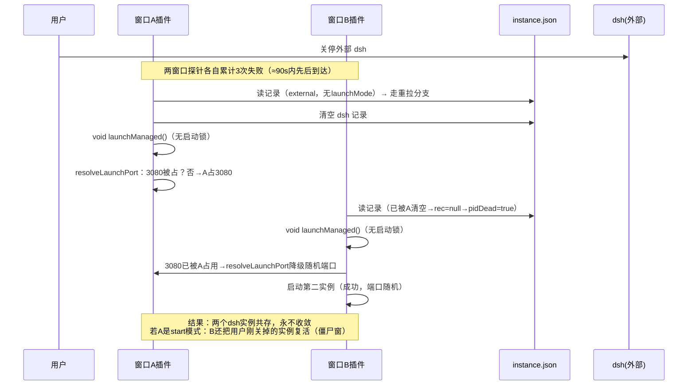
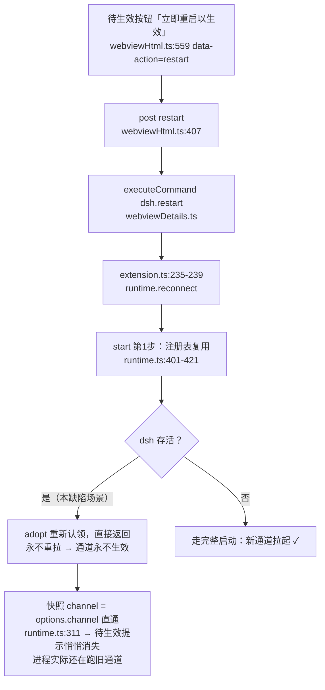
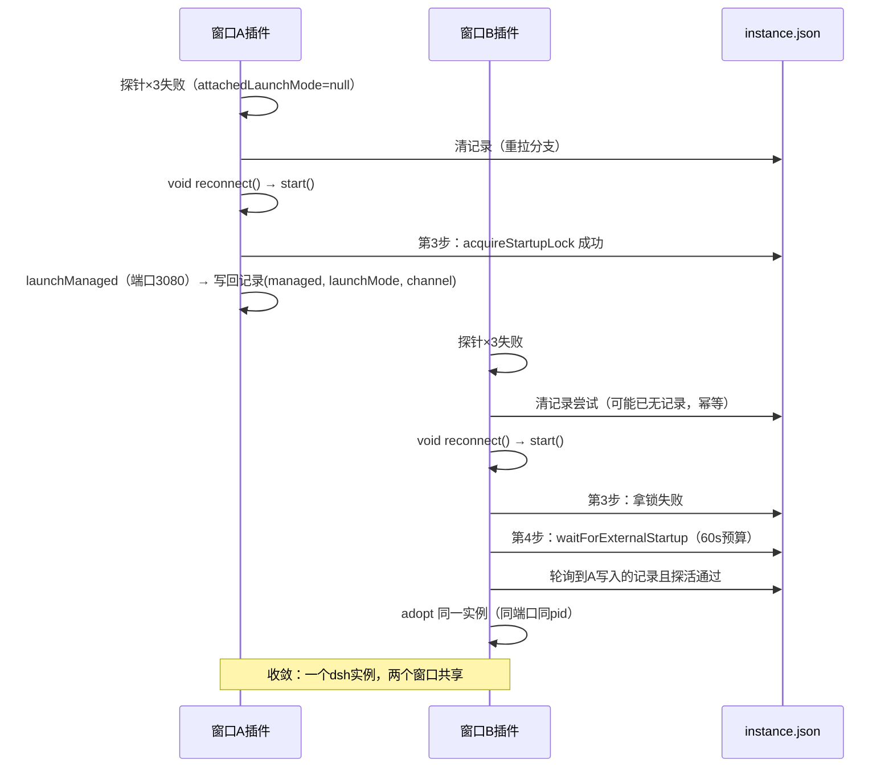

# 0.1.21 修复设计 — 外部实例关停后多窗口重复拉起 与 通道切换「立即重启以生效」失效

> 版本 v1 | 日期 2026-09-10 | 状态：待评审

## 修订记录

| 版本 | 日期 | 变更 |
|---|---|---|
| v1 | 2026-09-10 | 初版：两个运行期缺陷的根因分析（含 file:line 证据与现场证据）与修复设计；sim 补测清单；实施清单。 |

## 零、前置参考

### 0.1 缺陷来源（用户原话，2026-09-10）

> 缺陷①：「当外部管理的dsh关停时，插件会自动启动内置dsh实例，但是每个windows窗口的插件都会发起启动，结果启动了好几个dsh实例，而不是共享一个，你上面的修复包含这个吗？」
>
> 缺陷②：「dsh配置里的通道，当从alpha改成latest会出现重启dsh服务的按钮，但是点击按钮后没有任何反应，导致切换通道功能失效」

两个缺陷均为 0.1.20 发布后用户真机反馈的运行期行为缺陷。0.1.20 全链（提交 c7295c0…212d27e）只动了拷贝、注释与 sim 断言，没有行为逻辑变更，与本两缺陷无关（QA 已复核）。

### 0.2 现场证据

- `%LOCALAPPDATA%\DshVscode\instance.json`（读取于 2026-09-10）：`dsh` 记录为 `managedBy:"external"`、`pid:24540`、`port:3080`，**没有 `launchMode` 字段**。
- `%LOCALAPPDATA%\DshVscode\logs\`：2026-09-10 13:52:27 / 13:52:39 / 13:52:40 三份 dsh 日志在 13 秒内先后创建（其中两份带 cmd-start+node-start 包装标记），13:55:19 / 13:56:46 / 13:56:58 又有三份；另有 14:00 前后两份 2 字节空日志。这与「多个窗口插件同时各拉起一个 dsh」的现象吻合。
- npm dist-tag 现状（发布链已核实）：`latest = next = 0.1.5-rc.1`，`alpha = 0.1.5-alpha.2`。通道从 alpha 切到 latest 意味着二进制从 0.1.5-alpha.2 换成 0.1.5-rc.1，重启后版本号可观察、可验证。

### 0.3 关联既有契约与决策（修复不得破坏）

| 契约/决策 | 内容 | 与本设计的关系 |
|---|---|---|
| P0-D / ADR-2 | `dsh.restart`→`reconnect()` 契约：只断开重连，**绝不杀死 dsh** | 缺陷②的普通「⟳/重启 dsh」按钮保持该语义不动 |
| ADR-21 | 启动方式为 start 的 dsh 探针无法区分「崩溃」与「用户关窗」，死亡一律判为用户主动停止，**不自动重拉**（防僵尸窗循环） | 缺陷①修复须让该判定在多窗口下继续成立 |
| forceRelaunchManaged（runtime.ts:1216-1255） | 仅 managed-own 可用（否则返回 `no-managed` 不杀外部进程）；kill 后按当前通道重拉 | 缺陷②修复复用该函数 |
| 注册表可选字段先例 | `launchMode`、`processStartedAt` 均为后加的可选字段，旧记录缺省不报错 | 缺陷②修复新增 `channel` 可选字段沿用同一先例 |
| sim 现状 | 0.1.20 基线 496 PASS / 0 FAIL / 9 SKIP，检查总数 505 | 本轮新增用例后基线只增不减 |

## 一、目标/背景分析

### 1.1 缺陷①：外部实例关停后，每个 VSCode 窗口各拉起一个 dsh

**现象**：外部管理的 dsh 被关停后，打开的每个 VSCode 窗口里的插件都各自发起启动，最终同时存在好几个 dsh 实例（各自占用不同端口），而不是收敛共享一个。

**根因链**（每一步都有代码依据）：

1. 每个 VSCode 窗口是一个独立进程，各有自己的 `Runtime`，各自每 30 秒探活一次，连续 3 次失败进入死亡处理（runtime.ts:81 `LIVENESS_FAIL_THRESHOLD = 3`，runtime.ts:1120-1123）。
2. 死亡处理分两支（runtime.ts:1133-1161）：记录里 `launchMode === 'start'` 判为用户停止、只清理不重拉（ADR-21）；**其余情况走重拉分支**。
3. 外部实例被本插件接手时走 `adopt()`（runtime.ts:802-861），它只设置端口/pid/managedBy，**从不写 `launchMode`**；而注册表里的 `launchMode` 只在插件自己拉起时写入（runtime.ts:977 `writeRegistry`：`launchMode: … (this.lastLaunchMode ?? undefined)`）。所以外部实例的记录永远没有 `launchMode` 字段（现场 instance.json 证实）。
4. 于是外部实例死亡时必然落入重拉分支 runtime.ts:1150-1161：清掉注册表记录后**直接 `void this.launchManaged()`**。
5. 关键越权点：这行代码**绕过了启动锁**。`acquireStartupLock`（instance.ts:432-456，独占创建 + 过期 pid 回收）只在 `start()` 第 3 步被使用（runtime.ts:481-485）；probeTick 里的重拉完全不经过它。
6. 并发后果：N 个窗口的探针几乎同时到达阈值，N 个窗口各自执行 `launchManaged`，谁都拿不到彼此互斥的约束。而 `resolveLaunchPort`（runtime.ts:70-77）在配置端口（3080）已被第一个实例占用时会**降级到随机端口**，于是后续每个实例都「成功」落在不同端口上——没有失败、没有回退、没有收敛，多个实例长期共存。日志目录里 13 秒内三份新 dsh 日志就是这一竞态的现场。
7. 附加漏洞（start 模式的跨窗口僵尸复活）：窗口 A（start 模式）判用户停止后清掉记录（runtime.ts:1136-1141）；窗口 B 的探针晚几秒触发时读到 `rec === null`，`pidDead` 判真（runtime.ts:1122），且 `rec !== null && rec.launchMode === 'start'` 不成立（记录已没了），于是 B 落入重拉分支——**用户明确关掉的 start 实例被别的窗口复活**，ADR-21 在单窗口内成立的判定在多窗口下被击穿。



### 1.2 缺陷②：通道切换后「立即重启以生效」按钮点了没反应

**现象**：在详情卡把通道从 alpha 改为 latest 后出现「立即重启以生效」按钮，点击后 dsh 进程没有任何变化，通道切换功能失效。

**根因链（两层）**：

- **第一层（按钮接错了语义）**：待生效按钮的 `data-action="restart"`（webviewHtml.ts:559）→ 详情卡转发 `restart`（webviewHtml.ts:407）→ webviewDetails.ts 执行 `dsh.restart` 命令（extension.ts:235-239）→ `runtime.reconnect()` → `start()`。
- `start()` 第 1 步是注册表复用（runtime.ts:401-421）：只要发现存活实例且探活通过就 `adopt()` 后**直接返回**。当前 dsh 活着，所以每次点击都只是「重新认领同一个实例」，永远走不到重拉。按钮承诺的「重启以生效」在结构上不可能发生——这是 0.1.14 ADR-29（重启即生效）与 ADR-2/P0-D（restart 契约绝不杀 dsh）两条规则的直接冲突：reconnect 遵守了后者，就必然兑现不了前者。
- **第二层（快照失真，让问题更隐蔽）**：快照的 `channel` 字段是配置直通（runtime.ts:311 `channel: this.options.channel`），不是运行中进程的真实通道。reconnect 内部会刷新快照，于是「待生效」的判定条件 `configChannel !== info.channel`（webviewHtml.ts:549）在重连后悄悄变假——卡片显示「当前通道 = latest」而进程实际还在跑 alpha。就算第一层修好，这一层不修，用户仍会被快照误导。



### 1.3 sim 回归盲区（为什么既有测试没拦住）

| 盲区 | 现状 | 缺口 |
|---|---|---|
| 多窗口死亡收敛 | PP-2-6（sim.mjs:1831-1871）只测**单窗口**死亡行为 | 无「多窗口同时探针到阈值 → 只拉起一个」的用例 |
| start 模式跨窗口用户停止 | PP-2-6 只覆盖单窗口 ADR-21 | 无「窗口A判用户停止后，窗口B不得复活」的用例 |
| 通道生效动作 | PP-10-4/10-5 只覆盖配置写入顺序与不自动重启 | 无 `applyChannel` 动作分支用例；无「重连后待生效提示仍须真实」的用例 |
| 快照通道真实性 | 无任何快照 channel 断言 | 无 |

## 二、范围分析（做什么、不做什么）

### 2.1 做什么

1. **D1（缺陷①）**：probeTick 死亡重拉分支仲裁化——把绕过启动锁的 `void this.launchManaged()` 替换为走完整四步仲裁的 `void this.reconnect()`；新增附加期记忆 `attachedLaunchMode`，让 ADR-21 的「用户停止不复活」判定在记录被兄弟窗口清掉后依然成立。
2. **D2-a（缺陷②·第一层）**：新增详情卡消息动作 `applyChannel`，待生效按钮改挂该动作并按实例归属分流：managed-own → `forceRelaunchManaged()`（点击即意图，不再二次弹窗）；external → 诚实警告指引（插件不杀外部进程，用户手动关停后重连）；非存活 → `dsh.restart`（走现有正确路径）。普通「⟳」与外部卡「重启 dsh」按钮**维持 reconnect 语义不变**。
3. **D2-b（缺陷②·第二层）**：快照通道真实性——新增附加期记忆 `attachedChannel`（拉起时=当时配置通道；认领时=注册表记录的 channel，缺失则回退配置通道），注册表 `dsh` 记录新增可选字段 `channel`（managed 拉起时写实际值；同 pid 重新认领时保留；external 认领时不写）。刷新快照时 `channel` 取 `attachedChannel ?? options.channel`，保证「待生效」判定基于真实运行通道。
4. **sim 补测**：按 §三.4 清单新增用例并更新消息白名单断言。

### 2.2 不做什么

- **不改**普通 `⟳` / 外部卡「重启 dsh」按钮的 reconnect 语义（ADR-2/P0-D 契约不动）。
- **不改** ADR-21 单窗口语义（start 模式死亡 = 用户停止，不自动重拉）。
- **不做**注册表读-改-写竞争的全面治理（已知结构性限制，属既有债务，另立事项）。
- **不改** direct 模式崩溃重试的 `MAX_RESTARTS=6` 与退避序列（runtime.ts:570-607）。
- **不新增** vscode 贡献点、不改 package.json 激活事件。
- **不做**外部实例通道的自动探测（外部进程真实通道本插件无法确知，只做诚实标注）。

## 三、系统技术选型及设计

### 3.1 D1：死亡重拉分支仲裁化（缺陷①）

**改动点 1 — probeTick 重拉分支（runtime.ts:1150-1161）**：

把

```ts
this.setState('starting')
void this.launchManaged()
```

替换为

```ts
this.setState('starting')
void this.reconnect()
```

`reconnect()`（runtime.ts:1196）内部置 `attached=false`、清停止标记后调用 `start()`，完整重走四步仲裁：

1. 第 1 步注册表复用（runtime.ts:401-421）：若别的窗口已经拉起并写回记录，本窗口认领即可；
2. 第 2 步端口探测认领；
3. 第 3 步 `acquireStartupLock` + `launchManaged` + 释放（runtime.ts:481-485）：只有拿到锁的窗口才真正 spawn；
4. 第 4 步 `waitForExternalStartup`（runtime.ts:489-496、1014-1031，60 秒预算）：拿不到锁的窗口在等待期内轮询注册表与探针，锁主就绪后认领同一实例。

多窗口自然收敛：第一个到达的窗口持锁拉起占用 3080，其余窗口全部在等待期认领同一实例，不再出现「端口降级随机 → 各自成王」。单窗口行为与现状等价（锁空闲时直接拉起），PP-2-6 的既有断言不受影响。

**改动点 2 — ADR-21 跨窗口语义补丁**：

新增实例字段 `private attachedLaunchMode: 'start' | 'direct' | 'legacy' | null = null`：

- `launchManaged()` 成功拉起后赋值为本次启动方式；
- `adopt()` 认领时从注册表记录读取赋值（记录缺失则保持 null）；
- 释放/断开/清记录时随清理置回 null（或留在下一次认领时覆盖，取实现最简者）。

probeTick 用户停止判定（runtime.ts:1133）从

```ts
if (rec !== null && rec.launchMode === 'start') {
```

改为

```ts
if (rec?.launchMode === 'start' || this.attachedLaunchMode === 'start') {
```

效果：窗口 A 判用户停止清掉记录后，窗口 B 自己的 `attachedLaunchMode` 仍是 'start'，同样判用户停止、同样只清理不复活——ADR-21 的防僵尸窗裁定在多窗口下继续成立。external/direct 认领的记忆为 null/非 start，行为不变（外部实例消失仍走仲裁重拉，与本插件「重连即以当前配置拉起内置实例」的既有语义一致）。



### 3.2 D2-a：`applyChannel` 动作（缺陷②·第一层）

**消息协议**（§七.1）：新增详情卡消息 `{ type: 'applyChannel' }`。

**前端**（webviewHtml.ts）：

- 待生效按钮（L559）`data-action="restart"` 改为 `data-action="apply-channel"`；
- 脚本分发块（L398-410）新增分支：`else if (a === 'apply-channel') post({ type: 'applyChannel' })`；
- 其余按钮（`restart`、⟳、外部卡「重启 dsh」）一字不动。

**后端**（webviewDetails.ts 新增 `case 'applyChannel'`），按运行时状态分流：

| 状态 | 行为 | 理由 |
|---|---|---|
| ready 且 managed-own | 直接 `await runtime.forceRelaunchManaged()`，rlog 记录动因 `apply-channel` | 用户点「立即重启以生效」本身就是明确意图，不再二次弹窗；该函数自带 managed-own 守卫（runtime.ts:1219-1221） |
| ready 且 external / extension（外部认领） | `showWarningMessage`：外部实例不由本插件管理、插件不会替你关闭；请自行停止该 dsh，然后点「重连/重启 dsh」，插件会以新通道拉起内置实例 | ADR-2：插件绝不杀外部进程；诚实告知手动路径，待生效提示保留 |
| 非 ready（stopped/error/dead） | `executeCommand('dsh.restart')` | 实例已死，reconnect 的四步仲裁本来就会以新配置拉起，现有路径正确 |

消息白名单（sim PP-11-4③，sim.mjs:4302-4308 的类型集合断言）同步加入 `applyChannel`（`restart` 仍在集合内，其余按钮仍发它）。

### 3.3 D2-b：快照通道真实性（缺陷②·第二层）

**注册表结构**（§七.2）：`dsh` 记录新增可选字段 `channel?: string`：

- managed 拉起成功时写入实际启动通道（`writeRegistry`/`writeInstance` 处与 `launchMode` 同点，runtime.ts:977 一带）；
- 同 pid 重新认领保留原值（沿用 `processStartedAt`/`launchMode` 的保留写法）；
- external 认领不写（插件无法确知外部进程真实通道，诚实缺省）；
- 旧记录无此字段 → `undefined` → 全部回退现状行为，零回归（可选字段先例：launchMode、processStartedAt）。

**运行时记忆**：新增实例字段 `private attachedChannel: string | null = null`：

- `launchManaged()` 成功拉起后 = `this.options.channel`（拉起那一刻的配置通道）；
- `adopt()` 认领时 = `rec.channel ?? this.options.channel`（managed 记录给真值；旧记录/外部记录回退配置通道，与现状等价）；
- `refreshLaunchInfo()` 的快照 `channel`（runtime.ts:311）改为 `this.attachedChannel ?? this.options.channel`。

**效果闭环**：reconnect 重连认领一个仍在跑旧通道的实例后，快照 channel 保持旧值，「待生效」判定（webviewHtml.ts:549 `configChannel !== info.channel`）保持为真，提示不再被假快照悄悄抹掉；forceRelaunchManaged 以新通道拉起后 `attachedChannel` 更新为新值，待生效自然消失。`setChannel`（runtime.ts:356-359）保持只写配置不动——真实通道的唯一写入口是「拉起」，这正是本修复要建立的语义。

### 3.4 状态机与影响面

- 生命周期状态机无新增状态；`starting` 在 probeTick 死亡分支的语义不变（原样置位后交由 reconnect 驱动）。
- 受影响文件：`src/runtime.ts`（probeTick、adopt、launchManaged、refreshLaunchInfo、新增两个私有字段）、`src/webviewHtml.ts`（按钮属性 + 分发一行）、`src/webviewDetails.ts`（新 case）、`src/instance.ts` 无需改动（锁与注册表读写函数原样复用）、`src/extension.ts` 无需改动。
- ADR 冲突消解：ADR-29「重启即生效」的承载从 `dsh.restart`（reconnect，绝不杀）**转移到** `applyChannel` 动作（点击即意图，managed-own 时显式 forceRelaunch）；ADR-2/P0-D 保持原文不变。

## 四、可行性分析

| 假设 | 探针结果 | 判定 |
|---|---|---|
| reconnect 可作为 probeTick 的重拉入口 | runtime.ts:1196-1214 已存在且正是该语义（attached=false → start()）；死亡分支已先置 `state='starting'`，start 的 ready 短路守卫不会拦截 | ✅ 复用现成机制，零新机制 |
| 启动锁足以收敛多窗口 | instance.ts:432-456 独占创建锁 + 过期 pid 回收已在 0.1.x 多窗口仲裁中稳定使用；start() 第 3 步（runtime.ts:481-485）即持锁拉起 | ✅ |
| 等待窗口能在锁主拉起期间认领 | 第 4 步 `waitForExternalStartup`（runtime.ts:1014-1031）60 秒预算轮询注册表+探针，正是为此场景设计 | ✅（60 秒预算风险见 §八.R1） |
| forceRelaunchManaged 可直接承载待生效点击 | runtime.ts:1216-1255：managed-own 守卫、kill 后按当前配置重拉、返回值明确 | ✅ |
| 注册表可选字段向后兼容 | launchMode、processStartedAt 两个先例均为后加可选字段且已在旧记录上稳定运行 | ✅ |
| 通道切换可观察验证 | dist-tag：alpha→0.1.5-alpha.2，latest→0.1.5-rc.1，重启后详情卡版本号必然变化 | ✅ 真机验收可判定 |

无破坏性探针需要执行；本设计与 0.1.20 测试链的收尾（无头回归）无文件冲突（改动仅 src 四文件 + sim 断言，均在 0.1.20 闭环之后实施）。

## 五、可维护性分析

1. **语义归位**：「待生效」按钮从「借用 restart」改为专属 `applyChannel` 动作，按钮名、消息类型、执行路径一一对应，消除 ADR-29 与 ADR-2 的规则冲突——后续任何人改 restart 语义不再波及通道生效。
2. **单一写入口**：真实通道只在「拉起」时写入（memory + 注册表），认领只读不猜，快照不再需要「直通配置」这种会撒谎的捷径。
3. **ADR-21 跨窗口判定集中化**：`attachedLaunchMode` 让「用户停止」的判定从「读共享记录」改为「共享记录 ∨ 本窗口记忆」，判定依据与窗口生命周期绑定，注释中须写明与 runtime.ts:1124-1132 原裁定的关系。
4. **复用仲裁主干**：死亡重拉走 reconnect→start 四步仲裁，未来启动仲裁的任何改进（锁、等待、认领）自动惠及死亡重拉路径，不再有第二套拉起入口。

## 六、性能分析（定量指标）

| 指标 | 现状 | 修复后 | 说明 |
|---|---|---|---|
| 外部实例死亡后多窗口收敛 | 不收敛（N 窗口 → N 实例，随机端口） | 1 个实例；后到窗口 ≤60s 内认领 | 收敛由启动锁串行化；等待窗口最坏等满 60s 预算后报错（诚实降级，可重连重试） |
| 单窗口死亡重拉时延 | 阈值(3×30s) + 拉起 | 相同（路径换了入口，不增加等待） | reconnect→start 直接走四步，锁空闲时与直拉等价 |
| probeTick 热路径开销 | 读注册表 + pid 探活 | 相同（新增两个内存字段读写，无 IO） | 无新增热路径 |
| 通道生效（managed-own） | 永不生效 | 点击后 kill+重拉，秒级（二进制已在本机时） | npx 冷拉取场景受既有启动预算约束，非本修复引入 |
| sim 增量 | 496 PASS 基线 | 预计 +7 用例，全绿 | 见 §三.5 |

## 七、附加（接口契约、注册表结构、vscode 贡献点）

### 7.1 详情卡消息协议（新增一项）

```ts
// webview → extension 新增消息类型（白名单同步 sim PP-11-4③）
{ type: 'applyChannel' }   // 待生效按钮专用；由 webviewDetails 按 §3.2 分流
```

`restart`/`setChannel` 等既有消息类型与语义零改动。

### 7.2 注册表结构（instance.json → dsh 记录）

```jsonc
{
  "dsh": {
    "pid": 1234,
    "port": 3080,
    "managedBy": "extension",
    "startedAt": "…",
    "launchMode": "start",        // 既有可选字段，不变
    "processStartedAt": "…",      // 既有可选字段，不变
    "channel": "latest"           // 新增可选字段：managed 拉起时写实际值；
                                  // 同 pid 重新认领保留；external 认领不写；旧记录缺省
  }
}
```

### 7.3 vscode 贡献点

零新增、零修改（不动 package.json 的 commands/configuration/activationEvents）。

### 7.4 sim 新增用例设计（编号 PP-21-*，测试专家可按 sim 既有惯例调整编号）

| 用例 | 场景 | 关键断言 |
|---|---|---|
| PP-21-1 | 多窗口外部实例死亡收敛 | 两个 runtime 共享同一注册表目录；external 记录死亡后两窗 probeTick 均达阈值；**spawn 恰好 1 次**（计数注入）；两窗端口/pid 一致；注册表记录 `managedBy:"extension"` 且带 launchMode 与 channel；`windows[]` 含两条 |
| PP-21-2 | start 模式跨窗口用户停止 | 窗口 A（start）判用户停止清记录；窗口 B（attachedLaunchMode='start'）probeTick 后同样 stopped；**spawn 计数为 0**（僵尸窗不复活） |
| PP-21-3 | 单窗口外部死亡仲裁重拉 | external 记录（无 launchMode）死亡 → reconnect 路径 → 恰一次 managed 拉起；新记录带 launchMode 与 channel |
| PP-21-4 | applyChannel：managed-own 存活 | 点击 → forceRelaunchManaged 被调用：旧进程被杀、新进程以新通道拉起、state 回 ready、快照 channel=新值、待生效消失 |
| PP-21-5 | applyChannel：external 存活 | 点击 → 外部进程**未被杀死**（存活断言）+ 出现警告消息 + 待生效保留 |
| PP-21-6 | applyChannel：非存活 | 点击 → 走 dsh.restart（reconnect）→ 以新通道拉起 |
| PP-21-7 | 快照通道真实性 | reconnect 重连认领「存活但通道为旧值」的实例后，快照 channel 保持旧值，待生效条件仍为真（不被假快照抹掉） |
| PP-21-8 | 白名单更新 | PP-11-4③ 类型集合断言加入 `applyChannel` |

## 八、决策记录与风险

### 8.1 决策记录

| 编号 | 决策 | 理由 |
|---|---|---|
| D-21-1 | 死亡重拉走 `reconnect()` 四步仲裁，不新造「带锁的 launchManaged」 | 四步仲裁是唯一经过多窗口实战验证的主干；新造第二套入口必然再次漂移 |
| D-21-2 | 待生效按钮语义从 reconnect 改为专属 `applyChannel`；普通 ⟳/「重启 dsh」保持 reconnect | ADR-29（重启即生效）与 ADR-2（绝不杀 dsh）在 restart 上不可兼得；拆开承载即消解冲突 |
| D-21-3 | managed-own 的 applyChannel 直接 forceRelaunch，不二次弹窗 | 按钮文案「立即重启以生效」本身已是用户意图，再弹一次确认属于重复打扰 |
| D-21-4 | 注册表新增可选 `channel` 字段 + 附加期 `attachedChannel` 记忆 | 快照失真是缺陷②的组成部分，不修则修复后提示仍会被抹掉；沿用可选字段先例零回归 |

### 8.2 需用户裁决的开放项（评审时决定）

| 编号 | 问题 | 推荐选项 | 备选 |
|---|---|---|---|
| O-21-1 | 外部实例死亡后，插件是否继续「自动拉起内置实例」？ | **保留自动拉起，但经仲裁收敛**（本设计默认；改动最小，且符合用户对共享单实例的期望） | 改为所有窗口诚实进入 stopped 状态、由用户手动点重连（更保守，避免与用户「我自己马上要重启」的意图抢跑） |
| O-21-2 | D2-b（快照通道真实性 + 注册表 channel 字段）是否随本轮一并实施？ | **一并实施**（不修则待生效提示在重连后仍会被假快照抹掉，缺陷②只修了一半） | 只修 D2-a（按钮生效），快照失真另立事项 |
| O-21-3 | 待生效按钮语义变更是否接受？ | **接受**（仅此按钮变化，普通 ⟳/「重启 dsh」不动） | 维持按钮走 reconnect 并接受「通道永不生效」（等于放弃修复缺陷②，不推荐） |

### 8.3 风险与缓解

| 编号 | 风险 | 缓解 |
|---|---|---|
| R1 | 第 4 步等待预算 60 秒，npx 冷拉取可能分钟级，等待窗口超时报错 | 既有 W-02 诚实降级取舍：报错信息指引「重连重试」；不静默吞掉；后续可为拉起中状态延长预算（本轮不做） |
| R2 | 旧注册表记录无 channel 字段 | 可选字段缺省 → `attachedChannel` 回退 `options.channel`，与现状行为逐字节等价，零回归 |
| R3 | forceRelaunchManaged 期间面板短暂 starting | 既有 F-UPDATE 刷新语义，可接受；rlog 留痕 |
| R4 | 单窗口内 probeTick 与在途 reconnect 重入 | probeTick 入口有 `state === 'ready'` 守卫（runtime.ts:1123），starting 期间的后续 tick 直接返回，不会重复触发 |
| R5 | PP-2-6b direct 模式既有重拉断言受影响 | 单窗口场景锁始终空闲，reconnect 路径与直拉时序等价；sim 回归全绿为验收门槛 |
| R6 | forceRelaunchManaged 换实例后，其他窗口需等各自探针 ×3（最长约 90 秒）才收敛到新实例 | 跨进程无推送通道，属既有探针节奏；记录为已知体验延迟，不在本轮扩展 |

## 九、实施清单

> 顺序执行；每步产出可验证；【目标角色】供下游代理按需读取。

| # | 任务 | 目标角色 | 验证方式 |
|---|---|---|---|
| 1 | 本设计文档评审（含 §8.2 三个裁决项），裁决结论回写本文档 | [QA] 设计检查 → [用户] 评审 | QA 设计检查通过 + 用户裁决记录 |
| 2 | D1：runtime.ts probeTick 重拉分支改 reconnect；新增 `attachedLaunchMode` 并在 launchManaged/adopt 赋值；ADR-21 判定改为 `rec?.launchMode==='start' \|\| this.attachedLaunchMode==='start'`；相关注释同步（引用 runtime.ts:1124-1132 原裁定） | [开发专家] | compile 零错误 |
| 3 | D2-a：webviewHtml.ts 待生效按钮 `data-action="apply-channel"` + 分发行；webviewDetails.ts 新增 `applyChannel` 三分流（managed-own→forceRelaunchManaged / external→showWarningMessage / 非存活→dsh.restart）；rlog 动因记录 | [开发专家] | compile 零错误 |
| 4 | D2-b：`attachedChannel` 记忆（launchManaged/adopt 赋值）；注册表可选 `channel` 字段（managed 写入、同 pid 保留、external 不写）；refreshLaunchInfo 快照 channel 改为真值来源 | [开发专家] | compile 零错误 |
| 5 | sim 新增 PP-21-1…8（§7.4 设计）；PP-11-4③ 白名单断言更新；回归核对 PP-2-6、P0-I-2/3/4b、PP-10-4/10-5 不变绿 | [测试专家] | `node scripts/sim.mjs`（`DSH_VSCODE_DATA_DIR` 指向工作区临时目录）全绿；`node node_modules\typescript\bin\tsc -p tsconfig.json` 零错误 |
| 6 | 代码检查（对照本设计逐条核对：绕锁拉起是否根除、ADR-2/ADR-21 语义是否保持、外部进程零杀死、可选字段兼容性、快照真值闭环） | [QA] | QA 代码审计报告 |
| 7 | 打包 0.1.21 VSIX + SHA256，发布说明含两缺陷修复摘要与真机验收点 | [部署专家] | 产物存在 + 哈希登记 |
| 8 | 部署检查（版本号、清单文件、提交在 feature/dsh-alpha-compat 分支、不碰 main/master） | [QA] | QA 部署审计通过 |
| 9 | 真机 GUI 验收（用户执行，剧本增补两场景）：① 多窗口下关停外部 dsh → 观察进程数收敛为 1、各窗口面板指向同端口；② 通道 alpha→latest → 点「立即重启以生效」→ dsh 版本变为 0.1.5-rc.1、各窗口面板同步 | [测试专家] 出剧本 / [用户] 执行 | 剧本两场景 PASS 截图/记录 |

> 评审人：待定 | 状态：待终审 | 日期
