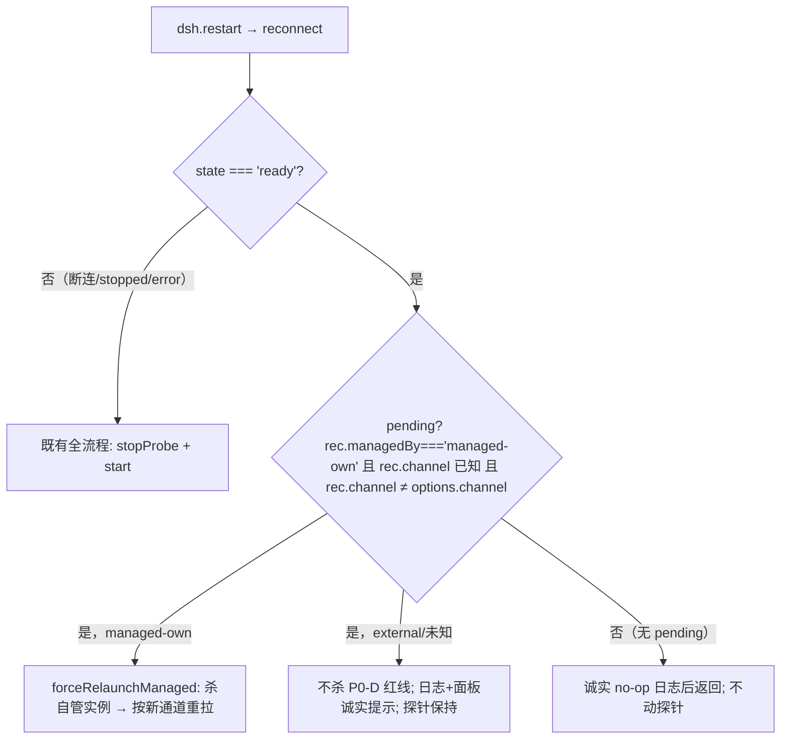

# 0.1.21 根因分析与修复设计 — 多窗口重复启动与通道切换重启无响应

## 修订记录

| 版本 | 日期 | 说明 |
|---|---|---|
| v1 | 2026-09-10 | 架构师初稿：两个用户缺陷的根因分析与修复设计，待 QA 设计检查与用户评审 |
| v1.1 | 2026-09-10 | （并行会话追加的注记，非本链 QA 轮产物）称本稿已被《0.1.21修复设计-多窗口实例收敛与通道切换重启生效.md》取代。**该"取代"声明未经编排者或 QA 链路确认**；本稿 v2 按 QA 设计检查 findings 继续修订，存废与唯一评审对象由编排者/用户裁决（见 §零 文档关系声明） |
| v2 | 2026-09-10 | 架构师按 QA 设计检查 findings（F1-F7）修订。**根因结论的变化**：缺陷二根因增补"层 C：快照通道失真"（v1 遗漏，由并行稿《0.1.21修复设计-…》指出，本轮逐行核实属实——runtime.ts:311 快照 channel 为配置直通；已吸收进 §3.2 与 R4/R5）。**方案结论的变化**：R1 等锁等待上限由"沿用 60 秒常量"改为配置项 `dsh.startupWaitSec`（默认 900 秒）；R4 由"注册表 channel 字段"扩展为"注册表字段 + 快照真值来源"；其余根因（缺陷一 TOCTOU、缺陷二层 A/层 B）与 R2/R3/R5 框架不变。逐项处置对照见下表 |

### v2 findings 处置对照（供 QA 复审）

| Finding | 严重度 | 处置 | 落点 |
|---|---|---|---|
| F1 | MAJOR | 修复：等锁等待上限配置化（`dsh.startupWaitSec` 默认 900 秒，推导覆盖 launchManaged 全链理论预算约 13 分钟），目标 1 / §4.1 / §七 / 场景 A 全文同步；超时诚实报错 + 手动重连接管路径写明 | §一目标 1、§3.1 冷启动时序段、§4.1 要点 2/3、§七、§八 8.1/8.2/8.3、§九 DEV-1/DEV-6/场景 A |
| F2 | MAJOR | 修复：补 TEST-8（DEV-4 写侧断言 + 快照真值断言）与 TEST-9（DEV-5 渲染分流断言，先例 PU-8 = sim.mjs L2010-2029），另补 TEST-10（等锁防重入回归）；§5.4 同步 | §5.4、§九 TEST 表 |
| F3 | MINOR | 采纳并升级：runtime.log 为活动日志且存在读取器行号口径差异，本版起日志引用一律以时间戳锚点为准，关键段固化为 `.dsh/tmp/architect/defect-0121/runtime-log-excerpt-20260910.txt` | §零、§3.1、§3.2、evidence.md |
| F4 | MINOR | 采纳：sim 行号更正——"用户主动停止不重启"断言在 PP-2-6（sim.mjs L1831-1872，关键断言 L1847）；L3572-3627 是 PP-8-3 的 401 会话分流测试族（错误退出终态断言在 L3603-3605 附近）。覆盖盲区结论不变 | §3.3、§九说明 |
| F5 | MINOR | 采纳：`launchMode` 字段定义在 instance.ts:33（L22-32 为其注释）；`DshRecord` 接口为 instance.ts:9-49 | §3.1、§4.4、evidence.md |
| F6 | MINOR | 采纳：§4.1 补等锁分支防重入说明（与拿锁分支共用 `setState('starting')` 前置，probeTick 入口守卫使 30 秒周期下一跳不会重入），并补 TEST-10 | §4.1 要点 6、§九 DEV-1/TEST-10 |
| F7 | SUGGESTION | 采纳为声明：三份 0.1.21 文档关系与 v1.1 注记冲突已在 §零 如实声明；废弃/归档属用户裁决，本稿不代删 | §零 |

## 零、前置参考（provenance）

- **用户缺陷报告（2026-09-10，原文）**：
  1. "当外部管理的dsh关停时，插件会自动启动内置dsh实例，但是每个windows窗口的插件都会发起启动，结果启动了好几个dsh实例，而不是共享一个"
  2. "dsh配置里的通道，当从alpha改成latest会出现重启dsh服务的按钮，但是点击按钮后没有任何反应，导致切换通道功能失效"
- **docs/ 下三份 0.1.21 文档的关系与 v1.1 注记冲突（F7 处置声明）**：当前 `docs/` 并存三份同主题未入库文档：本文档（0.1.21根因分析与修复设计-多窗口重复启动与通道切换重启无响应.md，QA 设计检查的评审对象）、0.1.21修复设计-多窗口实例收敛与通道切换重启生效.md（并行初版设计稿，下称《修复设计》）、0.1.21问题分析-多窗口重复拉起dsh与通道切换按钮失效根因与修复方案.md（并行收敛稿，自称吸收另两稿）。修订期间本文档被并行会话追加 v1.1 注记（称本稿已被《修复设计》取代、不作为评审对象）。**本轮对《修复设计》做了逐行核实，结论如下，供编排者/用户裁决存废时参考**：①它同样存在 F1 所指的冲突——其 §六性能表写"后到窗口 ≤60s 内认领"、§8.3 风险表 R1 自认"60 秒预算，npx 冷拉取可能分钟级……本轮不延长预算"，与真机约 7 分钟冷启动时序矛盾，未达到 F1"二者取一并保持全文一致"的要求；②它未覆盖 F2 所要求的写侧/渲染自动化断言（其 PP-21-4/5 为行为用例，无注册表 channel 写侧与渲染 HTML 断言的对应设计）。它声称补上的两处根因，经本轮逐行核实：**"快照 channel 配置直通失真"属实**（runtime.ts:311 快照 channel = `this.options.channel` 配置直通，非运行实例事实；已吸收进本稿 §3.2 层 C 与 R4/R5）；**"ADR-21 跨窗口僵尸复活"逻辑属实**（runtime.ts:1121-1123：兄弟窗口清记录后 `rec === null` → ADR-21 分支条件 `rec !== null && rec.launchMode === 'start'` 不成立 → 落入重拉分支；因修复它需要触碰 v1 红线"ADR-21 分支逐字节不动"，登记为本稿 §8.2 开放项 O-1，不在本轮擅自实施）。**三份文档的废弃/归档/合并由用户裁决**，本稿不代删任何文档。
- **真机证据（架构师采集）**：
  - `%LOCALAPPDATA%\DshVscode\logs\runtime.log`：缺陷一实锤为三窗口 probe 判死链（时间戳 2026-09-10T05:48:19.520Z / 05:48:37.668Z / 05:48:38.854Z，三窗口各自无锁拉起）；缺陷二实锤为 win 47396 的 07:10:47-07:11:01 段（两次点击各只留一行 `reconnect: requested` 日志）。**行号引用纪律（F3）**：该日志为活动日志（本轮实测两次读取总行数从 2382 涨到 2388），且因文件混入非 UTF-8 字节序列，不同读取器行号口径相差 6 行（`Select-String -Path` 直读口径下三个判死行在 L2165/L2174/L2183，`Get-Content` 管道口径下在 L2159/L2168/L2177——v1 引用的 L2165-2186 属前者口径且完整覆盖三行，QA findings 的 L2159 系属后者口径，两者各自内部一致）。**本稿 v2 起对该日志一律以时间戳锚点引用、不再写行号**；关键段落已固化为快照：`.dsh/tmp/architect/defect-0121/runtime-log-excerpt-20260910.txt`（判死链 / npx 冷启动 90 秒超时组 / 15:10 通道切换段 / dsh 日志文件清单四节）。
  - `%LOCALAPPDATA%\DshVscode\logs\dsh-20260910-13*.log`：13:48 两份 2 字节 + 13:52 三份 0 字节 + 13:55-56 三份 106-213KB 真实存活实例。
  - `%LOCALAPPDATA%\DshVscode\instance.json`：现行注册表结构（无 channel 字段）。
  - 复验命令见 evidence.md（`.dsh/tmp/architect/defect-0121/evidence.md`）。
- **代码证据**：src/runtime.ts（1377 行）、src/instance.ts（517 行）、src/extension.ts、src/webviewHtml.ts（613 行）、src/webviewDetails.ts。src 代码行号以 2026-09-10 工作区版本为准，均已逐行核实。
- **关联裁决（保持有效，本设计不推翻）**：ADR-21（用户主动停止不自动重启）、ADR-1（配置端口被占回退随机端口）、ADR-29（通道模型 latest/next/alpha）、P0-D（客户端语义：插件永不杀 dsh，唯二例外是最后窗口停止与 managed-own 显式重拉）、P0-F（最后窗口停止仲裁）。
- **回归基线**：sim.mjs 无头回归 496 PASS / 0 FAIL / 9 SKIP（0.1.20 时点，测试专家正式复跑中）。

## 一、目标/背景分析

### 背景

0.1.20 适配 dsh 0.1.5-rc.1 的适配判定为"零适配项"，插件按既有架构运行。用户在真机使用中暴露两个独立缺陷，均属插件自身逻辑缺陷，与 dsh 0.1.5-rc.1 无关：

- **缺陷一（多窗口重复拉起）**：分离式生命周期下 dsh 是全机共享常驻服务，插件是轻客户端，跨窗口互斥靠文件锁 + 注册表。但该互斥只在 `start()` 的 step3 生效；probeTick 探活死亡后的自动重启分支完全绕开了它。外部管理的 dsh 关停后，每个 VSCode 窗口的探针都会各自判定"死亡并重启"，各自拉起一个 dsh。
- **缺陷二（通道切换失效）**：通道选择器在"配置通道 ≠ 运行通道"时渲染「立即重启以生效」按钮，点击后走 `dsh.restart` → `reconnect()`。reconnect 先拆除探针、再调 `start()`，而 `start()` 在 ready 态直接短路返回——整个重启是一次无声 no-op，探针也不再恢复。叠加层 C（快照通道失真，见 §3.2），通道切换功能整体失效且界面可能给出误导性状态。

### 目标

1. 一次 dsh 死亡（无论外部还是插件管理），全机**恰好拉起一个**实例，不出现并发拉起风暴。其余窗口进入有界等待（上限由配置项 `dsh.startupWaitSec` 控制，默认 900 秒，取值推导见 §4.1 要点 2）：邻居实例在该上限内就绪即自动接管（adopt）；邻居拉起失败或等待超时则进入 error 态并给出诚实错误信息，用户手动点击重连后接管（重连走既有 `start()` 发现流程，能看到邻居已落地的实例）。
2. 通道切换在**插件自管（managed-own）**场景：点击「立即重启以生效」真实重启并按新通道拉起；在**外部（external）**场景：诚实说明"插件不替用户终止外部进程"，不渲染死按钮。
3. 用户直接在设置界面修改 `dsh.channel` 时，变更能到达 runtime（当前完全到不了）。
4. 面板显示的"当前通道"必须是运行实例的真实通道，不得用配置值回显冒充（层 C 修复目标）。
5. 不改变 ADR-21 与 P0-D 的既有语义，不引入新的杀进程路径。

### 不修复/不在本轮范围

- 通道切换在外部实例场景的"自动接管"能力（涉及与用户外部进程的协商，超出本轮；本轮只做诚实提示）。
- sim.mjs 对 vscode 运行时的模拟（DEV-3 的设置监听属 vscode 层，真机验收覆盖）。
- ADR-21 跨窗口边界漏洞（§8.2 开放项 O-1，触及 v1 红线，留用户裁决）。

## 二、范围分析（做什么、不做什么）

### 做什么（R1-R5）

| 编号 | 内容 | 主要文件 |
|---|---|---|
| R1 | probeTick 重启分支接入跨窗口启动锁仲裁（拿锁→重查→接管或拉起；等锁→配置化有界等待→接管或诚实报错） | src/runtime.ts |
| R2 | reconnect() 意图感知升级：pending 通道 + managed-own → 走 forceRelaunchManaged；external → 诚实提示；无 pending → 不动探针的诚实 no-op | src/runtime.ts |
| R3 | 设置面接线：`onDidChangeConfiguration` 监听 `dsh.channel` → `runtime.setChannel()`（echo 防护） | src/extension.ts |
| R4 | 注册表携带通道 + 快照真值：DshRecord 增可选 `channel` 字段（managed 落地写入）；refreshLaunchInfo 快照 channel 改为运行实例的真实通道来源，不再配置直通 | src/instance.ts、src/runtime.ts |
| R5 | 切换器按管理权渲染：managed-own 保留重启按钮；external/未知以诚实说明替换按钮 | src/webviewHtml.ts（+渲染参数链） |

配套：sim 新断言 10 条（TEST-1~10，见九）；真机验收场景 4 个（场景 A-D，见九）；版本落 0.1.21。

### 不做什么（红线）

1. **ADR-21 分支逐字节不动**：runtime.ts L1133-1149（`launchMode==='start'` + 死亡 ×3 = 用户主动停止，不自动重启）保持原样。其跨窗口边界漏洞作为开放项 O-1 单列（§8.2），不在本轮改动。
2. **P0-D 不放松**：不新增任何针对 external 实例的杀进程路径；managed-own 强制重拉复用既有 forceRelaunchManaged。
3. **不重入锁**：仲裁只加在 probeTick 的重启调用点；start() step3 既有锁用法不动；launchManaged 内部不感知锁。
4. **不动上游**：D:\working\projects\deepseek-harness 只读，无任何写入。
5. **不改 launchManaged 内部**：重试、退避、ADR-1 端口回退全部保留（仲裁把并发碰撞压到趋零后，回退退化为纯兜底）。
6. **不改动 start() step4 既有等待语义**：waitForExternalStartup 以默认参数保持 60 秒原语义，配置化上限仅由 probeTick 等锁分支显式传入（§4.1 要点 2）。

## 三、根因分析

### 3.1 缺陷一：probeTick 重启分支绕过跨窗口启动锁（TOCTOU）

#### 代码链（src/runtime.ts）

```
probeTick 探活失败累计
  └─ L1120-1123  死亡判定：probeFailures >= 3 && pidDead && state === 'ready'
      ├─ L1133-1149  ADR-21 分支：仅当 rec.launchMode === 'start'（用户主动启动的
      │              常驻窗形态）→ 判定用户主动停止，清记录、不重启 ✅ 正常
      └─ L1150-1161  其余一切（外部记录无 launchMode、direct 形态、崩溃等）
                     → 清注册表记录（L1151-1155）
                     → setState('starting')（L1160）
                     → void this.launchManaged()（L1161）  ← 【缺陷点】
```

`void this.launchManaged()` 这条路径上，三个跨窗口互斥手段**全部缺席**：

1. **不取启动锁**：`acquireStartupLock`（src/instance.ts:432，跨进程 `fs.openSync(file,'wx')` + pid 存活性陈旧锁回收）全工程只在 start() step3（runtime.ts:481-487）使用。
2. **不重查注册表**：清完记录直接拉起，不确认是否有其他窗口刚刚落地新实例。
3. **不重探端口**：不确认配置端口上是否已有别家窗口拉起的 dsh 正在就绪。

#### 时序还原（真机日志，2026-09-10 本地 13:48-13:56）

外部 dsh 死亡 → 三个 VSCode 窗口的探针（每 30 秒一跳、阈值 3）几乎同时累计到 3 次失败 → **三个窗口各自、独立地进入 L1150-1161 重启分支**：

```
2026-09-10T05:48:19.520Z  [win 47776]  probe: dsh dead after 3 consecutive failures (pid dead=true);
                                       clearing record + bounded relaunch → launchManaged (port=3080)
2026-09-10T05:48:37.668Z  [win 21676]  同上（18 秒后）
2026-09-10T05:48:38.854Z  [win 31076]  同上（1.2 秒后）
```

（时间戳锚点，摘录见 `.dsh/tmp/architect/defect-0121/runtime-log-excerpt-20260910.txt` 第一节；行号口径说明见 §零。三个窗口全程无 step3 锁日志。）

**TOCTOU 窗口的成因**：win 47776 的 `launchManaged` 走 npx 冷启动链，从发起到 dsh 真正就绪、把新记录写进注册表，间隔数十秒到数分钟（本例约 7 分钟，详见下节）；而注册表的 dsh 记录在 05:48:19 已被它清空。于是 win 21676、win 31076 的探针在 05:48:37/38 读到的注册表是 `dsh=null` → `pidDead=true` → 各自拉起。

**为什么全都"成功"**：`resolveLaunchPort`（runtime.ts:70-77）在配置端口被占时回退随机端口（ADR-1）。三个实例谁先绑上 3080 谁赢，其余各自回退随机端口，互不报错——**端口回退本是可用性兜底，在这里把并发拉起的错误吞掉了**。

#### npx 冷启动链时序（为什么等锁等待上限必须远大于 60 秒）

win 47776 的 launchManaged 完整链（时间戳均出自 runtime.log，摘录见 runtime-log-excerpt-20260910.txt 第二节）：

| 时刻（UTC） | 事件 |
|---|---|
| 05:48:19.520Z | probe 判死，launchManaged 发起（attempts=0） |
| 05:48:25.521Z | resolveDshBin 启动 in-place refresh（npm install，90 秒超时预算） |
| 05:49:55.524Z | npm install 超时被杀——单步已耗 90 秒 |
| 05:51:25.536Z | npx chain establish 也超时被杀——又 90 秒 |
| 05:51:25.623Z | 回退 direct-node launch（resolver established） |
| 05:55:19（本地 13:55:19） | dsh-20260910-135519.log 出现，首个真实存活实例 |

从判死到首个存活实例**约 7 分钟**。launchManaged 的理论最坏预算 = resolver 冷启动（npm install 90 秒 + npx chain establish 90 秒，约 185 秒）+ MAX_RESTARTS（runtime.ts:82，6 次尝试 × 每次 90 秒就绪超时）+ BACKOFFS_MS 累计 63 秒（runtime.ts:83）≈ **13 分钟**。既有 `waitForExternalStartup` 的 60 秒上限（runtime.ts:1015，`deadline = Date.now() + 60_000`）远不能覆盖该链路——这就是 QA F1 指出的冲突：等锁方若沿用 60 秒，几乎必然在邻居落地前超时进入 error 而不是接管，本设计的目标 1 与场景 A 验收标准按 v1 方案自身逻辑不可达。v2 的解法：等锁等待上限配置化（`dsh.startupWaitSec`，默认 900 秒），推导见 §4.1 要点 2。

**dsh 侧最终结果**（日志文件为证，清单见摘录第四节）：

| 批次 | 文件 | 结果 |
|---|---|---|
| 13:48:37 / 13:48:38 | 各 2 字节 | 两个窗口的拉起秒死（3080 争夺失败后未走完回退即退出） |
| 13:52:27 / 39 / 40 | 各 0 字节 | 重试风暴三连（win 21676/31076 日志显示 attempt #5 失败、90s 就绪超时、16s 退避循环，持续约 8 分钟） |
| 13:55:19 / 13:56:46 / 13:56:58 | 106,640 / 106,640 / 213,280 B | **三个真实存活的 dsh 实例** |

即：一次外部死亡 → 至少 8 次拉起尝试 → 3 个 dsh 进程存活。幸存孤儿之一（pid 24540）在 15:10 被新窗口 adopt，持续占着 3080。

#### 为什么 ADR-21 拦不住

ADR-21 分支的判定条件是 `rec.launchMode === 'start'`。外部记录（用户手动 cmd 启动、由 adopt 写入）**没有 launchMode 字段**（src/instance.ts:33，可选字段，L22-32 为其 ADR-21 注释），判定为假 → 一律落入重启分支。外部实例恰恰是用户报告的主要场景。

### 3.2 缺陷二：「立即重启以生效」是三重断链的无声 no-op

#### 层 B：按钮死链（重启用的是一条 ready 态下必然空转的路径）

调用链：`webviewHtml.ts:547-567` 通道切换器在 `pending = 配置通道 ≠ 运行通道`（L548-549）时渲染 `<button data-action="restart">立即重启以生效</button>`（L557-560）→ `webviewDetails.ts` uplink（L75-77、L156-158）→ `dsh.restart` 命令 → `runtime.reconnect()`（runtime.ts:1196-1202）：

```ts
async reconnect(): Promise<void> {
  rlog('reconnect: requested (never kills dsh)')
  this.attached = false
  this.stopRequested = false
  this.stopProbe()          // ← 先拆探针
  await this.start()        // ← start() L368: if (this.attached || this.state==='ready') return
}
```

ready 态下 `start()` 第一行短路返回。整个调用只留下两行 `reconnect: requested` 日志，**无任何状态迁移**；且 `stopProbe()` 已经执行，探针在短路路径上无人恢复——即便后续 dsh 真出问题，探针也不再报警。

真机实锤（win 47396，runtime.log 07:10 段，摘录见 runtime-log-excerpt-20260910.txt 第三节）：07:10:47.228Z 选择 latest 写入成功；07:10:52.388Z 与 07:10:54.139Z 两次点击按钮，各自只留下 `reconnect: requested (never kills dsh)` 一行日志，之间零其他输出；07:10:58 用户重选通道；07:11:01 关窗放弃；alpha 实例（pid 24540）原样存活。

**结构性死结**：即便假设 reconnect() 完整跑 start() 的发现流程，P0-D（永不杀 dsh）会让它重新 adopt 同一个运行中的 alpha 实例——**通道永远切不过去**。按钮承诺的行为（换通道并重启）在当前架构中不存在执行路径。这是"断连后重连"（reconnect 的设计场景）与"换配置重启"（按钮承诺）两个语义被共用一个入口造成的。

#### 层 A：设置面断链

`grep -r onDidChangeConfiguration src/` **零匹配**。用户在设置界面或 settings.json 直接修改 `dsh.channel` 时，没有任何监听把变更送进 runtime——`options.channel` 保持旧值，后续任何重启/拉起仍用旧通道。现有三条 setChannel 路径（extension.ts:279 首启选择、webviewDetails.ts:178 详情页、webview.ts:236 面板工具条）全部是面板入口，掩盖了设置面的缺失。层 A 不修，即便层 B 修好，设置面改通道依旧无效。

#### 层 C：快照通道失真（v1 遗漏，v2 核实吸收；来源：并行稿《修复设计》指出，本轮逐行核实确认）

- `refreshLaunchInfo` 装配快照时，`channel` 字段取 `this.options.channel` **配置直通**（runtime.ts:311），不是运行实例的实际通道。
- 渲染链把它当作"运行通道"使用：`webviewDetails.render()`（L98-112）把快照 `info.channel` 作为切换器的 `current`、把配置直读值作为 `configChannel` 传入；`channelSwitcherHtml`（webviewHtml.ts:547-549）以 `cfg !== current` 判定 pending。
- 由于快照是**缓存值**，pending 实际判定的是"现在的配置 ≠ 上次刷新快照时的配置"，而非"配置 ≠ 运行实例的实际通道"。setChannel 之后只要发生任何一次 refreshLaunchInfo（adopt 落点 L816、managed 落点 L987、user-stop L1135、disconnect L599/1183），快照 channel 就被新配置值覆盖 → 待生效提示被悄悄抹掉——而实例可能还在跑旧通道。外部实例场景下，用户手动重连（adopt）后界面会显示"当前通道 = 新配置值"，但外部进程实际还在跑旧通道，**界面在撒谎**。
- 层 C 不修，层 B 修好后用户仍会被误导（提示消失 ≠ 生效）；且 R4 写入注册表的真实通道没有读侧消费点，断言链不闭环。v2 将 R4 扩展为"注册表字段 + 快照真值"（§4.4）。

### 3.3 sim 无头回归的覆盖盲区（为何 496 PASS 也没拦住）

- 启动锁只有原语级测试（sim.mjs L533-535），没有"probeTick 重启路径必须持锁"的行为断言。
- P0-I-2/3 的 reconnect 测试（sim.mjs L599-632）只覆盖**断连后** reconnect（L622 的 reconnect 在 disconnect 之后调用），不覆盖 **ready 态** reconnect——恰好是本次短路的形态。
- "用户主动停止不重启"的断言在 **PP-2-6**（sim.mjs L1831-1872，关键断言 L1847 `treated as user stop per ADR-21`）；sim.mjs L3572-3627 是 **PP-8-3 的 401 会话分流测试族**（错误退出终态断言在 L3603-3605 附近）。两者都未钉重启分支的锁仲裁缺失——覆盖盲区结论不变（F4 更正：v1 曾把 L3572-3627 称为"probeTick 测试族钉住用户主动停止"，行号与族名错配）。
- 设置面 `dsh.channel` → runtime 的通路零覆盖（vscode 事件层，sim 无法加载）。
- **R5 渲染分流零覆盖**（F2）：既有 TEST 清单无一条 external/未知记录下的渲染断言，R5 此前只有真机场景 C 覆盖；sim 已有现成 HTML 断言先例 PU-8（sim.mjs L2010-2029，`buildDetailsHtml` 产物做 `includes` 断言），v2 以 TEST-9 补齐。
- **DEV-4 写侧与快照真值零覆盖**（F2）：无任何断言"managed 落地后注册表已写实际通道"与"快照 channel 不再配置直通"。

## 四、修复方案设计

### 4.1 R1（缺陷一）：probeTick 重启路径接入启动锁仲裁

#### 设计原则

仲裁加在 **probeTick 的重启调用点**，不进 `launchManaged` 内部：start() step3 已持锁（再包一层会重入死锁）；forceRelaunchManaged 是用户显式操作（无需仲裁）。因此 `launchManaged` 对锁完全无感知，职责边界不变。

#### 拿到锁的分支

```mermaid
sequenceDiagram
    participant W1 as 窗口A（探针判死）
    participant Lock as 启动锁文件
    participant Reg as 注册表 instance.json
    participant W2 as 窗口B（探针判死，晚到）

    W1->>Lock: acquireStartupLock() 成功
    W1->>Reg: 重查注册表 + 端口探活
    alt 有新鲜存活记录（别家窗口已落地）
        W1->>W1: 走既有 adopt 流程接管
        W1->>Lock: finally releaseStartupLock()
    else 仍无记录
        W1->>Reg: 清 dsh 记录
        W1->>W1: setState('starting'); await launchManaged()
        Note over W1: 落地成功 → writeRegistry（写 channel）
        W1->>Lock: finally releaseStartupLock()
    end
    Note over W2: 此期间 W2 的 probeTick 判死；W2 已随既有前置进入 starting 态（防重入，见要点 6）
    W2->>Lock: acquireStartupLock() → null（W1 持有）
    W2->>W2: 不拉起；置诚实提示"其他窗口正在拉起 dsh，等待接管"
    W2->>W2: waitForExternalStartup(port, startupWaitMs)（有界等待，上限 dsh.startupWaitSec）
    alt 等到新实例就绪（通常远早于上限）
        W2->>Reg: 重走发现/adopt → 接管
    else 超时
        W2->>W2: stopProbe + setState('error')，诚实错误信息（可手动重连接管）
    end
```

要点：

1. **拿锁后先重查再拉起**：锁内重查注册表 + 端口探活，消除 TOCTOU——若其他窗口在"本窗口判死"与"本窗口拿锁"之间已落地新实例，直接接管，不拉起。
2. **等锁方绝不拉起；等待上限配置化（QA F1 修复）**：`acquireStartupLock` 返回 null 即有别的窗口在拉起，本窗口只等待。`waitForExternalStartup`（runtime.ts:1014，既有私有方法）本就是为"等别家把 dsh 拉起来"设计的，把它接到等待分支即可。**等待上限不再沿用其既有 60 秒常量**：真机实测 npx 冷启动约 7 分钟（§3.1 时序表），launchManaged 理论最坏预算约 13 分钟，60 秒上限使"等待并接管"在冷启动场景必然退化为"超时报错"。改为方法参数 `maxWaitMs`：`waitForExternalStartup(probePort: number, maxWaitMs = 60_000)`——既有调用方（start() step4）不传参、行为逐字节不变；probeTick 等锁分支传入新配置 `dsh.startupWaitSec`（默认 **900** 秒，范围 30-3600，命名沿用 `dsh.probeIntervalSec` 风格）。取值推导：覆盖 launchManaged 全链（resolver 冷启动约 185 秒 + 6 次尝试 × 90 秒就绪超时 + 63 秒退避 ≈ 788 秒）并留余量；真机最坏实测约 7 分钟远在覆盖内。**正常路径的等待时长不是 900 秒**：waitForExternalStartup 每 500 毫秒轮询注册表 + 本地端口（runtime.ts:1016-1028），邻居一落地即返回 adopt——上限只是邻居失败时的兜底。
3. **超时路径诚实且可恢复**：等待超时 → 显式 `stopProbe()`（避免定时器残留）→ `setState('error')` → 诚实错误信息（"其他窗口正在拉起 dsh，未在 N 秒内就绪；请确认其他窗口的拉起结果后点击重连接管"）。error 态用户点重连 → `reconnect()`（无 ready 守卫，runtime.ts:1196-1201）→ 既有 `start()` 全流程 → 发现邻居实例 → adopt。
4. **ADR-21 分支不动**：L1133-1149 逐字节保留；`launchMode==='start'` 的用户主动停止依旧不自动重启、不参与仲裁。其跨窗口边界漏洞见 §8.2 开放项 O-1。
5. **失败兜底不变**：拿锁方的 launchManaged 内部重试/退避/ADR-1 随机端口回退全保留。仲裁后并发拉起概率趋零，回退退化为纯兜底。
6. **等锁分支防重入（QA F6 修复）**：等锁与拿锁两个分支共用既有前置代码（runtime.ts L1150-1160：清注册表记录、清 port/url、`setState('starting')`），分流点在 `setState('starting')` **之后**。因此等待期间本窗口状态为 starting，probeTick 的三道既有守卫使 30 秒周期（`probeIntervalSec`，runtime.ts:1045-1048）的下一跳不会重入等待：入口守卫（L1066，`state !== 'ready' || port === null` 直接返回）命中两项；死亡判定（L1123）要求 `state === 'ready'`，不再成立。等待成功 adopt 后 waitForExternalStartup 内部 `startProbe()` 重新武装探针并把 probeFailures 归零（L1053）；等待超时路径按要点 3 显式 `stopProbe()`，不存在定时器泄漏或并发等待协程叠加。
7. **锁安全**：锁原语自带 pid 存活性检测与陈旧锁回收（instance.ts:432 实现）；本窗口侧用 try/finally 保证异常路径也释放。

### 4.2 R2（缺陷二·层 B）：reconnect() 意图感知升级

#### 判定与分流



要点：

1. **pending 判定（runtime 侧）**：`rec` 存在 && `rec.managedBy === 'managed-own'` && `rec.channel` 已知 && `rec.channel !== this.options.channel`。前三个条件成立时，运行中的实例确实是本插件按旧通道拉的、且配置已指向新通道——这正是按钮该生效的唯一场景。判定数据源是注册表记录 `rec.channel`（R4 写侧的真值），**不是**快照的配置直通值（层 C 的教训：配置影子会撒谎）。
2. **managed-own 走 forceRelaunchManaged**（runtime.ts:1216，既有路径）：这是 P0-D 明文允许的两个杀进程例外之一（F-UPDATE/ADR-10 已在用），不新造杀进程路径。重启后面板按既有 connecting→ready 流程恢复。
3. **external/未知 → 诚实提示**：P0-D 红线不替用户终止外部进程。日志记录意图，面板给出说明文案（见 R5），探针保持 armed，状态不变。
4. **无 pending → 诚实 no-op**：直接返回，**不调 stopProbe()**——修复"先拆探针再短路"把探针留成拆除态的缺陷。该形态覆盖"dsh 活着、没有待生效变更，用户点了重启"的日常场景：日志如实说明无需重启。
5. 命令入口、uplink、面板 ⟳ 全部不变——三处 restart 表面收敛在 reconnect()，一处修复全表面受益。

### 4.3 R3（缺陷二·层 A）：设置面接线

extension.ts 增加 `vscode.workspace.onDidChangeConfiguration` 监听：

1. `event.affectsConfiguration('dsh.channel')` 为真时读取新值；
2. 新值 ≠ 当前 `runtime.options.channel` 才调 `runtime.setChannel(新值)`——这就是 echo 防护：R2/R4 的面板路径写设置会再次触发本事件，此时"新值 == 当前值"直接跳过；
3. 实现要求 `setChannel` 幂等（同值不重复写设置），避免监听器自激。

### 4.4 R4：注册表携带通道 + 快照真值（v2 扩展，修复层 C）

1. **注册表字段**：`DshRecord`（instance.ts:9-49）增可选字段 `channel?: string`；managed 落地写注册表时写入 launchManaged **实际使用的通道**（与 launchInfo 一致，不是配置回显）；adopt 外部实例不写（无法可靠判定外部进程的通道）→ 缺省即 unknown。向后兼容：旧版本插件读新注册表忽略未知字段；新版本读旧记录按 unknown 走保守分支。无迁移负担。
2. **快照真值（层 C 修复）**：`refreshLaunchInfo` 装配快照的 `channel` 字段（runtime.ts:311）从 `this.options.channel` 配置直通改为**运行实例的真实通道来源**：managed 自拉落地后 = 本次实际启动通道；adopt 认领 = `rec.channel`（注册表真值；外部/旧记录缺省时为 null）→ 渲染层按"未知"显示。**快照从此只陈述运行实例的事实，不回显配置**——待生效判定（配置 ≠ 实际）因此语义正确：真实重启生效后 pending 自然消失；external 手动重连后 pending 保持真，提示不被假快照抹掉。
3. `setChannel`（runtime.ts:356-359）保持只写配置不动——运行通道的唯一写入口是"拉起"，这正是本修复要建立的语义。

### 4.5 R5：切换器按管理权渲染

`channelSwitcherHtml`（webviewHtml.ts:547-567）增加渲染参数 `canRestartChannel`：

- `canRestartChannel = rec 存在 && rec.managedBy === 'managed-own' && rec.channel 已知`；
- **真** → 维持现状：`pending` 时渲染「立即重启以生效」（修复后该按钮真实生效）；
- **假（external / 未知）** → pending 时**不渲染按钮**，替换为诚实说明：「当前 dsh 由外部启动，插件不会替你终止外部进程；请在外部停止该 dsh 后由插件重新拉起，或改用插件管理的 dsh」。`current` 为"未知"时"当前"行如实显示未知，不显示配置回显值。

设计取向：宁可少一个按钮，不留一个点了没反应的按钮——本次缺陷的用户感知正是"没有任何反应"。

## 五、可行性分析

1. **原语全部现成**：跨进程锁（acquireStartupLock/releaseStartupLock，instance.ts:432/458）、有界等待（waitForExternalStartup，runtime.ts:1014，v2 增 maxWaitMs 参数）、自管实例强制重拉（forceRelaunchManaged，runtime.ts:1216）均已存在且被生产验证；改动集中在 probeTick 重启分支、reconnect() 前置判定与快照装配，无新依赖、无新模块。
2. **锁在跨进程场景已被验证**：start() step3 的锁在历史多窗口并发启动中正常工作（step3 日志在真机历史会话中出现）；本设计复用同一原语，只扩大其生效面。
3. **P0-D 不受冲击**：external 场景的产出是文案而非进程操作，红线无触碰；managed-own 场景走的是既有 F-UPDATE 路径。
4. **可测**：R1/R2/R4/R5 的判定与分流全部可被 sim 无头构造（模拟锁占用、模拟注册表、模拟记录字段）——R4 写侧与快照真值由 TEST-8 钉住，R5 渲染分流由 TEST-9 钉住（PU-8 先例，sim.mjs L2010-2029），等锁防重入由 TEST-10 钉住；仅 R3（vscode 事件）需真机验收。

## 六、可维护性分析

1. 仲裁逻辑收敛为 probeTick 单点辅助方法（如 `relaunchWithArbitration()`），start() 与 forceRelaunchManaged 零改动，"锁只在 start() step3"升级为"锁覆盖全部非显式拉起路径"且语义单一（显式用户操作除外）。
2. reconnect() 的意图判定抽为纯函数（输入 record + options，输出动作枚举），sim 可直接构造断言，不依赖 vscode。
3. 模块纪律不变：锁/注册表/快照改动留在纯 Node 层（instance.ts 不 import vscode）；webview 层只加渲染分支。
4. 文案变更集中在 webviewHtml.ts 单点；`DshRecord.channel` 为可选字段，读侧全部按"缺省即 unknown"处理；快照 channel 的语义从"配置影子"改为"运行事实"，消除了一个会随配置自转移的隐藏状态。
5. 等待上限配置化（`dsh.startupWaitSec`）后，等待预算随环境自调，不把环境时序硬编码进常量。

## 七、性能分析（定量）

| 指标 | 修复前（2026-09-10 真实事故） | 修复后预期 |
|---|---|---|
| 一次死亡触发的拉起尝试 | ≥ 8 次（3 窗口并发 + 重试风暴） | 恰 1 次 launchManaged + (N-1) 次等锁等待 |
| 存活 dsh 进程数 | 3 个（106-213KB/实例运行日志） | 1 个 |
| 并发重试风暴时长 | 约 8 分钟（attempt #5 × 90s 超时 + 16s 退避） | 不存在（互斥使并发尝试不发生） |
| 等待方窗口开销 | — | 500 毫秒轮询（读注册表 + 本地端口探活），无新增常驻资源；等待时长 = 邻居实际就绪时长（真机实测冷启动约 7 分钟内），上界 `dsh.startupWaitSec`（默认 900 秒），超上限诚实报错 |
| 等待方最坏占用 | — | 邻居彻底失败时等满 900 秒进入 error（诚实文案 + 手动重连）；可用配置调小以缩短最坏等待 |
| 通道切换（managed） | 永不生效（no-op） | 一次受控重启，与 updateRuntime 同量级（杀旧 + 冷启动） |
| 通道切换（external） | 永不生效（no-op） | 0 次进程操作（纯 UI 文案 + 诚实说明） |

## 八、附加（接口契约、决策记录与风险）

### 8.1 接口契约与注册表结构

- `DshRecord` 增 `channel?: string`（可选，向后兼容）；managed 落地写入实际通道；external/adopt 缺省。
- `refreshLaunchInfo` 快照 `channel` 语义变更：从 `options.channel` 配置直通改为运行实例真实通道（managed 落地 = 本次启动通道；adopt = `rec.channel ?? null`，缺省渲染为"未知"）。所有快照消费者（详情卡通道行、通道切换器 `current`）随之获得真值。
- `waitForExternalStartup` 签名扩展：`waitForExternalStartup(probePort: number, maxWaitMs = 60_000)`——既有调用方行为不变；probeTick 等锁分支传 `dsh.startupWaitSec × 1000`。
- 新配置项 `dsh.startupWaitSec`（package.json contributes.configuration；type number，默认 900，最小 30，最大 3600）：probeTick 等锁分支的等待上限，单位秒。
- `reconnect()` 返回语义扩展（供命令层日志）：'relaunched'（managed-own 重启生效）/ 'hint'（external 诚实提示）/ 'noop'（无待生效变更）/ 'reconnect'（既有断连重连路径）。具体枚举实现时定，以"命令层能如实上报"为度。
- `channelSwitcherHtml` 渲染参数增 `canRestartChannel`，由渲染链（webviewDetails）从注册表现状计算后传入。

### 8.2 决策记录与需用户裁决的开放项

决策：

| 编号 | 决策 | 理由 |
|---|---|---|
| DR-1 | 仲裁加在 probeTick 调用点，不进 launchManaged | 避免与 start() step3 重入死锁；显式操作（forceRelaunchManaged）无需仲裁 |
| DR-2 | managed 通道切换复用 forceRelaunchManaged | 唯一既有"杀自管实例"路径（P0-D 例外面），不新造杀进程逻辑 |
| DR-3 | external 场景以诚实文案替代按钮，不提供代杀选项 | P0-D 红线；用户外部进程的生命周期归属用户 |
| DR-4 | 无 pending 的 reconnect 从"拆探针+无声返回"改为"不动探针+如实日志" | 最小行为修复；探针拆除态是次生缺陷（死亡后无人报警） |
| DR-5 | 等锁方复用 waitForExternalStartup，等待上限由新配置 `dsh.startupWaitSec`（默认 900 秒）经 maxWaitMs 参数注入；step4 既有调用保持 60 秒默认 | 原语现成、语义精确；60 秒固定上限被真机冷启动时序证伪（F1），配置化覆盖全链预算且随环境可调；step4 不动以控制本轮爆炸半径 |
| DR-6 | 等锁分支与拿锁分支共用既有 `setState('starting')` 前置，分流点在其后 | 防重入（F6）：starting 态使 probeTick 入口守卫与死亡判定双重失效，30 秒周期不会叠加并发等待协程；不引入新状态值 |
| DR-7 | 快照 channel 从配置直通改为运行实例真值（注册表 `rec.channel` + 落地记忆），external/旧记录缺省显示"未知" | 层 C 修复：配置影子会在 adopt/重连后悄悄抹掉待生效提示、让界面显示假通道；真值来源唯一（拉起写入），判定语义才成立 |

开放项（需用户裁决，本轮不实施）：

| 编号 | 问题 | 说明 |
|---|---|---|
| O-1 | ADR-21 跨窗口边界漏洞是否本轮修复 | runtime.ts L1121-1123 + L1133：start 模式实例被窗口 A 判用户停止并清记录后，窗口 B 的探针读到 `rec === null` → ADR-21 条件不成立 → 落入重拉分支，用户刚关掉的实例被复活。修复需改 ADR-21 判定（如增加本窗口记忆 `attachedLaunchMode` 参与判定）或改跨窗口停止语义，两者都触碰 v1 红线"ADR-21 分支逐字节不动"，故列开放项。逻辑核实属实（来源：并行稿《修复设计》，本轮逐行确认） |
| O-2 | 三份 0.1.21 文档的存废与唯一评审对象 | 见 §零 文档关系声明：本文档按 QA findings 链路完成 v2 修订；《修复设计》同样存在 F1 冲突且未覆盖 F2 断言要求。建议由用户裁决后废弃/归档冗余稿，避免评审版本混乱 |

### 8.3 风险与回滚

| 风险 | 缓解 | 残余风险 |
|---|---|---|
| 锁持有者窗口崩溃，锁文件残留 | 既有 pid 存活检测 + 陈旧锁回收（instance.ts:432） | 极端 pid 复用可能短暂误判存活；等待方有界超时兜底，最终可手动重连接管 |
| 两窗口同 tick 判死、同刻抢锁 | 锁互斥保证一胜一等待；等待方 adopt；修复点无嵌套加锁，无死锁 | 无 |
| 邻居 launchManaged 彻底失败，等锁方等满 900 秒才报错 | 超时即 error + 诚实文案 + 手动重连；等待期间面板显示"其他窗口正在拉起 dsh"提示；用户可调小 `dsh.startupWaitSec` | 邻居失败属罕见异常路径；最坏等待时长可用配置权衡 |
| 极端慢环境（npx 全冷 + 弱网）冷启动超过 900 秒 | `dsh.startupWaitSec` 可调大至 3600；超时走诚实 error + 手动重连接管，不产生拉起风暴 | 手动重连一次（降级而非错误） |
| 快照真值改造波及既有快照消费者 | 快照 channel 的消费面集中在详情卡/切换器渲染；managed 落地值与原直通值一致（拉起时 options.channel 即实际通道），仅 adopt 场景从"回显"变"未知/真值"——正是要修的撒谎点；sim 回归全绿为门槛 | external 场景"当前"行从显示配置值变为"未知"（更诚实，非回归） |
| forceRelaunchManaged 短暂断连 | 与既有 updateRuntime 行为同量级；面板显示连接中→就绪 | 用户在重启窗口期的操作需重发（既有行为） |
| onDidChangeConfiguration 自激 | 同值跳过 + setChannel 幂等化 | 无 |
| pending 误判（channel 字段缺失的旧记录） | 缺省即 unknown → 走 external 保守分支，不杀、出提示 | managed 旧记录首次切换仍需手动重拉一次（降级而非错误） |
| 回滚 | R1 与 R2-R5 相互独立提交，可单独 revert；channel 字段与 startupWaitSec 均可选/带默认，回滚无迁移 | 无 |

## 九、实施清单（含测试计划）

### 开发（【目标角色：开发专家】）

| 编号 | 内容 | 文件 |
|---|---|---|
| DEV-1 | probeTick 重启分支接入启动锁仲裁：既有前置（清记录、清 port/url、setState('starting')，L1150-1160）之后分流——拿锁→锁内重查注册表+端口→接管或 `await launchManaged()`→finally 释放；等锁→`waitForExternalStartup(port, this.startupWaitMs())` 配置化有界等待→adopt 或诚实 error（超时路径显式 stopProbe + setState('error') + 指引文案）。**防重入**：分流点在 setState('starting') 之后，probeTick 入口守卫（L1066）与死亡判定（L1123）保证等待期间 30 秒周期不重入；等待成功由 waitForExternalStartup 内部 startProbe 恢复探针（probeFailures 归零，L1053）。ADR-21 分支 L1133-1149 逐字节不动 | src/runtime.ts |
| DEV-2 | reconnect() 意图感知升级：ready 态按 4.2 流程图分流（managed-own pending → forceRelaunchManaged；external pending → 诚实提示；无 pending → 不动探针的 no-op；非 ready → 既有全流程）；pending 判定数据源为注册表 `rec.channel`（真值），不用快照直通值 | src/runtime.ts |
| DEV-3 | 设置面接线：onDidChangeConfiguration → dsh.channel → setChannel，同值跳过 + setChannel 幂等 | src/extension.ts（+runtime.ts 幂等化） |
| DEV-4 | DshRecord 增可选 `channel` 字段（instance.ts:9-49 接口内追加）；managed 落地 writeRegistry 写入**实际使用通道**（与 launchInfo 一致，非配置回显）；adopt 外部实例不写（缺省即 unknown）；**快照真值**：refreshLaunchInfo 的 channel 字段（runtime.ts:311）改为运行实例真实通道来源（managed 落地 = 本次启动通道；adopt = rec.channel ?? null），删除配置直通 | src/instance.ts、src/runtime.ts |
| DEV-5 | channelSwitcherHtml 按 canRestartChannel 分支渲染（按钮 / 诚实文案）；external/未知时"当前"行显示实际通道或"未知"，不显示配置回显；渲染参数链打通 | src/webviewHtml.ts（+webviewDetails 渲染链） |
| DEV-6 | 新配置项 `dsh.startupWaitSec`（默认 900，最小 30，最大 3600）+ runtime 侧 `startupWaitMs()` 读取；waitForExternalStartup 增 maxWaitMs 参数（默认 60_000，既有调用方不传参、行为不变） | package.json、src/runtime.ts |

### 测试（【目标角色：测试专家】）

| 编号 | sim 断言（无头回归） |
|---|---|
| TEST-1 | ready + managed-own + pending → reconnect 触发 forceRelaunchManaged（杀 + 新通道重拉），探针未被遗留拆除 |
| TEST-2 | ready + external + pending → 不杀进程（P0-D）、产生诚实提示、探针保持 armed |
| TEST-3 | ready + 无 pending → 诚实 no-op、探针保持 armed（钉死"拆探针+短路"缺陷的回归断言） |
| TEST-4 | probeTick 判死 + 启动锁被模拟邻居持有 → 不调 launchManaged；置 starting 并进入等待；邻居落地写注册表后本窗口 adopt |
| TEST-5 | probeTick 判死 + 拿到锁 + 锁内重查见新鲜存活记录 → adopt 不拉起 |
| TEST-6 | probeTick 判死 + 拿到锁 + 无记录/端口死 → launchManaged 落地写注册表 → 锁释放 |
| TEST-7 | ADR-21 回归：launchMode==='start' + 死亡×3 → 依旧不重启（既有断言保持绿） |
| TEST-8 | DEV-4 写侧断言（QA F2）：managed 落地后 `readInstance().dsh.channel ===` 实际使用通道（如 'alpha'）；adopt 外部实例时 channel 字段保持缺省；**快照真值**：adopt 后快照 channel ≠ 配置直通值（external + 配置已改的场景下快照不显示新配置值） |
| TEST-9 | DEV-5 渲染分流断言（QA F2）：pending + external 记录 → `channelSwitcherHtml`/`buildDetailsHtml` 产物**不含** `data-action="restart"` 按钮、**含**外部进程诚实说明文案；pending + managed-own + channel 已知 → 产物含 `data-action="restart"`。断言先例：PU-8（sim.mjs L2010-2029，HTML includes） |
| TEST-10 | 等锁防重入回归（QA F6）：等锁等待期间推进 ≥2 个探针周期 → 等待协程数不变（不叠加）、launchManaged 调用数不变；等待成功后探针重新武装（probeFailures 归零）；等待超时（注入小上限）→ error + 探针定时器清理 |

说明：DEV-3 依赖 vscode 运行时事件，sim 无法覆盖，归真机验收（场景 D）。既有断言必须保持绿：P0-I-2/3（断连后 reconnect，sim.mjs L599-632）、PP-2-6（用户主动停止不重启，sim.mjs L1831-1872，关键断言 L1847）、PP-8-3（401 会话分流，sim.mjs L3572-3627）、锁原语（sim.mjs L533-535）。TEST-4/TEST-10 用注入的小上限（如 200 毫秒）构造超时/成功两路，不在 sim 里真等 900 秒。

### 真机验收（R3，【用户角色】）

| 场景 | 步骤 | 通过标准 |
|---|---|---|
| A 多窗口互斥 | 开 3 个 VSCode 窗口 → 外部杀掉 dsh | 任务管理器恰 1 个 dsh 进程；runtime.log 恰 1 次 launchManaged；另两个窗口无 launchManaged 日志，在 `dsh.startupWaitSec` 上限内自动 adopt；若遇极端慢环境超过上限，允许等待方进入 error（诚实文案），用户手动点击重连后 adopt——两种结局均算通过。任何情况下无并发拉起（恰 1 次 launchManaged）、无秒死/0 字节日志堆 |
| B managed 通道切换 | 插件自管实例运行中 → 面板切 alpha→latest → 点「立即重启以生效」 | dsh 真实重启，launchInfo 显示新通道新版本，面板回到就绪，待生效提示消失 |
| C external 诚实提示 | adopt 外部实例 → 面板切通道 | 显示外部进程说明文案，无死按钮；外部进程不被触碰；手动重连后"当前"行如实显示实际通道或未知，不显示配置回显 |
| D 设置面通路 | 在设置界面直接改 dsh.channel → 触发重启 | 重启后按新通道拉起（日志佐证），无 echo 循环 |

### 版本与交付

- 修复落 **0.1.21**（0.1.20 VSIX 已于今日发出，不回收；两缺陷修复随 0.1.21 交付）。VSIX 构建由【目标角色：部署专家】承担；真机验收 R3 继续沿用既定安排（等修复落地一并装机，避免重复安装）。
