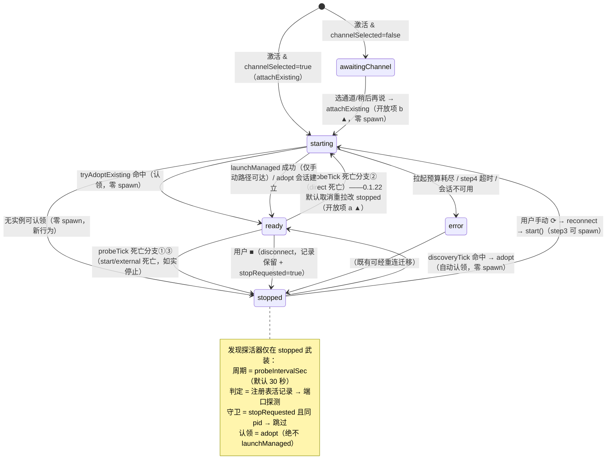

# 0.1.22 设计方案 — 禁用自动启动与定期自动重连

> 版本 1 | 日期 2026-09-10 | 状态：待 QA 设计检查
>
> **修订记录**
>
> | 版本 | 日期 | 变更 |
> |---|---|---|
> | 1 | 2026-09-10 | 初版（本链架构师产出）：用户新策略落档 + 全部关键代码锚点实读核实 + 行为矩阵 + 六项改动点设计 + 四项开放项（a-d，各附默认建议与备选）+ PU-22-* sim 用例设计 + GUI 人工验证步骤 + 红线核对 + 风险登记表 + 实施清单。设计阶段零代码改动（src/、scripts/、package.json 未触碰）。 |

## 零、前置参考

| 文档/代码 | 用途 |
|---|---|
| 用户策略原话（2026-09-10，编排者转述） | 「不用自动拉，可以自动定期尝试重连，也支持手动重连、启动、重启，不用自动启动dsh」 |
| `docs/0.1.21问题分析-多窗口重复拉起dsh与通道切换按钮失效根因与修复方案.md`（v6，已实施入库 commit 6b8f61d/5d23afc） | 本次变更叠加其上；其已落档行为（external 死亡不自动拉起、等锁 60 秒、applyChannel 三分流、快照通道真值、设置面接线）不得回退 |
| `src/extension.ts` | 激活链（L107-390）与 onDidChangeConfiguration（L348-361）实读 |
| `src/runtime.ts` | start() 四步仲裁（L415-558）、三分流死亡分支（L1254-1318）、探活器（L1156-1169）、adopt（L891-955）、disconnect（L1329-1346）、reconnect（L1357-1363）实读 |
| `src/webview.ts` / `src/webviewDetails.ts` / `src/webviewHtml.ts` / `src/panelMessages.ts` | 面板选通道流程（L217-239）、按钮禁用矩阵、停止态文案实读 |
| `src/instance.ts` / `package.json` | 注册表结构（DshRecord）、启动锁、`dsh.autoStart` 配置声明实读 |
| `scripts/sim.mjs` | PU-21 族用例结构（L4807-5300）与既有断言面盘点 |
| `docs/联调测试剧本.md`（v1.9 §0.13） | GUI 剧本收录格式参照 |

## 一、目标/背景分析

### 1.1 用户策略与编排者理解

用户策略（2026-09-10 原话）：**「不用自动拉，可以自动定期尝试重连，也支持手动重连、启动、重启，不用自动启动dsh」**。分解为三条行为规则：

1. **禁止（自动 spawn）**：插件任何代码路径都不得在用户未显式操作时自动产生 dsh 进程。
2. **允许（自动、不 spawn）**：停止态下继续定期探活，发现运行中的 dsh（外部拉起的、或别的窗口手动启动的——经注册表/端口探测）就自动重连认领，不产生新进程。
3. **支持（显式用户操作）**：手动重连（认领运行实例）、手动启动（spawn，多窗口并发时走 `start()` 既有锁仲裁）、手动重启（既有 ⟳ 重连与 `dsh.applyChannel` 通道应用重启，语义不变）。

### 1.2 编排者理解核实结果（与代码对照）

编排者提供的理解已逐条对照本轮实读源码核实，结论如下：

| # | 编排者理解 | 核实结果 |
|---|---|---|
| 1a | 窗口冷启动激活时 `start()` 找不到运行实例会直接拉起 | **成立**。`src/extension.ts` L380-389：`dsh.autoStart`（默认 true）且 `dsh.channelSelected=true` 时激活链调 `void runtime.start()`；`start()` 的 step1（注册表复用，`src/runtime.ts` L453-476）与 step2（配置端口探测，L478-539）都落空时，step3 拿锁即 `launchManaged()` spawn 新实例（L541-548）。有运行实例时现状本就走 adopt 零 spawn——被禁的是「找不到实例才 spawn」的那半段 |
| 1b | 受管直启形态（`launchMode='direct'`）实例死亡后的 bounded relaunch（0.1.21 保留） | **成立**。`src/runtime.ts` L1275-1295 死亡分支②：`recLaunchMode === 'direct' || (rec === null && this.attachedLaunchMode === 'direct')` → 清记录 + `setState('starting')` + `void this.launchManaged()`（无锁自动重拉，0.1.21 用户裁决 O-21-1 的范围边界外、现状保留） |
| 2 | 停止态下继续定期探活（周期沿用既有 30 秒节奏）、发现运行实例自动认领不 spawn | **需新增机制**。现状探活器 `startProbe()`（`src/runtime.ts` L1156-1162）仅在 `state === 'ready'` 时武装（L158 判定），停止态探针已拆除（`stopProbe()`）——停止态下插件对「外部 dsh 后来出现」「其他窗口手动启动完成」完全无感知，只能等用户手动 ⟳。本设计新增停止态发现探活器（§4.2） |
| 3 | 手动重连/启动/重启既有语义不变 | **成立**。⟳（`dsh.restart` → `reconnect()`，`src/runtime.ts` L1357-1363）= 重连优先、无实例才经 `start()` 四步仲裁 spawn（多窗口并发由 step3 启动锁互斥 + step4 等待收敛，PU-21-1 已钉住）；通道应用重启（`dsh.applyChannel` → `applyChannelRestart()`，`src/runtime.ts` L1439-1470）0.1.21 已实施。停止态的可点入口现状已在（⟳ 在 stopped 态不禁用，`src/panelMessages.ts` L63-64；详情卡「重连」按钮，`src/webviewHtml.ts` L321） |

### 1.3 编排者理解未覆盖、设计必须补充的代码事实

| # | 事实 | 出处 | 设计影响 |
|---|---|---|---|
| F-1 | 用户点面板 ■（`dsh.stop` → `disconnect()`）后：注册表 dsh 记录**保留**、dsh 进程**不被杀**、`stopRequested = true`、`this.dshPid` 保留（仅附着记忆 `attachedLaunchMode`/`attachedChannel` 置 null） | `src/runtime.ts` L1329-1346 | 停止态发现探活器**必须带守卫**：否则用户手动停止后，下一个探活周期就会把刚断开的实例自动认领回来，用户停止意图失效（§4.2 守卫设计） |
| F-2 | 状态栏在 stopped 态隐藏（`extension.ts` L191-193 default 分支）；面板 overlay 在 stopped 态只显示英文状态字面量 `stopped`（`src/webviewHtml.ts` L186-189：`st === 'starting' ? '正在启动 dsh…' : st`）；详情卡 stopped 相位按快照 `launchMode` 二分文案（L312-321） | 三处渲染面实读 | 「不自动启动」后 stopped 态成为用户常态画面，状态文案需要重新设计（§4.6）；状态栏保持隐藏不扩大改动面 |
| F-3 | 面板首启选通道（`onChooseChannel`）写设置后立即 `void this.runtime.start()`——「稍后再说」出口同样直接 `start()` | `src/webview.ts` L217-239 | `awaitingChannel` 态的选完即启动是自动 spawn 的一处隐蔽路径（开放项 b 处置） |
| F-4 | `dsh.chooseChannel` 命令（QuickPick 辅助入口）现状只写设置不启动 | `src/extension.ts` L276-292 | 不受本次变更影响 |
| F-5 | `dsh.autoStart` 配置项现状描述为「VSCode 启动时自动启动（第一窗口）或复用（后续窗口）dsh」，默认 true | `package.json` L130-134 | 配置项保留，语义收敛为「启动时自动重连运行中的 dsh（不产生新进程）」，描述随行为更新（§4.1 改动点 1） |
| F-6 | 最后窗口退出时 external 记录「pid 存活则保留 known-external 记录供 re-adopt（F2）」 | `src/runtime.ts` L1532-1543 | 激活链 attachExisting 的 step1 依赖该记录做 re-adopt，链路自洽，无改动 |

## 二、范围分析（做什么、不做什么）

**做**：

1. 激活链去自动拉起：找不到运行实例时进入停止态并武装停止态发现探活，不 spawn（§4.1）。
2. 停止态发现探活机制：低频探测注册表与配置端口，发现运行实例自动认领（复用 adopt，零 spawn），带用户停止守卫（§4.2）。
3. direct 形态死亡自动重拉的取消（开放项 a 裁决联动，默认建议：取消，§4.3）。
4. 面板首启选通道流程的「不自动拉起」形态（开放项 b 裁决联动，默认建议：选完只落设置并立即尝试认领活实例、不 spawn，§4.4）。
5. 手动启动入口盘点与停止态状态文案（§4.5、§4.6）。
6. PU-22-* sim 无头用例设计 + GUI 人工验证步骤（§七、§八）。

**不做**：

1. 不改 `start()` 的四步仲裁结构（step3 启动锁、step4 等待收敛 60 秒预算、入口守卫 `src/runtime.ts` L416）——手动启动/重连路径全部复用既有仲裁。
2. 不改 `reconnect()` 的重连语义（P0-D/ADR-2：永不杀 dsh；⟳ 在 stopped/error 态的既有行为零变化）。
3. 不改 `dsh.applyChannel` 通道应用重启（0.1.21 已落档，语义分离边界不动）。
4. 不改外部 dsh「永不代杀」红线（P0-D/ADR-2）：停止态发现探活只认领、不杀；direct 死亡分支改动不触碰任何杀路径（实例已死，只清记录）。
5. 不改 ADR-21 用户停止判定（start 形态死亡 = 用户停止、不自动拉起、跨窗口防复活）——0.1.21 分支①逐字保留。
6. 不改 0.1.21 已落档行为：external 死亡不自动拉起（分支③）、等锁 60 秒、applyChannel 三分流、快照通道真值、设置面接线。
7. 不为「手动重连」与「手动启动」拆分两个新命令（两者在现状 UI 中共用 ⟳ 入口，语义 =「重连运行实例；无实例时经锁仲裁启动」，§4.5 盘点；是否拆分列开放项 e 供用户裁决，默认不拆）。
8. awaitingChannel 态不武装发现探活（面板选择卡是该态的主交互面；选完通道的认领走 attachExisting 即时路径，见 §4.4）。
9. 本轮只做分析与设计，不改生产代码（实施随开发阶段执行，见 §十二实施清单）。

## 三、行为矩阵（触发场景 × 现状行为 × 0.1.22 目标行为）

> 「自动认领」指停止态发现探活器发现运行实例后经 adopt 转入 ready，全程不调用 `launchManaged()`（spawn 次数为 0）。「带 ▲」的行受开放项裁决影响，表中按默认建议填写，裁决后如有出入随裁决改写。

| # | 触发场景 | 现状行为（0.1.21） | 0.1.22 目标行为 |
|---|---|---|---|
| M-1 | 冷启动激活，已有运行实例（注册表活记录或配置端口活探测） | `start()` step1/step2 认领（adopt，零 spawn） | **不变**。激活链改调 `attachExisting()`，认领路径与现状同源（§4.1）；成功后按 `dsh.autoOpenPanel` 展开面板（与现状一致） |
| M-2 | 冷启动激活，无任何运行实例 | `start()` step3 拿锁后 `launchManaged()` **自动拉起**新实例 | ▲ **停止拉起**：`attachExisting()` 返回失败 → 进入 stopped 态、武装发现探活器；**spawn 次数为 0**。面板/详情卡呈停止态文案「可手动启动/等待外部 dsh」（§4.6）。发现探活器后续发现外部实例时自动认领（M-6） |
| M-3 | 冷启动激活，`dsh.channelSelected=false`（首启未选通道） | `enterAwaitingChannel()`：面板选择卡等待，不启动 | **不变**。选择卡出口行为见 M-10/M-11（开放项 b ▲） |
| M-4 | 外部形态（external 记录）实例死亡 | 死亡分支③：清记录（pid 守卫）+ stopped + 不自动拉起（0.1.21 裁决 O-21-1） | **不变**；新增：进入 stopped 后武装发现探活器——外部 dsh 重新出现（用户在终端重新手跑）→ 自动认领，spawn 次数为 0（M-6） |
| M-5 | 受管直启形态（direct）实例死亡 | 死亡分支②：清记录 + starting + bounded relaunch（无锁自动重拉） | ▲ **取消自动重拉**（开放项 a 默认建议）：清记录 + stopped + 不拉起（与分支③同构清理链），spawn 次数为 0；进入停止态后由发现探活/手动 ⟳ 恢复 |
| M-5b | start 形态（常驻控制台）实例死亡 | 死亡分支①：ADR-21 用户停止（清记录 + stopped，不自动拉起） | **不变**；同样进入停止态并武装发现探活器（发现的只能是新实例，无复活问题） |
| M-6 | 停止态下，外部 dsh 后来出现（用户终端手跑） | **无感知**：探针已拆除，用户手动 ⟳ 后才恢复 | **新增自动认领**：发现探活器经配置端口探测命中（probeState ≠ down + dsh 身份判定）→ adopt external → ready；全程 `launchManaged()` 调用次数为 0 |
| M-7 | 停止态下，其他窗口手动启动成功 | **无感知**（跨进程无推送通道），用户须在本窗口手动 ⟳ | **新增自动认领**：发现探活器读到注册表新记录（pid 存活）→ adopt（managed-own/extension 记录同样认领）→ ready；spawn 次数为 0 |
| M-8 | 停止态 = 用户手动 ■ 断开（stopRequested=true，注册表记录与进程都还在） | 断开即停，无后续动作 | **新增守卫**：发现探活器读到「同一条记录（pid === this.dshPid）」时跳过认领（不自动连回刚断开的实例，rlog 留痕）；记录换成其他 pid（实例换了）或端口上出现新实例时正常认领。用户手动 ⟳ 随时恢复（`reconnect()` 会把 stopRequested 重置为 false，`src/runtime.ts` L1360） |
| M-9 | 手动重连（stopped/error 态点 ⟳ 或详情卡「重连」） | `reconnect()` → `start()` 四步仲裁：有实例认领、无实例拿锁拉起 | **不变**（这是「手动启动」的既有实现：step3 锁仲裁保证多窗口并发收敛单实例，PU-21-1 已钉） |
| M-10 | 面板首启选通道：选了通道 X | 写设置（channel + channelSelected）→ `setChannel` → **自动 `start()`**（无实例时 spawn） | ▲ 改为：写设置 → `setChannel` → `attachExisting()`（**只认领不拉起**）；认领失败 → 进入停止态（发现探活器武装）+ 停止态文案给启动指引（开放项 b，默认建议） |
| M-11 | 面板首启「稍后再说」（chooseChannel=null） | 沿用当前通道**自动 `start()`** | ▲ 改为：`attachExisting()`（只认领不拉起）；失败进停止态（开放项 b，默认建议；`channelSelected` 标志仍不写，下次激活仍会询问——既有语义保留） |
| M-12 | 手动重启（通道应用）：详情卡「立即重启以生效」 | `dsh.applyChannel` → 三分流（非 ready 转 reconnect / managed-own 受控杀重拉 / external 不代杀提示） | **不变**（0.1.21 落档语义） |
| M-13 | 停止态下用户修改通道后点 ⟳ | reconnect → `start()` 以新配置拉起/认领（0.1.21 剧本场景⑤） | **不变**；无实例时 ⟳ = 经锁仲裁启动（「手动启动」语义），有实例时 = 认领（快照通道按注册表真值，待生效判定照常工作） |

## 四、系统设计（改动点清单）

> 模块分层纪律不变：全部新增逻辑落在纯 Node 层（`src/runtime.ts`），vscode 耦合层（`src/extension.ts`、`src/webview.ts`）只做调用与文案；渲染模板改动落在纯模块（`src/webviewHtml.ts`）。

### 4.1 改动点 1：激活链去自动拉起（attachExisting）

**文件锚点**：`src/runtime.ts`（新增公共方法 + 抽取共享私有方法）、`src/extension.ts`（激活链 L377-389）、`package.json`（`dsh.autoStart` 描述）。

**机制设计**：

1. 把 `start()` 现状的 step1（注册表复用认领，L453-476）与 step2（配置端口探测认领，L478-539）原样抽为私有方法 `private async tryAdoptExisting(): Promise<boolean>`——逻辑逐字保留（含 401-aware 判活、residual migration、CIM 身份判定、rlog 行），返回是否完成认领。`start()` 改为调用它：返回 true 即 return（行为不变），返回 false 继续 step3/step4（现状不变）。**`start()` 的行为面逐字节不变**（纯结构抽取，四步仲裁与全部 rlog 锚保留）。
2. 把 `start()` 开头的 per-attach 重置段（L417-449：attached/stopRequested/shutdownDone/lastLaunchMode/attachedLaunchMode/attachedChannel/proxy 会话事实等）抽为 `private beginAttachment(): void`，`start()` 与新公共方法共用——附着记忆防泄漏纪律（0.1.21 改动点 3/5 的 per-attach 规则）对新路径同等生效。
3. 新增公共方法：

```ts
/** 0.1.22：只附着、不拉起（激活链与选通道流程用）。返回是否已处于附着/就绪。 */
async attachExisting(): Promise<boolean> {
  if (this.attached || this.state === 'ready') return true
  this.beginAttachment()
  this.setState('starting')
  rlog(`attachExisting: window ${this.options.windowPid} (port=${this.options.port} channel=${this.options.channel}) — attach-only, no launch`)
  const adopted = await this.tryAdoptExisting()
  if (adopted) return true
  // 无实例可认领：如实进入停止态（不 spawn），由停止态发现探活接力（§4.2）。
  this.stopProxy()
  this.setState('stopped')
  rlog('attachExisting: no running dsh found; entering stopped (no auto-launch per user policy 2026-09-10)')
  return false
}
```

4. `src/extension.ts` 激活链（L380-389）改造：`channelSelected` 为 true 时 `void runtime.start()` 改为 `void runtime.attachExisting().then(...)`——then 回调既有判断（`cfg.autoOpenPanel && runtime?.state === 'ready'` 时 `openPanel()`）不变：激活时立即认领成功仍会自动展开面板（与现状一致）；认领失败（停止态）不展开面板，等待发现探活自动认领（此时**不**自动展开面板，状态栏与面板可见即用——自动认领到达 ready 的时刻在激活链之外，若随后自动弹面板反而打断用户，行为面保持最小）。
5. `dsh.autoStart` 配置项保留、默认值 true 不变、语义收敛：「VSCode 启动时自动重连（复用）运行中的 dsh，不自动启动新实例」。`autoStart=false` 语义不变（激活链完全不动作，连自动认领也不做）。
6. **发现探活器的武装点统一挂在 `setState('stopped')`**（§4.2 第 1 条），因此 M-2 的「激活链附着失败进停止态」无需在 extension 层额外接线。

### 4.2 改动点 2：停止态发现探活机制（自动重连，零 spawn）

**文件锚点**：`src/runtime.ts`（新定时器 + tick 方法 + setState 挂钩）。

**机制设计**：

1. **生命周期**：新增独立定时器字段 `discoveryTimer` 与防重入标志 `discoveryInFlight`。武装/拆除**统一挂在 `setState()` 内**（不逐落点手工调用，防遗漏）：

```ts
private setState(s: RuntimeState): void {
  if (this.state === s) return
  const prev = this.state
  this.state = s
  // 0.1.22：发现探活器生命周期严格绑定 stopped 态——进入即武装、离开即拆除。
  if (s === 'stopped') this.startDiscoveryProbe()
  else this.stopDiscoveryProbe()
  rlog(`state: ${prev} -> ${s}${this.errorMessage ? ` (error: ${this.errorMessage})` : ''}`)
  this.emit('state', s)
}
```

   `dispose()` 同步拆除（L1568-1572 补一行）。`startDiscoveryProbe()`/`stopDiscoveryProbe()` 形态与既有 `startProbe()`/`stopProbe()`（L1156-1169）同构。

2. **周期**：沿用 `this.options.probeIntervalSec`（默认 30 秒；开放项 c 建议沿用、不新增配置项）。`probeIntervalSec=0`（既有「关闭探活」语义）时发现探活一并关闭，配置语义保持单一。
3. **tick 判定与认领路径**（`private async discoveryTick(): Promise<void>`）：

```
discoveryTick():
  若 state !== 'stopped' 或 discoveryInFlight → return（防重入；adopt 是异步链，认领在途时不重复发起）
  discoveryInFlight = true
  try:
    候选发现（与 start() step1/step2 同源判定，顺序：注册表优先、端口探测兜底）：
      a) inst = readInstance()；dshAlive(inst) 为真 → 候选 = 注册表记录（port/pid/managedBy 取记录值）
      b) 否则配置端口 > 0 且 probeState(端口) ≠ 'down' → 复用 step2 的身份判定
         （resolvePortPid + processCommandLine + looksLikeDsh；CIM 不可用时按页签特征记录 holder pid，
         L522-528 既有兜底同型）→ 候选 = external 认领
      c) 都未命中 → return（保持停止态，等下一周期）
    用户停止守卫（F-1）：stopRequested === true 且候选 pid === this.dshPid
      → rlog('discovery: skip re-adopting the manually detached instance (same pid); reconnect manually')
      → return（不认领，等用户手动 ⟳ 或实例更换）
    认领：beginAttachment()（per-attach 重置）→ setState('starting')（可见过渡）
      → await this.adopt(候选 port, 候选 pid, 候选 managedBy, probeKind, 记录)
        —— adopt 落点内部完成会话建立（token/C 路径）、快照装配、setState('ready')，
           与 start() step1/step4 的认领完全同一条落点链（L891-955）
      → await this.writeRegistry() → this.startProbe()（存活探活武装；
        setState('ready') 已由挂钩自动拆除发现探活器）
  finally:
    discoveryInFlight = false
```

4. **零 spawn 红线**：`discoveryTick` 的认领路径**只允许到达 `adopt()`**，结构性不触达 `launchManaged()`（认领失败不重试拉起，下一周期重新判定）。这是「自动、不 spawn」规则在代码结构上的落点，PU-22-4 用断言钉住。
5. **守卫语义澄清（M-8 场景）**：守卫条件是「本窗口主动断开（stopRequested=true）且候选就是刚断开的那个 pid」。窗口 A 手动停止后其他窗口用同一实例 → A 跳过（尊重本窗口的停止操作）；实例死亡后换了新实例（pid 不同）或外部重新手跑 → 正常认领。ADR-21 用户停止（M-5b）进入停止态时实例已死、注册表记录已清，探活器无可认领对象，不存在复活问题。
6. **与既有存活探活器的语义分离**：不改造 `probeTick()` 复用（否决方案）。理由：`probeTick` 的失败计数（`probeFailures`）、401 分流、判死阈值都是「存活探测」语义；发现探测是「发现即认领」语义，无失败累计、无阈值。两套语义混进一个 tick 会让计数器与状态守卫互相纠缠（语义分离纪律，工程基线第 3 条）。代价是新增一个定时器字段与一个 tick 方法（增量约 60 行），换来两条探测链各自独立可测。
7. **性能面**：每周期（默认 30 秒）至多一次注册表文件读 + 一次 TCP 探测（配置端口）+ 探测命中时一次 netstat 与一次 CIM 查询（15 秒上限，`processCommandLine` 既有预算）。常态（无实例）只有文件读 + 一次立即失败的本机 TCP connect，开销可忽略；「配置端口被非 dsh 程序长期占用」的环境下每周期一次 CIM 查询属可接受上限（该场景本身是 ADR-1 端口回落的既有边界，风险 R-2 登记）。认领成功后恢复 ready 态既有探活节奏，无新增常驻开销。

### 4.3 改动点 3：direct 形态死亡取消自动重拉（开放项 a ▲，默认建议：取消）

**文件锚点**：`src/runtime.ts` 死亡分支②（L1275-1295）。

**默认建议（取消，与新策略一致）**：分支②从「清记录 + starting + `void this.launchManaged()`」改为「清记录（pid 守卫共用）+ 清理链 + `setState('stopped')` + 不拉起」，清理链与分支③同构（`refreshLaunchInfo({kind:'disconnect'})`、`dshPid`/`port`/`url` 清空、`stopProxy()`、`stopProbe()`、附着记忆置 null），rlog 独立注明（`probe: direct-mode dsh died; not auto-relaunching (user policy 2026-09-10); reconnect manually`）。进入 stopped 后发现探活器自动武装——其他窗口手动拉起的新实例会被本窗口自动认领。**ADR-21 分支①（start 形态用户停止）逐字不动。**

三分流结构变化：分支②与分支③在「不拉起」后行为同构（差异只剩 rlog 锚与快照降级档），实现上可合并为「非 start 形态一律如实停止」，但保留两条 rlog 以便日志判读 direct 与 external 的死亡来源——是否合并由开发专家按实现最简取舍，行为面以本节为准。

**备选（不采纳时）**：分支②现状保留（bounded relaunch）。该备选与用户策略「不用自动拉」直接冲突，列为备选仅供用户否决默认建议时使用。若维持现状，M-5 行为不变、PU-22-6 用例改为钉现状、风险 R-3 撤销。

**行为影响如实声明**：取消后 dsh 进程崩溃不再自愈（0.1.6 时代以来的「崩溃自动恢复」体验回退为「如实停止 + 手动 ⟳」），联调剧本场景 C（崩溃自动恢复）的预期需同步改写。这是新策略的直接后果，不是缺陷。

### 4.4 改动点 4：面板首启选通道不自动拉起（开放项 b ▲，默认建议：选完只落设置 + 立即尝试认领活实例）

**文件锚点**：`src/webview.ts` `onChooseChannel`（L217-239）。

**默认建议**：选完通道（或「稍后再说」）后的 `void this.runtime.start()` 改为 `void this.runtime.attachExisting()`：

- 选了通道 X：写设置顺序不变（`dsh.channel` → `dsh.channelSelected`，PP-10-4 顺序断言保留）→ `setChannel(X)` → `attachExisting()`——已有运行实例（外部手跑的、别的窗口启动的）就立即认领（零 spawn，用户不用等一个探活周期）；没有实例就进停止态，面板呈「已选择 X 通道」的停止态文案 + 启动指引（点 ⟳ 启动）。
- 「稍后再说」：同样 `attachExisting()`（认领活实例则 ready；否则停止态）；`channelSelected` 不置位的既有语义保留（下次激活仍会询问）。
- 语义澄清：「先选择通道、后启动dsh」（ADR-29-④）在「不自动启动」语义下重述为「**先选择通道、后连接**；启动一律显式」——选择结果的写入时序不变，被移除的只是「选择完成即产生新进程」这半段。

**备选**：① 选完只落设置、完全不做认领（连活实例也不认领，等发现探活器一个周期后自动连）——更保守，但多一次 30 秒量级等待，不推荐；② 维持现状（选完自动 `start()` 可能 spawn）——与策略冲突。另：「稍后再说」若维持旧语义（直接 `start()`）会绕过「不自动启动」，必须随默认建议一并改，不接受单独保留。

**受影响既有断言**：PU-9-2（选择流程调用序）、PP-10-4/10-5（写入时序与 setChannel 链）需按新语义核对改写，随 PU-22 用例批次由测试专家处置（§七）。

### 4.5 改动点 5：手动启动入口盘点与落点（结论：入口不缺，补文案）

**现状入口盘点**（停止态可操作的全部「重连/启动」面）：

| 入口 | 位置 | 停止态可用性 | 语义 |
|---|---|---|---|
| 面板工具栏 ⟳ | `src/webviewHtml.ts` L101/L194；`src/panelMessages.ts` L63-64（stopped 态 `restart: false` = 可点） | **可点** | `dsh.restart` → `reconnect()` → `start()`：有实例认领、无实例经锁仲裁启动（多窗口并发收敛，PU-21-1） |
| 详情卡「重连」按钮 | `src/webviewHtml.ts` L321（stopped 相位） | 可点 | 同上 |
| 详情卡「重试（重启 dsh）」 | `src/webviewHtml.ts` L311（error 相位） | —（error 态） | 同上 |
| 命令面板 DSH: Restart Runtime | `package.json` L70-72 | 可用 | 同上 |
| 命令 DSH: 选择 dsh 通道 | `package.json` L86-88 | 可用 | 仅选通道，不启动（不变） |

**结论**：停止态的「手动启动」入口已经存在且语义完备——⟳ 在无实例时的行为就是「经启动锁仲裁启动新实例」，在多窗口并发下收敛到单实例（既有验收形态）。**不新增命令、不新增按钮**。补的是可发现性（现状用户看不出 ⟳ 能启动）：

1. 停止态 overlay 文案直接指引（§4.6 文案 1）。
2. 命令面板 title 维持 DSH: Restart Runtime 不改（改名会破坏既有文档/剧本引用；面板 title tooltip「Restart runtime」同理保留）。
3. 「重连」与「启动」不拆分为两个入口（开放项 e，默认不拆——⟳ 的 reconnect 语义 = P0-D/ADR-2 既定语义，0.1.20/0.1.21 两轮验收已钉住；拆分会新增一个与 ⟳ 完全同路径的命令，语义重复）。

### 4.6 改动点 6：停止态状态文案

**文件锚点**：`src/webviewHtml.ts`（面板 overlay `applyState` L186-189、详情卡 stopped 相位 L312-321）。文案风格对齐既有单点（「正在启动 dsh…」「请选择 dsh 通道」）。

1. **面板 overlay（stopped 态）**：现状显示英文状态字面量 `stopped`，改为中文两行：

```
dsh 已停止
点上方工具栏 ⟳ 启动或重连；检测到运行中的 dsh 会自动连接
```

（一行说手动路径、一行说自动重连；不加子态判定逻辑——开放项 d 默认建议。）

2. **详情卡 stopped 相位**：既有二分文案保留（「已按您的操作停止（常驻控制台窗已关闭即停止 dsh）」/「已断开（dsh 进程未停止或异常退出）」），muted 提示行后追加一行「检测到运行中的 dsh 实例时会自动连接」。
3. **状态栏**：stopped 态维持隐藏（现状 L191-193），不扩大渲染面。
4. **starting 态文案「正在启动 dsh…」不动**：starting 态现在承载两种子语义（spawn 启动与 adopt 认领），「正在启动 dsh…」对认领场景可读（认领属启动流程的一部分），不区分子态、不动文案、不新增断言面。

### 4.7 状态机与发现探活生命周期（Mermaid）



## 五、可行性 / 可维护性 / 性能分析

**技术可行性**：全部改动为既有模式复用——`tryAdoptExisting` 是 `start()` step1/step2 的逐字抽取（不改逻辑）；发现探活器复用 `startProbe()/stopProbe()` 同型定时器模式与 `adopt()` 既有落点（认领链零新代码，只有调用编排）；`attachExisting` 复用 `beginAttachment` 的 per-attach 重置。无新依赖、无新配置项（探活周期复用 `dsh.probeIntervalSec`）、无注册表结构变更。激活链、选通道流程的改动各为单点替换调用。技术可行性无未知项。

**可维护性**：① 「拉起只发生在显式路径」——改动后 `launchManaged()` 的调用面收敛为：`start()` step3（手动 ⟳/手动启动的锁赢家）、`forceRelaunchManaged` 骨架（`dsh.applyChannel` 受管链）、（开放项 a 采纳后）死亡分支彻底不再调用 `launchManaged()`——「自动路径零 spawn」从纪律变成结构事实，`grep launchManaged` 可审计。② 发现探活与存活探活语义分离（§4.2 第 6 条），两条探测链独立演化互不牵连。③ 行为矩阵（§三）作为验收单一事实源，实施/测试/验收三方对照同一张表。

**性能分析（定量指标）**：

| 指标 | 现状 | 0.1.22 目标 |
|---|---|---|
| 冷启动无实例时的 spawn | 1 次（自动拉起） | **0 次**（停止态 + 发现探活） |
| 停止态发现运行实例的时延 | 无能力（需手动 ⟳） | ≤ 1 个探活周期（默认 ≤ 30 秒）+ 认领会话建立耗时（与 start() step1 同量级） |
| 停止态空闲开销 | 0（探针拆除） | 每周期 1 次注册表文件读 + 1 次本机 TCP connect（失败即返回）；端口被非 dsh 占用时加 1 次 netstat + 1 次 CIM（15 秒上限，R-2） |
| direct 死亡恢复时延 | 自动重拉链（判死后立即启动，含 npx 冷启动可达数分钟） | 用户操作时刻 + 启动链（手动 ⟳；或等待其他窗口/外部拉起后 ≤ 30 秒自动认领） |
| 多窗口同时手动启动 | step3 锁仲裁 + step4 收敛（PU-21-1 验收） | 不变 |

## 六、开放项（交用户裁决，每项给默认建议与备选）

| 编号 | 问题 | 默认建议 | 备选 |
|---|---|---|---|
| O-22-a | direct 形态死亡自动重拉（bounded relaunch）是否一并取消？ | **取消**（§4.3）：与新策略「不用自动拉」一致；实例死亡后如实停止、由用户手动 ⟳ 或等待其他实例出现后自动认领。影响：崩溃自愈体验回退为手动恢复（如实告知） | 保留现状（bounded relaunch）——与「不用自动启动dsh」直接冲突，仅作否决项备选；若保留，建议后续至少接入启动锁仲裁以消除多窗口并发重拉竞态（0.1.21 R-9 遗留） |
| O-22-b | 面板首启选通道流程在「不自动启动」下的形态：选完通道是否自动启动？ | **选完只落设置 + 立即 `attachExisting()`（认领活实例，零 spawn），失败进停止态并给启动指引**（§4.4）——认领不产生新进程，符合「自动、不 spawn」规则，体验损失最小；「稍后再说」同改 | ① 选完只落设置、完全不动作（等发现探活器下周期自动连，多等一个周期）；② 维持现状选完即 `start()`（可 spawn，与策略冲突） |
| O-22-c | 停止态探活周期是否沿用 30 秒（`dsh.probeIntervalSec`）？ | **沿用**，不新增配置参数（去硬编码纪律：一个配置项承载同族节奏；`probeIntervalSec=0` 时发现探活一并关闭，语义单一） | 新增独立配置项 `dsh.discoveryIntervalSec`（仅当用户需要「存活探活慢、自动重连快」之类的不对称节奏时才有价值；默认不建议，避免配置面膨胀） |
| O-22-d | 「等待外部 dsh」与「实例已停止」两种停止子态是否区分展示？ | **不新增子态**（不加 RuntimeState 成员）：停止态文案统一为「已停止 + ⟳ 启动/重连指引 + 自动连接说明」一句话覆盖（§4.6）；子态差异（注册表有无 external 记录）对用户的行动指引没有差别——有实例会自动连，没实例点 ⟳ | 区分展示：渲染层读注册表记录（有 external 活记录 → 「已连接到外部 dsh 的窗口已断开，将自动重连」；无记录 → 「dsh 未运行，可手动启动」）——边际价值低（发现探活器会让「有实例却停着」的窗口期 ≤ 30 秒），且增加渲染层对注册表的直接读取 |
| O-22-e（盘点补充） | 是否把「手动重连」与「手动启动」拆成两个独立命令/按钮？ | **不拆**（§4.5）：⟳ 的 reconnect 语义（有实例认领、无实例经锁仲裁启动）已是「重连或启动」的合一入口，两按钮会同路径重复 | 拆分：新增「DSH: 启动 dsh」命令（强制造 spawn 语义）——但会引入「重连按钮点了不启动、启动按钮在已有实例时怎么办」的新语义分支，违背语义分离初衷，不推荐 |

## 七、sim 无头用例设计（PU-22-*，测试专家执行）

> 编号沿用 PU-21 同款结构（前置 / 动作 / 断言 / 来源）。spawn 计数消费 0.1.21 已落地的 `RuntimeOptions.dshProcessFactory` 注入 seam（实施清单第 8 项已实施，sim L4842-4860 同型）；死亡判死用真实死 pid（PU-21-2..5 同型）；发现探活直驱 `discoveryTick()`（PP-8-3 probeTick 直驱同型）；数据目录 `DSH_VSCODE_DATA_DIR` 隔离。

| 用例 | 层 | 前置 | 动作 | 断言 | 来源 |
|---|---|---|---|---|---|
| PU-22-1 激活附着失败零 spawn（M-2 主断言） | 纯 Node（DshRuntime，mock 端口探测/注册表空） | 全新数据目录、注册表无记录、配置端口无监听（mock probeState 恒 down） | 调 `attachExisting()` | 返回 false；spawn 计数 = 0（工厂 seam）；state='stopped'；注册表 dsh 记录为 null（不写入）；日志含 `attachExisting` 锚与「no running dsh found」锚；无任何 `launchManaged: detached launch` 行；发现探活器已武装（discoveryTimer 非 null） | §4.1、§三 M-2 |
| PU-22-2 停止态发现自动认领（M-6/M-7 主断言） | 纯 Node | PU-22-1 终态；随后注入运行实例证据（场景 A：注册表活记录 managed-own；场景 B：注册表空 + 端口探测 mock 命中 + looksLikeDsh 真） | 直驱 `discoveryTick()` | 两场景均：state='ready'；port/pid 与证据一致；spawn 计数 = 0（全程零 `launchManaged`）；快照装配（external 场景 attachedChannel=null 诚实缺省，沿用 PU-21-10 口径）；发现探活器已拆除且存活探活器已武装（两 timer 互斥）；注册表写入本窗口 | §4.2、§三 M-6/M-7 |
| PU-22-3 用户停止守卫（M-8 主断言） | 纯 Node | 活实例认领（ready）→ `disconnect()`（stopRequested=true、dshPid=X、注册表记录 pid=X 保留） | 直驱 `discoveryTick()`（候选 = 同 pid 记录）→ 换注册表记录为 pid=Y 活记录再 `discoveryTick()` | 第一次：state 保持 stopped、不认领、日志含 skip 锚（discovery: skip re-adopting the manually detached instance）；第二次：认领成功转 ready、spawn 计数 = 0 | §4.2 守卫、§三 M-8 |
| PU-22-4 零 spawn 红线汇总断言 | 纯 Node | 汇总 PU-22-1/2/3 的 spawn 计数 | — | 全部停止态自动路径（附着失败、发现认领、守卫跳过）`launchManaged` 调用总数 = 0（结构性红线：发现探活路径代码不含 launchManaged 调用，静态 + 动态双断言） | §4.2 第 4 条 |
| PU-22-5 多窗口手动启动收敛（衔接断言） | 纯 Node（DshRuntime ×2，PU-21-1 骨架复用） | 两实例 attachExisting 失败（双双 stopped，衔接 PU-22-1） | 两实例各自调 `start()`（模拟多窗口同时手动启动） | 恰 1 次 spawn（锁赢家）、两实例 ready 于同一 port/pid、windows[] 两条——与 PU-21-1 断言同型，验证「停止态 → 手动启动」的衔接链路无回归 | §三 M-9、PU-21-1 同型 |
| PU-22-6 direct 死亡如实停止（开放项 a ▲） | 纯 Node | direct 记录（launchMode='direct'）+ 真实死 pid | probeTick 阈值到达 ×3 | 若 a 裁决取消：spawn 计数 = 0、state='stopped'、注册表记录清空（pid 守卫）、日志含「not auto-relaunching」direct 锚、发现探活器武装；若裁决保留：本用例改为钉现状（starting + 恰 1 次 launchManaged），随裁决二选一落稿 | §4.3、§三 M-5 |
| PU-22-7 start 死亡后停止态不复活（ADR-21 回归） | 纯 Node | start 记录死亡（分支①）处置完成（stopped、记录清空） | 直驱 `discoveryTick()`（注册表空、端口无探测命中） | state 保持 stopped、spawn 计数 = 0（无实例可认领时发现探活器静默等待）；随后写入新活记录再 tick → 认领（区分「无对象」与「有对象认领」两分支） | §三 M-5b、M-7 |
| PU-22-8 发现探活器生命周期 | 纯 Node | 任意运行态实例 | 依次触发：setState('stopped')（武装）→ 认领成功 setState('ready')（拆除）→ dispose()（拆除）→ probeIntervalSec=0 构造（永不武装） | 武装/拆除与状态机严格同步：stopped 态 discoveryTimer 非 null、离开 stopped 即 null；dispose 后 null；probeIntervalSec=0 时 stopped 态 discoveryTimer 为 null（如实关闭）；防重入：discoveryTick 在途时再次调用为 no-op（discoveryInFlight 守卫） | §4.2 第 1/2 条 |
| PU-22-9 选通道不自动拉起（开放项 b ▲） | 纯 Node + 静态断言 | 模拟 onChooseChannel 落点（vscode 层无法无头直测，静态锚兜底） | 源码静态断言（E-SIM-1 同型）：`src/webview.ts` onChooseChannel 体内含 `attachExisting`、不含裸 `this.runtime.start()` 调用；runtime 层 attachExisting 失败落点 setState('stopped') 断言（并入 PU-22-1） | 静态锚命中；「先选择通道、后附着」顺序注释与 rlog 锚在案 | §4.4、§三 M-10/M-11 |
| PU-22-10 停止态文案与接线静态断言 | 纯 Node（静态断言） | — | buildPanelHtml stopped 态产物 HTML includes 断言 + buildDetailsHtml stopped 相位断言 + package.json/extension.ts 静态核对 | overlay 含「dsh 已停止」与「⟳ 启动或重连」指引文案；详情卡停止相位含「自动连接」提示行；`buttonDisableRules('stopped')` 的 ⟳ 仍可点（回归钉）；`dsh.autoStart` 描述含「不自动启动」语义（若实施描述更新） | §4.5、§4.6 |

**既有回归核对清单（必须保持绿 / 需同步改写项）**：

| 类别 | 用例 | 处置 |
|---|---|---|
| 零回退（保持绿） | PU-21-1～12 全族（多窗口收敛、三分流、pid 守卫、applyChannel 三分流、快照真值、消息白名单） | 保持绿；其中 PU-21-5（external 死亡不拉起）、PU-21-1（手动重连收敛）语义不变 |
| 行为变更改写（sanctioned，随实现同步） | PP-2-6（start-mode death = user stop vs **direct relaunch**）：direct 分支断言按开放项 a 裁决改写（取消 → 断言 stopped + 零 spawn；保留 → 现状断言不动） | 测试专家按裁决执行 |
| 行为变更改写（sanctioned） | PU-9-2（选通道写设置与启动调用顺序断言）：`start()` → `attachExisting()` 后调用序断言同步 | 测试专家按裁决执行 |
| 核对不回退 | PP-8-3（probeTick 直驱）、PP-10-4/10-5（写设置时序）、PU-10-2②（pending 按钮）、P0-I 族（激活面）、锁原语族 | 保持绿；激活链改动后复跑核对 |

## 八、GUI 人工验证步骤（联调剧本收录，建议作为 §0.14）

> 覆盖行为矩阵中无法无头验证的部分（真实 VSCode 多窗口、真实外部 dsh 生命周期、真实首启流程）。格式沿用剧本 §0.13（步骤 → 判定点表 → 取证命令 → 回填表）。预计 ≈ 30-45 分钟。

**前置（一次性）**：安装含 0.1.22 产物的 VSIX；清残留（完全退出 VSCode、清 `instance.json`/`startup.lock`、结束残留 dsh/node 进程）；`dsh.probeIntervalSec` 确认（默认 30，自动认领等待按此估算）；探针间隔 × 周期 = 判死/认领等待量级记录在案。

**场景 A：冷启动无实例 = 停止态 + 零 spawn（M-2）**

| # | 操作 | 预期 |
|---|---|---|
| A-1 | 无外部 dsh、注册表已清，打开 VSCode | 面板呈停止态（overlay 显示「dsh 已停止」与 ⟳ 指引文案，不再是英文 `stopped`）；状态栏无 DSH 项（stopped 隐藏，既有行为） |
| A-2 | 等待 ≥ 2 个探活周期（≥ 60 秒），核对任务管理器与端口 | 全程 **0 个 dsh 进程**、`netstat` 3080 无 LISTENING；`runtime.log` 无 `launchManaged: detached launch` 行；有 `attachExisting` 与「no running dsh found」锚行 |
| A-3 | 点面板工具栏 ⟳ | 经锁仲裁正常启动（既有手动路径），面板回 ready |

**场景 B：停止态发现外部 dsh 自动认领（M-6）**

| # | 操作 | 预期 |
|---|---|---|
| B-1 | 场景 A 结束后（停止态，无实例）→ 终端手跑 `npx @deepseek-ai/dsh web`（3080） | 终端打印就绪地址 |
| B-2 | 等待 ≤ 1-2 个探活周期（≤ 60 秒），不操作面板 | 面板**自动**恢复 ready 并显示 dsh UI；`runtime.log` 有 adopt 行、**无** launchManaged 行（零 spawn）；注册表 `managedBy:"external"`、windows 含本窗 |

**场景 C：手动 ■ 停止后不自动连回 + 换实例后自动认领（M-8）**

| # | 操作 | 预期 |
|---|---|---|
| C-1 | ready 态点面板 ■（disconnect） | 面板停止态；dsh 进程仍存活（client 语义，既有）；注册表记录保留 |
| C-2 | 等 ≥ 2 个探活周期 | 面板保持停止态（守卫生效，不自动连回刚断开的实例）；`runtime.log` 含 skip 锚行（discovery: skip re-adopting…） |
| C-3 | 终端杀掉该 dsh → 再手跑一个新 dsh（新 pid）→ 等 ≤ 2 个探活周期 | 面板自动认领新实例回 ready（pid 与新实例一致）；零 spawn |
| C-4 | 点 ⟳（停止态手动重连） | 立即重连认领（stopRequested 已被 reconnect 重置，既有语义） |

**场景 D：多窗口——其他窗口手动启动，本窗口自动认领（M-7）**

| # | 操作 | 预期 |
|---|---|---|
| D-1 | 两窗口均停止态、无实例（衔接场景 A 终态 + 第二窗口） | 两窗口均停止态、零进程 |
| D-2 | 窗口 B 点 ⟳ 启动（等待 ready） | 窗口 B 正常启动（锁赢家） |
| D-3 | 窗口 A 不操作，等 ≤ 2 个探活周期 | 窗口 A 面板自动回 ready、指向同一端口；`tasklist` 恰 1 个 dsh 进程；窗口 A 的 `runtime.log` 认领段零 launchManaged |

**场景 E：direct 死亡如实停止（开放项 a ▲；裁决取消时执行）**

| # | 操作 | 预期 |
|---|---|---|
| E-1 | 设置 `dsh.consoleVisible=false` → ⟳ 以 direct 形态启动 → ready → 终端 `taskkill /F` 杀 dsh | — |
| E-2 | 等待判死（间隔 × 3 ≈ 1.5-3 分钟） | 面板如实停止态；**无自动重拉**（无新进程、无新 dsh 日志文件）；`runtime.log` 含「not auto-relaunching」direct 锚；随后手动 ⟳ 可恢复 |

**场景 F：首启选通道不自动启动（开放项 b ▲；裁决采纳时执行）**

| # | 操作 | 预期 |
|---|---|---|
| F-1 | 清 `dsh.channelSelected`（设置里改回 false）+ 清注册表 + 无实例 → 重载窗口 | 面板呈通道选择卡（awaitingChannel，既有） |
| F-2 | 选一个通道 | 设置写入成功（`dsh.channel`=所选、`channelSelected`=true）；**不自动拉起**（无新进程）；面板进停止态 + 启动指引文案（含「已选择 X 通道」语义或通道名可从设置核） |
| F-3 | 点 ⟳ | 以所选通道启动（注册表 channel 字段 = 所选通道，版本与 dist-tag 对照） |
| F-4 | 回归：0.1.21 剧本 §0.13 场景①②③④⑤ 复跑 | 全部保持通过（0.1.21 落档行为零回退） |

**回填表与通过判据**：按 §0.13 同款格式（用例 × 判定点 × PASS/FAIL × 证据）；通过判据 = 场景 A/B/C/D 全 PASS +（按裁决）场景 E/F 全 PASS + 场景 F-4 的 0.1.21 回归全绿；场景 C-2 的「不自动连回」若失败 = 用户停止语义失效，最高优先级回环。失败归档（取证原文 + 截图）交编排者/用户裁决，不判用户操作失败。

## 九、红线核对

| 红线 | 核对结论 |
|---|---|
| 外部 dsh 永不代杀（P0-D/ADR-2） | **不触碰**。发现探活器只读探测与 adopt 认领，无任何杀路径；direct 死亡分支改动（§4.3）只清记录不杀进程（实例已死）；`forceRelaunchManaged`/`applyChannelRestart` 的既有杀面（managed-own 例外面）不动 |
| ADR-21（start 形态死亡 = 用户停止，不自动拉起） | **逐字保留**（死亡分支①不动，含跨窗口防复活记忆判定）；新增强化：停止态发现探活器对「无对象」场景静默等待（PU-22-7），start 形态用户停止后不会被任何自动路径复活 |
| ADR-1（端口回落） | **不动**。手动启动走 `start()` 既有 `resolveLaunchPort` 单点决策；发现探活不产生端口决策（只探测不绑定） |
| 语义分离（重连/启动/重启三命令语义不混） | `dsh.restart`（⟳）= 重连优先、无实例时经锁仲裁启动（reconnect 既有语义，文档表述更新为「启动或重连」但代码语义零变化）；`dsh.applyChannel` = 通道应用重启（0.1.21 语义）；不新增第三语义入口（开放项 e 默认不拆）。发现探活器是「自动重连」，与手动命令共享 `adopt()` 落点但独立触发路径，不借用任何命令语义 |
| 语义分离（自动路径与显式路径） | 自动路径（激活附着、发现认领、死亡处置）结构性不含 `launchManaged()` 调用（PU-22-4 静态 + 动态双断言）；`launchManaged()` 只能被 `start()` step3（用户显式 ⟳/启动）与受控重拉骨架触达 |

## 十、风险登记表

| # | 风险 | 影响 | 缓解 | 责任人 |
|---|---|---|---|---|
| R-1 | direct 死亡取消自动重拉后，dsh 崩溃不再自愈 | 体验回退：dsh 意外退出后需手动 ⟳（或等其他窗口拉起后 ≤ 30 秒自动认领） | 用户策略的直接后果（开放项 a 默认建议），GUI 场景 E 验收 + 文案如实呈现停止态；若用户裁决保留 direct 重拉则本风险撤销 | [架构师]（裁决记录）；[测试专家] 场景 E |
| R-2 | 停止态发现探活的开销：配置端口被非 dsh 程序长期占用时，每周期一次 netstat + 一次 CIM 查询（15 秒上限） | 低配环境下周期性 CPU/IO 尖峰（每 30 秒一次，量级毫秒-秒） | 判定顺序注册表优先（常态零 CIM）；端口探测先于身份判定（down 即止）；CIM 仅在探测命中后进行；如实测有感，备选方案为发现探活周期加倍或降级为「仅注册表判定」（列开放项 c 备选联动，默认不实施） | [开发专家] 实现；[测试专家] PU-22-8 断言 |
| R-3 | 用户停止守卫漏场景：stopRequested + 同 pid 判定之外的新形态（如 dshPid 为 null 的断开残留） | 理论上可能把用户刚停止的实例自动连回 | `disconnect()` 保留 dshPid（实读 L1329-1346 确认不清空），守卫条件成立；dshPid=null 时无「刚停止的 pid」可比对，按认领处理（此时无从判定用户意图，自动认领符合「发现即共享」模型）；PU-22-3 断言钉住主形态 | [开发专家]；[QA] 代码审计关注 |
| R-4 | 首启体验变化：选完通道不自动启动（开放项 b） | 新用户选完通道面对停止态，可能困惑「为什么没启动」 | 停止态文案给明确 ⟳ 指引（§4.6）；发现探活器兜底认领活实例；GUI 场景 F 验收引导链完整 | [开发专家] 文案；[测试专家] 场景 F |
| R-5 | 停止态自动认领的窗口期渲染：认领经 starting 过渡（session 建立），面板短暂显示「正在启动 dsh…」 | 用户在停止态看到「正在启动」文案但并没有人拉起进程，可能误读 | 文案不改（starting 态承载启动/认领双语义已如实评估，§4.6 第 4 条）；认领链与 start() step1 同量级（秒级），窗口期短；如反馈困惑，后续可细分 starting 文案（另行立项，不随本轮） | [架构师]（登记）；[QA] GUI 验证观察 |
| R-6 | 既有断言迁移面：PP-2-6（direct relaunch）、PU-9-2（选通道调用序）等随裁决改写 | 改写遗漏导致 sim FAIL 或断言与新行为不符 | §七回归核对清单逐项列出；测试专家按裁决执行并复跑全量 | [测试专家] |
| R-7 | 激活链改动波及面：`start()` 结构抽取（tryAdoptExisting/beginAttachment）若引入行为漂移 | 激活/重连路径回归 | 抽取纪律 = 逐字搬移 + rlog 锚逐字保留；PU-21 族 + P0-I 族 + 锁原语族全量复跑；PU-22-5 衔接断言 | [开发专家] 实现；[测试专家] 回归；[QA] 代码审计重点 |

## 十一、决策记录

| # | 决策 | 理由 |
|---|---|---|
| DR-22-1 | 自动路径（激活附着、停止态发现认领）与显式路径（⟳ 手动启动）共用 `adopt()` 单一落点，发现探活不新写认领代码 | 认领会话建立（token/C 路径/快照/注册表）只此一处，双实现必然漂移；`tryAdoptExisting` 抽取后三条路径（自动附着、手动 start、发现认领）共享同一发现判定 |
| DR-22-2 | 发现探活器独立于既有存活探活器（不改造 probeTick） | 存活探测（失败计数/401 分流/判死阈值）与发现探测（发现即认领）是两种语义；混用会让计数器与守卫纠缠（§4.2 第 6 条） |
| DR-22-3 | 发现探活器生命周期统一挂在 `setState('stopped')`，不逐落点武装 | 停止态进入点多（死亡分支①③、disconnect、attachExisting 失败、选通道失败）；逐落点武装必然漏挂；状态机单点挂钩零遗漏（§4.2 第 1 条） |
| DR-22-4 | 手动启动不新增入口，复用 ⟳（reconnect）既有语义 | 停止态 ⟳ 本就可达（buttonDisableRules stopped: restart=false）且路径 = 认领优先 + 锁仲裁启动，正是「手动启动」需要的全部语义；新增入口只会产生同路径重复按钮（§4.5） |
| DR-22-5 | 停止态文案不引入子态状态机，一句话覆盖「手动启动/等待外部 dsh」两个行动指引 | 发现探活器使「有实例却停着」的窗口期 ≤ 30 秒，子态区分对用户行动指引无增量价值（开放项 d 默认建议；备选保留） |
| DR-22-6 | `dsh.autoStart` 保留、改语义描述，不新增「自动重连」开关 | 该配置项的既有语义（激活时自动动作开关）与新行为同构；拆成「自动启动/自动重连」两个开关是配置面膨胀，等用户真实需要再立项 |

## 十二、实施清单

| # | 任务 | 文件锚点 | 目标角色 |
|---|---|---|---|
| 1 | `start()` 结构抽取：`tryAdoptExisting()`（step1/step2 逐字搬移，rlog 锚保留）+ `beginAttachment()`（per-attach 重置共用）；`start()` 行为零变化 | `src/runtime.ts` L415-558 | [开发专家] |
| 2 | 新增 `attachExisting()`（守卫 + beginAttachment + starting + tryAdoptExisting + 失败落 stopped） | `src/runtime.ts` | [开发专家] |
| 3 | 发现探活器：`discoveryTimer`/`discoveryInFlight` 字段、`startDiscoveryProbe()`/`stopDiscoveryProbe()`/`discoveryTick()`、`setState('stopped')` 挂钩、`dispose()` 拆除、用户停止守卫（stopRequested + 同 pid）、零 spawn 结构保证 | `src/runtime.ts` | [开发专家] |
| 4 | 激活链改造：`channelSelected` 为 true 分支 `start()` → `attachExisting()`；`dsh.autoStart` 描述更新（「不自动启动」语义）；确认 `autoStart=false` 分支不动 | `src/extension.ts` L377-389、`package.json` L130-134 | [开发专家] |
| 5 | direct 死亡分支改写（按开放项 a 裁决；默认 = 取消 bounded relaunch，改如实停止 + 发现探活接力，rlog 锚独立） | `src/runtime.ts` L1275-1295 | [开发专家] |
| 6 | 面板选通道改造（按开放项 b 裁决；默认 = `onChooseChannel` 两出口改 `attachExisting()`，写设置顺序与 channelSelected 语义不变） | `src/webview.ts` L217-239 | [开发专家] |
| 7 | 停止态文案：面板 overlay stopped 中文文案（「dsh 已停止」+ ⟳ 指引 + 自动连接说明）；详情卡停止相位追加「自动连接」提示行 | `src/webviewHtml.ts` L186-189、L312-321 | [开发专家] |
| 8 | PU-22-1～10 sim 用例实施（spawn 计数消费既有 dshProcessFactory seam；发现探活直驱；静态锚断言） | `scripts/sim.mjs` | [测试专家] |
| 9 | 受影响既有断言改写与回归：PP-2-6（按开放项 a）、PU-9-2（按开放项 b）、PP-8-3/PP-10-4/10-5/PU-10-2②/P0-I 族/锁原语族复跑核对、PU-21-1～12 全族保持绿 | `scripts/sim.mjs` | [测试专家] |
| 10 | GUI 人工验证步骤（§八场景 A-F）收录联调测试剧本（§0.14，含回填表与通过判据；场景 E/F 按裁决取舍） | `docs/联调测试剧本.md` | [测试专家] |
| 11 | 修复后代码审计（审计关注：发现探活零 spawn 结构、setState 挂钩完整性、start() 抽取零漂移、用户停止守卫、死亡分支清理链同构性） | — | [QA] |
| 12 | 实施后重打包 VSIX（版本号 0.1.22，PU-9③d 版本基线随动） | `package.json`、打包产物 | [部署专家] |

> 评审人：待定 | 状态：待 QA 设计检查 | 日期 2026-09-10
