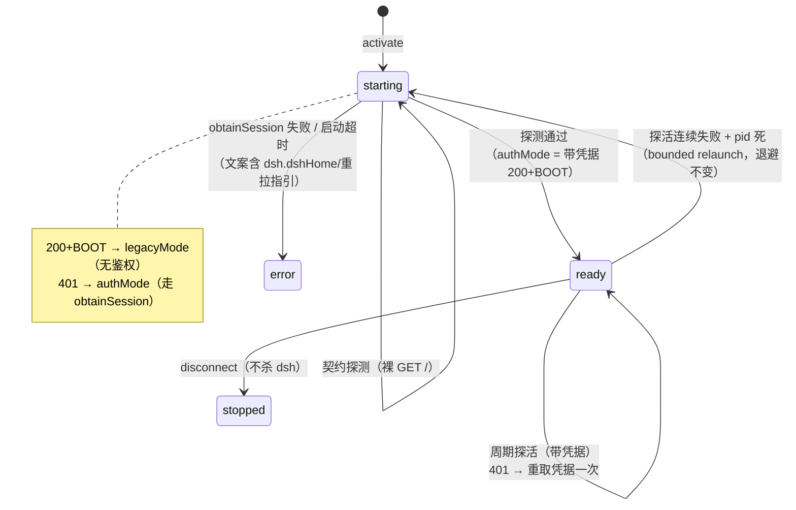

# dsh alpha 适配 — web 启动 token 鉴权深度分析与适配方案

> 版本 1.0 | 日期 2026-08-30 | 状态：待评审
> 作者：架构师（A1 链第一环） | 角色：架构师 | 链路：dsh-vscode-agent ↔ deepseek-harness（dsh 0.1.2-alpha.2）

---

## 零、前置参考

| 参考 | 说明 |
|---|---|
| `docs/调研报告.md`（方案 v4） | 生命周期仲裁总纲：注册表 + 原子锁 + 接管外部实例 + 三重防误杀 + 最后窗口关停；「同源 HTTP/WS 直连 iframe」为本方案要修订的约定 |
| `docs/开发报告.md` / `docs/联调测试剧本.md` | 实施与真机验证基线（8/8 PASS 无头回归） |
| dsh 运行实证（本机 npx 缓存） | `@deepseek-ai/dsh 0.1.1-rc.2`（**无** browser-auth 代码，旧契约）；`deepseek-harness` 仓库 `0.1.2-alpha.2`（**有**，新契约） |
| alpha 证据基线（全部已读核实） | `packages/client/connection/src/browser-auth.ts`、`packages/client/connection/src/{index,rpc-host,api-request-trust,loopback-hostname}.ts`、`packages/host/webserver/src/{index,injections}.ts`、`packages/host/frontend-static/src/index.ts`、`packages/api/gateway/src/index.ts`、`packages/bundle/web-app/src/{index,startup}.ts` + `cordis.patch.yml`、`apps/cli/src/{bin,args,profile-boot}.ts`、`apps/cli/tests/web-auth.e2e.ts`、`packages/credentials/credentials-local/src/index.ts`、`packages/util/home-paths/src/index.ts`、`scripts/release/families.ts` |

**术语**：旧契约 = dsh ≤0.1.1-rc.2（无鉴权）；新契约 = dsh 0.1.2-alpha.x（browser-auth 强制开启）。

---

## 一、目标/背景分析

### 1.1 用户实测问题
dsh 发布 alpha 后，`dsh web` 启动要求 token：浏览器打开 `dsh web` 打印的 URL 可正常使用；但 DSH Panel（本扩展）的面板无法加载（iframe 收到 401 / 停留在 initializing），`openInBrowser` 打开裸 URL 也得到 401 页。

### 1.2 根因链（5-Why，结论自足）
1. **为什么面板白屏？** iframe `GET /` 得到 401（不再是含 `__DSH_BOOT__` 的启动页）。
2. **为什么 401？** alpha 的 `dsh web` 全程启用 browser-auth：index 与 `/api`、`/api/remote.mux`(WS) 全部要求「launch token 交换的 HttpOnly Cookie」或有效会话 Cookie（`browser-auth.ts:240-282`：无 token 无 cookie → `writeUnauthorized` 401）。
3. **alpha 为什么这样设计？** 防 DNS rebinding / 恶意页面打本地 API（`api-request-trust.ts` 注释明示：Host 栅栏 + Cookie 鉴权，浏览器形请求与 curl 同栅栏）。
4. **为什么不能简单把 token 拼进 iframe URL？** 其一，服务端在 token 交换后 303 到**干净 `/`** 并只发 Cookie（`browser-auth.ts:246-265`），SPA 后续 `/api` 请求只认 Cookie；其二，VSCode webview 的 iframe 相对顶层页面（`vscode-webview://`）是**跨站上下文**，`SameSite=Strict` 的 Cookie 在跨站 iframe 内不会被携带——浏览器里的正常流程在 webview iframe 中结构性失效。
5. **根因**：本扩展当前架构 = 「裸 URL 直连 iframe + 无鉴权 GET / 探测」，与「Cookie 鉴权 + 跨站 iframe 不能带 Cookie」两条 alpha 事实**根本不兼容**。鉴权动作必须移到扩展宿主（Node 侧）完成，iframe 只面向一个已代持凭据的入口。

### 1.3 目标
1. DSH Panel 在 dsh alpha（`channel: alpha`）下面板完整可用（页面、`/api` RPC、`/api/remote.mux` WebSocket、SSE 流）。
2. dsh 稳定线（`channel: latest`，实证 0.1.1-rc.2）**零行为变化**（默认不回归）。
3. 生命周期仲裁（接管/防误杀/最后窗口关停/崩溃退避）语义保持不变。
4. 适配以**运行时契约探测**驱动，不硬编码版本号（去硬编码红线）。

---

## 二、范围分析

### 2.1 做什么
- 新增扩展宿主内嵌鉴权反向代理（新模块 `src/authProxy.ts`，纯 Node）。
- 启动/接管/探活/就绪探测的双契约化（旧=裸探；新=带凭据探）。
- dsh 启动横幅 token 解析、`.credentials.yaml` 会话 Cookie 本地生成、`openInBrowser` 打开带 token URL。
- `dsh.channel` 增加 `alpha` 枚举；测试桩与联调剧本同步新契约。

### 2.2 不做什么
- 不修改 deepseek-harness（上游仓库只读分析）。
- 不 fork / 不降级 dsh 安全机制（不 patch 禁用鉴权——违反红线且前端依赖鉴权后的 `/api` 行为）。
- 不实现「用户手动粘贴 token」的输入 UI（仅作错误提示指引）。
- 不改动：CLI 启动参数、端口解析主流程、注册表 schema、崩溃退避、树杀、CSP。

### 2.3 已核实为「无影响」的契约（不改动）
| 契约 | alpha 证据 | 结论 |
|---|---|---|
| npm 包名 `@deepseek-ai/dsh`、bin `lib/bin.js` | `apps/cli/package.json:14-16` | 不变 |
| CLI 参数 `web --host 127.0.0.1 --port N --no-open` | `packages/bundle/web-app/src/startup.ts:51-54`（`--host 0.0.0.0` 显式拒绝） | 不变 |
| 端口横幅前缀 `dsh web: http://127.0.0.1:<port>` | `packages/bundle/web-app/src/index.ts:280` + `tests/web-app.spec.ts:146` | 前缀不变（追加 `/?token=…` 与可选 LAN 段） |
| 默认端口 3080 | `cordis.patch.yml:116`（`ctx.webStartup.port ?? 3080`） | 不变 |
| 接管特征（`@deepseek-ai/dsh` / `--profile web` / `dsh[/]lib[/]bin.js`） | alpha 启动命令行形状不变 | `looksLikeDsh` 仍成立 |
| `__DSH_BOOT__` 注入存在 | `packages/client/modules/src/index.ts:589-591` + `webserver/src/injections.ts:49-57` | 仍在 index（需凭据可见） |
| 静态资源与 `/plugins/*` 公开 | `frontend-static/src/index.ts:92-95`、`client/modules/src/index.ts:586` | 无需鉴权，代理透传即可 |
| dsh 进程模型（detached 常驻、崩溃、信号） | 未变 | 生命周期仲裁不受影响 |

---

## 三、系统技术选型及设计

### 3.1 适配点总表（影响级别 + 证据位置）

| # | 适配点 | 现状代码位置（文件:行为） | alpha 变化证据（deepseek-harness 文件:行为） | 影响级别 | 适配方案 |
|---|---|---|---|---|---|
| A1 | 就绪/存活/接管探针 | `src/dshProcess.ts:224-233` `probe()`：裸 `GET /` 查 `__DSH_BOOT__` | `packages/client/connection/src/browser-auth.ts:240-282`：无凭据 `GET /` → **401**（正文无 `__DSH_BOOT__`）；`packages/host/frontend-static/src/index.ts:89`：index 先过 `authorizeIndex` | **阻断** | 探针双契约化：裸探 401 → 改带凭据探（§3.5）；「401」本身保留为存活证据 |
| A2 | 面板 iframe URL | `src/runtime.ts:282-289` `adopt()` 生成裸 URL；`src/webviewHtml.ts:13` iframe `src=runtime.url` | `browser-auth.ts:246-265`：token URL 303→干净 `/` + Set-Cookie(SameSite=Strict)；跨站 iframe 不携带 → SPA `/api` 全 401 | **阻断** | 扩展宿主内嵌鉴权代理（§3.3），iframe 面向代理 URL |
| A3 | 端口/凭证横幅解析 | `src/dshProcess.ts:47,72-80` `URL_RE` 仅取端口 | `web-app.spec.ts:146`：横幅为 `dsh web: http://127.0.0.1:<port>/?token=<43位base64url> (LAN: …)` | 降级 | 新增 token 捕获正则；端口正则保持兼容（前缀未变） |
| A4 | 固定端口就绪路径 | `src/dshProcess.ts:96-98,143-149` `fixedPortPath` 不读日志、直接裸探 | alpha 下裸探恒 401 → 永不就绪；token 仅在日志横幅 | 降级 | alpha 契约下固定端口路径同样 tail 日志（token + 就绪双信号），再带凭据确认 |
| A5 | 接管外部实例的鉴权 | `src/instance.ts:428-431` 特征校验成立；但外部实例 token 无从获取 | `browser-auth.ts:52-58`：launch token 仅存进程内 WeakMap，不落盘；签名 secret 持久化于 DSH_HOME | 降级 | 读 `<dshHome>/.credentials.yaml` 记录 `client-connection/browser-session` 本地生成会话 Cookie（§3.4） |
| A6 | 版本通道 | `package.json:74-82` `dsh.channel` 仅 `latest/preview` | `scripts/release/families.ts`（commit 45455aae77）：alpha 版发布于 npm dist-tag **`alpha`**（rc→next、稳定→latest） | 降级 | `dsh.channel` 枚举增加 `alpha`；默认保持 `latest`（旧契约，没有回归） |
| A7 | openInBrowser | `src/extension.ts:104-108` 打开 `runtime.url`（裸） | 浏览器顶层导航带 token 才能换取 Cookie（`web-auth.e2e.ts:173-181`） | 降级 | 打开带 token 的 URL（managed：横幅 token；外部：裸 URL + 401 页自带指引文案） |
| A8 | WebSocket 透传 | 现架构浏览器同源直连，无代理 | `packages/api/gateway/src/index.ts:212-228`：`/api/remote.mux` upgrade 走 `requestRejection`（Cookie 鉴权） | 降级 | 代理转发 upgrade：向上游发起带 Cookie 的 upgrade，成功后双向 pipe（§3.3） |
| A9 | 无头测试桩 | `scripts/sim.mjs:210-219` mock 恒 200+`__DSH_BOOT__`；横幅无 token | 新契约行为（401/303+Set-Cookie/凭据文件） | 降级（测试） | 新增 alpha 契约 mock server + 双契约回归用例（§9） |
| A10 | 文档约定 | `docs/调研报告.md` v4「同源 HTTP/WS 直连 iframe」 | 新契约下直连不可行 | 文档 | 本方案修订该约定；联调剧本同步 |

### 3.2 架构图（模块依赖与数据流）

```mermaid
flowchart LR
    subgraph VSCode 扩展宿主（本扩展）
        EXT[extension.ts<br/>vscode 耦合层]
        WV[webview.ts + webviewHtml.ts<br/>iframe 面板]
        RT[runtime.ts<br/>编排：复用/接管/锁/拉起]
        DP[dshProcess.ts<br/>spawn/日志横幅/树杀]
        AP[authProxy.ts ← 新增<br/>127.0.0.1:随机端口<br/>反向代理 + WS 隧道 + 凭据代持]
        DR[dshResolver.ts<br/>npx 缓存 bin 解析]
        INS[instance.ts<br/>注册表/锁/特征校验]
        PT[paths.ts]
    end
    subgraph dsh alpha 进程（detached 常驻）
        SRV[webserver 127.0.0.1:dshPort<br/>index=/api 需鉴权]
        AUTH[browser-auth<br/>launch token + 持久 secret]
        CRED[(DSH_HOME/.credentials.yaml<br/>records: client-connection/browser-session)]
    end
    EXT --> RT
    WV -- "iframe src=proxyUrl" --> AP
    RT --> DP & AP & INS & DR & PT
    DP -- "spawn: node lib/bin.js web --host 127.0.0.1 --port N --no-open" --> SRV
    DP -- "tail logs/dsh-*.log（端口+token）" --> AP
    AP -- "GET /?token=…（交换）或 本地生成 Cookie" --> AUTH
    AP -- "转发：Host/Origin 重写 + Cookie 注入（HTTP/SSE/WS）" --> SRV
    AUTH --- CRED
    AP -. "只读 <dshHome>/.credentials.yaml" .-> CRED
```

纯 Node 层新增 `authProxy.ts`（不 import 'vscode'），依赖仅 `node:http`/`node:crypto`/`node:fs`；`runtime.ts` 增加对它的编排调用。

### 3.3 鉴权代理设计（方案 A：扩展宿主内嵌 authProxy）

**选型理由**：跨站 iframe 无法持有 `SameSite=Strict` Cookie（§1.2 第 4 问），唯一能让 iframe 页面的同源 `/api`、`/api/remote.mux`、SSE 全部通过鉴权的方式，是让「带 Cookie 的那端」成为 iframe 的同源服务端——即扩展宿主内的反向代理。备选方案对比见 §8 决策记录。

**职责**：
1. 监听 `LOOPBACK_HOST:0`（OS 随机端口，符合 CSP `frame-src http://127.0.0.1:*`，CSP 无需改动）。
2. **HTTP 转发**（含 SSE 流式响应）：逐请求改写后转发上游 `http://127.0.0.1:<dshPort>`：
   - `Host` → 上游 authority（回环栅栏 + Cookie authority 一致性都依赖它）；
   - `Origin` → 若存在则重写为上游 authority（`api-request-trust.ts:111-117`：Origin 必须等于 Host authority；面板 iframe 的 Origin 是代理端口，不改必 403）；
   - 注入 `Cookie: dsh-auth-<sha256(authority)>=<会话Cookie>`；
   - `sec-fetch-site`：面板内为 same-origin 请求，透传即可（cross-site 才被拒；代理自身注入的请求不带该头，不触发栅栏）；
   - 上游 `Set-Cookie` 一律剥离（浏览器侧无需也不应持有 dsh Cookie）；
   - body 以 stream pipe 透传，不缓冲、不改写（gzip 协商由上游完成，代理不动 `accept-encoding`）。
3. **WS 隧道**：`server.on('upgrade')` → 对上游发起同路径 upgrade（注入 Cookie、重写 Host）→ `101` 后双向 `pipe` 原始 socket；上游拒绝则 `destroy`。
4. **401 自愈**：转发/升级遇上游 401 → 重取凭据（重交换/重新生成）一次并重放；仍 401 → 透传 401 并向 runtime 上报（面板显示可操作错误态）。

**凭据获取 `obtainSession(dshPort): Promise<Session|null>`（双路径，顺序固定）**：
1. **路径 T（token 交换，公开契约优先）**：token 来源 = 本窗口启动日志 `logs/dsh-*.log`（新→旧扫描，取与 `dshPort` 匹配的横幅 `dsh web: http://127.0.0.1:<port>/?token=<token>`）；执行 `GET http://127.0.0.1:<dshPort>/?token=<token>`（Host=上游 authority）→ 期望 `303 + Set-Cookie`，捕获 `dsh-auth-*` Cookie 值。
2. **路径 C（凭据库本地生成，通用兜底；接管外部实例的主路径）**：解析 `<dshHome>/.credentials.yaml`（`dshHome` 来源 = `dsh.dshHome` 配置，与 spawn 时注入的 `DSH_HOME` 同源，单一事实）→ `records['client-connection/browser-session'].payload`（`kind: grant`，`version: 1`，`secret: <32B base64url>`）→ 按 v1 格式本地生成：`cookieName = 'dsh-auth-' + base64url(sha256('127.0.0.1:<dshPort>'))`；`payload = {version:1, authority:'127.0.0.1:<dshPort>', issuedAt, expiresAt: issuedAt+30d}`；`cookie = 'v1.' + b64url(payloadJSON) + '.' + b64url(HMAC-SHA256(secret, b64url(payloadJSON)))`（格式与 `browser-auth.ts:106-159` 逐字段对齐，仅支持 `version: 1`，其余格式判为不支持→走路径 3）。
3. **失败**：返回 null → runtime 置 `error` 态，错误文案含可操作指引（确认 `dsh.dshHome`、或 `dsh.restart` 受控重拉）。

**安全约束**：token 与 Cookie 仅存内存，不落盘、不打日志（日志中 token 一律 redact 为 `<redacted>`）；`.credentials.yaml` 只读打开，绝不写回。

### 3.4 双契约兼容设计（版本探测，去硬编码）

- **判定不读版本号**：运行时契约探测是唯一开关——
  - `probe(裸 GET /)` 返回 200 且含 `__DSH_BOOT__` → 旧契约（代理降级为纯转发，行为与 0.1.8 完全一致）；
  - 返回 401 → 新契约（启用 §3.3 鉴权路径）。
- 版本号（`dshResolver` 已有 `bin.version`）仅用于日志诊断与文案，不参与分支。
- **channel 隔离**：alpha 走 npm dist-tag `alpha`（`npx @deepseek-ai/dsh@alpha web`），稳定线走 `latest`；npx 缓存内两版本天然共存于不同 hash 目录，`dshResolver` 按 spec+version 匹配，无需改动（`dshResolver.ts:388` spec 参数化已支持任意 channel）。
- **接管场景**：注册表记录不区分契约（`instance.json` schema 不变，决策 D3）；每窗口启动/重连时自行契约探测 + obtainSession，凭据库为共享事实源，多窗口天然一致。
- **dsh 重启**（崩溃重拉 / forceRelaunch）：新进程新 token，但凭据库 secret 不变 → 路径 C 永远有效；代理在 401 自愈中重新生成即可，无需感知重启。

### 3.5 生命周期与状态机（在 v4 语义上的增量）

状态机不变（`idle→starting→ready/error/stopped`），仅 **ready 判定与 URL 语义** 增量：



**URL 语义拆分**（语义分离红线）：
- `runtime.url`（iframe 面板消费）= authMode 下代理 URL `http://127.0.0.1:<proxyPort>/`；legacyMode 下直连 URL（现状）。
- `runtime.externalUrl`（`openInBrowser` 消费，新增）= 带 token 的 `http://127.0.0.1:<dshPort>/?token=…`（managed：横幅 token）；外部实例无 token → 裸 URL（401 页自带「reopen the URL printed by dsh web」指引，可接受）。
- 注册表 `DshRecord` 与 `instance.json` schema **不变**。

### 3.6 时序图（新契约：token 获取 → URL 构造 → iframe 加载）

```mermaid
sequenceDiagram
    participant E as 扩展宿主 runtime
    participant D as DshProcess(spawn/detached)
    participant L as logs/dsh-<ts>.log
    participant P as authProxy(127.0.0.1:proxyPort)
    participant S as dsh webserver(127.0.0.1:dshPort)
    participant F as Panel iframe(vscode-webview 内)

    E->>D: spawn(node lib/bin.js web --host 127.0.0.1 --port N --no-open)
    D->>L: stdio fd 重定向
    S-->>L: 横幅 dsh web: http://127.0.0.1:N/?token=T (LAN: …)
    D->>E: resolvePortFromLog → 端口 N + captureLaunchToken → T
    E->>E: 契约探测：裸 GET / → 401 ⇒ authMode
    E->>P: obtainSession：GET /?token=T（Host=127.0.0.1:N）
    S-->>P: 303 + Set-Cookie: dsh-auth-*=v1.…（HttpOnly; SameSite=Strict）
    P->>E: session Cookie（内存持有）
    E->>E: 带凭据 GET / → 200 + __DSH_BOOT__ ⇒ ready
    E-->>F: state=ready, url=http://127.0.0.1:proxyPort/
    F->>P: GET /（iframe 首载）
    P->>S: 转发（Host/Origin→上游, +Cookie）
    S-->>P: 200 index（注入 globalThis["__DSH_BOOT__"]=…）
    P-->>F: 200 index
    F->>P: POST /api/...（同源 fetch）＋ WS upgrade /api/remote.mux
    P->>S: 转发（+Cookie）/ upgrade 隧道
    S-->>F: RPC 响应 / 101 双向流
    Note over E,S: 任意时刻上游 401 → P 重取凭据重放一次；仍 401 → 上报 error 态
```

### 3.7 接口契约（新模块 `src/authProxy.ts`）

```ts
/** 鉴权会话（内存持有，永不落盘/打日志）。 */
export interface DshSession { cookieName: string; cookieValue: string }
/** 契约判定结果。 */
export type DshContract = 'legacy' | 'auth' | 'unknown'

export interface AuthProxyOptions {
  upstreamPort: number          // dsh 真实端口
  dshHome: string               // 凭据库根（与 spawn 的 DSH_HOME 同源）
  fetchToken?: () => string | null  // 日志横幅 token 提供者（可注入，供无头测试）
  nowMs?: number                // 测试注入
}
export class DshAuthProxy {
  /** 启动代理（127.0.0.1:0），完成契约探测 + obtainSession；失败 throw。 */
  async start(): Promise<{ proxyPort: number; contract: DshContract }>
  /** 面板入口 URL（auth=代理 URL；legacy=直连 URL）。 */
  panelUrl(): string
  /** 浏览器入口 URL（尽力带 token）。 */
  externalUrl(): string
  /** 带凭据探活（legacy 下退化为裸探）。供 runtime 周期探活复用。 */
  probe(): Promise<boolean>
  /** 401 自愈：重取凭据一次；返回是否成功。 */
  refreshSession(): Promise<boolean>
  dispose(): void
}
/** 纯函数导出（单测面）：横幅 token 提取、Cookie v1 铸造、cookieName 推导、凭据记录解析。 */
export function extractBannerToken(line: string): { port: number; token: string } | null
export function mintCookieV1(secretB64url: string, authority: string, nowMs: number): DshSession
export function parseBrowserSessionRecord(yamlText: string): { secret: string; version: number } | null
```

`runtime.ts` 增量：`DshRuntime` 持有 `DshAuthProxy`；`start/adopt/reconnect/forceRelaunchManaged/probeTick/shutdownBookkeeping` 全部经 `panelUrl()`/`probe()` 消费；`shutdownBookkeeping` 不杀代理进程以外的任何新进程（代理是扩展宿主内对象，随宿主消亡）。

---

## 四、可行性分析（含探针数据）

### 4.1 探针清单与数据（全部只读完成）

| 探针 | 方法 | 数据 | 结论 |
|---|---|---|---|
| P1 alpha 是否强制鉴权 | 读 `browser-auth.ts` 全文 + `client-connection/src/index.ts:114-127` | index 与 `/api` 路由注册处均接 `authorizeIndex`/`requestRejection`；`frontend-static` index 先过鉴权 | 是，无开关（web profile patch 无禁用行） |
| P2 旧版是否无鉴权 | grep 运行中缓存 `…\_npx\b86ed90107c62dab\…@deepseek-ai\dsh` | 0.1.1-rc.2 产物中无 `browser-session/authenticatedUrl/dsh-auth-` 任何命中 | 旧契约实证成立，双契约真实存在 |
| P3 横幅格式 | 读 `web-app/src/index.ts:280` + `tests/web-app.spec.ts:146` | `dsh web: http://127.0.0.1:4567/?token=test-token (LAN: …)` | 端口前缀兼容；token 可捕获 |
| P4 token 形态与生命周期 | `browser-auth.ts:14-20,52-58,223-230` | 32B→43 字符 base64url；进程 WeakMap（每启动随机）；不落盘 | 每次重启变化；外部实例不可获取 |
| P5 Cookie 机制 | `browser-auth.ts:106-159,240-302` | `dsh-auth-<sha256(authority)>`=`v1.<payload>.<hmac>`；HttpOnly/SameSite=Strict/非 Secure；30 天；authority 绑定 Host | 本地生成可行（v1 格式 + secret 均可复现） |
| P6 跨重启 Cookie 有效性 | `apps/cli/tests/web-auth.e2e.ts:194-197` | 新 token、旧 Cookie 仍 200 | secret 持久化成立（路径 C 前提） |
| P7 secret 存储 | `credentials-local/src/index.ts:61,88-94,289-293` | `<DSH_HOME>/.credentials.yaml` records 段，键 `<scope>/<id>`，`{kind:'grant',payload:{version,secret}}`；DSH_HOME=配置>env>~/.dsh（`home-paths/src/index.ts:87-91`） | 路径 C 可实现 |
| P8 WS/静态资源鉴权面 | `api/gateway/src/index.ts:212-228`、`client/modules/src/index.ts:586`、`frontend-static/src/index.ts:92-95` | `/api/remote.mux` upgrade 需鉴权；`/plugins/*` 与静态资源公开 | 代理需 WS 隧道；资源纯透传 |
| P9 Host/Origin 栅栏 | `api-request-trust.ts:91-118` + `loopback-hostname.ts:12-18` | Host 必须回环（127/8 ✓）；Origin 存在时必须等于 Host authority；`sec-fetch-site: cross-site` 拒绝 | 代理必须重写 Host+Origin 到上游 authority |
| P10 CLI 参数 | `apps/cli/src/args.ts:156-169` + `web-app/src/startup.ts:51-79` | `web --host/--port/--no-open/--trusted-host` 全在；`--host 0.0.0.0` 拒绝 | 启动 argv 不变 |
| P11 dist-tag | `scripts/release/families.ts`（commit 45455aae77 diff） | `0.1.2-alpha.2` → dist-tag `alpha`；rc→`next`；稳定→`latest` | channel=alpha 精确选版，latest 不受污染 |

### 4.2 风险与缓解

| 风险 | 等级 | 缓解 |
|---|---|---|
| 上游改 Cookie/凭据格式（v1→v2） | 中 | 格式解析按 `version` 字段判别，不支持即失败→错误文案；探测开关使 legacy 线永不受影响 |
| 用户外部实例 DSH_HOME 与扩展配置不一致 | 低 | authorized probe 失败即 `error` 态，文案指明核对 `dsh.dshHome`；不误杀、不重试风暴 |
| 代理端口被占/宿主限制 | 低 | 127.0.0.1:0 由 OS 分配；失败重试一次后走 `error` 态 |
| SSE/WS 经代理断流 | 中 | pipe 直通不缓冲；WS 隧道错误即销毁两端 socket；探活周期兜底重连 |
| 凭据文件读取并发/写锁 | 低 | 只读打开 + 解析失败即回退路径 T/错误态，绝不写回 |

### 4.3 结论
方案 A 全链路均有实证支撑（P1-P11），无上游改动、无安全机制绕过，可行。

---

## 五、可维护性分析

1. **分层不变**：`authProxy.ts` 为纯 Node 模块，与 `instance/dshProcess/paths` 同层；`extension.ts/webview.ts` 仅消费 `runtime.url → panelUrl` 的既有订阅面，vscode 耦合面零扩大。
2. **单点契约知识**：dsh 鉴权格式（横幅、Cookie v1、凭据记录）收敛在 `authProxy.ts` 纯函数导出面（§3.7），上游演化只改一个文件。
3. **可测试性**：`fetchToken/nowMs` 注入扩展点 + 纯函数导出 → 无头可测；sim.mjs mock server 可完整模拟 401/303+Set-Cookie/凭据 fixture。
4. **去硬编码**：无版本号分支（运行时探测）、无端口/路径字面量（`LOOPBACK_HOST` 单一事实来源沿用、代理端口 OS 分配）、cookie 参数（前缀/有效期/版本）按证据常量集中在 `authProxy.ts` 顶部并注明证据行号。
5. **文档同步**：本方案修订 `docs/调研报告.md` 的「同源直连 iframe」约定为「面板 → authProxy → dsh」；`docs/联调测试剧本.md` 增补 alpha 通道用例（§9）。

---

## 六、性能分析（定量指标）

| 指标 | 现状基线 | 适配后（authMode） | 说明 |
|---|---|---|---|
| 面板单请求时延 | 直连回环 ~0.2-1ms | +1 跳回环转发，~0.4-2ms | 127.0.0.1 回环 RTT 量级；头部改写 O(1) |
| SSE/WS 流吞吐 | 直连 | pipe 直通，无额外缓冲/拷贝语义 | 不做 body 重写，无降速放大 |
| 启动就绪时延 | ≤90s 预算（就绪通常 <10s） | +横幅 token 捕获（0 轮询成本，随日志 tail）+ 1 次交换往返（<10ms）+ 1 次带凭据确认（<10ms） | 预算不变；固定端口路径由「纯探测」改「探测+日志」，最坏仍受 90s 约束 |
| 探活成本 | 30s 一次裸 GET | 30s 一次带 Cookie GET（同量级）；401 自愈仅异常路径 +1 次往返 | 无新增常驻线程 |
| 内存 | — | 代理每连接缓冲由 Node 默认流控约束（<64KB/连接）；凭据与 token 常驻 <1KB | 无落盘 |
| 新增文件句柄 | — | 代理监听 socket 1 个 | 随 dispose 释放 |

---

## 七、附加（接口契约）

见 §3.7（`authProxy.ts` 模块接口）。补充约束：
- `runtime.url` 对 `webview.ts`/`webviewHtml.ts` 的既有消费方式**不变**（值变为代理 URL），`bakedUrl/re-bake/setUrl` 机制无需改动。
- `extension.ts` 仅两处增量：`openInBrowser` 改用 `runtime.externalUrl`；`dsh.channel` 枚举增加 `alpha`（`package.json` configuration 同步，description 注明 alpha=0.1.2-alpha.x 带 token 鉴权）。
- 日志红线：runtime.log/dsh.log 中 token 与 Cookie 值一律输出 `<redacted>`（与上游 e2e 的 redact 约定一致）。

---

## 八、决策记录

| # | 决策 | 理由 | 否决项 |
|---|---|---|---|
| D1 | 采用方案 A：扩展宿主内嵌鉴权反向代理 | 跨站 iframe 不能携带 SameSite=Strict Cookie；token 又被服务端 303 剥离（§1.2），只有「带凭据端=iframe 同源服务端」可同时满足页面/`/api`/WS/SSE | 方案 B「token 拼 iframe URL」：服务端剥 token + 后续请求靠 Cookie，跨站 iframe 结构性失效；方案 D「patch 禁用鉴权 / fork」：违反红线且前端依赖鉴权行为 |
| D2 | 凭据获取顺序：T（日志 token 交换）→ C（凭据库本地生成）→ 错误态 | T 走公开打印 URL 契约（最稳）；C 覆盖接管外部实例与日志缺失场景；两者失败给出可操作错误而非静默 | 「用户手填 token」不入 v1（指引即可） |
| D3 | 注册表 schema 不变；契约状态每窗口自探测推导 | 避免 `instance.json` 跨版本兼容问题；凭据库是共享事实源，多窗口天然一致 | 在 DshRecord 中持久化 authMode/token（token 每启动即变，持久化无意义且有泄露面） |
| D4 | token/Cookie 仅内存；凭据文件只读 | 最小权限；与上游 redact 约定对齐 | 持久化会话凭据 |
| D5 | `dsh.channel` 增加 `alpha`，默认仍 `latest` | dist-tag 实证（P11）；默认线没有回归，alpha 由用户显式选择 | 默认切 alpha（会把所有用户推入新契约） |
| D6 | 契约开关 = 运行时探测（401 vs 200+BOOT），版本号仅诊断 | 去硬编码红线；上游未来回退/调整行为时无需改分支逻辑 | 以 `0.1.2` 版本号硬编码判断 |

---

## 九、实施清单

| # | 事项 | 目标角色 | 验收 |
|---|---|---|---|
| 1 | 新增 `src/authProxy.ts`：代理（HTTP/SSE/WS upgrade 隧道）、Host/Origin 重写、Cookie 注入、401 自愈、`obtainSession`（T→C）、契约探测、§3.7 纯函数导出 | 【开发专家】 | 无头单测：token 提取/铸造/记录解析/转发改写/WS 隧道（mock 上游） |
| 2 | `src/dshProcess.ts`：横幅 token 捕获正则（兼容旧横幅）；alpha 契约下固定端口路径统一 tail 日志；`probe()` 支持 Cookie 注入参数；启动失败诊断含「鉴权未就绪」分支 | 【开发专家】 | 旧横幅解析回归 + 新横幅解析用例 |
| 3 | `src/runtime.ts`：接入 authProxy（start/adopt/reconnect/forceRelaunch/probeTick）；`panelUrl/externalUrl` 语义拆分；ready=带凭据 200+BOOT；401 自愈编排 | 【开发专家】 | 状态机分支与 legacy 行为逐一对拍 |
| 4 | `src/extension.ts` + `package.json`：`openInBrowser` 用 `externalUrl`；`dsh.channel` 增加 `alpha` 枚举与文案；错误文案（dsh.dshHome/重拉指引） | 【开发专家】 | 配置项 schema 校验 + 命令行为 |
| 5 | `scripts/sim.mjs`：新增 alpha 契约 mock（裸 GET /→401；`/?token=`→303+Set-Cookie；带 Cookie→200+`__DSH_BOOT__`；凭据 fixture；WS upgrade 桩）+ 双契约全链路用例（沿用 8/8 基线并扩展） | 【测试专家】 | `node scripts/sim.mjs` 全 PASS（旧 8 项 + 新增项） |
| 6 | `docs/联调测试剧本.md` 增补：alpha 通道（`dsh.channel=alpha`）面板加载/对话/WS、openInBrowser 带 token、外部实例接管（凭据本地生成）、latest↔alpha 切换、dsh.dshHome 错配错误态 | 【测试专家】 | 真机剧本可执行、判定标准明确 |
| 7 | 版本 0.1.9、`vsce package` 打包与离线安装验证（卸旧装新 + 完全退出 VSCode） | 【部署专家】 | VSIX 安装后双通道行为符合 §3.4 |
| 8 | 适配点总表（§3.1）逐项审计：证据引用、影响级别、实现一致性；`docs/调研报告.md` v4 约定修订复核；回归清单（latest 没有回归 + alpha 全链路）核签 | 【QA】 | 审计记录 + 回归结论 |
| 9 | 发布说明：向用户说明 alpha 通道需在设置中显式选择 `dsh.channel=alpha`；稳定线不受影响 | 【部署专家】 | 文案评审 |

---

## 评审人：待定 | 状态：待终审 | 日期：2026-08-30
