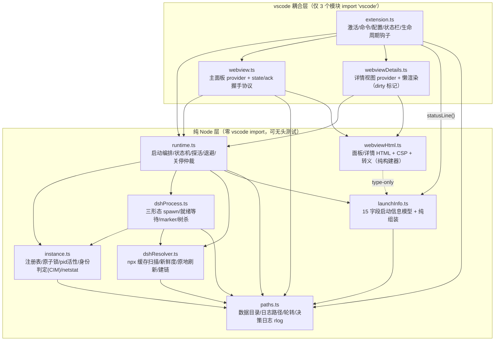
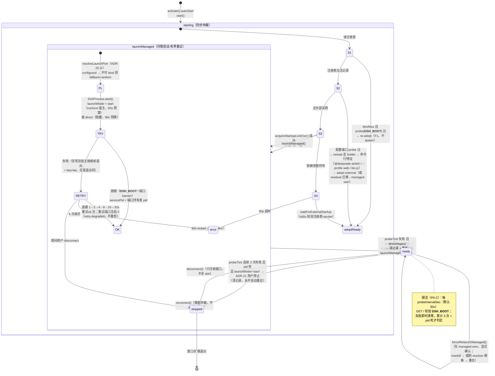
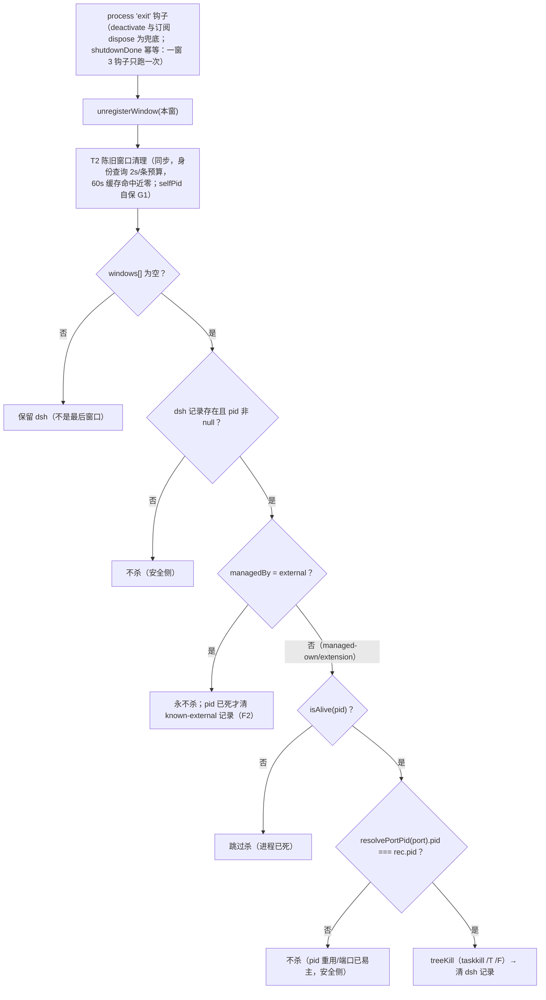
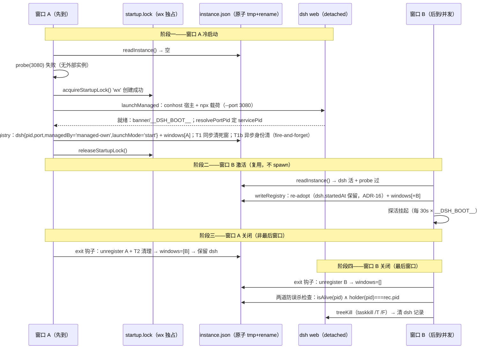

# DSH Panel（dsh-vscode-agent）——架构设计报告

> 版本：v1 · 日期：2026-09-02 · 状态：待评审
> **基线滞后补注（2026-09-02，docs 目录治理轮）**：本报告分析基线 0.1.12，0.1.13–0.1.16 演进未覆盖；§九清单仍有效，版本进度以开发报告 §16 台账为权威。
> 性质：A2简 全量架构分析（只分析、不实施；未修改 src/、未改配置、未做任何 git 操作）
> 分析基线：package.json v0.1.12 · 全部 10 个 src 模块逐行阅读 · 探针实测（编译 + 无头验收）

---

## 零、前置参考

| 文档 | 用途 |
|---|---|
| `docs/调研报告.md`（v4） | 方案总纲：薄壳定位、应用级生命周期、npx 托管、原子锁四项用户拍板 |
| `docs/开发报告.md` | 实施记录（0.1.x 各版） |
| `docs/archive/面板启动与生命周期根因分析.md`、`docs/archive/面板卡Initializing根因分析(-v2/-v3).md` | detached 基线与面板握手链路的根因谱系 |
| `docs/0.1.6真机缺陷根因分析与解决方案.md` | R3 常驻控制台窗口闪退谱系与 ADR-24/25/26 依据 |
| `docs/archive/dsh-alpha适配分析与方案.md`、`docs/联调测试剧本.md`、`docs/环境基线调查报告.md` | 适配/联调/环境基线 |
| `.dsh/profile.yaml`、`.dsh/skills/dsh-vscode-agent-engineering.md` | 项目技术骨架与工程知识（本报告发现其模块清单过时，见 §1.3） |

---

## 一、目标/背景分析

### 1.1 本报告要解决什么

本项目自 0.1.6 起经 ADR-20～ADR-26 多轮架构演进（常驻控制台窗、marker 排障、conhost 宿主切换、端口纪律显式化），但**缺少一份与当前代码一致的总体架构文档**：项目级 skill 与 `.dsh/profile.yaml` 的模块清单仍停留在 0.1.6 时代的 6 模块描述，与实际代码出现漂移。本报告以逐行阅读全部源码为基础，固化当前架构的三条主线——**模块依赖分层、生命周期状态机、多窗口注册表仲裁**——供后续评审、QA 审计与新会话冷启动引用。

### 1.2 系统定位（一句话）

DSH Panel 是 DeepSeek Harness（dsh）的 VSCode 右侧边栏面板扩展：**薄壳**——不 fork、不打包 dsh 前端，dsh 运行时由 npm/npx 托管；扩展负责 dsh 的发现/复用/接管/代为启动/探活与"最后窗口才关停"的应用级生命周期仲裁，并以内嵌 iframe 呈现 dsh Web UI。

### 1.3 概览与实际代码不符之处（如实指出，以代码为准）

| # | 概览说法（skill / profile.yaml / 任务线索） | 实际代码 | 影响 |
|---|---|---|---|
| 1 | src 共 6 个模块 | **实际 10 个**：`extension.ts`、`webview.ts`、`webviewDetails.ts`、`webviewHtml.ts`、`runtime.ts`、`instance.ts`、`dshProcess.ts`、`dshResolver.ts`、`launchInfo.ts`、`paths.ts`（grep 全部 import 边核实） | profile.yaml `module_layout` 与 skill 均缺 0.1.7–0.1.9 加入的 `dshResolver`/`launchInfo`/`webviewHtml`/`webviewDetails`，分层审计会漏检 |
| 2 | "runtime.ts → {instance, dshProcess, paths}" | runtime.ts 实际还依赖 `dshResolver`（版本解析）与 `launchInfo`（快照组装）；dshProcess 还依赖 `instance`（resolvePortPid）与 `dshResolver` | 依赖图以本报告 §3.2 为准 |
| 3 | "关停判定 = 三重防误杀（pid 存活+端口监听+`__DSH_BOOT__`）全过才 taskkill" | `shutdownBookkeepingOnce()`（runtime.ts L778-840）代码里是**两道显式检查**：`isAlive(rec.pid)` + `resolvePortPid(rec.port)` 且 `holder.pid === rec.pid`；`__DSH_BOOT__` 不在该函数内显式复核，只是探活周期（`probeTick` 每 30s 验 `__DSH_BOOT__`）提供的背景证据。runtime.ts L759-762 注释自称 "triple safe-gate"，与代码形态有表述偏差 | 防误杀实际强度 = pid 存活 + 端口持有者 pid 匹配（pid 重用窗口已覆盖）；文档与注释建议对齐（见 §9-②） |
| 4 | "崩溃重启退避 1→2→4→8→16→32s、6 次上限转 error"（暗示普适） | `BACKOFFS_MS`/`MAX_RESTARTS=6` 只作用于**托管启动失败重试循环**与 **direct/legacy 记录的死亡重启**；生产默认形态（`launchMode='start'`，常驻控制台窗）的 dsh 死亡按 ADR-21 判定为 **USER STOP——永不自动重拉**（runtime.ts L611-646），面板 ⟳ 重连才重启 | "崩溃重启"语义在 0.1.9+ 已被 user-stop 裁决收窄，本报告状态机如实刻画 |
| 5 | `@types/vscode ^1.99.0`（devDependencies）vs `engines.vscode ^1.134.0` | 两者不匹配：类型层面按 1.99 编译，引擎阈值却要求 ≥1.134（README 自述"本机 1.134 已满足"） | 1.99–1.133 的 VSCode 会被 engines 拒装，但代码只按 1.99 类型层面保证编译；属版本声明技术债（见 §9-⑤） |
| 6 | —（任务清单提示"读 README"） | 根目录 `README.md` 存在（7059 字节，v0.1.12 口径），与 skill 一致 | 无矛盾，仅确认 |

另两处工作区卫生观察（非代码缺陷）：根目录物理残留 10 个 `.vsix`（`.gitignore` 已排除、不入库）与 `.sim-tmp-qa-pub/` 遗留目录（`.gitignore` 只写了 `.sim-tmp/`，未覆盖该目录；`.vscodeignore` 的 `.sim-*/**` 已保证不入包）。

---

## 二、范围分析（做什么、不做什么）

**做（本报告覆盖）**：
- 全部 10 个 src 模块 + `package.json` / `tsconfig.json` / `.vscodeignore` / `.gitignore` / `scripts/sim.mjs` / `README.md` / `.vscode/launch.json` / `.dsh/profile.yaml` 的现状架构刻画；
- 三大主题的正式图示：模块依赖（Mermaid）、生命周期状态机（Mermaid）、多窗口注册表仲裁时序（Mermaid）；
- 关键接口契约与注册表结构固化（§7）；
- 可行性/可维护性/性能分析（含本次探针实测数据）；
- 改进建议清单（仅建议，不实施，逐项标注目标角色）。

**不做**：
- 不修改 src/、package.json、tsconfig、任何配置；不做 git 操作；不碰 main/master；
- 不做 dsh 上游（`@deepseek-ai/dsh`）内部的架构分析（超出本项目范围，调研报告 v4 已有结论可引用）；
- 不做 GUI 真机联调（属测试专家职责，按 `docs/联调测试剧本.md` 另行执行）；
- 不重写既有 ADR 决策（ADR-1～26 沿用既有文档，本报告只引用与对齐）。

---

## 三、系统技术选型及设计

### 3.1 技术栈（现状）

| 维度 | 现状 |
|---|---|
| 语言/目标 | TypeScript 5.6，`strict`，CommonJS / ES2022，`rootDir: src` → `outDir: out`（`tsc -p ./`，产物 ~182 KB / 10 文件） |
| 平台 | VS Code Extension API；`engines.vscode ^1.134.0`；`@types/vscode ^1.99.0`（见 §1.3-⑤） |
| 运行时 | Node ≥ 20；dsh 由 npx 缓存托管（`@deepseek-ai/dsh`，`lib/bin.js`），**零运行时 npm 依赖**（devDependencies 仅 4 项） |
| 打包/分发 | `vsce package` → `dsh-vscode-agent-<ver>.vsix`（薄壳）；`.vscodeignore` 排除 src/scripts/docs/.dsh/node_modules/.npm-cache/out |
| 持久化 | 无数据库；协调状态 = `%LOCALAPPDATA%\DshVscode\` 下三个文件（`instance.json` 注册表、`startup.lock` 原子锁、`logs/` 决策与启动日志），全部 JSON/文本 + 原子 rename 写入 |
| 进程模型 | dsh = **detached 独立常驻进程**（`detached:true` + `unref()`，扩展宿主不持有句柄）；扩展 = 轻客户端（HTTP `__DSH_BOOT__` 探活 + 注册表记账） |
| 测试 | 无单测框架；`scripts/sim.mjs`（2755 行）无头验收（mock spawn / 注入衔接点 / patch 编译产物单行），GUI 按 `docs/联调测试剧本.md` |

### 3.2 模块依赖（主题一）

**耦合判定依据**：grep `from 'vscode'` 全仓仅 3 处命中——`extension.ts`、`webview.ts`、`webviewDetails.ts`；其余 7 个模块零 vscode import，可独立无头测试（QA C2 分层检查项）。实际 import 边（逐文件核实）：



**分层规则与事实核对**：
- 依赖方向严格单向：耦合层 → 编排层（runtime）→ 基础层（instance/dshProcess/paths…）；**无任何反向边、无环**（`webviewHtml → launchInfo` 是唯一 type-only 例外，仍指向基础层）。
- vscode API 触达范围被压到最小：耦合层只做「注册 provider/命令、读配置、postMessage、openExternal/clipboard」；进程/文件/端口操作全部下沉纯 Node 层。
- 可测试性衔接点：`RuntimeOptions.identityCheck` / `resolvePortPidFn`（runtime）、`queryIdentitySync(spawnFn)`（instance）、`DshProcess.resolvePortPidFn`（dshProcess）、`DSH_VSCODE_DATA_DIR` / `DSH_NPX_ROOT` / `DSH_NODE_EXE` / `DSH_NPM_CLI`（paths/dshResolver 环境衔接点）——sim.mjs 即靠这些衔接点实现 2700+ 行无头断言。

### 3.3 生命周期状态机（主题二）

**顶层状态**（`RuntimeState`，runtime.ts）：`idle → starting → ready / error / stopped`。`managedBy` 三态正交：`managed-own`（扩展代为启动）/ `external`（外部启动，只复用不杀）/ `extension`（legacy）。`launchMode` 二态承载 ADR-21 裁决：`start`（常驻控制台窗）= 生产默认；`direct`（隐藏）= 降级态。



**关停仲裁（最后窗口退出，同步 exit 钩子，幂等）**：



> 注：上图两道显式检查 = `isAlive` + 端口持有者 pid 匹配；`__DSH_BOOT__` 是探活周期提供的背景证据而非关停函数内步骤（§1.3-③）。

**端口回落链**（ADR-25-① 命名决策点 `resolveLaunchPort`）：`configured`（3080 可 bind，原样使用）→ `fallback-random`（被非 DSH 占用 → `--port 0`，OS 分配）→ `retry-degraded`（重试轮把 0 **冻结**，不再重检，避免同端口死循环）。三条 source 全程 rlog 留痕，与 `start: window …(port=配置)`、`payload port = <N>`（ADR-25-②）构成三行互证。

**dsh 进程三形态**（dshProcess.ts，构建期常量切换、无运行期自动降级链）：

| 形态 | 载体 | 载荷 | 就绪预算 | 状态 |
|---|---|---|---|---|
| start·conhost（**生产默认**，ADR-26） | `conhost.exe -- cmd /d /c "title … && <载荷>"`，stdio ignore×3 | npx 启动分支（`START_PAYLOAD_VARIANT='npx'`）：`npx --yes --prefer-offline @deepseek-ai/dsh@<channel> web …` + 三段 marker wrap | 60s | 常驻控制台窗，关窗=用户停止 |
| start·start-wait（翻转备轨） | `cmd.exe /d /s /c start "<标题>" /d "<cwd>" /wait cmd /d /c "<载荷>"`（verbatim args） | 同上（node-bin 启动分支 = `"node" "bin.js" web …`） | npx 60s / node-bin 30s | 0.1.9 主线，R3 后转备轨 |
| direct（降级态） | 直接 spawn `node bin.js`（resolver 命中）或 `cmd.exe /d /s /c npx …`（回退） | 恒 node-bin，不受变体影响 | 90s | 隐藏，无常驻窗口；死亡走退避重启 |

三个 marker 同批伴生文件（`.cmd-start`/`.node-start`/`.node-exit`）+ `.resolver` 同批伴生文件 = 启动链时间线排障，随 per-launch 日志同批轮转（保留 3 份，零独立膨胀风险点）。

### 3.4 多窗口注册表仲裁时序（主题三）



**并发与自愈语义**：
- **第一窗竞态**：双窗同时冷启动时，`startup.lock` 的 `wx` 独占创建保证只有一窗进入 `launchManaged`；败者进入 `waitForExternalStartup`（500ms 轮询注册表+probe，≤60s），胜者写注册表后败者 re-adopt。锁含 pid 活性校验，持锁窗崩溃后锁可被回收（2 次尝试内 unlink 重取）。
- **注册表并发写**：`writeInstance` 是 tmp+rename 原子单写，但 read-modify-write 序列间无文件锁，理论存在丢失更新窗口（如 A 读后 B 写，A 再写覆盖 B 的 windows 条目）。现实缓解：①窗口级操作频率极低（激活/退出各一次）；②T1 同步活性清理 + T1b/T2 身份清理持续收敛僵尸条目；③T1b 采用"重读新注册表后仅手术式移除已验证 foreign 的 pid"的 guarded rewrite（runtime.ts L545-564），显式防并发覆盖。残余风险与建议见 §5.3/§9-③。
- **僵尸窗口自愈三级**：T1（微秒级 `process.kill(pid,0)` 活性清，覆盖强杀宿主）→ T1b（异步身份清，10s/条，防 pid 重用误保留）→ T2（退出钩子同步身份清，2s/条，防死条目阻塞"最后窗口"判定）。身份判定只信**正向证据**（G2：exe 在 VSCode 家族之外 + 命令行无扩展宿主特征才判 foreign）；`exthost`/`unknown` 一律保留（宁留勿误清）；G4 60 秒宽限期豁免新注册条目；G4 翻转护栏压制 exthost→foreign 抖动。
- **接管外部实例**：配置端口 probe 过 → `resolvePortPid` 定持有者 → CIM 查命令行 → `looksLikeDsh` 特征（`@deepseek-ai/dsh` / `--profile web` / `dsh/lib/bin.js` 正则）通过才接管（记 `adoptedPid`；CIM 不可用时降级为"页面签名基础"记录持有者 pid，残余迁移不启用——安全侧）。外部实例最后窗口**永不杀**，保留 known-external 记录供后续窗口复用（F2）。

### 3.5 面板/可见性设计（vscode 耦合层要点）

- **贡献点**：`viewsContainers.secondarySidebar`（`dsh-viewContainer`）内两个 webview 视图——`dsh.panel`（主面板）+ `dsh.details`（详情，`collapsed` 懒渲染：首次打开才 resolve，主启动路径零开销）。
- **主面板**：iframe 内嵌 dsh UI（`sandbox="allow-scripts allow-forms allow-same-origin allow-downloads"`）；CSP `frame-src http://127.0.0.1:*` + `style/script-src 'unsafe-inline'`（放行 VSCode 注入 API，Bug C 教训）；**静态写入**——url 就绪即重写 html 携带 `<iframe src>`（0 握手根因防护），脚本层 setUrl 为增强；state/ack 握手（3s 预算、≤2 次防御性重推、webviewReady 快照重推）防"卡 Initializing"。
- **详情卡**：纯模板 `webviewHtml.buildDetailsHtml` 单点五相渲染（empty/error/ready/stopped-user/stopped-disconnected）；运行时值全部 `escapeAttr` 转义插值；停机文案按 `launchMode` 分叉（start=「已按您的操作停止」/其他=「已断开」）；数据 = `runtime.getLaunchInfo()` 快照（15 字段，诚实降级——不可得即 null，绝不造占位版本号）。
- **状态栏**：`statusLine()` 纯函数单点；ready = `● DSH <端口> · v<版本>`（版本自报优先、resolver 兜底、双缺省不显示）；点击 → `dsh.details.focus`（三级回退）。

---

## 四、可行性分析（含探针数据）

### 4.1 探针记录（本次执行）

| 探针 | 命令 | 结果 |
|---|---|---|
| 编译探针 | `node node_modules\typescript\bin\tsc -p tsconfig.json`（DSH 沙箱内） | **0 错误**（strict 全开） |
| 无头逻辑探针 | `node scripts/sim.mjs`（`DSH_VSCODE_DATA_DIR` 指向工作区 `.dsh/tmp/architect/sim-data`，探针日志 `.dsh/tmp/architect/sim_probe.log`） | **ALL PASS，9 SKIP**，exit 0（SKIP 项 = netstat/taskkill/detached 树验证等沙箱受限的真实进程验证，按设计须在普通终端复验；全量历史记录见 `.dsh/tmp/tester/`） |
| 结构探针 | grep/read 全量（import 边、状态落点、锁/注册表调用点） | §3.2/§3.3/§3.4 全部数据点有代码行号依据 |

### 4.2 技术可行性结论

- 架构自洽性：三条主线（分层、状态机、仲裁）相互支撑——纯 Node 分层使状态机可无头断言；注册表+原子锁使多窗口仲裁不依赖 VSCode 全局单例；detached + 探活使 dsh 生命周期独立于扩展宿主生死。**当前代码可支撑 0.1.x 已交付的全部行为承诺**（README 特性表逐项对得上代码）。
- 已知未定案项（不构成不可行，但为开放风险）：R3 常驻控制台窗口闪退根因未定案（E-RES-7），0.1.12 是**绕行**（conhost 形态）而非修复；conhost 形态真机存活/时延/关窗杀树仍待观测（README「已知限制」如实声明）。
- 资源可行性：零运行时依赖、数据范围 3 个小文件、日志轮转限 3 份——长期驻留资源占用可控（runtime.log 除外，见 §9-④）。

---

## 五、可维护性分析

### 5.1 优点（应保持）

1. **分层纪律可审计**：3 个 vscode 耦合模块边界清晰，grep 一条正则即可全量核对（本报告 §3.2 即如此产出）；纯 Node 层无头可测。
2. **去硬编码集中化**：`paths.ts`（LOOPBACK_HOST 单一事实来源、日志后缀族、轮转策略）与 `dshProcess.ts` 顶部常量区（预算/退避/标题/marker 文本）承接了几乎所有魔法值；端口决策、载荷变体、宿主策略均有命名单点。
3. **全链路决策留痕**：`runtime.log` rlog 覆盖启动四步、launchManaged 每次重试、探活判定、关停仲裁、resolver 分层决策——每个分支跳转都有时间线证据（R3 类排障的可检索性由此而来）。
4. **测试衔接点系统化**：身份检查/端口解析/spawn/数据目录均可注入，sim.mjs 以 mock+断言覆盖 8 大族（PV/PW/PI/PP/PU），2700 行无头验收是本项目质量的地基。
5. **诚实降级 UI 契约**：`launchInfo` 不可得即 null、绝不造占位（H1/E-VER-1 教训固化），详情卡五相语义有 §4.7.2 落点表背书。

### 5.2 复杂度热点（维护成本所在）

1. **`dshProcess.ts`（769 行）/ `runtime.ts`（821 行）持续膨胀**：三形态 × 两载荷分支 × marker 包装 × fast-fail 管线的组合矩阵集中在 dshProcess；构建期翻转（`START_LAUNCH_STRATEGY`/`START_PAYLOAD_VARIANT`）靠"改一个常量 + 重打包"，翻转后 sim 断言基线需同步换轨（0.1.12 已发生一次整族基线反转），成本不低。
2. **cmd.exe 载荷字符串工程**：verbatim arguments + 无条件引号 + `&` 串联 + `if errorlevel` 条件组——引号规则经 E2 实证，但每一字节的改动半径都横跨 spawn/排障/sim 三面，是全项目最脆弱的一处。
3. **注释-代码表述漂移**：runtime.ts L759-762 "triple safe-gate" 注释与两道检查的实际代码（§1.3-③）、profile.yaml/skill 的 6 模块清单（§1.3-①）——文档漂移已经出现三处，说明 ADR 快速迭代下文档同步机制缺位。

### 5.3 扩展性与风险

- **扩展新命令/视图**：耦合层模式成熟（provider + 复用既有命令），成本低；扩展新启动形态则须同时动 dshProcess 常量区 + sim 基线，成本高。
- **跨平台**：`looksLikeDsh`/netstat/taskkill/CIM/`start` 均为 Windows 专属；`effectiveLaunchMode` 已把非 win32 强制 direct（无常驻窗口），macOS/Linux 可用但降级——若要一等公民支持需新增平台启动器（当前无此需求）。
- **注册表无锁**：多窗口 read-modify-write 丢失更新窗口（§3.4），现靠低频操作+自愈收敛兜底；窗口数增长或未来新增高频写者时应补文件锁/合并写。
- **`@types/vscode` 漂移**：类型层面（1.99）与引擎阈值（1.134）长期背离会在未来某次 API 升级时突然暴露（§9-⑤）。

---

## 六、性能分析（定量指标）

| 指标 | 现状/目标 | 依据 |
|---|---|---|
| 冷/暖启动就绪时延 | direct：90s 预算（暖缓存实测 12-14s）；start+npx 启动分支：60s（暖 12-22s，~3× 裕度）；start+node-bin：30s（≈2× 暖缓存） | dshProcess.ts 预算常量与注释（W-02 已知风险：冷启动/AV 扫描可能超预算 → 一次 direct 回退） |
| 启动失败重试总时长 | 退避 1+2+4+8+16+32 = 63s + 各次尝试本身；6 次耗尽转 error | `BACKOFFS_MS`/`MAX_RESTARTS`（runtime.ts L80-81） |
| dsh 死亡检出时延 | 最坏 ≈ 探活周期 ×3 = 90s（默认 30s 周期）+ pid 校验即时；探活单次 HTTP 超时 3s，轮询步进 500ms | `probeIntervalSec`/`LIVENESS_FAIL_THRESHOLD`/`HTTP_TIMEOUT_MS` |
| 死亡重启时延（direct/legacy 记录） | 检出（≤90s）+ 退避链；**start 形态不自动重启**（ADR-21 user-stop，需手动 ⟳） | probeTick 分支（runtime.ts L611-646） |
| 退出钩子延迟 | T2 身份查询 2s/条上限，60s 缓存命中后 ≈0；整链同步、幂等（一窗 3 钩子只跑一次） | `T2_IDENTITY_TIMEOUT_MS`/`shutdownDone` |
| 端口持有者解析 | 就绪后 3 × 500ms 有界重试；失败 = 降级（不杀/不重拉安全侧） | `PORT_PID_RESOLVE_*`（dshProcess.ts L143-145） |
| 编译/打包 | tsc strict 0 错误（实测）；out/ ~182KB；VSIX 薄壳 ~71KB（0.1.12） | 探针 + 根目录 vsix 体积 |
| 日志增长点 | per-launch log + marker + resolver 同批伴生文件：同批轮转保留 3 份（有界）；**runtime.log：无轮转追加**（无界，唯一增长点） | `rotateDshLogs` vs `appendDecisionLog` |
| 面板消息 | state 推送 + 3s ack 预算 + ≤2 次重推（防卡死热循环）；详情视图懒渲染零主路径开销 | webview.ts 常量 / package.json visibility |
| 身份缓存 | 模块级 Map，TTL 60s 只控新鲜度不删条目（条目极小、上限=曾见 pid 数，可忽略；翻转护栏依赖此语义） | instance.ts L187-213 |

---

## 七、附加（接口契约、注册表结构、vscode 贡献点）

### 7.1 注册表结构（instance.json，原子写）

```jsonc
{
  "dsh": {                       // null = 无已知 dsh
    "pid": 12345,                // 端口持有者 pid（servicePid）；null = 外部实例未解析到
    "port": 3080,
    "managedBy": "managed-own",  // 'extension' | 'external' | 'managed-own'
    "startedAt": "2026-09-02T…", // 首次托管时刻；re-adopt 同 pid 保留（ADR-16）
    "launchMode": "start"        // 'start' | 'direct'；缺省 = direct 语义（向后兼容）
  },
  "windows": [
    { "app": "Visual Studio Code", "pid": 6789, "startedAt": "…首挂时刻，同 pid 重注册保留" }
  ]
}
```

锁文件 `startup.lock`：`{ pid, app, createdAt }`（wx 独占创建；持有者死/损坏即回收）。运行时新鲜度 meta：`dsh-runtime-meta/<channel>.json` = `{ lastCheckAt, knownVersion }`（24h TTL；只存元数据，绝不装包）。

### 7.2 关键接口（跨模块契约摘要）

| 接口 | 签名要点 | 契约 |
|---|---|---|
| `DshRuntime.start()` | 四步仲裁（§3.3）；幂等（attached/ready 直接返回） | 每次激活一次；失败落 error 并 emit |
| `resolveLaunchPort(configuredPort)` | → `{port, source: 'configured'\|'fallback-random'\|'retry-degraded'}` | ADR-25-① 命名单点；行为与旧内联预检 bit-identical |
| `DshProcess.start()` | → `SpawnedInfo{pid(诊断), servicePid(权威), port, url, logFile, resolved}`；reject `LaunchFailure(logFile)` | start 形态就绪前宿主退出=失败（任意退出码）；servicePid=null=降级语义 |
| `resolveDshBin(channel, {force})` | 永不 throw；null → 0.1.6 cmd+npx 回退（安全网） | 分层：扫描→新鲜度→原地刷新→建链→null |
| `probe(port)` | GET / 含 `__DSH_BOOT__` 才算活 | 唯一就绪/接管/探活判定源（F-PORT/F3 单一事实来源纪律） |
| `buildLaunchInfo(input)` | 15 字段纯组装，永不 throw | external/degraded 强制诚实降级；版本五档核对 |
| `shutdownBookkeeping()` | 同步、幂等、返回是否杀 | 只认注册表 pid；两道防误杀检查（§3.3 注） |
| 消息协议（panel） | 页面→宿主：`webviewReady/stateAck/reload/openBrowser/restart/stop/showDetails`；宿主→页面：`state{state,url,error,launchInfo}/setUrl` | ack 超时防御性重推 ≤2 次 |
| 消息协议（details） | `copyText/openPath/updateRuntime/restart/openPanel`；宿主推 `launchInfo/phase` | 全部复用既有命令/OS API，零新杀/重拉语义 |

### 7.3 vscode 贡献点与配置（package.json 实测）

- 视图容器：`dsh-viewContainer`（secondarySidebar，图标 media/dsh.svg）；视图：`dsh.panel`、`dsh.details`（collapsed）。
- 命令 6 个：`dsh.open / dsh.showDetails / dsh.restart（reconnect 不杀）/ dsh.stop（disconnect 不杀）/ dsh.openInBrowser / dsh.updateRuntime（仅 managed-own + 模态确认，独立代码路径）`。
- 配置 8 项：`dsh.port(3080) / dsh.channel(latest) / dsh.command('') / dsh.autoStart(true) / dsh.autoOpenPanel(true) / dsh.dshHome('') / dsh.probeIntervalSec(30) / dsh.consoleVisible(true)`——全部参数驱动，无第四处硬编码端口/路径/版本。
- 激活时机：`onStartupFinished` + 视图/命令显式声明；`process.on('exit')` 为关停记账的权威路径（deactivate 不可靠，调研报告 v4 结论）。

---

## 八、决策记录

| # | 决策 | 理由 |
|---|---|---|
| DR-1 | 本报告为 A2简 只分析产物；所有改进项仅以建议列出（§9），未动任何代码/配置/git | 任务边界即如此；实施须走 A1 链评审 |
| DR-2 | 架构结论以逐行代码阅读 + import 边 grep 为准，概览（skill/profile.yaml）仅作线索；不一致处单列 §1.3 六条 | 「读到才算看过」纪律；防止把过时清单固化为文档 |
| DR-3 | 报告命名沿用 docs/ 既有中文题名风格（无数字前缀），定名《架构设计报告.md》 | 与《调研报告》《开发报告》《环境基线调查报告》同构 |
| DR-4 | 「三重防误杀」在本报告按代码实况表述为两道显式检查 + 探活背景证据，不做折衷表述 | 关停安全性的论证必须与可执行代码一致；文档对齐作为改进项交下游 |
| DR-5 | 「崩溃重启」按 ADR-21 现行语义刻画（start=用户停止不重拉；direct=退避重启），不沿用概览的普适表述 | 生产默认形态已变更，状态机必须反映用户裁决 |
| DR-6 | 依赖图含全部 10 模块与实测 import 边（含 dshResolver/launchInfo/webviewHtml/webviewDetails） | 供 QA C2 分层审计直接引用，替代过时的 6 模块清单 |

---

## 九、实施清单（建议性质，本任务不实施）

| # | 事项 | 目标角色 |
|---|---|---|
| ① | 将 `.dsh/profile.yaml` `module_layout` 与项目 skill 的模块清单更新为 10 模块现状（含 dshResolver/launchInfo/webviewHtml/webviewDetails 及实测依赖边），消除分层审计盲区 | 【架构师】 |
| ② | 对齐「三重防误杀」表述：或修订 runtime.ts L759-762 注释/README 口径为两道检查，或在 `shutdownBookkeepingOnce` 补一道显式 `__DSH_BOOT__` 复核（二选一，先评审再动手） | 【开发专家】 |
| ③ | 注册表 read-modify-write 补文件级互斥（或合并写窗口），消除多窗口丢失更新残余风险 | 【开发专家】 |
| ④ | `runtime.log` 增加轮转/体积上限（当前唯一无界增长点） | 【开发专家】 |
| ⑤ | 处理 `@types/vscode ^1.99.0` 与 `engines.vscode ^1.134.0` 背离：升级类型包或文档化最小可用版本口径 | 【开发专家】 |
| ⑥ | 启动退避参数（`BACKOFFS_MS`/`MAX_RESTARTS`）与探活阈值外部化为配置项（延续参数驱动纪律） | 【开发专家】 |
| ⑦ | 工作区卫生：清理 `.sim-tmp-qa-pub/` 遗留目录；`.gitignore` 补 `.sim-*/` 通配；历史 `.vsix` 归档策略确认 | 【部署专家】 |
| ⑧ | conhost 生产形态真机验证（存活性/就绪时延/关窗杀树/版本行为）补齐 E-RES-7 观测数据；普通终端复跑 sim 全量（本沙箱 9 项 SKIP 的闭环） | 【测试专家】 |
| ⑨ | 对本报告 §1.3 不符项与 §3 三图做一致性复核（核对代码行号引用与图示语义） | 【QA】 |

> 评审人：待定 | 状态：待终审 | 日期：2026-09-02
