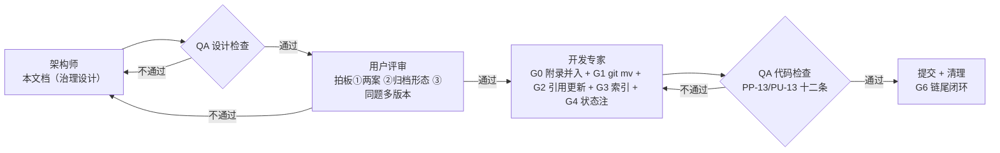

# docs 目录治理设计方案（文档资产治理：命名 / 归档 / 索引）

> 版本 v1.1 | 日期 2026-09-02 | 状态：**已评审通过（2026-09-02 用户批准：方案 A + 归档形态 docs/archive/ + 同题多版本收敛为 v3+附录；QA 设计检查 r1 PASS 附 5 项 MINOR + 1 OBS，本版逐项落位）→ 进入开发实施（G0–G6）**
> 作者：架构师（A1 链第一环 · docs 目录治理设计轮）
> 修订记录：**v1.1**（2026-09-02）= 用户裁决四项落位（ADR-45→方案 A / ADR-43→docs/archive/ / ADR-41③→收敛为 v3+附录 / 状态转已评审）+ QA r1 五项 MINOR 修正（F-1 契约外溢 4→6 行 + 补充盘点、F-2 热度 4 项重算、F-3 调研报告 4 文件/14 处、F-4 v1.5 冻结标注勘正、F-5 ADR-42 措辞收紧）+ OBS-1 对账入档 + 附录方案实施面同步（§4.0.4 全面改写 / 映射表 / 引用清单 14→11 行 / PP-13-7/8 + PU-13-4 新增 / G0 新增 / 风险节）；**v1.0**（2026-09-02）= 初稿（待评审）。
> 盘点证据：`.dsh/tmp/architect/docs-governance-research/{INVENTORY.md, REFS.md}`（轮级临时产物，闭环清理；本文档已内联全部关键结论，不依赖其阅读）
> 纪律声明：本轮**零文件移动/重命名、零 git 写、零 src/ 触碰、零正文内容改写**——实施归开发轮；本设计只动「路径与引用」，不动「内容」。

---

## 〇、一页速览（评审入口——只读本段即可做通过/不通过决定）

### 0.1 一句话总结

`docs/` 现在 **14 个文件平铺、三套命名体系并存、无索引、无归档区**；治理 = **命名规范（增量公式，存量零重命名）+ 归档区（docs/archive/，收纳 5 个已被取代的谱系文档）+ docs/README.md 索引（含谱系链与断链披露）**。**v1.1 落定**：方案 A（平铺规范化）**已选定**（ADR-45，用户 2026-09-02 拍板），方案 B 保留为演化位说明（不再是开放选项）；同题多版本面板卡 v1/v2 **收敛为 v3+附录**——v1/v2 全文原样入 v3 附录 A.1/A.2，archive/ 原件保留双保险（ADR-41③，完整实施语义 §4.0.4）。§四保留两案完整细节供追溯，**实施只走方案 A（§4.1 + G0–G6）**。

### 0.2 治理四动因（证据见 §三）

| # | 动因 | 实物证据 |
|---|---|---|
| 1 | 三套命名体系并存 | 早期主题直名（调研报告）× 0.1.6 式（0.1.6真机缺陷根因分析与解决方案）× 0.1.14+ 式（0.1.14设计方案-通道选择与token适配） |
| 2 | 同题多版本平铺并存 | 面板卡Initializing根因分析 v1/-v2/-v3 三文件并置，谱系关系只藏在各文档头部互链里 |
| 3 | 无索引 | docs/ 无 README；新人/新会话冷启动只能靠 grep 摸索（引用图谱 88 条边无任何集中视图） |
| 4 | 无归档区 | 已被承接/推翻/冻结的 5 份历史谱系文档与 9 份现行文档混居同一平面，热/冷不分 |

### 0.3 评审结论（三个拍板位——2026-09-02 用户已全部裁决）

1. **拍板①（ADR-45）✅ 已裁决**：**方案 A（平铺规范化）当选**；方案 B 保留为演化位说明（≈30 文件量级时重评，R-3），不再是开放选项。
2. **拍板②（ADR-43）✅ 已裁决**：归档形态 = **docs/archive/ 单目录**（冷区语义：archive 原件零改动，见 §4.0.3）。
3. **拍板③（ADR-41③）✅ 已裁决**：同题多版本处置 = **收敛为 v3+附录**（v1/v2 全文原样入 v3 附录 A.1/A.2 + archive/ 原件保留双保险）——完整实施语义见 §4.0.4（v1.1 全面改写，v1.0 的「保留三文件」推荐位作废）。

### 0.4 不做什么（防走样）

正文内容改写 ❌（v1.1 语义界定：v3 文末**追加**附录节属「追加式并入」非改写；附录内 v1/v2 原文一字不改）· 文档删减（任何文件不删除，只迁移/重命名/标注状态；v1/v2 收敛入附录后 **archive/ 原件仍保留**——内容收敛与位置归档双保险，§4.0.4-4）❌ · src/ 触碰 ❌（grep 证实 src 零文件路径引用，零波及）· .dsh/contracts 修改 ❌（契约引用 docs 的 **6 行**路径形引用（v1.1 修正，原记 4 行）列为风险项单独立项，方案 A 下零断裂故本轮无实施必要）· git 写 ❌（本轮只读；实施轮 git mv 在 feature 分支）。

---

## 一、目标与背景

### 1.1 治理动因

`docs/` 是本项目的唯一正式文档区（.dsh/contracts 明文：正式产出 = `docs/`，临时产物 = `.dsh/tmp/`）。经 0.1.0→0.1.16 共 16 个版本、约 20 轮 A1/A2 链后，文档资产积累到 **14 个文件、≈8,000 行、≈214 KB**，出现了四类结构性问题：

1. **命名三体系并存**：同目录内同时存在「早期主题直名」（调研报告、开发报告、架构设计报告…版本号在文档头）、「0.1.6 式」（`0.1.6真机缺陷根因分析与解决方案.md`——版本号前缀 + 长主题句）、「0.1.14+ 式」（`0.1.15修复设计-真机验收问题.md`——版本号 + 类型词 + 短主题）。新文档落名无公式可循，每轮靠临场习惯。
2. **同题多版本平铺**：面板卡 Initializing 谱系 v1/-v2/-v3 三文件并置；谱系方向（谁推翻谁、谁承接谁）只能靠逐个打开文档头互链还原，无集中视图。
3. **无索引**：docs/ 无 README。交叉引用图谱实测 **88 条 stem 级引用边、47 行路径形引用**，全部散落正文；冷启动认知成本高，且引用完整性无处对账。
4. **无归档区**：已被取代的 5 份历史谱系文档（面板卡 v1/v2/v3、面板启动与生命周期、dsh-alpha 原案）与 9 份现行文档混居。历史文档的状态行往往停留在「待评审」（如 0.1.16 文档头仍是「待评审」，而开发报告 §16 台账 + commit `53a3b8b` 证明其已真机验收闭环）——**状态语义只在打开文档内部才可见**。

### 1.2 治理原则（本轮五条铁律）

| # | 原则 | 落地含义 |
|---|---|---|
| P1 | **内容零丢失** | 只动路径（目录迁移）与引用（路径形字面更新）与状态标注（追加式注记，沿 0.1.6 文档 v2.21 迁移注先例）；**不改正文、不删文件、不合并内容** |
| P2 | **git mv 保历史** | 一切迁移用 `git mv`（`git log --follow` 在本仓库已验证可跨提交追溯，见盘点 §二），rename 语义进历史 |
| P3 | **正式产出白名单内** | 全部产物落在 `docs/`（设计文档 + README 索引）与 `.dsh/tmp/architect/`（盘点证据），不外溢 |
| P4 | **最小改动** | 存量 14 文件**文件名零重命名**（命名公式只约束新文档）；引用更新仅限被迁移文件的路径形入边 |
| P5 | **引用完整性硬性检查** | 任何迁移后，全 docs `grep` 旧路径零残留；书名形（§开发报告§）与语义编号形（0.1.14 §3.3 / ADR-30）引用天然存活，不属更新范围 |

---

## 二、范围

### 2.1 做什么（含）

1. **命名规范**：新文档命名公式（覆盖设计/根因/报告/剧本/台账/调研六类 + 版本归属规则 + 同题多版本处置）——§4.0。
2. **归档策略**：归档判据（ADR-42，v1.1 措辞收紧：必要条件 + 时效因子 + 显式列举）+ 归档形态（ADR-43 已拍板：docs/archive/）+ 本轮归档子集（方案 A：5 文件，其中面板卡 v3 先并入附录再迁移——G0）。
3. **目录结构**：两案目标结构（A 平铺 + archive/；B 四类型子目录 + archive/）。
4. **索引**：`docs/README.md`（文件/类型/版本归属/状态/一句话摘要 五列表 + 谱系链 + 已知断链披露）。
5. **逐文件映射表与引用更新清单**：14 文件一个不漏；引用更新逐行给出。
6. **状态追加注**：0.1.16 文档头补「已验收闭环」注、架构设计报告头补「基线滞后」注（追加一行、零正文改动）。

### 2.2 不做什么（不含）

1. **正文内容改写**——除 §2.1-6 的追加式状态注与引用行的字面路径替换外，任何段落文字零改动。
2. **文档删减**——任何文件不删除；不采纳「删除被推翻版本」类做法。
3. **src/ 内路径引用**——grep 证实 src/ 15 个模块对 docs **零文件路径引用**（仅 `ADR-x` / `§x` 语义编号注记），两案均零波及；如未来出现再立项。
4. **.dsh/contracts 内路径引用**——v1.1 修正（QA r1 F-1）：实测 deploy-standard L29/L34、testing-standard L8/L16/**L74**、design-standard **L58** 共 **6 行路径形引用**，目标收敛为 `docs/开发报告.md` / `docs/联调测试剧本.md` 两个文件；书名形 3 处（design-standard L13、coding-standard L26、engineering-baseline L47）。**方案 A 下 6 行目标全留平铺 → 零断裂（复核成立），本轮仅记录**；**方案 B 下断裂 → 契约联动轮单独立项**（A1「修改契约」类需求，不在本轮实施）。
   **F-1 补充盘点（grep 实测，非契约条目）**：`.dsh/skills/dsh-vscode-agent-engineering.md` 2 行路径形（L38→联调测试剧本；L54 一行四目标：调研报告/开发报告/联调测试剧本/环境基线调查报告）、`.dsh/profile.yaml` L27（`gui: docs/联调测试剧本.md`）、`scripts/sim.mjs` 2 行注释引用（L3543→0.1.15修复设计、L4100→0.1.16修复设计）——**方案 A 下上述目标全部留平铺 → 全域零断裂**，如实入档（skills/profile/sim 非契约、非打包面，实施零动作）；目录级 `docs/` 表述 15 处两案均没有影响，不再逐处枚举。
5. **0.1.15/0.1.16 判据回填剧本**——联调剧本补 0.1.15/0.1.16 复测项属内容增量，与治理无关，不在本轮。

---

## 三、盘点与定量分析（证据先行）

### 3.1 逐文档盘点表（14 文件全量人工阅读；完整表见盘点证据文件）

| # | 文件 | 类型 | 版本归属 | 语义状态 | 关键判据 |
|---|---|---|---|---|---|
| 1 | 调研报告.md（201 行） | 调研/方案总纲 | 早期（v4 在头部） | **现行** | 被 4 文件/14 处引用的总纲（v1.1 修正，原记「8 文件」失真） |
| 2 | 环境基线调查报告.md（75 行） | 环境基线 | 早期 | **现行基线** | 沙箱构建根因链在案 |
| 3 | 面板卡Initializing根因分析.md（110 行） | 根因 v1 | 0.1.2 | **历史**→归档候选 | 结论被 v2 深化、修复经 0.1.3→0.1.5 谱系吸收 |
| 4 | …-v2-0.1.3复核.md（177 行） | 根因 v2 | 0.1.3 | **历史**→归档候选 | 头部自述「0.1.3 方案被证明不充分」 |
| 5 | …-v3-0.1.4真机复核.md（280 行） | 根因 v3 | 0.1.4 | **历史**→归档候选 | v4 已实施为 0.1.5 的启动时直接写入修复，链闭环 |
| 6 | 面板启动与生命周期根因分析.md（437 行） | 根因+方案 | 0.1.5/0.1.6 时代 | **历史已实施**→归档候选 | ADR-1…10 载体，detached 基线已落地并被 0.1.6 流水承接 |
| 7 | dsh-alpha适配分析与方案.md（334 行） | 设计原案 | 早期（alpha 主题） | **已被承接**→归档候选 | 0.1.14 设计方案 L384 明示承接其方案 A 原案 |
| 8 | 架构设计报告.md（387 行） | 架构分析 | 早期（基线 0.1.12） | **现行但基线滞后** | 0.1.13–0.1.16 未覆盖；§九清单仍有效 |
| 9 | 0.1.6真机缺陷根因分析与解决方案.md（≥2,795 行 / 684 KB） | 设计+根因流水 | 0.1.6（覆盖至 0.1.14） | **现行权威流水** | ADR-11…28 载体；v2.21 迁移注定案回归流水定位 |
| 10 | 联调测试剧本.md（1,513 行） | 测试剧本 | 早期（滚动 v1.6） | **现行** | §0.11 为 0.1.13+0.1.14 真机判据引用面 |
| 11 | 0.1.14设计方案-通道选择与token适配.md（390 行） | 设计方案 | 0.1.14 | **已闭环实施**（头部状态行滞后） | 开发报告 §16：357 PASS + VSIX sha256 `ed9a237c…` |
| 12 | 0.1.15修复设计-真机验收问题.md（402 行） | 修复设计 | 0.1.15 | **冻结已实施**（v1.1 F-4 标注勘正：文档头**无**「FROZEN」字面状态行——头状态行为「修订后 r5（开发已获批）」；冻结判词在 L402 迁移注「本文档 v1.5 冻结，零其他改动」+ L402 迁移注 0.1.16 接棒） | 开发报告 §16：415 PASS |
| 13 | 0.1.16修复设计-视图页签标题与启动时刻.md（400 行） | 修复设计 | 0.1.16 | **已验收闭环**（头部状态行滞后） | §16：440 PASS/0 FAIL/9 SKIP + commit `53a3b8b`「真机验收 PASS」 |
| 14 | 开发报告.md（508 行） | 开发报告/台账 | 早期（滚动 v1.2） | **现行台账** | §16 版本台账 0.1.13–0.1.16 四行补录 |

> 口径说明（v1.1 OBS-1 对账入档）：编排者任务书「13 文件」为**计数笔误**——任务书自身枚举清单实为 **14 项**，架构师实盘 **14 文件**（`git ls-files docs/` 与目录实物一致），**无差异文件**，全部纳入治理。git 面：14 文件全跟踪、docs/ 无子目录、历史没有删除记录、`--follow` 可用——本轮设计的前提全部成立。

### 3.2 交叉引用图谱（定量）

- **stem 级引用边 88 条**（书名/路径/变体三形态合计）；入边热度（v1.1 按边集 88 条逐项重算修正，QA r1 F-2：原热度行 **4 项核验失败**、合计 97≠88——联调测试剧本 29→**24**、开发报告 16→**14**、0.1.6 流水 12→**11**、dsh-alpha 9→**8**，其余 6 项核对一致）：联调测试剧本 24、开发报告 14、调研报告 14、0.1.6 流水 11、dsh-alpha 8、面板卡谱系 6（v1×5 + 模式形×1）、面板启动与生命周期 4、0.1.14 设计方案 3、环境基线调查报告 3、0.1.16 修复设计 1——**合计 88，与边集逐项对账一致**。
- **路径形引用 47 行**（`docs/*.md` 字面路径，移动必改）：0.1.6 流水 15 行、架构设计报告 7 行（L15 一行双目标）、dsh-alpha 6 行、0.1.14 设计方案 4 行、0.1.15 3 行、开发报告 2 行、环境基线 2 行（含 1 行自引用）、面板卡 v1/v2/v3 各 2 行、联调 1 行、面板启动 1 行。
- **已知断链 1 行**：0.1.6 流水 L2427 → `docs/0.1.5调试用快速操作手册.md`，该文件**从未存在于 git 历史**（计划性断链，非删除所致）。
- **契约外溢 6 行**（v1.1 F-1 修正，原记 4 行；另补充盘点 skills/profile/sim.mjs 共 5 行，见 §2.2-4）+ 书名形 3 处。
- **src/ 与根 README 零路径形引用**；`.vscodeignore` 目录级排除 docs/ → 两案打包产物零变化。

### 3.3 命名三体系现状归纳

| 体系 | 样本 | 特征 | 成因 |
|---|---|---|---|
| 早期主题直名 | 调研报告 / 环境基线调查报告 / 开发报告 / 联调测试剧本 / 架构设计报告 / 面板卡Initializing根因分析 / dsh-alpha适配分析与方案 / 面板启动与生命周期根因分析 | 主题直名、无版本前缀；版本号在文档头（调研报告 v4、架构报告 v1）；同题多版本用 `-vN-` 后缀区分（面板卡 v2/v3） | 0.1.0–0.1.5 时代文档少（≤4 个），平铺直名可维护 |
| 0.1.6 式 | 0.1.6真机缺陷根因分析与解决方案.md | 版本号前缀 + 长主题句；单文件滚动承载多版本（0.1.6–0.1.14）流水 | 0.1.6 起 A1 回环密集，以「缺陷立项」为单位挂版本号，一档到底 |
| 0.1.14+ 式 | 0.1.14设计方案-… / 0.1.15修复设计-… / 0.1.16修复设计-… | `<版本><类型词>-<短主题>`；一版一档 | 0.1.14 评审载体被用户否决后（「为什么一直磕着0.1.6文档写」，见 0.1.14 文档 v1.0 注）确立的一版一档惯例 |

**同题多版本（面板卡 v1/-v2/-v3）成因与语义**：A1 排障回环每轮「根因复核」产出独立文档（各代含独立证据链与裁决），文件名以 `-vN-<轮次语义>` 递进，头部互链构成谱系。三文件是三个链轮的产物，**不是同一文档的三个草稿**。

### 3.4 引用形态分类（治理设计的关键依据）

| 形态 | 样本 | 迁移敏感性 |
|---|---|---|
| 路径形 | `` `docs/联调测试剧本.md` `` | **必改**（目标移动即断） |
| 书名形 | 《开发报告》《调研报告》 | 免疫（除非改名） |
| 语义编号形 | `0.1.14§3.3`、`ADR-30`、`RV-15` | 免疫 |
| 模式形 | `docs/面板卡Initializing根因分析(-v2/-v3).md`（架构报告 L15） | 必改（按目标前缀） |
| 悬空形 | `docs/0.1.5调试用快速操作手册.md`（L2427） | 断链披露，不因治理新增 |

---

## 四、两案设计（用户评审拍板项）

### 4.0 共同底座（两案共用，ADR-41/42/43 承载）

#### 4.0.1 命名公式（**增量规范**：新文档强制，存量零重命名）

```
版本线文档：  <0.1.x><类型词>-<主题短语>.md        例：0.1.17修复设计-xxx.md
              类型词 ∈ {设计方案, 修复设计}；设计+根因合流水档沿用 0.1.6 式长主题句
长期文档：    <主题直名>.md（无版本前缀）          例：开发报告.md、联调测试剧本.md
              版本/状态一律在文档头版本行；新增长期文档须先在 README 索引注册
同题多版本：  首代 <主题>.md；复核代 <主题>-vN-<轮次语义>.md（面板卡 -v2-/-v3- 既有先例）
              不覆盖、不合并；谱系链在 README 索引显式记录
字符约束：    中文主题 + 连字符分段；禁空格与 / \ : * ? " < > |
归档迁移：    仅目录变化（docs/ → docs/archive/），文件名不变
```

#### 4.0.2 归档判据（ADR-42，v1.1 措辞收紧：三条件为**必要条件**，不自动推导归档子集）

**第一步 · 必要条件过滤**（三条件同时满足才**具备归档资格**）：
1. 文档承载的 A1 链**已闭环**（实施+验收 PASS，或被后续设计明确承接/推翻/冻结移交）；
2. 现行文档对其**仅历史溯源引用**、无操作指引引用；
3. 取代关系**有字面记录**（承接注/迁移注/复核推翻注）落在取代方文档中。

**第二步 · 时效因子裁量**（具备资格 ≠ 立即归档）：当轮闭环、或处于接棒链末端仍在活跃引用窗口的版本线文档，默认**保留主区一个评审窗口**；归档子集由当轮设计**显式列举**，不由判据自动推导。（v1.1 F-5：原表述「三条件同时满足才进归档区」在 0.1.15 上产生必要/充分歧义——0.1.15 满足①③、②部分（其 E-FX 判据语义仍被 0.1.16 接棒链引用），按收紧后口径归入第二步保留，归档窗口 = 下轮治理评审重评。）

本轮满足第一步且经第二步显式列举的 5 文件：面板卡 v1（被 v2 深化）、面板卡 v2（被 v3 推翻）、面板卡 v3（v4 已实施）、面板启动与生命周期（被 0.1.6 流水承接）、dsh-alpha（被 0.1.14 设计承接）。**不归档（本轮）**：0.1.6 流水（现行权威载体 + 11 处入边）、**0.1.15**（第一步①③满足、②部分——时效因子保留：0.1.16 接棒链末端，L402 迁移注交付的判据语义仍在活跃引用窗口）、0.1.14/0.1.16（近期闭环版本线，引用面新鲜）、调研/环境基线/架构/开发报告/剧本（现行）。

#### 4.0.3 归档形态（ADR-43 ✅ 已拍板：docs/archive/ 单目录，2026-09-02 用户裁决）

- **docs/archive/ 单目录【已选定】**：目录即状态语义，热/冷一眼分离；文件名不变 → 书名形/文件名形引用语义最大存活，路径形引用只需补前缀；`.vscodeignore` 目录级排除天然覆盖，打包没有影响。**冷区语义（v1.1 随 ADR-41③ 附录方案确立）**：archive/ 原件 = 归档时刻的历史快照，**内部一切字面零改动**（PP-13-2 哈希硬保障）；冷区内指向已迁移目标的旧路径引用**不更新**，语义由 README 谱系链 + 断链披露兜底；PP-13-3 零残留 grep 范围 = docs/ 主区平铺层（archive/ 冷区豁免，豁免行逐条登记于 §4.1.3）。
- **文件名 `-archived` 后缀（已否决备选，留档）**：平铺保持单目录视图，但 47 处路径形引用中命中面更混乱、文件名长度膨胀、且「目录里有 14 个文件其中 5 个是死的」的观感问题依旧。

#### 4.0.4 同题多版本处置（ADR-41③ ✅ 已拍板：收敛为 v3+附录，2026-09-02 用户裁决——v1.0 的「保留三文件」推荐位作废，本节 v1.1 全面改写为实施语义）

**语义总纲**：面板卡 Initializing 谱系三文件收敛为「v3 一文件承载 + v1/v2 全文附录收录」；**archive/ 双保险**——v1/v2 原件移入 archive/ 后**保留不删除**。两条语义并行：附录是**内容收敛**（v3 单文件内自足可读全谱系），archive 是**位置归档**（git 顶层独立历史文件永久在场）——用户「任何文件不删除」要求下二者同时满足，缺一不可。

**（1）内容关系核实（v1.1 三文件全文人工阅读）**：

| 文件 | 行数 | 承载 | 处置 |
|---|---|---|---|
| 面板卡Initializing根因分析.md（v1） | 110 | 0.1.2 首轮根因（boot race + 缺握手 + §5 握手/快照重发方案） | 全文原样入 v3 附录 A.1 + archive/ 原件保留 |
| …-v2-0.1.3复核.md（v2） | 177 | 0.1.3 复核（握手已就位仍复现；缺陷点三分法「单次推送/无 ack/无自愈」；v3 ack 状态机设计） | 全文原样入 v3 附录 A.2 + archive/ 原件保留 |
| …-v3-0.1.4真机复核.md（v3） | 280 | 0.1.4 真机复核（推翻前两轮前提；定位 webview 文档未渲染/未握手；v4 生成时直接写入 src 设计） | **收敛载体**：正文零改动 + 文末追加附录节，随附录版移入 archive/ |

核实结论：v3 **未完整包含** v1/v2 的分析与结论——v3 §零仅链回 v1/v2 文件名、§一概述两轮改动、§二对前两轮根因作裁决（「证伪…证伪…」）；但 v1 §4 并发时序分析 / §5 方案细节、v2 §4.2 缺陷点分析 / §4.3 ack 状态机设计**均未复述**——v3 是「增量复核 + 裁决层」，非全文包含。且 v3 的裁决语句（推翻/深化前两轮结论）**必须能溯源到被裁决原文**，证据链才完整。

**（2）附录并入策略 = (i) v1/v2 全文原样入 v3 附录**（任务书推荐倾向，采纳）。理由：v3 对 v1/v2 是**推翻/裁决关系而非包含关系**——裁决的效力依赖被裁决原文完整在场；(ii)「仅并入 v3 未覆盖的增量段落」需先做逐段覆盖度判定，判定主观、易漏，且被切掉的「重叠段」恰是被裁决原文，破坏「原文可引」性。体量核算：110+177=287 行并入，v3 全文 ≈570 行，与面板启动与生命周期（437 行）同量级、远小于 0.1.6 流水（≥2,795 行），无体量压力。

**（3）内容保真设计（附录结构）**：v3 文末追加一节 `## 附录：历史复核版本（原文收录）`，下设：
- `### A.1 面板卡Initializing根因分析.md（0.1.2 · 原文）`——头注一行（来源文件名 + 归档去向 `docs/archive/同名` + 收录日期）+ 水平分隔线 + **v1 全文原样**；
- `### A.2 面板卡Initializing根因分析-v2-0.1.3复核.md（0.1.3 复核 · 原文）`——同构收 v2 全文。

硬约束三条：①**v1/v2 原文一字不改**（整体搬移 + 来源头注；头注在原文块**之外**，不混入原文）；②**v3 正文零改动**（只在文末追加附录节；「零改动」精确语义 = 附录节起始标记行**之前**的 v3 内容哈希不变，判据 PP-13-8）；③原文块与头注间以水平分隔线隔离，**禁逐段誊写**（防转写漂移；逐字节哈希由 PP-13-7 硬保障）。

**（4）archive/ 双保险（任何文件不删除）**：v1/v2 移入 archive/ 后**原件保留不删除**——附录并入（内容收敛）与 archive 移动（位置归档）是**两条独立语义、同时满足**：附录保证单文件自足可读，archive 原件保证独立历史文件在场（PP-13-2 全文件哈希不变 + PU-13-4 在场对账）。未来若二者需要裁撤其一，属新的用户裁决位，本设计不预设。

**（5）引用更新规则（v1.1 明确）**：
- **外部文档（留平铺的现行文件）指向 v1/v2/v3 的路径形引用 → 一律更新为 `docs/archive/` 新路径**。理由：指向在场原件（永久保真、零二次跳转）、机械可执行（grep + 前缀替换）；不采用「指向 v3 附录锚点」——Markdown 锚点无标准跨文档语法、依赖渲染器，仅用于 README 谱系链导读单点。
- **v3 正文 §零 对 v1/v2 的 2 行引用（L12/L13）→ 零改动**：v3 属归档原件，冷区语义（§4.0.3）适用——archive 原件内部字面零改动；读者经同文档附录 A.1/A.2 原地可达原文。
- **附录原文块内的历史引用（v2 原文 L174 指向 v1 旧平铺路径）→ 零改动**（原文保真优先）；README 断链披露登记：「附录 A.2 L174 所指路径已归档，原文见本文档附录 A.1」。
- **v1/v2 原件内指向留平铺目标的引用（v1 L98/L109、v2 L138 → 联调测试剧本/开发报告）→ 归档后仍有效**（目标零迁移），零更新。

#### 4.0.5 索引设计（两案共用，docs/README.md）

```markdown
# docs 索引
| 文件 | 类型 | 版本归属 | 状态 | 一句话摘要 |            ← 每行对应目录实物一个文件
## 谱系链                                                ← 同题演进 + 承接/推翻/迁移关系
## 已知断链                                              ← L2427 悬空引用披露
## 维护规则（ADR-44）                                     ← 每轮 A1 链尾随提交更新；QA 按 PU-13-1 对账
```

### 4.1 方案 A：轻度（平铺规范化）【推荐】

#### 4.1.1 目标结构

```
docs/
├── README.md                                    ← 新增：五列索引 + 谱系链 + 断链披露
├── 调研报告.md                                  ← 不动
├── 环境基线调查报告.md                          ← 不动
├── 架构设计报告.md                              ← 不动（+头部基线滞后注）
├── 0.1.6真机缺陷根因分析与解决方案.md           ← 不动
├── 联调测试剧本.md                              ← 不动
├── 0.1.14设计方案-通道选择与token适配.md        ← 不动
├── 0.1.15修复设计-真机验收问题.md               ← 不动
├── 0.1.16修复设计-视图页签标题与启动时刻.md     ← 不动（+头部已闭环注）
├── 开发报告.md                                  ← 不动
├── 目录治理设计方案.md                          ← 本文档（不动）
└── archive/                                     ← 新增：归档区（5 文件 git mv 入内，文件名不变；冷区原件零改动）
    ├── 面板卡Initializing根因分析.md             ← 附录 A.1 原文源（原件保留，双保险）
    ├── 面板卡Initializing根因分析-v2-0.1.3复核.md ← 附录 A.2 原文源（原件保留，双保险）
    ├── 面板卡Initializing根因分析-v3-0.1.4真机复核.md ← 先并入附录（G0）再迁移，迁移后全文 ≈570 行
    ├── 面板启动与生命周期根因分析.md
    └── dsh-alpha适配分析与方案.md
```

#### 4.1.2 逐文件映射表（14 文件 + 本文档，一个不漏）

| 现路径 | 新路径 | 动作 |
|---|---|---|
| docs/调研报告.md | docs/调研报告.md | 不动 |
| docs/环境基线调查报告.md | docs/环境基线调查报告.md | 不动 |
| docs/面板卡Initializing根因分析.md | docs/archive/面板卡Initializing根因分析.md | **双动作（v1.1）**：全文原样入 v3 附录 A.1（G0）+ git mv（G1），原件零改动 |
| docs/面板卡Initializing根因分析-v2-0.1.3复核.md | docs/archive/面板卡Initializing根因分析-v2-0.1.3复核.md | **双动作（v1.1）**：全文原样入 v3 附录 A.2（G0）+ git mv（G1），原件零改动 |
| docs/面板卡Initializing根因分析-v3-0.1.4真机复核.md | docs/archive/面板卡Initializing根因分析-v3-0.1.4真机复核.md | **先附录后迁移（v1.1）**：文末追加附录节（G0，正文零改动）+ git mv（G1）；迁移后 ≈570 行 |
| docs/面板启动与生命周期根因分析.md | docs/archive/面板启动与生命周期根因分析.md | git mv |
| docs/dsh-alpha适配分析与方案.md | docs/archive/dsh-alpha适配分析与方案.md | git mv |
| docs/架构设计报告.md | docs/架构设计报告.md | 不动（+状态追加注） |
| docs/0.1.6真机缺陷根因分析与解决方案.md | docs/0.1.6真机缺陷根因分析与解决方案.md | 不动 |
| docs/联调测试剧本.md | docs/联调测试剧本.md | 不动 |
| docs/0.1.14设计方案-通道选择与token适配.md | docs/0.1.14设计方案-通道选择与token适配.md | 不动 |
| docs/0.1.15修复设计-真机验收问题.md | docs/0.1.15修复设计-真机验收问题.md | 不动 |
| docs/0.1.16修复设计-视图页签标题与启动时刻.md | docs/0.1.16修复设计-视图页签标题与启动时刻.md | 不动（+状态追加注） |
| docs/开发报告.md | docs/开发报告.md | 不动 |
| （v1.1 新增实施项） | docs/面板卡…-v3-0.1.4真机复核.md（文末附录节） | G0 附录并入（A.1 = v1 原文 / A.2 = v2 原文，实施语义见 §4.0.4） |
| （新增） | docs/README.md | 创建 |
| （本文档） | docs/目录治理设计方案.md | 已在（进索引） |

#### 4.1.3 引用更新清单（v1.1 重算：14 行 → **11 行**，逐行可执行）

**重算依据（附录方案 + archive 冷区语义联动）**：v1.0 清单原 14 行中 #2/#3/#4（面板卡v2 L174、面板卡v3 L12/L13）位于**将被归档的文件内部**——若更新则违反 PP-13-2「迁移文件哈希不变」硬判据（v1.0 未暴露的内在矛盾，v1.1 随附录方案统一消除）：按 archive 冷区语义（§4.0.3 / §4.0.4-5），**凡移入 archive/ 的 5 文件内部字面零改动**，该 3 行移出更新范围（README 谱系链 + 断链披露兜底）。留平铺的现行文件对归档目标的路径形入边全部更新（外部引用一律指 `docs/archive/` 新路径，规则见 §4.0.4-5）：

| # | 文件:行 | 现引用 | 改为 |
|---|---|---|---|
| 1 | 开发报告.md L224 | `docs/面板卡Initializing根因分析.md` | `docs/archive/面板卡Initializing根因分析.md` |
| 2 | 架构设计报告 L15 | `docs/面板启动与生命周期根因分析.md` + `docs/面板卡…(-v2/-v3).md`（一行双目标） | 两目标均补 `docs/archive/` 前缀 |
| 3 | 0.1.6流水 L95 | `docs/面板启动与生命周期根因分析.md` | `docs/archive/面板启动与生命周期根因分析.md` |
| 4 | 0.1.14设计方案 L236 | `docs/dsh-alpha适配分析与方案.md` | `docs/archive/dsh-alpha适配分析与方案.md` |
| 5 | 0.1.14设计方案 L384 | `docs/dsh-alpha适配分析与方案.md` | 同上 |
| 6 | 0.1.6流水 L643 | `docs/dsh-alpha适配分析与方案.md` | 同上 |
| 7 | 0.1.6流水 L1963 | `docs/dsh-alpha适配分析与方案.md` | 同上 |
| 8 | 0.1.6流水 L1966 | `docs/dsh-alpha适配分析与方案.md` | 同上 |
| 9 | 0.1.6流水 L2795 | `docs/dsh-alpha适配分析与方案.md` | 同上 |
| 10 | 架构设计报告 L17 | `docs/dsh-alpha适配分析与方案.md` | 同上 |
| 11 | 0.1.15修复设计 L115 | `docs/面板卡Initializing根因分析-v3-0.1.4真机复核.md` | `docs/archive/面板卡…-v3-0.1.4真机复核.md` |

**冷区豁免登记（不更新，披露兜底，PP-13-3 grep 豁免边界 = archive/）**：①面板卡v2 原件 L174（→v1 旧平铺路径）；②面板卡v3 正文 L12（→v2 旧平铺路径）；③面板卡v3 正文 L13（→v1 旧平铺路径）——归档后指向失效，语义分别由附录 A.1/A.2 原地可达 + README 谱系链兜底。

**README 索引侧（新建文件内容，非存量行更新）**：谱系链登记「v1/v2 原文收录于 v3 附录 A.1/A.2」锚点行；断链披露登记上述冷区豁免 3 行注记。

附（可选，断链修复）：0.1.6流水 L2427 悬空引用 `docs/0.1.5调试用快速操作手册.md` → 改指 `docs/联调测试剧本.md`（语义等价：实验 A/B/C 剧本实际落于剧本）；不改则 README 断链披露兜底。

#### 4.1.4 风险与代价

| 风险 | 等级 | 缓解 |
|---|---|---|
| 归档后书名形引用仍指旧语义位（如「见《面板启动与生命周期根因分析》」无路径，读者需经索引找 archive/） | 低 | README 索引 + 谱系链承接；书名形引用本就无路径可断 |
| 平铺 + archive 两级结构仍并存 11 个现行文件 | 低 | 索引按类型/版本排序承担导航 |
| 引用更新漏行 | 低 | 判据 PP-13-3 主区 grep 零残留硬性检查 + 11 行清单逐行对账（冷区豁免 3 行另登记） |
| 【v1.1】附录并入大文件 append 失误：追加位置错（非文末）/ 行尾编码漂移（CRLF↔LF、BOM）/ 原文与头注粘连 | 中 | PP-13-8 前缀哈希硬性检查（追加位置错即 FAIL）+ PP-13-7 逐字节哈希硬性检查（编码漂移即 FAIL）+ 实施规约「整体块搬移、禁逐段誊写、头注独立行 + 分隔线隔离」 |
| 【v1.1】锚点引用失效：README 谱系链附录锚点与 v3 实际节名漂移 | 低 | PU-13-4 索引对账（锚点行与附录实际节名脚本比对）；外部引用一律指 archive 新路径（不依赖锚点），锚点仅 README 单点维护 |
| 【v1.1】冷区豁免被误读为「引用断裂未处理」 | 低 | ADR-43 冷区语义成文（§4.0.3）+ README 断链披露逐行登记豁免 3 行（§4.1.3） |

**维护成本（后续每轮新增文档）**：落位规则 = 平铺 + 命名公式 + README 加一行。决策成本仅「类型词/版本前缀」一次选择；无目录选择成本。存量增速参考：0.1.14 起一版一档 ≈ 2 文件/版本迭代，平铺在 ~30 文件量级内索引仍可一眼总览；届时可再评审是否升级到方案 B（本文档 ADR-45 留演化位）。

### 4.2 方案 B：重排（类型子目录）

#### 4.2.1 目标结构（按文档类型分组——推荐于按版本线分组，理由：长期文档跨版本滚动，按版本线切会把 开发报告/联调剧本 这类活文档无家可归；类型是文档的稳定属性，版本是易变属性）

```
docs/
├── README.md                                        ← 新增
├── design/
│   ├── dsh-alpha适配分析与方案.md
│   ├── 0.1.14设计方案-通道选择与token适配.md
│   ├── 0.1.15修复设计-真机验收问题.md
│   └── 0.1.16修复设计-视图页签标题与启动时刻.md
├── rootcause/
│   ├── 面板卡Initializing根因分析.md
│   ├── 面板卡Initializing根因分析-v2-0.1.3复核.md
│   ├── 面板卡Initializing根因分析-v3-0.1.4真机复核.md
│   ├── 面板启动与生命周期根因分析.md
│   └── 0.1.6真机缺陷根因分析与解决方案.md           ← 混合型（设计+根因流水）：标题主语「根因分析」→ rootcause
├── reports/
│   ├── 调研报告.md
│   ├── 环境基线调查报告.md
│   ├── 架构设计报告.md
│   └── 开发报告.md
├── test-scripts/
│   └── 联调测试剧本.md
├── archive/                                         ← 归档判据同 ADR-42，自下轮起启用（本轮 B 已按类型分拣，暂无新增归档）
└── 目录治理设计方案.md                              ← 专项设计，本轮平铺，下轮按归档判据处置
```

#### 4.2.2 逐文件映射表（14 文件全量迁移，一个不漏）

| 现路径 | 新路径 |
|---|---|
| docs/调研报告.md | docs/reports/调研报告.md |
| docs/环境基线调查报告.md | docs/reports/环境基线调查报告.md |
| docs/面板卡Initializing根因分析.md | docs/rootcause/面板卡Initializing根因分析.md |
| docs/面板卡Initializing根因分析-v2-0.1.3复核.md | docs/rootcause/面板卡Initializing根因分析-v2-0.1.3复核.md |
| docs/面板卡Initializing根因分析-v3-0.1.4真机复核.md | docs/rootcause/面板卡Initializing根因分析-v3-0.1.4真机复核.md |
| docs/面板启动与生命周期根因分析.md | docs/rootcause/面板启动与生命周期根因分析.md |
| docs/dsh-alpha适配分析与方案.md | docs/design/dsh-alpha适配分析与方案.md |
| docs/架构设计报告.md | docs/reports/架构设计报告.md |
| docs/0.1.6真机缺陷根因分析与解决方案.md | docs/rootcause/0.1.6真机缺陷根因分析与解决方案.md |
| docs/联调测试剧本.md | docs/test-scripts/联调测试剧本.md |
| docs/0.1.14设计方案-通道选择与token适配.md | docs/design/0.1.14设计方案-通道选择与token适配.md |
| docs/0.1.15修复设计-真机验收问题.md | docs/design/0.1.15修复设计-真机验收问题.md |
| docs/0.1.16修复设计-视图页签标题与启动时刻.md | docs/design/0.1.16修复设计-视图页签标题与启动时刻.md |
| docs/开发报告.md | docs/reports/开发报告.md |
| （新增） | docs/README.md |

#### 4.2.3 引用更新清单（46 行全量 + 契约 4 行联动）

- §三-3.2 表中 **47 行路径形引用除环境基线 L72 自引用行随迁改写外全部按映射表前缀替换**（即 46 处外部行 + 1 处自引用行）；
- **另需契约联动 4 行**（deploy-standard L29/L34、testing-standard L8/L16——`docs/开发报告.md` → `docs/reports/开发报告.md`、`docs/联调测试剧本.md` → `docs/test-scripts/联调测试剧本.md`），按任务书属「契约内路径引用」单独立项，**不在本轮实施** → B 案在本轮实施后、契约联动轮完成前存在一个**已知的临时断裂窗口**（仅影响契约文本导航，不影响代码/打包）。

#### 4.2.4 风险与代价

| 风险 | 等级 | 缓解 |
|---|---|---|
| 引用更新范围 46 行（方案 A 的 3.3 倍）+ 契约临时断裂窗口 | 中 | PP-13-3 硬性检查 + 47 行映射逐行对账；契约联动轮排期 |
| 混合型文档归类歧义（0.1.6 流水 design vs rootcause；目录治理设计方案） | 中 | §4.2.1 已给出判定规则（标题主语优先），但规则本身是长期摩擦点 |
| git mv 14 文件一次性改名面大，回滚/审阅噪音大 | 中 | 单独 commit（docs-only），`--follow` 保追溯 |
| 子目录后 .vscodeignore/契约中目录级 `docs/` 表述仍兼容 | 低 | 目录级排除通配子目录，没有影响 |

**维护成本**：落位规则 = 选子目录（4 选 1）+ 命名公式 + README 加一行；混合型文档需先跑归类规则。收益 = 目录即类型（无索引时也可导航）。

### 4.3 两案对比与推荐

| 维度 | 方案 A 平铺规范化 | 方案 B 类型子目录 |
|---|---|---|
| 文件迁移量 | **5**（git mv） | 14（git mv） |
| 引用更新量 | **11 行**（v1.1 重算，+1 可选断链修复）+ G0 附录并入（v3 ≈570 行） | 46 行 + 契约 6 行（临时断裂窗口） |
| 契约断裂 | **零**（6 行外溢目标全留平铺，v1.1 F-1 复核成立） | 6 行（待契约联动轮） |
| 内容零丢失/零重命名 | 满足（文件名全部不变） | 满足（文件名全部不变） |
| 导航收益 | README 索引承担 | 目录 + 索引双承担 |
| 新增文档落位成本 | 类型词一次选择 | 目录 4 选 1 + 混合型归类规则 |
| 长期演化 | archive/ 内可再分（演化位 ADR-45） | 结构一步到位，但摩擦点前置 |

**推荐：方案 A（✅ 2026-09-02 用户拍板选定，ADR-45）**。理由：①引用完整性代价差一个数量级（11 行 vs 46+6 行），且 A 案下契约外溢**零断裂**、B 案引入已知断裂窗口——P5 硬性检查下 A 的实施风险显著更低；②14 文件体量未到需要类型目录分拣的规模，README 索引已提供导航收益的大部分；③用户裁决先例偏好最小改动（0.1.15 v1.3「不要搞复杂设计」）；④A 案保留向 B 演化的余地（archive/ 内再分或全量重排均可后补），反之 B→A 不可逆成本高。

> v1.1 注：方案 B 全节（§4.2）保留为**演化位说明**（ADR-45），不再是开放选项；重评触发条件见 R-3（≈30 文件量级）。

---

## 五、ADR 决策记录

| ADR | 决策 | 理由与备选 | 状态 |
|---|---|---|---|
| ADR-41 | 命名规范 = **增量公式**（§4.0.1）+ **存量 14 文件零重命名** + 同题多版本③**收敛为 v3+附录**（v1/v2 全文原样入 v3 附录 A.1/A.2 + archive/ 原件保留双保险，实施语义 §4.0.4） | 存量重命名将引爆 88 条引用边且零功能收益；③项用户 2026-09-02 裁决反转 v1.0 推荐——v3 对 v1/v2 是裁决关系而非包含关系，收敛后 v3 单文件自足可读全谱系，且 archive 原件双保险不违反内容零丢失（§4.0.4-2/-4）。备选（全量改名对齐公式 / 保留三文件）已评估并否决（§4.0.4） | **已裁决（用户 2026-09-02 拍板③）** |
| ADR-42 | 归档判据 = 三条件**必要条件**过滤（链闭环 / 仅溯源引用 / 取代关系有字面记录）+ 时效因子裁量 + 当轮显式列举归档子集 | 防止「看着老就归档」；0.1.6 流水虽最老但是现行权威载体（反例锚点）。v1.1 措辞收紧（F-5）：消除 0.1.15 的必要/充分歧义（§4.0.2） | **已评审通过（随方案 A 批准生效；v1.1 措辞收紧）** |
| ADR-43 | 归档形态 = **docs/archive/ 单目录**（备选：`-archived` 文件名后缀，已否决留档）+ 冷区语义（原件零改动 / 历史引用不更新 / grep 主区豁免冷区） | 目录即状态、文件名不变保引用语义、.vscodeignore 天然覆盖（§4.0.3）；冷区语义随 ADR-41③ 附录方案确立 | **已裁决（用户 2026-09-02 拍板②）** |
| ADR-44 | 索引维护责任 = docs/README.md **每轮 A1 链尾随提交更新**（开发轮落盘，QA 代码检查按 PU-13-1 对账）；状态语义以「索引 + 开发报告 §16 台账」为权威，文档头状态行滞后时以追加注对齐 | 索引不更新即腐烂；把维护挂在既有链尾（提交+清理环节）没有新增仪式成本 | **已评审通过（随方案 A 批准生效）** |
| ADR-45 | 治理结构 = **方案 A（平铺规范化）**；方案 B（类型子目录重排）保留为**演化位说明**（≈30 文件量级时重评，R-3），不再是开放选项 | §4.3 对比表（引用代价 11 行 vs 46+6 行 / 契约零断裂 / 最小改动先例） | **已裁决（用户 2026-09-02 拍板①）** |

---

## 六、验收判据（新命名空间 PP-13 / PU-13，全部无头可断言）

> 无部署轮/无真机轮 → 不设 RV 判据；基线锚点 = 0.1.16 台账（440 PASS / 0 FAIL / 9 SKIP；tsc 0 errors）。

| # | 判据 | 断言方式 |
|---|---|---|
| PP-13-1 | 迁移映射逐条核对：映射表每行「新路径存在 + 旧路径消失」，一行不漏 | 按所选案映射表逐行 `Test-Path` / `git ls-files docs/` 对账 |
| PP-13-2 | 内容哈希逐位不变（v1.1 口径修正）：archive 原件（面板卡 v1/v2、面板启动与生命周期、dsh-alpha）迁移前后**全文件** SHA256 相等；v3 因 G0 附录并入特例拆分——附录节起始标记**之前**内容哈希相等（前缀零改动，断言对象移交 PP-13-8） | 迁移前批量 `Get-FileHash` 存底 → 迁移后重算比对，全等 |
| PP-13-3 | 引用完整性：docs/ **主区平铺层** `grep` 旧路径（`docs/面板卡Initializing根因分析` 等被迁移目标）零残留；路径形引用全部指向新路径或 README 索引（v1.1 范围修正：archive/ 冷区豁免，豁免 3 行登记于 §4.1.3） | 按引用更新清单行号 + 主区 `Select-String` 双重核验（冷区排除） |
| PP-13-4 | git 历史保留：每个被迁移文件 `git log --follow` 可达迁移前提交（git mv rename 语义成立） | 逐文件 `git log --follow --oneline` 非空且含迁移前 commit |
| PP-13-5 | 基线不回归 A：`npm run compile`（tsc）0 errors | docs 变更不涉编译，此条证明零波及 |
| PP-13-6 | 基线不回归 B：`node scripts/sim.mjs` = 440 PASS / 0 FAIL / 9 SKIP（与 0.1.16 台账逐位一致） | 无头回归实跑比对 |
| PP-13-7 | 【v1.1】附录内容保真：v3 附录 A.1/A.2 内 v1/v2 原文与实施前原文件**逐字节一致**（各自 SHA256 相等；行尾/编码零漂移） | 附录节内原文块提取哈希 vs 迁移前 v1/v2 原文件存底哈希，逐一相等 |
| PP-13-8 | 【v1.1】v3 正文零改动：v3 附录节起始标记行**之前**的内容哈希 = 实施前 v3 全文件哈希（G0 只追加、不改前缀的硬证明） | 前缀内容提取哈希 vs 实施前 v3 存底哈希，相等 |
| PU-13-1 | 索引与实物一致：docs/README.md 索引表行集 = 目录实际文件集（含 archive/），双向对账零差异 | 列目录 vs 索引行脚本比对 |
| PU-13-2 | 索引元数据准确：类型/版本归属/状态列与文档头状态行（及追加注）一致；两处追加注（0.1.16 已闭环、架构报告基线滞后）落位且为纯追加 | 逐行人工+脚本核对 |
| PU-13-3 | 触碰面红线合规：本轮实施新增/修改文件仅限 白名单（README 新建 + 映射表迁移 + 引用更新清单 **11 行** + 2 处追加注 + **v3 附录并入（G0）**），不改写正文、不删除（v1/v2 收敛后 archive 原件在场）、src/ 与 .dsh/contracts 不触碰、不做 main/master git 写 | `git status`/`git diff --stat` 白名单比对 |
| PU-13-4 | 【v1.1】archive 双保险对账：docs/archive/ 内 v1/v2/v3 原件在场且哈希与实施前逐一相等；docs/README.md 谱系链含「v1/v2 → v3 附录 A.1/A.2」锚点行且与附录实际节名一致 | `Test-Path` + 逐文件哈希比对 + 索引锚点行脚本对账 |

---

## 七、实施清单与链形收敛

### 7.1 实施清单（角色标注）

| # | 事项 | 目标角色 |
|---|---|---|
| G0 | 【v1.1 新增】附录并入（**先于一切移动**，实施语义 §4.0.4）：①存底 v1/v2/v3 三文件 SHA256（供 PP-13-7/8/PU-13-4）→ ②v3 文末追加「附录：历史复核版本（原文收录）」节——A.1 = v1 全文原样 / A.2 = v2 全文原样，各带来源头注（文件名 + archive 去向 + 收录日期）+ 分隔线，**整体块搬移、一字不改、禁逐段誊写** → ③PP-13-7/PP-13-8 逐字节校验（附录内原文哈希 = v1/v2 原件哈希；v3 前缀哈希 = 实施前 v3 哈希）→ ④校验通过方可进入 G1 | 【开发专家】 |
| G1 | git mv 5 文件 → docs/archive/（**含附录已并入的 v3**；文件名不变），迁移前批量 SHA256 存底核对（供 PP-13-2/PU-13-4）；B 案 14 文件映射（§4.2.2）仅存档追溯，不执行 | 【开发专家】 |
| G2 | 路径形引用同步更新（v1.1 重算：§4.1.3 共 **11 行** + 1 可选断链修复；冷区 3 行豁免不更新、登记披露）；书名形/语义编号形不触碰 | 【开发专家】 |
| G3 | 创建 docs/README.md 索引（五列表 + 谱系链【含 v1/v2 → v3 附录 A.1/A.2 锚点行】+ 已知断链披露【含冷区豁免 3 行】+ ADR-44 维护规则） | 【开发专家】 |
| G4 | 状态追加注 2 处：0.1.16 文档头「已验收闭环（开发报告 §16 + commit 53a3b8b，头部状态行滞后补注）」；架构设计报告头「分析基线 0.1.12，0.1.13–0.1.16 演进未覆盖」——均为版本行后追加一行、零正文改动 | 【开发专家】 |
| G5 | QA 代码检查：按 PP-13-1…8 + PU-13-1…4 **十二条**无头审计（映射核对/哈希对账/主区引用零残留/--follow/tsc/sim/索引对账/红线合规/附录保真三断言），产出审计 JSON | 【QA】 |
| G6 | 链尾：feature 分支提交（docs-only 单 commit；不碰 main/master）+ 闭环清理（`.dsh/tmp/architect/docs-governance-research/` 与 `.dsh/reports/`） | 【开发专家】+【编排者】 |

### 7.2 链形收敛（A1 链缺环声明）



**收敛理由（无部署轮/无真机轮）**：docs 变更不产 VSIX（`.vscodeignore` 目录级排除 docs/，打包产物逐位不变）、不涉任何运行时行为 → 无部署专家轮、无真机验收轮（无 RV 判据）；纯文件面变更且判据全部无头可断言（grep/git/哈希/tsc/sim）→ 无 GUI 联调层；故 A1 链收敛为 架构师 → QA 设计 → 用户评审 → 开发 → QA 代码 → 提交+清理 六环。

### 7.3 风险项单独立项登记

| # | 风险项 | 触发条件 | 处置 |
|---|---|---|---|
| R-1 | .dsh/contracts **6 行**路径形引用（v1.1 F-1 修正：deploy-standard L29/L34、testing-standard L8/L16/L74、design-standard L58） | 仅方案 B 拍板时断裂（未当选） | 契约联动轮（A1「修改契约」类）单独立项；方案 A 下零断裂仅记录 |
| R-2 | 断链 `docs/0.1.5调试用快速操作手册.md`（0.1.6流水 L2427，从未存在） | 恒在（既有） | G2 可选项修正引用 或 README 断链披露兜底，评审时定 |
| R-3 | 平铺规模再增长（≈30 文件） | 未来 2–3 个版本迭代 | ADR-45 保留演化位：届时重评方案 B/子目录化 |
| R-4 | 【v1.1】附录方案实施风险：大文件 append 失误（位置/行尾/粘连）、README 锚点漂移、冷区豁免误读 | G0 附录并入与 G3 索引登记时 | §4.1.4 三项缓解（PP-13-7/8 哈希硬性检查 + PU-13-4 对账 + 冷区语义成文）；G5 QA 审计含对应断言 |

---

## 八、评审状态

| 项 | 值 |
|---|---|
| 状态 | **已评审通过（2026-09-02）**：QA 设计检查 r1 PASS（5 项 MINOR + 1 OBS，本版逐项落位）→ 用户评审拍板①②③全部裁决（方案 A + docs/archive/ + v3+附录）并**批准进入实施** → 开发 G0–G4 → QA 代码检查 G5 → 提交+清理 G6 |
| 拍板位 | ADR-45（两案）· ADR-43（归档形态）· ADR-41③（同题多版本处置）**均已裁决**（结论见 §五 ADR 表）；余留裁决位：R-2（断链处置，可选项，实施时定） |
| 证据可追溯 | 盘点表/引用图谱/谱系链：`.dsh/tmp/architect/docs-governance-research/{INVENTORY.md, REFS.md}`（本文档已内联关键结论） |
| 本轮触碰面 | 仅本文档 1 个新文件 + 盘点证据 2 个文件；零移动/零重命名/零 git 写/零 src/ 与 contracts 触碰/不碰运行中进程 |
